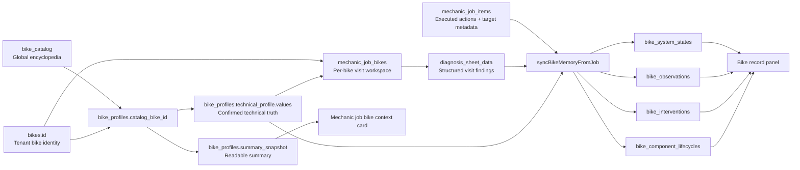
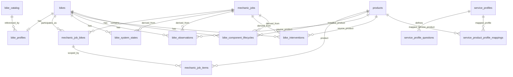

# Bike Workshop Master Schema

Last updated: 2026-04-16
Status: Living architecture document
Scope: Bike encyclopedia, bike profile, diagnosis, workshop items, service wizard, bike memory kernel, sync pipeline, and visible bike history

## Why This File Exists

This is the canonical backbone document for the bike workshop implementation.

It exists because the system is no longer just a job form with notes. It is becoming a centralized technical memory system for bicycles, where:

- the bike is the permanent anchor
- the bike profile is the confirmed technical baseline
- the job is the visit-specific workspace
- the diagnosis sheet is the structured technical snapshot for that visit
- the job items and service products are the executed actions
- the bike memory kernel is the cross-visit output

This file must stay ahead of implementation drift.

If the implementation changes and this file is not updated, the implementation is considered undocumented and incomplete.

## Mandatory Maintenance Rule

Any time an agent or developer changes any of the following, they must update this file in the same task:

- bike encyclopedia / bike catalog
- bike form dialog and bike profile creation flow
- bike creation wizard / intake wizard as the upstream data-entry layer
- bike profile schema or summary rules
- mechanic job bike structure
- diagnosis sheet template or fields
- mechanic job item targeting and service item behavior
- service wizard questions, mapping, or UI rules
- bike memory sync orchestration
- bike record panel / visible history
- any database schema that changes this backbone

They must also update `/.github/copilot-instructions.md` with the same architectural direction and the reference to this file.

## Mandatory Whole-Backbone Inspection Rule

Any substantive semantic change to one bike workshop layer must trigger an inspection of the rest of the backbone in the same task.

This is not optional.

Do not patch one layer in isolation and then only later realize that the related upstream or downstream layers cannot represent the same concept.

If you change a diagnosis field, service-wizard mapping, bike-profile technical key, catalog spec, job-item targeting rule, or bike-memory sync behavior, you must inspect the rest of the chain before calling the task complete.

At minimum, inspect these layers for the changed concept:

1. `bike_catalog` / encyclopedia reference model:
  Can shared model data represent the concept, or is the catalog guaranteed to stay silent about it?
2. `bike_profiles.technical_profile.values`:
  Should the concept exist as durable upstream bike truth, or is it strictly visit-specific?
3. `mechanic_job_bikes.diagnosis_sheet_data`:
  Does the visit-layer diagnosis store the concept with the same semantics and naming?
4. `service_profiles`, `service_profile_questions`, and wizard mappings:
  Do live service questions expose the same concept, and do they use compatible answer vocabulary?
5. `mechanic_job_items` / executed service rows:
  Does the service execution layer target the same system/component without inventing a second vocabulary?
6. bike memory sync + visible read models:
  If the concept should survive across visits, does the sync pipeline project it into the right kernel/read layer?

The point is not that every concept must live in every layer.

The point is that every change must explicitly prove which layers should know about the concept, which layers should not, and whether the existing wiring is coherent.

### Hydraulic-Brake Example

If you add or refine hydraulic-brake diagnosis semantics such as bleed/purge need, fluid contamination, piston behavior, or hydraulic symptom severity, you must inspect all of the following before finishing:

- does `bike_catalog` already feed any hydraulic-brake baseline data for known models?
- does `bike_profiles.technical_profile.values` store the durable hydraulic baseline that belongs to the bike, instead of leaving it implicit?
- does `mechanic_job_bikes.diagnosis_sheet_data` use the same semantic keys for visit findings?
- do the relevant `service_profiles` and `service_profile_questions` for purge / brake maintenance / caliper service expose matching wizard questions and option vocabulary?
- do `service_product_profile_mappings` and `mechanic_job_items` target the same brake system/service meaning instead of inventing a disconnected label?
- does the bike-memory sync pipeline project the relevant cross-visit fact or intervention if it should persist?

If one of those layers cannot represent the new concept yet, that gap must be fixed or explicitly documented in the same task.

### Definition Of Done For Backbone Changes

A bike workshop architecture task is incomplete if it changes one layer but does not inspect the other affected layers.

Working UI in one screen is not enough.

The task is only done when the changed concept has been checked across the backbone and the centralization story is still coherent.

## Fresh Agent Guardrail

This section exists specifically for fresh agents that do not yet have the historical context of this implementation.

These guardrails are meant to prevent architecture drift, not to block justified progressive improvement.

Agents are still allowed to evolve the architecture when the current layers are genuinely insufficient, but they must do it deliberately, verify the live system first, and document the change in this file instead of improvising a side path.

If you are a fresh agent touching bike workshop architecture, do not start by proposing a solution.

Start by proving that you understand the current system.

### Required Read Order Before Changing Anything

Read these exact files first, in this order:

1. `BIKE_WORKSHOP_MASTER_SCHEMA.md`
2. `.github/copilot-instructions.md`
3. `supabase/sql/core_schema.sql`
4. `lib/modules/bikeshop/models/bikeshop_models.dart`
5. `lib/modules/bikeshop/services/bikeshop_service.dart`
6. `lib/modules/bikeshop/pages/bike_form_dialog.dart`
7. `lib/modules/bikeshop/pages/mechanic_job_form_page.dart`
8. `lib/modules/bikeshop/widgets/bike_system_controller.dart`
9. `lib/modules/bikeshop/widgets/bike_record_panel.dart`
10. `lib/modules/bikeshop/widgets/service_wizard_dialog.dart`
11. `lib/modules/bikeshop/services/service_wizard_service.dart`
12. `lib/modules/bikeshop/config/brake_canonical_data.dart`
13. `lib/shared/models/bike_catalog_models.dart`
14. `lib/shared/services/bike_catalog_service.dart`

If the change touches historical context or prior implementation intent, also read:

- `BIKE_WORKSHOP_CENTRAL_MEMORY_MODEL_2026-04-09.md`
- `/memories/repo/bike-workshop-central-memory-kernel.md`
- `/memories/repo/bike-workshop-component-intelligence-correction.md`
- `/memories/repo/bike-workshop-diagnosis-sheet-layer.md`
- `/memories/repo/bike-workshop-job-form-sync.md`
- `/memories/repo/bike-workshop-memory-reconciliation.md`
- `/memories/repo/bike-workshop-service-taxonomy-audit.md`
- `/memories/repo/bike-workshop-service-wizard-profile-gating.md`
- `/memories/repo/bike-workshop-v1-profile-layer.md`
- `/memories/repo/bike-workshop-fresh-agent-handoff-2026-04-16.md`

Do not skip the schema file, do not skip the current Flutter orchestration files, and do not skip the shared bike-system controller if the task touches diagnosis, bike history, or service flows.

### Shared Controller Contract (Current Code-Side Rule)

The shared bike map is no longer just a visual helper.

`lib/modules/bikeshop/widgets/bike_system_controller.dart` is now a core backbone widget and must be treated as a single behavior authority.

Fresh agents must preserve these exact rules unless they are deliberately redesigning the shared controller and documenting that redesign here:

- `BikeSystemController` is the shared bike-system map/controller for mechanic-job diagnosis and bike record/history. Do not fork a second local bike map.
- `selectedSystemKey` is the parent-driven highlight key only. It is not the gate for the exploded detail image.
- the exploded detail image is gated internally by the controller's explicit user-tap state. Parents must not try to re-implement or second-guess that state.
- `onClearSelection` is notification-only so the parent can clear its own selected key after the user exits the detail view. It must not be used to conditionally enable or disable the detail view.
- hover preview state is intentionally internal to the controller: pin hover is local to each pin and overlay rendering is driven from an internal notifier. Do not lift hover state back into parent `setState`, or the `MouseRegion` rebuild loop / flicker bug returns.
- the current shared registry exposes `cockpit`, `suspension`, `front_brake`, `wheels`, `drivetrain`, and `rear_brake` everywhere the controller is used.
- only `drivetrain`, `front_brake`, and `rear_brake` are currently modeled as structured editable diagnosis systems in the mechanic job form. `cockpit`, `suspension`, and `wheels` intentionally route to explicit unavailable-system placeholders instead of a second reduced controller.

### Mandatory Live Verification Protocol

Before changing bike workshop architecture, verify how production is actually behaving at that moment.

You must inspect live data using the already-documented access patterns in `.github/copilot-instructions.md`:

- REST queries with service role for fast inspection
- direct `psql` with the documented project password for exact SQL when needed

The purpose is not to deploy random SQL.

The purpose is to confirm the current reality before changing code or schema.

At minimum, inspect the live shape of the relevant objects for the target tenant:

- `bike_profiles`
- `mechanic_job_bikes`
- `mechanic_job_items`
- `service_profiles`
- `service_product_profile_mappings`
- `service_profile_questions`
- any affected bike memory kernel table

If the task is about diagnosis or service wizard behavior, verify the live service profile mappings and actual question keys before editing code.

This matters because the real production shape has already differed from assumptions before.

Known example:

- the live brake service family was `brake`, not `brakes`

That single mismatch was enough to make code look correct while the live system still behaved wrong.

### Search-First Rule

Before adding any column, field, function, enum path, or new JSON structure, prove that it does not already exist.

Search first in:

- `supabase/sql/core_schema.sql`
- `lib/modules/bikeshop/models/bikeshop_models.dart`
- `lib/modules/bikeshop/services/bikeshop_service.dart`
- `lib/modules/bikeshop/pages/mechanic_job_form_page.dart`
- `lib/modules/bikeshop/services/service_wizard_service.dart`

If an existing field can carry the meaning, use it.

If an existing upstream layer can answer the question, consume it instead of storing it again.

### Prohibited Drift Patterns

Fresh agents should treat the following as prohibited by default unless they can clearly prove the current layers are insufficient and document the new direction in this file:

- a new parallel bike truth store outside `bike_profiles`
- a second unofficial diagnosis store outside `mechanic_job_bikes.diagnosis_sheet_data`
- service wizard answers treated as technical truth without explicit projection into diagnosis or profile-backed logic
- duplicate front/rear targeting fields when `system_key`, `component_slot_key`, and `location_key` already solve the problem
- new bike memory summary tables that duplicate `bike_system_states`, `bike_observations`, `bike_interventions`, or `bike_component_lifecycles`
- new profile-like JSON blobs on job rows for facts that belong in `bike_profiles`
- new diagnosis fields that ignore known upstream bike profile truth
- new wizard questions that restate already-known baseline specs without a confirmation/correction reason
- new history/timeline layers that bypass the memory kernel

### Mandatory Questions Before Proposing Any Change

The agent must answer these explicitly to itself before editing:

1. Is this fact global encyclopedia data, bike profile truth, visit-specific diagnosis, executed work metadata, or derived cross-visit memory?
2. Does this already exist somewhere upstream?
3. Am I about to create a parallel truth source?
4. Does the live production data currently match my assumption?
5. Does this strengthen centralization around bike profile truth, or weaken it?

If the answer to question 3 is yes, stop and redesign.

If a parallel or new structure still appears necessary after that, do not improvise it silently.

Document:

- why the current layer is insufficient
- why extending an existing layer is not enough
- what migration or compatibility plan exists
- whether the change strengthens or weakens centralization

If the answer to question 4 is unknown, inspect production first.

## One Sentence Definition

The bike is the durable identity anchor, the bike creation/edit wizard is the upstream intake that fills that anchor and its technical baseline, the bike profile is the confirmed technical baseline, jobs are the visit workspace, diagnosis is the structured visit snapshot, and the bike memory kernel is the cross-visit technical output.

## The Backbone In Order

The most important architectural fact is this:

1. `bikes.id` is the permanent tenant-specific bike identity.
2. the bike creation/edit wizard is the upstream intake UI for this backbone; it must write the canonical bike + bike-profile truth instead of acting like a disconnected convenience form.
3. `bike_profiles.catalog_bike_id` points that bike to a shared reference model in `bike_catalog`.
4. `bike_profiles.technical_profile.values` becomes the tenant bike's confirmed technical truth.
5. `mechanic_job_bikes.diagnosis_sheet_data` stores structured findings for a specific visit on that specific bike.
6. `mechanic_job_items` stores executed actions and targeting metadata for that visit.
7. `BikeshopService.syncBikeMemoryFromJob()` derives cross-visit outputs into bike memory kernel tables.
8. Read models such as the bike record panel should surface the kernel, not invent a parallel history model.

Everything downstream should consume the upstream layers.

This includes the bike creation wizard itself.

The creation/edit wizard is not outside the architecture.

It is part of the backbone because it is the place where upstream truth is first captured, confirmed, corrected, or deliberately left unknown.

That means:

- if a bike profile already knows the brake type, downstream diagnosis and service UI should not ask again
- if a bike has rim brakes, the diagnosis should not expose rotor thickness fields
- if a bike has hydraulic disc brakes, the brake wizard should not ask for brake type as if it were unknown

This is the centralization rule.

## Default Boundaries

These boundaries are meant to stop redundant architecture from being created again.

They are the default operating boundaries for new work.

They are not a ban on progressive improvement.

If the architecture needs to evolve, the change should happen by explicitly improving these layers, not by quietly building a second architecture beside them.

- `bike_catalog` is suggestive global reference data.
- `bike_profiles` is the tenant bike's upstream technical truth.
- `mechanic_job_bikes.diagnosis_sheet_data` is the structured visit diagnosis layer.
- `mechanic_job_items` is the executed work and targeting layer.
- bike memory kernel tables are the derived cross-visit output layer.

Avoid collapsing these layers together.

Avoid moving upstream bike truth into visit rows unless the architecture is being explicitly redesigned and documented.

Avoid inventing new visit-level truth stores because a wizard currently feels convenient.

Avoid solving uncertainty by adding duplicate fields in multiple layers.

## Core Architectural Principle

Primary technical facts must be centralized and reused.

The system should not repeatedly ask the mechanic to restate the same technical identity in multiple places.

The intended flow is:

- select or match the bicycle against centralized reference data
- confirm or adjust bike-specific technical truth in the bike profile
- let diagnosis, wizard flows, and technical workspaces adapt to that truth
- capture only visit-specific findings and actions during the job
- project those findings and actions into long-term bike memory

## V1 Compatibility Strategy: Base Kernel First

The compatibility model must intentionally differentiate between two layers:

- base compatibility kernel = a small, mandatory, high-leverage set of fields that unlock real workshop decisions immediately
- extended technical detail = deeper component-level fields that can be added progressively as catalog coverage, product specs, and mechanic confirmation improve

This is a deliberate anti-complexity rule.

The goal is not to model every component relationship on day one.

The goal is to capture the minimum upstream truth that allows the workshop to stop guessing about common jobs like wheel, hub, cassette, brake, and bottom bracket decisions.

### Non-negotiable rules for this split

- the bike creation and edit flow must actively fill, confirm, or explicitly leave unknown only the base kernel
- the base kernel must be the first compatibility layer consumed by diagnosis, service selection, executed work, and bike timeline logic
- extended detail is allowed later, but it must enrich the same backbone instead of creating a second compatibility model
- missing extended detail must never force the workflow back into freeform guessing when the base kernel already answers the job
- if a fact already exists as a first-class field on `bikes` or `bike_catalog`, reuse that name and source instead of duplicating it inside `technical_profile.values`

This direction strengthens centralization around bike profile truth because it makes `bike_profiles.technical_profile.values` the progressive compatibility kernel while still reusing existing upstream identity fields on `bikes` and shared reference fields on `bike_catalog`.

### Storage rule for the base kernel

The base kernel should prefer existing upstream fields before inventing new JSON keys.

- use first-class `bikes` columns when they already exist and represent durable bike identity or platform facts
- use `bike_profiles.technical_profile.values` for confirmed compatibility facts that are not already first-class bike columns
- use `bike_catalog` to suggest or prefill the same canonical fields when a model-year match exists
- do not create a second "simple specs" store beside `bikes` + `bike_profiles.technical_profile.values`

### V1 mandatory base compatibility kernel

These are the fields the creation/profile flow should actively try to fill because they unlock most real workshop work.

They are the v1 kernel even if some values remain unknown at first intake.

| Area | Canonical field | Preferred storage | Why it belongs in the base kernel |
|---|---|---|---|
| Platform | `bike_type` | `bikes.bike_type` | Drives diagram variant, diagnosis gating, and default spec expectations |
| Wheel platform | `wheel_size` | `bikes.wheel_size` | Unlocks rim, tire, tube, and general wheel decisions |
| Brake platform | `brakeType` | `bike_profiles.technical_profile.values.brakeType` | Unlocks rotor vs rim logic, brake service routing, and wheel compatibility |
| Rim brake family | `rimBrakeFamily` | `bike_profiles.technical_profile.values.rimBrakeFamily` | Required when `brakeType = rim` so V-Brake, Cantilever, and road caliper systems do not collapse into one bucket |
| Suspension layout | `suspensionLayout` | `bike_profiles.technical_profile.values.suspensionLayout` | Determines whether fork/shock fields exist at all |
| Front spacing | `front_hub_spacing_mm` | `bikes.front_hub_spacing_mm` | Needed for front hub and front wheel compatibility |
| Rear spacing | `rear_hub_spacing_mm` | `bikes.rear_hub_spacing_mm` | Needed for rear hub, wheel, and frame compatibility |
| Rear driver family | `freehubType` | `bike_profiles.technical_profile.values.freehubType` | Unlocks cassette, freewheel, BMX driver, and fixed-gear compatibility |
| Drivetrain speed | `drivetrainSpeeds` | `bike_profiles.technical_profile.values.drivetrainSpeeds` | Unlocks cassette, chain, shifter, and derailleur matching; upstream intake should derive it from front x rear drivetrain counts instead of free text |
| Drivetrain layout | `drivetrainConfig` | `bike_profiles.technical_profile.values.drivetrainConfig` | Tells the system whether front-derailleur logic is relevant; upstream intake should derive it from the same front/rear breakdown (`1x11`, `2x10`, `singlespeed`) |
| Front spoke count | `frontSpokeHoles` | `bike_profiles.technical_profile.values.frontSpokeHoles` | Unlocks front rim and hub replacement/rebuild decisions |
| Rear spoke count | `rearSpokeHoles` | `bike_profiles.technical_profile.values.rearSpokeHoles` | Unlocks rear rim and hub replacement/rebuild decisions |
| Valve family | `valveType` | `bike_profiles.technical_profile.values.valveType` | Unlocks tube and rim valve compatibility |
| Bottom bracket family | `bottomBracketFamily` | `bike_profiles.technical_profile.values.bottomBracketFamily` | Unlocks bottom bracket and crank compatibility |

Additional intake rule for the same kernel:

- rotor size must not be captured as arbitrary text; the bike profile intake should use standardized rotor diameter values so upstream bike truth can later align with rotor product specs and compatibility filters
- rotor inputs must stay hidden until `brakeType` is explicitly confirmed as a disc system; rim or still-unknown brake platforms must not expose rotor fields
- when `brakeType = rim`, the intake should capture a standardized `rimBrakeFamily` value such as `v_brake`, `cantilever`, `road_caliper_short_reach`, or `road_caliper_long_reach` instead of flattening all rim systems into one label
- non-disc/non-rim brake platforms such as `roller_brake`, `drum_brake`, `coaster_brake`, and `band_brake` should be modeled explicitly at the same top-level brake platform layer instead of being forced into fake rim/disc categories
- the default brake service profiles and seeded `service_profile_questions` must expose compatible option vocabulary for those same brake platforms and rim subtypes; otherwise the service wizard becomes a lossy downstream layer even if bike profile truth is correct upstream
- diagnosis-linked wizard fields must reuse the same canonical vocabulary and labels as `mechanic_job_bikes.diagnosis_sheet_data`; brake symptom wording is not allowed to drift into a second synonym set just because an old service profile was seeded differently
- when the upstream bike profile already confirms the top-level brake platform, the wizard UI must lock that platform visually and only ask for the unresolved refinement that is still missing; a legacy `rim` bike may still ask for `rimBrakeFamily`, but it must not dump the full mixed brake-platform list back into the mechanic flow
- diagnosis-linked brake fields must be driven from one shared field-definition layer in code, including option labels and render style, so the bike intake, diagnosis sheet, and guided service wizard do not fork into separate local widget logic for the same centralized truth
- when global brake service profiles drift back to legacy keys or wording, the schema seed and migration path must clean obsolete alias keys such as `position`, `includes_cable_housing`, `rotor_diameter`, `num_pistons`, or `deviation_severity` when the canonical meanings are already `which_wheel`, `rotor_size`, `piston_count`, and `damage_level`; keep real canonical brake fields like `pad_contaminated` instead of replacing them with local one-off synonyms
- drivetrain must not ask the mechanic to type `11v` or `1x11` manually when the same fact can be derived from `front chainrings x rear cogs`; the UI can capture the breakdown, but the canonical stored outputs remain `drivetrainConfig` and `drivetrainSpeeds`
- wheel size, hub spacing, and spoke-hole counts should come from standardized selectors where possible; preserve odd legacy values only as a compatibility fallback, not as the default intake path

### What the base kernel should already solve

If the system knows only the v1 kernel, it should already be able to guide common workshop decisions such as:

- replacing a bent rim with the correct wheel size, spoke count, and brake platform
- choosing a rear hub using rear spacing, spoke count, brake platform, and driver family
- understanding that an `8v` bike needs compatible cassette and chain families
- knowing that a rigid BMX or fixie-like bike should not show suspension-specific technical fields
- knowing that a hardtail should not surface rear-shock-specific fields
- filtering obvious product mismatches before the mechanic wastes time reading the wrong parts list

### Base kernel vs extended detail

The following are examples of extended detail.

They are valuable, but they should enrich the same compatibility graph later instead of bloating v1 intake.

- exact rotor mount standard
- exact axle standard or dropout interface beyond spacing
- detailed derailleur/cassette tooth-count combinations
- exact pad shape codes
- detailed suspension part numbers
- detailed headset and frame interface standards
- precise spindle length and advanced chainline details

These are not banned.

They are simply not allowed to displace the smaller base kernel as the mandatory first step.

## Bike-Type Rule Matrix For V1

`bike_type` must drive field visibility, defaults, and impossible combinations.

It must not only drive the diagram.

The following matrix defines the intended v1 behavior.

| Bike type | Default suspension expectation | V1 defaults or expectations | Fields suppressed by default |
|---|---|---|---|
| `mountain` | `full_suspension` | MTB wheel, disc/rim determined by catalog or mechanic confirmation, drivetrain may vary | none of the suspension families are suppressed by default |
| `mountain_hardtail` / `BikeType.mountainHardtail` | `front_suspension` | rear spacing, wheel size, brake type, drivetrain kernel still required | rear-shock-specific fields |
| `road` | `rigid` | road wheel platform, front and rear drivetrain logic may both apply | fork/shock suspension fields |
| `gravel` | `rigid` | gravel/all-road platform, drivetrain kernel still required, brake type still explicitly confirmed | rear-shock-specific fields; front suspension only if explicitly confirmed |
| `hybrid`, `paseo`, `cruiser`, `folding` | `rigid` | simpler city/utility baseline, but still fill brake, wheel, spacing, and drivetrain kernel | rear-shock-specific fields; front suspension only if explicitly confirmed |
| `bmx` | `rigid` | default drivetrain expectation should bias to `singlespeed`; brake kernel still required; wheel and spoke kernel still required | front-derailleur-specific fields and all suspension fields |
| `electric` | depends on actual platform | no automatic drivetrain simplification; electric overlay detail can grow later, but the normal base kernel still applies first | none beyond what the confirmed physical platform suppresses |
| `other` | unknown until confirmed | collect only the small base kernel, avoid aggressive assumptions | any advanced subtype-specific fields until the mechanic confirms them |

### Special rule for fixie-like bikes

The current `BikeType` enum does not yet contain a first-class `fixie` value.

At the moment, fixie-like bikes fall through the broader `other` family in the data model while the workshop UI can still render a fixie-style diagram variant.

For v1 behavior, a fixie-like preset under `other` should:

- default `suspensionLayout` to `rigid`
- bias the drivetrain kernel toward singlespeed-style expectations while still storing the canonical upstream outputs in `drivetrainConfig` and `drivetrainSpeeds`
- suppress front-derailleur-specific fields
- keep wheel, spoke count, valve, brake, and rear spacing fields available because those still matter operationally

If a future migration adds a first-class `BikeType.fixie`, it should reuse these rules instead of creating a second subtype system.

## V1 Product Compatibility Scope

The product side must speak the same language as the bike side.

The system should not create one vocabulary for bikes and another one for products.

The existing generic product spec engine should therefore be used progressively, but only with the same base compatibility keys that the bike profile uses.

### Phase-one product families that should participate first

- rims
- hubs
- cassettes / freewheels
- chains
- bottom brackets
- brake pads
- rotors
- complete brake sets

### Matching behavior for v1

- hard-block only obvious base incompatibilities
- soft-warn when required compatibility facts are still unknown
- prefer ranked suggestions over heavy validation when data is incomplete
- let extended detail improve matching later without breaking the same backbone

### Product-side rule

If a product compatibility field corresponds to a bike compatibility field, the same canonical key should be used.

Examples:

- `brakeType`
- `drivetrainSpeeds`
- `freehubType`
- `wheel_size`
- spoke-hole compatibility
- hub spacing compatibility
- `bottomBracketFamily`

Do not invent a product-only compatibility vocabulary that then needs a separate translation layer back into bike profile truth.

## Layer Map

| Layer | Main Responsibility | Canonical Storage | Notes |
|---|---|---|---|
| Global reference layer | Shared encyclopedia of model-year specs | `bike_catalog` | Global, not tenant-scoped |
| Tenant bike identity | Actual customer bicycle record | `bikes` | Durable bike anchor |
| Tenant bike technical truth | Confirmed intake + technical baseline | `bike_profiles` | This is the real upstream basis for downstream logic |
| Visit workspace | Job-specific reasoning and per-bike visit data | `mechanic_jobs`, `mechanic_job_bikes` | Visit narrative lives here |
| Structured diagnosis | Structured technical findings for the visit | `mechanic_job_bikes.diagnosis_sheet_data` | Current template is `basic_workshop_v1` |
| Executed work | Products/services and technical targeting | `mechanic_job_items` | Includes system, slot, location, intervention metadata |
| Guided service metadata | Central question definitions for services | `service_profiles`, `service_product_profile_mappings`, `service_profile_questions` | Questions are central, but answers are not the truth source by themselves |
| Cross-visit memory kernel | Derived technical memory | `bike_system_states`, `bike_observations`, `bike_interventions`, `bike_component_lifecycles` | This is the long-term technical memory |
| Read models / UI | Human-readable visibility | bike record panel, profile summary card, timeline/history views | Should consume the kernel and profile |

## Canonical Entity Graph

## Canonical ER Diagram

## Foundation Layer: Bike Encyclopedia and Bike Profile

This is the actual starting point.

The diagnosis system should not be treated as the first source of truth.

### 1. Global reference: `bike_catalog`

Current schema anchor:

- `supabase/sql/core_schema.sql` line around `1007`

Purpose:

- shared encyclopedia of bike model-year technical data
- not tenant-scoped
- intended to answer questions like:
  - is this bike hardtail or full suspension?
  - what brake system does it use?
  - what drivetrain speed/config does it have?
  - what rotor sizes are expected?
  - what axle spacing, freehub, or wheel size does it have?

Current modeled examples in `BikeCatalogEntry`:

- `bikeType`
- `frameMaterial`
- `wheelSize`
- `drivetrainSpeeds`
- `drivetrainConfig`
- `brakeType`
- `brakeRotorSizeFrontMm`
- `brakeRotorSizeRearMm`
- `frontHubSpacingMm`
- `rearHubSpacingMm`
- `freehubType`
- other technical specs

This is the shared reference backbone for known bike models like `Trek Marlin 5 (2025)`.

### 2. Tenant bike identity: `bikes`

Purpose:

- actual bike owned by a tenant/customer
- serial number, year, color, frame size, wheel size, etc.
- durable identity anchor for all workshop history

Important distinction:

- `bikes` is the real operational bike record
- `bike_catalog` is the external/shared reference model

### 3. Tenant bike technical truth: `bike_profiles`

Current schema anchor:

- `supabase/sql/core_schema.sql` line around `12428`

Purpose:

- connect the real tenant bike to the encyclopedia when possible
- capture tenant/bike-specific confirmed technical truth
- store intake/background context that should not live inside visit notes

Key fields:

- `bike_id`
- `catalog_bike_id`
- `intake_profile jsonb`
- `technical_profile jsonb`
- `summary_snapshot jsonb`
- `last_confirmed_at`

Current Dart model:

- `BikeProfile`
- `technicalValues`
- `technicalSources`
- `technicalConfirmed`

Important meaning:

- `catalog_bike_id` = which encyclopedia bike this tenant bike is based on
- `technical_profile.values` = what the system currently believes is true for this bike
- `technical_profile.sources` = where each technical fact came from
- `technical_profile.confirmed` = whether the fact is confirmed or still suggestive
- `bikes.bike_type` is the active visual platform selector for workshop diagrams; it now includes `mountain_hardtail` so the base identity form can distinguish hardtail from generic mountain/full-suspension flows without a second subtype field

### 4. Why this layer is the true base

If the user selects a known bike like `Marlin 5 2025`, the system should use `bike_catalog.id` to seed the bike profile technical truth.

That technical truth should then drive:

- which diagnosis fields appear
- which wizard questions are hidden
- which wizard questions remain necessary
- which measurements make sense
- which service templates apply
- which warnings appear in the bike context summary

Examples of the intended result:

- if `technical_profile.values.brakeType = rim`, the structured brake diagnosis should not show rotor thickness
- if `technical_profile.values.brakeType = hydraulic_disc`, a brake service wizard should not ask `Tipo de freno`
- if `technical_profile.values.drivetrainSpeeds = 10`, a wizard should not ask the mechanic to re-declare drivetrain speed unless the fact is uncertain or unconfirmed
- if the bike intake already captured `1` front chainring and `11` rear cogs, the upstream profile should persist `drivetrainConfig = 1x11` and `drivetrainSpeeds = 11` without requiring manual text entry
- if the bike intake already captured rotor diameters from the standard list, brake wizards and rotor compatibility should consume those canonical sizes instead of re-asking or parsing free text
- if `bikes.bike_type = mountain_hardtail`, workshop UI should render the hardtail diagram variant instead of the legacy full-suspension asset
- if `bikes.bike_type = bmx`, the diagnosis UI should resolve BMX-specific pin placements while still writing to the same visit diagnosis sheet

This is the centralization rule in practice.

This change strengthens centralization because diagram selection now flows from the base bike identity record instead of storing visual subtype decisions inside diagnosis UI state or a parallel workshop table.

As of 2026-04-13 cleanup, production `bike_profiles` no longer store `technical_profile.values.bikeStyle` and the Flutter runtime no longer reads that key as a fallback. Historical references to `bikeStyle` should remain only inside one-time migration SQL.

## Bike Profile Summary Layer

Current code anchor:

- `BikeProfileSummaryBuilder`

Purpose:

- convert bike profile data into readable context for workshop UI
- surface missing confirmations and warnings

Current examples already implemented:

- summary identity line
- intake highlights
- technical highlights
- warnings like:
  - missing brake type confirmation
  - missing drivetrain speed confirmation

This summary is not just decoration.

It is the operational context layer that should tell the mechanic what is already known and what is still missing.

## Visit Workspace Layer

### `mechanic_jobs`

Purpose:

- overall visit container
- customer, status, timing, costing, invoice linkage, attachments

### `mechanic_job_bikes`

Current schema anchor:

- `supabase/sql/core_schema.sql` line around `13165`

Purpose:

- the per-bike workspace inside a job
- allows one job to contain multiple bikes
- carries visit-specific narrative and structured diagnosis per bike

Key fields:

- `job_id`
- `bike_id`
- `diagnosis`
- `work_requested`
- `work_performed`
- `technician_notes`
- `diagnosis_sheet_key`
- `diagnosis_sheet_data`
- `diagnosis_sheet_updated_at`

Boundary rule:

- visit narrative belongs here
- AI-assisted or generated visit narrative must remain an editable projection of the structured diagnosis for that same visit; it must never become a second technical truth store beside `mechanic_job_bikes.diagnosis_sheet_data`
- generated narrative must omit undefined fields instead of verbalizing placeholders like "sin definir" or "desconocido"
- downstream customer documents such as the sales-invoice PDF appendix may render `mechanic_job_bikes.diagnosis`, but only as presentation text; they must not treat it as structured diagnosis input or a second workflow truth layer
- long-term cross-visit technical truth does not

## Structured Diagnosis Layer

Current Dart model:

- `MechanicJobDiagnosisSheet`
- `DrivetrainDiagnosisSheet`
- `BrakeDiagnosisSheet frontBrake`
- `BrakeDiagnosisSheet rearBrake`

Current template:

- `basic_workshop_v1`

Current structured systems:

- drivetrain
- front_brake
- rear_brake

Current fields:

### Drivetrain

- `overallStatus`
- `chainWearPercent`
- `chainLubricationStatus`
- `cassetteCondition`
- `chainringCondition`
- `rearDerailleurCondition`
- `frontDerailleurCondition`
- `shifterCondition`
- `notes`

### Front brake / rear brake

- `overallStatus`
- `padWearPercent`
- `padContaminationStatus`
- `rotorThicknessMm`
- `rotorTruenessStatus`
- `rotorContaminationStatus`
- `symptomKeys`
- `notes`

Important current limitation:

The diagnosis template is still static.

That means it can still render fields that do not make sense for a given bike type or brake system.

This is not the target architecture.

Target rule:

- diagnosis template should be gated by bike profile technical truth
- the template should not ask for or show fields that are impossible or irrelevant for that bike
- the mechanic-facing structured diagnosis UI may be visual and diagram-driven, but it must still persist only into `mechanic_job_bikes.diagnosis_sheet_data`
- diagram variant selection should come from `bikes.bike_type`; the active base type list now includes `mountain_hardtail` so the identity form can drive hardtail vs full-suspension visuals directly

Current implementation direction:

- the structured diagnosis editor can present drivetrain/front brake/rear brake through an interactive bike diagram
- the visual diagram is a UI layer over the existing `basic_workshop_v1` diagnosis systems, not a new schema
- the bike-system controller itself must be a shared code-side widget + registry across diagnosis, bike record/history, and any future bike-profile/service surfaces; labels, pins, iconography, placements, hover/selection behavior, and system ordering must not fork into separate local implementations per screen
- context-specific panels may differ, but they must sit on top of the same shared controller instead of re-implementing the bike map locally
- live inspection on 2026-04-15 confirmed that `mechanic_job_bikes.diagnosis_sheet_data` currently exposes only `drivetrain`, `front_brake`, `rear_brake`, and `template_key`, while `bike_system_states` / `mechanic_job_items` already use a broader downstream vocabulary including `wheels`, `front_wheel`, `rear_wheel`, and `brakes`
- therefore the diagnosis UI may render the full shared controller, but only systems actually modeled by the active diagnosis template should expose structured visit editors; unmodeled systems must show an explicit placeholder state instead of a second controller or fake fields
- drivetrain now has a first component-driven editor slice in the mechanic job form:
  - selectable component targets: `chain`, `cassette`, `chainring`, `rear_derailleur`, `front_derailleur`, `shifter`
  - typed component controls instead of raw free-text for the implemented slice
  - chain wear is edited through a gauge-style slider while remaining backward-compatible with the current stored percent model
  - front-derailleur diagnosis visibility is already gated by upstream drivetrain layout truth so `1x` bikes do not render an irrelevant front-derailleur target
- front and rear brakes now follow the same component-target pattern for the currently modeled brake fields:
  - selectable component targets: `brake_pad` and `rotor`
  - pad wear is edited through a slider instead of a raw numeric row field
  - pad contamination is edited as its own brake-semantic state instead of being buried in notes
  - rotor thickness, rotor trueness, and rotor contamination are edited inside the rotor target instead of being mixed into a generic pair of fields
  - brake symptoms are captured as a structured multi-select set at the system layer for each front or rear brake
  - rim-brake bikes suppress the rotor target entirely at the component-selector layer, not just with passive helper copy
  - active brake component selection is now scoped per bike tab and per brake system so front, rear, and drivetrain selectors do not bleed into each other
- drivetrain component states are now synced into bike memory as per-component observations, not only left inside the diagnosis JSON blob
- brake component states and symptom sets are now also synced into bike memory as brake-specific observations
- rim-brake bikes hide rotor-thickness input based on upstream `technical_profile.values.brakeType`
- the original `mtb_diagnostic_bg.png` full-suspension asset is the canonical MTB visual for `bike_type = mountain`; other variants must use real assets from the repo, not generated vector placeholders

## Executed Work Layer: `mechanic_job_items`

Current schema anchor:

- `supabase/sql/core_schema.sql` line around `13247`

Purpose:

- persist the actual products/services/adhoc items executed during a visit
- link those actions to bike memory and diagnosis targets

Key fields:

- `job_id`
- `job_bike_id`
- `product_id`
- `service_product_id`
- `product_name`
- `item_type`
- `system_key`
- `component_slot_key`
- `location_key`
- `intervention_type`
- `creates_lifecycle`

Important interpretation:

- this is where execution metadata lives
- row-level `location` is not diagnosis truth by itself
- it is target metadata that tells the system which part of the bike the executed work affected

### Current direction for services

Recent implementation moved service targeting inline on the row:

- service product row is added directly
- row-level `Aplica a` chooses `Auto / Del. / Tras.`
- that row location is persisted as `location_key`

This is the correct direction because target metadata belongs to the executed service line, not hidden in a disconnected modal.

## Guided Service Layer

Current schema anchors:

- `service_profiles`
- `service_product_profile_mappings`
- `service_profile_questions`

Purpose:

- centralized question definitions for known service products
- wizard metadata and summaries for service configuration

Important architectural rule:

The service wizard is not allowed to become a parallel technical truth source.

That means:

- questions are centrally defined
- answers are useful only if they either:
  - update diagnosis-relevant fields in the diagnosis sheet, or
  - remain execution/configuration notes on the service row

Answers should not silently become a second unofficial diagnosis model.

### Current implementation status

Current brake/drivetrain adapter behavior:

- diagnosis-relevant overlaps from wizard answers can project into the diagnosis sheet
- execution/configuration answers stay in the service row summary
- row location is preferred over wheel/position text inside the wizard
- the job form now pre-fills and hides redundant brake wizard questions when the selected bike profile plus row targeting already resolve them

Live production note verified on 2026-04-14:

- `service_profiles` and `service_profile_questions` currently resolve as global template rows with `tenant_id = null`
- tenant scoping currently lives on `service_product_profile_mappings`

This matters because service-wizard investigation must not assume the profile/question rows are tenant-scoped just because the mapping rows are.

### Current architectural gap

The wizard is not yet fully profile-aware.

Examples of what still needs to happen:

- brake flows should keep expanding beyond `brake_type` so more service families consume upstream profile truth consistently
- drivetrain flows still need broader reuse of upstream compatibility truth beyond the currently safe `2x/3x` derailleur prefill case
- if profile says `rim`, every remaining downstream service flow should keep suppressing rotor-only assumptions

### Live service catalog audit verified on 2026-04-14

Production reality for Viñabike currently looks like this:

- there are many billable service products in `products` with `is_service = true`
- only a small subset is mapped through `service_product_profile_mappings` into structured `service_profiles`
- current `products.category_name` is not a reliable workflow taxonomy for services
  - most service rows have an empty category
  - a smaller subset is just labeled `Servicio`

This means the current service catalog is operationally useful for billing, but still too weak as a technical workflow model.

## Service Taxonomy Direction

The service layer should not be modeled as a flat list of billable names.

It should be modeled with the same backbone logic as diagnosis, products, and bike memory.

### Core rule

Every structured service should be classifiable by at least:

- top-level system
- component or target slot
- operation / service type

Examples:

- rotor truing = system `brakes`, component `rotor`, operation `true`
- rotor decontamination = system `brakes`, component `rotor`, operation `decontaminate`
- brake bleed = system `brakes`, component `hydraulic_circuit`, operation `bleed`
- derailleur adjustment = system `drivetrain`, component `derailleur`, operation `adjust`
- wheel truing = system `wheels`, component `rim_spoke_system`, operation `true`

### Recommended hierarchy

Use this logical order:

1. system
2. component slot
3. service profile / operation
4. concrete billable product/service row

This is the important distinction:

- `service_profiles` should become the normalized operational templates
- service products in `products` should remain the sellable catalog rows that point to those templates
- diagnosis, service wizards, product suggestions, and bike memory should all reason through the same system/component vocabulary

### Top-level systems

The first-level system taxonomy should be small and workshop-native.

Recommended v1 set:

- drivetrain
- brakes
- steering
- wheels
- suspension
- tires
- frame
- cockpit
- e_bike_drive
- general

Do not explode the top level too early.

### Component slot examples

Within a system, use component slots that can be shared across diagnosis, parts, and services.

Examples:

- brakes: rotor, brake_pad, caliper, lever, hose, hydraulic_circuit, cable_housing
- drivetrain: chain, cassette, chainring, derailleur_front, derailleur_rear, shifter
- wheels: rim, spoke, hub_front, hub_rear, nipple
- steering: headset, stem, handlebar
- suspension: fork, rear_shock
- tires: tire, tube, tubeless_valve, sealant

### Why this is better than a flat category field

Because the same taxonomy can power:

- diagnosis target selection
- service-aware wizard filtering
- product/part recommendations
- bike memory observations and interventions
- timeline grouping and reporting

The current `category_name` field on products is too weak and too inconsistent to do that job.

### Relationship to existing code

This direction intentionally reuses the existing targeting language already present in workshop flow:

- `system_key`
- `component_slot_key`
- `location_key`

Those keys already exist in job-item and bike-memory orchestration, so the service taxonomy should evolve by strengthening that vocabulary, not by inventing a second parallel category model.

### Practical mapping rule

For each service product:

- keep the product row for pricing, billing, and tenant catalog management
- map it to one normalized `service_profile`
- ensure the profile declares at least the intended system and default component slot
- let the row-level target metadata refine front/rear/left/right or explicit component targeting at execution time

### Current migration implication

The service area is underdeveloped today because most service products are still unmapped.

That means the next normalization pass should focus on:

1. mapping existing live service products into normalized profiles
2. assigning each structured profile a clear system and component slot
3. letting diagnosis and wizards consume those same targets
4. only then expanding into richer customization and product recommendation logic

## Bike Memory Kernel

Current schema anchors:

- `bike_system_states` around line `12589`
- `bike_component_lifecycles` around line `12619`
- `bike_observations` around line `12662`
- `bike_interventions` around line `12709`

This is the long-term technical memory layer.

### `bike_system_states`

Purpose:

- current per-system status snapshot

Examples:

- drivetrain = attention
- front_brake = critical
- rear_brake = ok

### `bike_observations`

Purpose:

- typed technical facts recorded at a point in time

Examples:

- chain wear
- rotor thickness
- status snapshot
- condition assessment

### `bike_interventions`

Purpose:

- historical actions that changed the bike state

Examples:

- chain replaced
- front brake adjusted
- rotor trued

### `bike_component_lifecycles`

Purpose:

- lifecycle-aware component history
- what is currently installed and when it changed

Examples:

- current chain
- current front rotor
- current rear pads

## Sync and Orchestration Pipeline

Current main service anchor:

- `BikeshopService.syncBikeMemoryFromJob()`

Important orchestration methods:

- `syncBikeMemoryFromJob`
- `_safeSyncBikeMemoryForJob`
- `_clearDerivedBikeMemoryForJob`
- `_refreshDerivedSystemStates`
- `_inferTargetsFromItem`
- `_withResolvedTargetMetadata`

### Current orchestration principle

The bike memory kernel is derived from visit data.

That means:

- diagnosis sheet contributes structured observations and system states
- mechanic job items contribute interventions and lifecycles
- target inference uses persisted item metadata first
- stale derived rows for the job are cleared and rebuilt when needed

### Important historical fix

Originally, bike memory sync only ran from the full job form submit path.

That was wrong.

It meant service-layer mutations could happen without refreshing bike memory.

This was fixed so bike memory sync can run from job, job-bike, and job-item mutation flows as well.

## Read Models and Visibility

### Job-side visibility

- bike profile summary card in mechanic job form
- diagnosis workspace per bike
- service detail sidebar and row summaries

### Bike-side visibility

- bike record panel
- interventions, observations, lifecycles, and system states should be surfaced here

Important rule:

- timeline/history views are outputs
- they are not the primary architecture

## Current State vs Intended State

### What is already structurally correct

- `bike_catalog` exists as shared encyclopedia reference
- `bike_profiles` exists and can point to `catalog_bike_id`
- bike profile stores technical values, sources, confirmations, and summary snapshot
- bike form now captures a broader v1 compatibility kernel upstream in `bike_profiles.technical_profile.values`, including `suspensionLayout`, front/rear spoke counts, `valveType`, and `bottomBracketFamily`
- bike intake now applies type-driven defaults for `suspensionLayout` and BMX-style drivetrain bias, and hides rotor-size intake when `brakeType = rim`
- structured diagnosis exists per bike via `mechanic_job_bikes.diagnosis_sheet_data`
- the shared `BikeSystemController` + registry now drives both mechanic-job diagnosis and bike record/history instead of separate map implementations
- unmodeled systems in the mechanic job form already render explicit unavailable-system cards instead of forking a second reduced controller
- job items now carry first-class target metadata
- bike memory kernel tables exist and are populated through sync
- front/rear service targeting has moved to inline row metadata
- brake wizard/profile alias cleanup is now centralized in `brake_canonical_data.dart` + `ServiceWizardService.normalizeProfile()` / `normalizeAnswersForProfile()` instead of screen-local normalization branches

### What is still incomplete or architecturally immature

- diagnosis template is still static instead of profile-driven
- service wizard still asks facts that should eventually come from bike profile
- diagnosis fields are still too sparse, too manual, and too note-heavy for a workshop-grade shared visit model
- diagnosis and service flows do not yet run on a schema-driven semantic field system with typed controls and guided customization
- bike profile is not yet the hard gating layer for diagnosis field visibility
- only `drivetrain`, `front_brake`, and `rear_brake` have structured editable diagnosis inspectors today; `cockpit`, `suspension`, and `wheels` are still intentional placeholders waiting for a real schema/editor pass
- type-driven gating is stronger at intake now, but downstream service/product compatibility still does not fully consume the richer base kernel
- brake/rim/disc-driven conditional forms are not yet fully implemented
- bike record visibility is improved but still not the perfect read model of the kernel

## Road Fixes Already Made

These are important because they explain why the system currently looks the way it does.

### 1. Central memory UI visibility

Problem:

- bike history UI did not expose interventions and lifecycles clearly

Fix:

- bike record panel was updated to load and render the richer memory outputs

### 2. Sync orchestration bug

Problem:

- bike memory sync only happened on the full form submit path

Fix:

- service-layer mutations now trigger safe sync by default

### 3. Production backfill

Problem:

- historical completed jobs had not populated bike memory correctly

Fix:

- backfill script created and executed:
  - `lib/scripts/run_bike_memory_backfill.dart`

### 4. Missing explicit item target metadata

Problem:

- front/rear and system targeting relied too much on text inference

Fix:

- added explicit target metadata to `mechanic_job_items`
- migration:
  - `supabase/migrations/20260412103500_add_mechanic_job_item_target_metadata.sql`
- historical backfill:
  - `supabase/migrations/20260412104500_backfill_mechanic_job_item_targets_from_interventions.sql`

### 5. Service row UX direction

Problem:

- service configuration depended too heavily on a modal and felt disconnected from the actual service row

Fix:

- service rows now carry inline target metadata via `Aplica a`

### 6. Wizard-to-diagnosis linkage fixes

Problems discovered:

- live profile family mismatch (`brake` vs `brakes`)
- wizard was not clearly linked to diagnosis target
- diagnosis UI could remain visually stale because fields were keyed too loosely

Fixes made:

- brake-family alias support
- explicit wizard context hint
- redundant targeting questions hidden when row metadata already knows the target
- diagnosis widgets re-keyed so wizard-driven diagnosis updates become visible immediately

### 7. V1 bike-form kernel gating

Problem:

- the intake form stored only part of the v1 base kernel
- `bike_type` still behaved too much like a label instead of a gating/default source
- rim-brake bikes could still retain stale rotor-size intake values upstream

Fix:

- `bike_form_dialog.dart` now captures `suspensionLayout`, front/rear spoke counts, `valveType`, and `bottomBracketFamily` inside `bike_profiles.technical_profile.values`
- `bike_type` now applies pragmatic intake defaults for suspension layout and BMX-style drivetrain bias without creating a second truth store
- the intake UI now hard-blocks obvious impossible suspension combinations instead of treating bike type as a soft hint only; for example `mountain_hardtail` no longer allows `full_suspension`, and `bmx` is constrained to `rigid`
- selecting `brakeType = rim` now clears and hides rotor-size intake fields upstream
- the bike technical intake UI is now grouped by the same downstream system buckets the workshop already reasons with: suspension, brakes, drivetrain, and wheels/hubs, instead of flattening the kernel into one undifferentiated grid
- legacy single `bikes.spoke_count` is still preserved as a compatibility fallback when front/rear spoke counts collapse to the same value

This strengthens centralization because the bike profile now carries a richer mandatory kernel before diagnosis, service selection, and compatibility flows consume it.

### 8. V1 profile-aware service wizard gating

Problem:

- brake service wizards still repeated facts that were already known from the selected bike profile or from the row target metadata
- hidden targeting behavior existed, but it was not yet using upstream bike profile truth to prefill and suppress redundant brake questions

Fix:

- `mechanic_job_form_page.dart` now builds wizard dialog context from the selected bike profile plus the service row location before opening the wizard
- brake-family wizards now prefill and hide `brake_type` when `bike_profiles.technical_profile.values.brakeType` already resolves it for the current bike
- brake-family wizards now also prefill supported brake diagnosis questions from the current front/rear `diagnosis_sheet_data` target instead of reopening those facts as blank service-only inputs
- brake-family wizards now suppress `rotor_size` and `rotor_diameter` when the bike is confirmed as rim-brake, and prefill those fields from upstream rotor-size truth when a front/rear row target already resolves the wheel
- wheel/position answers are now seeded from `mechanic_job_items.location_key` for the wizard session instead of being treated as something the mechanic must restate
- when the mechanic confirms supported brake wizard answers such as `pad_condition`, `pad_contaminated`, `rotor_condition`, `damage_level`, `deviation_severity`, or `symptom`, those answers are projected back into the structured brake diagnosis target instead of living only inside the wizard summary
- execution-only brake wizard answers still stay on the service row summary / guided note so service configuration does not silently become a second diagnosis store
- persisted service summaries now filter out hidden/profile-derived wizard fields so the service row note does not echo redundant upstream facts

Live production verification used for this step:

- live brake service profiles are global (`tenant_id is null`), and the cleanup target is to keep canonical keys such as `which_wheel`, `brake_type`, `rotor_size`, `piston_count`, `damage_level`, and shared diagnosis-linked brake fields like `pad_contaminated`, with no legacy alias keys such as `position`, `includes_cable_housing`, `rotor_diameter`, `num_pistons`, or `deviation_severity` after the brake-profile cleanup migrations are deployed
- before that cleanup migration, some live brake profiles still exposed Spanish `position` values like `delantero`, `trasero`, and `ambos`, so wheel-target resolution had to tolerate legacy vocabulary during the compatibility window
- drivetrain templates currently expose `derailleurs` as a `multi_select`, which is why the first safe drivetrain reuse is limited to explicit `2x/3x` profile truth instead of guessing on every `1x` bike

This strengthens centralization because the service wizard now consumes upstream bike profile truth, row target truth, and supported brake diagnosis truth instead of re-asking the same brake metadata at configuration time.

### 9. Shared diagnosis field system and guided customization

Problem:

- the current diagnosis sheet model is still too thin and too dependent on raw notes or free numeric inputs
- service wizards are in danger of becoming a second visit-diagnosis layer when they should instead be service-aware views over the same diagnosis target
- the workshop needs richer controls such as dropdowns, multi-selects, sliders, ranges, and guided options, but unrestricted custom propagation would make the workflow unstable

Direction:

- diagnosis becomes the shared visit-truth layer for component state
- service wizards become service-aware filtered editors over that same diagnosis target, plus a narrow set of service-execution-only fields
- products and services should link to the same diagnosis target when they are responding to the same problem
- customization must be schema-driven, not ad hoc per screen

Current implementation status:

- the first deliberate prototype system is now brakes
- front and rear brake diagnosis no longer behave as one thin paired pad/rotor row with passive rotor hiding
- the brake workflow now includes component-target selection, typed brake-semantic controls, structured symptom chips, and downstream bike-memory sync
- the mechanic job form still contains a drivetrain slice, but the brake path is now the refinement target to mirror later into the other systems
- this is still a v1 slice, not the finished schema-driven field-definition engine
- the next remaining work is validating this brake workflow against real brake services and then mirroring the same component-first field-definition logic into the rest of the workshop systems

Field-definition model:

- each diagnosis field definition should carry at least:
  - stable field key
  - label
  - control type
  - allowed options or numeric range when relevant
  - target scope
  - optional semantic role
  - preview/help metadata for downstream effects

Target scopes:

- `bike_profile_semantic` = durable bike truth when the field is about what the bike is
- `diagnosis_semantic` = visit truth that can power diagnosis UI, service-aware wizards, product suggestions, and timeline observations
- `service_execution` = only relevant to how that specific service row is executed
- `local_custom` = stored and shown in diagnosis only, with no automatic downstream propagation

Propagation rule:

- a user may create custom fields freely
- a custom field only propagates into wizards, product suggestions, bike profile promotion rules, or bike timeline automation when it is explicitly mapped to a known semantic role from a controlled catalog
- arbitrary freeform custom fields must not silently affect the rest of the workflow

Customization-panel rule:

- the customization panel must be guided, not raw
- when a user maps a field to a known semantic role, the UI should preview where that field will appear:
  - diagnosis sheet
  - service-aware wizards
  - product/service recommendation flows
  - bike profile promotion candidates
  - bike timeline / memory outputs
- if a field is only `local_custom`, the preview should clearly show that it remains diagnosis-only

Brake example:

- do not overload a single `rotor_condition` field with bent, contaminated, and worn semantics at once
- instead, prefer orthogonal diagnosis-semantic fields such as:
  - rotor trueness status
  - rotor contamination status
  - rotor thickness measurement
  - pad wear status
  - pad contamination status
  - symptom set
- then a rotor-truing service wizard edits the rotor-trueness slice of the same diagnosis target, while a rotor-decontamination service wizard edits the contamination slice of that same diagnosis target

This strengthens centralization because diagnosis, service guidance, product suggestions, and bike memory all operate on one component-centric visit model instead of parallel questionnaires.

## Next Session Priority Queue (2026-04-16)

This is the ordered queue a fresh agent should assume unless the user explicitly redirects the work.

1. Validate the brake prototype against live production service profiles, question keys, mappings, and real visit data before expanding it further.
2. Extend structured diagnosis deliberately to the remaining shared-controller systems (`cockpit`, `suspension`, `wheels`) only when there is a real schema/editor plan. Until then, keep the explicit unavailable-system placeholders and do not fork a second controller.
3. Push upstream bike-profile truth deeper into more service families. Drivetrain is the next likely target, but do not guess on `1x`/`2x` behavior beyond what the live `derailleurs` multi-select template can actually represent.
4. Start wiring product compatibility and product suggestions to the same v1 kernel keys already stored on `bikes` and `bike_profiles.technical_profile.values`.
5. Keep the bike record panel as a read-model consumer of bike memory kernel + shared controller behavior. Do not move hover/detail selection logic into parent widgets when extending the shared bike map.

## The Most Important Direction From Here

This is the most important architectural direction for future work.

### The real source-of-truth order must become

1. `bike_catalog`
2. `bike_profiles.catalog_bike_id`
3. `bike_profiles.technical_profile.values`
4. profile-aware diagnosis and wizard gating
5. visit-specific diagnosis findings
6. executed work metadata
7. derived bike memory kernel

### Practical examples

If a bike is a known `Marlin 5 2025` and the profile confirms:

- hardtail
- hydraulic disc brakes
- headset standard
- bottom bracket standard
- drivetrain speed/config

Then the rest of the system should inherit that automatically.

It should not ask the mechanic to restate those facts unless the system is explicitly asking for confirmation or correction.

### Non-negotiable target behaviors

- rim-brake bikes should not show rotor thickness diagnosis fields
- disc-brake bikes should show rotor-related diagnosis only when relevant
- brake wizard should not ask `Tipo de freno` if bike profile already knows it
- drivetrain-related wizards should adapt to known drivetrain configuration and speeds
- wizard questions should focus on visit-specific findings, not restating baseline specs

## Current Backbone Rule Set

1. Upstream catalog/profile data defines the bike's baseline technical identity.
2. Downstream diagnosis and service UI should consume that baseline, not duplicate it.
3. Visit-specific findings belong in diagnosis and executed work records.
4. Cross-visit truth belongs in the bike memory kernel.
5. Timeline/history views are outputs, not the core data model.
6. Service wizard data is only valid as diagnosis truth when explicitly projected into diagnosis.
7. Row-level location on service items is preferred as target metadata.
8. Production reality must be inspected before making architecture claims about this module.
9. No new bike workshop field, table, or JSON structure should be added until the existing layers are searched and ruled out.
10. If a change weakens centralization around bike profile truth, it must be called out explicitly here and in `.github/copilot-instructions.md`.
11. Progressive improvements are allowed, but they must improve or intentionally evolve the backbone, not bypass it.

## File and Module Map

### Core documentation and memory

- `BIKE_WORKSHOP_CENTRAL_MEMORY_MODEL_2026-04-09.md`
- `BIKE_WORKSHOP_MASTER_SCHEMA.md` (this file)
- `/memories/repo/bike-workshop-central-memory-kernel.md`
- `/memories/repo/bike-workshop-diagnosis-sheet-layer.md`
- `/memories/repo/bike-workshop-job-form-sync.md`
- `/memories/repo/bike-workshop-v1-profile-layer.md`

### Schema and migrations

- `supabase/sql/core_schema.sql`
- `supabase/migrations/20260408184500_add_bike_profiles.sql`
- `supabase/migrations/20260409221500_add_mechanic_job_bike_diagnosis_sheet.sql`
- `supabase/migrations/20260412103500_add_mechanic_job_item_target_metadata.sql`
- `supabase/migrations/20260412104500_backfill_mechanic_job_item_targets_from_interventions.sql`

### Main Flutter modules

- `lib/modules/bikeshop/pages/bike_form_dialog.dart`
- `lib/modules/bikeshop/pages/mechanic_job_form_page.dart`
- `lib/modules/bikeshop/services/bikeshop_service.dart`
- `lib/modules/bikeshop/widgets/service_wizard_dialog.dart`
- `lib/modules/bikeshop/services/service_wizard_service.dart`
- `lib/modules/bikeshop/widgets/bike_record_panel.dart`
- `lib/shared/models/bike_catalog_models.dart`
- `lib/shared/services/bike_catalog_service.dart`

## Update Checklist For Future Changes

When any implementation changes touch this backbone, update this file with:

1. what changed
2. which layer changed
3. whether the change strengthens or weakens centralization
4. whether the change affects upstream profile truth, visit diagnosis, executed work, or derived memory
5. whether the change introduces a new gap or closes an old one
6. any required update to `/.github/copilot-instructions.md`

## Definition Of Done For This Architecture

This architecture will be considered coherent when:

- a known bike model can seed a bike profile with meaningful technical defaults
- bike profile acts as the upstream basis for diagnosis and service UI
- service wizards stop re-asking already-known technical facts
- diagnosis sheet becomes conditionally rendered from centralized technical truth
- executed work links cleanly to front/rear/system/component targets
- bike memory kernel stays derived and consistent
- visible bike history reads from the kernel clearly

Until then, this document must continue to record both the intended direction and the real current state.