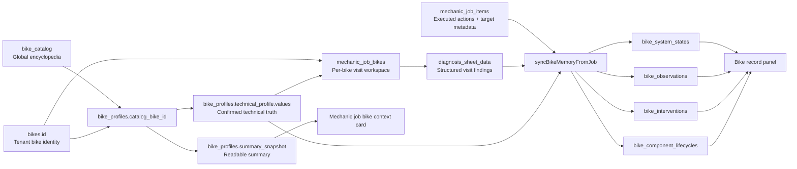
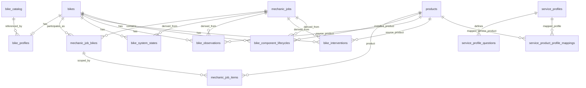

# Bike Workshop Master Schema

Last updated: 2026-04-12
Status: Living architecture document
Scope: Bike encyclopedia, bike profile, diagnosis, workshop items, service wizard, bike memory kernel, sync pipeline, and visible bike history

## Why This File Exists

This is the canonical backbone document for the bike workshop implementation.

It exists because the system is no longer just a job form with notes. It is becoming a centralized technical memory system for bicycles, where:

- the bike is the permanent anchor
- the bike profile is the confirmed technical baseline
- the job is the visit-specific workspace
- the diagnosis sheet is the structured technical snapshot for that visit
- the job items and service products are the executed actions
- the bike memory kernel is the cross-visit output

This file must stay ahead of implementation drift.

If the implementation changes and this file is not updated, the implementation is considered undocumented and incomplete.

## Mandatory Maintenance Rule

Any time an agent or developer changes any of the following, they must update this file in the same task:

- bike encyclopedia / bike catalog
- bike form dialog and bike profile creation flow
- bike profile schema or summary rules
- mechanic job bike structure
- diagnosis sheet template or fields
- mechanic job item targeting and service item behavior
- service wizard questions, mapping, or UI rules
- bike memory sync orchestration
- bike record panel / visible history
- any database schema that changes this backbone

They must also update `/.github/copilot-instructions.md` with the same architectural direction and the reference to this file.

## Fresh Agent Guardrail

This section exists specifically for fresh agents that do not yet have the historical context of this implementation.

These guardrails are meant to prevent architecture drift, not to block justified progressive improvement.

Agents are still allowed to evolve the architecture when the current layers are genuinely insufficient, but they must do it deliberately, verify the live system first, and document the change in this file instead of improvising a side path.

If you are a fresh agent touching bike workshop architecture, do not start by proposing a solution.

Start by proving that you understand the current system.

### Required Read Order Before Changing Anything

Read these exact files first, in this order:

1. `BIKE_WORKSHOP_MASTER_SCHEMA.md`
2. `.github/copilot-instructions.md`
3. `supabase/sql/core_schema.sql`
4. `lib/modules/bikeshop/models/bikeshop_models.dart`
5. `lib/modules/bikeshop/services/bikeshop_service.dart`
6. `lib/modules/bikeshop/pages/bike_form_dialog.dart`
7. `lib/modules/bikeshop/pages/mechanic_job_form_page.dart`
8. `lib/modules/bikeshop/widgets/service_wizard_dialog.dart`
9. `lib/modules/bikeshop/services/service_wizard_service.dart`
10. `lib/modules/bikeshop/widgets/bike_record_panel.dart`
11. `lib/shared/models/bike_catalog_models.dart`
12. `lib/shared/services/bike_catalog_service.dart`

If the change touches historical context or prior implementation intent, also read:

- `BIKE_WORKSHOP_CENTRAL_MEMORY_MODEL_2026-04-09.md`
- `/memories/repo/bike-workshop-central-memory-kernel.md`
- `/memories/repo/bike-workshop-diagnosis-sheet-layer.md`
- `/memories/repo/bike-workshop-job-form-sync.md`
- `/memories/repo/bike-workshop-v1-profile-layer.md`

Do not skip the schema file and do not skip the current Flutter orchestration files.

### Mandatory Live Verification Protocol

Before changing bike workshop architecture, verify how production is actually behaving at that moment.

You must inspect live data using the already-documented access patterns in `.github/copilot-instructions.md`:

- REST queries with service role for fast inspection
- direct `psql` with the documented project password for exact SQL when needed

The purpose is not to deploy random SQL.

The purpose is to confirm the current reality before changing code or schema.

At minimum, inspect the live shape of the relevant objects for the target tenant:

- `bike_profiles`
- `mechanic_job_bikes`
- `mechanic_job_items`
- `service_profiles`
- `service_product_profile_mappings`
- `service_profile_questions`
- any affected bike memory kernel table

If the task is about diagnosis or service wizard behavior, verify the live service profile mappings and actual question keys before editing code.

This matters because the real production shape has already differed from assumptions before.

Known example:

- the live brake service family was `brake`, not `brakes`

That single mismatch was enough to make code look correct while the live system still behaved wrong.

### Search-First Rule

Before adding any column, field, function, enum path, or new JSON structure, prove that it does not already exist.

Search first in:

- `supabase/sql/core_schema.sql`
- `lib/modules/bikeshop/models/bikeshop_models.dart`
- `lib/modules/bikeshop/services/bikeshop_service.dart`
- `lib/modules/bikeshop/pages/mechanic_job_form_page.dart`
- `lib/modules/bikeshop/services/service_wizard_service.dart`

If an existing field can carry the meaning, use it.

If an existing upstream layer can answer the question, consume it instead of storing it again.

### Prohibited Drift Patterns

Fresh agents should treat the following as prohibited by default unless they can clearly prove the current layers are insufficient and document the new direction in this file:

- a new parallel bike truth store outside `bike_profiles`
- a second unofficial diagnosis store outside `mechanic_job_bikes.diagnosis_sheet_data`
- service wizard answers treated as technical truth without explicit projection into diagnosis or profile-backed logic
- duplicate front/rear targeting fields when `system_key`, `component_slot_key`, and `location_key` already solve the problem
- new bike memory summary tables that duplicate `bike_system_states`, `bike_observations`, `bike_interventions`, or `bike_component_lifecycles`
- new profile-like JSON blobs on job rows for facts that belong in `bike_profiles`
- new diagnosis fields that ignore known upstream bike profile truth
- new wizard questions that restate already-known baseline specs without a confirmation/correction reason
- new history/timeline layers that bypass the memory kernel

### Mandatory Questions Before Proposing Any Change

The agent must answer these explicitly to itself before editing:

1. Is this fact global encyclopedia data, bike profile truth, visit-specific diagnosis, executed work metadata, or derived cross-visit memory?
2. Does this already exist somewhere upstream?
3. Am I about to create a parallel truth source?
4. Does the live production data currently match my assumption?
5. Does this strengthen centralization around bike profile truth, or weaken it?

If the answer to question 3 is yes, stop and redesign.

If a parallel or new structure still appears necessary after that, do not improvise it silently.

Document:

- why the current layer is insufficient
- why extending an existing layer is not enough
- what migration or compatibility plan exists
- whether the change strengthens or weakens centralization

If the answer to question 4 is unknown, inspect production first.

## One Sentence Definition

The bike is the durable identity anchor, the bike profile is the confirmed technical baseline, jobs are the visit workspace, diagnosis is the structured visit snapshot, and the bike memory kernel is the cross-visit technical output.

## The Backbone In Order

The most important architectural fact is this:

1. `bikes.id` is the permanent tenant-specific bike identity.
2. `bike_profiles.catalog_bike_id` points that bike to a shared reference model in `bike_catalog`.
3. `bike_profiles.technical_profile.values` becomes the tenant bike's confirmed technical truth.
4. `mechanic_job_bikes.diagnosis_sheet_data` stores structured findings for a specific visit on that specific bike.
5. `mechanic_job_items` stores executed actions and targeting metadata for that visit.
6. `BikeshopService.syncBikeMemoryFromJob()` derives cross-visit outputs into bike memory kernel tables.
7. Read models such as the bike record panel should surface the kernel, not invent a parallel history model.

Everything downstream should consume the upstream layers.

That means:

- if a bike profile already knows the brake type, downstream diagnosis and service UI should not ask again
- if a bike has rim brakes, the diagnosis should not expose rotor thickness fields
- if a bike has hydraulic disc brakes, the brake wizard should not ask for brake type as if it were unknown

This is the centralization rule.

## Default Boundaries

These boundaries are meant to stop redundant architecture from being created again.

They are the default operating boundaries for new work.

They are not a ban on progressive improvement.

If the architecture needs to evolve, the change should happen by explicitly improving these layers, not by quietly building a second architecture beside them.

- `bike_catalog` is suggestive global reference data.
- `bike_profiles` is the tenant bike's upstream technical truth.
- `mechanic_job_bikes.diagnosis_sheet_data` is the structured visit diagnosis layer.
- `mechanic_job_items` is the executed work and targeting layer.
- bike memory kernel tables are the derived cross-visit output layer.

Avoid collapsing these layers together.

Avoid moving upstream bike truth into visit rows unless the architecture is being explicitly redesigned and documented.

Avoid inventing new visit-level truth stores because a wizard currently feels convenient.

Avoid solving uncertainty by adding duplicate fields in multiple layers.

## Core Architectural Principle

Primary technical facts must be centralized and reused.

The system should not repeatedly ask the mechanic to restate the same technical identity in multiple places.

The intended flow is:

- select or match the bicycle against centralized reference data
- confirm or adjust bike-specific technical truth in the bike profile
- let diagnosis, wizard flows, and technical workspaces adapt to that truth
- capture only visit-specific findings and actions during the job
- project those findings and actions into long-term bike memory

## Layer Map

| Layer | Main Responsibility | Canonical Storage | Notes |
|---|---|---|---|
| Global reference layer | Shared encyclopedia of model-year specs | `bike_catalog` | Global, not tenant-scoped |
| Tenant bike identity | Actual customer bicycle record | `bikes` | Durable bike anchor |
| Tenant bike technical truth | Confirmed intake + technical baseline | `bike_profiles` | This is the real upstream basis for downstream logic |
| Visit workspace | Job-specific reasoning and per-bike visit data | `mechanic_jobs`, `mechanic_job_bikes` | Visit narrative lives here |
| Structured diagnosis | Structured technical findings for the visit | `mechanic_job_bikes.diagnosis_sheet_data` | Current template is `basic_workshop_v1` |
| Executed work | Products/services and technical targeting | `mechanic_job_items` | Includes system, slot, location, intervention metadata |
| Guided service metadata | Central question definitions for services | `service_profiles`, `service_product_profile_mappings`, `service_profile_questions` | Questions are central, but answers are not the truth source by themselves |
| Cross-visit memory kernel | Derived technical memory | `bike_system_states`, `bike_observations`, `bike_interventions`, `bike_component_lifecycles` | This is the long-term technical memory |
| Read models / UI | Human-readable visibility | bike record panel, profile summary card, timeline/history views | Should consume the kernel and profile |

## Canonical Entity Graph

## Canonical ER Diagram

## Foundation Layer: Bike Encyclopedia and Bike Profile

This is the actual starting point.

The diagnosis system should not be treated as the first source of truth.

### 1. Global reference: `bike_catalog`

Current schema anchor:

- `supabase/sql/core_schema.sql` line around `1007`

Purpose:

- shared encyclopedia of bike model-year technical data
- not tenant-scoped
- intended to answer questions like:
  - is this bike hardtail or full suspension?
  - what brake system does it use?
  - what drivetrain speed/config does it have?
  - what rotor sizes are expected?
  - what axle spacing, freehub, or wheel size does it have?

Current modeled examples in `BikeCatalogEntry`:

- `bikeType`
- `frameMaterial`
- `wheelSize`
- `drivetrainSpeeds`
- `drivetrainConfig`
- `brakeType`
- `brakeRotorSizeFrontMm`
- `brakeRotorSizeRearMm`
- `frontHubSpacingMm`
- `rearHubSpacingMm`
- `freehubType`
- other technical specs

This is the shared reference backbone for known bike models like `Trek Marlin 5 (2025)`.

### 2. Tenant bike identity: `bikes`

Purpose:

- actual bike owned by a tenant/customer
- serial number, year, color, frame size, wheel size, etc.
- durable identity anchor for all workshop history

Important distinction:

- `bikes` is the real operational bike record
- `bike_catalog` is the external/shared reference model

### 3. Tenant bike technical truth: `bike_profiles`

Current schema anchor:

- `supabase/sql/core_schema.sql` line around `12428`

Purpose:

- connect the real tenant bike to the encyclopedia when possible
- capture tenant/bike-specific confirmed technical truth
- store intake/background context that should not live inside visit notes

Key fields:

- `bike_id`
- `catalog_bike_id`
- `intake_profile jsonb`
- `technical_profile jsonb`
- `summary_snapshot jsonb`
- `last_confirmed_at`

Current Dart model:

- `BikeProfile`
- `technicalValues`
- `technicalSources`
- `technicalConfirmed`

Important meaning:

- `catalog_bike_id` = which encyclopedia bike this tenant bike is based on
- `technical_profile.values` = what the system currently believes is true for this bike
- `technical_profile.sources` = where each technical fact came from
- `technical_profile.confirmed` = whether the fact is confirmed or still suggestive

### 4. Why this layer is the true base

If the user selects a known bike like `Marlin 5 2025`, the system should use `bike_catalog.id` to seed the bike profile technical truth.

That technical truth should then drive:

- which diagnosis fields appear
- which wizard questions are hidden
- which wizard questions remain necessary
- which measurements make sense
- which service templates apply
- which warnings appear in the bike context summary

Examples of the intended result:

- if `technical_profile.values.brakeType = rim`, the structured brake diagnosis should not show rotor thickness
- if `technical_profile.values.brakeType = hydraulic_disc`, a brake service wizard should not ask `Tipo de freno`
- if `technical_profile.values.drivetrainSpeeds = 10`, a wizard should not ask the mechanic to re-declare drivetrain speed unless the fact is uncertain or unconfirmed

This is the centralization rule in practice.

## Bike Profile Summary Layer

Current code anchor:

- `BikeProfileSummaryBuilder`

Purpose:

- convert bike profile data into readable context for workshop UI
- surface missing confirmations and warnings

Current examples already implemented:

- summary identity line
- intake highlights
- technical highlights
- warnings like:
  - missing brake type confirmation
  - missing drivetrain speed confirmation

This summary is not just decoration.

It is the operational context layer that should tell the mechanic what is already known and what is still missing.

## Visit Workspace Layer

### `mechanic_jobs`

Purpose:

- overall visit container
- customer, status, timing, costing, invoice linkage, attachments

### `mechanic_job_bikes`

Current schema anchor:

- `supabase/sql/core_schema.sql` line around `13165`

Purpose:

- the per-bike workspace inside a job
- allows one job to contain multiple bikes
- carries visit-specific narrative and structured diagnosis per bike

Key fields:

- `job_id`
- `bike_id`
- `diagnosis`
- `work_requested`
- `work_performed`
- `technician_notes`
- `diagnosis_sheet_key`
- `diagnosis_sheet_data`
- `diagnosis_sheet_updated_at`

Boundary rule:

- visit narrative belongs here
- long-term cross-visit technical truth does not

## Structured Diagnosis Layer

Current Dart model:

- `MechanicJobDiagnosisSheet`
- `DrivetrainDiagnosisSheet`
- `BrakeDiagnosisSheet frontBrake`
- `BrakeDiagnosisSheet rearBrake`

Current template:

- `basic_workshop_v1`

Current structured systems:

- drivetrain
- front_brake
- rear_brake

Current fields:

### Drivetrain

- `overallStatus`
- `chainWearPercent`
- `cassetteCondition`
- `notes`

### Front brake / rear brake

- `overallStatus`
- `padWearPercent`
- `rotorThicknessMm`
- `notes`

Important current limitation:

The diagnosis template is still static.

That means it can still render fields that do not make sense for a given bike type or brake system.

This is not the target architecture.

Target rule:

- diagnosis template should be gated by bike profile technical truth
- the template should not ask for or show fields that are impossible or irrelevant for that bike

## Executed Work Layer: `mechanic_job_items`

Current schema anchor:

- `supabase/sql/core_schema.sql` line around `13247`

Purpose:

- persist the actual products/services/adhoc items executed during a visit
- link those actions to bike memory and diagnosis targets

Key fields:

- `job_id`
- `job_bike_id`
- `product_id`
- `service_product_id`
- `product_name`
- `item_type`
- `system_key`
- `component_slot_key`
- `location_key`
- `intervention_type`
- `creates_lifecycle`

Important interpretation:

- this is where execution metadata lives
- row-level `location` is not diagnosis truth by itself
- it is target metadata that tells the system which part of the bike the executed work affected

### Current direction for services

Recent implementation moved service targeting inline on the row:

- service product row is added directly
- row-level `Aplica a` chooses `Auto / Del. / Tras.`
- that row location is persisted as `location_key`

This is the correct direction because target metadata belongs to the executed service line, not hidden in a disconnected modal.

## Guided Service Layer

Current schema anchors:

- `service_profiles`
- `service_product_profile_mappings`
- `service_profile_questions`

Purpose:

- centralized question definitions for known service products
- wizard metadata and summaries for service configuration

Important architectural rule:

The service wizard is not allowed to become a parallel technical truth source.

That means:

- questions are centrally defined
- answers are useful only if they either:
  - update diagnosis-relevant fields in the diagnosis sheet, or
  - remain execution/configuration notes on the service row

Answers should not silently become a second unofficial diagnosis model.

### Current implementation status

Current brake/drivetrain adapter behavior:

- diagnosis-relevant overlaps from wizard answers can project into the diagnosis sheet
- execution/configuration answers stay in the service row summary
- row location is preferred over wheel/position text inside the wizard

### Current architectural gap

The wizard is not yet fully profile-aware.

Examples of what still needs to happen:

- if bike profile already knows `brakeType`, wizard should not ask for `Tipo de freno`
- if row target is already `Del.` or `Tras.`, wizard should not ask wheel/position targeting again
- if profile says `rim`, wizard should not imply rotor-based logic

## Bike Memory Kernel

Current schema anchors:

- `bike_system_states` around line `12589`
- `bike_component_lifecycles` around line `12619`
- `bike_observations` around line `12662`
- `bike_interventions` around line `12709`

This is the long-term technical memory layer.

### `bike_system_states`

Purpose:

- current per-system status snapshot

Examples:

- drivetrain = attention
- front_brake = critical
- rear_brake = ok

### `bike_observations`

Purpose:

- typed technical facts recorded at a point in time

Examples:

- chain wear
- rotor thickness
- status snapshot
- condition assessment

### `bike_interventions`

Purpose:

- historical actions that changed the bike state

Examples:

- chain replaced
- front brake adjusted
- rotor trued

### `bike_component_lifecycles`

Purpose:

- lifecycle-aware component history
- what is currently installed and when it changed

Examples:

- current chain
- current front rotor
- current rear pads

## Sync and Orchestration Pipeline

Current main service anchor:

- `BikeshopService.syncBikeMemoryFromJob()`

Important orchestration methods:

- `syncBikeMemoryFromJob`
- `_safeSyncBikeMemoryForJob`
- `_clearDerivedBikeMemoryForJob`
- `_refreshDerivedSystemStates`
- `_inferTargetsFromItem`
- `_withResolvedTargetMetadata`

### Current orchestration principle

The bike memory kernel is derived from visit data.

That means:

- diagnosis sheet contributes structured observations and system states
- mechanic job items contribute interventions and lifecycles
- target inference uses persisted item metadata first
- stale derived rows for the job are cleared and rebuilt when needed

### Important historical fix

Originally, bike memory sync only ran from the full job form submit path.

That was wrong.

It meant service-layer mutations could happen without refreshing bike memory.

This was fixed so bike memory sync can run from job, job-bike, and job-item mutation flows as well.

## Read Models and Visibility

### Job-side visibility

- bike profile summary card in mechanic job form
- diagnosis workspace per bike
- service detail sidebar and row summaries

### Bike-side visibility

- bike record panel
- interventions, observations, lifecycles, and system states should be surfaced here

Important rule:

- timeline/history views are outputs
- they are not the primary architecture

## Current State vs Intended State

### What is already structurally correct

- `bike_catalog` exists as shared encyclopedia reference
- `bike_profiles` exists and can point to `catalog_bike_id`
- bike profile stores technical values, sources, confirmations, and summary snapshot
- structured diagnosis exists per bike via `mechanic_job_bikes.diagnosis_sheet_data`
- job items now carry first-class target metadata
- bike memory kernel tables exist and are populated through sync
- front/rear service targeting has moved to inline row metadata

### What is still incomplete or architecturally immature

- diagnosis template is still static instead of profile-driven
- service wizard still asks facts that should eventually come from bike profile
- bike profile is not yet the hard gating layer for diagnosis field visibility
- brake/rim/disc-driven conditional forms are not yet fully implemented
- bike record visibility is improved but still not the perfect read model of the kernel

## Road Fixes Already Made

These are important because they explain why the system currently looks the way it does.

### 1. Central memory UI visibility

Problem:

- bike history UI did not expose interventions and lifecycles clearly

Fix:

- bike record panel was updated to load and render the richer memory outputs

### 2. Sync orchestration bug

Problem:

- bike memory sync only happened on the full form submit path

Fix:

- service-layer mutations now trigger safe sync by default

### 3. Production backfill

Problem:

- historical completed jobs had not populated bike memory correctly

Fix:

- backfill script created and executed:
  - `lib/scripts/run_bike_memory_backfill.dart`

### 4. Missing explicit item target metadata

Problem:

- front/rear and system targeting relied too much on text inference

Fix:

- added explicit target metadata to `mechanic_job_items`
- migration:
  - `supabase/migrations/20260412103500_add_mechanic_job_item_target_metadata.sql`
- historical backfill:
  - `supabase/migrations/20260412104500_backfill_mechanic_job_item_targets_from_interventions.sql`

### 5. Service row UX direction

Problem:

- service configuration depended too heavily on a modal and felt disconnected from the actual service row

Fix:

- service rows now carry inline target metadata via `Aplica a`

### 6. Wizard-to-diagnosis linkage fixes

Problems discovered:

- live profile family mismatch (`brake` vs `brakes`)
- wizard was not clearly linked to diagnosis target
- diagnosis UI could remain visually stale because fields were keyed too loosely

Fixes made:

- brake-family alias support
- explicit wizard context hint
- redundant targeting questions hidden when row metadata already knows the target
- diagnosis widgets re-keyed so wizard-driven diagnosis updates become visible immediately

## The Most Important Direction From Here

This is the most important architectural direction for future work.

### The real source-of-truth order must become

1. `bike_catalog`
2. `bike_profiles.catalog_bike_id`
3. `bike_profiles.technical_profile.values`
4. profile-aware diagnosis and wizard gating
5. visit-specific diagnosis findings
6. executed work metadata
7. derived bike memory kernel

### Practical examples

If a bike is a known `Marlin 5 2025` and the profile confirms:

- hardtail
- hydraulic disc brakes
- headset standard
- bottom bracket standard
- drivetrain speed/config

Then the rest of the system should inherit that automatically.

It should not ask the mechanic to restate those facts unless the system is explicitly asking for confirmation or correction.

### Non-negotiable target behaviors

- rim-brake bikes should not show rotor thickness diagnosis fields
- disc-brake bikes should show rotor-related diagnosis only when relevant
- brake wizard should not ask `Tipo de freno` if bike profile already knows it
- drivetrain-related wizards should adapt to known drivetrain configuration and speeds
- wizard questions should focus on visit-specific findings, not restating baseline specs

## Current Backbone Rule Set

1. Upstream catalog/profile data defines the bike's baseline technical identity.
2. Downstream diagnosis and service UI should consume that baseline, not duplicate it.
3. Visit-specific findings belong in diagnosis and executed work records.
4. Cross-visit truth belongs in the bike memory kernel.
5. Timeline/history views are outputs, not the core data model.
6. Service wizard data is only valid as diagnosis truth when explicitly projected into diagnosis.
7. Row-level location on service items is preferred as target metadata.
8. Production reality must be inspected before making architecture claims about this module.
9. No new bike workshop field, table, or JSON structure should be added until the existing layers are searched and ruled out.
10. If a change weakens centralization around bike profile truth, it must be called out explicitly here and in `.github/copilot-instructions.md`.
11. Progressive improvements are allowed, but they must improve or intentionally evolve the backbone, not bypass it.

## File and Module Map

### Core documentation and memory

- `BIKE_WORKSHOP_CENTRAL_MEMORY_MODEL_2026-04-09.md`
- `BIKE_WORKSHOP_MASTER_SCHEMA.md` (this file)
- `/memories/repo/bike-workshop-central-memory-kernel.md`
- `/memories/repo/bike-workshop-diagnosis-sheet-layer.md`
- `/memories/repo/bike-workshop-job-form-sync.md`
- `/memories/repo/bike-workshop-v1-profile-layer.md`

### Schema and migrations

- `supabase/sql/core_schema.sql`
- `supabase/migrations/20260408184500_add_bike_profiles.sql`
- `supabase/migrations/20260409221500_add_mechanic_job_bike_diagnosis_sheet.sql`
- `supabase/migrations/20260412103500_add_mechanic_job_item_target_metadata.sql`
- `supabase/migrations/20260412104500_backfill_mechanic_job_item_targets_from_interventions.sql`

### Main Flutter modules

- `lib/modules/bikeshop/pages/bike_form_dialog.dart`
- `lib/modules/bikeshop/pages/mechanic_job_form_page.dart`
- `lib/modules/bikeshop/services/bikeshop_service.dart`
- `lib/modules/bikeshop/widgets/service_wizard_dialog.dart`
- `lib/modules/bikeshop/services/service_wizard_service.dart`
- `lib/modules/bikeshop/widgets/bike_record_panel.dart`
- `lib/shared/models/bike_catalog_models.dart`
- `lib/shared/services/bike_catalog_service.dart`

## Update Checklist For Future Changes

When any implementation changes touch this backbone, update this file with:

1. what changed
2. which layer changed
3. whether the change strengthens or weakens centralization
4. whether the change affects upstream profile truth, visit diagnosis, executed work, or derived memory
5. whether the change introduces a new gap or closes an old one
6. any required update to `/.github/copilot-instructions.md`

## Definition Of Done For This Architecture

This architecture will be considered coherent when:

- a known bike model can seed a bike profile with meaningful technical defaults
- bike profile acts as the upstream basis for diagnosis and service UI
- service wizards stop re-asking already-known technical facts
- diagnosis sheet becomes conditionally rendered from centralized technical truth
- executed work links cleanly to front/rear/system/component targets
- bike memory kernel stays derived and consistent
- visible bike history reads from the kernel clearly

Until then, this document must continue to record both the intended direction and the real current state.