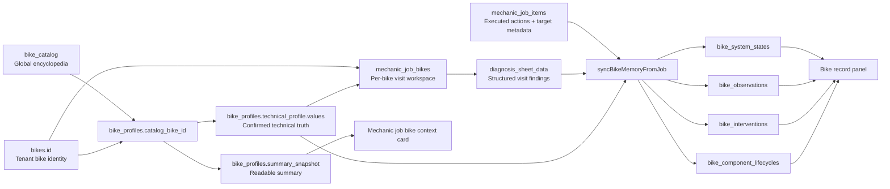
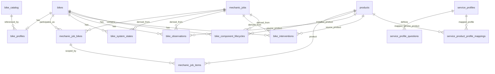

# Bike Workshop Master Schema

Last updated: 2026-07-10
Status: Living architecture document
Scope: Bike encyclopedia, bike profile, diagnosis, workshop items, service wizard, bike memory kernel, sync pipeline, and visible bike history

Compatibility concepts companion: `BIKE_WORKSHOP_COMPATIBILITY_CONCEPTS.md`

Use this file for backbone architecture and layer ownership.
Use `BIKE_WORKSHOP_COMPATIBILITY_CONCEPTS.md` for the technical and conceptual compatibility doctrine that the code, schema, and scorer must stay aligned with.

## Why This File Exists

This is the canonical backbone document for the bike workshop implementation.

It exists because the system is no longer just a job form with notes. It is becoming a centralized technical memory system for bicycles, where:

- the bike is the permanent anchor
- the bike profile is the confirmed technical baseline
- the job is the visit-specific workspace
- the diagnosis sheet is the structured technical snapshot for that visit
- the job items and service products are the executed actions
- the bike memory kernel is the cross-visit output

This file must stay ahead of implementation drift.

If the implementation changes and this file is not updated, the implementation is considered undocumented and incomplete.

## Mandatory Maintenance Rule

Any time an agent or developer changes any of the following, they must update this file in the same task:

- bike encyclopedia / bike catalog
- bike form dialog and bike profile creation flow
- bike creation wizard / intake wizard as the upstream data-entry layer
- bike profile schema or summary rules
- mechanic job bike structure
- diagnosis sheet template or fields
- mechanic job item targeting and service item behavior
- service wizard questions, mapping, or UI rules
- bike memory sync orchestration
- bike record panel / visible history
- any database schema that changes this backbone

If the task changes compatibility semantics, product ficha meaning, canonical vocabularies, or compatibility scoring doctrine, it must also update `BIKE_WORKSHOP_COMPATIBILITY_CONCEPTS.md` in the same task.

They must also update `/.github/copilot-instructions.md` with the same architectural direction and the reference to this file.

## Ordered Progress Ledger Rule

This file is not only the architecture doctrine.

It is also the primary ordered ledger for bike workshop progress.

Fresh agents must use this file first to determine:

- what has already landed
- what remains open
- what is intentionally deferred
- what the next ordered queue is

Whenever substantive bike workshop work lands, the same task must update all of the following here:

1. the affected architecture/doctrine section
2. the current reality that is now true because of the change
3. the ordered `Next Session Priority Queue`
4. any newly blocked, deferred, or intentionally premature work

If this file and `.github/copilot-instructions.md` drift apart, this file wins and the repo instructions must be reconciled in the same task.

Do not continue bike workshop work from memory alone, and do not invent a new next step before reconciling the ordered queue in this file.

## Mandatory Whole-Backbone Inspection Rule

Any substantive semantic change to one bike workshop layer must trigger an inspection of the rest of the backbone in the same task.

This is not optional.

Do not patch one layer in isolation and then only later realize that the related upstream or downstream layers cannot represent the same concept.

If you change a diagnosis field, service-wizard mapping, bike-profile technical key, catalog spec, job-item targeting rule, or bike-memory sync behavior, you must inspect the rest of the chain before calling the task complete.

At minimum, inspect these layers for the changed concept:

1. `bike_catalog` / encyclopedia reference model:
  Can shared model data represent the concept, or is the catalog guaranteed to stay silent about it?
2. `bike_profiles.technical_profile.values`:
  Should the concept exist as durable upstream bike truth, or is it strictly visit-specific?
3. `mechanic_job_bikes.diagnosis_sheet_data`:
  Does the visit-layer diagnosis store the concept with the same semantics and naming?
4. `service_profiles`, `service_profile_questions`, and wizard mappings:
  Do live service questions expose the same concept, and do they use compatible answer vocabulary?
5. `mechanic_job_items` / executed service rows:
  Does the service execution layer target the same system/component without inventing a second vocabulary?
6. bike memory sync + visible read models:
  If the concept should survive across visits, does the sync pipeline project it into the right kernel/read layer?

The point is not that every concept must live in every layer.

The point is that every change must explicitly prove which layers should know about the concept, which layers should not, and whether the existing wiring is coherent.

### Hydraulic-Brake Example

If you add or refine hydraulic-brake diagnosis semantics such as bleed/purge need, fluid contamination, piston behavior, or hydraulic symptom severity, you must inspect all of the following before finishing:

- does `bike_catalog` already feed any hydraulic-brake baseline data for known models?
- does `bike_profiles.technical_profile.values` store the durable hydraulic baseline that belongs to the bike, instead of leaving it implicit?
- does `mechanic_job_bikes.diagnosis_sheet_data` use the same semantic keys for visit findings?
- do the relevant `service_profiles` and `service_profile_questions` for purge / brake maintenance / caliper service expose matching wizard questions and option vocabulary?
- do `service_product_profile_mappings` and `mechanic_job_items` target the same brake system/service meaning instead of inventing a disconnected label?
- does the bike-memory sync pipeline project the relevant cross-visit fact or intervention if it should persist?

If one of those layers cannot represent the new concept yet, that gap must be fixed or explicitly documented in the same task.

### Definition Of Done For Backbone Changes

A bike workshop architecture task is incomplete if it changes one layer but does not inspect the other affected layers.

Working UI in one screen is not enough.

The task is only done when the changed concept has been checked across the backbone and the centralization story is still coherent.

## Fresh Agent Guardrail

This section exists specifically for fresh agents that do not yet have the historical context of this implementation.

These guardrails are meant to prevent architecture drift, not to block justified progressive improvement.

Agents are still allowed to evolve the architecture when the current layers are genuinely insufficient, but they must do it deliberately, verify the live system first, and document the change in this file instead of improvising a side path.

If you are a fresh agent touching bike workshop architecture, do not start by proposing a solution.

Start by proving that you understand the current system.

### Required Read Order Before Changing Anything

Read these exact files first, in this order:

1. `BIKE_WORKSHOP_MASTER_SCHEMA.md`
2. `BIKE_WORKSHOP_COMPATIBILITY_CONCEPTS.md`
3. `.github/copilot-instructions.md`
4. `supabase/sql/core_schema.sql`
5. `lib/modules/bikeshop/models/bikeshop_models.dart`
6. `lib/modules/bikeshop/services/bikeshop_service.dart`
7. `lib/modules/bikeshop/pages/bike_form_dialog.dart`
8. `lib/modules/bikeshop/pages/mechanic_job_form_page.dart`
9. `lib/modules/bikeshop/widgets/bike_system_controller.dart`
10. `lib/modules/bikeshop/widgets/bike_record_panel.dart`
11. `lib/modules/bikeshop/widgets/service_wizard_dialog.dart`
12. `lib/modules/bikeshop/services/service_wizard_service.dart`
13. `lib/modules/bikeshop/config/brake_canonical_data.dart`
14. `lib/shared/models/bike_catalog_models.dart`
15. `lib/shared/services/bike_catalog_service.dart`

If the change touches historical context or prior implementation intent, also read:

- `BIKE_WORKSHOP_CENTRAL_MEMORY_MODEL_2026-04-09.md`
- `/memories/repo/bike-workshop-central-memory-kernel.md`
- `/memories/repo/bike-workshop-component-intelligence-correction.md`
- `/memories/repo/bike-workshop-diagnosis-sheet-layer.md`
- `/memories/repo/bike-workshop-job-form-sync.md`
- `/memories/repo/bike-workshop-memory-reconciliation.md`
- `/memories/repo/bike-workshop-service-taxonomy-audit.md`
- `/memories/repo/bike-workshop-service-wizard-profile-gating.md`
- `/memories/repo/bike-workshop-v1-profile-layer.md`
- `/memories/repo/bike-workshop-fresh-agent-handoff-2026-04-16.md`

Do not skip the schema file, do not skip the current Flutter orchestration files, and do not skip the shared bike-system controller if the task touches diagnosis, bike history, or service flows.

### Shared Controller Contract (Current Code-Side Rule)

The shared bike map is no longer just a visual helper.

`lib/modules/bikeshop/widgets/bike_system_controller.dart` is now a core backbone widget and must be treated as a single behavior authority.

Fresh agents must preserve these exact rules unless they are deliberately redesigning the shared controller and documenting that redesign here:

- `BikeSystemController` is the shared bike-system map/controller for mechanic-job diagnosis, bike record/history, and the bike intake technical step. Do not fork a second local bike map.
- `selectedSystemKey` is the parent-driven highlight key only. It is not the gate for the exploded detail image.
- the exploded detail image is gated internally by the controller's explicit user-tap state. Parents must not try to re-implement or second-guess that state.
- `onClearSelection` is notification-only so the parent can clear its own selected key after the user exits the detail view. It must not be used to conditionally enable or disable the detail view.
- hover preview state is intentionally internal to the controller: pin hover is local to each pin and overlay rendering is driven from an internal notifier. Do not lift hover state back into parent `setState`, or the `MouseRegion` rebuild loop / flicker bug returns.
- the current shared registry exposes `cockpit`, `suspension`, `front_brake`, `front_wheel`, `drivetrain`, `bottom_bracket`, `rear_wheel`, and `rear_brake` everywhere the controller is used.
- `front_wheel` and `rear_wheel` are now the primary interactive wheel units. Legacy aggregate `wheels` remains only as a family/compatibility alias and backward-compatible history fallback; do not keep building new UI or targeting flows around a single undifferentiated wheel bucket.
- `bottom_bracket` is now a dedicated shared-controller system because pedalier bearings and standards matter operationally on their own, even though `bottomBracketFamily` still lives in `bike_profiles.technical_profile.values` as upstream truth.
- `cockpit` now explicitly means cockpit/steering. Headset belongs under this system until a richer schema/editor layer exists; do not leave headset semantics stranded in vague placeholder copy or freeform notes.
- `lib/modules/bikeshop/pages/mechanic_job_form_page.dart` now exposes structured editable diagnosis inspectors for every shared-controller system except the legacy aggregate alias `wheels`: `drivetrain`, `front_brake`, `rear_brake`, `front_wheel`, `rear_wheel`, `bottom_bracket`, `cockpit`, and `suspension` all round-trip through `MechanicJobDiagnosisSheet`, the diagnosis summary/narrative layer now consumes those same structured sheets instead of dropping them back to placeholder cards, and save/edit flows now normalize each system's `overallStatus` from the structured component fields so restored editors do not persist as `unknown` by default after real findings are entered.

### Mandatory Live Verification Protocol

Before changing bike workshop architecture, verify how production is actually behaving at that moment.

You must inspect live data using the already-documented access patterns in `.github/copilot-instructions.md`:

- REST queries with service role for fast inspection
- direct `psql` with the documented project password for exact SQL when needed

The purpose is not to deploy random SQL.

The purpose is to confirm the current reality before changing code or schema.

At minimum, inspect the live shape of the relevant objects for the target tenant:

- `bike_profiles`
- `mechanic_job_bikes`
- `mechanic_job_items`
- `service_profiles`
- `service_product_profile_mappings`
- `service_profile_questions`
- any affected bike memory kernel table

If the task is about diagnosis or service wizard behavior, verify the live service profile mappings and actual question keys before editing code.

This matters because the real production shape has already differed from assumptions before.

Known example:

- the live brake service family was `brake`, not `brakes`

That single mismatch was enough to make code look correct while the live system still behaved wrong.

### Mandatory External Technical Research Protocol

When the task touches bike technical data, workshop compatibility semantics, product ficha meaning, diagnosis gating, service-profile technical vocabulary, or the compatibility engine, agents must also study external workshop-standard references before implementing.

This is mandatory for work such as:

- new or changed bike technical fields
- new compatibility keys or value vocabularies
- drivetrain / brake / wheel / hub / bottom-bracket matching logic
- product ficha option sets, bounded numeric ranges, or canonical labels
- decisions about whether two standards are equivalent, adjacent, or incompatible

Required external sources:

- Sheldon Brown
- Park Tool

Required method:

- inspect the relevant pages with browser tools, not only memory or guesswork
- prefer studying the actual article context, tables, diagrams, compatibility notes, and edge-case wording before deciding canonical app semantics
- use those sources to sharpen the technical conclusion, then reconcile that conclusion with live production data, the existing schema, and the current backbone rules

Important boundary:

- external reference research does not replace live production inspection or schema search
- live data still decides what the app currently stores and how migrations must be staged
- external sources help determine the best technical model so the implementation does not freeze a weak or guessed assumption into the backbone

Definition-of-done addition for this class of task:

- a bike technical-data or compatibility-engine task is incomplete if it changes semantics without first checking both live production shape and the relevant Sheldon Brown / Park Tool references in the browser

### Mandatory Fast Validation Harness For Compatibility And Backbone Changes

Any change that touches the compatibility engine or the master-schema backbone must also be proved through one fast end-to-end debug workflow.

Code reading, seed inspection, and ad hoc manual setup are not enough by themselves.

Current code-side harness:

- `lib/modules/bikeshop/pages/pegas_table_page.dart` now hides the old `Tests` filter/tab from non-debug sessions and exposes a debug-only `Prueba rápida` launcher in the jobs page header
- that launcher creates explicit DB-backed workshop fixtures for testing; it is not a production-visible affordance and must stay hidden from release users
- the resulting jobs are intentionally tagged as test/debug data and continue to route through the debug-only `test` filter path, while normal production filters keep excluding them

This harness must be used for every change that affects at least one of these areas:

- bike-profile promotion or upstream truth capture
- diagnosis gating or service-wizard projection
- product compatibility ranking, scorer logic, or bike-aware product search
- canonical compatibility vocabularies or master-schema wiring across profile, diagnosis, service, item, and memory layers

Current built-in bike scenarios:

- `drivetrain_no_profile`: creates a fresh bike with no existing `bike_profile`; use this when the task must prove upstream profile creation/promotion behavior from service or diagnosis flows
- `rim_brake_city`: reusable 3x7 rim-brake city bike for rim-brake gating, cable/brake wizard flows, and basic drivetrain checks
- `hydraulic_disc_mtb`: reusable 1x12 hydraulic-disc hardtail for modern disc-brake, rotor, and drivetrain compatibility paths
- `bmx_single_speed`: reusable BMX singlespeed case for `1x1`, `bmx_driver`, and rim-brake edge cases

Current built-in lifecycle stages:

- `intake`
- `diagnostic`
- `in_progress`
- `completed`
- `delivered`

Minimum validation loop for compatibility/backbone work:

1. choose the nearest built-in bike scenario and lifecycle stage
2. create the quick test job from the debug-only launcher
3. open the created job and execute the changed flow end to end
4. verify the exact upstream/downstream effect that the task changed
5. if the nearest built-in scenario is insufficient, extend the harness in the same task instead of inventing a one-off manual setup
6. record in the task summary which scenario and stage were used

Task-completion rule addition:

- a compatibility-engine or backbone/master-schema task is incomplete if it ships without at least one focused harness run or equivalent automated coverage
- ad hoc manual creation of random `Test` customers, bikes, or jobs is no longer the default validation path; extend the harness instead when the existing scenarios are insufficient

This strengthens centralization because validation now runs through explicit, repeatable bike/job/profile fixtures instead of depending on production-visible test UI, random local data, or repeated manual setup.

### Search-First Rule

Before adding any column, field, function, enum path, or new JSON structure, prove that it does not already exist.

Search first in:

- `supabase/sql/core_schema.sql`
- `lib/modules/bikeshop/models/bikeshop_models.dart`
- `lib/modules/bikeshop/services/bikeshop_service.dart`
- `lib/modules/bikeshop/pages/mechanic_job_form_page.dart`
- `lib/modules/bikeshop/services/service_wizard_service.dart`

If an existing field can carry the meaning, use it.

If an existing upstream layer can answer the question, consume it instead of storing it again.

### Prohibited Drift Patterns

Fresh agents should treat the following as prohibited by default unless they can clearly prove the current layers are insufficient and document the new direction in this file:

- a new parallel bike truth store outside `bike_profiles`
- a second unofficial diagnosis store outside `mechanic_job_bikes.diagnosis_sheet_data`
- service wizard answers treated as technical truth without explicit projection into diagnosis or profile-backed logic
- duplicate front/rear targeting fields when `system_key`, `component_slot_key`, and `location_key` already solve the problem
- new bike memory summary tables that duplicate `bike_system_states`, `bike_observations`, `bike_interventions`, or `bike_component_lifecycles`
- new profile-like JSON blobs on job rows for facts that belong in `bike_profiles`
- new diagnosis fields that ignore known upstream bike profile truth
- new wizard questions that restate already-known baseline specs without a confirmation/correction reason
- new history/timeline layers that bypass the memory kernel

### Mandatory Questions Before Proposing Any Change

The agent must answer these explicitly to itself before editing:

1. Is this fact global encyclopedia data, bike profile truth, visit-specific diagnosis, executed work metadata, or derived cross-visit memory?
2. Does this already exist somewhere upstream?
3. Am I about to create a parallel truth source?
4. Does the live production data currently match my assumption?
5. Does this strengthen centralization around bike profile truth, or weaken it?

If the answer to question 3 is yes, stop and redesign.

If a parallel or new structure still appears necessary after that, do not improvise it silently.

Document:

- why the current layer is insufficient
- why extending an existing layer is not enough
- what migration or compatibility plan exists
- whether the change strengthens or weakens centralization

If the answer to question 4 is unknown, inspect production first.

## One Sentence Definition

The bike is the durable identity anchor, the bike creation/edit wizard is the upstream intake that fills that anchor and its technical baseline, the bike profile is the confirmed technical baseline, jobs are the visit workspace, diagnosis is the structured visit snapshot, and the bike memory kernel is the cross-visit technical output.

## The Backbone In Order

The most important architectural fact is this:

1. `bikes.id` is the permanent tenant-specific bike identity.
2. the bike creation/edit wizard is the upstream intake UI for this backbone; it must write the canonical bike + bike-profile truth instead of acting like a disconnected convenience form.
3. `bike_profiles.catalog_bike_id` points that bike to a shared reference model in `bike_catalog`.
4. `bike_profiles.technical_profile.values` becomes the tenant bike's confirmed technical truth.
5. `mechanic_job_bikes.diagnosis_sheet_data` stores structured findings for a specific visit on that specific bike.
6. `mechanic_job_items` stores executed actions and targeting metadata for that visit.
7. `BikeshopService.syncBikeMemoryFromJob()` derives cross-visit outputs into bike memory kernel tables.
8. Read models such as the bike record panel should surface the kernel, not invent a parallel history model.

Everything downstream should consume the upstream layers.

This includes the bike creation wizard itself.

The creation/edit wizard is not outside the architecture.

It is part of the backbone because it is the place where upstream truth is first captured, confirmed, corrected, or deliberately left unknown.

That means:

- if a bike profile already knows the brake type, downstream diagnosis and service UI should not ask again
- if a brake service wizard temporarily resolves a missing `rimBrakeFamily` on a bike already known upstream as `brakeType = rim`, that refinement must be promoted back into `bike_profiles.technical_profile.values` and must stop reappearing on later service opens
- if a bike has rim brakes, the diagnosis should not expose rotor thickness fields
- if a bike has hydraulic disc brakes, the brake wizard should not ask for brake type as if it were unknown

This is the centralization rule.

## Default Boundaries

These boundaries are meant to stop redundant architecture from being created again.

They are the default operating boundaries for new work.

They are not a ban on progressive improvement.

If the architecture needs to evolve, the change should happen by explicitly improving these layers, not by quietly building a second architecture beside them.

- `bike_catalog` is suggestive global reference data.
- `bike_profiles` is the tenant bike's upstream technical truth.
- `mechanic_job_bikes.diagnosis_sheet_data` is the structured visit diagnosis layer.
- `mechanic_job_items` is the executed work and targeting layer.
- bike memory kernel tables are the derived cross-visit output layer.

Avoid collapsing these layers together.

Avoid moving upstream bike truth into visit rows unless the architecture is being explicitly redesigned and documented.

Avoid inventing new visit-level truth stores because a wizard currently feels convenient.

Avoid solving uncertainty by adding duplicate fields in multiple layers.

## Core Architectural Principle

Primary technical facts must be centralized and reused.

The system should not repeatedly ask the mechanic to restate the same technical identity in multiple places.

The intended flow is:

- select or match the bicycle against centralized reference data
- confirm or adjust bike-specific technical truth in the bike profile
- let diagnosis, wizard flows, and technical workspaces adapt to that truth
- capture only visit-specific findings and actions during the job
- project those findings and actions into long-term bike memory

### General Upstream Truth Rule

This rule is not brake-specific.

It applies to every durable bike or component spec that the workshop may progressively learn over time.

If a fact is a durable technical characteristic of the bike or of a currently installed component family, it belongs upstream in the same backbone used by catalog truth, bike profile truth, product compatibility, diagnosis gating, and service-wizard filtering.

That means:

- `bike_catalog` should carry the fact when a known model-year can suggest it globally
- `bike_profiles.technical_profile.values` should carry the confirmed tenant-bike truth when the fact belongs to that real bike
- future installed-component identity may come from a mixed backbone, not only sellable inventory rows; some installed parts may map to real `products`, while others may remain OEM/reference components coming from `bike_catalog` or a future reference-component layer
- product compatibility/spec rows should reuse the same canonical key when that fact matters for matching or recommendation
- diagnosis UI and service wizards should consume that upstream truth instead of becoming the first or only place where the fact is stored

Future direction clarification:

- the long-term goal is not a giant flat field wall forever; it is a bike-level technical truth progressively projected from installed components
- that component-backed truth must stay mixed-source: do not force every frame, rim, hub, or OEM assembly into tenant inventory just to make the bike technically representable
- until that richer component identity layer is mature, the current bike/profile kernel fields remain the active upstream compatibility bridge and should continue to be captured explicitly

This rule covers more than brake platform.

Examples of the same rule include, but are not limited to:

- brake platform, rim-brake family, rotor-size baseline, hydraulic fluid family, hose/fitting family, and caliper/piston platform when those become supported
- drivetrain layout, drivetrain speeds, rear-driver family, axle/dropout standard, cassette/freewheel compatibility, and derailleur-mount baseline when those become supported
- wheel size, spoke-hole counts, hub spacing, axle standard, valve family, rim/tubeless baseline, and rotor-mount baseline when those become supported
- fork type, rear-shock baseline, suspension travel/platform, headset family, bottom bracket family, and frame interface standards when those become supported

The implementation is allowed to start with a small mandatory kernel first.

But when extended detail is added later, that detail must grow through the same upstream backbone at the same time instead of being trapped inside a single job row, a wizard-answer blob, a temporary diagnosis-only hack, or a product-local vocabulary.

If the app starts asking for a new durable component spec in a service wizard before the bike profile and compatibility layer can represent it upstream, the architecture is drifting.

## V1 Compatibility Strategy: Base Kernel First

The compatibility model must intentionally differentiate between two layers:

- base compatibility kernel = a small, mandatory, high-leverage set of fields that unlock real workshop decisions immediately
- extended technical detail = deeper component-level fields that can be added progressively as catalog coverage, product specs, and mechanic confirmation improve

This is a deliberate anti-complexity rule.

The goal is not to model every component relationship on day one.

The goal is to capture the minimum upstream truth that allows the workshop to stop guessing about common jobs like wheel, hub, cassette, brake, and bottom bracket decisions.

### Non-negotiable rules for this split

- the bike creation and edit flow must actively fill, confirm, or explicitly leave unknown only the base kernel
- the base kernel must be the first compatibility layer consumed by diagnosis, service selection, executed work, and bike timeline logic
- extended detail is allowed later, but it must enrich the same backbone instead of creating a second compatibility model
- missing extended detail must never force the workflow back into freeform guessing when the base kernel already answers the job
- if a fact already exists as a first-class field on `bikes` or `bike_catalog`, reuse that name and source instead of duplicating it inside `technical_profile.values`

This direction strengthens centralization around bike profile truth because it makes `bike_profiles.technical_profile.values` the progressive compatibility kernel while still reusing existing upstream identity fields on `bikes` and shared reference fields on `bike_catalog`.

### Storage rule for the base kernel

The base kernel should prefer existing upstream fields before inventing new JSON keys.

- use first-class `bikes` columns when they already exist and represent durable bike identity or platform facts
- use `bike_profiles.technical_profile.values` for confirmed compatibility facts that are not already first-class bike columns
- use `bike_catalog` to suggest or prefill the same canonical fields when a model-year match exists
- do not create a second "simple specs" store beside `bikes` + `bike_profiles.technical_profile.values`

### V1 mandatory base compatibility kernel

These are the fields the creation/profile flow should actively try to fill because they unlock most real workshop work.

They are the v1 kernel even if some values remain unknown at first intake.

| Area | Canonical field | Preferred storage | Why it belongs in the base kernel |
|---|---|---|---|
| Platform | `bike_type` | `bikes.bike_type` | Drives diagram variant, diagnosis gating, and default spec expectations |
| Wheel platform | `wheel_size` | `bikes.wheel_size` | Unlocks rim, tire, tube, and general wheel decisions |
| Brake platform | `brakeType` | `bike_profiles.technical_profile.values.brakeType` | Unlocks rotor vs rim logic, brake service routing, and wheel compatibility |
| Rim brake family | `rimBrakeFamily` | `bike_profiles.technical_profile.values.rimBrakeFamily` | Required when `brakeType = rim` so V-Brake, Cantilever, and road caliper systems do not collapse into one bucket |
| Suspension layout | `suspensionLayout` | `bike_profiles.technical_profile.values.suspensionLayout` | Determines whether fork/shock fields exist at all |
| Front spacing | `front_hub_spacing_mm` | `bikes.front_hub_spacing_mm` | Needed for front hub and front wheel compatibility |
| Rear spacing | `rear_hub_spacing_mm` | `bikes.rear_hub_spacing_mm` | Needed for rear hub, wheel, and frame compatibility |
| Rear driver family | `freehubType` | `bike_profiles.technical_profile.values.freehubType` | Unlocks cassette, freewheel, BMX driver, and fixed-gear compatibility |
| Drivetrain speed | `drivetrainSpeeds` | `bike_profiles.technical_profile.values.drivetrainSpeeds` | Unlocks cassette, chain, shifter, and derailleur matching; upstream intake should derive it from front x rear drivetrain counts instead of free text |
| Drivetrain layout | `drivetrainConfig` | `bike_profiles.technical_profile.values.drivetrainConfig` | Tells the system whether front-derailleur logic is relevant; upstream intake should derive it from the same front/rear breakdown (`1x11`, `2x10`, `singlespeed`) |
| Front spoke count | `frontSpokeHoles` | `bike_profiles.technical_profile.values.frontSpokeHoles` | Unlocks front rim and hub replacement/rebuild decisions |
| Rear spoke count | `rearSpokeHoles` | `bike_profiles.technical_profile.values.rearSpokeHoles` | Unlocks rear rim and hub replacement/rebuild decisions |
| Valve family | `valveType` | `bike_profiles.technical_profile.values.valveType` | Unlocks tube and rim valve compatibility |
| Bottom bracket family | `bottomBracketFamily` | `bike_profiles.technical_profile.values.bottomBracketFamily` | Unlocks bottom bracket and crank compatibility |

Additional intake rule for the same kernel:

- rotor size must not be captured as arbitrary text; the bike profile intake should use standardized rotor diameter values so upstream bike truth can later align with rotor product specs and compatibility filters
- rotor inputs must stay hidden until `brakeType` is explicitly confirmed as a disc system; rim or still-unknown brake platforms must not expose rotor fields
- when `brakeType = rim`, the intake should capture a standardized `rimBrakeFamily` value such as `v_brake`, `cantilever`, `road_caliper_short_reach`, or `road_caliper_long_reach` instead of flattening all rim systems into one label
- non-disc/non-rim brake platforms such as `roller_brake`, `drum_brake`, `coaster_brake`, and `band_brake` should be modeled explicitly at the same top-level brake platform layer instead of being forced into fake rim/disc categories
- the default brake service profiles and seeded `service_profile_questions` must expose compatible option vocabulary for those same brake platforms and rim subtypes; otherwise the service wizard becomes a lossy downstream layer even if bike profile truth is correct upstream
- diagnosis-linked wizard fields must reuse the same canonical vocabulary and labels as `mechanic_job_bikes.diagnosis_sheet_data`; brake symptom wording is not allowed to drift into a second synonym set just because an old service profile was seeded differently
- when the upstream bike profile already confirms the top-level brake platform, the wizard UI must lock that platform visually and only ask for the unresolved refinement that is still missing; a legacy `rim` bike may still ask for `rimBrakeFamily`, but it must not dump the full mixed brake-platform list back into the mechanic flow
- diagnosis-linked brake fields must be driven from one shared field-definition layer in code, including option labels and render style, so the bike intake, diagnosis sheet, and guided service wizard do not fork into separate local widget logic for the same centralized truth
- when global brake service profiles drift back to legacy keys or wording, the schema seed and migration path must clean obsolete alias keys such as `position`, `includes_cable_housing`, `rotor_diameter`, `num_pistons`, or `deviation_severity` when the canonical meanings are already `which_wheel`, `rotor_size`, `piston_count`, and `damage_level`; keep real canonical brake fields like `pad_contaminated` instead of replacing them with local one-off synonyms
- `include_housing` remains a legitimate execution-only field for cable-replacement flows; do not sweep it out together with the obsolete alias `includes_cable_housing`, but do force those profiles to use the same canonical `which_wheel` targeting key as the rest of the brake family
- drivetrain must not ask the mechanic to type `11v` or `1x11` manually when the same fact can be derived from `front chainrings x rear cogs`; the UI can capture the breakdown, but the canonical stored outputs remain `drivetrainConfig` and `drivetrainSpeeds`
- `freehubType` must support an explicit `unknown` selection in the intake UI instead of silently remaining blank; the bike profile needs to distinguish “not yet confirmed” from “never reviewed” because drivetrain compatibility and wizard routing both consume that upstream field
- once `bottomBracketFamily` is confirmed upstream, the intake UI should also capture `bbShellWidthMm`, `bbShellDiameterMm` when that family depends on bore diameter, and `spindleInterface` so pedalier compatibility does not collapse back into a family-only label
- the bike form quick-save path must still allow creating the bike from the minimum upstream identity set (`bike_type`, brand, and model) even when the technical kernel has not been reviewed yet; the technical step remains the preferred place to confirm drivetrain/freehub truth later, but early save must not block basic bike creation
- wheel size, hub spacing, and spoke-hole counts should come from standardized selectors where possible; preserve odd legacy values only as a compatibility fallback, not as the default intake path

### What the base kernel should already solve

If the system knows only the v1 kernel, it should already be able to guide common workshop decisions such as:

- replacing a bent rim with the correct wheel size, spoke count, and brake platform
- choosing a rear hub using rear spacing, spoke count, brake platform, and driver family
- understanding that an `8v` bike needs compatible cassette and chain families
- knowing that a rigid BMX or fixie-like bike should not show suspension-specific technical fields
- knowing that a hardtail should not surface rear-shock-specific fields
- filtering obvious product mismatches before the mechanic wastes time reading the wrong parts list

### Base kernel vs extended detail

The following are examples of extended detail.

They are valuable, but they should enrich the same compatibility graph later instead of bloating v1 intake.

- exact rotor mount standard
- exact axle standard or dropout interface beyond spacing
- detailed derailleur/cassette tooth-count combinations
- exact pad shape codes
- detailed suspension part numbers
- detailed headset and frame interface standards
- precise spindle length and advanced chainline details

These are not banned.

They are simply not allowed to displace the smaller base kernel as the mandatory first step.

## Bike-Type Rule Matrix For V1

`bike_type` must drive field visibility, defaults, and impossible combinations.

It must not only drive the diagram.

The following matrix defines the intended v1 behavior.

| Bike type | Default suspension expectation | V1 defaults or expectations | Fields suppressed by default |
|---|---|---|---|
| `mountain` | `full_suspension` | MTB wheel, disc/rim determined by catalog or mechanic confirmation, drivetrain may vary | none of the suspension families are suppressed by default |
| `mountain_hardtail` / `BikeType.mountainHardtail` | `front_suspension` | rear spacing, wheel size, brake type, drivetrain kernel still required | rear-shock-specific fields |
| `road` | `rigid` | road wheel platform, front and rear drivetrain logic may both apply | fork/shock suspension fields |
| `gravel` | `rigid` | gravel/all-road platform, drivetrain kernel still required, brake type still explicitly confirmed | rear-shock-specific fields; front suspension only if explicitly confirmed |
| `hybrid`, `paseo`, `cruiser`, `folding` | `rigid` | simpler city/utility baseline, but still fill brake, wheel, spacing, and drivetrain kernel | rear-shock-specific fields; front suspension only if explicitly confirmed |
| `bmx` | `rigid` | default drivetrain expectation should bias to `singlespeed`; brake kernel still required; wheel and spoke kernel still required | front-derailleur-specific fields and all suspension fields |
| `electric` | depends on actual platform | no automatic drivetrain simplification; electric overlay detail can grow later, but the normal base kernel still applies first | none beyond what the confirmed physical platform suppresses |
| `other` | unknown until confirmed | collect only the small base kernel, avoid aggressive assumptions | any advanced subtype-specific fields until the mechanic confirms them |

### Special rule for fixie-like bikes

The current `BikeType` enum does not yet contain a first-class `fixie` value.

At the moment, fixie-like bikes fall through the broader `other` family in the data model while the workshop UI can still render a fixie-style diagram variant.

For v1 behavior, a fixie-like preset under `other` should:

- default `suspensionLayout` to `rigid`
- bias the drivetrain kernel toward singlespeed-style expectations while still storing the canonical upstream outputs in `drivetrainConfig` and `drivetrainSpeeds`
- suppress front-derailleur-specific fields
- keep wheel, spoke count, valve, brake, and rear spacing fields available because those still matter operationally

If a future migration adds a first-class `BikeType.fixie`, it should reuse these rules instead of creating a second subtype system.

## V1 Product Compatibility Scope

The product side must speak the same language as the bike side.

The system should not create one vocabulary for bikes and another one for products.

The existing generic product spec engine should therefore be used progressively, but only with the same base compatibility keys that the bike profile uses.

### Phase-one product families that should participate first

- rims
- hubs
- cassettes / freewheels
- chains
- bottom brackets
- brake pads
- rotors
- complete brake sets

### Matching behavior for v1

- hard-block only obvious base incompatibilities
- soft-warn when required compatibility facts are still unknown
- prefer ranked suggestions over heavy validation when data is incomplete
- let extended detail improve matching later without breaking the same backbone
- first-wave UI consumers may be advisory ranking surfaces, such as shared product autocompletes in workshop flows, before the system grows into stronger validation gates
- when product spec coverage is sparse, products with no detailed spec rows should remain neutral unless a controlled coarse technical-family mapping already proves an obvious incompatibility
- compatibility hints in workshop suggestion UI should be driven first by `bike_profiles.technical_profile.values`, then by `product_spec_values` / `spec_definitions.key`, and may use `category_tech_mappings.technical_family` as a coarse fallback; they must not be driven by raw `products.category_name` or page-local keyword matching
- ficha controls for finite workshop vocabularies must use standardized selectors or bounded numeric ranges, not arbitrary free text when the bike world already works with known counts, diameters, widths, tooth ranges, and driver families
- when one product-spec field is downstream of stronger upstream selections such as chain width, drivetrain speeds, declared profile, brand family, or freehub family, the ficha UI must filter, lock, or suppress incompatible options instead of letting the user save contradictory combinations that later poison the compatibility layer

### Commercial Brand Is Not Compatibility Family

This must be explicit because the drivetrain slice already drifted here once.

- `products.brand` is commercial catalog brand data, not technical compatibility truth by itself
- compatibility engines are not allowed to treat raw product brand text as the stored backbone answer for ecosystem-family matching
- if a component family depends on an ecosystem/manufacturer family such as Shimano, SRAM, Campagnolo, Microshift, universal/generic, or single-speed/BMX, that truth must exist as a first-class visible ficha field with controlled values before downstream refinements start relying on it
- for drivetrain products, one overloaded broad field is no longer sufficient. The catalog side must distinguish between:
  - a mandatory singular top anchor for the product's main drivetrain branch or ecosystem truth
  - optional explicit cross-ecosystem compatibility claims printed on packaging
  - narrower downstream platform/profile/actuation refinements
- the corrected target model is:
  - `drivetrain_mode` (or equivalent) as the top branch: at minimum `single_speed_bmx_igh` vs `derailleur`; this is mandatory for chain-family templates and may be implicit for other drivetrain templates when category already proves the branch
  - when stronger chain-side signals such as standardized width family, confirmed chain speeds, declared platform, or anchored profile already prove that branch, the ficha UI should keep `drivetrain_mode` implicit/hidden instead of re-showing it as a second locked pseudo-field; persist it manually only when the branch is still unresolved and really needs explicit upstream confirmation
  - `drivetrain_primary_ecosystem` (user-facing: `Familia tecnica / ecosistema principal`) as a mandatory single-select anchor for modern derailleur-compatible products when the manufacturer declares one; this is the real top hierarchy field for Shimano/SRAM/Campagnolo/Microshift-style truth
  - `drivetrain_declared_compatible_ecosystems` as an optional multi-select field only for explicit packaging claims such as `Compatible Shimano` or genuinely multi-ecosystem chain marketing; do not overload the primary ecosystem field with these claims
  - `drivetrain_platform` as a narrower single-select platform under the primary ecosystem, for examples like `Shimano Hyperglide+`, `Shimano Linkglide / CUES`, `SRAM Eagle`, `SRAM FlatTop / AXS road`, or `SRAM T-Type Transmission`
  - compatibility scoring must not silently expand `drivetrain_primary_ecosystem` or `drivetrain_declared_compatible_ecosystems` into exact downstream platforms such as HG+, Linkglide, Eagle, or T-Type; those broad ecosystem claims can gate obvious mismatch or keep the result in caution territory, but exact platform truth still belongs to `drivetrain_platform` / `chain_profile_family`
  - the same rule applies when legacy or dirty data strands a broad label inside the exact field itself: values like `Shimano`, `SRAM`, `Ecosistema Shimano`, or `Compatible SRAM` sitting in `drivetrain_platform` are not allowed to be re-canonicalized as exact HG/SIS, Eagle, or other downstream platform truth at runtime
  - `chain_speeds` as a mandatory derailleur-chain truth for `chain` / `chain_link` templates; packaging and modern compatibility rules declare speed first far more often than they declare a broad ecosystem family
  - `chain_width_family` as a coarse physical fallback, and only a top-level anchor for true single-speed / BMX / derailerless chains; it is not the top hierarchy field for modern derailleur chains
  - `chain_outer_width_mm` as the next chain-specific refinement under that coarse width family whenever the manufacturer declares it; this must use bounded standard values, not free text, because `11/128` alone does not prove universal `9-11v` compatibility and `3/32` still spans materially different real chain bodies
  - `chain_profile_family` as a downstream narrow chain-specific refinement, not the broad ecosystem anchor
  - `shift_actuation_family` as a shifter / derailleur cable-pull or indexing refinement, not the broad cross-component ecosystem anchor
- `drivetrain_platform`, `shift_actuation_family`, `chain_profile_family`, and `freehub_type` remain downstream refinements; they are not replacements for the top anchor fields above
- dirty broad brand/ecosystem claims stranded in `shift_actuation_family` are not allowed to become ecosystem truth by implication. Values like `Shimano` or `SRAM` in that field are not sufficient by themselves to populate the primary ecosystem anchor; only real actuation/indexing semantics such as SIS, Dynasys, Linkglide/CUES, Exact Actuation, X-Actuation, AXS, or equivalent refinement-level signals may inform downstream inference
- drivetrain compatibility scoring must stay conservative for the control components even after speed matches. Rear derailleurs are not fully compatible from speed alone: actuation family, largest-cog support, cage / total-capacity expectations, and mounting reality still matter. Front derailleurs are not fully compatible from `2x` / `3x` count alone: mount style, pull direction, big-ring size/cage curvature, and road-vs-MTB front indexing still matter. Shifters are not fully compatible from click-count alone when the unresolved seam is the front side or the exact indexed-pull family. Drivetrain kits must not graduate to full-compatible from front-side crankset/pedalier facts alone while the rear-side content of the kit is still unresolved. In those cases the scorer should stay in caution territory until the missing structured facts are explicit.
- cassette / freewheel scoring must stay conservative too. A rear-cog product is not fully compatible from speed plus driver/freehub family alone: threaded-freewheel vs cassette body is a hard split, but even after that match the scorer must still leave caution territory for unresolved range, spacer/body-generation, and system-exception seams unless those structured facts are explicit.
- cassette / freewheel ficha UI must reflect that same rule upstream: `freehub_type` cannot stay implicit, threaded freewheels must remain an explicit ficha confirmation instead of an auto-derived category shortcut, and cassette / freewheel templates should surface the real range seam through fields like `largest_cog_teeth` instead of pretending speed is the whole compatibility story.
- cassette-spacer ficha UI must follow the same rear-body discipline: keep `freehub_type` explicit, restrict it to cassette-body families instead of freewheel/fixed mounts, and keep `spacer_thickness_mm` as explicit measured truth because spacer use depends on body length/generation exceptions rather than a generic “Shimano-compatible” label.
- rear-hub and rear-cog vocabulary must keep the finer body-family split explicit when those distinctions matter: `Shimano HG`, `Shimano HG Road 11`, `Micro Spline`, `SRAM XD`, `SRAM XDR`, `Campagnolo`, and `Campagnolo N3W` are not interchangeable labels and must not be collapsed back into one coarse cassette-body bucket in ficha UI, helper text, or scorer wording.
- generic hub ficha UI must also gate by wheel position upstream: front hubs should hide rear-only `freehub_type`, and `hub_spacing_mm` should use standardized front/rear OLD selectors instead of one mixed free-text lane that blends 100/110 with 130/135/142/148.
- helper text or inference is not allowed to talk as if a compatibility-family answer already exists when the ficha cannot actually show, edit, and persist that answer as a first-class field
- brand, product name, description text, and commercial category are not allowed to act as runtime hint sources inside the tech-spec form. If packaging text later needs to backfill ficha truth, that work belongs in an explicit reviewed DB fulfillment / migration pass, not in live Dart-side inference.
- product-name or description text must not become a live Dart-side drivetrain ficha autofill source during normal editing. If packaging text is later mined to backfill specs, that work belongs in an explicit reviewed DB fulfillment / migration pass, not in runtime UI inference.
- rear-cog templates (`cassette`, `freewheel`, `fixed_cog`) must not expose `drivetrain_primary_ecosystem`, `drivetrain_declared_compatible_ecosystems`, or `drivetrain_platform` as runtime ficha fields. Their real upstream seams are mount/body family, speeds, and range; broad ecosystem semantics in those templates are drift, not technical truth.
- `chainring` and `crankset` templates must not expose broad ecosystem-anchor fields in the runtime ficha flow. Their real seams are teeth/count, mount, chainline, bottom-bracket interface, and exact downstream profile/platform truth when declared; a coarse Shimano/SRAM-style anchor there is drift, not useful compatibility truth.
- `chain_guide` templates must not expose broad ecosystem-anchor fields or `drivetrain_platform` in runtime ficha flow. Their real seams are mount standard, supported chainring teeth, and chainline; drivetrain-brand semantics there are not a first-class compatibility seam.
- `shifter` runtime ficha flow must gate front-vs-rear semantics by `shifter_position`: left/front shifters should suppress rear-side seams such as `drivetrain_speeds`, `rear_cog_count`, `shift_actuation_family`, and `drivetrain_platform`, while right/rear shifters should suppress front-chainring-count fields; only pair/universal cases may keep both sides visible.
- shifter scoring should treat `universal` the same as `pair`: evaluate both structured sides when present, but keep pair/universal in `caution` until the front pull/indexing seam is modeled. Only explicit right/rear exact matches may reach `compatible`.
- `front_derailleur` runtime ficha flow must constrain `front_chainring_count` to real multi-ring systems only; `1x` is not a valid front-derailleur ficha state and must not remain available as if a front derailleur applied there.
- `front_derailleur` runtime ficha flow must also suppress 1x-only ecosystem/platform claims such as `Single speed / BMX`, `SRAM Eagle`, or `SRAM T-Type Transmission`; those claims do not belong on a multi-ring front-derailleur ficha.
- `front_derailleur` runtime ficha flow must gate clamp diameter by mount style: `front_derailleur_clamp_mm` is only valid for clamp-mount units and must stay hidden for `braze-on`, `direct mount`, or `E-type` entries instead of pretending every front derailleur has a clamp seam.
- if the UI can display a helper such as "sugerido desde marca" or "familia detectada", that same concept must already be representable as a first-class persisted field somewhere in the backbone; otherwise the helper is outrunning the schema and the architecture is drifting

Live verification on 2026-04-27:

- production `spec_definitions` currently expose family-like keys such as `chain_profile_family`, `chain_width_family`, `shift_actuation_family`, and `bottom_bracket_family`
- the chain slice also needs one bounded numeric refinement below `chain_width_family`: `chain_outer_width_mm`, because internal width alone is too coarse for modern derailleur-chain compatibility
- production drivetrain ficha templates currently expose the explicit ecosystem split through `drivetrain_primary_ecosystem` plus `drivetrain_declared_compatible_ecosystems`, alongside `drivetrain_platform`, `shift_actuation_family`, `chain_profile_family`, `freehub_type`, and related range fields. Rear-cog templates must keep dropping the broad ecosystem/platform trio and stay on the real rear-body/range seams.
- `drivetrain_compatibility_family` was removed from the active production schema on 2026-04-27 after verifying zero live template attachments and zero live product values. Runtime code may still tolerate it as historical migration input, but the active ficha layer must not render or persist it.
- live Viñabike drivetrain catalog audit shows current ficha coverage is near-empty for these drivetrain compatibility fields, while product names usually declare speed first, width sometimes, and only occasionally platform or cross-brand compatibility claims
- the first production deployment intentionally backfilled only from existing structured drivetrain signals and inserted `0` live product rows, so current catalog reality still does not justify dense optimistic inference from sparse drivetrain packaging claims

The architectural gap is no longer "missing the ecosystem split". That split now exists in the active ficha layer. The real remaining gap is data density and disciplined use: the catalog still needs better explicit population of primary ecosystem, declared compatible ecosystems, and downstream platform/profile truth without regressing into commercial-text inference.

### Backbone boundary for this concept

The 2026-04-27 inspection result for this drivetrain product-semantics correction is:

- `bike_catalog` may eventually store known global drivetrain platform or ecosystem hints for complete bike models, but this catalog-side product ficha split does not require a new encyclopedia truth store today
- `bike_profiles.technical_profile.values` should continue to store durable bike-side drivetrain kernel truth such as `drivetrainConfig`, `drivetrainSpeeds`, and `freehubType`; product-side ecosystem/platform semantics must not automatically become new bike-profile fields unless the installed bike or confirmed installed component really declares that truth upstream
- `mechanic_job_bikes.diagnosis_sheet_data` should not gain parallel product-ficha ecosystem fields just because the product catalog becomes more precise; diagnosis remains visit-specific state, not catalog compatibility metadata
- `service_profiles`, `service_profile_questions`, and wizard mappings do not need a new direct field from this split right now; they should continue to consume upstream bike truth and compatibility outputs rather than duplicating product-ficha semantics inside wizard answers
- `mechanic_job_items` and bike memory kernel tables do not need a new parallel field from this split at this stage; if a later component-backed bike model promotes installed-part ecosystem/platform truth upstream, that promotion must happen deliberately through the same backbone instead of by copying product-ficha semantics into visit rows

### Product-side rule

If a product compatibility field corresponds to a bike compatibility field, the same canonical key should be used.

Examples:

- `brakeType`
- `drivetrainSpeeds`
- `freehubType`
- `wheel_size`
- spoke-hole compatibility
- hub spacing compatibility
- `bottomBracketFamily`

Do not invent a product-only compatibility vocabulary that then needs a separate translation layer back into bike profile truth.

### Technical family bridge before detailed specs

The system already has a deliberate bridge between business product categories and workshop technical meaning.

- `category_tech_mappings` is the coarse product-to-technical-family bridge
- `spec_templates.technical_family` is the normalized family vocabulary used by ficha templates
- this bridge should be used before raw `products.category_name` whenever the compatibility layer needs a coarse family-level decision

This is not a second ad hoc category system.

It is the existing backbone layer that separates catalog organization from technical meaning.

Practical compatibility rule:

- use `category_tech_mappings.technical_family` for coarse obvious gates when the family alone is enough to know something is wrong
- use detailed `product_spec_values` for within-family refinement and ranked matching
- do not replace detailed specs with family matching when the decision depends on rotor size, thickness, mount, fluid family, or other fine-grained detail

Example:

- if a bike profile confirms `brakeType = rim`, a product mapped to technical family `rotor` should already be treated as an obvious mismatch even if the rotor row still lacks detailed spec values
- after that coarse gate, detailed rotor fields such as `rotor_diameter_mm` and `rotor_thickness_mm` should refine compatibility among disc-brake bikes

Live production finding verified on 2026-04-18:

- Viñabike already uses `category_tech_mappings` as a real bridge for brake families, including mappings such as `Rotores -> rotor`, `Rotor BMX -> rotor`, `V-Brake -> rim_brake`, and `Herraduras -> rim_brake`
- therefore the next compatibility pass should consume this existing bridge instead of inventing a new technical category structure

## Layer Map

| Layer | Main Responsibility | Canonical Storage | Notes |
|---|---|---|---|
| Global reference layer | Shared encyclopedia of model-year specs | `bike_catalog` | Global, not tenant-scoped |
| Tenant bike identity | Actual customer bicycle record | `bikes` | Durable bike anchor |
| Tenant bike technical truth | Confirmed intake + technical baseline | `bike_profiles` | This is the real upstream basis for downstream logic |
| Visit workspace | Job-specific reasoning and per-bike visit data | `mechanic_jobs`, `mechanic_job_bikes` | Visit narrative lives here |
| Structured diagnosis | Structured technical findings for the visit | `mechanic_job_bikes.diagnosis_sheet_data` | Current template is `basic_workshop_v1` |
| Executed work | Products/services and technical targeting | `mechanic_job_items` | Includes system, slot, location, intervention metadata |
| Guided service metadata | Central question definitions for services | `service_profiles`, `service_product_profile_mappings`, `service_profile_questions` | Questions are central, but answers are not the truth source by themselves |
| Cross-visit memory kernel | Derived technical memory | `bike_system_states`, `bike_observations`, `bike_interventions`, `bike_component_lifecycles` | This is the long-term technical memory |
| Read models / UI | Human-readable visibility | bike record panel, profile summary card, timeline/history views | Should consume the kernel and profile |

## Canonical Entity Graph

## Canonical ER Diagram

## Foundation Layer: Bike Encyclopedia and Bike Profile

This is the actual starting point.

The diagnosis system should not be treated as the first source of truth.

### 1. Global reference: `bike_catalog`

Current schema anchor:

- `supabase/sql/core_schema.sql` line around `1007`

Purpose:

- shared encyclopedia of bike model-year technical data
- not tenant-scoped
- intended to answer questions like:
  - is this bike hardtail or full suspension?
  - what brake system does it use?
  - what drivetrain speed/config does it have?
  - what rotor sizes are expected?
  - what axle spacing, freehub, or wheel size does it have?

Current modeled examples in `BikeCatalogEntry`:

- `bikeType`
- `frameMaterial`
- `wheelSize`
- `drivetrainSpeeds`
- `drivetrainConfig`
- `brakeType`
- `brakeRotorSizeFrontMm`
- `brakeRotorSizeRearMm`
- `frontHubSpacingMm`
- `rearHubSpacingMm`
- `freehubType`
- other technical specs

This is the shared reference backbone for known bike models like `Trek Marlin 5 (2025)`.

### 2. Tenant bike identity: `bikes`

Purpose:

- actual bike owned by a tenant/customer
- serial number, year, color, frame size, wheel size, etc.
- durable identity anchor for all workshop history

Important distinction:

- `bikes` is the real operational bike record
- `bike_catalog` is the external/shared reference model

### 3. Tenant bike technical truth: `bike_profiles`

Current schema anchor:

- `supabase/sql/core_schema.sql` line around `12428`

Purpose:

- connect the real tenant bike to the encyclopedia when possible
- capture tenant/bike-specific confirmed technical truth
- store intake/background context that should not live inside visit notes

Key fields:

- `bike_id`
- `catalog_bike_id`
- `intake_profile jsonb`
- `technical_profile jsonb`
- `summary_snapshot jsonb`
- `last_confirmed_at`

Current Dart model:

- `BikeProfile`
- `technicalValues`
- `technicalSources`
- `technicalConfirmed`

Important meaning:

- `catalog_bike_id` = which encyclopedia bike this tenant bike is based on
- `technical_profile.values` = what the system currently believes is true for this bike
- `technical_profile.sources` = where each technical fact came from
- `technical_profile.confirmed` = whether the fact is confirmed or still suggestive
- `bikes.bike_type` is the active visual platform selector for workshop diagrams; it now includes `mountain_hardtail` so the base identity form can distinguish hardtail from generic mountain/full-suspension flows without a second subtype field

### 4. Why this layer is the true base

If the user selects a known bike like `Marlin 5 2025`, the system should use `bike_catalog.id` to seed the bike profile technical truth.

That technical truth should then drive:

- which diagnosis fields appear
- which wizard questions are hidden
- which wizard questions remain necessary
- which measurements make sense
- which service templates apply
- which warnings appear in the bike context summary

Examples of the intended result:

- if `technical_profile.values.brakeType = rim`, the structured brake diagnosis should not show rotor thickness
- if `technical_profile.values.brakeType = hydraulic_disc`, a brake service wizard should not ask `Tipo de freno`
- if `technical_profile.values.drivetrainSpeeds = 10`, a wizard should not ask the mechanic to re-declare drivetrain speed unless the fact is uncertain or unconfirmed
- if the bike intake already captured `1` front chainring and `11` rear cogs, the upstream profile should persist `drivetrainConfig = 1x11` and `drivetrainSpeeds = 11` without requiring manual text entry
- if the bike intake already captured rotor diameters from the standard list, brake wizards and rotor compatibility should consume those canonical sizes instead of re-asking or parsing free text
- if `bikes.bike_type = mountain_hardtail`, workshop UI should render the hardtail diagram variant instead of the legacy full-suspension asset
- if `bikes.bike_type = bmx`, the diagnosis UI should resolve BMX-specific pin placements while still writing to the same visit diagnosis sheet

This is the centralization rule in practice.

This change strengthens centralization because diagram selection now flows from the base bike identity record instead of storing visual subtype decisions inside diagnosis UI state or a parallel workshop table.

As of 2026-04-13 cleanup, production `bike_profiles` no longer store `technical_profile.values.bikeStyle` and the Flutter runtime no longer reads that key as a fallback. Historical references to `bikeStyle` should remain only inside one-time migration SQL.

## Bike Profile Summary Layer

Current code anchor:

- `BikeProfileSummaryBuilder`

Purpose:

- convert bike profile data into readable context for workshop UI
- surface missing confirmations and warnings

Current examples already implemented:

- summary identity line
- intake highlights
- technical highlights
- warnings like:
  - missing brake type confirmation
  - missing drivetrain speed confirmation

This summary is not just decoration.

It is the operational context layer that should tell the mechanic what is already known and what is still missing.

## Visit Workspace Layer

### Invoice-linked inventory integrity (current rule)

- A posted sales invoice item edit must replace the previously posted inventory snapshot atomically; leaving an invoice confirmed/paid is not a reason to ignore product or quantity changes.
- Price, tax, cost, notes, and line-order-only edits must not create stock reversal/reapply noise.
- Automatic invoice restore/reapply functions must suppress the generic manual-adjustment trigger so invoice activity never appears as `Ajuste Manual`.
- The shared inventory/accounting trace kernel records one operation root per invoice action and connects its ordered checkpoints, persisted movement balances, actor, source document, and journal entries. This schema was deployed to production on 2026-07-10.
- The primary stock history is a continuous posting ledger ordered by `stock_movements.created_at, id`, anchored to current product stock. Every row must satisfy `Inicial + Cambio = Final`, and every older row's `Final` must equal the newer row's `Inicial` directly above it. Effective document dates and original source balances remain separate audit evidence.
- New movement details must resolve `operation_id` through `inventory_accounting_operation_trace_view` to show the exact document action, old/new status, actor, checkpoints, stock effects, and journals. Legacy movements with no operation ID must say that the historical trigger was not recorded; correlations must never be presented as proven actions.
- Posted sales and purchase invoices cannot be deleted. Drafts may be deleted. Any legacy invoice/payment journal replacement must first persist its full header and all journal lines in `journal_supersession_evidence` and connect that evidence to the source operation's `journal_reversed` checkpoint.

### Purchase custody, returns, and credit-note ownership (deployed inactive path)

- Supplier invoice/accounting state, payment settlement, physical receipt, supplier return, and credit note are separate documents. No status transition may silently stand in for another event.
- The disabled-by-default receipt kernel owns accepted physical quantity. It supports partial receipts, keeps damaged/rejected/short quantities out of available stock, and maps one purchased set line to each exact component movement without stocking the set header.
- A supplier return owns only quantity physically shipped back. Each return movement points to its original receipt movement; partial and cumulative quantities cannot exceed the accepted receipt quantity.
- Supplier returns do not alter the invoice, payment, AP, or tax balance. Those effects require a separately approved purchase credit note. The physical return reclassifies inventory value to a supplier claim; the linked credit note clears that claim without crediting inventory twice.
- Voids append linked reversal movements and preserve the original documents. A receipt with a posted downstream return cannot be voided until the return is voided.
- Customer returns are separate from sales credit notes. Inspected restock reverses COGS into available inventory; quarantine holds valued inventory outside available stock; release or scrap resolves it with a linked reclassification. The financial credit owns AR/revenue/tax and must not duplicate inventory/COGS.
- Sales and purchase credit notes enforce original-document and cumulative line limits, balanced journals, explicit reason, idempotency, and append-only void. They are internal accounting documents until an approved SII DTE integration issues the official tax document.
- These commands and tables were installed in production on 2026-07-11. The verified web client and Windows build 37 are published. Viñabike sales returns and both credit-note families are enforced; purchase receipt remains `shadow` so receipt-capable older clients are not blocked. Activation created zero business documents or ledger rows.
- Guided UI covers receipt, supplier return, customer return/disposition, quarantine resolution, and both credit-note families. Compatibility guards preserve old-client receiving while disabled and block that writer before stock effects once the tenant is explicitly enforced.
- POS and Quick Sale delegate stock ownership to the sales invoice and now use one atomic invoice-plus-split-payment command with a checkout idempotency key; Quick Sale retains `quick_sale` as its distinct trace channel.
- Online orders also delegate stock/accounting ownership exclusively to the sales invoice. Checkout/provider replay controls and provider event evidence are preventive; historical paid-order link gaps must not be auto-repaired.
- Professional ERP ownership rule: `mechanic_jobs` is the operational/reservation document; its linked `sales_invoices` row is the exclusive owner of on-hand stock, revenue, COGS, receivable, and payment posting. Job status changes must not independently post those ledgers.
- Live production inspection on 2026-07-10 found 398 jobs, 396 linked invoices, zero persisted `mechanic_job:<id>` stock movements, and zero `mechanic_jobs` revenue journals. The legacy job posting helpers remain dangerous because they are `SECURITY DEFINER`; direct client execution must be revoked and any future attempt observed/blocked by the ownership control.
- The existing job restore helper deletes original OUT movement rows. It is not an acceptable future posting path; corrections must use append-only linked reversals.
- Stock needed for work before invoicing belongs in a future reservation/available-to-promise layer. A reservation must never reduce on-hand stock or post COGS/revenue, and invoice confirmation must release/convert it exactly once.
- The current production reconciliation has 117 legacy linked-invoice product variances across 82 jobs. These remain `legacy_unresolved`; the new control evaluates new operations and must never backfill or recalculate them implicitly.
- The workshop ownership control was deployed in shadow mode on 2026-07-10. No enforcement setting was inserted, all 398 current jobs evaluated compliant, and the exact inventory/accounting baseline remained unchanged. Enforce mode requires a separate reviewed activation after observation.

### Multi-bike invoice payment integrity (current rule)

- A job containing 2+ bicycles has one linked sales invoice and one shared payment balance. Payments are not allocated to an individual `mechanic_job_bikes` row.
- `job_bike_id` must survive job→invoice and invoice→job item synchronization so per-bike work and totals remain attributable even though payment is job-level.
- Partial payment keeps the invoice `confirmed` and `mechanic_jobs.is_paid = false`; exact full payment sets `paid` and `is_paid = true`; reducing/deleting the final payment returns both states atomically.
- Payment actions must never consume, restore, or reapply inventory. Their trace root must connect the payment snapshot, shared invoice before/after status, job paid flag, journal replacement/reversal, and a zero-stock-effect checkpoint.
- Production inspection on 2026-07-10 found 12 multi-bike jobs, all currently fully paid with matching job flags. Historical attribution remains incomplete: 25 of 67 linked invoice item rows lack `job_bike_id`.

### `mechanic_jobs`

Purpose:

- overall visit container
- customer, status, timing, costing, invoice linkage, attachments

### `mechanic_job_bikes`

Current schema anchor:

- `supabase/sql/core_schema.sql` line around `13165`

Purpose:

- the per-bike workspace inside a job
- allows one job to contain multiple bikes
- carries visit-specific narrative and structured diagnosis per bike

Key fields:

- `job_id`
- `bike_id`
- `diagnosis`
- `work_requested`
- `work_performed`
- `technician_notes`
- `diagnosis_sheet_key`
- `diagnosis_sheet_data`
- `diagnosis_sheet_updated_at`

Boundary rule:

- visit narrative belongs here
- AI-assisted or generated visit narrative must remain an editable projection of the structured diagnosis for that same visit; it must never become a second technical truth store beside `mechanic_job_bikes.diagnosis_sheet_data`
- generated narrative must omit undefined fields instead of verbalizing placeholders like "sin definir" or "desconocido"
- narrative-only saves must never clear `diagnosis_sheet_key`, `diagnosis_sheet_data`, or `diagnosis_sheet_updated_at`; if a partial update does not carry meaningful structured diagnosis data, it must omit those columns instead of sending an empty object
- full mechanic-job form saves that rebuild `mechanic_job_bikes` rows must hydrate existing rows first and preserve the persisted structured diagnosis when the current form tab only carries narrative/details data; explicit structured diagnosis clearing requires its own deliberate operation
- downstream customer documents such as the sales-invoice PDF appendix may render `mechanic_job_bikes.diagnosis`, but only as presentation text; they must not treat it as structured diagnosis input or a second workflow truth layer
- long-term cross-visit technical truth does not

## Structured Diagnosis Layer

Current Dart model:

- `MechanicJobDiagnosisSheet`
- `DrivetrainDiagnosisSheet`
- `BrakeDiagnosisSheet frontBrake`
- `BrakeDiagnosisSheet rearBrake`

Current template:

- `basic_workshop_v1`

Current structured systems:

- drivetrain
- front_brake
- rear_brake

Current fields:

### Drivetrain

- `overallStatus`
- `chainWearPercent`
- `cableCondition`
- `chainLubricationStatus`
- `cassetteCondition`
- `chainringCondition`
- `rearDerailleurCondition`
- `frontDerailleurCondition`
- `shifterCondition`
- `notes`

### Front brake / rear brake

- `overallStatus`
- `padWearPercent`
- `padContaminationStatus`
- `rotorThicknessMm`
- `rotorTruenessStatus`
- `rotorContaminationStatus`
- `symptomKeys`
- `notes`

### Diagnosis Field Semantics Rule

Diagnosis fields and diagnosis-linked wizard questions must use canonical, state-based semantics.

Allowed semantic shapes are only:

- present component state
- measured condition
- directly observed symptom

They are not allowed to encode:

- vague generic quality judgments with no anchored meaning
- performed work
- recommended work
- historical outcome / service history
- summary prose pretending to be a field value

Examples of values that are not valid diagnosis truth by themselves unless a shared canonical field definition explicitly anchors them are:

- `ok`
- `correcto`
- `normal`
- `replace`
- `ya_reemplazados`
- `ajustado`
- `lubricado`

Concrete rule:

- `mechanic_job_bikes.diagnosis_sheet_data` must describe what the bike/component is like now, not what the shop already did or plans to do
- `mechanic_job_items`, service-row summaries, and `bike_interventions` are the correct layers for performed work and replacement history
- diagnosis-linked wizard questions must reuse one shared field definition for the canonical key, labels, allowed values, render type, and diagnosis mapping policy instead of owning their own local option semantics
- if a live service profile only exposes weak, action-oriented, or history-oriented options, that question must stay execution-only until the canonical diagnosis field is defined and the profile is normalized
- coarse wizard buckets may still exist for workflow convenience, but they must not silently degrade a more precise stored measurement when the semantic bucket has not changed

Live verified drift on 2026-04-18, now resolved:

- active mapped drivetrain `cable_condition` had exposed `ok`, `frayed`, and `replace`, with the label `Ya reemplazados` for the last value
- the shared diagnosis-field definition layer plus `drivetrain_canonical_data.dart` / `ServiceWizardService` now normalize that vocabulary in the app layer, and the source row has been aligned in both `supabase/sql/core_schema.sql` and production via `supabase/migrations/20260427235930_normalize_drivetrain_cable_condition_options.sql`
- this vocabulary must stay diagnosis-semantic and must not drift back into execution/history wording in wizard profiles, bike profile logic, or memory projections

This rule strengthens centralization around bike profile truth and structured diagnosis truth because it prevents wizard-local vocabulary from becoming de facto technical truth.

Important current limitation:

The diagnosis template is still static.

That means it can still render fields that do not make sense for a given bike type or brake system.

This is not the target architecture.

Target rule:

- diagnosis template should be gated by bike profile technical truth
- the template should not ask for or show fields that are impossible or irrelevant for that bike
- the mechanic-facing structured diagnosis UI may be visual and diagram-driven, but it must still persist only into `mechanic_job_bikes.diagnosis_sheet_data`
- diagram variant selection should come from `bikes.bike_type`; the active base type list now includes `mountain_hardtail` so the identity form can drive hardtail vs full-suspension visuals directly

Current implementation direction:

- the structured diagnosis editor can present drivetrain/front brake/rear brake through an interactive bike diagram
- the visual diagram is a UI layer over the existing `basic_workshop_v1` diagnosis systems, not a new schema
- the bike-system controller itself must be a shared code-side widget + registry across diagnosis, bike record/history, and any future bike-profile/service surfaces; labels, pins, iconography, placements, hover/selection behavior, and system ordering must not fork into separate local implementations per screen
- context-specific panels may differ, but they must sit on top of the same shared controller instead of re-implementing the bike map locally
- live inspection on 2026-04-15 confirmed that `mechanic_job_bikes.diagnosis_sheet_data` currently exposes only `drivetrain`, `front_brake`, `rear_brake`, and `template_key`, while `bike_system_states` / `mechanic_job_items` already use a broader downstream vocabulary including `wheels`, `front_wheel`, `rear_wheel`, and `brakes`
- therefore the diagnosis UI may render the full shared controller, but only systems actually modeled by the active diagnosis template should expose structured visit editors; unmodeled systems must show an explicit placeholder state instead of a second controller or fake fields
- drivetrain now has a first component-driven editor slice in the mechanic job form:
  - selectable component targets: `chain`, `cassette`, `chainring`, `rear_derailleur`, `front_derailleur`, `shifter`
  - typed component controls instead of raw free-text for the implemented slice
  - chain wear is edited through a gauge-style slider while remaining backward-compatible with the current stored percent model
  - the shifter target now also carries structured drivetrain cable-condition truth, so mapped wizard answers like `cable_condition` do not get stranded in guided notes
  - front-derailleur diagnosis visibility is already gated by upstream drivetrain layout truth so `1x` bikes do not render an irrelevant front-derailleur target
- front and rear brakes now follow the same component-target pattern for the currently modeled brake fields:
  - selectable component targets: `brake_pad` and `rotor`
  - pad wear is edited through a slider instead of a raw numeric row field
  - pad contamination is edited as its own brake-semantic state instead of being buried in notes
  - rotor thickness, rotor trueness, and rotor contamination are edited inside the rotor target instead of being mixed into a generic pair of fields
  - brake symptoms are captured as a structured multi-select set at the system layer for each front or rear brake
  - rim-brake bikes suppress the rotor target entirely at the component-selector layer, not just with passive helper copy
  - active brake component selection is now scoped per bike tab and per brake system so front, rear, and drivetrain selectors do not bleed into each other
- drivetrain component states are now synced into bike memory as per-component observations, not only left inside the diagnosis JSON blob
- brake component states and symptom sets are now also synced into bike memory as brake-specific observations
- rim-brake bikes hide rotor-thickness input based on upstream `technical_profile.values.brakeType`
- the original `mtb_diagnostic_bg.png` full-suspension asset is the canonical MTB visual for `bike_type = mountain`; other variants must use real assets from the repo, not generated vector placeholders

## Executed Work Layer: `mechanic_job_items`

Current schema anchor:

- `supabase/sql/core_schema.sql` line around `13247`

Purpose:

- persist the actual products/services/adhoc items executed during a visit
- link those actions to bike memory and diagnosis targets

Key fields:

- `job_id`
- `job_bike_id`
- `product_id`
- `service_product_id`
- `product_name`
- `item_type`
- `system_key`
- `component_slot_key`
- `location_key`
- `intervention_type`
- `creates_lifecycle`
- `service_configuration_data`

Important interpretation:

- this is where execution metadata lives
- row-level `location` is not diagnosis truth by itself
- it is target metadata that tells the system which part of the bike the executed work affected
- structured service-execution-only answers belong here as `service_configuration_data`; human-readable row notes remain an editable projection, not the sole storage layer for wizard answers

### Current direction for services

Recent implementation moved service targeting inline on the row:

- service product row is added directly
- row-level `Aplica a` chooses `Auto / Del. / Tras.`
- that row location is persisted as `location_key`
- structured service wizard answers now persist on the same executed row as `service_configuration_data`; any diagnosis-linked truths still project separately into `mechanic_job_bikes.diagnosis_sheet_data`

This is the correct direction because target metadata belongs to the executed service line, not hidden in a disconnected modal.

## Guided Service Layer

Current schema anchors:

- `service_profiles`
- `service_product_profile_mappings`
- `service_profile_questions`

Purpose:

- centralized question definitions for known service products
- wizard metadata and summaries for service configuration

Important architectural rule:

The service wizard is not allowed to become a parallel technical truth source.

That means:

- questions are centrally defined
- answers are useful only if they either:
  - update diagnosis-relevant fields in the diagnosis sheet, or
  - remain execution/configuration notes on the service row

Answers should not silently become a second unofficial diagnosis model.

### Diagnosis-Linked Wizard Field Contract

If a wizard question projects into structured diagnosis, it must match the canonical diagnosis field semantics exactly.

That means:

- the question key alone is not enough; its allowed values and labels must also match the shared diagnosis field definition
- a diagnosis-linked wizard question is not allowed to introduce weaker local shorthand once that answer is used as visit truth
- if the live profile options are vaguer, more action-oriented, or more history-oriented than the canonical diagnosis field, do not expand that question further into the backbone until the profile is normalized
- execution-only questions may remain looser, but they must stay on the service row and must not be promoted silently into `diagnosis_sheet_data`, `bike_profiles`, or bike memory projections

### Current implementation status

Current brake/drivetrain adapter behavior:

- diagnosis-relevant overlaps from wizard answers can project into the diagnosis sheet
- diagnosis-linked drivetrain answers now round-trip through structured visit truth instead of only lifting overall status: `chain_wear` maps to `DrivetrainDiagnosisSheet.chainWearPercent`, and `cable_condition` maps to `DrivetrainDiagnosisSheet.cableCondition`
- diagnosis-linked brake and drivetrain wizard questions are now gated in the app layer by a shared semantic field-definition registry in `lib/modules/bikeshop/config/diagnosis_field_definitions.dart`; a question is only marked as diagnosis-linked when its normalized key, question type, and option set match that shared definition exactly
- drivetrain diagnosis-linked normalization now lives in `lib/modules/bikeshop/config/drivetrain_canonical_data.dart` plus `ServiceWizardService`, so `cable_condition` no longer depends on page-local labels and can expose anchored present-state meanings such as high friction, corrosion, or housing damage instead of service-history wording
- execution/configuration answers stay in the service row summary
- row location is preferred over wheel/position text inside the wizard
- the job form now pre-fills and hides redundant brake wizard questions when the selected bike profile plus row targeting already resolve them

Live production note verified on 2026-04-14:

- `service_profiles` and `service_profile_questions` currently resolve as global template rows with `tenant_id = null`
- tenant scoping currently lives on `service_product_profile_mappings`

This matters because service-wizard investigation must not assume the profile/question rows are tenant-scoped just because the mapping rows are.

### Current architectural gap

The wizard is not yet fully profile-aware.

Examples of what still needs to happen:

- brake flows should keep expanding beyond `brake_type` so more service families consume upstream profile truth consistently
- drivetrain flows still need broader reuse of upstream compatibility truth beyond the currently safe `2x/3x` derailleur prefill case
- if profile says `rim`, every remaining downstream service flow should keep suppressing rotor-only assumptions
- the first semantic field-definition layer now exists for the current brake/drivetrain diagnosis-linked questions, but the broader diagnosis/editor system is still not fully schema-driven and some live mapped questions outside that normalized subset remain too vague or encode service-history semantics instead of present diagnosis truth

### Live service catalog audit verified on 2026-04-14

Production reality for Viñabike currently looks like this:

- there are many billable service products in `products` with `is_service = true`
- only a small subset is mapped through `service_product_profile_mappings` into structured `service_profiles`
- current `products.category_name` is not a reliable workflow taxonomy for services
  - most service rows have an empty category
  - a smaller subset is just labeled `Servicio`

This means the current service catalog is operationally useful for billing, but still too weak as a technical workflow model.

The service form must respond to that weakness directly:

- service creation/edit should treat `service_product_profile_mappings` as the primary workshop linkage
- weak display metadata such as `products.category_name` may remain optional catalog info, but should not be the main control that decides workshop semantics for service rows
- when a service is linked to a `service_profile`, the form should expose that downstream backbone explicitly at creation time: structured profile, target family / position mode, and concise client-facing summary guidance

## Service Taxonomy Direction

The service layer should not be modeled as a flat list of billable names.

It should be modeled with the same backbone logic as diagnosis, products, and bike memory.

This is also not brake-specific.

Every service family must eventually follow the same upstream/downstream contract:

- durable technical specs live in catalog + bike profile truth
- visit findings live in diagnosis
- execution-only details live on the service row
- product/service compatibility reuses the same canonical keys as the bike profile

If a future wheel, suspension, headset, bottom-bracket, hub, e-bike, or cockpit service needs a new durable compatibility fact, that fact must be added to the upstream bike/profile/product vocabulary instead of being invented first as a wizard-only answer.

### Core rule

Every structured service should be classifiable by at least:

- top-level system
- component or target slot
- operation / service type

Examples:

- rotor truing = system `brakes`, component `rotor`, operation `true`
- rotor decontamination = system `brakes`, component `rotor`, operation `decontaminate`
- brake bleed = system `brakes`, component `hydraulic_circuit`, operation `bleed`
- derailleur adjustment = system `drivetrain`, component `derailleur`, operation `adjust`
- wheel truing = system `wheels`, component `rim_spoke_system`, operation `true`

### Recommended hierarchy

Use this logical order:

1. system
2. component slot
3. service profile / operation
4. concrete billable product/service row

This is the important distinction:

- `service_profiles` should become the normalized operational templates
- service products in `products` should remain the sellable catalog rows that point to those templates
- diagnosis, service wizards, product suggestions, and bike memory should all reason through the same system/component vocabulary

### Top-level systems

The first-level system taxonomy should be small and workshop-native.

Recommended v1 set:

- drivetrain
- brakes
- steering
- wheels
- suspension
- tires
- frame
- cockpit
- e_bike_drive
- general

Do not explode the top level too early.

### Component slot examples

Within a system, use component slots that can be shared across diagnosis, parts, and services.

Examples:

- brakes: rotor, brake_pad, caliper, lever, hose, hydraulic_circuit, cable_housing
- drivetrain: chain, cassette, chainring, derailleur_front, derailleur_rear, shifter
- wheels: rim, spoke, hub_front, hub_rear, nipple
- steering: headset, stem, handlebar
- suspension: fork, rear_shock
- tires: tire, tube, tubeless_valve, sealant

### Why this is better than a flat category field

Because the same taxonomy can power:

- diagnosis target selection
- service-aware wizard filtering
- product/part recommendations
- bike memory observations and interventions
- timeline grouping and reporting

The current `category_name` field on products is too weak and too inconsistent to do that job.

### Relationship to existing code

This direction intentionally reuses the existing targeting language already present in workshop flow:

- `system_key`
- `component_slot_key`
- `location_key`

Those keys already exist in job-item and bike-memory orchestration, so the service taxonomy should evolve by strengthening that vocabulary, not by inventing a second parallel category model.

### Practical mapping rule

For each service product:

- keep the product row for pricing, billing, and tenant catalog management
- map it to one normalized `service_profile`
- ensure the profile declares at least the intended system and default component slot
- let the row-level target metadata refine front/rear/left/right or explicit component targeting at execution time
- make that mapping visible in the service form itself so the operator is not editing a blind billable row with hidden workshop semantics

### Current migration implication

The service area is underdeveloped today because most service products are still unmapped.

That means the next normalization pass should focus on:

1. mapping existing live service products into normalized profiles
2. assigning each structured profile a clear system and component slot
3. letting diagnosis and wizards consume those same targets
4. only then expanding into richer customization and product recommendation logic

## Bike Memory Kernel

Current schema anchors:

- `bike_system_states` around line `12589`
- `bike_component_lifecycles` around line `12619`
- `bike_observations` around line `12662`
- `bike_interventions` around line `12709`

This is the long-term technical memory layer.

### `bike_system_states`

Purpose:

- current per-system status snapshot

Examples:

- drivetrain = attention
- front_brake = critical
- rear_brake = ok

### `bike_observations`

Purpose:

- typed technical facts recorded at a point in time

Examples:

- chain wear
- rotor thickness
- status snapshot
- condition assessment

### `bike_interventions`

Purpose:

- historical actions that changed the bike state

Examples:

- chain replaced
- front brake adjusted
- rotor trued

### `bike_component_lifecycles`

Purpose:

- lifecycle-aware component history
- what is currently installed and when it changed
- future-state note: the installed component model should remain open to both sellable inventory products and non-sellable reference/OEM components, even if the current implementation still leans on `products` links

Examples:

- current chain
- current front rotor
- current rear pads

## Sync and Orchestration Pipeline

Current main service anchor:

- `BikeshopService.syncBikeMemoryFromJob()`

Important orchestration methods:

- `syncBikeMemoryFromJob`
- `_safeSyncBikeMemoryForJob`
- `_clearDerivedBikeMemoryForJob`
- `_refreshDerivedSystemStates`
- `_inferTargetsFromItem`
- `_withResolvedTargetMetadata`

### Current orchestration principle

The bike memory kernel is derived from visit data.

That means:

- diagnosis sheet contributes structured observations and system states
- mechanic job items contribute interventions and lifecycles
- target inference uses persisted item metadata first
- stale derived rows for the job are cleared and rebuilt when needed

### Important historical fix

Originally, bike memory sync only ran from the full job form submit path.

That was wrong.

It meant service-layer mutations could happen without refreshing bike memory.

This was fixed so bike memory sync can run from job, job-bike, and job-item mutation flows as well.

## Read Models and Visibility

### Job-side visibility

- bike profile summary card in mechanic job form
- diagnosis workspace per bike
- service detail sidebar and row summaries

### Bike-side visibility

- bike record panel
- interventions, observations, lifecycles, and system states should be surfaced here

Important rule:

- timeline/history views are outputs
- they are not the primary architecture

## Current State vs Intended State

### What is already structurally correct

- `bike_catalog` exists as shared encyclopedia reference
- `bike_profiles` exists and can point to `catalog_bike_id`
- bike profile stores technical values, sources, confirmations, and summary snapshot
- bike form now captures a broader v1 compatibility kernel upstream in `bike_profiles.technical_profile.values`, including `suspensionLayout`, front/rear spoke counts, `valveType`, `bottomBracketFamily`, and the richer bottom-bracket seams `bbShellWidthMm`, `bbShellDiameterMm`, and `spindleInterface`
- bike intake now applies type-driven defaults for `suspensionLayout` and BMX-style drivetrain bias, and hides rotor-size intake when `brakeType = rim`
- structured diagnosis exists per bike via `mechanic_job_bikes.diagnosis_sheet_data`
- the shared `BikeSystemController` + registry now drives mechanic-job diagnosis, bike record/history, and the bike form technical step instead of separate map implementations
- the bike form technical step now uses the shared controller as an upstream system navigator and keeps explicit placeholder states for systems such as `cockpit` where the v1 profile kernel still has no dedicated intake fields
- the shared controller now treats wheel work as `front_wheel` and `rear_wheel` units instead of one undifferentiated `wheels` bucket, while preserving legacy `wheels` history only as a compatibility alias
- `bottom_bracket` is now a first-class shared-controller system so pedalier/bearing work is not buried inside drivetrain copy or generic notes
- bottom-bracket service wizards can now consume upstream `bike_profiles.technical_profile.values.bottomBracketFamily`, `bbShellWidthMm`, `bbShellDiameterMm`, and `spindleInterface`, hide the already-confirmed seams, and promote newly confirmed BB family / shell / spindle truth back into the bike profile on job save instead of stranding it in service notes
- the bike record technical specs tab now uses that same shared controller as a system-organized upstream read model for `bike_profiles.technical_profile.values`, instead of a flat generic highlight grid
- the bike record now follows the same bike-first shell direction as the intake wizard: the bike stays persistently visible in a left preview pane, while `General`, `Ficha Técnica`, and `Historial` are organized in the right workspace around it
- in that bike record shell, the technical and history bike maps now live in the persistent left preview pane, and the right side is reserved for the active detail workspace instead of embedding a second map inside the content body
- unmodeled systems in the mechanic job form already render explicit unavailable-system cards instead of forking a second reduced controller
- job items now carry first-class target metadata
- bike memory kernel tables exist and are populated through sync
- front/rear service targeting has moved to inline row metadata
- brake wizard/profile alias cleanup is now centralized in `brake_canonical_data.dart` + `ServiceWizardService.normalizeProfile()` / `normalizeAnswersForProfile()` instead of screen-local normalization branches

### What is still incomplete or architecturally immature

- diagnosis template is still static instead of profile-driven
- service wizard still asks facts that should eventually come from bike profile
- diagnosis fields are still too sparse, too manual, and too note-heavy for a workshop-grade shared visit model
- diagnosis and service flows do not yet run on a schema-driven semantic field system with typed controls and guided customization
- bike profile is not yet the hard gating layer for diagnosis field visibility
- structured editable diagnosis inspectors now exist for `drivetrain`, `front_brake`, `rear_brake`, `front_wheel`, `rear_wheel`, `bottom_bracket`, `cockpit`, and `suspension`, but those editors are still hand-wired and remain less schema-driven, less profile-gated, and less semantically rich than the long-term backbone target
- type-driven gating is stronger at intake now, but downstream service/product compatibility still does not fully consume the richer base kernel
- the brake-first compatibility scorer now consumes the already-existing `category_tech_mappings.technical_family` / `spec_templates.key` bridge as a coarse fallback for live brake families such as `rotor`, `rim_brake`, `hydraulic_disc_brake`, `brake_pad`, `brake_caliper`, and `brake_lever`; detailed `product_spec_values` still remain the stronger within-family refinement layer
- live production inspection on 2026-04-20 confirmed that this bridge matters because real Viñabike product populations still rely on family-level mappings for categories such as `Pastillas`, `Calipers`, `Manillas`, `Herraduras`, `Rotores`, and `Frenos hidráulicos completos`
- bike-aware compatibility ranking now flows through the shared mechanic-job line editor, the add-part row, and the legacy task-tab product dialogs: `SmartProductField` carries the same `ProductAutocompleteField` compatibility context for existing rows, and `tasks_tab_view.dart` now resolves the current job's primary bike/profile before opening its add/edit catalog pickers so those older detail/calendar surfaces do not bypass the same advisory ranking path
- brake/rim/disc-driven conditional forms are not yet fully implemented
- bike record visibility is now more kernel-aligned, but some systems such as `cockpit` are still intentional placeholders and the read model is not yet a full schema-driven inspector layer

## Road Fixes Already Made

These are important because they explain why the system currently looks the way it does.

- `supabase/sql/core_schema.sql` now seeds the missing global `service_profile_targets` row for `wheel_truing` (`target_family = wheels`, `target_position_mode = front_rear`), so the existing wheels profile is no longer structurally incomplete at the source-of-truth layer.
- `DEPLOY_VINABIKE_WHEEL_TRUING_MAPPING.sql` intentionally maps only `Centrado de rueda (C/U)` to `wheel_truing`; `Centrado Express` and `Enrayado + Centrado` stay unmapped until their distinct wheel profiles exist, so wheel taxonomy does not collapse into one generic centering service.
- `supabase/sql/core_schema.sql` now also seeds the next wheel/steering workflow profiles `wheel_build_and_true`, `hub_service`, `tube_replacement`, `tubeless_conversion`, and `headset_service`, with target families aligned to the shared backbone (`wheels` for the wheel-side workflows and `cockpit` for headset/steering maintenance).
- `DEPLOY_VINABIKE_WHEEL_HUB_HEADSET_MAPPINGS.sql` maps the clearly matching Viñabike services `Enrayado + Centrado`, `Servicio de Mazas (C/U)`, `Mantención Maza`, `Cambio de cámara (no incluye cámara)`, `Tubeless Viñabike`, `Tubeless Bettabikes`, and `Mantención De Dirección`; `Ajuste de dirección` and `Instalación Juego de Dirección` remain intentionally deferred until their dedicated steering profiles exist, so headset taxonomy does not get flattened into one generic maintenance bucket.
- live product-side audit on 2026-04-20 showed that the coarse technical-family bridge was still brake-only in production: the stocked wheel/headset categories (`Maza`, `Mazas`, `Llantas`, `Rayos`, `Cámaras`, `Juego de dirección`, `Rodamientos`, etc.) had product populations but no active `category_tech_mappings` rows yet.
- `DEPLOY_VINABIKE_WHEEL_CATEGORY_TECH_FAMILIES.sql` is now live for the safe first bridge on those unambiguous wheel/headset categories (`hub`, `rim`, `spoke`, `tube`, `rim_strip`, `tubeless_valve`, `tubeless_consumable`, `headset`, `bearing`) while mixed buckets like `Tubeless` / `Tripas Tubeless` remain intentionally deferred until their finer template split is designed.
- `supabase/sql/core_schema.sql` now also seeds the first bottom-bracket workflow profiles `bottom_bracket_adjustment` and `bottom_bracket_service`, both targeted to the shared `bottom_bracket` backbone family with canonical wizard vocabulary for `bottom_bracket_family`, `bb_shell_width_mm`, `bb_shell_diameter_mm`, and `spindle_interface` instead of loose local wording.
- `DEPLOY_VINABIKE_BOTTOM_BRACKET_WORKFLOW.sql` maps the live Viñabike services `Ajuste de motor`, `Limpieza y engrase de caja de motor`, and `Mantención De Motor`, and bridges the stocked categories `Motor`, `Ejes de motor`, and `Rodamientos Motor` into `category_tech_mappings.technical_family = bottom_bracket` so the existing compatibility scorer can rank pedalier parts without waiting for a richer ficha layer.
- live verification on 2026-04-22 confirmed that these wheel / steering / bottom-bracket `service_profile_targets` rows are global (`tenant_id is null`), not tenant-local. `ServiceWizardService` now loads that global fallback and `mechanic_job_form_page.dart` now coerces `target_position_mode = none` profiles such as headset / cockpit and bottom-bracket services back to `location = none` instead of offering fake front/rear row targeting.
- `supabase/sql/core_schema.sql` now also seeds the first real wheel/headset product ficha layer: system `spec_definitions`, `spec_templates`, and `spec_template_fields` for `hub`, `rim`, `spoke`, `tube`, `rim_strip`, `tubeless_valve`, `tubeless_consumable`, `headset`, and `bearing`, using the same kernel-facing concepts already present upstream (`wheel_size`, `wheel_position`, `hub_spacing_mm`, `spoke_holes`, `freehub_type`, `valve_type`, etc.).
- `DEPLOY_VINABIKE_WHEEL_SPEC_TEMPLATES.sql` is live in production and now attaches the Viñabike wheel/headset category bridge to real `template_id` values for `Maza`, `Mazas`, `Llantas`, `Rayos`, `Cámaras`, `Cámaras Anti-Pinchazo`, `Cubre Cámara`, `Válvula Tubeless`, `Líquido Tubeless`, `Juego de dirección`, and both `Rodamientos` category IDs.
- the `rim` ficha is no longer the thin three-field placeholder; it now includes the first useful workshop-grade rim detail set in the product form: `rim_tubeless_ready`, `rim_internal_width_mm`, `rim_external_width_mm`, `rim_etrto`, `rim_erd_mm`, `rim_material`, `rim_eyelet_type`, `rim_wall_type`, `rim_symmetry`, and `rim_asymmetric_offset_mm`, grouped into `Dimensiones`, `Construcción`, and `Tubeless` sections.
- `DEPLOY_VINABIKE_SAFE_WHEEL_PRODUCT_SPECS.sql` is live for a deliberately conservative first tenant seed: only explicit truths written in live product names were persisted, such as rodado, spoke-hole count, valve family/length, rear driver family, `TR` / `TL`, `622x30` ETRTO text, `Doble pared`, `Pared simple`, `Aluminio`, and clear headset labels like `Semi-integrado` / `1 1/8`.
- chain-related drivetrain ficha is now inference-aware in the product form: `spec_template_fields.helper_text` now reaches `SpecEngineService` and `product_form_page.dart`, while shared helpers in `drivetrain_canonical_data.dart` can autocompletar missing `chain_speeds`, suggest `chain_profile_family`, and infer `drivetrain_platform` for `chain` / `chain_link` templates only from structured width/speed/platform/profile/indexing signals. Manual overrides still win, switching category/template clears stale auto-derived values, and commercial brand/category/name metadata is no longer allowed to participate in that runtime inference layer.
- production drivetrain ficha now uses the explicit ecosystem split through `drivetrain_primary_ecosystem` and `drivetrain_declared_compatible_ecosystems`; the legacy `drivetrain_compatibility_family` field was removed from the active production schema after a zero-usage audit, and the current runtime hides/strips any historical remnants instead of treating them as ficha truth. The first safe production backfill still promoted zero rows because live catalog data lacks enough structured drivetrain signals.
- live audit on 2026-04-27 corrected the next design target: modern drivetrain product packaging declares speed first, width only as a coarse physical hint, and platform/cross-brand claims only sometimes. The next schema/UI pass is no longer to invent the split, but to populate and consume that explicit split more reliably from real packaging evidence while keeping width demoted to a coarse fallback except for true single-speed/BMX chains.
- `lib/modules/bikeshop/services/bike_product_compatibility_service.dart` still emits the first non-brake coarse family hints for that same bridge, but it now also upgrades to detailed spec-driven comparisons for `hub`, `rim`, `tube`, `rim_strip`, and `tubeless_valve` when `product_spec_values` exist. `headset`, `bearing`, and `tubeless_consumable` are now template-backed in the catalog but remain coarse in compatibility until the upstream bike/profile truth grows further.

### 1. Central memory UI visibility

Problem:

- bike history UI did not expose interventions and lifecycles clearly

Fix:

- bike record panel was updated to load and render the richer memory outputs

### 2. Sync orchestration bug

Problem:

- bike memory sync only happened on the full form submit path

Fix:

- service-layer mutations now trigger safe sync by default

### 3. Production backfill

Problem:

- historical completed jobs had not populated bike memory correctly

Fix:

- backfill script created and executed:
  - `lib/scripts/run_bike_memory_backfill.dart`

### 4. Missing explicit item target metadata

Problem:

- front/rear and system targeting relied too much on text inference

Fix:

- added explicit target metadata to `mechanic_job_items`
- migration:
  - `supabase/migrations/20260412103500_add_mechanic_job_item_target_metadata.sql`
- historical backfill:
  - `supabase/migrations/20260412104500_backfill_mechanic_job_item_targets_from_interventions.sql`

### 5. Service row UX direction

Problem:

- service configuration depended too heavily on a modal and felt disconnected from the actual service row

Fix:

- service rows now carry inline target metadata via `Aplica a`

### 6. Wizard-to-diagnosis linkage fixes

Problems discovered:

- live profile family mismatch (`brake` vs `brakes`)
- wizard was not clearly linked to diagnosis target
- diagnosis UI could remain visually stale because fields were keyed too loosely

Fixes made:

- brake-family alias support
- explicit wizard context hint
- redundant targeting questions hidden when row metadata already knows the target
- diagnosis widgets re-keyed so wizard-driven diagnosis updates become visible immediately

### 7. V1 bike-form kernel gating

Problem:

- the intake form stored only part of the v1 base kernel
- `bike_type` still behaved too much like a label instead of a gating/default source
- rim-brake bikes could still retain stale rotor-size intake values upstream

Fix:

- `bike_form_dialog.dart` now captures `suspensionLayout`, front/rear spoke counts, `valveType`, `bottomBracketFamily`, `bbShellWidthMm`, `bbShellDiameterMm`, and `spindleInterface` inside `bike_profiles.technical_profile.values`
- `bike_type` now applies pragmatic intake defaults for suspension layout and BMX-style drivetrain bias without creating a second truth store
- the intake UI now hard-blocks obvious impossible suspension combinations instead of treating bike type as a soft hint only; for example `mountain_hardtail` no longer allows `full_suspension`, and `bmx` is constrained to `rigid`
- selecting `brakeType = rim` now clears and hides rotor-size intake fields upstream
- the bike technical intake UI is now grouped by the same downstream system buckets the workshop already reasons with: suspension, brakes, drivetrain, and wheels/hubs, instead of flattening the kernel into one undifferentiated grid
- the same intake/read-model layer now uses one shared bottom-bracket canonical helper so the bike form, technical highlights, and bike record panel render the same family, shell-width, shell-diameter, and spindle-interface truth instead of forking local pedalier labels
- legacy single `bikes.spoke_count` is still preserved as a compatibility fallback when front/rear spoke counts collapse to the same value

This strengthens centralization because the bike profile now carries a richer mandatory kernel before diagnosis, service selection, and compatibility flows consume it.

### 8. V1 profile-aware service wizard gating

Problem:

- brake service wizards still repeated facts that were already known from the selected bike profile or from the row target metadata
- hidden targeting behavior existed, but it was not yet using upstream bike profile truth to prefill and suppress redundant brake questions

Fix:

- `mechanic_job_form_page.dart` now builds wizard dialog context from the selected bike profile plus the service row location before opening the wizard
- brake-family wizards now prefill and hide `brake_type` when `bike_profiles.technical_profile.values.brakeType` already resolves it for the current bike
- brake-family wizards now also prefill supported brake diagnosis questions from the current front/rear `diagnosis_sheet_data` target instead of reopening those facts as blank service-only inputs
- brake-family wizards now suppress `rotor_size` and `rotor_diameter` when the bike is confirmed as rim-brake, and prefill those fields from upstream rotor-size truth when a front/rear row target already resolves the wheel
- wheel/position answers are now seeded from `mechanic_job_items.location_key` for the wizard session instead of being treated as something the mechanic must restate
- when the mechanic confirms supported brake wizard answers such as `pad_condition`, `pad_contaminated`, `rotor_condition`, `damage_level`, `deviation_severity`, or `symptom`, those answers are projected back into the structured brake diagnosis target instead of living only inside the wizard summary
- execution-only brake wizard answers still stay on the service row summary / guided note so service configuration does not silently become a second diagnosis store
- persisted service summaries now filter out hidden/profile-derived wizard fields so the service row note does not echo redundant upstream facts
- `service_wizard_dialog.dart` now renders regular `single_select` questions with compact dropdown fields and `multi_select` questions with a picker field instead of dumping large answer sets into chip walls; keep chip/pill-style presentation only for tiny binary toggles such as yes/no where the control remains visually compact and unambiguous
- the same dialog now enforces required questions before confirm and shows inline field-level errors instead of letting a service row save with red-asterisk fields still blank

This strengthens operator usability without weakening centralization because the wizard presentation changed, not the truth boundaries: upstream bike/profile truth, diagnosis projection, and executed-row storage semantics remain the same.

### 9. First brake product-compatibility rollout findings

Problem discovered during live rollout:

- the first brake-first compatibility scorer worked only when products already had canonical brake spec rows
- many obvious rotor products in Viñabike production had no `product_spec_values`, so they remained neutral in the autocomplete even when the selected bike profile clearly confirmed a rim-brake platform
- this exposed the difference between weak display category metadata and the already-existing controlled technical-family bridge

Findings verified on 2026-04-18:

- Viñabike already has `category_tech_mappings` rows that map product categories such as `Rotores` and `Rotor BMX` into the normalized technical family `rotor`
- the current compatibility service still ignores that bridge and therefore misses obvious family-level mismatches when detailed specs are absent
- a first live rotor-spec enrichment pass seeded canonical fields on explicit rotor rows such as `160`, `180`, `203`, `flotante`, and `160x2.3mm`, which improved brake-spec coverage but did not eliminate the need for the technical-family fallback

Direction confirmed by this finding:

- keep detailed product specs as the strongest compatibility evidence
- add `category_tech_mappings.technical_family` as the controlled coarse fallback for obvious incompatibilities
- continue treating raw `products.category_name` as weak catalog metadata instead of technical truth

This strengthens centralization because the compatibility layer still consumes one deliberate backbone chain: bike profile truth -> controlled technical family -> detailed product specs, instead of inventing a new free-text or page-local category heuristic.

Live production verification used for this step:

- live brake service profiles are global (`tenant_id is null`), and the cleanup target is to keep canonical keys such as `which_wheel`, `brake_type`, `rotor_size`, `piston_count`, `damage_level`, and shared diagnosis-linked brake fields like `pad_contaminated`, with no legacy alias keys such as `position`, `includes_cable_housing`, `rotor_diameter`, `num_pistons`, or `deviation_severity` after the brake-profile cleanup migrations are deployed
- before that cleanup migration, some live brake profiles still exposed Spanish `position` values like `delantero`, `trasero`, and `ambos`, so wheel-target resolution had to tolerate legacy vocabulary during the compatibility window
- drivetrain templates currently expose `derailleurs` as a `multi_select`, which is why the first safe drivetrain reuse is limited to explicit `2x/3x` profile truth instead of guessing on every `1x` bike
- drivetrain service profiles are also global (`tenant_id is null`); this step seeds missing `service_profile_targets` rows for `chain_lube` and `derailleur_adjustment` with `target_family = drivetrain` and `target_position_mode = none`, because the service operates on the drivetrain system rather than the brake-style front/rear split
- first-wave Viñabike drivetrain mappings are now explicitly anchored to the existing global profiles instead of staying unmapped: `Regulación de Cambios`, `Reemplazo de fundas y piolas + regulación de cambios`, and `Mantención de Cambio` map to `derailleur_adjustment`, while `Limpieza/Cepillado de Cadena` and `Limpieza sistema transmisión` map to `chain_lube`
- upstream bike-profile coverage still has weak live `drivetrainConfig` coverage, so wizard suppression remains intentionally conservative: hide/prefill `derailleurs` only when the upstream profile already proves an explicit `2x/3x` layout, not when only total speeds are known
- live mapped drivetrain diagnosis fields now have an explicit structured sink: `chain_wear` reuses the existing chain-wear gauge model, and `cable_condition` persists as `drivetrain.cableCondition` instead of surviving only as guided-note text
- the global `derailleur_adjustment` profile now also carries the upstream drivetrain-kernel review fields `front_chainring_count`, `rear_cog_count`, and `freehub_type`; when those values are still missing upstream, the wizard can promote canonical `drivetrainConfig`, `drivetrainSpeeds`, and `freehubType` back into `bike_profiles.technical_profile.values` on job save instead of leaving drivetrain truth stranded in service-row answers
- `derailleurs` remains a service-configuration field, not the main upstream drivetrain truth source; use the explicit kernel questions for promotion, and keep `derailleurs` suppression conservative unless the upstream profile already proves a compatible front/rear derailleur layout or the same wizard has already confirmed `front_chainring_count = 1`, in which case the wizard should auto-resolve rear-only and stop asking for an impossible front derailleur

This strengthens centralization because the service wizard now consumes upstream bike profile truth, row target truth, and supported brake diagnosis truth instead of re-asking the same brake metadata at configuration time.

### 9. Shared diagnosis field system and guided customization

Problem:

- the current diagnosis sheet model is still too thin and too dependent on raw notes or free numeric inputs
- service wizards are in danger of becoming a second visit-diagnosis layer when they should instead be service-aware views over the same diagnosis target
- the workshop needs richer controls such as dropdowns, multi-selects, sliders, ranges, and guided options, but unrestricted custom propagation would make the workflow unstable

Direction:

- diagnosis becomes the shared visit-truth layer for component state
- service wizards become service-aware filtered editors over that same diagnosis target, plus a narrow set of service-execution-only fields
- products and services should link to the same diagnosis target when they are responding to the same problem
- customization must be schema-driven, not ad hoc per screen

This direction applies to every workshop system, not only brakes.

Brakes are only the first explicit prototype because they exposed the architectural problem clearly.

The same rule must hold for drivetrain, wheels, suspension, steering, tires, frame interfaces, e-bike drive systems, and any later compatibility family:

- the wizard must not become the first durable truth store for technical specs
- the diagnosis layer must own visit findings
- upstream bike/profile truth must expand in parallel when a new durable spec becomes operationally important
- product compatibility and service taxonomy must reuse the same canonical keys instead of inventing per-feature vocabulary

Current implementation status:

- the first deliberate prototype system is now brakes
- front and rear brake diagnosis no longer behave as one thin paired pad/rotor row with passive rotor hiding
- the brake workflow now includes component-target selection, typed brake-semantic controls, structured symptom chips, and downstream bike-memory sync
- the mechanic job form still contains a drivetrain slice, but the brake path is now the refinement target to mirror later into the other systems
- this is still a v1 slice, not the finished schema-driven field-definition engine
- the next remaining work is validating this brake workflow against real brake services and then mirroring the same component-first field-definition logic into the rest of the workshop systems

Field-definition model:

- each diagnosis field definition should carry at least:
  - stable field key
  - label
  - control type
  - allowed options or numeric range when relevant
  - target scope
  - optional semantic role
  - preview/help metadata for downstream effects

Target scopes:

- `bike_profile_semantic` = durable bike truth when the field is about what the bike is
- `diagnosis_semantic` = visit truth that can power diagnosis UI, service-aware wizards, product suggestions, and timeline observations
- `service_execution` = only relevant to how that specific service row is executed
- `local_custom` = stored and shown in diagnosis only, with no automatic downstream propagation

Propagation rule:

- a user may create custom fields freely
- a custom field only propagates into wizards, product suggestions, bike profile promotion rules, or bike timeline automation when it is explicitly mapped to a known semantic role from a controlled catalog
- arbitrary freeform custom fields must not silently affect the rest of the workflow

Customization-panel rule:

- the customization panel must be guided, not raw
- when a user maps a field to a known semantic role, the UI should preview where that field will appear:
  - diagnosis sheet
  - service-aware wizards
  - product/service recommendation flows
  - bike profile promotion candidates
  - bike timeline / memory outputs
- if a field is only `local_custom`, the preview should clearly show that it remains diagnosis-only

Brake example:

- do not overload a single `rotor_condition` field with bent, contaminated, and worn semantics at once
- instead, prefer orthogonal diagnosis-semantic fields such as:
  - rotor trueness status
  - rotor contamination status
  - rotor thickness measurement
  - pad wear status
  - pad contamination status
  - symptom set
- then a rotor-truing service wizard edits the rotor-trueness slice of the same diagnosis target, while a rotor-decontamination service wizard edits the contamination slice of that same diagnosis target

This strengthens centralization because diagnosis, service guidance, product suggestions, and bike memory all operate on one component-centric visit model instead of parallel questionnaires.

## Recent Continuity Note (2026-07-03)

- mechanic job delivery is now treated as a current lifecycle state, not as any row that merely has an old `delivered_at` timestamp. `delivered_at` is set only while the current legacy/custom status resolves to `ENTREGADO`, and is cleared when a job moves back to `FINALIZADO`/`Terminado` or any other non-delivered state.
- the `Trabajos: Activos` table must archive only jobs that are currently delivered and paid; stale delivery timestamps must not hide paid-but-currently-terminated jobs such as a job moved back from `Entregado` to `Terminado`.
- `supabase/migrations/20260703133000_normalize_mechanic_job_delivered_at.sql` adds a lifecycle timestamp guard plus a backfill for stale non-delivered `delivered_at` values, while `lib/modules/bikeshop/pages/pegas_table_page.dart` now uses current status/custom status as the active filter source of truth.
- diagnosis narrative generation remains read-only with respect to `mechanic_job_bikes.diagnosis_sheet_data`: `MechanicJobBike.toJson(forUpdate: true)` now omits structured diagnosis columns when there is no meaningful structured sheet, and `mechanic_job_form_page.dart` preserves the existing persisted sheet before its delete/recreate save cycle so AI-generated narrative text or details-only edits cannot wipe the structured model.

## Recent Continuity Note (2026-05-14)

- live brake validation against production `service_profiles`, `service_profile_questions`, `service_product_profile_mappings`, and recent `mechanic_job_bikes.diagnosis_sheet_data` confirmed that the current brake prototype is directionally correct but that some live wizard rows still drift back to legacy brake-type value spellings such as `disco_mec` and `v-brake`.
- the shared brake canonical layer in `lib/modules/bikeshop/config/brake_canonical_data.dart` plus `lib/modules/bikeshop/services/service_wizard_service.dart` now normalizes those live spellings back into the backbone brake vocabulary before wizard rendering, answer persistence, and summary/diagnosis mapping.
- the seed/migration source is now aligned too: `supabase/sql/core_schema.sql` seeds canonical `brake_type_mech` values for `brake_cable_replace_adjust`, and `supabase/migrations/20260427235900_normalize_brake_type_mech_options.sql` was deployed to production to rewrite the legacy live row in place.
- live drivetrain validation then confirmed a different reality than expected: Viñabike currently has `0` `mechanic_job_items.service_configuration_data` rows with structured wizard payloads, so there is no safe historical drivetrain backfill to run yet and no candidate historical `derailleur_adjustment` kernel rows to harvest.
- the real forward fix now lives in `lib/modules/bikeshop/pages/mechanic_job_form_page.dart`: service-wizard promotion no longer aborts when the selected bike lacks an existing `bike_profile`, and `BikeshopService.upsertBikeProfile()` can now create that missing profile on demand from explicit wizard-confirmed upstream truths instead of blocking drivetrain, brake, or bottom-bracket promotion on profile absence.
- drivetrain wizard gating is now tighter too: `mechanic_job_form_page.dart` seeds `front_chainring_count`, `rear_cog_count`, `freehub_type`, and upstream-derived `derailleurs` only from confirmed bike-profile truth, so weak unconfirmed profile values no longer auto-hide those drivetrain review prompts while `service_wizard_dialog.dart` still auto-collapses `derailleurs` for the narrow in-wizard `front_chainring_count = 1` case.
- shifter compatibility is now tighter too: `bike_product_compatibility_service.dart` treats `shifter_position = universal` through the same two-sided conservative path as `pair`, while exact right/rear matches can still rank `compatible` and left/front/pair/universal remain in `caution` until front pull/indexing semantics are modeled better.
- bottom-bracket and crankset compatibility are now tighter too: `bike_product_compatibility_service.dart` no longer promotes matched family/shell/spindle or front-count facts to `compatible`; those families now stay in `caution` until chainline, mounting, crank-length, and exact shell/adapter seams are modeled more completely.
- bottom-bracket ficha behavior is now tighter too: `resolveDrivetrainProductSpecFieldBehavior()` gates `bb_thread_standard`, `bb_shell_diameter_mm`, `spindle_interface`, and loose spindle-dimension fields from `bottom_bracket_family`, so pressfit families keep the shell-bore seam but stop pretending to use cup-thread standards, threaded/external-cup families suppress that raw shell-diameter field, square-cartridge families narrow to JIS/ISO, and `Hollowtech / 24mm externo` stops exposing cartridge-style spindle-length/diameter inputs.
- the upstream bike intake layer now closes part of that remaining bottom-bracket gap too: `lib/modules/bikeshop/config/bottom_bracket_canonical_data.dart` centralizes canonical family, shell-width, shell-diameter, and spindle-interface labels/options; `lib/modules/bikeshop/pages/bike_form_dialog.dart` now captures those richer fields into `bike_profiles.technical_profile.values`; and both `BikeProfileSummaryBuilder` and `lib/modules/bikeshop/widgets/bike_record_panel.dart` now surface that same richer pedalier truth back to mechanics instead of showing family-only highlights.
- `lib/modules/bikeshop/pages/pegas_table_page.dart` now hides the `Tests` tab outside debug sessions and exposes a debug-only `Prueba rápida` launcher that seeds explicit DB-backed workshop fixtures for backbone/compatibility validation: a fresh `drivetrain_no_profile` bike plus reusable `rim_brake_city`, `hydraulic_disc_mtb`, `pressfit_trail_dub`, and `bmx_single_speed` scenarios across `intake`, `diagnostic`, `in_progress`, `completed`, and `delivered` stages.
- `lib/modules/bikeshop/pages/pegas_table_page.dart` now opens `BikeFormDialog` directly from the bike column for single-bike jobs; the old intermediate bike selector dialog is no longer part of that flow. The profile title in `lib/modules/bikeshop/pages/bike_form_dialog.dart` can receive job-scoped bike picker options, asks `¿Deseas cambiar la bicicleta para este trabajo?` before any reassignment, and then updates `mechanic_jobs.bike_id` plus the single `mechanic_job_bikes` row when one exists so the job link and visit-specific bike anchor stay coherent.
- User-facing workshop language should call jobs `trabajo` / `trabajos` and staff `trabajador` / `trabajadores`; legacy routes, file names, enum values, and database trigger names may retain historical identifiers only as compatibility internals.

This strengthens centralization around bike profile truth because real service flows can now create the first durable `bike_profiles.technical_profile.values` record for bikes that previously had no profile at all, while historical data remains untouched until there is real structured evidence worth promoting. It also strengthens validation discipline because compatibility/backbone work now has a repeatable hidden debug harness instead of relying on production-visible test UI or repeated manual setup.

## Next Session Priority Queue (2026-05-14)

This is the ordered queue a fresh agent should assume unless the user explicitly redirects the work.

Validation rule for every queued item below: use the debug-only `Prueba rápida` harness in `lib/modules/bikeshop/pages/pegas_table_page.dart` and record which scenario/stage proved the change before widening scope or calling the slice done.

1. Improve upstream drivetrain bike truth coverage (`drivetrainConfig`, `drivetrainSpeeds`, `freehubType`) only through real service/profile flows, without over-inferring from weak `derailleurs` answers. Historical backfill remains intentionally skipped until live structured `service_configuration_data` rows actually exist.
2. Finish the next bottom-bracket / crankset seam after the richer service-flow carry-through: the bike form/read model/debug harness and bottom-bracket service wizards now round-trip `bottomBracketFamily`, `bbShellWidthMm`, `bbShellDiameterMm`, and `spindleInterface`, but the broader chainline, mounting, crank-length, and exact shell/adapter seams remain open before compatibility population.
3. Do not start broad compatibility population yet. Only after the bottom-bracket/crankset seams are tighter should the catalog move into cautious packaging-backed population of explicit compatibility fields.
4. When validating bike reassignment from a work row, prove both paths: direct bike-profile opening from the table and the guarded title dropdown reassignment that keeps `mechanic_jobs.bike_id` and any single `mechanic_job_bikes` row aligned.

## The Most Important Direction From Here

This is the most important architectural direction for future work.

### The real source-of-truth order must become

1. `bike_catalog`
2. `bike_profiles.catalog_bike_id`
3. `bike_profiles.technical_profile.values`
4. profile-aware diagnosis and wizard gating
5. visit-specific diagnosis findings
6. executed work metadata
7. derived bike memory kernel

### Practical examples

If a bike is a known `Marlin 5 2025` and the profile confirms:

- hardtail
- hydraulic disc brakes
- headset standard
- bottom bracket standard
- drivetrain speed/config

Then the rest of the system should inherit that automatically.

It should not ask the mechanic to restate those facts unless the system is explicitly asking for confirmation or correction.

### Non-negotiable target behaviors

- rim-brake bikes should not show rotor thickness diagnosis fields
- disc-brake bikes should show rotor-related diagnosis only when relevant
- brake wizard should not ask `Tipo de freno` if bike profile already knows it
- drivetrain-related wizards should adapt to known drivetrain configuration and speeds
- wizard questions should focus on visit-specific findings, not restating baseline specs

## Current Backbone Rule Set

1. Upstream catalog/profile data defines the bike's baseline technical identity.
2. Downstream diagnosis and service UI should consume that baseline, not duplicate it.
3. Visit-specific findings belong in diagnosis and executed work records.
4. Cross-visit truth belongs in the bike memory kernel.
5. Timeline/history views are outputs, not the core data model.
6. Service wizard data is only valid as diagnosis truth when explicitly projected into diagnosis.
7. Row-level location on service items is preferred as target metadata.
8. Production reality must be inspected before making architecture claims about this module.
9. No new bike workshop field, table, or JSON structure should be added until the existing layers are searched and ruled out.
10. If a change weakens centralization around bike profile truth, it must be called out explicitly here and in `.github/copilot-instructions.md`.
11. Progressive improvements are allowed, but they must improve or intentionally evolve the backbone, not bypass it.

## File and Module Map

### Core documentation and memory

- `BIKE_WORKSHOP_CENTRAL_MEMORY_MODEL_2026-04-09.md`
- `BIKE_WORKSHOP_MASTER_SCHEMA.md` (this file)
- `/memories/repo/bike-workshop-central-memory-kernel.md`
- `/memories/repo/bike-workshop-diagnosis-sheet-layer.md`
- `/memories/repo/bike-workshop-job-form-sync.md`
- `/memories/repo/bike-workshop-v1-profile-layer.md`

### Schema and migrations

- `supabase/sql/core_schema.sql`
- `supabase/migrations/20260408184500_add_bike_profiles.sql`
- `supabase/migrations/20260409221500_add_mechanic_job_bike_diagnosis_sheet.sql`
- `supabase/migrations/20260412103500_add_mechanic_job_item_target_metadata.sql`
- `supabase/migrations/20260412104500_backfill_mechanic_job_item_targets_from_interventions.sql`

### Main Flutter modules

- `lib/modules/bikeshop/pages/bike_form_dialog.dart`
- `lib/modules/bikeshop/pages/mechanic_job_form_page.dart`
- `lib/modules/bikeshop/services/bikeshop_service.dart`
- `lib/modules/bikeshop/widgets/service_wizard_dialog.dart`
- `lib/modules/bikeshop/services/service_wizard_service.dart`
- `lib/modules/bikeshop/widgets/bike_record_panel.dart`
- `lib/shared/models/bike_catalog_models.dart`
- `lib/shared/services/bike_catalog_service.dart`

## Update Checklist For Future Changes

When any implementation changes touch this backbone, update this file with:

1. what changed
2. which layer changed
3. whether the change strengthens or weakens centralization
4. whether the change affects upstream profile truth, visit diagnosis, executed work, or derived memory
5. whether the change introduces a new gap or closes an old one
6. any required update to `/.github/copilot-instructions.md`

## Definition Of Done For This Architecture

This architecture will be considered coherent when:

- a known bike model can seed a bike profile with meaningful technical defaults
- bike profile acts as the upstream basis for diagnosis and service UI
- service wizards stop re-asking already-known technical facts
- diagnosis sheet becomes conditionally rendered from centralized technical truth
- executed work links cleanly to front/rear/system/component targets
- bike memory kernel stays derived and consistent
- visible bike history reads from the kernel clearly

Until then, this document must continue to record both the intended direction and the real current state.
