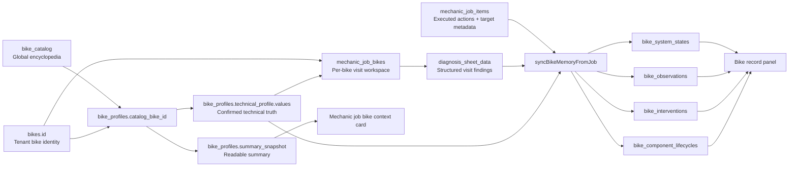
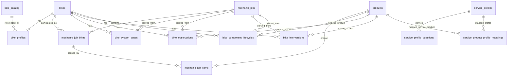

# Bike Workshop Master Schema

Last updated: 2026-10-01
Status: Living architecture document
Scope: Bike encyclopedia, bike profile, diagnosis, workshop items, service wizard, supply needs and commitments, bike memory kernel, sync pipeline, and visible bike history

Compatibility concepts companion: `BIKE_WORKSHOP_COMPATIBILITY_CONCEPTS.md`

**Plan de ejecución vigente:** `PLANS.md` controla entregables, responsables,
condiciones de cierre y siguiente acción. Desde la corrección del dueño del
2026-09-30 se prioriza completar recorridos implementados; cada prueba debe
decidir un criterio pendiente o un defecto concreto. Este Master conserva el
alcance y la evidencia; los prototipos no cierran sus objetivos.

**Antecedente, 2026-09-30:** recorridos completos C1/C4 de escritorio y
Android aceptados con readback/retirada=1. El backend completo de recuperación
170000/171000/172000 y archivos180000/181000 está APPLIED con readbacks y
recibos exactos: captura71 tablas y conserva datos vivos. Seis fotos heredadas
atribuidas tienen copia privada productiva verificada (7.908.102 bytes), cero
referencias modificadas y cero originales retirados. ERP/portal/PDF leen la
copia con el original sintético404; Android focal claro/oscuro también aceptado.
Los siete criterios están acreditados en el corte local; fila real de historial,
leyenda y etiquetas legibles en Android y escritorio claro/oscuro.
**Retiro público, 2026-10-01 03:43 UTC (decisión del dueño):** los 16 objetos
heredados de `vinabike-assets` (8 fotos de trabajos, 8 PDF de presupuestos)
dejaron de ser públicos. Las 6 fotos atribuidas se leen de su copia privada;
las 2 HEIC y los 8 PDF sin dueño quedaron en la cuarentena privada de bytes
heredados con recibo. Readback 0 públicos/6 copias/10 cuarentenas, URL
pública 16/16 «no existe». Cliente publicado el 2026-10-01 (`e0474159`,
`2706b1f8`): web ERP comprobada en vivo leyendo la copia privada, macOS y
Android 1.0.3+76 y tienda/portal publicados en el mismo `2706b1f8`.
Los checkpoints anteriores conservan su fecha; `PLANS.md` manda para la acción.

**Revisión independiente de Codex, 2026-10-01 05:00 UTC:** catálogo público 0,
6 copias/10 recibos de cuarentena y URL pública 16/16 ausente. Los 16 destinos
privados se descargaron de nuevo para comparar tamaño/hash con los recibos:
16/16 conformes, 13.953.499 bytes. `main` local/remoto, ERP web, manifiesto
macOS 1.0.3/258 (firma válida) y evidencia Android 1.0.3+76 coinciden en
`2706b1f8`, con CI completo verde. A05:00 UTC tienda/portal aún servía `0cd98f00`;
la publicación excepcional de Codex terminó a05:35:06 UTC y cerró C5.

**Cierre C1–C5, 2026-10-01 05:35 UTC:** `vinabike.cl` y
`vinabike-store.web.app` sirven `2706b1f83cb5f8dcefbd9d4fe7a62ca03cdda436`,
versión Firebase `87a5e692862548fc`. Export limpio de6503 fuentes/modos
verificados contra Git, calificación exacta36813275195 ya verde, build de
`main_store.dart`, presupuesto y guardas de revisión SEO/catálogo conformes.
Evidencia `manual-shell`, `dirty:false`; release/manifest y41 hashes por
origen iguales al bundle82/82. Chrome comprobó portada, acceso del portal y
ficha pública real. Los recorridos privados, teléfono y claro/oscuro conservan
la aceptación del mismo código descrita abajo. Recibo y logs en
`.tmp/e2e/store-publication-2706b1f8-20261001/`. No se inventó un `request_id`
ni se instaló el conducto durable ausente para entregar este corte; se usó
la ruta excepcional de sólo tienda documentada en el runbook de releases.
ERP permanece en el mismo commit. Los defectos de UI registrados y el nuevo
encargo de reparación del buscador son tareas separadas de este cierre.

**General y la factura, 2026-10-01 (local, sin desplegar; el dueño dijo «no
publiques hasta que yo te lo diga»):** General es a propósito, también con una
sola bici: lo que el cliente compra aparte (dueño). `20261001200000` arregla la
factura → el trabajo, que borraba la línea de la bici y la recreaba en
General, y pasa a su bici los servicios y componentes que quedaron ahí (328
líneas de 122 trabajos); los accesorios se quedan. `20261001195000`: una línea
de General no es de ninguna bici, tampoco con una sola, ni para la ficha ni
para la memoria. `20261001190000`: una sola regla reparte las líneas entre
repuestos y mano de obra en la bici, el trabajo, la factura y la cotización.
Orden: 190000, 195000, 200000, y la app después. El detalle está en «General
y la factura», después de «Asignar a <bici>».

**Production checkpoint, 2026-09-29:** 16 forward migrations from
`20260928050000` through `20260929040000` (including `20260928052000`) are
applied, verified and stamped in production. The exact list, readback issue
resolved for llanta, health result and outstanding client and full-restore gates
are in `docs/development/MASTER_SCHEMA_PRODUCTION_DEPLOYMENT_2026-09-29.md`.
The separate `20260929050000` view refresh is also applied and verified:
`products_with_sets` now exposes all 101 product columns plus its four set
fields, while keeping `security_invoker` and its restricted grants.
`20260929060000_guard_job_completion_bike_facts.sql` is also `APPLIED` and
verified in production: an incompatible marked part now rolls back the
completion atomically. The Flutter client for the correction dialog remains
only in this checkout.
`20260929070000_private_task_attachments.sql` is `APPLIED` with a successful
remote readback. It protects new task files by task visibility. The matching
Flutter client's local Auth/Storage/TaskService journey passed on 2026-09-30;
the real form's web journey passed 1/1 with readback and 24 frames on 2026-09-30;
native phone and the published client remain open.
`20260929080000_ack_private_task_attachment_cleanup.sql` is also `APPLIED`
with a successful readback. It lets an authorized client resume tombstoned
Storage deletions and acknowledge them only when the object is absent; the
client's real local web form passed removal, failure and resumed cleanup on
2026-09-30; native phone remains open.
`20260929090000_private_task_orphan_storage_cleanup.sql` is `APPLIED` with a
successful readback. It lets the original uploader see and delete only their
own unlinked private object after a failed RPC; the client cleanup remains
local and has no real interrupted-upload proof.
`20260929100000_scope_task_attachment_cleanup_queue.sql` is `APPLIED` with a
successful readback. Its v2 cleanup queue pages within an explicit tenant and
retains the per-file authorization check; the Flutter caller is still local.
`20260929110000_task_attachment_recovery_status.sql` is `APPLIED` with a
successful readback. An authorized uploader can distinguish their active,
removed, and never-linked attachment UUID without exposing a Storage path.
The Flutter recovery caller is connected only in this checkout; `absent`
never authorizes deletion while another session may still be uploading or
linking.
`20260929120000_restore_posted_invoice_preflight.sql` is also `APPLIED` and
verified. The restore preflight and public entry now reject a backup before
deleting rows when a sales or purchase invoice has a status or active payment
that the existing invoice DELETE guard would refuse. This closes that false
positive, not the wider restore: the dependency refusal and unsafe legacy
replay still require a replacement engine.
`20260930010000_restore_legacy_column_preflight.sql` is `APPLIED` and
verified. It rejects an incompatible backup before the legacy motor when a
row omits a required/defaulted column, supplies NULL to NOT NULL, contains
an unknown column, or reaches a GENERATED ALWAYS identity that the old
implicit INSERT cannot write. It does not replace that motor or clear the
dependency refusal.
`20260930020000_guard_posted_invoice_delete_authorization.sql` is `APPLIED`
and verified on 2026-09-30 at 09:02 UTC. It replaces the posted-invoice purge
session-variable bypass with a private authorization for one invoice, tenant,
and transaction, consumed once. The installed forward passed 32/32 local
checks; production exact readback and stamp passed without business-row
changes. It protects both invoice tables and does not implement full restore.
Older sections below that say these specific migrations are “local, sin
desplegar” describe their development checkpoint and are superseded by this
production readback. The Master Schema as a whole remains open.

## Cola operativa vigente (reconciliada el 2026-09-29)

Esta cola sustituye el **orden** del bloque «Next Session Priority Queue
(reviewed 2026-08-24)», que se conserva abajo como historia de las decisiones
A–G. Las 16 migraciones indicadas arriba están en producción; el cliente
Flutter que usa esas funciones sigue sólo en el checkout local. Haber aplicado
SQL no demuestra que los siete criterios de cierre de este documento estén
cumplidos.

1. **Cierre del trabajo y verdad de la bici.** El reemplazo
   `20260929060000` está **desplegado, leído y sellado** en producción:
   `FINALIZADO`/`ENTREGADO` se revierten junto con parches, eventos y recibo
   si una marca no calza o carece de bici/rueda inequívoca. El error devuelve
   todas las líneas con la corrección concreta; las superficies de lista,
   tabla, calendario, edición y lote muestran un diálogo común, y el lote
   conserva seleccionados los trabajos fallidos. Desde una línea bloqueada,
   «Revisar líneas» abre Productos y Servicios del mismo trabajo (en la tabla
   compacta, su espacio inline); el formulario existente cambia a esa pestaña
   y el lote conserva los trabajos fallidos seleccionados y ofrece revisar el
   primero sin buscarlo de nuevo. Un fallo transitorio
   vuelve como `55P03` para conservar la llave del outbox y reintentar; `pending` y
   avisos de autoría histórica quedan como incertidumbre visible, sin afirmar
   un hecho. Las pruebas anteriores que esperaban un cierre parcial se
   cambiaron deliberadamente y hay casos de rollback, corrección y misma
   llave. El readback SQL pasó y `db-health production` dio cero críticos;
   **falta verificar el diálogo en la app real y publicar el cliente**. La
   lectura de producción del 2026-09-29 contó
   cero líneas con `hole_count` o `part_change` entre 1519 líneas de trabajos
   no eliminados; es un dato de alcance, no prueba del nuevo contrato.
   En un widget test focal nuevo del 2026-09-30, el diálogo común a 320 px,
   texto al 130 % y doce líneas bloqueadas mantuvo desplazable la última
   corrección y ejecutó «Revisar líneas» sin overflow (1/1; analyzer limpio).
   Esto cubre densidad en teléfono simulado, no sustituye un frame real de
   teléfono ni el error productivo todavía inexistente.
2. **Cliente publicable y recorrido real.** Reconciliar el código Flutter
   local con los 17 contratos del taller ya desplegados; verificar guardado, cierre,
   tareas, fotos, respaldo y cambios de partes con casos discriminantes y
   capturas reales de escritorio/teléfono, claro/oscuro. Reutilizar la sesión
   debug canónica y las pruebas ya ejecutadas. Preparar una versión revisable;
   la publicación del cliente no está autorizada en esta cola. Revisión
   independiente de sólo lectura de Claude y comprobación local del
   2026-09-29: las migraciones nuevas del taller y sus verificaciones
   siguen fuera de git (`git ls-files` no devuelve esas versiones). Un clon
   limpio no puede reconstruir este corte ni ejecutar sus pruebas. Además,
   constaban tres fallas de `bike_form_dialog_layout_test`: su doble de
   `BikeshopService` no implementaba las lecturas nuevas de la bandeja y
   llevaba al formulario a un estado bloqueado con un aviso que alteraba el
   layout. Al simular bandeja vacía y legible, la suite focal pasó **7/7**
   en el árbol combinado, sin cambiar el formulario; esta prueba no sustituye
   la captura en la app real.
   `scripts/run_flutter_test_gate.sh` sólo incluía
   `cart_lock_web_test.dart` en su paso Chrome y omitía
   `workshop_outbox_web_lock_test.dart`; se añadió localmente al mismo paso
   (script validado con `bash -n`, sin repetir la prueba Chrome ya pasada 2/2
   en un corte anterior). El 2026-09-30 se ejecutó **una sola vez**
   `scripts/run_flutter_test_gate.sh .fvm/flutter_sdk/bin/flutter` sobre el
   checkout compartido: la suite Flutter completa terminó verde y el paso
   Chrome ejecutó cinco pruebas verdes (tres de carrito y dos de la bandeja
   del taller). El caché de prueba generado se movió a Papelera. Es una
   calificación del árbol local, no de un clon limpio: migraciones,
   verificaciones y pruebas nuevas siguen sin seguimiento en git. Tampoco
   verifica Storage real, teléfono ni cliente publicado; no se hizo commit,
   push o publicación. Una pasada completa posterior del analizador,
   `dart analyze --no-fatal-warnings` por separado sobre `lib` y `test`, dio
   **0 errores, 28 advertencias y 484 avisos**. Ninguna advertencia es del
   taller, las tareas privadas ni respaldos; el flag permite salida 0 con
   advertencias, no las oculta. Los registros generados se movieron a
   Papelera. No repetir el gate ni el análisis sin cambio o riesgo nuevo.
   **Inventario de integración, 2026-09-30:** 25 migraciones de este corte
   siguen sin seguimiento en Git. Las 25 tienen readback SQL pareado y recibo
   local `APPLIED`; el SHA-256 actual de cada migración y cada readback
   coincide con su recibo (25/25 y 25/25). También siguen fuera de Git 17
   pruebas SQL, 15 pruebas Flutter y el nuevo smoke iOS todavía no ejecutado.
   Esta verificación fue sólo de archivos y recibos locales: no consultó ni
   escribió producción. El contenido está preservado, pero un clon limpio no
   lo tendrá hasta una integración autorizada.
   **Intento de teléfono real, 2026-09-30:** se preparó
   `integration_test/workshop_completion_ios_smoke_test.dart` sin sesión ni
   datos productivos para medir el diálogo con doce líneas, los insets de iOS
   y la acción «Revisar líneas». Su analyzer pasó, pero **no llegó a ejecutarse
   en iPhone**. Xcode 27 rechazó primero el mínimo iOS 14 de Runner; se alineó
   Runner y `AppFrameworkInfo.plist` con el mínimo iOS 16 que ya exigía el
   Podfile, y una compilación genérica del simulador terminó. Esa build es
   sólo x86_64 porque los Pods de MLKit excluyen arm64 para simulador. En el
   iPhone 17e estándar arrancado como arm64, `launchd_sim` rechazó `Runner`
   con `EBADARCH`; arrancarlo explícitamente como x86_64 no completó el inicio
   utilizable en este Mac y se apagó. No se obtuvo frame ni interacción real
   del diálogo. El siguiente corte de teléfono requiere un binario compatible
   con arm64-simulator (o un runtime x86 operativo), sin presumir que el
   build exitoso o la instalación prueban la app. La sesión macOS canónica
   siguió viva; no hubo canario ni publicación.
   La [documentación oficial de ML Kit](https://developers.google.com/ml-kit/known-issues)
   aún declara incompatibles sus simuladores en Mac M1 (actualizada el
   2026-09-24). Cambiar a ciegas `EXCLUDED_ARCHS` no es una salida verificada:
   un arnés iOS que aísle sólo el diálogo de ML Kit podría medir safe areas y
   tacto, pero la ruta autenticada del cliente completo seguiría pendiente.
   El 2026-09-29
   se corrigió otra discrepancia del cliente local: el formulario nuevo
   ofrecía elegir «En Curso», «Completada» o «Cancelada» aunque
   `smart_task_create_v1` siempre inserta `pending`; la elección se perdía en
   silencio. Ahora explica que la tarea nace pendiente y el modelo no promete
   otro estado al crear. La transición se hace después de guardarla, mediante
   el comando de ciclo correspondiente. El test del modelo pasó 5/5;
   el 2026-09-29 se comprobó además en la app macOS debug canónica, tras hot
   reload y sin guardar datos, desde Taller → Trabajos → Vista: Tareas →
   Nueva Tarea. La semántica y el frame real de escritorio claro mostraron
   «Pendiente al crear. Cámbiala después de guardarla» y «Agregar archivo»;
   el compositor «Nueva tarea» del rail es otra superficie. La captura fue
   temporal bajo la higiene local. En el mismo formulario, escritorio oscuro
   reveló que el estado vacío de adjuntos tenía fondo gris claro fijo;
   `TaskFormDialog` ahora usa roles de superficie, contorno y texto del tema.
   Tras analizar el archivo y aplicar hot reload, el frame oscuro real mostró
   el recuadro integrado y legible; se devolvió la preferencia persistida a
   Claro y la app a Dashboard. Siguen faltando teléfono y el recorrido real
   de subir/abrir/retirar un archivo.
   El 2026-09-29
   se corrigió localmente el formulario legado de tareas: un fallo al subir
   adjuntos después de crear la tarea conserva su ID y llave de creación;
   al reintentar guarda la misma tarea y sube sólo los archivos pendientes.
   Cada subida nueva usa un nombre de objeto único y sin reemplazo. La ruta
   privada y el vínculo atómico por archivo ya están implementados en el
   cliente local sobre `070000`, sin prueba real de subida, lectura y retiro;
   esos controles impiden publicar esta superficie como cerrada.
   El formulario local abre cada adjunto existente con URL firmada creada al
   tocar «Abrir»; no guarda esa URL en la tarea. La edición mantiene fuera del
   JSONB los vínculos privados, cuya fuente es la tabla por archivo.
   En la tabla y la vista compacta, tocar la celda de adjuntos, vacía o llena,
   abre el mismo formulario directamente en «Adjuntos». La celda vacía sigue
   ofreciendo agregar; ya no mantiene un segundo selector que, al fallar,
   dejaba el único reintento y el UUID del archivo en un `SnackBar` persistente
   que sobrevivía a salir de Tareas. El formulario conserva ambos mientras el
   operador corrige o reintenta. Si la subida ya comenzó, Atrás no puede cerrar
   el diálogo a mitad del envío. Si falla después de guardar la tarea,
   Cancelar, la X y Atrás piden confirmar antes de perder los archivos e IDs
   pendientes: «Seguir aquí» conserva el reintento, mientras cerrar declara
   que habrá que elegir los archivos de nuevo. Un widget test con creación
   simulada y subida suspendida/fallida pasó 1/1; no prueba Storage real ni
   recupera los bytes del archivo después de elegir salir.
   Para ese último intervalo se preparó **sólo local**
   `TaskUploadCleanupJournal`: una clave persistente por UUID de adjunto,
   acotada por taller y usuario, con ID de tarea, dueño de sesión y marcas de
   tiempo. No guarda nombre, ruta ni bytes. Dos pruebas focales pasaron 2/2:
   las entradas sobreviven a un lector nuevo sin mezclarse entre talleres o
   usuarios, y un registro intercambiado se rechaza. Después se conectó
   `TaskService.addAttachment`: exige un lease de taller y usuario, persiste
   la intención **antes de la primera lectura/subida remota** y la retira
   sólo tras verificar el vínculo activo después del recibo. La prueba de
   transporte focal pasó 7/7 y comprobó que Storage ve la intención previa,
   el éxito la retira y un replay rechazado la conserva.
   **Corrección local 2026-09-29:** el journal usa una clave por UUID y una
   segunda sesión podía reemplazar una intención pendiente de la primera.
   Ahora rechaza sesión o tarea distintas al registrar ese UUID; al olvidar
   comprueba la autoría y deja intacta una entrada ajena. La suite del
   journal pasó 3/3 y el replay de transporte 1/1. Esto evita el reemplazo
   secuencial local, pero la comprobación de preferencias no es atómica entre
   procesos: el claim del
   servidor sigue pendiente antes de borrar cualquier huérfano.
   **Auditoría del 2026-09-30:** el journal conoce la sesión local, pero la ruta
   privada desplegada y su RLS sólo distinguen taller, tarea, UUID y usuario;
   la RPC de vínculo tampoco recibe una generación de intento. Por ello una
   reserva sólo sobre la fila SQL no demuestra que haya terminado un upload
   ya admitido por Storage. El contrato siguiente debe usar un intento
   exclusivo y una ruta distinta por generación, validar ambos en Storage y
   en el vínculo, y probar dos procesos y una subida tardía tras abandono.
   Hasta demostrar que un envío admitido ya terminó, `absent`/edad/claim SQL
   aislado no autorizan DELETE: la intención se conserva para revisión
   autorizada. El diseño y las pruebas son el siguiente corte; no cambiar
   las migraciones ya aplicadas.
   La salida explícita del formulario tras un fallo marca los intentos de esa
   tarea, usuario y sesión como abandonados **antes de cerrar**. Si no puede
   persistir la marca, conserva el formulario y los bytes; el widget test
   cubre ambas rutas (1/1) y el transporte confirmó la marca en un objeto sin
   vínculo (7/7). El
   analizador de servicio, diálogo, registro y pruebas dio cero issues.
   Al iniciar, el servicio lee los intentos del taller/usuario vigente. Ahora
   llama a `smart_task_attachment_recovery_status_v1` bajo el lease de ese
   taller y usuario: retira la intención sólo si la RPC confirma `active` o
   `removed`, porque un tombstone ya pertenece a la cola durable de retiro;
   `absent` y falta de permiso conservan la intención. La prueba focal de
   transporte pasó 8/8 con ausente, tombstone, vínculo activo y uploader
   ajeno; no emitió DELETE de Storage. Analyzer de servicio y prueba, limpio.
   **Sigue sin limpiar objetos huérfanos**: la RLS de
   `smart_task_attachments` oculta los vínculos retirados, así que una lectura
   directa vacía no distingue ausencia de tombstone ni autoriza borrar bytes.
   El estado autorizado ya está desplegado como
   `smart_task_attachment_recovery_status_v1`: exige escritura de la tarea,
   taller y uploader exactos, y sólo devuelve `active`, `removed` o `absent`.
   PgTAP focal 53/53 y readback productivo pasaron; el cliente sólo local ya
   usa esta RPC para reconciliar su registro de intención.
   `absent` sigue sin probar que otra sesión haya terminado su subida o RPC,
   así que la limpieza de huérfanos necesita exclusión/claim adicional.
   El 2026-09-29 se cerró sólo en el cliente local otra ventana de autoridad:
   si el operador cambia de taller o sesión mientras Storage sube el archivo,
   el servicio comprueba de nuevo el lease antes de pedir la RPC que lo
   vincula. También lo comprueba antes y después de leer vínculo o bytes.
   La prueba focal simuló el
   cambio durante Storage: hubo una subida, cero RPC de vínculo y la intención
   persistente quedó para reconciliación; analyzer de servicio/prueba limpio.
   Los bytes podrían haberse guardado; este control no autoriza borrarlos sin
   el claim pendiente ni demuestra Storage real.
   **Corrección 2026-09-29:** el cliente local todavía borraba esos bytes al
   recibir un error SQL de vínculo si una lectura puntual no hallaba fila.
   Otra sesión podía estar subiendo o vinculando el mismo UUID; esa ausencia
   no excluye al productor. Se quitó el DELETE inmediato y se conserva la
   intención para reconciliarla. La prueba focal de RPC rechazada pasó 1/1:
   objeto y UUID permanecen, cero DELETE; analyzer de servicio/prueba limpio.
   En el retiro local, otra prueba focal cambió de taller después de que la
   RPC ocultara el vínculo: el servicio dejó los bytes y el acuse intactos
   para la cola durable del taller original (1/1). Antes del DELETE valida el
   prefijo privado y pasa el lease al borrado/acuse, sin refrescar la bandeja
   anterior bajo la identidad nueva. Analyzer del servicio y prueba limpio;
   aún falta comprobar el retiro con Storage real.
   Salir tras timeout tampoco permite reanudar la
   subida sin volver a elegir los bytes. No eliminar por antigüedad a ciegas.
   En la app macOS debug canónica, después de hot
   reload, se tocó la celda vacía de una tarea existente: abrió la tarea
   correcta con «Adjuntos» y «Agregar archivo» visibles; se canceló sin elegir
   archivo ni guardar y se volvió a Dashboard. El «+» de la tabla también
   carecía de nombre accesible y su zona era de 32 px: ahora nombra la tarea y
   ofrece 48×48 px sin agrandar el dibujo. La semántica de la app confirmó el
   nombre y tamaño, y abrió el mismo formulario al tocarlo por ese nombre.
   Una prueba focal del host compacto a 384 px abrió una celda vacía de la
   tarea exacta en `TaskFormDialog`, con `openAttachments` y «Agregar archivo»
   visibles (1/1); no eligió archivo ni invocó Storage.
   Esto verifica la entrada, no la
   subida ni Storage. Un fallo temporal al firmar la
   miniatura no queda en caché durante cuatro minutos: el archivo permanece
   accesible desde el formulario y una reconstrucción puede reintentar.
   El formulario filtra archivos vacíos,
   ilegibles o mayores de 20 MB al seleccionarlos e indican cuáles se
   omitieron; no esperan a que el guardado de la tarea descubra un archivo que
   el bucket privado no aceptaría.
   Para recuperar una respuesta perdida del alta, el cliente consulta primero
   el vínculo autorizado por su UUID: si ya coincide, no sube los bytes otra
   vez y pide el recibo del comando. Después del recibo comprueba que el
   vínculo siga activo, pues un recibo histórico no prueba que nadie haya
   retirado el archivo. Falta provocar y observar esta interrupción en una
   prueba real.
   La coincidencia de ID, nombre y tamaño tampoco prueba el contenido: en un
   replay con vínculo o tras una respuesta perdida de Storage, el cliente
   descarga el objeto autorizado y compara los bytes antes de reutilizar la
   ruta. Si difieren, pide quitar el pendiente y seleccionarlo de nuevo; no
   crea un vínculo con metadatos falsos. Falta probar ese replay con Storage
   real; el servicio local estaba apagado en este corte y levantarlo habría
   descargado imágenes Docker con sólo ~17 GiB libres.
   Un test de transporte HTTP simulado pasó 6/6 para el replay con mismos y
   distintos bytes, incluso con ruta huérfana ocupada, y para el retiro con
   borrado físico exitoso o fallido: sólo el exitoso pide el acuse, mientras
   ambos dejan el vínculo retirado. También cubre 26 tombstones en dos tandas
   y el reintento posterior de una tanda fallida sin ciclo de peticiones.
   No reemplaza la prueba contra Storage real ni demuestra sus políticas.
   La limpieza local pendiente recorre tandas de 25 hasta agotar las que
   consiguió borrar y acusar. Si una tanda falla, se detiene para no repetir
   inmediatamente los mismos tombstones; una sesión posterior los retoma.
   Comprueba la identidad de la sesión entre el borrado físico y el acuse,
   de modo que un cambio de usuario deja el acuse pendiente para su dueño.
   Revisión del 2026-09-29: `pending_cleanup_v1` no filtraba por taller activo
   y su permiso de asignado podía, en teoría, poner una ruta ajena al inicio
   de la página. La auditoría de producción halló 0 cuentas con dos perfiles
   ERP activos y 0 solapamientos activos ERP/portal; el índice único y las
   guardias de identidad estaban habilitados. No hubo cruce observado bajo
   esas invariantes. El cliente local omite defensivamente una ruta fuera de
   su lease, termina las válidas de esa página y corta para no iterar sin fin
   (test HTTP focal 1/1). `20260929100000` añade
   `smart_task_attachment_pending_cleanup_v2(p_tenant_id, p_limit)`, que
   filtra antes de paginar y vuelve a comprobar autorización por archivo; el
   cliente local le entrega el taller de su lease. PgTAP focal 45/45 con dos
   talleres y página de tamaño uno, test HTTP 7/7, readback remoto verde y
   sello `APPLIED`. No se movieron ni borraron bytes productivos; había 0
   vínculos pendientes en el readback. La protección aún requiere un archivo
   real en la app.
   Este recorrido aún no tiene prueba con Storage real.
   **Superado por la corrección del 2026-09-29 indicada arriba:** un error SQL
   definitivo ya no causa DELETE por una lectura puntual sin vínculo; el
   objeto y su intención quedan para reintento o limpieza con claim del
   servidor. `090000` sigue permitiendo al uploader leer un objeto sin
   vínculo, pero ese permiso por sí solo no autoriza su borrado. PgTAP focal
   35/35 y readback remoto verde, sin afirmar retiro real desde Flutter.
   Al retirar un adjunto, la RPC oculta el vínculo antes del borrado físico.
   Si Storage o el acuse fallan después, el formulario local ya no muestra el
   archivo como activo: avisa que la limpieza queda pendiente y la sesión la
   retoma. Un adjunto legado con ID pero sin vínculo privado tampoco se envía
   a esa RPC. Falta comprobar ambos resultados en la app real.
   El 2026-09-29
   `fvm dart analyze lib test` encontró **0 errores**, 28 advertencias fuera
   del taller y 483 avisos de estilo; la sesión debug canónica aceptó un hot
   reload y el árbol semántico de Trabajos respondió. No se ha visto aún el
   diálogo de bloqueo en la app real: no hay líneas marcadas en producción y
   no se crea un trabajo mutante para forzarlo.
3. **Respaldo que realmente restaure.** `030000` evita pérdida y dice por qué
   se niega, pero hoy se niega en los diez talleres. Lectura agregada de
   producción del 2026-09-29: las dependencias no cubiertas abarcan 101 tablas
   distintas en esos talleres; 50 impedirían restaurar, 42 perderían filas y
   9 quedarían desconectadas. El conteo es entre talleres, no por taller.
   Una segunda lectura, sólo del catálogo de llaves foráneas en producción
   (2026-09-29), delimita el trabajo de diseño: 194 tablas apuntan directamente
   a alguna de las 38 respaldadas; 27 ya están en el respaldo y 167 no. La
   clausura transitiva de esas llaves abarca 231 tablas públicas: las 38
   respaldadas y 193 no respaldadas. No se encontraron hijas en otros esquemas
   por estas llaves. Son relaciones posibles, incluidas tablas vacías, y no
   significan que haya que copiar las 193 ni sustituyen las 101 tablas con
   filas afectadas que detecta la guardia. Antes de cambiar el motor, clasificar
   cada dependencia por alcance de taller, acción de borrado y datos de un
   respaldo antiguo; después probar la restauración sin pérdida ni mezcla
   entre talleres. El catálogo tampoco detecta referencias en JSON, Storage
   o relaciones de aplicación sin llave foránea.
   Las 193 tablas no respaldadas de esa clausura sí tienen columna `tenant_id`,
   pero eso no permite restaurarlas filtrando sólo por ella: entre las 167
   hijas directas no respaldadas hay 294 llaves hacia las tablas cubiertas;
   apenas 88 incluyen `tenant_id` en la llave hija y 206 no. Es una propiedad
   del esquema, no evidencia de filas cruzadas. El alcance de cada hija debe
   seguir también los ids reales del padre que el restore reemplaza, como hace
   la negativa actual, y comprobar que la fila pertenece al taller correcto.
   Auditoría independiente de sólo lectura en producción (2026-09-29): el
   motor `restore_backup_legacy_rows_internal` todavía inserta las filas del
   respaldo con `jsonb_populate_recordset` y no activa una guardia general de
   restauración. Hay disparadores `INSERT` habilitados en facturas de venta,
   mensajes, pedidos en línea y empleados: respectivamente ejecutan la lógica
   de inventario/asiento, solicitan el push cuando está configurado, procesan
   el pedido y crean la cuenta de sueldo si existe su cuenta padre. Es un
   riesgo de efectos repetidos en un respaldo futuro que llegue al motor; el
   único respaldo completado hoy se rechaza antes por tablas ausentes. Para
   delimitar R0, el inventario de sólo lectura
   `supabase/manual_checks/verification/restore_enabled_insert_triggers.sql`
   encontró **113 funciones distintas** de disparadores `INSERT` de usuario,
   habilitados en las 38 tablas cubiertas. Ninguna de esas definiciones
   menciona literalmente `app.restore_tenant`; es una pista de catálogo, no
   prueba de que sus llamadas anidadas carezcan de guardia. Incluye validadores
   de integridad y proyecciones, inventario/contabilidad, notificaciones,
   broadcasts y sincronización de catálogo. R0 debe clasificar cada efecto
   antes de aislar el replay: no se puede apagar el conjunto de disparadores
   sin perder las guardias que protegen los datos restaurados. La lectura
   focal `supabase/manual_checks/verification/restore_priority_insert_effect_paths.sql`
   confirmó **8 rutas de llamada directa** en definiciones activas: stock y
   asiento de ventas; stock y asiento de compras; procesamiento de pedido;
   solicitud de push de mensaje; sincronización de catálogo; y aviso realtime
   financiero. Cada rama tiene sus condiciones (por ejemplo estado de factura,
   medio de pago o configuración de push): la lectura demuestra que el replay
   puede alcanzarlas, no que se ejecutaron ni que todas deban suprimirse. R0
   debe conservar validadores y decidir explícitamente qué proyecciones se
   reconstruyen y qué efectos externos se omiten durante la restauración. Para
   R0, Claude añadió **sólo local**
   `supabase/tests/restore_backup_replay_reposts_invoice.sql` sin editar el
   motor. Codex revisó su archivo, el log pgTAP (11/11, ROLLBACK) y la fuente
   del validador. Con una venta contabilizada y un respaldo creado por
   `create_backup`, el preflight anterior devolvía `can_restore: true`,
   pero `restore_backup` fallaba al borrar esa factura: el disparador
   `aaa_guard_posted_sales_invoice_delete` rechaza documentos no borrador.
   El fallo revierte sin cambiar factura, cuentas, asiento ni respaldo. La
   prueba también activó **sólo dentro de la transacción local** la salida de
   purga que el validador reserva a postgres/service_role: el replay entonces
   llega a la inserción, vuelve a contabilizar la venta y choca con las
   cuentas del respaldo (`accounts_tenant_id_code_key`). Al aislar el asiento,
   éste choca con el asiento recreado (`23505` en
   `idx_journal_entries_sales_source_document_unique`). No hubo duplicación
   silenciosa; el error revierte todo. Una venta en borrador es control que sí
   restaura. La prueba no siembra mensajes, productos ni pedidos; comprueba
   cola `pg_net` sin cambio. **Guardia aplicada el 2026-09-30:**
   `20260929120000_restore_posted_invoice_preflight.sql` hace que el
   preflight y la entrada real nieguen antes del motor si una factura de venta
   o compra no es borrador o tiene pagos activos, usando el mismo predicado
   que el guard de borrado. Devuelven `restore_invoice_delete_blocked` y un
   mensaje legible; la comprobación privada no concede EXECUTE al cliente.
   El pgTAP focal ajustado pasó 12/12 en transacción local, incluido el caso
   de compra cancelada, la negativa temprana de venta contabilizada y el
   control en borrador. El readback de producción pasó, la historia quedó
   `APPLIED`, el recibo SHA-256 es
   `54012be660a5dada40dd6aa9be9922c9e5366712d25a83dabb7ad3c9a8a2fd9d`;
   `db-health production` dio 0 críticos y las mismas 19 advertencias
   históricas. No se restauró ningún respaldo ni se escribió dato de negocio.
   En el cliente local, el diálogo de `Configuración > Respaldos` ahora prueba
   esta negativa del preflight: muestra la causa, retira «Restaurar» y permite
   descargar el JSON. Si el estado cambia entre consulta y comando, la página
   reconoce `restore_invoice_delete_blocked` como negativa de negocio y
   conserva el mensaje del servidor en vez de anteponer «Error». El widget
   focal pasó 1/1; falta comprobar el recorrido real de esta causa en la app.
   El 2026-09-30, la sesión macOS debug canónica abrió un respaldo completado
   desde Configuración → Respaldo y restauración → Restaurar, sin escribir.
   El preflight real rechazó ese respaldo antiguo por tablas que no guarda:
   explicó la pérdida, ofreció Descargar JSON y no mostró acción Restaurar.
   Se cerró el diálogo sin descargar y se volvió a Inicio. Esta comprobación
   confirma la negativa por tablas faltantes en escritorio claro, no la causa
   de facturas ni una restauración completa. La inspección de semántica reveló
   que el menú de cada respaldo carecía de nombre; el cliente local ahora lo
   etiqueta con el nombre del respaldo para encontrar la acción sin coordenada.
   El `tooltip` solo no nombró el control en el árbol, y envolverlo sin excluir
   la semántica hija duplicó el foco. La versión local usa un único nodo por
   menú con la acción de `PopupMenuButton`: tras hot reload se leyó el objetivo
   nombrado de 48×48, se abrió por esa etiqueta y se vieron sus opciones.
   No se eligió ninguna; se cerró el menú y se volvió a Inicio. VoiceOver sigue
   sin prueba independiente.
   No habilitar sólo la purga: R1 exige rediseñar replay por
   diferencia y aislar efectos sin desactivar validadores. Este escenario
   focal complementa la negativa actual por tablas no cubiertas en los diez
   talleres; no demuestra restore completo.
   Para
   ese respaldo, la comparación entre sus claves JSON y el catálogo actual
   encontró columnas ausentes `NOT NULL`: 7 en productos, 4 en trabajos y 4 en
   facturas de compra. También faltan columnas con valor por defecto (8, 5 y
   8, respectivamente); la inserción de registro completo puede escribir
   `NULL` en vez de aplicar esos defaults. La sonda transaccional **sólo local**
   `supabase/manual_checks/probes/restore_legacy_recordset_defaults_local.sql`
   reprodujo esa semántica sin tocar filas de negocio: el registro completo
   aportó `NULL`, el `INSERT` falló con `23502` y el `INSERT` con columnas
   explícitas sí aplicó el default. Es prueba del mecanismo SQL, no de un
   restore completo ni de sus efectos. Un segundo prototipo **sólo local**,
   `supabase/manual_checks/probes/restore_present_columns_local.sql`, insertó
   únicamente las columnas presentes en cada objeto JSON: la omitida tomó el
   default del esquema, un `NULL` explícito mantuvo el rechazo `NOT NULL`, y
   una clave desconocida se rechazó en vez de desaparecer. El wrapper local
   terminó con `ROLLBACK` y dos filas temporales esperadas (ids 1 y 4); la
   sonda prohíbe tablas que no sean temporales. Aún no es un motor para las
   38 tablas ni aísla disparadores o dependencias. El nuevo motor debe controlar los
   efectos de negocio por transacción sin apagar guardias de integridad, usar
   columnas explícitas y rechazar un respaldo incompatible antes de escribir.
   **Guardia R2 desplegada el 2026-09-30:**
   `20260930010000_restore_legacy_column_preflight.sql` inspecciona el
   catálogo y el JSON antes del motor actual. Niega una fila sin columna
   `NOT NULL` o con `DEFAULT` —que el `INSERT` de registro completo convertiría
   en `NULL`—, un `NULL` explícito inválido y una clave desconocida que el
   recordset descartaría. También detecta `messages.message_sequence`, la
   identidad `GENERATED ALWAYS` cubierta por el respaldo: una sonda temporal
   reprodujo que el `INSERT` implícito falla con SQLSTATE `428C9`. El
   preflight y la entrada real consultan el mismo helper antes de borrar; el
   cliente local presenta su negativa `restore_backup_legacy_column_blocked`
   como motivo de negocio. PgTAP focal 11/11 y widget focal 1/1, analyzer de
   ambos Dart tocados sin issues. El readback falló antes como se esperaba y
   después dio `restore_legacy_column_guard_contract=1`; historia `APPLIED`,
   recibo SHA-256
   `f1bf6cc2ee96069312428c4bb9f6113cb6bf1f44959bc06e095d36e6023f8e00`.
   Una lectura agregada encontró incompatible por este helper el único
   respaldo completado, pero la UI actual lo sigue negando primero por tablas
   ausentes; no se vio esta causa específica en app real ni se restauró nada.
   Antes y después había 1 respaldo completado y 905 ventas contabilizadas;
   `db-health production` conservó 0 críticos y 19 advertencias históricas.
   Esta guardia evita un replay erróneo; **no implementa** columnas explícitas,
   replay por diferencia ni aislamiento de efectos.
   Una sonda transaccional **sólo local** del 2026-09-30,
   `supabase/manual_checks/probes/restore_diff_parent_fk_local.sql`,
   separó un respaldo de un taller en una fila existente para actualizar, una
   nueva para insertar y una fila viva ausente del respaldo para preservar.
   Terminó con `ROLLBACK` y plan 1/1/1: mantuvo tres referencias hijas,
   conservó el otro taller y aplicó el default a la fila nueva sin ejecutar
   `DELETE` del padre. Es una prueba del núcleo de identidad/FK en tablas
   temporales, **no** decide cuándo retirar filas vivas, no reproduce los
   disparadores reales y no verifica concurrencia ni restore completo. El
   motor debe definir esas decisiones antes de reemplazar el replay heredado.
   **Planificador de diferencias, sólo local (2026-09-30):**
   `supabase/tests/restore_diff_plan_local.sql` contiene un núcleo de sesión
   `pg_temp`, sin RPC ni definición persistente. Lee las 38 tablas del alcance
   y sus claves primarias reales; `conversation_participants` exige la pareja
   `conversation_id`/`user_id`, no un supuesto `id`. Cuenta filas iguales,
   candidatas a actualizar/insertar y filas vivas ausentes. Compara sólo campos
   presentes, tras convertir al tipo del catálogo; no ejecuta defaults ni
   confunde omisión con NULL. Rechaza PK duplicadas tras conversión, identidades
   existentes fuera del alcance, taller ajeno, campos desconocidos y altas sin
   valor obligatorio. PgTAP focal **42/42**, con rollback: 1 igual/1 cambio/1
   alta/1 viva, UUID/número/hora equivalentes, PK compuesta y cambio de JSON
   anidado; un trigger temporal prohíbe toda escritura del planner. Las tablas
   omitidas se informan como ausentes, nunca como vacías. Las filas vivas se
   conservan para revisión: no se autoriza purgarlas ni se afirma recuperar un
   estado exacto. El núcleo comprueba ahora las FK de las filas entrantes contra
   el estado efectivo de cada padre: datos presentes del respaldo sobre la
   fila viva, columnas omitidas preservadas y filas vivas ausentes conservadas.
   Usa las columnas y operadores tipados de `pg_constraint`, incluidas FK
   compuestas y referencias a UNIQUE que no es la PK. Rechaza padres ausentes,
   de otro taller y el NULL parcial de MATCH FULL; un cambio respaldado de una
   clave UNIQUE no deja disponible su valor viejo. Un default nuevo omitido
   queda sin resolver, sin ejecutarlo. Padres sin contrato de taller, incluidos
   `auth.users`, quedan `scope_unchecked`: existencia no prueba membresía.
   Las 12 regresiones nuevas cubren estos casos y el padre presente sólo en el
   respaldo; triggers temporales siguen prohibiendo DML del planner.
   Diez regresiones adicionales comprueban el impacto de cambiar columnas
   referenciadas sobre el estado efectivo de los hijos, incluidas tablas fuera
   del respaldo, hijos de otro taller y sin columna de taller. Detectan claves
   retiradas y referencias que quedarían reasignadas a otro padre. Un hijo
   respaldado corregido deja de ser candidato huérfano; su FK omitida, o una
   tabla hija vacía en el respaldo, conservan las referencias vivas. El informe
   expone ON UPDATE CASCADE sin simular ni autorizar que modifique esos hijos.
   Sólo cubre cambios de columnas referenciadas, no toda la clausura dependiente
   ni el orden ejecutable del replay. Log focal: `.tmp/db/pgtap-20260930-003429.log`.
   `can_restore=false` siempre: CHECK/UNIQUE globales, cierre de dependientes vivos,
   membresía, efectos de negocio, concurrencia y volumen siguen pendientes.
   El motor heredado y las migraciones APPLIED no se modificaron.
   **R1 local en revisión (2026-09-30):** Claude completó
   `supabase/tests/restore_effect_context_local.sql`: 36/36 con BEGIN/ROLLBACK,
   log `.tmp/db/pgtap-20260930-002727.log`, leído por Codex sin repetir la prueba.
   El candidato privado por transacción/taller/tabla/fila/operación evita
   contabilizar el INSERT autorizado en `handle_sales_invoice_change`;
   comprueba ACL, rol authenticated real, operación normal, otro taller,
   retiro, subtransacción fallida y guardias intactas. No se integró ni desplegó.
   **Límite verificado de la revisión:** `statement_timestamp()` no identifica
   cada sentencia lógica: varias sentencias de un mismo mensaje del cliente
   comparten el valor, aunque avance el reloj. La sonda local
   `supabase/manual_checks/probes/restore_statement_packet_clock_local.sql`,
   pasada como un único argumento `--sql`, lo comprobó y terminó en ROLLBACK.
   El candidato R1 aún no acredita aislamiento de invocación: requiere cierre
   de permisos sobrantes antes del retorno y una autorización por efecto para
   que varios disparadores de la fila puedan comprobar su permiso propio.
   **Defecto local reproducido:** con rol authenticated y
   `app.syncing_job_to_invoice=true`, una venta contabilizada queda sin asiento.
   El flag público omite los efectos del trigger definer. No se demostró un
   camino PostgREST que permita fijarlo; no atribuir una explotación de API ni
   modificar datos reales. Claude reprodujo además el bypass por GUC de
   `guard_posted_invoice_delete` como authenticated de un taller sintético:
   permitió borrar una venta contabilizada y su asiento. El candidato local
   pasó 38/38 con rollback; no se demostró una ruta PostgREST que fije esa GUC.
   La sincronización legítima necesita su
   propio contexto privado, no un permiso de restore reutilizable.
   **Corrección de ejecución por el dueño, 2026-09-30:** R1.b queda aplazado;
   se prioriza implementar y cerrar recorridos usables según `PLANS.md`.
   Claude entregó `20260930020000_guard_posted_invoice_delete_authorization.sql`,
   su readback y `supabase/tests/posted_invoice_purge_authorization.sql`.
   Codex revisa e integra ese forward, que todavía no se ejecutó ni desplegó;
   38/38 es la evidencia del candidato previo, no del forward instalado.
   **Revisión de integración (2026-09-30):** los tres cuerpos del forward
   coinciden con el candidato comprobado. Codex cambió la precondición y
   readback para exigir hashes exactos, search_path y dueños; una coincidencia
   del nombre del helper no permite sobrescribir una definición desconocida.
   Lectura productiva: head 130000, guard original intacto, objetos nuevos
   ausentes, 905 ventas/83 compras protegidas; readback negativo esperado.
   **Integración terminada a 09:02 UTC:** el forward exacto se instaló una vez
   en local; `posted_invoice_purge_authorization` pasó **32/32** con rollback,
   log `.tmp/db/pgtap-20260930-020023.log`. Readback local y productivo
   comprobó cuerpos, dueños, search_path, ACL y ambos triggers. El wrapper
   desplegó, leyó y selló `APPLIED`; recibo
   `.tmp/db/migration-receipts/20260930020000.receipt`, SHA-256 del forward
   `b5717dc2a854e305208ea34bbca6c361b16faa133764ee26f3033ab519712204`.
   Antes/después: 940 ventas, 87 compras, 2675 asientos; 905 ventas/83 compras
   protegidas, cero autorizaciones nuevas. Health: 0 críticos y las mismas
   19 alertas históricas. Este 32/32 prueba el forward instalado; el 38/38
   anterior sigue siendo sólo del candidato. No se restauró un respaldo ni
   se modificó una migración antes APPLIED.
   Claude recibió el recorrido real de adjuntos privados C1 con Auth/Storage y
   TaskService, archivos exclusivos y turno DB local. Running fue comprobado
   en la sesión existente. Codex conserva el planner y los documentos; no
   ejecuta wrappers locales durante ese turno.
   **C1 red real comprobada a 08:36 UTC:** el recorrido de Claude con Auth,
   Storage y TaskService reales pasó 1/1 como empleado mechanic sintético.
   Subió el archivo privado, abrió sus 55 bytes iguales (HTTP 200), otro taller
   no obtuvo URL/descarga/vínculo, retiró y acusó limpieza; la URL anterior
   dejó de abrir (HTTP 400). Readback=1: un vínculo retirado, cero objetos y
   cero vínculos del otro taller; retirada_completa=1. Codex leyó fuentes/log
   `.tmp/e2e/task-attachments-20260930-013406.log` sin repetir. DB, Auth, REST,
   Storage y Kong están activos conservando el volumen preparado. Este resultado
   sustituye el bloqueo anterior de servicios apagados; no demuestra UI ni
   teléfono ni cliente publicado. El dueño pidió traspasar la conducción a
   GPT 6.1 / Max / Full access y dar autonomía de implementación/queries/tests
   focales a Claude; continuidad en `PLANS.md` y el handoff del 2026-09-30.
   **C1 formulario real aceptado, 2026-09-30:** el ERP completo local
   (`lib/main.dart`) pasó 1/1 en `.tmp/e2e/task-form-20260930-033442.log`:
   login de mecánico, asignación a compañera, subida fallida con tarea guardada,
   reintento sin duplicar, salida descartando un pendiente, URL firmada/visor,
   retiro normal y retiro con Storage caído reanudado al volver. Readback=1 y
   retirada_completa=1: una tarea, dos vínculos retirados con acuse, cero bytes
   y ningún vínculo del archivo descartado. Codex revisó log, fuentes y frames
   reales de los 24 conservados en escritorio claro/oscuro y web de 390 px.
   Se corrigieron la consulta de asignación exclusiva de admin que dejaba sin
   compañeros al mecánico y los SnackBars detrás de la barrera del diálogo;
   ahora el aviso vive dentro y se anuncia. Perfil local aislado y detenido,
   fixture retirada, cinco servicios activos; no se repite este recorrido.
   El compacto web no sustituye la app nativa de teléfono. Codex posee ahora
   el turno DB local C2 durante ese checkpoint. Tras 30/30, readback exacto y
   las carreras siguientes, Codex lo devolvió a Claude C1 Android. Claude
   corrigió el directorio de la lista, prepara su APK local de `lib/main.dart`
   y corrige también caché/autoridad del panel contable; Running comprobado.
   **C1 Android nativo aceptado, 2026-09-30:**
   `.tmp/e2e/android-task-form-20260930-055146.log` termina con readback=1 y
   retirada=1: una tarea de mecánico asignada a compañera, dos archivos privados
   distintos abiertos/retirados/acusados, cero bytes y cero vínculos abandonados.
   App completa en AVD arm64 con Auth/Storage locales; 14 frames de siete estados
   claro/oscuro y semántica. Codex revisó fuentes/log/hoja de contacto; no repite.
   La lista muestra responsable y dos archivos; el panel contable del mecánico
   explica su permiso. Su caché valida autoridad antes de uso y vincula datos y
   respuestas al actor; dos regresiones nuevas, 28/28 de acceso/panel reportados.
   Fixture/app/reverse retirados, AVD apagado. Persisten dos defectos observados:
   encabezado blanco del visor oscuro y acciones de guardado bajo el scroll del
   formulario móvil. Claude los corrige en sus dueños y prepara el recorrido
   completo C1/C4; no se los declara fuera de alcance por ser anteriores.
   Turno DB local devuelto explícitamente a Codex C2. La segunda revisión sólo
   de fuente no encontró bloqueadores en las tres tablas revisadas; no acredita
   recuperación completa ni el resto del taller.
   **Preparación del motor integrado C2, 2026-09-30:**
   `20260930092309_restore_backup_merge_engine.sql` define entrada pública
   autenticada/admin, plan privado y escritor por diferencias; no borra filas
   ni desactiva triggers. El primer alcance de escritura revisado son clientes,
   marcas y modelos de bicis; las demás tablas se conservan sin cambios o se
   rechazan si requieren recuperación. Ausencia de trigger no acredita que una
   fila de stock, contabilidad o mensajes sea independiente. La copia de trabajo
   excluye valores generados sin alterar el respaldo; las columnas omitidas de
   filas existentes conservan sus valores, y los INSERT explícitos usan defaults
   de PostgreSQL sólo si su expresión es segura. Restricciones, FK y enlaces
   vivos se comprueban antes de escribir; la respuesta sólo da éxito cuando los
   campos aceptados coinciden tras la escritura real. Helpers privados sin
   EXECUTE de cliente ni service_role; la autoridad no sale de un GUC.
   **Instalado local/productivo; 32/32 del RPC real, APPLIED**:
   `.tmp/db/pgtap-20260930-060836.log` acreditó el archivo instalado con
   1.000 contactos posteriores, recreación de contacto/modelo/marca,
   conservación del portal posterior y rollback de la UNIQUE inmediata.
   Preflight y recuperación de ese caso tardaron ~2 s en local. El readback
   de 13 cuerpos exactos, dueños, ACL y espera configurada dio 1. Las dos
   conexiones de `restore_backup_merge_race_probe.sh` comprobaron que esperar
   una fila de backup o un escritor de clientes devuelve `restore_merge_busy`
   antes de liberarse el primero, sin datos ni informe escritos; retirada=1.
   La revisión independiente detectó la necesidad de fallar el readback a
   nivel SQL, comprobar hashes de triggers en el destino y eliminar el 40001;
   se integraron. El bloqueo se limita a las tres tablas revisadas y sus padres
   públicos; las claves referenciadas no cambian. El snapshot original se
   normaliza de nuevo bajo lock, conservando la identidad portal vigente.
   Una corrección adicional de fuente niega WHEN/rules desconocidos antes de
   ejecutarlos; ambas negativas reales pasaron en ese 32/32 sin ejecutar el
   efecto. Readback local exacto=1; antes del deploy falló en producción con
   división por cero y después pasó=1. `deploy_migration.sh` selló `APPLIED`
   a 13:13:30 UTC con recibo SHA-256. Permanecen 940 ventas, 87 compras,
   2675 asientos y un respaldo completado; no se invocó recuperación productiva.
   El forward y su verificación quedan inmutables. La prueba `restore_backup_merge.sql` llama al RPC
   real sobre `create_backup` sintético con factura contabilizada, registros
   nuevos y dependencias intactas; debe demostrar recuperación, aislamiento y
   rollback completo ante una UNIQUE inmediata, además de negativas de índice
   parcial/default desconocido y otro taller. No repite los núcleos 42/42.
   La UI interpreta el modo nuevo y el informe sin afirmar que se borrarán
   registros nuevos; 18/18 del gate focal y analyzer sin issues. Después del
   deploy el servicio selecciona los RPC pareados nuevos y conserva el mensaje
   del servidor, también cuando no hubo cambios que recuperar. C2 completo
   y runtime UI permanecen abiertos.
   **C4 consumidor de historial, 2026-09-30:** `BikeRecordPanel` convertía
   cualquier fallo de sus cinco lecturas en un historial vacío, dejando
   inalcanzable el estado de error de la UI. Se prepara en el dueño una
   negativa legible con reintento, sin excepción cruda, compartida por preview
   e historial, y renovación al recibir un snapshot nuevo de la misma bici.
   Gate focal 3/3 en `.tmp/e2e/bike-record-history-load-20260930.log`,
   analyzer limpio: fallo distinto de vacío, reintento claro/oscuro a 390 px y
   renovación de la misma bici. El gate encontró también títulos sin flex y
   un preview fijo de 420 px que desbordaba y consumía el área de lectura:
   la composición compacta conserva identidad/acciones arriba y el mismo mapa
   dentro del scroll técnico/histórico. El consumidor macOS ancho/estrecho,
   claro/oscuro quedó comprobado con frames reales: etiquetas del mapa dentro
   del frame y acciones conservadas. El padre del panel acota ahora su tira de
   pestañas al ancho disponible junto a Agregar bicicleta, sin depender del
   breakpoint global del shell. Mapa compartido 2/2; origen de catálogo 1/1:
   Aro, tipo de bici y espacios de masa también leen confirmación persistida,
   nunca se confirman por defecto. Un modelo vinculado no prueba el origen de
   un dato editable. Teléfono y siete criterios conjuntos siguen pendientes.
   **C5 fuente reconstruible:** `20260930152000` captura el cierre efectivo de
   producción, idéntico al seed local ya ejercido. APPLIED a 15:34:04 UTC,
   readback exacto del cuerpo/ACL/dos triggers y recibo SHA pareado. No cambia
   comportamiento ni ejecuta operaciones de negocio.
   **C2 consumidor real:** la revisión del único respaldo completado agotó
   el timeout 57014 en la app macOS y mostró una excepción técnica. Frame
   `.tmp/e2e/backup-preflight-production-timeout-20260930.png`. El aviso se
   corrige con explicación/reintento (focal 1/1); la demora debe resolverse en
   el motor completo. No hubo restore productivo.
   **C2 motor integrado, contrato y checkpoint de Claude (2026-09-30;
   estado productivo final debajo):** la regla es «vuelve lo que falta; lo que
   existe hoy manda». La pidió el único respaldo completado (2025-12-09, 31
   tablas, lectura agregada): de sus 40 líneas ausentes hoy, 39 son de
   trabajos que existen y ya están facturados, y 1 de un trabajo que falta;
   34 de sus clientes cambiaron teléfono/RUT después. Sobrescribir habría
   devuelto datos viejos; reinsertar, líneas a trabajos facturados.
   - `20260930170000` captura el grafo del taller en **una sola sentencia**
     (una instantánea): 70 tablas, sin `mechanic_job_line_gate_deferrals`
     (transitoria) y con `supply_needs`. Una tabla vacía se guarda como JSON
     `null`, no `[]`: el replay legado hace `insert … select *` y con `[]`
     de productos choca con la columna generada `spec_template_active_guard`.
   - `20260930171000` aísla efectos sin tocar el cuerpo de ninguna función:
     los 30 disparadores con efecto (stock, asientos, mensajes, eventos,
     memoria derivada) llevan `WHEN (NOT workshop_restore_effect_suppressed(
     tabla, disparador))`. El paquete es una fila privada por invocación
     (txid + backend), relación y disparador, abierta sólo alrededor de un
     INSERT y a profundidad 0. La función es SECURITY INVOKER: un cliente no
     puede leer los paquetes y recibe siempre `false`; no hay GUC ni permiso
     general. 11 validadores quedan activos con md5 revisado; un disparador
     desconocido o una regla INSERT niegan antes de escribir.
   - `20260930172000` es el motor detrás de los mismos RPC
     (`restore_backup_merge_preflight` / `restore_backup_merge`, contrato
     `workshop_graph_v1`, modo `restore_missing_keep_live`): nunca UPDATE ni
     DELETE, sólo INSERT de identidades ausentes. Raíces bicis, trabajos y
     tareas (3), 28 miembros que vuelven sólo con su raíz, 7 catálogos
     independientes; 32 tablas de ventas, compras, contabilidad, stock,
     mensajería, sitio, ajustes, productos y personal sólo se cuentan.
     Padre vivo o restaurado en la misma invocación: pasa; ausente y columna
     nula: el vínculo se suelta y se informa; ausente y obligatoria: la fila no
     vuelve (`parent_missing`); de otro taller: negativa. Un cliente que
     vuelve no recupera su cuenta del portal. Cada fila escrita se relee igual
     a la del respaldo. El costo es lineal por tabla (el 57014 venía de
     recomputar el delta por restricción): con 1.000 contactos y 300 líneas
     posteriores, preflight 272 ms y recuperación 259 ms en local
     (`.tmp/db/pgtap-20260930-130018.log`).
   - Negativas concretas y atómicas: `restore_merge_not_safe` (código, tabla,
     sqlstate), `_constraint_conflict`, `_busy` (candado de 3 s en orden de
     OID), `_timeout`. El preflight corre el motor real y lo deshace.
   - Gates locales: `restore_workshop_graph.sql` 24/24 (grafo real
     trabajo/bici/líneas/diagnóstico/ficha/memoria/historial/tarea, padres
     antes que hijos, identidad y datos posteriores intactos, sin reponer
     stock/asientos/mensajes, negativas de otro taller y de disparador no
     revisado sin ejecutarlo, autoridad, efectos normales siguen vivos);
     `restore_backup_merge.sql` 10/10 reescrito al contrato nuevo (el 32/32
     del motor `092309` queda en `.tmp/db/c2/restore_backup_merge.before-c2.sql`);
     tres verificadores `=1`; widget 24/24; dos conexiones reales con el
     motor nuevo (`restore_backup_merge_race_probe.sh`): fila del respaldo y
     escritor de clientes retenidos → `restore_merge_busy` sin escribir.
     Producción leída sin escribir: los 41 disparadores revisados existen,
     sin WHEN, con los md5 de los 11 validadores; ningún INSERT trigger ni
     regla sin revisar en las 38 tablas. Recorrido real: ver el traspaso
     `docs/development/MASTER_SCHEMA_HANDOFF_2026-09-30.md` «Checkpoint C2».
   **Ajuste tras la revisión de Codex (2026-09-30, instalado y comprobado):**
   el WHEN suprimía enteras cuatro guardas de tareas que mezclan relaciones
   con reescrituras (`smart_tasks_guard_primary_context`,
   `smart_tasks_guard_work_tray`, `smart_task_job_items_guard`,
   `smart_task_job_item_notes_guard`). El motor verifica ahora esas
   relaciones sin sus reescrituras (`workshop_restore_task_graph_internal`):
   un solo contexto principal, nota sin ciclo ni servicios, privada sin
   responsable ni trabajo, y cada servicio en la línea de su propio trabajo
   —y, mientras está activo, en el trabajo de la tarea—; cualquiera de esas
   contradicciones niega todo (`task_primary_context`,
   `task_link_job_mismatch`, `task_note_has_services`, `task_note_lifecycle`,
   `task_private_personal`). Un servicio activo cuya línea ya no existe no
   vuelve, ni sus notas (`parent_missing`, informado); un servicio
   invalidado es historia y vuelve tal cual, sin crear ni reasignar su línea.
   No se re-juzga la historia: responsables ya no elegibles y trabajos
   archivados después quedan como estaban. `restore_backup_merge` vuelve a
   decidir `can_manage_tenant_backups` con los candados tomados, antes del
   escritor. Negativas focales en `supabase/tests/restore_workshop_task_graph.sql`.
   El preflight corre el motor y lo deshace: es una sonda mutante, así que
   ningún agente lo mide en producción; el rendimiento queda con la
   evidencia local. Codex instaló el ajuste, comprobó negativas18/18 y
   verificador=1; incluido en el motor productivo APPLIED172000.
   **C2 backend APPLIED, 2026-09-30:** forwards170000/171000/172000/181000
   desplegados por el wrapper, readbacks exactos y sellos con recibos SHA.
   El 172000 final es `1204946ab646b7a9d02bc7a60574281d92959c8382e012061579080f1cf54cf8`
   (verificador `c85c854b79b95358a8c9c46d55050703f3829162cbbe179cfb19afdf6dde06e6`).
   El primer intento revirtió completo: producción tiene doce FK de memoria
   de bici hacia trabajo/bici del trabajo/línea que no existen en local.
   Se recuperan ciclos de vida/eventos/observaciones/intervenciones/estados
   después de esos padres, conservando su orden relativo (45–49). Read-only
   productivo=0 padres posteriores, graph24/24 del nuevo orden y revisión
   independiente de Claude aceptados. Los vínculos anulables sin padre se
   sueltan y se informan en producción; la prueba local sin esas FK no
   acredita ese camino. No se ejecutó preflight/restore productivo.
   181000 suma el recibo privado como miembro del trabajo: captura71 tablas,
   29 miembros, guard de dueño/vínculo/objeto activo y doce validadores keep.
   Conserva los cuatro helpers anteriores bajo alias privados; su verificador
   final fija21 cuerpos, ACL/autoridad/alcance y todos los caminos de escritura
   (`fe3ec28bde54c38c406c7ecf9882721b1946dcdb16098caab3ff868e79f783c5`).
   Sustituye los verificadores individuales cuyos nombres fueron renombrados;
   éstos pasaron antes del forward, no se vuelven a exigir después.
   Gate Auth/Storage local integrado C2/C3: captura del recibo, preflight
   deshecho y recuperación real de trabajo/recibo2/2 idénticos, sin paquetes
   abiertos; staff y cliente leen bytes privados exactos con original404.
   Evidencia `.tmp/e2e/c3-private-recovery-real-20260930.log`.
4. **Adjuntos privados heredados.** Ejecutar el plan en
   `docs/development/VINABIKE_ASSETS_SECURITY_PLAN_2026-09-29.md` por
   etapas: referencias vivas, destinos privados, lectura autorizada y
   verificación de bytes antes de retirar enlaces públicos. El movimiento de
   datos existentes requiere un alcance propio revisado.
   Una lectura agregada de producción del 2026-09-30 halló coincidencia
   literal para 6 de los 8 objetos `mechanic_jobs/` en
   `mechanic_jobs.image_urls`; los otros 2 y los 8 PDF `presupuestos/` no
   coincidieron con los campos candidatos examinados. La consulta no expuso
   nombres ni bytes. Falta rastrear referencias codificadas, otras tablas y
   usos externos antes de considerar cualquiera de esos diez objetos
   huérfano o moverlo.
   Una segunda lectura agregada corrigió el inventario: los dos archivos de
   trabajos sin coincidencia son imágenes HEIC, no archivos de otro tipo.
   Las ocho rutas de trabajos llevan un ID de cliente existente; en las seis
   referencias literales, cliente y taller coinciden con la fila del trabajo.
   Las ocho rutas de PDF no llevan UUID ni atribuyen por sí solas un taller.
   El uploader de Storage tampoco sustituye la referencia de negocio. Se
   verificó sólo metadatos y relaciones, sin descargar ni mover bytes; los
   diez usos sin coincidencia siguen pendientes de trazado.
   El historial `5ee031bc` encontró un escritor anterior del chat: PDF de
   factura de venta con ruta `presupuestos/presupuesto_<numero>_<ms>.pdf` y
   URL pública enviada a WhatsApp; `f24a5f30` lo retiró. Los ocho PDF cumplen
   el patrón de esa ruta, pero ninguno de los números extraídos coincide con
   `sales_invoices.invoice_number` actual (consulta agregada sin nombres ni
   números). Puede haber renumeración, eliminación o recibo externo: no
   declarar estos PDF huérfanos ni moverlos hasta reconstruir entrega y dueño.
   La búsqueda agregada posterior dio 0/8 coincidencias de ruta o nombre de
   presentación en `messages`, `whatsapp_outbox` y
   `messaging_attachments`, y 0/8 recibos de cuarentena asociados por hash.
   La ruta pública pudo haberse retirado de la metadata y la entrega pudo
   quedar sólo en el proveedor: esta negativa acota la evidencia local,
   **no** demuestra que no hubo envío. No eliminar ni privatizar a ciegas.
   Las tareas tienen
   cero referencias de adjuntos en producción al corte del 2026-09-29, así que
   su ruta futura puede pasar a un bucket privado autorizado por tarea antes
   de mover los PDF y archivos heredados. El bucket privado existente sólo
   separa talleres y no basta para tareas `private`; el plan registra la
   carrera del arreglo
   JSONB de adjuntos que debe resolverse con un comando atómico/versionado.
   `20260929070000_private_task_attachments.sql` construye esa base en
   **producción, APPLIED con readback**: bucket dedicado, RLS por tarea, fila
   por archivo y comandos con recibo; pgTAP focal 24/24 local. El cliente
   Flutter nuevo ya usa ese contrato en este checkout, incluido «Abrir» por
   archivo desde el formulario, pero no está publicado
   ni se ha probado una subida real. `20260929080000` agrega en producción
   la cola de retiros pendientes y un acuse que verifica que Storage ya no
   tiene el objeto; pgTAP focal 32/32 local. El cliente local reanuda esa cola
   al iniciar. Faltan lectura temporal y retiro físico comprobados en la app,
   además de migrar los PDF y archivos de trabajos
   heredados; esta migración no cierra la privacidad del sistema.
   `20260929090000` cierra el permiso faltante para que quien subió un archivo
   sin vínculo pueda retirarlo si falla la RPC; sólo ese uploader lo ve
   mientras todavía puede escribir esa tarea. La prueba local pasó 35/35 y el
   readback de producción confirmó la política; había cero objetos privados.
   **C3 vigente, 2026-09-30:** destino180000 y recibos181000 APPLIED y
   verificados; las seis fotos con vínculo exacto ya tienen copia privada y
   recibo, bytes/hash/dueño/destino releídos conformes (6/6,7.908.102 bytes).
   No se cambió ninguna referencia ni se retiró ningún original. El cliente
   resuelve desde la referencia estable por autorización vigente: tabla/zoom
   y formulario ERP, galería/visor del portal y PDF de presupuesto/diagnóstico.
   Gate local real recuperó trabajo/recibo2/2 y abrió la copia con original404;
   ERP, portal escritorio/390px, PDF y Android153334 claro/oscuro aceptados,
   original sintético ausente y readback1. Ambas fixtures finales retiradas.
   Detalle y límites en el plan de archivos citado arriba. **Cerrado el
   2026-10-01:** con la decisión del dueño, los 16 originales públicos se
   retiraron tras comprobar byte a byte su gemelo privado (6 copias con recibo,
   10 en cuarentena `messaging-attachment-quarantine/legacy-orphans/<sha256>`
   con recibo `messaging_legacy_orphan_quarantine_receipts`); script
   `scripts/storage/retire_legacy_workshop_public_assets.py`.
5. **Salud y definición de cierre.** La deriva de `products_with_sets` quedó
   reparada por `20260929050000` y `just db-smoke production` pasó sus seis
   controles. Los siete criterios de «Definition Of Done For This Architecture»
   están mapeados a fuente, app local real y readbacks en su tabla de cierre
   del2026-09-30; falta el cliente publicado y su comprobación en vivo. No
   estimar el avance con el número de migraciones ni pausar el monitor antes
   de esa comprobación.

Use this file for backbone architecture and layer ownership.
Use `BIKE_WORKSHOP_COMPATIBILITY_CONCEPTS.md` for the technical and conceptual compatibility doctrine that the code, schema, and scorer must stay aligned with.

## Why This File Exists

This is the canonical backbone document for the bike workshop implementation.

It exists because the system is no longer just a job form with notes. It is becoming a centralized technical memory system for bicycles, where:

- the bike is the permanent anchor
- the bike profile is the confirmed technical baseline
- the job is the visit-specific workspace
- the diagnosis sheet is the structured technical snapshot for that visit
- the job items and service products are the executed actions
- the bike memory kernel is the cross-visit output

This file must stay ahead of implementation drift.

If the implementation changes and this file is not updated, the implementation is considered undocumented and incomplete.

## Mandatory Maintenance Rule

Any time an agent or developer changes any of the following, they must update this file in the same task:

- bike encyclopedia / bike catalog
- bike form dialog and bike profile creation flow
- bike creation wizard / intake wizard as the upstream data-entry layer
- bike profile schema or summary rules
- mechanic job bike structure
- diagnosis sheet template or fields
- mechanic job item targeting and service item behavior
- service wizard questions, mapping, or UI rules
- bike memory sync orchestration
- bike record panel / visible history
- any database schema that changes this backbone

If the task changes compatibility semantics, product ficha meaning, canonical vocabularies, or compatibility scoring doctrine, it must also update `BIKE_WORKSHOP_COMPATIBILITY_CONCEPTS.md` in the same task.

They must also update `/.github/copilot-instructions.md` with the same architectural direction and the reference to this file.

## Ordered Progress Ledger Rule

This file is not only the architecture doctrine.

It is also the primary ordered ledger for bike workshop progress.

Fresh agents must use this file first to determine:

- what has already landed
- what remains open
- what is intentionally deferred
- what the next ordered queue is

Whenever substantive bike workshop work lands, the same task must update all of the following here:

1. the affected architecture/doctrine section
2. the current reality that is now true because of the change
3. the ordered `Next Session Priority Queue`
4. any newly blocked, deferred, or intentionally premature work

If this file and `.github/copilot-instructions.md` drift apart, this file wins and the repo instructions must be reconciled in the same task.

Do not continue bike workshop work from memory alone, and do not invent a new next step before reconciling the ordered queue in this file.

## Mandatory Whole-Backbone Inspection Rule

Any substantive semantic change to one bike workshop layer must trigger an inspection of the rest of the backbone in the same task.

This is not optional.

Do not patch one layer in isolation and then only later realize that the related upstream or downstream layers cannot represent the same concept.

If you change a diagnosis field, service-wizard mapping, bike-profile technical key, catalog spec, job-item targeting rule, or bike-memory sync behavior, you must inspect the rest of the chain before calling the task complete.

At minimum, inspect these layers for the changed concept:

1. `bike_catalog` / encyclopedia reference model:
  Can shared model data represent the concept, or is the catalog guaranteed to stay silent about it?
2. `bike_profiles.technical_profile.values`:
  Should the concept exist as durable upstream bike truth, or is it strictly visit-specific?
3. `mechanic_job_bikes.diagnosis_sheet_data`:
  Does the visit-layer diagnosis store the concept with the same semantics and naming?
4. `service_profiles`, `service_profile_questions`, and wizard mappings:
  Do live service questions expose the same concept, and do they use compatible answer vocabulary?
5. `mechanic_job_items` / executed service rows:
  Does the service execution layer target the same system/component without inventing a second vocabulary?
6. bike memory sync + visible read models:
  If the concept should survive across visits, does the sync pipeline project it into the right kernel/read layer?

The point is not that every concept must live in every layer.

The point is that every change must explicitly prove which layers should know about the concept, which layers should not, and whether the existing wiring is coherent.

### Hydraulic-Brake Example

If you add or refine hydraulic-brake diagnosis semantics such as bleed/purge need, fluid contamination, piston behavior, or hydraulic symptom severity, you must inspect all of the following before finishing:

- does `bike_catalog` already feed any hydraulic-brake baseline data for known models?
- does `bike_profiles.technical_profile.values` store the durable hydraulic baseline that belongs to the bike, instead of leaving it implicit?
- does `mechanic_job_bikes.diagnosis_sheet_data` use the same semantic keys for visit findings?
- do the relevant `service_profiles` and `service_profile_questions` for purge / brake maintenance / caliper service expose matching wizard questions and option vocabulary?
- do `service_product_profile_mappings` and `mechanic_job_items` target the same brake system/service meaning instead of inventing a disconnected label?
- does the bike-memory sync pipeline project the relevant cross-visit fact or intervention if it should persist?

If one of those layers cannot represent the new concept yet, that gap must be fixed or explicitly documented in the same task.

### Definition Of Done For Backbone Changes

A bike workshop architecture task is incomplete if it changes one layer but does not inspect the other affected layers.

Working UI in one screen is not enough.

The task is only done when the changed concept has been checked across the backbone and the centralization story is still coherent.

## Fresh Agent Guardrail

This section exists specifically for fresh agents that do not yet have the historical context of this implementation.

These guardrails are meant to prevent architecture drift, not to block justified progressive improvement.

Agents are still allowed to evolve the architecture when the current layers are genuinely insufficient, but they must do it deliberately, verify the live system first, and document the change in this file instead of improvising a side path.

If you are a fresh agent touching bike workshop architecture, do not start by proposing a solution.

Start by proving that you understand the current system.

### Required Read Order Before Changing Anything

Read these exact files first, in this order:

1. `BIKE_WORKSHOP_MASTER_SCHEMA.md`
2. `BIKE_WORKSHOP_COMPATIBILITY_CONCEPTS.md`
3. `.github/copilot-instructions.md`
4. `supabase/sql/core_schema.sql`
5. `lib/modules/bikeshop/models/bikeshop_models.dart`
6. `lib/modules/bikeshop/services/bikeshop_service.dart`
7. `lib/modules/bikeshop/pages/bike_form_dialog.dart`
8. `lib/modules/bikeshop/pages/mechanic_job_form_page.dart`
9. `lib/modules/bikeshop/widgets/bike_system_controller.dart`
10. `lib/modules/bikeshop/widgets/bike_record_panel.dart`
11. `lib/modules/bikeshop/widgets/service_wizard_dialog.dart`
12. `lib/modules/bikeshop/services/service_wizard_service.dart`
13. `lib/modules/bikeshop/config/brake_canonical_data.dart`
14. `lib/shared/models/bike_catalog_models.dart`
15. `lib/shared/services/bike_catalog_service.dart`

If the change touches historical context or prior implementation intent, also read:

- `docs/architecture/BIKE_WORKSHOP_CENTRAL_MEMORY_MODEL_2026-04-09.md`
- `/memories/repo/bike-workshop-central-memory-kernel.md`
- `/memories/repo/bike-workshop-component-intelligence-correction.md`
- `/memories/repo/bike-workshop-diagnosis-sheet-layer.md`
- `/memories/repo/bike-workshop-job-form-sync.md`
- `/memories/repo/bike-workshop-memory-reconciliation.md`
- `/memories/repo/bike-workshop-service-taxonomy-audit.md`
- `/memories/repo/bike-workshop-service-wizard-profile-gating.md`
- `/memories/repo/bike-workshop-v1-profile-layer.md`
- `/memories/repo/bike-workshop-fresh-agent-handoff-2026-04-16.md`

Do not skip the schema file, do not skip the current Flutter orchestration files, and do not skip the shared bike-system controller if the task touches diagnosis, bike history, or service flows.

### Shared Controller Contract (Current Code-Side Rule)

The shared bike map is no longer just a visual helper.

`lib/modules/bikeshop/widgets/bike_system_controller.dart` is now a core backbone widget and must be treated as a single behavior authority.

Fresh agents must preserve these exact rules unless they are deliberately redesigning the shared controller and documenting that redesign here:

- `BikeSystemController` is the shared bike-system map/controller for mechanic-job diagnosis, bike record/history, and the bike intake technical step. Do not fork a second local bike map.
- `selectedSystemKey` is the parent-driven highlight key only. It is not the gate for the exploded detail image.
- the exploded detail image is gated internally by the controller's explicit user-tap state. Parents must not try to re-implement or second-guess that state.
- `onClearSelection` is notification-only so the parent can clear its own selected key after the user exits the detail view. It must not be used to conditionally enable or disable the detail view.
- hover preview state is intentionally internal to the controller: pin hover is local to each pin and overlay rendering is driven from an internal notifier. Do not lift hover state back into parent `setState`, or the `MouseRegion` rebuild loop / flicker bug returns.
- the current shared registry exposes `cockpit`, `suspension`, `front_brake`, `front_wheel`, `drivetrain`, `bottom_bracket`, `rear_wheel`, and `rear_brake` everywhere the controller is used.
- `front_wheel` and `rear_wheel` are now the primary interactive wheel units. Legacy aggregate `wheels` remains only as a family/compatibility alias and backward-compatible history fallback; do not keep building new UI or targeting flows around a single undifferentiated wheel bucket.
- `bottom_bracket` is now a dedicated shared-controller system because pedalier bearings and standards matter operationally on their own, even though `bottomBracketFamily` still lives in `bike_profiles.technical_profile.values` as upstream truth.
- `cockpit` now explicitly means cockpit/steering. Headset belongs under this system until a richer schema/editor layer exists; do not leave headset semantics stranded in vague placeholder copy or freeform notes.
- `lib/modules/bikeshop/pages/mechanic_job_form_page.dart` now exposes structured editable diagnosis inspectors for every shared-controller system except the legacy aggregate alias `wheels`: `drivetrain`, `front_brake`, `rear_brake`, `front_wheel`, `rear_wheel`, `bottom_bracket`, `cockpit`, and `suspension` all round-trip through `MechanicJobDiagnosisSheet`, the diagnosis summary/narrative layer now consumes those same structured sheets instead of dropping them back to placeholder cards, and save/edit flows now normalize each system's `overallStatus` from the structured component fields so restored editors do not persist as `unknown` by default after real findings are entered.

### Mandatory Live Verification Protocol

Before changing bike workshop architecture, verify how production is actually behaving at that moment.

You must inspect live data using the already-documented access patterns in `.github/copilot-instructions.md`:

- REST queries with service role for fast inspection
- direct `psql` with the documented project password for exact SQL when needed

The purpose is not to deploy random SQL.

The purpose is to confirm the current reality before changing code or schema.

At minimum, inspect the live shape of the relevant objects for the target tenant:

- `bike_profiles`
- `mechanic_job_bikes`
- `mechanic_job_items`
- `service_profiles`
- `service_product_profile_mappings`
- `service_profile_questions`
- any affected bike memory kernel table

If the task is about diagnosis or service wizard behavior, verify the live service profile mappings and actual question keys before editing code.

This matters because the real production shape has already differed from assumptions before.

Known example:

- the live brake service family was `brake`, not `brakes`

That single mismatch was enough to make code look correct while the live system still behaved wrong.

### Mandatory External Technical Research Protocol

When the task touches bike technical data, workshop compatibility semantics, product ficha meaning, diagnosis gating, service-profile technical vocabulary, or the compatibility engine, agents must also study external workshop-standard references before implementing.

This is mandatory for work such as:

- new or changed bike technical fields
- new compatibility keys or value vocabularies
- drivetrain / brake / wheel / hub / bottom-bracket matching logic
- product ficha option sets, bounded numeric ranges, or canonical labels
- decisions about whether two standards are equivalent, adjacent, or incompatible

Required external sources:

- Sheldon Brown
- Park Tool

Start with `docs/wiki/compatibilidad/index.md` (2026-10-02): it already holds what
was learned from both sites, the Bike Matrix comparison and the map from each
concept to the bike-profile key, the product spec keys and the engine family.
New research is ingested there (its `README.md`), not left in a task note.

Required method:

- inspect the relevant pages with browser tools, not only memory or guesswork
- prefer studying the actual article context, tables, diagrams, compatibility notes, and edge-case wording before deciding canonical app semantics
- use those sources to sharpen the technical conclusion, then reconcile that conclusion with live production data, the existing schema, and the current backbone rules

Important boundary:

- external reference research does not replace live production inspection or schema search
- live data still decides what the app currently stores and how migrations must be staged
- external sources help determine the best technical model so the implementation does not freeze a weak or guessed assumption into the backbone

Definition-of-done addition for this class of task:

- a bike technical-data or compatibility-engine task is incomplete if it changes semantics without first checking both live production shape and the relevant Sheldon Brown / Park Tool references in the browser

### Mandatory Fast Validation Harness For Compatibility And Backbone Changes

Any change that touches the compatibility engine or the master-schema backbone must also be proved through one fast end-to-end debug workflow.

Code reading, seed inspection, and ad hoc manual setup are not enough by themselves.

Current code-side harness:

- `lib/modules/bikeshop/pages/pegas_table_page.dart` now hides the old `Tests` filter/tab from non-debug sessions and exposes a debug-only `Prueba rápida` launcher in the jobs page header
- that launcher creates explicit DB-backed workshop fixtures for testing; it is not a production-visible affordance and must stay hidden from release users
- the resulting jobs are intentionally tagged as test/debug data and continue to route through the debug-only `test` filter path, while normal production filters keep excluding them

This harness must be used for every change that affects at least one of these areas:

- bike-profile promotion or upstream truth capture
- diagnosis gating or service-wizard projection
- product compatibility ranking, scorer logic, or bike-aware product search
- canonical compatibility vocabularies or master-schema wiring across profile, diagnosis, service, item, and memory layers

Current built-in bike scenarios:

- `drivetrain_no_profile`: creates a fresh bike with no existing `bike_profile`; use this when the task must prove upstream profile creation/promotion behavior from service or diagnosis flows
- `rim_brake_city`: reusable 3x7 rim-brake city bike for rim-brake gating, cable/brake wizard flows, and basic drivetrain checks
- `hydraulic_disc_mtb`: reusable 1x12 hydraulic-disc hardtail for modern disc-brake, rotor, and drivetrain compatibility paths
- `bmx_single_speed`: reusable BMX singlespeed case for `1x1`, `bmx_driver`, and rim-brake edge cases

Current built-in lifecycle stages:

- `intake`
- `diagnostic`
- `in_progress`
- `completed`
- `delivered`

Minimum validation loop for compatibility/backbone work:

1. choose the nearest built-in bike scenario and lifecycle stage
2. create the quick test job from the debug-only launcher
3. open the created job and execute the changed flow end to end
4. verify the exact upstream/downstream effect that the task changed
5. if the nearest built-in scenario is insufficient, extend the harness in the same task instead of inventing a one-off manual setup
6. record in the task summary which scenario and stage were used

Task-completion rule addition:

- a compatibility-engine or backbone/master-schema task is incomplete if it ships without at least one focused harness run or equivalent automated coverage
- ad hoc manual creation of random `Test` customers, bikes, or jobs is no longer the default validation path; extend the harness instead when the existing scenarios are insufficient

This strengthens centralization because validation now runs through explicit, repeatable bike/job/profile fixtures instead of depending on production-visible test UI, random local data, or repeated manual setup.

### Search-First Rule

Before adding any column, field, function, enum path, or new JSON structure, prove that it does not already exist.

Search first in:

- `supabase/sql/core_schema.sql`
- `lib/modules/bikeshop/models/bikeshop_models.dart`
- `lib/modules/bikeshop/services/bikeshop_service.dart`
- `lib/modules/bikeshop/pages/mechanic_job_form_page.dart`
- `lib/modules/bikeshop/services/service_wizard_service.dart`

If an existing field can carry the meaning, use it.

If an existing upstream layer can answer the question, consume it instead of storing it again.

### Prohibited Drift Patterns

Fresh agents should treat the following as prohibited by default unless they can clearly prove the current layers are insufficient and document the new direction in this file:

- a new parallel bike truth store outside `bike_profiles`
- a second unofficial diagnosis store outside `mechanic_job_bikes.diagnosis_sheet_data`
- service wizard answers treated as technical truth without explicit projection into diagnosis or profile-backed logic
- duplicate front/rear targeting fields when `system_key`, `component_slot_key`, and `location_key` already solve the problem
- new bike memory summary tables that duplicate `bike_system_states`, `bike_observations`, `bike_interventions`, or `bike_component_lifecycles`
- new profile-like JSON blobs on job rows for facts that belong in `bike_profiles`
- new diagnosis fields that ignore known upstream bike profile truth
- new wizard questions that restate already-known baseline specs without a confirmation/correction reason
- new history/timeline layers that bypass the memory kernel

### Mandatory Questions Before Proposing Any Change

The agent must answer these explicitly to itself before editing:

1. Is this fact global encyclopedia data, bike profile truth, visit-specific diagnosis, executed work metadata, or derived cross-visit memory?
2. Does this already exist somewhere upstream?
3. Am I about to create a parallel truth source?
4. Does the live production data currently match my assumption?
5. Does this strengthen centralization around bike profile truth, or weaken it?

If the answer to question 3 is yes, stop and redesign.

If a parallel or new structure still appears necessary after that, do not improvise it silently.

Document:

- why the current layer is insufficient
- why extending an existing layer is not enough
- what migration or compatibility plan exists
- whether the change strengthens or weakens centralization

If the answer to question 4 is unknown, inspect production first.

## One Sentence Definition

The bike is the durable identity anchor, the bike creation/edit wizard is the upstream intake that fills that anchor and its technical baseline, the bike profile is the confirmed technical baseline, jobs are the visit workspace, diagnosis is the structured visit snapshot, and the bike memory kernel is the cross-visit technical output.

## The Backbone In Order

The most important architectural fact is this:

1. `bikes.id` is the permanent tenant-specific bike identity.
2. the bike creation/edit wizard is the upstream intake UI for this backbone; it must write the canonical bike + bike-profile truth instead of acting like a disconnected convenience form.
3. `bike_profiles.catalog_bike_id` points that bike to a shared reference model in `bike_catalog`.
4. `bike_profiles.technical_profile.values` becomes the tenant bike's confirmed technical truth.
5. `mechanic_job_bikes.diagnosis_sheet_data` stores structured findings for a specific visit on that specific bike.
6. `mechanic_job_items` stores executed actions and targeting metadata for that visit.
7. `BikeshopService.syncBikeMemoryFromJob()` derives cross-visit outputs into bike memory kernel tables.
8. Read models such as the bike record panel should surface the kernel, not invent a parallel history model.

Everything downstream should consume the upstream layers.

This includes the bike creation wizard itself.

The creation/edit wizard is not outside the architecture.

It is part of the backbone because it is the place where upstream truth is first captured, confirmed, corrected, or deliberately left unknown.

That means:

- if a bike profile already knows the brake type, downstream diagnosis and service UI should not ask again
- if a brake service wizard temporarily resolves a missing `rimBrakeFamily` on a bike already known upstream as `brakeType = rim`, that refinement must be promoted back into `bike_profiles.technical_profile.values` and must stop reappearing on later service opens
- if a bike has rim brakes, the diagnosis should not expose rotor thickness fields
- if a bike has hydraulic disc brakes, the brake wizard should not ask for brake type as if it were unknown

This is the centralization rule.

## Default Boundaries

These boundaries are meant to stop redundant architecture from being created again.

They are the default operating boundaries for new work.

They are not a ban on progressive improvement.

If the architecture needs to evolve, the change should happen by explicitly improving these layers, not by quietly building a second architecture beside them.

- `bike_catalog` is suggestive global reference data.
- `bike_profiles` is the tenant bike's upstream technical truth.
- `mechanic_job_bikes.diagnosis_sheet_data` is the structured visit diagnosis layer.
- `mechanic_job_items` is the executed work and targeting layer.
- bike memory kernel tables are the derived cross-visit output layer.

Avoid collapsing these layers together.

Avoid moving upstream bike truth into visit rows unless the architecture is being explicitly redesigned and documented.

Avoid inventing new visit-level truth stores because a wizard currently feels convenient.

Avoid solving uncertainty by adding duplicate fields in multiple layers.

## Core Architectural Principle

Primary technical facts must be centralized and reused.

The system should not repeatedly ask the mechanic to restate the same technical identity in multiple places.

The intended flow is:

- select or match the bicycle against centralized reference data
- confirm or adjust bike-specific technical truth in the bike profile
- let diagnosis, wizard flows, and technical workspaces adapt to that truth
- capture only visit-specific findings and actions during the job
- project those findings and actions into long-term bike memory

### General Upstream Truth Rule

This rule is not brake-specific.

It applies to every durable bike or component spec that the workshop may progressively learn over time.

If a fact is a durable technical characteristic of the bike or of a currently installed component family, it belongs upstream in the same backbone used by catalog truth, bike profile truth, product compatibility, diagnosis gating, and service-wizard filtering.

That means:

- `bike_catalog` should carry the fact when a known model-year can suggest it globally
- `bike_profiles.technical_profile.values` should carry the confirmed tenant-bike truth when the fact belongs to that real bike
- future installed-component identity may come from a mixed backbone, not only sellable inventory rows; some installed parts may map to real `products`, while others may remain OEM/reference components coming from `bike_catalog` or a future reference-component layer
- product compatibility/spec rows should reuse the same canonical key when that fact matters for matching or recommendation
- diagnosis UI and service wizards should consume that upstream truth instead of becoming the first or only place where the fact is stored

Future direction clarification:

- the long-term goal is not a giant flat field wall forever; it is a bike-level technical truth progressively projected from installed components
- that component-backed truth must stay mixed-source: do not force every frame, rim, hub, or OEM assembly into tenant inventory just to make the bike technically representable
- until that richer component identity layer is mature, the current bike/profile kernel fields remain the active upstream compatibility bridge and should continue to be captured explicitly

This rule covers more than brake platform.

Examples of the same rule include, but are not limited to:

- brake platform, rim-brake family, rotor-size baseline, hydraulic fluid family, hose/fitting family, and caliper/piston platform when those become supported
- drivetrain layout, drivetrain speeds, rear-driver family, axle/dropout standard, cassette/freewheel compatibility, and derailleur-mount baseline when those become supported
- wheel size, spoke-hole counts, hub spacing, axle standard, valve family, rim/tubeless baseline, and rotor-mount baseline when those become supported
- fork type, rear-shock baseline, suspension travel/platform, headset family, bottom bracket family, and frame interface standards when those become supported

The implementation is allowed to start with a small mandatory kernel first.

But when extended detail is added later, that detail must grow through the same upstream backbone at the same time instead of being trapped inside a single job row, a wizard-answer blob, a temporary diagnosis-only hack, or a product-local vocabulary.

If the app starts asking for a new durable component spec in a service wizard before the bike profile and compatibility layer can represent it upstream, the architecture is drifting.

## V1 Compatibility Strategy: Base Kernel First

The compatibility model must intentionally differentiate between two layers:

- base compatibility kernel = a small, mandatory, high-leverage set of fields that unlock real workshop decisions immediately
- extended technical detail = deeper component-level fields that can be added progressively as catalog coverage, product specs, and mechanic confirmation improve

This is a deliberate anti-complexity rule.

The goal is not to model every component relationship on day one.

The goal is to capture the minimum upstream truth that allows the workshop to stop guessing about common jobs like wheel, hub, cassette, brake, and bottom bracket decisions.

### Non-negotiable rules for this split

- the bike creation and edit flow must actively fill, confirm, or explicitly leave unknown only the base kernel
- the base kernel must be the first compatibility layer consumed by diagnosis, service selection, executed work, and bike timeline logic
- extended detail is allowed later, but it must enrich the same backbone instead of creating a second compatibility model
- missing extended detail must never force the workflow back into freeform guessing when the base kernel already answers the job
- if a fact already exists as a first-class field on `bikes` or `bike_catalog`, reuse that name and source instead of duplicating it inside `technical_profile.values`

This direction strengthens centralization around bike profile truth because it makes `bike_profiles.technical_profile.values` the progressive compatibility kernel while still reusing existing upstream identity fields on `bikes` and shared reference fields on `bike_catalog`.

### Storage rule for the base kernel

The base kernel should prefer existing upstream fields before inventing new JSON keys.

- use first-class `bikes` columns when they already exist and represent durable bike identity or platform facts
- use `bike_profiles.technical_profile.values` for confirmed compatibility facts that are not already first-class bike columns
- use `bike_catalog` to suggest or prefill the same canonical fields when a model-year match exists
- do not create a second "simple specs" store beside `bikes` + `bike_profiles.technical_profile.values`

### V1 mandatory base compatibility kernel

These are the fields the creation/profile flow should actively try to fill because they unlock most real workshop work.

They are the v1 kernel even if some values remain unknown at first intake.

| Area | Canonical field | Preferred storage | Why it belongs in the base kernel |
|---|---|---|---|
| Platform | `bike_type` | `bikes.bike_type` | Drives diagram variant, diagnosis gating, and default spec expectations |
| Wheel platform | `wheel_size` | `bikes.wheel_size` | Unlocks rim, tire, tube, and general wheel decisions |
| Brake platform | `brakeType` | `bike_profiles.technical_profile.values.brakeType` | Unlocks rotor vs rim logic, brake service routing, and wheel compatibility |
| Rim brake family | `rimBrakeFamily` | `bike_profiles.technical_profile.values.rimBrakeFamily` | Required when `brakeType = rim` so V-Brake, Cantilever, and road caliper systems do not collapse into one bucket |
| Suspension layout | `suspensionLayout` | `bike_profiles.technical_profile.values.suspensionLayout` | Determines whether fork/shock fields exist at all |
| Front spacing | `front_hub_spacing_mm` | `bikes.front_hub_spacing_mm` | Needed for front hub and front wheel compatibility |
| Rear spacing | `rear_hub_spacing_mm` | `bikes.rear_hub_spacing_mm` | Needed for rear hub, wheel, and frame compatibility |
| Rear driver family | `freehubType` | `bike_profiles.technical_profile.values.freehubType` | Unlocks cassette, freewheel, BMX driver, and fixed-gear compatibility |
| Drivetrain speed | `drivetrainSpeeds` | `bike_profiles.technical_profile.values.drivetrainSpeeds` | Unlocks cassette, chain, shifter, and derailleur matching; upstream intake should derive it from front x rear drivetrain counts instead of free text |
| Drivetrain layout | `drivetrainConfig` | `bike_profiles.technical_profile.values.drivetrainConfig` | Tells the system whether front-derailleur logic is relevant; upstream intake should derive it from the same front/rear breakdown (`1x11`, `2x10`, `singlespeed`) |
| Front spoke count | `frontSpokeHoles` | `bike_profiles.technical_profile.values.frontSpokeHoles` | Unlocks front rim and hub replacement/rebuild decisions |
| Rear spoke count | `rearSpokeHoles` | `bike_profiles.technical_profile.values.rearSpokeHoles` | Unlocks rear rim and hub replacement/rebuild decisions |
| Valve family | `valveType` | `bike_profiles.technical_profile.values.valveType` | Unlocks tube and rim valve compatibility |
| Bottom bracket family | `bottomBracketFamily` | `bike_profiles.technical_profile.values.bottomBracketFamily` | Unlocks bottom bracket and crank compatibility |

Additional intake rule for the same kernel:

- rotor size must not be captured as arbitrary text; the bike profile intake should use standardized rotor diameter values so upstream bike truth can later align with rotor product specs and compatibility filters
- rotor inputs must stay hidden until `brakeType` is explicitly confirmed as a disc system; rim or still-unknown brake platforms must not expose rotor fields
- when `brakeType = rim`, the intake should capture a standardized `rimBrakeFamily` value such as `v_brake`, `cantilever`, `road_caliper_short_reach`, or `road_caliper_long_reach` instead of flattening all rim systems into one label
- non-disc/non-rim brake platforms such as `roller_brake`, `drum_brake`, `coaster_brake`, and `band_brake` should be modeled explicitly at the same top-level brake platform layer instead of being forced into fake rim/disc categories
- the default brake service profiles and seeded `service_profile_questions` must expose compatible option vocabulary for those same brake platforms and rim subtypes; otherwise the service wizard becomes a lossy downstream layer even if bike profile truth is correct upstream
- diagnosis-linked wizard fields must reuse the same canonical vocabulary and labels as `mechanic_job_bikes.diagnosis_sheet_data`; brake symptom wording is not allowed to drift into a second synonym set just because an old service profile was seeded differently
- when the upstream bike profile already confirms the top-level brake platform, the wizard UI must lock that platform visually and only ask for the unresolved refinement that is still missing; a legacy `rim` bike may still ask for `rimBrakeFamily`, but it must not dump the full mixed brake-platform list back into the mechanic flow
- diagnosis-linked brake fields must be driven from one shared field-definition layer in code, including option labels and render style, so the bike intake, diagnosis sheet, and guided service wizard do not fork into separate local widget logic for the same centralized truth
- when global brake service profiles drift back to legacy keys or wording, the schema seed and migration path must clean obsolete alias keys such as `position`, `includes_cable_housing`, `rotor_diameter`, `num_pistons`, or `deviation_severity` when the canonical meanings are already `which_wheel`, `rotor_size`, `piston_count`, and `damage_level`; keep real canonical brake fields like `pad_contaminated` instead of replacing them with local one-off synonyms
- `include_housing` remains a legitimate execution-only field for cable-replacement flows; do not sweep it out together with the obsolete alias `includes_cable_housing`, but do force those profiles to use the same canonical `which_wheel` targeting key as the rest of the brake family
- drivetrain must not ask the mechanic to type `11v` or `1x11` manually when the same fact can be derived from `front chainrings x rear cogs`; the UI can capture the breakdown, but the canonical stored outputs remain `drivetrainConfig` and `drivetrainSpeeds`
- `freehubType` must support an explicit `unknown` selection in the intake UI instead of silently remaining blank; the bike profile needs to distinguish “not yet confirmed” from “never reviewed” because drivetrain compatibility and wizard routing both consume that upstream field
- once `bottomBracketFamily` is confirmed upstream, the intake UI should also capture `bbShellWidthMm`, `bbShellDiameterMm` when that family depends on bore diameter, and `spindleInterface` so pedalier compatibility does not collapse back into a family-only label
- the bike form quick-save path must still allow creating the bike from the minimum upstream identity set (`bike_type`, brand, and model) even when the technical kernel has not been reviewed yet; the technical step remains the preferred place to confirm drivetrain/freehub truth later, but early save must not block basic bike creation
- wheel size, hub spacing, and spoke-hole counts should come from standardized selectors where possible; preserve odd legacy values only as a compatibility fallback, not as the default intake path

### What the base kernel should already solve

If the system knows only the v1 kernel, it should already be able to guide common workshop decisions such as:

- replacing a bent rim with the correct wheel size, spoke count, and brake platform
- choosing a rear hub using rear spacing, spoke count, brake platform, and driver family
- understanding that an `8v` bike needs compatible cassette and chain families
- knowing that a rigid BMX or fixie-like bike should not show suspension-specific technical fields
- knowing that a hardtail should not surface rear-shock-specific fields
- filtering obvious product mismatches before the mechanic wastes time reading the wrong parts list

### Base kernel vs extended detail

The following are examples of extended detail.

They are valuable, but they should enrich the same compatibility graph later instead of bloating v1 intake.

- exact rotor mount standard
- exact axle standard or dropout interface beyond spacing
- detailed derailleur/cassette tooth-count combinations
- exact pad shape codes
- detailed suspension part numbers
- detailed headset and frame interface standards
- precise spindle length and advanced chainline details

These are not banned.

They are simply not allowed to displace the smaller base kernel as the mandatory first step.

## Bike-Type Rule Matrix For V1

`bike_type` must drive field visibility, defaults, and impossible combinations.

It must not only drive the diagram.

The following matrix defines the intended v1 behavior.

| Bike type | Default suspension expectation | V1 defaults or expectations | Fields suppressed by default |
|---|---|---|---|
| `mountain` | `full_suspension` | MTB wheel, disc/rim determined by catalog or mechanic confirmation, drivetrain may vary | none of the suspension families are suppressed by default |
| `mountain_hardtail` / `BikeType.mountainHardtail` | `front_suspension` | rear spacing, wheel size, brake type, drivetrain kernel still required | rear-shock-specific fields |
| `road` | `rigid` | road wheel platform, front and rear drivetrain logic may both apply | fork/shock suspension fields |
| `gravel` | `rigid` | gravel/all-road platform, drivetrain kernel still required, brake type still explicitly confirmed | rear-shock-specific fields; front suspension only if explicitly confirmed |
| `hybrid`, `paseo`, `cruiser`, `folding` | `rigid` | simpler city/utility baseline, but still fill brake, wheel, spacing, and drivetrain kernel | rear-shock-specific fields; front suspension only if explicitly confirmed |
| `bmx` | `rigid` | default drivetrain expectation should bias to `singlespeed`; brake kernel still required; wheel and spoke kernel still required | front-derailleur-specific fields and all suspension fields |
| `electric` | depends on actual platform | no automatic drivetrain simplification; electric overlay detail can grow later, but the normal base kernel still applies first | none beyond what the confirmed physical platform suppresses |
| `other` | unknown until confirmed | collect only the small base kernel, avoid aggressive assumptions | any advanced subtype-specific fields until the mechanic confirms them |

### Special rule for fixie-like bikes

The current `BikeType` enum does not yet contain a first-class `fixie` value.

At the moment, fixie-like bikes fall through the broader `other` family in the data model while the workshop UI can still render a fixie-style diagram variant.

For v1 behavior, a fixie-like preset under `other` should:

- default `suspensionLayout` to `rigid`
- bias the drivetrain kernel toward singlespeed-style expectations while still storing the canonical upstream outputs in `drivetrainConfig` and `drivetrainSpeeds`
- suppress front-derailleur-specific fields
- keep wheel, spoke count, valve, brake, and rear spacing fields available because those still matter operationally

If a future migration adds a first-class `BikeType.fixie`, it should reuse these rules instead of creating a second subtype system.

## V1 Product Compatibility Scope

The product side must speak the same language as the bike side.

The system should not create one vocabulary for bikes and another one for products.

The existing generic product spec engine should therefore be used progressively, but only with the same base compatibility keys that the bike profile uses.

### Phase-one product families that should participate first

- rims
- hubs
- cassettes / freewheels
- chains
- bottom brackets
- brake pads
- rotors
- complete brake sets

### Matching behavior for v1

- hard-block only obvious base incompatibilities
- soft-warn when required compatibility facts are still unknown
- prefer ranked suggestions over heavy validation when data is incomplete
- let extended detail improve matching later without breaking the same backbone
- first-wave UI consumers may be advisory ranking surfaces, such as shared product autocompletes in workshop flows, before the system grows into stronger validation gates
- the shared workshop product autocomplete may keep a bounded mixed-catalog preview for fast opening, but exclusive product/service filters and subsequent typed searches must carry `product_type` into the catalog query; a preview page is never the authoritative universe for compatibility ranking or visible filter counts
- when product spec coverage is sparse, products with no detailed spec rows should remain neutral unless a controlled coarse technical-family mapping already proves an obvious incompatibility
- compatibility hints in workshop suggestion UI should be driven first by `bike_profiles.technical_profile.values`, then by `product_spec_values` / `spec_definitions.key`, and may use `category_tech_mappings.technical_family` as a coarse fallback; they must not be driven by raw `products.category_name` or page-local keyword matching
- AI inventory discovery is another consumer of this same product-side backbone. The model separates catalog category, product identity and technical facts instead of flattening all three into a Product List keyword. For any measurement, range, standard or compatibility request it must first call the tenant-bound schema inspector, which resolves active `product_categories` plus descendants, `category_tech_mappings`, template fields, canonical `spec_definitions.key`, data types, units, supported operators and actual populated/total coverage. Only a later model round may call inventory search with those typed predicates (`eq`, `neq`, numeric inequalities, `between`, `in` or text `contains` where the discovered type permits it). Matching `product_spec_values` are authoritative and a populated conflict eliminates the row. Identity text may fill an unpopulated field only for exact equality/membership when the product's curated identity states the value; it never proves a range or inequality, so a name such as `68x122.5` cannot satisfy `eje < 125`. That fallback is labelled separately and never claims the ficha was populated. SKU/barcode substrings, descriptions and compatibility prose never satisfy a technical predicate. Availability is applied in the same server projection before result IDs are returned. When the inspector proves zero structured coverage for the needed fact, the assistant must disclose the missing data instead of returning name matches or calling the source unavailable.
- Intelligent purchasing reuses that same discovery contract for durable demand. One natural request is decomposed by the model into one to eight ordered lines, but the server accepts a technical predicate only when its key, type, operator and values are valid for a real active filterable `spec_definitions` field. An exact product must also satisfy its authoritative `product_spec_values`; an unresolved line may retain the literal request and an allowed predicate even when coverage is zero, but it must not claim compatibility or an exact identity. If one measurement could describe the product itself or the bike/wheel/system where it will be installed, the model preserves the relationship exactly as stated and asks that semantic fork before requesting downstream compatibility facts. This is a general ambiguity rule, not a per-part subwizard. The closed review card remains editable; only an explicit user confirmation creates all reviewed `supply_needs`, their AI interpretation revisions and one replay receipt atomically. Preparation and review create no purchase document, payment, receipt, stock movement or accounting entry.
- ficha controls for finite workshop vocabularies must use standardized selectors or bounded numeric ranges, not arbitrary free text when the bike world already works with known counts, diameters, widths, tooth ranges, and driver families
- when one product-spec field is downstream of stronger upstream selections such as chain width, drivetrain speeds, declared profile, brand family, or freehub family, the ficha UI must filter, lock, or suppress incompatible options instead of letting the user save contradictory combinations that later poison the compatibility layer

### Commercial Brand Is Not Compatibility Family

**2026-09-05 — researched target; baseline implemented 2026-09-06.** The
[product ficha contract](docs/architecture/product-technical-specifications-contract.md),
[family matrix](docs/architecture/product-spec-family-matrix.md) and
[source-backed mechanics](docs/architecture/bicycle-compatibility-knowledge.md)
supersede the April target's universal singular-ecosystem hierarchy and
width-to-speed inference. Commercial identity, intrinsic measurements and
scoped compatibility relationships are separate. Multi-system products need
conditional relationship rows, not one compulsory ecosystem owner. Manual
conflicts remain in a draft; only coherent accepted facts feed compatibility.
Shared vocabulary and `spec_facts` remain the backbone. A catalogue revision
must not rewrite installed `bike_profiles` facts or historical workshop snapshots.
The April field layout and observations below are migration context, not proof
that old rules are mechanically sufficient. See the
[implementation result](docs/development/product-specs-research-2026-09-05/implementation-result.md)
for exact coverage and evidence; the broader target remains incremental.

The deployed baseline adds versioned template contracts, immutable manufacturer
reference editions, `products.spec_revision` and an atomic identity/facts/set
command (`save_product_with_specs_v1`). `spec_facts` remains authoritative.
`get_product_spec_contexts_v1` supplies normalized accepted facts, scoped claims
and issues to the workshop consumer. Incomplete prerequisites are nonblocking;
explicit contradictions are blocking. Public specs keep known incomplete facts
and exclude private sources/retired fields and the affected blocking fields.
Unchanged observations preserve source and readings on commercial edits. Neither
catalog references nor this migration rewrite installed-bike facts. No existing
product was backfilled or saved during verification. Chain scoring removes the
outer-width oracle and retains a named caution for exclusive LINKGLIDE claims
when the bike platform is unknown. The three seeded editions do not constitute
a complete mechanical catalogue for the 36 families.

**2026-09-06, chain/connector extension:** `20260906103000` adds target-chain
declarations and connector direction, type/source prerequisites and reviewed
reuse rules, with six connector models and two exact chain presentations.
The connector consumer does not equate chain class with bicycle cog count;
installed-chain identity is required before fitment can be established. Numeric
bands from a glossary are not universal physical limits. Explicitly submitted
facts keep their existing provenance when equal to the selected reference;
the reference's sources coexist with independent operator evidence. The exact
[delivery result](docs/development/product-specs-research-2026-09-05/chain-connector-implementation-2026-09-06.md)
records production read-back and UI proof. The owner also assigned catalogue
research/filling to Codex and Claude; the [prepared queue and execution plan](docs/development/product-specs-research-2026-09-05/catalog-fill-execution-plan-2026-09-06.md)
cover all physical product categories, with no bulk product writes yet.

**2026-10-01, free text gates nothing (corrects the «source prerequisites»
above):**

- «Fuente del dato» (`spec_evidence_source`) is a private, optional note. Research
  compilers had placed it in front of almost every field of 57 of the 107
  active templates. The editor therefore froze a chain's speeds, width and
  links, read from the product name, until a text box shown at the bottom was
  filled.
- Eight more templates gated a measurement on a free-text measuring note: the
  rim ERD on «Cómo se midió el ERD», the seatpost lengths on an OEM document id.
- Six templates required the source.

The rule: no free-text field is a prerequisite, and the source is optional.
Provenance is per fact (`spec_facts.source`).

- Migration `20261002090000` removes 237 edges.
- A commit-time trigger and the compilers' shared `validate_contract` reject
  them again.
- The client ignores them in `prerequisitesFor`.
- Typed prerequisites stay (30 edges).

**Option labels are identities:** the four drivetrain constants in
`drivetrain_canonical_data.dart` compare them on bike facts too. The Spanish
wording therefore lives in `spec_definition_values.display_label`
(`20261002100000`), never in a relabel.

A vocabulary change silences name readings: 292 had gone mute since the
2026-09-16→19 passes. `spec_rejudge_name_readings_internal_v1()`
(`20261002120000`) re-judges them, and every vocabulary pass calls it.

The ficha's reading order is in the contract's §6.

**2026-09-06, global catalogue audit:** the audit includes 1,664 records,
1,605 physical products, 59 services and all 136 definitions/280 template-field
uses. Numeric-domain migration `20260906150000` is deployed for 35 definitions
in 22 templates; this does not establish mechanical fitment. Product-owned
template binding (`20260906160000`) is under local validation. Workshop family
and facts now come from the same `get_product_spec_contexts_v1` projection in
the pending client change; category caches cannot override an explicit binding.
Retained facts outside that template remain review evidence, never active
fitment inputs. Search, purchasing and the job recommender must use the same
resolution. See the [global checkpoint](docs/development/product-specs-research-2026-09-05/global-audit-and-sanitation-2026-09-06.md).
Fill follows global sanitation; no early chain pilot and no exclusion of real
non-bicycle merchandise from its own appropriate product attributes.

This must be explicit because the drivetrain slice already drifted here once.

- `products.brand` is commercial catalog brand data, not technical compatibility truth by itself
- compatibility engines are not allowed to treat raw product brand text as the stored backbone answer for ecosystem-family matching
- if a component family depends on an ecosystem/manufacturer family such as Shimano, SRAM, Campagnolo, Microshift, universal/generic, or single-speed/BMX, that truth must exist as a first-class visible ficha field with controlled values before downstream refinements start relying on it
- for drivetrain products, one overloaded broad field is no longer sufficient. The catalog side must distinguish between:
  - a mandatory singular top anchor for the product's main drivetrain branch or ecosystem truth
  - optional explicit cross-ecosystem compatibility claims printed on packaging
  - narrower downstream platform/profile/actuation refinements
- the 2026-04-27 field model retained here as migration context was:
  - `drivetrain_mode` (or equivalent) as the top branch: at minimum `single_speed_bmx_igh` vs `derailleur`; this is mandatory for chain-family templates and may be implicit for other drivetrain templates when category already proves the branch
  - when stronger chain-side signals such as standardized width family, confirmed chain speeds, declared platform, or anchored profile already prove that branch, the ficha UI should keep `drivetrain_mode` implicit/hidden instead of re-showing it as a second locked pseudo-field; persist it manually only when the branch is still unresolved and really needs explicit upstream confirmation
  - `drivetrain_primary_ecosystem` (user-facing: `Familia tecnica / ecosistema principal`) as a mandatory single-select anchor for modern derailleur-compatible products when the manufacturer declares one; this is the real top hierarchy field for Shimano/SRAM/Campagnolo/Microshift-style truth
  - `drivetrain_declared_compatible_ecosystems` as an optional multi-select field only for explicit packaging claims such as `Compatible Shimano` or genuinely multi-ecosystem chain marketing; do not overload the primary ecosystem field with these claims
  - `drivetrain_platform` as a narrower single-select platform under the primary ecosystem, for examples like `Shimano Hyperglide+`, `Shimano Linkglide / CUES`, `SRAM Eagle`, `SRAM FlatTop / AXS road`, or `SRAM T-Type Transmission`
  - compatibility scoring must not silently expand `drivetrain_primary_ecosystem` or `drivetrain_declared_compatible_ecosystems` into exact downstream platforms such as HG+, Linkglide, Eagle, or T-Type; those broad ecosystem claims can gate obvious mismatch or keep the result in caution territory, but exact platform truth still belongs to `drivetrain_platform` / `chain_profile_family`
  - the same rule applies when legacy or dirty data strands a broad label inside the exact field itself: values like `Shimano`, `SRAM`, `Ecosistema Shimano`, or `Compatible SRAM` sitting in `drivetrain_platform` are not allowed to be re-canonicalized as exact HG/SIS, Eagle, or other downstream platform truth at runtime
  - `chain_speeds` as a mandatory derailleur-chain truth for `chain` / `chain_link` templates; packaging and modern compatibility rules declare speed first far more often than they declare a broad ecosystem family
  - `chain_width_family` as a coarse physical fallback, and only a top-level anchor for true single-speed / BMX / derailerless chains; it is not the top hierarchy field for modern derailleur chains
  - `chain_outer_width_mm` as the next chain-specific refinement under that coarse width family whenever the manufacturer declares it; this must use bounded standard values, not free text, because `11/128` alone does not prove universal `9-11v` compatibility and `3/32` still spans materially different real chain bodies
  - `chain_profile_family` as a downstream narrow chain-specific refinement, not the broad ecosystem anchor
  - `shift_actuation_family` as a shifter / derailleur cable-pull or indexing refinement, not the broad cross-component ecosystem anchor
- `drivetrain_platform`, `shift_actuation_family`, `chain_profile_family`, and `freehub_type` remain downstream refinements; they are not replacements for the top anchor fields above
- dirty broad brand/ecosystem claims stranded in `shift_actuation_family` are not allowed to become ecosystem truth by implication. Values like `Shimano` or `SRAM` in that field are not sufficient by themselves to populate the primary ecosystem anchor; only real actuation/indexing semantics such as SIS, Dynasys, Linkglide/CUES, Exact Actuation, X-Actuation, AXS, or equivalent refinement-level signals may inform downstream inference
- drivetrain compatibility scoring must stay conservative for the control components even after speed matches. Rear derailleurs are not fully compatible from speed alone: actuation family, largest-cog support, cage / total-capacity expectations, and mounting reality still matter. Front derailleurs are not fully compatible from `2x` / `3x` count alone: mount style, pull direction, big-ring size/cage curvature, and road-vs-MTB front indexing still matter. Shifters are not fully compatible from click-count alone when the unresolved seam is the front side or the exact indexed-pull family. Drivetrain kits must not graduate to full-compatible from front-side crankset/pedalier facts alone while the rear-side content of the kit is still unresolved. In those cases the scorer should stay in caution territory until the missing structured facts are explicit.
- cassette / freewheel scoring must stay conservative too. A rear-cog product is not fully compatible from speed plus driver/freehub family alone: threaded-freewheel vs cassette body is a hard split, but even after that match the scorer must still leave caution territory for unresolved range, spacer/body-generation, and system-exception seams unless those structured facts are explicit.
- cassette / freewheel ficha UI must reflect that same rule upstream: `freehub_type` cannot stay implicit, threaded freewheels must remain an explicit ficha confirmation instead of an auto-derived category shortcut, and cassette / freewheel templates should surface the real range seam through fields like `largest_cog_teeth` instead of pretending speed is the whole compatibility story.
- cassette-spacer ficha UI must follow the same rear-body discipline: keep `freehub_type` explicit, restrict it to cassette-body families instead of freewheel/fixed mounts, and keep `spacer_thickness_mm` as explicit measured truth because spacer use depends on body length/generation exceptions rather than a generic “Shimano-compatible” label.
- rear-hub and rear-cog vocabulary must keep the finer body-family split explicit when those distinctions matter: `Shimano HG`, `Shimano HG Road 11`, `Micro Spline`, `SRAM XD`, `SRAM XDR`, `Campagnolo`, and `Campagnolo N3W` are not interchangeable labels and must not be collapsed back into one coarse cassette-body bucket in ficha UI, helper text, or scorer wording.
- generic hub ficha UI must also gate by wheel position upstream: front hubs should hide rear-only `freehub_type`, and `hub_spacing_mm` should use standardized front/rear OLD selectors instead of one mixed free-text lane that blends 100/110 with 130/135/142/148.
- helper text or inference is not allowed to talk as if a compatibility-family answer already exists when the ficha cannot actually show, edit, and persist that answer as a first-class field
- brand, product name, description text, and commercial category are not allowed to act as runtime hint sources inside the tech-spec form. If packaging text later needs to backfill ficha truth, that work belongs in an explicit reviewed DB fulfillment / migration pass, not in live Dart-side inference.
- product-name or description text must not become a live Dart-side drivetrain ficha autofill source during normal editing. If packaging text is later mined to backfill specs, that work belongs in an explicit reviewed DB fulfillment / migration pass, not in runtime UI inference.
- rear-cog templates (`cassette`, `freewheel`, `fixed_cog`) must not expose `drivetrain_primary_ecosystem`, `drivetrain_declared_compatible_ecosystems`, or `drivetrain_platform` as runtime ficha fields. Their real upstream seams are mount/body family, speeds, and range; broad ecosystem semantics in those templates are drift, not technical truth.
- `chainring` and `crankset` templates must not expose broad ecosystem-anchor fields in the runtime ficha flow. Their real seams are teeth/count, mount, chainline, bottom-bracket interface, and exact downstream profile/platform truth when declared; a coarse Shimano/SRAM-style anchor there is drift, not useful compatibility truth.
- `chain_guide` templates must not expose broad ecosystem-anchor fields or `drivetrain_platform` in runtime ficha flow. Their real seams are mount standard, supported chainring teeth, and chainline; drivetrain-brand semantics there are not a first-class compatibility seam.
- `shifter` runtime ficha flow must gate front-vs-rear semantics by `shifter_position`: left/front shifters should suppress rear-side seams such as `drivetrain_speeds`, `rear_cog_count`, `shift_actuation_family`, and `drivetrain_platform`, while right/rear shifters should suppress front-chainring-count fields; only pair/universal cases may keep both sides visible.
- shifter scoring should treat `universal` the same as `pair`: evaluate both structured sides when present, but keep pair/universal in `caution` until the front pull/indexing seam is modeled. Only explicit right/rear exact matches may reach `compatible`.
- `front_derailleur` runtime ficha flow must constrain `front_chainring_count` to real multi-ring systems only; `1x` is not a valid front-derailleur ficha state and must not remain available as if a front derailleur applied there.
- `front_derailleur` runtime ficha flow must also suppress 1x-only ecosystem/platform claims such as `Single speed / BMX`, `SRAM Eagle`, or `SRAM T-Type Transmission`; those claims do not belong on a multi-ring front-derailleur ficha.
- `front_derailleur` runtime ficha flow must gate clamp diameter by mount style: `front_derailleur_clamp_mm` is only valid for clamp-mount units and must stay hidden for `braze-on`, `direct mount`, or `E-type` entries instead of pretending every front derailleur has a clamp seam.
- if the UI can display a helper such as "sugerido desde marca" or "familia detectada", that same concept must already be representable as a first-class persisted field somewhere in the backbone; otherwise the helper is outrunning the schema and the architecture is drifting

Live verification on 2026-04-27:

- production `spec_definitions` currently expose family-like keys such as `chain_profile_family`, `chain_width_family`, `shift_actuation_family`, and `bottom_bracket_family`
- the chain slice also needs one bounded numeric refinement below `chain_width_family`: `chain_outer_width_mm`, because internal width alone is too coarse for modern derailleur-chain compatibility
- production drivetrain ficha templates currently expose the explicit ecosystem split through `drivetrain_primary_ecosystem` plus `drivetrain_declared_compatible_ecosystems`, alongside `drivetrain_platform`, `shift_actuation_family`, `chain_profile_family`, `freehub_type`, and related range fields. Rear-cog templates must keep dropping the broad ecosystem/platform trio and stay on the real rear-body/range seams.
- `drivetrain_compatibility_family` was removed from the active production schema on 2026-04-27 after verifying zero live template attachments and zero live product values. Runtime code may still tolerate it as historical migration input, but the active ficha layer must not render or persist it.
- live Viñabike drivetrain catalog audit shows current ficha coverage is near-empty for these drivetrain compatibility fields, while product names usually declare speed first, width sometimes, and only occasionally platform or cross-brand compatibility claims
- the first production deployment intentionally backfilled only from existing structured drivetrain signals and inserted `0` live product rows, so current catalog reality still does not justify dense optimistic inference from sparse drivetrain packaging claims

The April assessment treated data density as the remaining gap. The read-only
2026-09-05 audit also demonstrates a structural gap: independent ecosystem,
profile, speed and width decisions can contradict one another. More population
alone does not solve it. The new target requires contextual relationships,
identity binding and joint server validation, without commercial-text inference.

### Backbone boundary for this concept

The 2026-04-27 inspection result for this drivetrain product-semantics correction is:

- `bike_catalog` may eventually store known global drivetrain platform or ecosystem hints for complete bike models, but this catalog-side product ficha split does not require a new encyclopedia truth store today
- `bike_profiles.technical_profile.values` should continue to store durable bike-side drivetrain kernel truth such as `drivetrainConfig`, `drivetrainSpeeds`, and `freehubType`; product-side ecosystem/platform semantics must not automatically become new bike-profile fields unless the installed bike or confirmed installed component really declares that truth upstream
- `mechanic_job_bikes.diagnosis_sheet_data` should not gain parallel product-ficha ecosystem fields just because the product catalog becomes more precise; diagnosis remains visit-specific state, not catalog compatibility metadata
- `service_profiles`, `service_profile_questions`, and wizard mappings do not need a new direct field from this split right now; they should continue to consume upstream bike truth and compatibility outputs rather than duplicating product-ficha semantics inside wizard answers
- `mechanic_job_items` and bike memory kernel tables do not need a new parallel field from this split at this stage; if a later component-backed bike model promotes installed-part ecosystem/platform truth upstream, that promotion must happen deliberately through the same backbone instead of by copying product-ficha semantics into visit rows

### Product-side rule

If a product compatibility field corresponds to a bike compatibility field, the same canonical key should be used.

Examples:

- `brakeType`
- `drivetrainSpeeds`
- `freehubType`
- `wheel_size`
- spoke-hole compatibility
- hub spacing compatibility
- `bottomBracketFamily`

Do not invent a product-only compatibility vocabulary that then needs a separate translation layer back into bike profile truth.

### Technical family bridge before detailed specs

The system already has a deliberate bridge between business product categories and workshop technical meaning.

- `category_tech_mappings` is the coarse product-to-technical-family bridge
- `spec_templates.technical_family` is the normalized family vocabulary used by ficha templates
- this bridge should be used before raw `products.category_name` whenever the compatibility layer needs a coarse family-level decision

This is not a second ad hoc category system.

It is the existing backbone layer that separates catalog organization from technical meaning.

Practical compatibility rule:

- use `category_tech_mappings.technical_family` for coarse obvious gates when the family alone is enough to know something is wrong
- use detailed `product_spec_values` for within-family refinement and ranked matching
- do not replace detailed specs with family matching when the decision depends on rotor size, thickness, mount, fluid family, or other fine-grained detail

Example:

- if a bike profile confirms `brakeType = rim`, a product mapped to technical family `rotor` should already be treated as an obvious mismatch even if the rotor row still lacks detailed spec values
- after that coarse gate, detailed rotor fields such as `rotor_diameter_mm` and `rotor_thickness_mm` should refine compatibility among disc-brake bikes

Live production finding verified on 2026-04-18:

- Viñabike already uses `category_tech_mappings` as a real bridge for brake families, including mappings such as `Rotores -> rotor`, `Rotor BMX -> rotor`, `V-Brake -> rim_brake`, and `Herraduras -> rim_brake`
- therefore the next compatibility pass should consume this existing bridge instead of inventing a new technical category structure

## Layer Map

| Layer | Main Responsibility | Canonical Storage | Notes |
|---|---|---|---|
| Global reference layer | Shared encyclopedia of model-year specs | `bike_catalog` | Global, not tenant-scoped |
| Tenant bike identity | Actual customer bicycle record | `bikes` | Durable bike anchor |
| Tenant bike technical truth | Confirmed intake + technical baseline | `bike_profiles` | This is the real upstream basis for downstream logic |
| Visit workspace | Job-specific reasoning and per-bike visit data | `mechanic_jobs`, `mechanic_job_bikes` | Visit narrative lives here |
| Structured diagnosis | Structured technical findings for the visit | `mechanic_job_bikes.diagnosis_sheet_data` | Current template is `basic_workshop_v1` |
| Executed work | Products/services and technical targeting | `mechanic_job_items` | Includes system, slot, location, intervention metadata |
| Guided service metadata | Central question definitions for services | `service_profiles`, `service_product_profile_mappings`, `service_profile_questions` | Questions are central, but answers are not the truth source by themselves |
| Cross-visit memory kernel | Derived technical memory | `bike_system_states`, `bike_observations`, `bike_interventions`, `bike_component_lifecycles` | This is the long-term technical memory |
| Read models / UI | Human-readable visibility | bike record panel, profile summary card, timeline/history views | Should consume the kernel and profile |

## Canonical Entity Graph

```mermaid
flowchart LR
    A[bike_catalog\nGlobal encyclopedia] --> B[bike_profiles.catalog_bike_id]
    C[bikes.id\nTenant bike identity] --> B
    B --> D[bike_profiles.technical_profile.values\nConfirmed technical truth]
    B --> E[bike_profiles.summary_snapshot\nReadable summary]

    C --> F[mechanic_job_bikes\nPer-bike visit workspace]
    D --> F
    F --> G[diagnosis_sheet_data\nStructured visit findings]

    H[mechanic_job_items\nExecuted actions + target metadata] --> I[syncBikeMemoryFromJob]
    G --> I
    D --> I

    I --> J[bike_system_states]
    I --> K[bike_observations]
    I --> L[bike_interventions]
    I --> M[bike_component_lifecycles]

    E --> N[Mechanic job bike context card]
    J --> O[Bike record panel]
    K --> O
    L --> O
    M --> O
```

## Canonical ER Diagram

```mermaid
erDiagram
    bikes ||--o| bike_profiles : has
    bike_catalog ||--o{ bike_profiles : referenced_by
    mechanic_jobs ||--o{ mechanic_job_bikes : contains
    bikes ||--o{ mechanic_job_bikes : participates_as
    mechanic_job_bikes ||--o{ mechanic_job_items : scoped_by
    products ||--o{ mechanic_job_items : product
    products ||--o{ bike_component_lifecycles : installed_product
    products ||--o{ bike_observations : source_product
    products ||--o{ bike_interventions : source_product
    service_profiles ||--o{ service_profile_questions : defines
    products ||--o{ service_product_profile_mappings : mapped_service_product
    service_profiles ||--o{ service_product_profile_mappings : mapped_profile
    bikes ||--o{ bike_system_states : has
    bikes ||--o{ bike_observations : has
    bikes ||--o{ bike_interventions : has
    bikes ||--o{ bike_component_lifecycles : has
    mechanic_jobs ||--o{ bike_system_states : derived_from
    mechanic_jobs ||--o{ bike_observations : derived_from
    mechanic_jobs ||--o{ bike_interventions : derived_from
    mechanic_jobs ||--o{ bike_component_lifecycles : derived_from
```

## Foundation Layer: Bike Encyclopedia and Bike Profile

This is the actual starting point.

The diagnosis system should not be treated as the first source of truth.

### 1. Global reference: `bike_catalog`

Current schema anchor:

- `supabase/sql/core_schema.sql` line around `1007`

Purpose:

- shared encyclopedia of bike model-year technical data
- not tenant-scoped
- intended to answer questions like:
  - is this bike hardtail or full suspension?
  - what brake system does it use?
  - what drivetrain speed/config does it have?
  - what rotor sizes are expected?
  - what axle spacing, freehub, or wheel size does it have?

Current modeled examples in `BikeCatalogEntry`:

- `bikeType`
- `frameMaterial`
- `wheelSize`
- `drivetrainSpeeds`
- `drivetrainConfig`
- `brakeType`
- `brakeRotorSizeFrontMm`
- `brakeRotorSizeRearMm`
- `frontHubSpacingMm`
- `rearHubSpacingMm`
- `freehubType`
- other technical specs

This is the shared reference backbone for known bike models like `Trek Marlin 5 (2025)`.

### 2. Tenant bike identity: `bikes`

Purpose:

- actual bike owned by a tenant/customer
- serial number, year, color, frame size, wheel size, etc.
- durable identity anchor for all workshop history

Important distinction:

- `bikes` is the real operational bike record
- `bike_catalog` is the external/shared reference model

### 3. Tenant bike technical truth: `bike_profiles`

Current schema anchor:

- `supabase/sql/core_schema.sql` line around `12428`

Purpose:

- connect the real tenant bike to the encyclopedia when possible
- capture tenant/bike-specific confirmed technical truth
- store intake/background context that should not live inside visit notes

Key fields:

- `bike_id`
- `catalog_bike_id`
- `intake_profile jsonb`
- `technical_profile jsonb`
- `summary_snapshot jsonb`
- `last_confirmed_at`

Current Dart model:

- `BikeProfile`
- `technicalValues`
- `technicalSources`
- `technicalConfirmed`

Important meaning:

- `catalog_bike_id` = which encyclopedia bike this tenant bike is based on
- `technical_profile.values` = what the system currently believes is true for this bike
- `technical_profile.sources` = where each technical fact came from
- `technical_profile.confirmed` = whether the fact is confirmed or still suggestive
- **How the origin is said (2026-09-30, criterion 1):** screens never print the
  source code. `lib/modules/bikeshop/models/bike_fact_origin.dart` turns it into
  workshop words (`catalog` → «Del modelo Trek Marlin 7 2024», `bike_type` →
  «Sugerido por el tipo de bici», `mechanic` → «Anotado en el taller»,
  `job_completion` → «Instalado en un trabajo terminado», `intake` → «Anotado al
  recibir la bici», `manual` → «Anotado a mano») and appends « · sin confirmar»
  from `confirmed`, never from the source: noting a value is not confirming it.
  The model is named only from the entry behind `catalog_bike_id`; the bike's
  editable brand/model/year prove nothing about origin, so without that entry
  it reads «Del modelo en el catálogo». An unknown code shows nothing. The bike
  editor uses it today; `BikeRecordPanel` adopts the same helper.
- `bikes.bike_type` is the active visual platform selector for workshop diagrams; it now includes `mountain_hardtail` so the base identity form can distinguish hardtail from generic mountain/full-suspension flows without a second subtype field
- **The `mountain_hardtail` default is intentional (owner, 2026-09-25):** the bike form starts `_selectedType` at `BikeType.mountainHardtail` because most bikes that reach the workshop are hardtail MTBs. In production 409 of 468 active Viñabike bikes carry it; that share is the real mix, not a missing choice. A few non-MTB bikes typed as hardtail (a Fuji Jari, an Oxford Cyclotour) are individual data-entry misses, not a form defect. The customer portal shows the type with `BikeType.displayName`.

### 3A. Atomic bicycle aggregate persistence boundary

Implementation status (2026-07-16): implemented, verified and deployed in
production through
`20260714120000_add_atomic_bike_aggregate_save.sql`. Production readback and a
browser canary confirmed the RPC/ACL/RLS contract, one atomic bike + profile
commit, its two audit events and its durable replay receipt. Any future client
change that depends on this command must still preserve the schema-first
release order; the database dependency is already active.

`bikes` and `bike_profiles` remain normalized sources of truth, but the full
bicycle form must persist them as one logical aggregate command.

Canonical command/read contract:

- `public.get_bike_aggregate(bike_id)` returns the tenant-owned `bikes` row and
  its optional `bike_profiles` row in one authenticated read.
- `public.save_bike_aggregate(...)` creates or updates the bike, optionally
  creates/updates its profile, appends the corresponding bike events, and
  stores the command receipt inside one PostgreSQL transaction.
- the client supplies a stable bike UUID and operation key before the request;
  an uncertain response must reuse that key so committed work is replayed
  instead of duplicated.
- the command compares the loaded `updated_at` values before replacing either
  row. A stale editor must reload rather than overwrite newer profile truth.
- a null profile payload means "preserve the current profile," not "replace it
  with empty JSON."
- full-profile editors must preserve technical/intake keys they do not render.
  Narrow downstream promotion without an authoritative profile id must merge
  into current truth instead of replacing the whole ficha.
- **Second editor of the same ficha (2026-10-02).** «Editar ficha» in the
  bike record (`BikeRecordPanel`) edits the technical sheet in place instead
  of opening the bike form (owner: the floating new-bike form was the wrong
  surface for completing a sheet). It writes through the same
  `save_bike_aggregate` command with a stable operation key and the read
  `updated_at`s, and its model, `lib/modules/bikeshop/services/bike_spec_draft.dart`,
  applies the form's rules: one option catalog for both
  (`config/bike_sheet_options.dart`), suspension limited by bike type (a BMX
  rule-set `rigid` is saved as `bike_type`, unconfirmed), brake- and
  bottom-bracket-dependent facts hidden and dropped with their origin,
  `unknown`/registry-unknown reviewed but never confirmed, platos × piñones
  saved together as `drivetrainConfig` + `drivetrainSpeeds`, an unreadable
  legacy drivetrain kept until replaced. **It writes only what changed**
  (Codex review, 2026-10-02): an untouched fact keeps its stored value,
  origin and confirmation —no rounding (`41.96` stays), not dropped because
  today's visibility rule hides it—, and so do the `bikes` columns (a `29''`
  nobody touched stays `29''`), intake, catalog link and unknown technical
  keys. Confirming an unconfirmed fact without changing it («Confirmar», or
  picking the same value) marks it `mechanic`/confirmed; if the sheet showed
  it from a legacy pedalier key (`bb_shell_width_mm`…) or from the bike's
  `spoke_count`, the confirmed value is written under its own key, because
  confirming affirms that value. Marks of a value still stored under a legacy
  key are kept, and measures are shown whole (`41.9614`, not rounded) so a
  confirmation affirms the stored number. Touching one wheel's
  spokes writes both wheels, because a wheel without its own count reads the
  bike's `spoke_count`, which moves with it. The bike form still rebuilds its
  managed keys (it drops hidden ones and rounds to one decimal); production
  had 0 of 196 profiles exposed to that on 2026-10-02. Before editing it resumes the bike's
  outbox and refuses to edit over a save still pending on that device; a
  stale rejection re-reads the aggregate and re-applies the mechanic's
  changes for review. Section 6, «Dirección y cockpit», has its seven keys
  since 20261002170000 (see «Cambios de partes — dirección y cockpit»).
- **Third editor: the bike itself, in place (2026-10-02).** «Editar» on the
  bike page no longer opens the floating bike form: brand, model, year,
  colour, serial and photos are edited in the identity column (the header on
  narrower widths), and notes, purchase date, purchase price and warranty in
  the Notas tab, with one save bar for both. The model is
  `lib/modules/bikeshop/services/bike_identity_draft.dart`: it writes only the
  fields that changed, through `save_bike_aggregate` with `profile: null`
  (the profile is preserved untouched) and a stable operation key. Brand and
  model come from the catalog (`bike_brands`, `bike_models`); typing one that
  is not there adds it, as the form did. Another brand drops the model,
  because the server rejects a catalog model of another brand, and since
  `Bike.toJson` omits a null `model_id` (the server would keep the old one)
  the save names the links it clears (`clearCatalogLinks`). New photos are
  uploaded at save time through the same outbox image intents as the form,
  and released if the edit is left unsaved. «Archivar bici» sets
  `is_active = false` with nothing else in the same save; an archived bike
  shows «Archivada» and «Reactivar» instead of «Nuevo trabajo» (the
  directory and the job forms already left archived bikes out). The floating
  form only creates bikes.
- **Corrección 2026-09-27.** La promoción desde un servicio ya no pasa por el
  cliente. Antes llamaba a `BikeshopService.upsertBikeProfile`, que reescribía
  la fila completa sin comparar versiones cuando traía id. Ahora la escribe
  `patch_bike_technical_facts_v1`, dato por dato. Cada dato lleva el valor que
  la app vio al cargar la ficha, y si la ficha ya no dice eso se rechaza todo.
  `upsertBikeProfile` fue eliminado y
  `bike_aggregate_persistence_architecture_test.dart` impide que vuelva.

Load-state contract for every existing-bike editor:

- distinguish `loading`, `loaded with profile`, `loaded without profile`, and
  `failed`;
- `loaded without profile` is the only state that may be presented as no ficha;
- `failed` must show retry and block editing/saving, because network failure is
  not evidence that the profile is empty;
- optional catalog enrichment runs after persisted profile hydration and may
  not suppress already-loaded technical truth.
- an uncertain transport outcome enters a blocking `outcome unknown` state;
  the same bike id, payload, expected versions, and operation key must be
  retried before fields, delete or save are enabled. **Desde el ítem 3
  (2026-09-28) cerrar sí se puede:** el comando quedó respaldado en la bandeja
  del equipo antes de enviarse y se reintenta solo. Si la bici se vuelve a
  abrir con un guardado suyo todavía pendiente, el formulario lo reenvía antes
  de leer la ficha y, si sigue sin respuesta, bloquea la edición con «Un
  guardado anterior de esta bicicleta quedó pendiente…»; «Confirmar guardado»
  reenvía lo respaldado, no los campos.

`bike_aggregate_save_operations` is durable idempotency/forensic evidence. It
is not a parallel bike truth store and must never be read as the current ficha;
current identity stays in `bikes` and current upstream technical truth stays in
`bike_profiles`.

Known boundary limitations before wider rollout (revisado con el ítem 3,
2026-09-28; abajo, «Ítem 3: la bandeja de comandos del taller»):

- ~~the pending client command is retained only while `BikeFormDialog`
  remains alive~~ — el guardado de la bici pasa por `WorkshopCommandOutbox`:
  se respalda en el equipo antes de enviarse y la próxima sesión lo reenvía
  con su llave. Lo que «Configurar» promueve a la ficha viaja con las líneas
  del trabajo en `save_mechanic_job_lines_v1` (ítem 4) y lo que instala un
  trabajo terminado lo escribe el servidor.
- ~~abandoning the form before a database commit can leave an orphaned
  Storage object~~ — cada foto se anota antes de subirse y se borra cuando
  nadie puede reclamarla (formulario cerrado sin guardar, comando rechazado al
  reanudar, barrido al abrir la sesión), nunca si alguna bici la muestra.
  Quedan huérfanas las de un equipo que no vuelve a abrir la app.
- ~~support-grade failure diagnosis still needs structured client
  attempt/outcome telemetry~~ — cada intento se anota con su resultado
  (`committed`, `reconciled`, `rejected`, `stale`, `offline`, `discarded`),
  también sin red, y se entrega a `workshop_command_attempts`.
- the aggregate boundary covers bicycle identity + ficha. It does not make the
  surrounding mechanic job, job photos, or pending service-wizard promotions
  one transaction (ítem 4, abierto en eso; lo instalado por un trabajo
  terminado ya se escribe en la transición que lo termina, abajo «Ítem 4»).

Quick save still follows the existing intake policy: it may create the bike
from the minimum identity set before the technical kernel is reviewed. If the
mechanic has entered intake/technical values, those values are part of the same
atomic command; quick save is never an identity-only excuse to discard them.

### 4. Why this layer is the true base

If the user selects a known bike like `Marlin 5 2025`, the system should use `bike_catalog.id` to seed the bike profile technical truth.

That technical truth should then drive:

- which diagnosis fields appear
- which wizard questions are hidden
- which wizard questions remain necessary
- which measurements make sense
- which service templates apply
- which warnings appear in the bike context summary

Examples of the intended result:

- if `technical_profile.values.brakeType = rim`, the structured brake diagnosis should not show rotor thickness
- if `technical_profile.values.brakeType = hydraulic_disc`, a brake service wizard should not ask `Tipo de freno`
- if `technical_profile.values.drivetrainSpeeds = 10`, a wizard should not ask the mechanic to re-declare drivetrain speed unless the fact is uncertain or unconfirmed
- if the bike intake already captured `1` front chainring and `11` rear cogs, the upstream profile should persist `drivetrainConfig = 1x11` and `drivetrainSpeeds = 11` without requiring manual text entry
- if the bike intake already captured rotor diameters from the standard list, brake wizards and rotor compatibility should consume those canonical sizes instead of re-asking or parsing free text
- if `bikes.bike_type = mountain_hardtail`, workshop UI should render the hardtail diagram variant instead of the legacy full-suspension asset
- if `bikes.bike_type = bmx`, the diagnosis UI should resolve BMX-specific pin placements while still writing to the same visit diagnosis sheet

This is the centralization rule in practice.

This change strengthens centralization because diagram selection now flows from the base bike identity record instead of storing visual subtype decisions inside diagnosis UI state or a parallel workshop table.

As of 2026-04-13 cleanup, production `bike_profiles` no longer store `technical_profile.values.bikeStyle` and the Flutter runtime no longer reads that key as a fallback. Historical references to `bikeStyle` should remain only inside one-time migration SQL.

## Bike Profile Summary Layer

Current code anchor:

- `BikeProfileSummaryBuilder`

Purpose:

- convert bike profile data into readable context for workshop UI
- surface missing confirmations and warnings

Current examples already implemented:

- summary identity line
- intake highlights
- technical highlights
- warnings like:
  - missing brake type confirmation
  - missing drivetrain speed confirmation

This summary is not just decoration.

It is the operational context layer that should tell the mechanic what is already known and what is still missing.

## Visit Workspace Layer

### In-product Jobs Table guide

The Jobs Table header exposes one quiet help action on desktop and the same
action inside the mobile overflow menu. Both open the bundled employee manual
inside the ERP PDF preview. The guide summarizes only user-facing operational
truth: creation modes, lifecycle actions, quotations, invoicing, payments, and
time evidence. Any change to those workflows must update the guide source and
regenerate its PDF in the same task; the manual must never become a competing
source of business rules.

### Responsive Jobs workspace (2026-07-26)

The canonical Jobs workspace now treats desktop and compact layouts as
different compositions of the same operational surface. At `>=900px` of the
unzoomed logical application viewport the dense table remains the
high-throughput owner. It keeps its deliberate horizontal scroll even when
desktop sidebar or zoom leaves less than `800px` of content; it never falls
back to a hybrid desktop shell with mobile cards. Below `900px`, each job card
keeps the same command boundaries reachable
through touch: State delegates to the existing status/proposal coordinator,
customer and bicycle open their canonical records, invoice totals come from the
linked invoice including paid and outstanding amounts. The collapsed projection
keeps identity, state, object, intake date, payable/proposal amount, and direct
actions dense enough to show at least three ordinary records at the `384x824`
canary after real application chrome. A labelled inline disclosure expands
customer request, canonical timing, deadline, and full total/paid/balance
without navigating or losing list scroll.
In compact Lista, `Trabajo`, `Ítems`, Factura, and proposal PDF replace the list
body inside one in-page workspace instead of pushing a second route. `Trabajo`
and `Ítems` embed the canonical `MechanicJobFormPage` at General or Products and
Services respectively; its minimal back action uses the embedded cancel
callback, and a successful save automatically refreshes and returns to the
list. The `Ítems` entry also prioritizes that requested workbench above customer
context on a narrow inline form, so it lands on the real editable line surface
instead of only changing the header subtitle. Factura embeds the canonical
compact `SalesInvoiceEditor` without its
full-screen expansion. It edits the existing linked invoice when present, or
uses the same job/customer context and guarded `createInvoiceFromJob` command
when the link does not exist; save and close both return through the host
callbacks rather than replacing `/taller/pegas`. Only a host that passes that
explicit close callback may close its surrounding workspace; compact calendar
embedding keeps its established local cancel/revert behavior.

An eligible confirmed invoice exposes the canonical `PaymentForm` as a
text-first `Registrar abono` action inside that compact editor. Payment is a
second in-page workspace state rather than a routed detour: visible or system
Back restores the same inline invoice, while successful registration closes
the workspace and refreshes Jobs exactly once. The payment form keeps one
scroll owner, reserves virtual-keyboard inset, and posts through the existing
atomic sales-payment command.

The compact bicycle row resolves all persisted `mechanic_job_bikes` in stable
order. A single bicycle opens directly; multiple bicycles use a labelled,
touch-safe bottom-sheet chooser, then embed the exact selected bicycle in the
canonical `BikeFormDialog`. Save still uses `saveBikeAggregate` and refreshes
Jobs once; its compact title keeps a labelled 48px return control reachable
from every section, so cancel returns to the immediate Jobs host instead of
letting browser Back escape the module. Phone and tablet use one full-width
composition through `899px`: phone selects its four sections on demand,
technical systems use a touch-safe sheet, and technical rules/map remain
labelled disclosures until requested. Desktop retains direct section tabs and
a persistent technical map only where the available workspace makes it useful.
Desktop
per-bike subrows likewise pass the clicked bicycle explicitly instead of
re-resolving the job primary. Inside `BikeFormDialog`, brand/model reference
loading retains the 56px field geometry instead of mounting a page-sized
branded loader, and desktop action groups plus bounded dropdown values reflow
at increased text scale.

On phone, the job form's bicycle context starts as one disclosure containing
identity, the first actionable technical exception, and any remaining
exception count. Full technical highlights and the existing profile commands
expand in place. Tablet and desktop retain the established expanded
presentation; no business snapshot or command is forked.

Proposal PDF uses the same `InvoicePdfGenerator`, but preparation now returns a
side-effect-free bytes/file-name artifact. The inline `PdfPreview` consumes that
artifact, and only the explicit share/save control invokes the platform export;
opening the preview never launches a file picker or share sheet by itself.
Loading, retry/error, and a minimal back action all stay inside the same content
area. The list owner retains its scope, view, search, advanced filters,
expanded-card keys, and mobile scroll controller while any inline surface is
open, so close or save returns to the prior operating context. A labelled sheet
continues to keep only secondary payment, proposal-conversion, classification,
contact, and archive/restore actions. If constraints cross a responsive
breakpoint while the inline child is open, the host keeps that child mounted
until save, cancel, or confirmed discard; resize must not silently dispose a
draft.

The compact application shell is now part of that same continuity contract.
Below `900px` it does not mount the desktop workspace tab strip or persistent
right rail. `MainLayout` exposes labelled `Navegación` and `Herramientas` modes;
each existing right-toolbar tool opens its canonical panel as a full workspace
with one minimal Back action. Compact uses an effective application scale of
`1.0`, while the stored `0.8` browser-style scale remains desktop-only. The
authenticated shell slot, zoom wrapper topology, and globally identified
workspace stack remain stable across `899/900`; route data, filters, disclosure
state, scroll, and dirty inline children therefore survive without a transient
empty reload.

This in-page composition is compact-only. The desktop dense table, optional
`PegaDetailView` split inspector, and routed `/taller/pegas/:id` remain
registered peer compositions and canonical deep-link/external-entry surfaces.
Their commands and persistence owners are shared, but their current visual
hierarchy is not protected precedent: redundant controls or broken contextual
navigation found during compact work should be repaired in the appropriate
shared or desktop host. Mobile does not detour through `PegaDetailView`.

Compact mode edits the same canonical scope, view, custom-status, priority,
overdue, and unpaid owners as desktop. Its workload disclosure preserves linked
bicycle/component/warranty/proposal counts, bicycle-state breakdown, and the
shared financial projection without turning the first screen into a KPI wall.
The grouped status filter uses the same plain-language operator in compact and
desktop compositions: after at least one status is selected it reveals
`Excluir los estados elegidos`, persists that canonical mode, and returns to
inclusive mode when the last selected status is removed.
Lista, Tablero, Calendario, Gantt, and Tareas remain reachable from one selector.
Within the tablet class, Lista uses its documented internal `720px` content
breakpoint: `600-719px` keeps one card column and `720-899px` pairs the same
cards in two columns, retaining one scroll owner and the same commands.
Calendar stacks month and day agenda below `900px`; Gantt stacks its navigation
and scale controls, gives compact bars a touchable height, and preserves
deliberate horizontal timeline panning; Tasks uses a compact
search/create/filter dock plus one grouped task-manager list and a stacked
narrow create form instead of its desktop table. Secondary task metadata and
commands expand inline instead of making every task a card. Board group,
Calendar month/focus, Gantt scale/pan, and Tasks search/filter/disclosure/scroll
live in parent-owned mode sessions, so a Lista → mode → Lista round trip
restores the exact mode context. `Tareas` continues to disclose that it owns
independent task filters instead of pretending the Jobs scope filtered its
dataset.

The visual contract is modern but restrained: a tonal command dock and softly
elevated record surfaces establish depth, one low-saturation status treatment
communicates state, and only the primary `Trabajo` action receives the main
accent. It must not regress either into rainbow icon/chip walls or into a flat
outlined wireframe where every row and field competes equally.

Below `600px`, the canonical Products and Services tab no longer exposes the
desktop minimum-800px table as its only editor. It composes the same line
models and callbacks as vertical editable cards: catalog/custom identity,
service configuration and location, quantity or hours, unit price, line total,
ordering and removal remain available. Desktop keeps the established dense
table.

This is a presentation/discoverability change only. It does not change schema,
job/invoice ownership, status commands, proposal conversion, payment, bike
profile truth, visit diagnosis, executed-work metadata, or derived bike memory.
Centralization is strengthened because phone actions reuse the existing
coordinators, routes, `BikeFormDialog`, invoice/payment surfaces and line-item
state instead of adding mobile writers. Remaining responsive gaps are explicit:
the native Galaxy S23 Ultra landscape canary remains to be proven; customer
selection/creation, add-bicycle, the service wizard, and some deep item rows
still retain legacy dialogs or layouts and need their own touch/keyboard audit.

### Supply needs and pre-invoice commitments (2026-08-16)

A missing workshop part is now represented by `supply_needs`, not by a status
name, a `mechanic_job_items` placeholder or an unstructured expense note. A
need preserves its original description verbatim, optional confirmed catalog
product, quantity/unit, identity state, sourcing state, optimistic version and
exact `mechanic_job_id` / optional `mechanic_job_bikes.id` provenance. A null
`job_bike_id` remains intentional `General` scope; it is never filled from a
primary-bike guess.

`job_statuses_custom.prompts_supply_need_capture` is a semantic UI capability.
The audited `set_job_status_supply_need_capability_v1` command owns changes to
that flag, and `mechanic_job_supply_attention_v1` derives whether a job whose
current state requests parts still has no active need. Renaming or recoloring a
status cannot change this behavior. Selecting such a status first completes
the canonical job transition; only after success may its anchored surface
offer product-autocomplete or verbatim-description capture.

**Jobs traceability correction (2026-08-24).** The status is only an invitation
to capture demand; it is never the demand record. Jobs now reads the exact live
`mechanic_job_supply_attention_v1.requires_supply_definition` projection,
keeps the active-need count visible even after the job leaves the prompting
status, and exposes the complete job-origin history (including covered and
cancelled rows) with product/SKU or verbatim description, quantity, bicycle
scope, lifecycle state and timestamps. One linked bicycle is selected
automatically and shown as read-only context. Two or more linked bicycles have
no honest default: the operator must choose one exact
`mechanic_job_bikes.id` or intentional `General` scope before save. The same
status writer is used by the Jobs list, embedded calendar and per-bike status
host; a per-bike transition starts with that exact bike selected.

`20260824720000_workshop_supply_need_traceability.sql` adds
`update_workshop_supply_need_v1`. It is the only Jobs-origin editor for product
identity, original description, quantity/unit and job-bike attribution. The
command validates tenant, optimistic version, editable lifecycle, same-job
bicycle and active physical product, serializes its replay key, appends the
normal `supply_need_events` receipt, and creates an interpretation revision only
when interpretation actually changed. A bike-only correction therefore leaves
the product interpretation history honest. Jobs and Intelligent Purchasing
read the same `supply_needs` row; `/purchases/assistant?need=<id>&job=<id>` is
only a context-preserving handoff, not a copy. The legacy
`smart_purchase_list` remains a separate historical feature and must not become
a second owner of workshop demand. The migration was applied, read back and
registered in Viñabike production on 2026-08-24; the live function grants
execute only to `authenticated` and its definition contains the same-job bike,
optimistic-version, durable-receipt and replay-serialization guards.

`workshop_inventory_commitments` is the pre-invoice physical promise for a
confirmed need. It is versioned by append-only
`workshop_inventory_commitment_events`, reduces common ATP, and never writes
`products.stock_quantity`, `stock_movements`, COGS, revenue or journals.
`active_inventory_commitments_v1` combines workshop commitments with active
online reservations, while `inventory_available_quantity_v1` and
`inventory_availability_v1` are the shared ATP authority. Product edits,
set-component edits and every physical consumer protect that combined reserved
floor.

**Purchase-priority provenance correction (2026-08-25).** A workshop entry in
`purchase_priority_feed_v1` is the existing `supply_needs` row, never a loose
product suggestion. Its `jobContext` carries the exact `mechanic_job_id`, job
number, intentional `whole_job` or exact-bike scope, `job_bike_id`, underlying
bike id and the bicycle identity fields read through the tenant-safe
`mechanic_job_bikes → bikes` graph. Purchasing renders that job/bicycle scope
as separate `Trabajo` and `Bicicleta` columns beside the product; `signalAt`
for this source is the need's immutable `created_at`, shown as `Ingresado`.
Taking one row rereads and opens the same need; it must not call the ad-hoc
create command, duplicate demand or sever the provenance that Jobs owns. A
NULL `job_bike_id` remains `Todo el trabajo` and is never replaced with the
job's primary bicycle.

`take_purchase_priority_batch_v1` is the 1..8-row handoff from that priority
table to the existing Purchasing basket. It accepts only opaque
`source + entityId` pairs and re-reads the authoritative feed in one
transaction. Workshop rows are returned unchanged; current stock signals use
the canonical ad-hoc need writer with manual/system provenance rather than an
AI batch. One immutable receipt makes a lost response replay-safe, and a
per-product transaction lock makes concurrent priority batches converge on one
open need. Checking rows performs no write; only `Buscar juntos` invokes this
command, then the normal basket coverage/scenario workflow continues.

`assign_supply_need_from_stock_v1` atomically proves capacity and creates the
commitment. `release_supply_need_stock_v1` releases it without a stock
movement. If assignable stock is deliberately unsuitable, the operator records
a reason through `reject_supply_need_internal_stock_v1` before external
alternatives become eligible. The reason is workflow evidence, not technical
truth about the bicycle or product.

**Family-lane resolution (Fase B1, 2026-08-17 — in the working tree, tested
locally, NOT deployed).** `reject_supply_need_internal_stock_v1` requires a
confirmed exact product, so a need resolved only to a category could never
record the rejection that opens external alternatives: it was stuck with
neither stock nor purchase.
`20260817160000_supply_need_family_resolution_b1.sql` closes that lane without
touching v1. `supply_need_resolution_context_internal_v1` is the single owner of
which interpretation revision governs — the highest `revision_no`, never the
latest clock time. `supply_need_eligible_products_internal_v1` resolves
technical eligibility over **active catalog products of the category and its
active descendants**, not over `purchase_candidate_metrics_v1`, which only knows
what the shop already bought; it evaluates every predicate through the shared
inventory evaluator **before any cut**, because cutting first would let a run of
contradictions hide the valid product behind them, and it answers
`needs_refinement` with counts and the template fields that can narrow the set
rather than truncating silently. Evidence aggregates strictest-wins: a
contradiction excludes the product entirely, ficha evidence is strong, a value
read from the name is weak, and an unanswerable criterion is `unverified` —
unknown, never compatible. `get_supply_need_stock_resolution_v1` is the
stock-first read: per-product ATP through `inventory_available_quantity_v1`,
coverage against the need's quantity, full counts beside a bounded page, and one
blocking rule — only a full candidate with usable evidence forces the operator
to look before comparing suppliers. `unverified` is shown but never blocks,
since charging the operator for a gap in the ERP would invent a decision. The
family ATP aggregate is informational and explicitly does not prove coverage:
combining two variants is a workshop decision, not a property of inventory.
`reject_supply_need_internal_stock_v2` keeps v1 semantics for the exact lane and
adds the family one, bound to both the need version and the governing revision.
`confirm_supply_need_family_choice_v1` converges an explicitly chosen
non-contradicting alternative — `unverified` included, because the choice is a
person's — revalidating tenant, category and eligibility under lock, and copying
`category_id`, `constraints` and `clarifications` into the new interpretation.
That copy is the point: `update_supply_need_v1` writes its manual revision with
empty constraints and no category, so converging through it would have erased
the Fase A provenance and left the next family calculation blind. The new
revision stores only stable match evidence, keeps an earlier family rejection
standing, adds a typed ledger action, and neither assigns stock nor creates a
plan. External scoring, typed commercial preference and the UI are not part of
this cut.

The linked `sales_invoices` document remains the only owner of physical
consumption and accounting. Its posting path transitions matching commitments
`active -> consuming -> consumed` around the exact invoice-owned stock
movements; reopening the invoice reactivates the commitment. A mismatch or
partial consumption aborts the transaction instead of leaving ATP and on-hand
truth divergent.

**Category provenance on the interpretation revision (Fase A, 2026-08-17 — in
the working tree, tested locally, NOT deployed).**
`supply_need_interpretation_revisions.category_id` existed from the kernel and
was never written: a category the assistant had already resolved from the
operator's phrase died at capture, so a need without an exact product carried no
family at all. `20260817150000_supply_request_category_provenance.sql` closes
that: `assistant_inspect_inventory_schema_v3` publishes the resolved category
identity, `assistant_prepare_supply_request_v2` accepts it as a turn-scoped
opaque reference, and `create_supply_need_batch_v2` persists it.

Authority is explicit and does not change the layers above. **An exact catalog
product owns its category**, derived server-side from the ficha; a category sent
alongside it that disagrees is an error, not a preference. Only a line without a
product may carry a model-resolved category, and **a technical predicate needs
complete grounding**: a resolved category, an active spec template for it, and
membership of every field in that template. With no active mapping or no
resolvable template the line is admitted only with empty predicates — the need
and its category survive, no unfounded criterion does. There is no fallback to a
global `is_filterable` rule: that let any filterable definition of the catalog
bound any category, so a tyre width could constrain a chain, and such a criterion
would later govern a ranking with nobody able to say where it came from.

Derived labels never reach durable storage. `technical_family` and the category
path come from `category_tech_mappings` and `product_categories` and move when
someone reorganizes the tree, so the command strips them before building any
snapshot: they are absent from the interpretation evidence, from the durable
event, and from `supply_need_batch_receipts.request_snapshot`. **The idempotency
snapshot rests on stable identities**, because a glossed one would break replay
the moment a category is renamed. They travel transiently inside the closed card
so a surface can label them, and the durable command sends only `category_id`.
Rewriting a line's description clears product, category, family and predicates
together, because all of them came from interpreting the previous phrase.

Nothing here reaches ranking: `rank_purchase_candidates_v1` and its `p_query`
lexical fallback are untouched, and the purchasing capture stage still advertises
only schema inspection, inventory search, capability gap and supply-request
preparation.

**Typed commercial target (Fase B2 cut, 2026-08-17 — in the working tree, tested
locally, NOT deployed).** A supply need's commercial preference used to be a
free-text `commercial_preference` entry inside `constraints` that nothing read
and nothing validated, and the ranking's `gama` argument was fed only by a UI
selector, never by the need. `supply_need_commercial_revisions` replaces that
with an append-only stream of typed preferences: band, preferred brand identity,
maximum landed unit cost and minimum gross margin ratio.

It is a **separate stream, not columns on the interpretation revision**, and the
reason is demonstrated in this schema: `update_supply_need_v1` writes its manual
revision with empty constraints and no category. A writer that drops fields
already exists, so nullable columns there would force every writer to copy them
forward and the first one that forgets erases the preference silently. One
stream, one writer, no such surface — proven by regressions that run the generic
update and the family confirmation and assert the target survives both.

The currency is **server-owned** from `tenants.currency` and is not
representable in the input: a payload carrying `currencyCode` is rejected rather
than ignored. It is also **denominated per revision, not per read**: a target
reads back in the currency it was set in, with today's shop currency reported
separately, so a shop that switches from CLP to USD cannot silently reinterpret
a stored ceiling. When the currency did change and a ceiling exists, an edit
that does not explicitly replace or clear that ceiling is refused, and
explicitly re-entering it **re-denominates even when the number is identical**,
because the explicit act is what changes what the number means. No number is
ever converted: there is no exchange rate to convert it with. There is no FX in this system, so a target only ever states the
shop's own currency, and comparing it against a candidate in another one is a
question the future evaluation answers `unknown` — never a conversion. A
preferred brand must be **active and visible** to the tenant, global or its own;
a foreign or retired brand is refused, because the operator believes they chose
something. No derived gloss is stored: brand names and category paths are
resolved at read time from their owners.

A payload is a patch: an absent key preserves, an explicit null clears that
field, and a null target clears everything and leaves a revision marked
`cleared`, which is not the same fact as never having had one. Setting serializes on its
operation key before reading its receipt, so two identical concurrent requests
end in a replay rather than a version conflict or a raw unique violation. It is
optimistic on both the need version and the commercial revision, an effective
change bumps the need version so in-flight reads are invalidated, and a no-op
writes no revision and moves no version but still **consumes its operation
key**, so replay and collision keep meaning. The read is self-contained: it
carries the need version and supply state the command demands, and a covered or
cancelled need takes no further commercial decisions. `create_supply_need_batch_v3` creates needs and their
first target atomically while delegating every existing rule to v2. Its internal delegation key is derived from a
seed generated inside the transaction after the external lock — never from the
public key, which a same-tenant actor could pre-seed to make v3 replay someone
else's batch and hang new targets on it — and that seed is the receipt identity,
so internal keys trace back without being guessable. It owns its
receipt in the shared batch namespace, keyed on the **normalized** request —
v2-normalized items without derived glosses, plus only actionable targets
indexed by the real line reference — so a cosmetic difference replays and a real
one collides, and its internal keys are fixed size so the public 160-byte
operation-key limit is untouched. a line with
no actionable target writes no empty revision and still reads back the
server-owned currency with revision zero. Targets are soft preferences: none of
them removes a candidate, which stays reserved for demonstrated technical
contradiction.

**External supply candidates (Fase B2 cut 5, 2026-08-17 — in the working tree,
tested locally, NOT deployed).** `get_supply_need_external_candidates_v1` is the
first server-owned read that carries one `SupplyNeed` from its governing
technical interpretation and ATP state into historical supplier alternatives.
It calls `supply_need_stock_bundle_internal_v1` exactly once. If a known internal
alternative covers the requested quantity and no operator has recorded why it
is unsuitable, the read raises `P0001 stock_first_required` before scoring; an
empty list must never let a UI describe that case as “no suppliers”. Closed,
unresolved, refinement, technical-conflict, no-eligible-product, no-history and
excessive-fanout states remain distinct because they require different next
actions. Historical purchase evidence never claims current supplier
availability.

**Need-scoped supplier portal search (2026-08-28).** Supplier history and a
live portal lookup remain different evidence. The historical supplier row may
search the open `supply_need` only through a provider-specific
`need_search_url_template`; it must never substitute the global low-stock
`supplier_availability_targets_v1` sweep. An exact catalog product keeps the
separate code/SKU probe. For an unresolved need, `category_id` resolves the
authoritative `SpecTemplate`; its `technical_family`, field definitions and the
already validated typed predicates become the request contract. The provider's
versioned `need_search_adapter` then supplies its search vocabulary, optional
native navigation, result columns, value aliases and observed composite
patterns. A provider-wide word search may be enabled only by the reviewed
`generic_family_search` capability. It requires the durable category and
technical family, derives the family head from the canonical taxonomy, tries
that head plus one compact typed identity predicate first, and falls back to
the head alone only when the narrower query yields no non-conflicting
candidate. Product names and SKUs never become need-search terms. The portal
returns catalog rows, and the shared identity extractor
plus deterministic predicate evaluator eliminate explicit contradictions
before ranking. `exact` requires every requested predicate to be visible in
the structured columns or supplier text; an omitted measurement remains
`possible`. The durable
`supplier_need_portal_searches` record is tenant-, supplier- and need-scoped,
so revisiting another need cannot inherit the answer. RBX exposes catalog
presence and price but not quantity, therefore this result never claims live
units or stock availability.

This capability is adapter-backed, not a universal promise about arbitrary
websites. The runner and matcher contain no supplier-hostname or product-family
branch: a new explicit route/provider-wide word-search is enabled by a reviewed
adapter row, while a missing or malformed capability fails closed and the
action is not offered. RBX's legacy empty-result JavaScript alert is
acknowledged only for its exact known phrase and origin and becomes
`no_matches`; all other JavaScript alerts remain visible. For
RBX the configured `bottom_bracket` family navigates the native `TRANSMISION Y
PARTES > MOTOR (MOVIMIENTO CENTRAL)` category and maps the catalog's composite
`ancho x largo` notation to its two registered spec keys. The legacy
catalog requires an authenticated customer session. Its logged-out state does
not redirect: `Sesion:` is empty and the price query fails near `=`. Both
signals are classified as `session_expired` before any result is interpreted.
The modern RBX login page ultimately submits to the supplier's HTTP legacy
endpoint, so the ERP may prefill but must not silently submit credentials over
that downgrade; the operator re-establishes the portal session explicitly and
then retries the need search.

Candidate identity remains product + supplier + currency. The orchestrator
resolves the complete historical candidate set for every non-conflicting
eligible product in one view read, then calls the shared scoring kernel once and
scores before reranking, splitting or pagination. A server-owned fanout ceiling
protects the analysis budget. Strong/weak/no-criteria candidates are actionable;
technically unverified ones remain visible in a separately counted and paged
lane. This preserves access to plausible alternatives without presenting an
unknown ficha result as compatibility.

Commercial targets only rerank. Preferred brand, landed-cost ceiling and gross
margin floor contribute only when their evidence is known; `gama` is already
owned by the kernel and is not counted twice. With no known signal, the legacy
score is returned exactly. With known signals, the blend is 75% kernel and 25%
their mean, ordered at full precision before the public number is rounded.
Currency mismatch has no FX fallback. Landed cost, projected profit and margin
are not considered comparable unless purchase cost and catalog price share a
currency and freight evidence is `complete` or `none`; incomplete freight makes
the economic signal unknown rather than optimistic. This cut changes neither
bike truth, ficha authority, visit diagnosis nor stock. Its focused database
regressions pass 110/110, and the seven-file supply suite passes 439/439; the
entire migration chain remains undeployed at this checkpoint.

**Client decision coherence (Fase B2 cut 6, 2026-08-17 — in the working tree,
tested locally, NOT deployed).** The purchasing workspace consumes the stock
resolution, commercial target and external-candidate envelopes as one decision,
but it does not pretend they were one database snapshot. It commits them to the
visible state only when need identity, need version, supply state, technical
revision and commercial revision agree. A mismatch is a recoverable concurrency
conflict; an initial conflict owns one reload notice, while an incremental
conflict preserves the last coherent decision. A generic initial read failure
owns one dedicated failure surface. Neither condition may fall through to an
empty-history conclusion or an identity-confirmation action, because no coherent
evidence was committed.

`stock_first_required` is accepted as a workflow state only when the stock
resolution already read by the client independently corroborates blocking
coverage and a closed external lane. Otherwise the two reads describe different
moments and the client reloads. Technical compatibility is always derived from
the server-authored `matchState`; purchase/freight evidence quality remains a
separate economic axis and can never promote an unverified technical match to
compatible. Stock, supplier and target commands are optimistic, and a failed
command preserves the last coherent read while exposing its own retry path.
The focused client suite passes 231/231 tests, but this does not constitute a
production smoke: migrations `20260817150000` through `20260817220000` remain
undeployed at this checkpoint.

This addition strengthens the existing backbone without moving facts between
its technical layers:

- `bike_catalog` and `bike_profiles.technical_profile.values` still own durable
  baseline technical truth;
- `mechanic_job_bikes.diagnosis_sheet_data` still owns visit findings;
- ficha fields in `product_spec_values` remain the authority used to interpret
  and filter a requested part;
- `mechanic_job_items` still represents billable/executed work, not unmet
  demand; and
- bike memory remains derived from confirmed profile, diagnosis and executed
  work, never from an unconfirmed supply description.

The purchasing workspace can use the need's workshop provenance as fitment
context, but it must keep request compliance distinct from compatibility. It
may ask a schema-derived clarification when one phrase or measurement admits
materially different technical meanings; it must not encode per-product
branches such as a dedicated spoke workflow.

The first purchasing-driven extension of the product ficha backbone is the
system `tire` template. It reuses canonical `wheel_size` and adds filterable
`tire_width_in`, `tire_width_mm`, `tire_etrto`, `tire_bead_type` and
`tire_tubeless_ready` facts. The exact active category
`Componentes / Ruedas / Neumáticos` maps to that template for every tenant that
owns it. Existing commercial names are deliberately not backfilled into
`product_spec_values`: until an operator or an authoritative import confirms a
fact, schema inspection must report zero coverage and the assistant must offer
a broader search instead of claiming that a range or fitment was proven.

The production AI runtime consumes this backbone through the governed
`inspect_inventory_schema`, `search_inventory`,
`rank_purchase_candidates` and `build_purchase_scenarios` tools. Schema and
catalog references exposed to the model remain opaque; the server resolves
them to tenant-scoped product IDs, ATP, ficha predicates and purchase evidence.
Every advertised purchasing tool must also exist in the durable receipt
contract. A ranked supplier candidate hash is evidence for one calculation,
not product identity; receipts and navigation use the exact canonical product
UUID. This keeps flexible model planning separate from authoritative identity,
fitment, economics and writes.

A local or emergency purchase opened from this workspace remains a canonical
purchase document. `purchase_invoices.source_document_kind` cites the
server-owned `purchase_source_document_kinds` vocabulary; a boleta, ticket,
no-tax document or other direct evidence skips the fictional supplier-send
step but does not bypass confirmation, receiving or payment ownership. The
seeded line carries the exact need through
`purchase_invoice_lines.source_need_id`, whose composite tenant FK and
immutable trigger guard preserve provenance after normalization. This link does
not transition `supply_needs`, receive stock, pay the supplier or post
accounting implicitly. Those remain separate explicit commands. An unresolved
description stays reviewable; a confirmed product remains a canonical product
link. Locality is also explicit supplier-relationship evidence through
`local_workshop` / `emergency_local`; no legacy supplier default or document
kind silently creates that assignment. Merchandise bought for resale or a
workshop job is therefore never hidden in a generic expense note.

### Jobs load ownership and surgical realtime (2026-08-04)

The Jobs workspace has one explicit owner for competing full loads. Initial
mount, resume, route return, pull-to-refresh and cache-empty fallback can overlap
legitimately; each `_loadData` now takes a monotonic ticket from
`WorkshopJobsLoadCoordinator`, and only the newest ticket may publish the table,
loading state or an error. A stale success/error is silent, disposal invalidates
every live ticket, and a current `AuthorityScopeChangedException` ends its
spinner without exposing the internal authority-cancellation text to the
operator. Genuine current errors retain the existing visible/rethrow contract.

This does **not** replace the realtime path. `BikeshopService` remains the owner
of tenant-scoped job/job-bike events and their cache projection;
`_onBikeshopServiceChanged` repaints through `_refreshFromCache`, while
`_surgicalUpdateJob` and `_surgicalRemoveJob` preserve row-level changes from
other clients without a full database reload. A full load remains only the
documented fallback when no usable projection exists. The correction therefore
strengthens read-model centralization without changing job/invoice authority,
status commands, accounting, stock or the bike-profile/diagnosis/memory
backbone.

Canonical implementation and regression:

- `lib/modules/bikeshop/services/workshop_jobs_load_coordinator.dart`
- `lib/modules/bikeshop/pages/pegas_table_page.dart`
- `test/unit/workshop_jobs_load_coordinator_test.dart`

Future optimization of other modules must not copy this Workshop-local class
blindly or reintroduce `_isLoading` polling. It follows
`docs/architecture/async-data-loading-contract.md`: inventory each read model's
triggers, authority/request key, cache and realtime deltas; migrate consumers
incrementally; extract a shared coordinator only after multiple proven users
show the same invariant. Minimum regression for Jobs remains out-of-order
success/error, authority cancellation, dispose, current real error and proof
that service notifications keep the cache-only surgical route.

#### Status-transition delta closure (2026-08-24)

The State chip no longer throws away the authoritative job snapshot returned
by `transition_mechanic_job_status` and then reloads the complete Jobs graph.
`BikeshopService.transitionJobStatus` publishes that one row only into the
still-owned tenant lease; `PegasTablePage` adopts the same row directly while
preserving filters, sort, selection and scroll, and the calendar uses the same
delta. The server remains the sole owner of `status`, `status_id`, lifecycle
timestamps, invoice serialization and the immutable receipt.

The cache merge may retain `subjectData`, service-warranty and lifecycle
projections only from the exact same job and tenant. The selected custom status
is display metadata and decorates the row only when its ID and tenant match the
acknowledged snapshot. Lifecycle metrics refresh asynchronously for that one
job with lease, status and `updated_at` guards; an older projection response
cannot overwrite a newer transition. Realtime row refreshes hydrate those same
three projections concurrently, and a cold full Jobs load now hydrates them in
one parallel round instead of three sequential rounds. Supply-attention chunks
are parallel too. A rejection or unresolved acknowledgement invalidates the
cache and retains the full-load fallback; success does not.

Canonical implementation and regression:

- `lib/modules/bikeshop/services/mechanic_job_cache_reconciler.dart`
- `lib/modules/bikeshop/services/bikeshop_service.dart`
- `lib/modules/bikeshop/pages/pegas_table_page.dart`
- `lib/modules/bikeshop/widgets/pegas_calendar_widget.dart`
- `test/unit/workshop_job_status_cache_reconciliation_test.dart`

The collection reconciler is also the cardinality boundary for realtime
changes. Since 2026-08-26 it copies any incoming full-load snapshot into a
growable projection before insert/update/delete. The preceding parallel
hydrator returned a fixed-length list: status replacement still worked, while
new jobs raised `Unsupported operation: Cannot add to a fixed-length list` and
were visible in the independent notification projection but not in Jobs until
a full refresh. The regression therefore starts with a fixed-length snapshot
and proves all three surgical operations; an existing-row status test alone is
not sufficient evidence for realtime freshness.

The routed/embedded existing-job editor follows the same ownership boundary at
the detail level. Its blocking load contains only the exact job, linked
invoice/payment state, exact customer and bicycles, persisted job-bike/item
rows, referenced catalog products and the service profiles needed by those
rows. It no longer waits for the complete customer catalog, a generic product
preview, all alternate statuses/subjects, an unfocused product autocomplete or
the collapsed chat. Those selector/read-model owners load on explicit
interaction (or reuse an already eligible cache), while service-profile
mapping, targets and questions are hydrated once per distinct profile batch
instead of once per line. This changes no workshop, invoice, diagnosis, bike
profile or memory truth; it removes unrelated read models from the editor's
critical path and keeps exact persistence dependencies fail-closed.

### Invoice-linked inventory integrity (current rule)

- A posted sales invoice item edit must replace the previously posted inventory snapshot atomically; leaving an invoice confirmed/paid is not a reason to ignore product or quantity changes.
- Price, tax, cost, notes, and line-order-only edits must not create stock reversal/reapply noise.
- Automatic invoice restore/reapply functions must suppress the generic manual-adjustment trigger so invoice activity never appears as `Ajuste Manual`.
- The shared inventory/accounting trace kernel records one operation root per invoice action and connects its ordered checkpoints, persisted movement balances, actor, source document, and journal entries. This schema was deployed to production on 2026-07-10.
- Invoice/payment trace context is row-scoped, not merely transaction-scoped. `20260716020000_repair_nested_invoice_trace_context.sql` wraps every traced invoice/payment row in ordered push/capture/activate/restore frames because PostgreSQL queues multi-row `AFTER` triggers after all `BEFORE` rows. The alphabetical trigger names are a database contract: business effects must run only after the row context is activated, completion must target that row's exact operation identity, and restoration must return to the proven parent. A nested invoice that reuses its parent must never complete or clear that parent.
- The primary stock history is a continuous posting ledger ordered by `stock_movements.created_at, id`, anchored to current product stock. Every row must satisfy `Inicial + Cambio = Final`, and every older row's `Final` must equal the newer row's `Inicial` directly above it. Effective document dates and original source balances remain separate audit evidence.
- New movement details must resolve `operation_id` through `inventory_accounting_operation_trace_view` to show the exact document action, old/new status, actor, checkpoints, stock effects, and journals. Legacy movements with no operation ID must say that the historical trigger was not recorded; correlations must never be presented as proven actions.
- Posted sales and purchase invoices cannot be deleted. Drafts may be deleted. Any legacy invoice/payment journal replacement must first persist its full header and all journal lines in `journal_supersession_evidence` and connect that evidence to the source operation's `journal_reversed` checkpoint.

### Purchase custody, returns, and credit-note ownership (deployed inactive path)

- Supplier invoice/accounting state, payment settlement, physical receipt, supplier return, and credit note are separate documents. No status transition may silently stand in for another event.
- The disabled-by-default receipt kernel owns accepted physical quantity. It supports partial receipts, keeps damaged/rejected/short quantities out of available stock, and maps one purchased set line to each exact component movement without stocking the set header.
- A supplier return owns only quantity physically shipped back. Each return movement points to its original receipt movement; partial and cumulative quantities cannot exceed the accepted receipt quantity.
- Supplier returns do not alter the invoice, payment, AP, or tax balance. Those effects require a separately approved purchase credit note. The physical return reclassifies inventory value to a supplier claim; the linked credit note clears that claim without crediting inventory twice.
- Voids append linked reversal movements and preserve the original documents. A receipt with a posted downstream return cannot be voided until the return is voided.
- Customer returns are separate from sales credit notes. Inspected restock reverses COGS into available inventory; quarantine holds valued inventory outside available stock; release or scrap resolves it with a linked reclassification. The financial credit owns AR/revenue/tax and must not duplicate inventory/COGS.
- Sales and purchase credit notes enforce original-document and cumulative line limits, balanced journals, explicit reason, idempotency, and append-only void. They are internal accounting documents until an approved SII DTE integration issues the official tax document.
- These commands and tables were installed in production on 2026-07-11. The verified web client and Windows build 37 are published. Viñabike sales returns and both credit-note families are enforced; purchase receipt remains `shadow` so receipt-capable older clients are not blocked. Activation created zero business documents or ledger rows.
- Guided UI covers receipt, supplier return, customer return/disposition, quarantine resolution, and both credit-note families. Compatibility guards preserve old-client receiving while disabled and block that writer before stock effects once the tenant is explicitly enforced.
- Receipt `shadow` mode is now measurable: every legacy status-to-received transition appends actor/invoice/transaction evidence linked to the invoice trace operation without changing routing. A legacy event resets the enforcement observation window.
- POS and Quick Sale delegate stock ownership to the sales invoice and now use one atomic invoice-plus-split-payment command with a checkout idempotency key; Quick Sale retains `quick_sale` as its distinct trace channel.
- Online orders also delegate stock/accounting ownership exclusively to the sales invoice. Manual transfer confirmation locks order then invoice, requires a bank reference/effective date, posts one whole-CLP payment, and connects its parent operation to invoice/payment children; concurrent replay returns that same payment. Unpaid cancellation preserves the order-to-invoice link and records a parent operation connected to the invoice-owned reversal; it never records a cash refund. Paid orders must use Correcciones (return, credit note, and separately evidenced refund). Historical link gaps must not be auto-repaired.
- Professional ERP ownership rule: `mechanic_jobs` is the operational/reservation document; its linked `sales_invoices` row is the exclusive owner of on-hand stock, revenue, COGS, receivable, and payment posting. Job status changes must not independently post those ledgers.
- Live production inspection on 2026-07-10 found 398 jobs, 396 linked invoices, zero persisted `mechanic_job:<id>` stock movements, and zero `mechanic_jobs` revenue journals. The legacy job posting helpers remain dangerous because they are `SECURITY DEFINER`; direct client execution must be revoked and any future attempt observed/blocked by the ownership control.
- The existing job restore helper deletes original OUT movement rows. It is not an acceptable future posting path; corrections must use append-only linked reversals.
- Stock needed before invoicing belongs in a reservation/available-to-promise layer. Online checkout now implements that contract in `online_order_inventory_reservations`: tracked products and set components reduce online availability without reducing on-hand stock or posting COGS/revenue; services and non-tracked products never invent a physical reservation.
- Posting the linked sales invoice converts each online reservation through `active -> consuming -> consumed` in the same transaction as its exact negative stock movements. The consumed projection retains those movement UUIDs and an append-only event trail. A posted Mercado Pago invoice created inside a nested payment trigger may defer only the zero-movement insert phase; `process_online_order` then runs the same reconciliation kernel strictly after its internal stock write, so partial or missing consumption still aborts the transaction.
- Unpaid cancellation and expiry terminalize the commitment as `released` or `expired` without a stock movement. POS, manual adjustments, catalog availability, set-recipe edits, and later checkouts all respect the live reserved floor; failed or ambiguous payment acknowledgements replay durable order/reservation identities instead of reserving or consuming twice.
- The original 2026-07-10 reconciliation had 117 legacy linked-invoice product
  variances across 82 jobs. On 2026-07-15 the one fully proven FV-00809 pedal
  gap was repaired through a traced append-only movement. A refined audit of
  current paid invoice truth now has 114 review candidates across 68 jobs (90
  invoice-only, 23 movement-only, one quantity mismatch). The remainder stays
  `legacy_unresolved`; controls must never bulk-backfill it implicitly.
- The workshop ownership control was deployed in shadow mode on 2026-07-10. No enforcement setting was inserted, all 398 current jobs evaluated compliant, and the exact inventory/accounting baseline remained unchanged. Enforce mode requires a separate reviewed activation after observation.

### Multi-bike invoice payment integrity (current rule)

- A job containing 2+ bicycles has one linked sales invoice and one shared payment balance. Payments are not allocated to an individual `mechanic_job_bikes` row.
- `job_bike_id` must survive job→invoice and invoice→job item synchronization so per-bike work and totals remain attributable even though payment is job-level. Invoice JSON does not own that physical attribution: when it omits the field, sends an empty value, or sends JSON `null`, invoice→job sync preserves the existing value for the same stable `mechanic_job_items.id`. A non-empty explicit value must resolve to `mechanic_job_bikes` inside that exact job and tenant or the transaction aborts.
- Routed and embedded invoice editors must preserve the stable line `id`,
  `service_configuration_data`, `system_key`, `component_slot_key`,
  `location_key`, `intervention_type`, and `creates_lifecycle` on every
  load/save round trip. Those fields may be hidden from the invoice form, but
  dropping them makes an unchanged linked job look stale at payment time.
- Partial payment keeps the invoice `confirmed` and `mechanic_jobs.is_paid = false`; exact full payment sets `paid` and `is_paid = true`; reducing/deleting the final payment returns both states atomically.
- Payment actions must never consume, restore, or reapply inventory. Their trace root must connect the payment snapshot, shared invoice before/after status, job paid flag, journal replacement/reversal, and a zero-stock-effect checkpoint.
- Production inspection on 2026-07-10 found 12 multi-bike jobs, all currently fully paid with matching job flags. Historical attribution remains incomplete: 25 of 67 linked invoice item rows lack `job_bike_id`.

### `mechanic_jobs`

Purpose:

- overall visit container
- customer, status, timing, costing, invoice linkage, attachments

Registration authorship is part of that visit container's audit boundary:

- `mechanic_jobs.created_by` stores the server-enforced authenticated user who
  registered each new job; an ordinary client cannot supply another user's ID.
- `create_mechanic_job_erp_notification` resolves that actor through the
  tenant-bounded identity helper and freezes `recorded_by_name` into the
  notification's durable payload, so the Right Toolbar can show `REGISTRÓ`
  without a per-row identity query.
- rows created before 2026-08-14 remain nullable when no authoritative actor
  evidence survived. An exact authenticated API creation log may support a
  bounded, identity-bound repair; attendance, a later invoice, a later status
  actor, or whichever user is currently signed in may not.
- migration `20260814210000_mechanic_job_registration_actor.sql` was deployed
  and registered in production on 2026-08-14; it intentionally backfilled zero
  historical rows.
- migration
  `20260814213000_backfill_recent_mechanic_job_registration_actor.sql` was
  deployed and registered in production on 2026-08-14. It recovered exactly
  the eleven jobs in the fixed seven-day window PG-00499–PG-00509 from their
  unique successful authenticated `POST /rest/v1/mechanic_jobs` edge logs:
  PG-00499–PG-00508 belong to Claudio Catalán and PG-00509 to Vicente Díaz.
  The repair stores the opaque log identity/timestamp in notification evidence,
  preserves every job `updated_at`, and aborts on a partial or conflicting
  source graph; older jobs without equivalent evidence remain unknown.
- this audit projection changes no bicycle/profile truth, visit diagnosis,
  executed-work metadata, invoice ownership, or derived bike-memory state.
- the Right Toolbar notification is also a lifecycle projection of this same
  visit identity, not a second job record. An active row is
  `mechanic_job_created`; the audited `set_mechanic_job_archived` transition
  converts that exact notification in place to `mechanic_job_archived` / `Trabajo
  eliminado`, and restore converts it back without changing the original
  notification `id`, `created_at`, or `read_at`. The briefing's `Trabajos`
  counter therefore counts unique active job IDs only. Historical notification
  rows whose source job is archived or no longer exists are reconciled to the
  inactive type; no workshop, bicycle, invoice, stock, accounting, diagnosis,
  or bike-memory fact is rewritten by that repair.

### `mechanic_job_bikes`

Current schema anchor:

- `supabase/sql/core_schema.sql` line around `13165`

Purpose:

- the per-bike workspace inside a job
- allows one job to contain multiple bikes
- carries visit-specific narrative and structured diagnosis per bike

Key fields:

- `job_id`
- `bike_id`
- `diagnosis`
- `work_requested`
- `work_performed`
- `technician_notes`
- `diagnosis_sheet_key`
- `diagnosis_sheet_data`
- `diagnosis_sheet_updated_at`

Boundary rule:

- visit narrative belongs here
- AI-assisted or generated visit narrative must remain an editable projection of the structured diagnosis for that same visit; it must never become a second technical truth store beside `mechanic_job_bikes.diagnosis_sheet_data`
- generated narrative must omit undefined fields instead of verbalizing placeholders like "sin definir" or "desconocido"
- narrative-only saves must never clear `diagnosis_sheet_key`, `diagnosis_sheet_data`, or `diagnosis_sheet_updated_at`; if a partial update does not carry meaningful structured diagnosis data, it must omit those columns instead of sending an empty object
- full mechanic-job form saves that rebuild `mechanic_job_bikes` rows must hydrate existing rows first and preserve the persisted structured diagnosis when the current form tab only carries narrative/details data; explicit structured diagnosis clearing requires its own deliberate operation
- downstream customer documents such as the sales-invoice PDF appendix may render `mechanic_job_bikes.diagnosis`, but only as presentation text; they must not treat it as structured diagnosis input or a second workflow truth layer
- long-term cross-visit technical truth does not

Which bike a job belongs to (2026-10-02, bicycle directory and record redesign):

- `mechanic_job_bikes` is the link. A job belongs to every bike in its job-bike rows; the header `mechanic_jobs.bike_id` counts only for a job that has no job-bike rows (the legacy jobs, Dec 2025–May 2026). Production on 2026-10-02 had 15 bike jobs with a null header and 50 whose header named a bike outside their own job-bike rows, so a reader that trusts the header loses or misattributes visits.
- A line belongs to the bike of its `job_bike_id`. A null `job_bike_id` is «General» — a separate purchase, never any bike's history — except on a legacy job without job-bike rows, where every line is the header bike's.
- «In the workshop» is one rule, `isMechanicJobIntakeInWorkshop` in `mechanic_job_visibility_policy.dart`: live, bike intake, not a test fixture, not cancelled (enum or custom status `CANCELADO`), not delivered. The directory, the record and the quick finder share it (the finder through `isMechanicJobBikeInWorkshop`, which adds the bike match); the stage comes from the custom status phase, because the text status can disagree with it.
- «No job-bike rows» must be a successful read that came back empty. `getAllJobBikes` returns `{}` on failure for the list views, so these readers pass `rethrowErrors: true`: a swallowed failure would hand every job to its header bike with no error (Codex review, 2026-10-02).
- A bike's request is its own `work_requested`; the header `client_request` is the first bike's, so it counts only for a job without rows or with that bike's row alone.
- These read models are `bike_directory_entries.dart` and `bike_visit_history.dart`; they read jobs, job bikes and lines with the tenant filter (the line read takes the authority lease and drops a response that arrives after an account change), exclude test jobs with the same bike and owner identity, and change nothing.

## Structured Diagnosis Layer

Current Dart model:

- `MechanicJobDiagnosisSheet`
- `DrivetrainDiagnosisSheet`
- `BrakeDiagnosisSheet frontBrake`
- `BrakeDiagnosisSheet rearBrake`

Current template:

- `basic_workshop_v1`

Current structured systems:

- drivetrain
- front_brake
- rear_brake

Current fields:

### Drivetrain

- `overallStatus`
- `chainWearPercent`
- `cableCondition`
- `chainLubricationStatus`
- `cassetteCondition`
- `chainringCondition`
- `rearDerailleurCondition`
- `frontDerailleurCondition`
- `shifterCondition`
- `notes`

### Front brake / rear brake

- `overallStatus`
- `padWearPercent`
- `padContaminationStatus`
- `rotorThicknessMm`
- `rotorTruenessStatus`
- `rotorContaminationStatus`
- `symptomKeys`
- `notes`

### AI assistant workshop action boundary

The assistant may change workshop truth only through the same canonical owners
used by the job editor. Natural language never becomes a free-form database
patch.

The general action sequence is:

1. resolve an exact job from job number, customer, any linked bike, or linked
   sales invoice and expose only a random request-local `jobRef` to the model;
2. read the exact `mechanic_job_bikes` target, linked invoice, mutable state and
   optimistic revision;
3. inspect the server-owned diagnosis field registry or resolve an exact active
   catalog product/service through a request-local `catalogItemRef`;
4. create a frozen approval preview without changing business data;
5. after an explicit operator click, recheck authority, tenant, revision,
   lifecycle and financial locks, apply one transaction and read the result
back before success.

`jobRef` and `catalogItemRef` are typed opaque capabilities for one agent run,
not business UUIDs and not Flutter navigation references. Edge retains their
server-owned ID map, resolves it immediately before the fixed RPC, and rejects
unknown, cross-type or stale references. This allows arbitrary tool chaining
without disclosing business IDs to the model or accepting IDs it invented.

Diagnosis field paths use the persisted snake-case JSON keys under
`mechanic_job_bikes.diagnosis_sheet_data`, for example
`drivetrain.chain_wear_percent`; Dart property names such as
`chainWearPercent` are application projections, not database keys. The field
registry owns type, stored unit, accepted input units, allowed values and
bounds. A chain-gauge reading expressed as `0.6` with input unit
`display_fraction` is normalized to the canonical stored percentage `60`; it is
not stored as an ambiguous raw fraction.

Adding a product or service uses `products.id` as the frozen input. Name, SKU,
product/service classification and unit price are server-owned and revalidated
at confirmation. The action writes `mechanic_job_items`, preserves optional
`job_bike_id`, and invokes the existing job→invoice synchronization only when
the exact linked invoice is still mutable. A paid invoice, any live payment,
an altered price, a stale job, a delivered/completed job or an ambiguous bike
aborts the action; the assistant must never create a parallel invoice writer.

Current typed actions are deliberately narrow primitives, not prompt cases:
task creation, scalar diagnosis update, and catalog-backed workshop item
addition. An unsupported mutation must be reported as a missing capability
instead of being approximated through names, notes or UI automation.

### Diagnosis Field Semantics Rule

Diagnosis fields and diagnosis-linked wizard questions must use canonical, state-based semantics.

Allowed semantic shapes are only:

- present component state
- measured condition
- directly observed symptom

They are not allowed to encode:

- vague generic quality judgments with no anchored meaning
- performed work
- recommended work
- historical outcome / service history
- summary prose pretending to be a field value

Examples of values that are not valid diagnosis truth by themselves unless a shared canonical field definition explicitly anchors them are:

- `ok`
- `correcto`
- `normal`
- `replace`
- `ya_reemplazados`
- `ajustado`
- `lubricado`

Concrete rule:

- `mechanic_job_bikes.diagnosis_sheet_data` must describe what the bike/component is like now, not what the shop already did or plans to do
- `mechanic_job_items`, service-row summaries, and `bike_interventions` are the correct layers for performed work and replacement history
- diagnosis-linked wizard questions must reuse one shared field definition for the canonical key, labels, allowed values, render type, and diagnosis mapping policy instead of owning their own local option semantics
- if a live service profile only exposes weak, action-oriented, or history-oriented options, that question must stay execution-only until the canonical diagnosis field is defined and the profile is normalized
- coarse wizard buckets may still exist for workflow convenience, but they must not silently degrade a more precise stored measurement when the semantic bucket has not changed

Live verified drift on 2026-04-18, now resolved:

- active mapped drivetrain `cable_condition` had exposed `ok`, `frayed`, and `replace`, with the label `Ya reemplazados` for the last value
- the shared diagnosis-field definition layer plus `drivetrain_canonical_data.dart` / `ServiceWizardService` now normalize that vocabulary in the app layer, and the source row has been aligned in both `supabase/sql/core_schema.sql` and production via `supabase/migrations/20260427235930_normalize_drivetrain_cable_condition_options.sql`
- this vocabulary must stay diagnosis-semantic and must not drift back into execution/history wording in wizard profiles, bike profile logic, or memory projections

This rule strengthens centralization around bike profile truth and structured diagnosis truth because it prevents wizard-local vocabulary from becoming de facto technical truth.

Important current limitation:

The diagnosis template is still static.

That means it can still render fields that do not make sense for a given bike type or brake system.

This is not the target architecture.

Target rule:

- diagnosis template should be gated by bike profile technical truth
- the template should not ask for or show fields that are impossible or irrelevant for that bike
- the mechanic-facing structured diagnosis UI may be visual and diagram-driven, but it must still persist only into `mechanic_job_bikes.diagnosis_sheet_data`
- diagram variant selection should come from `bikes.bike_type`; the active base type list now includes `mountain_hardtail` so the identity form can drive hardtail vs full-suspension visuals directly

Current implementation direction:

- the structured diagnosis editor can present drivetrain/front brake/rear brake through an interactive bike diagram
- the visual diagram is a UI layer over the existing `basic_workshop_v1` diagnosis systems, not a new schema
- the bike-system controller itself must be a shared code-side widget + registry across diagnosis, bike record/history, and any future bike-profile/service surfaces; labels, pins, iconography, placements, hover/selection behavior, and system ordering must not fork into separate local implementations per screen
- context-specific panels may differ, but they must sit on top of the same shared controller instead of re-implementing the bike map locally
- live inspection on 2026-04-15 confirmed that `mechanic_job_bikes.diagnosis_sheet_data` currently exposes only `drivetrain`, `front_brake`, `rear_brake`, and `template_key`, while `bike_system_states` / `mechanic_job_items` already use a broader downstream vocabulary including `wheels`, `front_wheel`, `rear_wheel`, and `brakes`
- therefore the diagnosis UI may render the full shared controller, but only systems actually modeled by the active diagnosis template should expose structured visit editors; unmodeled systems must show an explicit placeholder state instead of a second controller or fake fields
- drivetrain now has a first component-driven editor slice in the mechanic job form:
  - selectable component targets: `chain`, `cassette`, `chainring`, `rear_derailleur`, `front_derailleur`, `shifter`
  - typed component controls instead of raw free-text for the implemented slice
  - chain wear is edited through a gauge-style slider while remaining backward-compatible with the current stored percent model
  - the shifter target now also carries structured drivetrain cable-condition truth, so mapped wizard answers like `cable_condition` do not get stranded in guided notes
  - front-derailleur diagnosis visibility is already gated by upstream drivetrain layout truth so `1x` bikes do not render an irrelevant front-derailleur target
- front and rear brakes now follow the same component-target pattern for the currently modeled brake fields:
  - selectable component targets: `brake_pad` and `rotor`
  - pad wear is edited through a slider instead of a raw numeric row field
  - pad contamination is edited as its own brake-semantic state instead of being buried in notes
  - rotor thickness, rotor trueness, and rotor contamination are edited inside the rotor target instead of being mixed into a generic pair of fields
  - brake symptoms are captured as a structured multi-select set at the system layer for each front or rear brake
  - rim-brake bikes suppress the rotor target entirely at the component-selector layer, not just with passive helper copy
  - active brake component selection is now scoped per bike tab and per brake system so front, rear, and drivetrain selectors do not bleed into each other
- drivetrain component states are now synced into bike memory as per-component observations, not only left inside the diagnosis JSON blob
- brake component states and symptom sets are now also synced into bike memory as brake-specific observations
- rim-brake bikes hide rotor-thickness input based on upstream `technical_profile.values.brakeType`
- the original `mtb_diagnostic_bg.png` full-suspension asset is the canonical MTB visual for `bike_type = mountain`; other variants must use real assets from the repo, not generated vector placeholders

## Executed Work Layer: `mechanic_job_items`

Current schema anchor:

- `supabase/sql/core_schema.sql` line around `13247`

Purpose:

- persist the actual products/services/adhoc items executed during a visit
- link those actions to bike memory and diagnosis targets

Key fields:

- `job_id`
- `job_bike_id`
- `product_id`
- `service_product_id`
- `product_name`
- `item_type`
- `system_key`
- `component_slot_key`
- `location_key`
- `intervention_type`
- `creates_lifecycle`
- `service_configuration_data`

Important interpretation:

- this is where execution metadata lives
- row-level `location` is not diagnosis truth by itself
- it is target metadata that tells the system which part of the bike the executed work affected
- structured service-execution-only answers belong here as `service_configuration_data`; human-readable row notes remain an editable projection, not the sole storage layer for wizard answers

### Current direction for services

Recent implementation moved service targeting inline on the row:

- service product row is added directly
- row-level `Aplica a` chooses `Auto / Del. / Tras.`
- that row location is persisted as `location_key`
- structured service wizard answers now persist on the same executed row as `service_configuration_data`; any diagnosis-linked truths still project separately into `mechanic_job_bikes.diagnosis_sheet_data`

This is the correct direction because target metadata belongs to the executed service line, not hidden in a disconnected modal.

## Work Tray Layer: Taller ↔ `smart_tasks` (2026-08-27)

La bandeja de trabajo del ERP (`smart_tasks`) es un sistema DISTINTO del
checklist técnico del trabajo, y el vínculo entre ambos quedó normalizado en el
kernel `20260826220000_smart_task_work_tray_kernel`:

- **`smart_tasks`** es la bandeja canónica: quién debe hacer qué y cuándo.
  Tipo `task`/`note`, visibilidad `private`/`team`/`company`, ciclo de vida
  `pending → in_progress → blocked → completed/cancelled` con recepción
  separada (`acknowledged_at`), versión optimista y sellos de actor. Toda
  mutación va por comandos RPC idempotentes (`smart_task_create_v1`,
  `smart_task_command_v1`); la escritura directa legada sigue admitida en
  fase de compatibilidad, pero el guard de la base la limita por actor y los
  triggers la auditan (INSERT y UPDATE) en `smart_task_events` con
  `source='direct'`. La bandeja **cancela, no borra**: el DELETE de cliente
  está revocado y el ledger (`FK RESTRICT`) impide el borrado físico.
- **`mechanic_job_tasks`** sigue siendo el checklist técnico/facturable por
  línea del trabajo (sincroniza ítems/precios ad-hoc por triggers). Desde el
  2026-09-29 sólo lo escribe una persona: la descripción del catálogo es la
  instrucción de la línea, no tareas (2f, más abajo). No tiene asignado ni
  ciclo de vida y NO se fusiona con la bandeja. Desde este kernel sí está en la publicación Realtime (antes su
  suscripción era inerte).
- **Contexto principal opcional**: una tarea o nota nace neutral y puede quedar
  sin vínculo, o enlazar exactamente un trabajo del taller, cliente, proveedor,
  venta/factura o compra/documento. Los catálogos se consultan sólo después de
  elegir el módulo; el compositor no muestra controles del Taller por defecto.
  El guard `20260827220000_smart_task_primary_context_guard` impone máximo un
  contexto y valida que la entidad pertenezca al mismo tenant también para
  clientes antiguos y escrituras internas. El vínculo aporta navegación y
  evidencia; completar la tarea no cambia silenciosamente el estado comercial
  del registro vinculado. Las automatizaciones de negocio requieren una regla
  explícita y auditada, no se infieren del vínculo.
- **`smart_task_job_items`** es el puente: una tarea de la bandeja respalda
  uno o varios servicios REALES del trabajo (`mechanic_job_items` de tipo
  `service`/`adhoc`; nunca productos), con snapshot de contexto (nombre,
  instrucciones operativas de `mechanic_job_items.notes`, `job_number`,
  bicicleta) e identidad propia. El nombre identifica el servicio; las
  instrucciones describen qué debe realizarse y nunca se descartan ni se
  reemplazan por el título. Borrar o editar la línea en el taller NO borra el
  vínculo: lo marca (`invalidated_at` / `context_changed_at`) y la tarea sigue
  resoluble. Una edición de `notes` también marca cambio de contexto, pero no
  reescribe silenciosamente el snapshot que recibió el trabajador. El detalle
  de la tarea muestra el texto completo y conduce al trabajo para revisar la
  versión actual. Repartir un trabajo =
  varias tareas sobre líneas distintas; un solape con otra tarea activa exige
  decisión deliberada (`collaborate`/`transfer`) auditada.
  Sólo después de elegir `Trabajo del taller` en el contexto opcional, la
  relación se elige jerárquicamente: primero un trabajo del alcance canónico
  **Trabajos: Activos** y luego
  `Trabajo completo` (todas sus líneas reales) o `Por servicios` (una o más
  líneas explícitas, agrupadas por bicicleta). La solicitud del cliente puede
  ayudar a buscar el trabajo, pero no se dibuja como una opción hermana de sus
  servicios. El selector reutiliza la misma política operativa de la tabla:
  excluye archivados, pruebas, cancelados, cotizaciones cerradas, ventas ya
  pagadas y entregados que ya salieron del alcance activo; un trabajo
  finalizado aún no entregado o entregado pendiente de pago sigue activo.
- **Identidad**: `assigned_to`/`created_by` son usuarios auth. La cara de
  trabajador se resuelve por `get_smart_task_assignment_directory_v1`
  (principals ERP ∪ cuentas de portal activas ∪ empleados sin cuenta como
  `access='none'` para «Invitar»; un principal canónico por persona). El
  principal corporativo `erp_owner` representa al tenant y permanece sin
  vínculo a `employees`; su etiqueta es la identidad de cuenta/empresa. La
  ficha laboral y su autoservicio se vinculan bilateralmente al usuario ERP
  personal correspondiente, nunca a la cuenta genérica de la empresa. El
  portal del trabajador consume solo `get_my_worker_tasks_v1` (proyección sin
  precios, multi-bici real, nombre e instrucciones completas de cada servicio
  desde los vínculos) y `worker_task_command_v1` acotado a su ciclo.
- **Canales, hilos y notificaciones**: las tareas `team/company` comparten el
  canal interno tenant-wide `Tareas del equipo`; las tareas `private` comparten
  `Mis tareas` sólo con su dueño. `smart_task_thread_get_or_create_v1` crea una
  publicación raíz por tarea dentro del canal que corresponde a su audiencia,
  no una conversación paralela por tarea. `conversation_contexts` conserva la
  identidad tarea→raíz y `messages.thread_root_message_id` conserva cada
  respuesta, texto o adjunto. Mensajería intercala las raíces entre las demás
  publicaciones del canal; el contador abre el hilo exacto y en escritorio lo
  mantiene al costado del canal, mientras compacto entra al hilo y vuelve al
  mismo canal. El compositor del hilo dice `Agregar una respuesta…` y puede
  mostrar además esa respuesta en el canal sólo por decisión explícita. El
  enlace `Conversar` transporta conversación+raíz y abre directamente ese hilo.
  El canal compartido nunca proyecta una tarea como contexto escalar —ni desde
  un `context_hint` rezagado—: la tarea visible la determina exclusivamente la
  raíz seleccionada, para que otro hilo del mismo canal no invada su panel.
  Cambiar visibilidad reubica la misma raíz y todas sus respuestas sin perder
  identidad ni evidencia. La audiencia del canal de equipo sigue los perfiles
  ERP activos; un principal de portal no es principal de mensajería y no se le
  finge acceso. El contexto `task` sigue server-owned y no se cambia ni se
  desvincula desde Mensajería. Las notificaciones de tarea son dirigidas
  (`erp_notifications.recipient_user_id`, upsert por tipo+entidad).
- **`mechanic_jobs.assigned_to` NO se usa**: su FK apunta a `customers(id)`
  (defecto heredado, 0/467 filas). La asignación de trabajo vive en la
  bandeja; esa columna no debe reutilizarse mientras la FK esté rota.

Verdad de cada capa: el trabajo y su checklist responden «qué hay que hacerle a
la bici y qué se cobra»; la bandeja responde «quién lo hace, cuándo y en qué
estado va». La tarea PROYECTA el contexto del taller (snapshot + marcas),
nunca lo reescribe.

## Guided Service Layer

Current schema anchors:

- `service_profiles`
- `service_product_profile_mappings`
- `service_profile_questions`

Purpose:

- centralized question definitions for known service products
- wizard metadata and summaries for service configuration

Important architectural rule:

The service wizard is not allowed to become a parallel technical truth source.

That means:

- questions are centrally defined
- answers are useful only if they either:
  - update diagnosis-relevant fields in the diagnosis sheet, or
  - remain execution/configuration notes on the service row

Answers should not silently become a second unofficial diagnosis model.

### Diagnosis-Linked Wizard Field Contract

If a wizard question projects into structured diagnosis, it must match the canonical diagnosis field semantics exactly.

That means:

- the question key alone is not enough; its allowed values and labels must also match the shared diagnosis field definition
- a diagnosis-linked wizard question is not allowed to introduce weaker local shorthand once that answer is used as visit truth
- if the live profile options are vaguer, more action-oriented, or more history-oriented than the canonical diagnosis field, do not expand that question further into the backbone until the profile is normalized
- execution-only questions may remain looser, but they must stay on the service row and must not be promoted silently into `diagnosis_sheet_data`, `bike_profiles`, or bike memory projections

### Current implementation status

Current brake/drivetrain adapter behavior:

- diagnosis-relevant overlaps from wizard answers can project into the diagnosis sheet
- diagnosis-linked drivetrain answers now round-trip through structured visit truth instead of only lifting overall status: `chain_wear` maps to `DrivetrainDiagnosisSheet.chainWearPercent`, and `cable_condition` maps to `DrivetrainDiagnosisSheet.cableCondition`
- diagnosis-linked brake and drivetrain wizard questions are now gated in the app layer by a shared semantic field-definition registry in `lib/modules/bikeshop/config/diagnosis_field_definitions.dart`; a question is only marked as diagnosis-linked when its normalized key, question type, and option set match that shared definition exactly
- drivetrain diagnosis-linked normalization now lives in `lib/modules/bikeshop/config/drivetrain_canonical_data.dart` plus `ServiceWizardService`, so `cable_condition` no longer depends on page-local labels and can expose anchored present-state meanings such as high friction, corrosion, or housing damage instead of service-history wording
- execution/configuration answers stay in the service row summary
- row location is preferred over wheel/position text inside the wizard
- the job form now pre-fills and hides redundant brake wizard questions when the selected bike profile plus row targeting already resolve them

Live production note verified on 2026-04-14:

- `service_profiles` and `service_profile_questions` currently resolve as global template rows with `tenant_id = null`
- tenant scoping currently lives on `service_product_profile_mappings`

This matters because service-wizard investigation must not assume the profile/question rows are tenant-scoped just because the mapping rows are.

### Current architectural gap

The wizard is not yet fully profile-aware.

Examples of what still needs to happen:

- brake flows should keep expanding beyond `brake_type` so more service families consume upstream profile truth consistently
- drivetrain flows still need broader reuse of upstream compatibility truth beyond the currently safe `2x/3x` derailleur prefill case
- if profile says `rim`, every remaining downstream service flow should keep suppressing rotor-only assumptions
- the first semantic field-definition layer now exists for the current brake/drivetrain diagnosis-linked questions, but the broader diagnosis/editor system is still not fully schema-driven and some live mapped questions outside that normalized subset remain too vague or encode service-history semantics instead of present diagnosis truth
- verified 2026-09-27 on the live `Enrayado y Centrado` profile (`service_family = wheels`): `wheel_size`, `hole_count` and `brake_type` restate upstream truth that `bike_profiles` already carries (wheel size, front/rear spoke holes, `brakeType`), yet `_buildServiceWizardDialogConfig` has no `wheels` branch, `_buildPromotedBikeProfileFromServiceWizard` promotes nothing for wheels and `_applyWizardAnswersToDiagnosis` ignores the family. For wheel services the wizard is today a parallel truth store, which the Prohibited Drift Patterns forbid. The job-row redesign must close this: known facts are shown and not asked, missing ones are promoted, rim and spoke state is edited on the `rear_wheel`/`front_wheel` diagnosis target, and only `hub_selected`, `rim_selected`, `spoke_model` and `build_pattern` stay in `service_configuration_data`. Brakes promote only `rimBrakeFamily`, so a disc `brake_type` chosen in a brake service is not yet written back to the ficha either

### Live service catalog audit verified on 2026-04-14

Production reality for Viñabike currently looks like this:

- there are many billable service products in `products` with `is_service = true`
- only a small subset is mapped through `service_product_profile_mappings` into structured `service_profiles`
- current `products.category_name` is not a reliable workflow taxonomy for services
  - most service rows have an empty category
  - a smaller subset is just labeled `Servicio`

This means the current service catalog is operationally useful for billing, but still too weak as a technical workflow model.

The service form must respond to that weakness directly:

- service creation/edit should treat `service_product_profile_mappings` as the primary workshop linkage
- weak display metadata such as `products.category_name` may remain optional catalog info, but should not be the main control that decides workshop semantics for service rows
- when a service is linked to a `service_profile`, the form should expose that downstream backbone explicitly at creation time: structured profile, target family / position mode, and concise client-facing summary guidance

## Service Taxonomy Direction

The service layer should not be modeled as a flat list of billable names.

It should be modeled with the same backbone logic as diagnosis, products, and bike memory.

This is also not brake-specific.

Every service family must eventually follow the same upstream/downstream contract:

- durable technical specs live in catalog + bike profile truth
- visit findings live in diagnosis
- execution-only details live on the service row
- product/service compatibility reuses the same canonical keys as the bike profile

If a future wheel, suspension, headset, bottom-bracket, hub, e-bike, or cockpit service needs a new durable compatibility fact, that fact must be added to the upstream bike/profile/product vocabulary instead of being invented first as a wizard-only answer.

### Core rule

Every structured service should be classifiable by at least:

- top-level system
- component or target slot
- operation / service type

Examples:

- rotor truing = system `brakes`, component `rotor`, operation `true`
- rotor decontamination = system `brakes`, component `rotor`, operation `decontaminate`
- brake bleed = system `brakes`, component `hydraulic_circuit`, operation `bleed`
- derailleur adjustment = system `drivetrain`, component `derailleur`, operation `adjust`
- wheel truing = system `wheels`, component `rim_spoke_system`, operation `true`

### Recommended hierarchy

Use this logical order:

1. system
2. component slot
3. service profile / operation
4. concrete billable product/service row

This is the important distinction:

- `service_profiles` should become the normalized operational templates
- service products in `products` should remain the sellable catalog rows that point to those templates
- diagnosis, service wizards, product suggestions, and bike memory should all reason through the same system/component vocabulary

### Top-level systems

The first-level system taxonomy should be small and workshop-native.

Recommended v1 set:

- drivetrain
- brakes
- steering
- wheels
- suspension
- tires
- frame
- cockpit
- e_bike_drive
- general

Do not explode the top level too early.

### Component slot examples

Within a system, use component slots that can be shared across diagnosis, parts, and services.

Examples:

- brakes: rotor, brake_pad, caliper, lever, hose, hydraulic_circuit, cable_housing
- drivetrain: chain, cassette, chainring, derailleur_front, derailleur_rear, shifter
- wheels: rim, spoke, hub_front, hub_rear, nipple
- steering: headset, stem, handlebar
- suspension: fork, rear_shock
- tires: tire, tube, tubeless_valve, sealant

### Why this is better than a flat category field

Because the same taxonomy can power:

- diagnosis target selection
- service-aware wizard filtering
- product/part recommendations
- bike memory observations and interventions
- timeline grouping and reporting

The current `category_name` field on products is too weak and too inconsistent to do that job.

### Relationship to existing code

This direction intentionally reuses the existing targeting language already present in workshop flow:

- `system_key`
- `component_slot_key`
- `location_key`

Those keys already exist in job-item and bike-memory orchestration, so the service taxonomy should evolve by strengthening that vocabulary, not by inventing a second parallel category model.

### Practical mapping rule

For each service product:

- keep the product row for pricing, billing, and tenant catalog management
- map it to one normalized `service_profile`
- ensure the profile declares at least the intended system and default component slot
- let the row-level target metadata refine front/rear/left/right or explicit component targeting at execution time
- make that mapping visible in the service form itself so the operator is not editing a blind billable row with hidden workshop semantics

### Current migration implication

The service area is underdeveloped today because most service products are still unmapped.

That means the next normalization pass should focus on:

1. mapping existing live service products into normalized profiles
2. assigning each structured profile a clear system and component slot
3. letting diagnosis and wizards consume those same targets
4. only then expanding into richer customization and product recommendation logic

## Bike Memory Kernel

Current schema anchors:

- `bike_system_states` around line `12589`
- `bike_component_lifecycles` around line `12619`
- `bike_observations` around line `12662`
- `bike_interventions` around line `12709`

This is the long-term technical memory layer.

### `bike_system_states`

Purpose:

- current per-system status snapshot

Examples:

- drivetrain = attention
- front_brake = critical
- rear_brake = ok

### `bike_observations`

Purpose:

- typed technical facts recorded at a point in time

Examples:

- chain wear
- rotor thickness
- status snapshot
- condition assessment

### `bike_interventions`

Purpose:

- historical actions that changed the bike state

Examples:

- chain replaced
- front brake adjusted
- rotor trued

### `bike_component_lifecycles`

Purpose:

- lifecycle-aware component history
- what is currently installed and when it changed
- future-state note: the installed component model should remain open to both sellable inventory products and non-sellable reference/OEM components, even if the current implementation still leans on `products` links

Examples:

- current chain
- current front rotor
- current rear pads

## Sync and Orchestration Pipeline

Current main service anchor:

- `BikeshopService.syncBikeMemoryFromJob()`

Important orchestration methods:

- `syncBikeMemoryFromJob`
- `_safeSyncBikeMemoryForJob`
- `_clearDerivedBikeMemoryForJob`
- `_refreshDerivedSystemStates`
- `_inferTargetsFromItem`
- `_withResolvedTargetMetadata`

### Current orchestration principle

The bike memory kernel is derived from visit data.

That means:

- diagnosis sheet contributes structured observations and system states
- mechanic job items contribute interventions and lifecycles
- target inference uses persisted item metadata first
- stale derived rows for the job are cleared and rebuilt when needed

### Important historical fix

Originally, bike memory sync only ran from the full job form submit path.

That was wrong.

It meant service-layer mutations could happen without refreshing bike memory.

This was fixed so bike memory sync can run from job, job-bike, and job-item mutation flows as well.

## Read Models and Visibility

### Job-side visibility

- bike profile summary card in mechanic job form
- diagnosis workspace per bike
- service detail sidebar and row summaries

### Bike-side visibility

- bike record panel
- interventions, observations, lifecycles, and system states should be surfaced here

Important rule:

- timeline/history views are outputs
- they are not the primary architecture

## Current State vs Intended State

### What is already structurally correct

- `bike_catalog` exists as shared encyclopedia reference
- `bike_profiles` exists and can point to `catalog_bike_id`
- bike profile stores technical values, sources, confirmations, and summary snapshot
- bike form now captures a broader v1 compatibility kernel upstream in `bike_profiles.technical_profile.values`, including `suspensionLayout`, front/rear spoke counts, `valveType`, `bottomBracketFamily`, and the richer bottom-bracket seams `bbShellWidthMm`, `bbShellDiameterMm`, and `spindleInterface`
- bike intake now applies type-driven defaults for `suspensionLayout` and BMX-style drivetrain bias, and hides rotor-size intake when `brakeType = rim`
- structured diagnosis exists per bike via `mechanic_job_bikes.diagnosis_sheet_data`
- the shared `BikeSystemController` + registry now drives mechanic-job diagnosis, bike record/history, and the bike form technical step instead of separate map implementations
- the bike form technical step now uses the shared controller as an upstream system navigator and keeps explicit placeholder states for systems such as `cockpit` where the v1 profile kernel still has no dedicated intake fields
- the shared controller now treats wheel work as `front_wheel` and `rear_wheel` units instead of one undifferentiated `wheels` bucket, while preserving legacy `wheels` history only as a compatibility alias
- `bottom_bracket` is now a first-class shared-controller system so pedalier/bearing work is not buried inside drivetrain copy or generic notes
- bottom-bracket service wizards can now consume upstream `bike_profiles.technical_profile.values.bottomBracketFamily`, `bbShellWidthMm`, `bbShellDiameterMm`, and `spindleInterface`, hide the already-confirmed seams, and promote newly confirmed BB family / shell / spindle truth back into the bike profile on job save instead of stranding it in service notes
- the bike record technical specs tab now uses that same shared controller as a system-organized upstream read model for `bike_profiles.technical_profile.values`, instead of a flat generic highlight grid
- the bike record now follows the same bike-first shell direction as the intake wizard: the bike stays persistently visible in a left preview pane, while `General`, `Ficha Técnica`, and `Historial` are organized in the right workspace around it
- in that bike record shell, the technical and history bike maps now live in the persistent left preview pane, and the right side is reserved for the active detail workspace instead of embedding a second map inside the content body
- unmodeled systems in the mechanic job form already render explicit unavailable-system cards instead of forking a second reduced controller
- job items now carry first-class target metadata
- bike memory kernel tables exist and are populated through sync
- front/rear service targeting has moved to inline row metadata
- brake wizard/profile alias cleanup is now centralized in `brake_canonical_data.dart` + `ServiceWizardService.normalizeProfile()` / `normalizeAnswersForProfile()` instead of screen-local normalization branches

### What is still incomplete or architecturally immature

- diagnosis template is still static instead of profile-driven
- service wizard still asks facts that should eventually come from bike profile
- diagnosis fields are still too sparse, too manual, and too note-heavy for a workshop-grade shared visit model
- diagnosis and service flows do not yet run on a schema-driven semantic field system with typed controls and guided customization
- bike profile is not yet the hard gating layer for diagnosis field visibility
- structured editable diagnosis inspectors now exist for `drivetrain`, `front_brake`, `rear_brake`, `front_wheel`, `rear_wheel`, `bottom_bracket`, `cockpit`, and `suspension`, but those editors are still hand-wired and remain less schema-driven, less profile-gated, and less semantically rich than the long-term backbone target
- type-driven gating is stronger at intake now, but downstream service/product compatibility still does not fully consume the richer base kernel
- the brake-first compatibility scorer now consumes the already-existing `category_tech_mappings.technical_family` / `spec_templates.key` bridge as a coarse fallback for live brake families such as `rotor`, `rim_brake`, `hydraulic_disc_brake`, `brake_pad`, `brake_caliper`, and `brake_lever`; detailed `product_spec_values` still remain the stronger within-family refinement layer
- live production inspection on 2026-04-20 confirmed that this bridge matters because real Viñabike product populations still rely on family-level mappings for categories such as `Pastillas`, `Calipers`, `Manillas`, `Herraduras`, `Rotores`, and `Frenos hidráulicos completos`
- bike-aware compatibility ranking now flows through the shared mechanic-job line editor, the add-part row, and the legacy task-tab product dialogs: `SmartProductField` carries the same `ProductAutocompleteField` compatibility context for existing rows, and `tasks_tab_view.dart` now resolves the current job's primary bike/profile before opening its add/edit catalog pickers so those older detail/calendar surfaces do not bypass the same advisory ranking path
- `SmartTaskService` is the sole active mechanic-job task service used by the provider graph, job form, and task tab; the unreferenced pre-three-way-sync `mechanic_job_task_service_legacy.dart` implementation was removed so future work cannot accidentally revive the obsolete model/service contract
- brake/rim/disc-driven conditional forms are not yet fully implemented
- bike record visibility is now more kernel-aligned, but some systems such as `cockpit` are still intentional placeholders and the read model is not yet a full schema-driven inspector layer

## Road Fixes Already Made

These are important because they explain why the system currently looks the way it does.

- `supabase/sql/core_schema.sql` now seeds the missing global `service_profile_targets` row for `wheel_truing` (`target_family = wheels`, `target_position_mode = front_rear`), so the existing wheels profile is no longer structurally incomplete at the source-of-truth layer.
- `supabase/manual_checks/archive/DEPLOY_VINABIKE_WHEEL_TRUING_MAPPING.sql` records the historical rollout that intentionally maps only `Centrado de rueda (C/U)` to `wheel_truing`; `Centrado Express` and `Enrayado + Centrado` stay unmapped until their distinct wheel profiles exist, so wheel taxonomy does not collapse into one generic centering service.
- `supabase/sql/core_schema.sql` now also seeds the next wheel/steering workflow profiles `wheel_build_and_true`, `hub_service`, `tube_replacement`, `tubeless_conversion`, and `headset_service`, with target families aligned to the shared backbone (`wheels` for the wheel-side workflows and `cockpit` for headset/steering maintenance).
- `supabase/manual_checks/archive/DEPLOY_VINABIKE_WHEEL_HUB_HEADSET_MAPPINGS.sql` records the historical mapping of the clearly matching Viñabike services `Enrayado + Centrado`, `Servicio de Mazas (C/U)`, `Mantención Maza`, `Cambio de cámara (no incluye cámara)`, `Tubeless Viñabike`, `Tubeless Bettabikes`, and `Mantención De Dirección`; `Ajuste de dirección` and `Instalación Juego de Dirección` remain intentionally deferred until their dedicated steering profiles exist, so headset taxonomy does not get flattened into one generic maintenance bucket.
- live product-side audit on 2026-04-20 showed that the coarse technical-family bridge was still brake-only in production: the stocked wheel/headset categories (`Maza`, `Mazas`, `Llantas`, `Rayos`, `Cámaras`, `Juego de dirección`, `Rodamientos`, etc.) had product populations but no active `category_tech_mappings` rows yet.
- `supabase/manual_checks/archive/DEPLOY_VINABIKE_WHEEL_CATEGORY_TECH_FAMILIES.sql` records the live safe first bridge on those unambiguous wheel/headset categories (`hub`, `rim`, `spoke`, `tube`, `rim_strip`, `tubeless_valve`, `tubeless_consumable`, `headset`, `bearing`) while mixed buckets like `Tubeless` / `Tripas Tubeless` remain intentionally deferred until their finer template split is designed.
- `supabase/sql/core_schema.sql` now also seeds the first bottom-bracket workflow profiles `bottom_bracket_adjustment` and `bottom_bracket_service`, both targeted to the shared `bottom_bracket` backbone family with canonical wizard vocabulary for `bottom_bracket_family`, `bb_shell_width_mm`, `bb_shell_diameter_mm`, and `spindle_interface` instead of loose local wording.
- `supabase/manual_checks/archive/DEPLOY_VINABIKE_BOTTOM_BRACKET_WORKFLOW.sql` records the live mapping of the Viñabike services `Ajuste de motor`, `Limpieza y engrase de caja de motor`, and `Mantención De Motor`, and the stocked categories `Motor`, `Ejes de motor`, and `Rodamientos Motor` into `category_tech_mappings.technical_family = bottom_bracket` so the existing compatibility scorer can rank pedalier parts without waiting for a richer ficha layer.
- live verification on 2026-04-22 confirmed that these wheel / steering / bottom-bracket `service_profile_targets` rows are global (`tenant_id is null`), not tenant-local. `ServiceWizardService` now loads that global fallback and `mechanic_job_form_page.dart` now coerces `target_position_mode = none` profiles such as headset / cockpit and bottom-bracket services back to `location = none` instead of offering fake front/rear row targeting.
- `supabase/sql/core_schema.sql` now also seeds the first real wheel/headset product ficha layer: system `spec_definitions`, `spec_templates`, and `spec_template_fields` for `hub`, `rim`, `spoke`, `tube`, `rim_strip`, `tubeless_valve`, `tubeless_consumable`, `headset`, and `bearing`, using the same kernel-facing concepts already present upstream (`wheel_size`, `wheel_position`, `hub_spacing_mm`, `spoke_holes`, `freehub_type`, `valve_type`, etc.).
- `supabase/manual_checks/archive/DEPLOY_VINABIKE_WHEEL_SPEC_TEMPLATES.sql` records the production rollout that attached the Viñabike wheel/headset category bridge to real `template_id` values for `Maza`, `Mazas`, `Llantas`, `Rayos`, `Cámaras`, `Cámaras Anti-Pinchazo`, `Cubre Cámara`, `Válvula Tubeless`, `Líquido Tubeless`, `Juego de dirección`, and both `Rodamientos` category IDs.
- the `rim` ficha is no longer the thin three-field placeholder; it now includes the first useful workshop-grade rim detail set in the product form: `rim_tubeless_ready`, `rim_internal_width_mm`, `rim_external_width_mm`, `rim_etrto`, `rim_erd_mm`, `rim_material`, `rim_eyelet_type`, `rim_wall_type`, `rim_symmetry`, and `rim_asymmetric_offset_mm`, grouped into `Dimensiones`, `Construcción`, and `Tubeless` sections.
- `supabase/manual_checks/archive/DEPLOY_VINABIKE_SAFE_WHEEL_PRODUCT_SPECS.sql` records the deliberately conservative first tenant seed: only explicit truths written in live product names were persisted, such as rodado, spoke-hole count, valve family/length, rear driver family, `TR` / `TL`, `622x30` ETRTO text, `Doble pared`, `Pared simple`, `Aluminio`, and clear headset labels like `Semi-integrado` / `1 1/8`.
- chain-related drivetrain ficha is now inference-aware in the product form: `spec_template_fields.helper_text` now reaches `SpecEngineService` and `product_form_page.dart`, while shared helpers in `drivetrain_canonical_data.dart` can autocompletar missing `chain_speeds`, suggest `chain_profile_family`, and infer `drivetrain_platform` for `chain` / `chain_link` templates only from structured width/speed/platform/profile/indexing signals. Manual overrides still win, switching category/template clears stale auto-derived values, and commercial brand/category/name metadata is no longer allowed to participate in that runtime inference layer.
- production drivetrain ficha now uses the explicit ecosystem split through `drivetrain_primary_ecosystem` and `drivetrain_declared_compatible_ecosystems`; the legacy `drivetrain_compatibility_family` field was removed from the active production schema after a zero-usage audit, and the current runtime hides/strips any historical remnants instead of treating them as ficha truth. The first safe production backfill still promoted zero rows because live catalog data lacks enough structured drivetrain signals.
- live audit on 2026-04-27 corrected the next design target: modern drivetrain product packaging declares speed first, width only as a coarse physical hint, and platform/cross-brand claims only sometimes. The next schema/UI pass is no longer to invent the split, but to populate and consume that explicit split more reliably from real packaging evidence while keeping width demoted to a coarse fallback except for true single-speed/BMX chains.
- `lib/modules/bikeshop/services/bike_product_compatibility_service.dart` still emits the first non-brake coarse family hints for that same bridge, but it now also upgrades to detailed spec-driven comparisons for `hub`, `rim`, `tube`, `rim_strip`, and `tubeless_valve` when `product_spec_values` exist. `headset`, `bearing`, and `tubeless_consumable` are now template-backed in the catalog but remain coarse in compatibility until the upstream bike/profile truth grows further.

### 1. Central memory UI visibility

Problem:

- bike history UI did not expose interventions and lifecycles clearly

Fix:

- bike record panel was updated to load and render the richer memory outputs

### 2. Sync orchestration bug

Problem:

- bike memory sync only happened on the full form submit path

Fix:

- service-layer mutations now trigger safe sync by default

### 3. Production backfill

Problem:

- historical completed jobs had not populated bike memory correctly

Fix:

- backfill script created and executed:
  - `lib/scripts/run_bike_memory_backfill.dart`

### 4. Missing explicit item target metadata

Problem:

- front/rear and system targeting relied too much on text inference

Fix:

- added explicit target metadata to `mechanic_job_items`
- migration:
  - `supabase/migrations/20260412103500_add_mechanic_job_item_target_metadata.sql`
- historical backfill:
  - `supabase/migrations/20260412104500_backfill_mechanic_job_item_targets_from_interventions.sql`

### 5. Service row UX direction

Problem:

- service configuration depended too heavily on a modal and felt disconnected from the actual service row

Fix:

- service rows now carry inline target metadata via `Aplica a`

### 6. Wizard-to-diagnosis linkage fixes

Problems discovered:

- live profile family mismatch (`brake` vs `brakes`)
- wizard was not clearly linked to diagnosis target
- diagnosis UI could remain visually stale because fields were keyed too loosely

Fixes made:

- brake-family alias support
- explicit wizard context hint
- redundant targeting questions hidden when row metadata already knows the target
- diagnosis widgets re-keyed so wizard-driven diagnosis updates become visible immediately

### 7. V1 bike-form kernel gating

Problem:

- the intake form stored only part of the v1 base kernel
- `bike_type` still behaved too much like a label instead of a gating/default source
- rim-brake bikes could still retain stale rotor-size intake values upstream

Fix:

- `bike_form_dialog.dart` now captures `suspensionLayout`, front/rear spoke counts, `valveType`, `bottomBracketFamily`, `bbShellWidthMm`, `bbShellDiameterMm`, and `spindleInterface` inside `bike_profiles.technical_profile.values`
- `bike_type` now applies pragmatic intake defaults for suspension layout and BMX-style drivetrain bias without creating a second truth store
- the intake UI now hard-blocks obvious impossible suspension combinations instead of treating bike type as a soft hint only; for example `mountain_hardtail` no longer allows `full_suspension`, and `bmx` is constrained to `rigid`
- selecting `brakeType = rim` now clears and hides rotor-size intake fields upstream
- the bike technical intake UI is now grouped by the same downstream system buckets the workshop already reasons with: suspension, brakes, drivetrain, and wheels/hubs, instead of flattening the kernel into one undifferentiated grid
- the same intake/read-model layer now uses one shared bottom-bracket canonical helper so the bike form, technical highlights, and bike record panel render the same family, shell-width, shell-diameter, and spindle-interface truth instead of forking local pedalier labels
- legacy single `bikes.spoke_count` is still preserved as a compatibility fallback when front/rear spoke counts collapse to the same value

This strengthens centralization because the bike profile now carries a richer mandatory kernel before diagnosis, service selection, and compatibility flows consume it.

### 8. V1 profile-aware service wizard gating

Problem:

- brake service wizards still repeated facts that were already known from the selected bike profile or from the row target metadata
- hidden targeting behavior existed, but it was not yet using upstream bike profile truth to prefill and suppress redundant brake questions

Fix:

- `mechanic_job_form_page.dart` now builds wizard dialog context from the selected bike profile plus the service row location before opening the wizard
- brake-family wizards now prefill and hide `brake_type` when `bike_profiles.technical_profile.values.brakeType` already resolves it for the current bike
- brake-family wizards now also prefill supported brake diagnosis questions from the current front/rear `diagnosis_sheet_data` target instead of reopening those facts as blank service-only inputs
- brake-family wizards now suppress `rotor_size` and `rotor_diameter` when the bike is confirmed as rim-brake, and prefill those fields from upstream rotor-size truth when a front/rear row target already resolves the wheel
- wheel/position answers are now seeded from `mechanic_job_items.location_key` for the wizard session instead of being treated as something the mechanic must restate
- when the mechanic confirms supported brake wizard answers such as `pad_condition`, `pad_contaminated`, `rotor_condition`, `damage_level`, `deviation_severity`, or `symptom`, those answers are projected back into the structured brake diagnosis target instead of living only inside the wizard summary
- execution-only brake wizard answers still stay on the service row summary / guided note so service configuration does not silently become a second diagnosis store
- persisted service summaries now filter out hidden/profile-derived wizard fields so the service row note does not echo redundant upstream facts
- `service_wizard_dialog.dart` now renders regular `single_select` questions with compact dropdown fields and `multi_select` questions with a picker field instead of dumping large answer sets into chip walls; keep chip/pill-style presentation only for tiny binary toggles such as yes/no where the control remains visually compact and unambiguous
- the same dialog now enforces required questions before confirm and shows inline field-level errors instead of letting a service row save with red-asterisk fields still blank

This strengthens operator usability without weakening centralization because the wizard presentation changed, not the truth boundaries: upstream bike/profile truth, diagnosis projection, and executed-row storage semantics remain the same.

### 9. First brake product-compatibility rollout findings

Problem discovered during live rollout:

- the first brake-first compatibility scorer worked only when products already had canonical brake spec rows
- many obvious rotor products in Viñabike production had no `product_spec_values`, so they remained neutral in the autocomplete even when the selected bike profile clearly confirmed a rim-brake platform
- this exposed the difference between weak display category metadata and the already-existing controlled technical-family bridge

Findings verified on 2026-04-18:

- Viñabike already has `category_tech_mappings` rows that map product categories such as `Rotores` and `Rotor BMX` into the normalized technical family `rotor`
- the current compatibility service still ignores that bridge and therefore misses obvious family-level mismatches when detailed specs are absent
- a first live rotor-spec enrichment pass seeded canonical fields on explicit rotor rows such as `160`, `180`, `203`, `flotante`, and `160x2.3mm`, which improved brake-spec coverage but did not eliminate the need for the technical-family fallback

Direction confirmed by this finding:

- keep detailed product specs as the strongest compatibility evidence
- add `category_tech_mappings.technical_family` as the controlled coarse fallback for obvious incompatibilities
- continue treating raw `products.category_name` as weak catalog metadata instead of technical truth

This strengthens centralization because the compatibility layer still consumes one deliberate backbone chain: bike profile truth -> controlled technical family -> detailed product specs, instead of inventing a new free-text or page-local category heuristic.

Live production verification used for this step:

- live brake service profiles are global (`tenant_id is null`), and the cleanup target is to keep canonical keys such as `which_wheel`, `brake_type`, `rotor_size`, `piston_count`, `damage_level`, and shared diagnosis-linked brake fields like `pad_contaminated`, with no legacy alias keys such as `position`, `includes_cable_housing`, `rotor_diameter`, `num_pistons`, or `deviation_severity` after the brake-profile cleanup migrations are deployed
- before that cleanup migration, some live brake profiles still exposed Spanish `position` values like `delantero`, `trasero`, and `ambos`, so wheel-target resolution had to tolerate legacy vocabulary during the compatibility window
- drivetrain templates currently expose `derailleurs` as a `multi_select`, which is why the first safe drivetrain reuse is limited to explicit `2x/3x` profile truth instead of guessing on every `1x` bike
- drivetrain service profiles are also global (`tenant_id is null`); this step seeds missing `service_profile_targets` rows for `chain_lube` and `derailleur_adjustment` with `target_family = drivetrain` and `target_position_mode = none`, because the service operates on the drivetrain system rather than the brake-style front/rear split
- first-wave Viñabike drivetrain mappings are now explicitly anchored to the existing global profiles instead of staying unmapped: `Regulación de Cambios`, `Reemplazo de fundas y piolas + regulación de cambios`, and `Mantención de Cambio` map to `derailleur_adjustment`, while `Limpieza/Cepillado de Cadena` and `Limpieza sistema transmisión` map to `chain_lube`
- upstream bike-profile coverage still has weak live `drivetrainConfig` coverage, so wizard suppression remains intentionally conservative: hide/prefill `derailleurs` only when the upstream profile already proves an explicit `2x/3x` layout, not when only total speeds are known
- live mapped drivetrain diagnosis fields now have an explicit structured sink: `chain_wear` reuses the existing chain-wear gauge model, and `cable_condition` persists as `drivetrain.cableCondition` instead of surviving only as guided-note text
- the global `derailleur_adjustment` profile now also carries the upstream drivetrain-kernel review fields `front_chainring_count`, `rear_cog_count`, and `freehub_type`; when those values are still missing upstream, the wizard can promote canonical `drivetrainConfig`, `drivetrainSpeeds`, and `freehubType` back into `bike_profiles.technical_profile.values` on job save instead of leaving drivetrain truth stranded in service-row answers
- `derailleurs` remains a service-configuration field, not the main upstream drivetrain truth source; use the explicit kernel questions for promotion, and keep `derailleurs` suppression conservative unless the upstream profile already proves a compatible front/rear derailleur layout or the same wizard has already confirmed `front_chainring_count = 1`, in which case the wizard should auto-resolve rear-only and stop asking for an impossible front derailleur

This strengthens centralization because the service wizard now consumes upstream bike profile truth, row target truth, and supported brake diagnosis truth instead of re-asking the same brake metadata at configuration time.

### 9. Shared diagnosis field system and guided customization

Problem:

- the current diagnosis sheet model is still too thin and too dependent on raw notes or free numeric inputs
- service wizards are in danger of becoming a second visit-diagnosis layer when they should instead be service-aware views over the same diagnosis target
- the workshop needs richer controls such as dropdowns, multi-selects, sliders, ranges, and guided options, but unrestricted custom propagation would make the workflow unstable

Direction:

- diagnosis becomes the shared visit-truth layer for component state
- service wizards become service-aware filtered editors over that same diagnosis target, plus a narrow set of service-execution-only fields
- products and services should link to the same diagnosis target when they are responding to the same problem
- customization must be schema-driven, not ad hoc per screen

This direction applies to every workshop system, not only brakes.

Brakes are only the first explicit prototype because they exposed the architectural problem clearly.

The same rule must hold for drivetrain, wheels, suspension, steering, tires, frame interfaces, e-bike drive systems, and any later compatibility family:

- the wizard must not become the first durable truth store for technical specs
- the diagnosis layer must own visit findings
- upstream bike/profile truth must expand in parallel when a new durable spec becomes operationally important
- product compatibility and service taxonomy must reuse the same canonical keys instead of inventing per-feature vocabulary

Current implementation status:

- the first deliberate prototype system is now brakes
- front and rear brake diagnosis no longer behave as one thin paired pad/rotor row with passive rotor hiding
- the brake workflow now includes component-target selection, typed brake-semantic controls, structured symptom chips, and downstream bike-memory sync
- the mechanic job form still contains a drivetrain slice, but the brake path is now the refinement target to mirror later into the other systems
- this is still a v1 slice, not the finished schema-driven field-definition engine
- the next remaining work is validating this brake workflow against real brake services and then mirroring the same component-first field-definition logic into the rest of the workshop systems

Field-definition model:

- each diagnosis field definition should carry at least:
  - stable field key
  - label
  - control type
  - allowed options or numeric range when relevant
  - target scope
  - optional semantic role
  - preview/help metadata for downstream effects

Target scopes:

- `bike_profile_semantic` = durable bike truth when the field is about what the bike is
- `diagnosis_semantic` = visit truth that can power diagnosis UI, service-aware wizards, product suggestions, and timeline observations
- `service_execution` = only relevant to how that specific service row is executed
- `local_custom` = stored and shown in diagnosis only, with no automatic downstream propagation

Propagation rule:

- a user may create custom fields freely
- a custom field only propagates into wizards, product suggestions, bike profile promotion rules, or bike timeline automation when it is explicitly mapped to a known semantic role from a controlled catalog
- arbitrary freeform custom fields must not silently affect the rest of the workflow

Customization-panel rule:

- the customization panel must be guided, not raw
- when a user maps a field to a known semantic role, the UI should preview where that field will appear:
  - diagnosis sheet
  - service-aware wizards
  - product/service recommendation flows
  - bike profile promotion candidates
  - bike timeline / memory outputs
- if a field is only `local_custom`, the preview should clearly show that it remains diagnosis-only

Brake example:

- do not overload a single `rotor_condition` field with bent, contaminated, and worn semantics at once
- instead, prefer orthogonal diagnosis-semantic fields such as:
  - rotor trueness status
  - rotor contamination status
  - rotor thickness measurement
  - pad wear status
  - pad contamination status
  - symptom set
- then a rotor-truing service wizard edits the rotor-trueness slice of the same diagnosis target, while a rotor-decontamination service wizard edits the contamination slice of that same diagnosis target

This strengthens centralization because diagnosis, service guidance, product suggestions, and bike memory all operate on one component-centric visit model instead of parallel questionnaires.

## Strategic workshop KPI read model (2026-07-17)

The dashboard consumes one tenant-scoped database read model,
`get_strategic_dashboard_metrics(start, end)`. It does not copy workshop truth
into a reporting table and it does not infer missing historical events. Every
ratio returns its sample or coverage so the UI can render `sin muestra` rather
than a false zero.

The workshop table and every shared job-detail host consume a second read-only
projection, `get_mechanic_job_time_metrics(job_ids)`. It resolves the earliest
credible start and completion from recorded timestamps or the historical
status bitácora and stops the full cycle only at the first append-only delivery
event. Every milestone carries its source and quality flags. This is
non-destructive reconstruction: it never backfills `started_at`, `completed_at`
or `delivered_at`, never uses reception as a fake workshop start, and never
turns `diagnosis_added` into proof that a diagnostic was sent. A terminal job
without enough evidence remains `Sin dato`; a later reopened job still exposes
its first delivery.

### Milestone capture and the status-transition ledger (2026-08-05)

Reconstruction was honest but starved: the `job_statuses` semantic flags
(`triggers_start`, `triggers_completion`, `triggers_delivery`) were stored and
edited in the statuses admin UI yet **nothing executed `triggers_start`** —
`started_at` sat at 49% coverage, `completed_at` at 11%, and the only durable
transition evidence was a name-based timeline entry plus a self-overwriting
`status_updated_at`. Delivery alone had the correct shape (semantic resolver +
immutable `mechanic_job_delivery_events` + server-side capture). Migration
`20260805210000` completes that pattern for the whole lifecycle:

- `mechanic_job_resolves_start(status, status_id)` mirrors the delivery and
  completion resolvers (flag first, canonical code fallback, legacy
  `EN_CURSO` text).
- `normalize_mechanic_job_lifecycle_timestamps()` (the BEFORE lifecycle guard)
  now also stamps `started_at`, first-wins and never cleared: moving to
  `En Pausa` or `REPUESTOS` does not un-start a job, and reaching a
  completion or delivery status implies a start even when nobody passed
  through `En Curso`. Delivery keeps its existing clear-on-reopen semantics;
  completion keeps first-wins.
- `mechanic_job_status_transitions` is the append-only ledger: every status
  write from every writer (form, table quick-change, POS, future automations)
  records from/to status, **phase and flags frozen at the moment of the
  change** (renaming a status later cannot rewrite history), the acting
  `auth.uid()` and a `clock_timestamp()`. The only writer is the AFTER trigger
  (`security definer`); clients hold a tenant-scoped SELECT policy and no
  insert/update/delete path. Jobs with text-only statuses (no `status_id`)
  still record with `false` flags and a null phase.
- Per-status residence time — the diff between consecutive ledger rows —
  becomes computable from the ledger's first day forward. This is the data
  source for bottleneck analysis (time sitting in `Presupuesto`,
  `REPUESTOS`, `Contactar`…) that the Flujo column and dashboard could never
  derive from a mutable `status_updated_at`. History before 2026-08-05 stays
  under non-destructive reconstruction; the ledger is never backfilled.

The operational clocks remain deliberately distinct:

- business open hours come from the database-backed
  `website_settings.business_hours_json` schedule in America/Santiago;
- mechanic attendance person-hours come from `attendances`, limited to active
  employees whose job title begins with `Mecánico`;
- productive hours come only from the nullable
  `mechanic_jobs.actual_labor_hours` entered on the canonical routed/embedded
  job form. Historical nulls are preserved and are not replaced with status
  elapsed time;
- lifecycle cycle time continues to use the canonical proposal decision,
  started/completed fields and first immutable delivery event. Time in the
  process includes waiting; it is not presented as technician labor.

`actual_labor_hours` is an operational total only. It does not post payroll,
revenue, tax, accounting or inventory, and it remains editable as an
operational field even when a linked invoice has payment evidence. Estimated
and real hours are entered together under `Recepción y compromiso` so future
estimate accuracy and productive utilization have an explicit source.

Economic classification is line-based:

- service lines are those explicitly marked with `is_service=true` or
  `item_type=service` and represent the work delivered by the mechanic;
- product/repuesto/accesorio lines require an explicit false service flag or a
  product-like `item_type`;
- a line without either piece of evidence remains `Sin clasificar`, contributes
  to the total and classification-coverage denominator, and is never silently
  counted as a product or service;
- tax-included invoices allocate their authoritative net amount across lines
  before comparing categories;
- product gross margin uses the historical `cost` snapshot stored on each
  invoice line and reports cost coverage. Missing-cost lines are excluded from
  the margin instead of being treated as free inventory;
- service contribution is workshop service sales minus mechanic cost. Mechanic
  cost prefers included `payroll_voucher_lines`, separates paid and pending
  payroll, and falls back to attendance multiplied by the configured employee
  hourly rate only when no payroll line covers the period. This is explicitly
  a labor contribution, not net business profit: products, IVA, general
  expenses and owner compensation remain outside it.

The capacity KPI therefore compares three different denominators without
collapsing them: store clock-hours, mechanic person-hours and job labor-hours.
Per-mechanic attribution is shown only when `mechanic_jobs.assigned_to` actually
links to an active mechanic; otherwise the dashboard labels the result as a
team-level reading.

Expense accrual/payment journals share the same tenant boundary as the source
expense. The legacy-compatible UUID entry points keep their public names, but
only `rebuild_expense_journal_entry` and `recalculate_expense_totals` are
executable by an authenticated client; both first prove the expense belongs to
`user_tenant_id()` and return the same access-denied result for a missing or
foreign UUID. The four create/delete
compatibility names are service/trigger-only, and the retained accounting
implementations, four untraced helpers and tenant assertion helper are
owner-only. Journal replacement/deletion scopes a mutable `expense_number` by
tenant and uses the immutable expense UUID/source-document identity for cleanup
after source deletion. Trigger-driven
cleanup may finish after an `expense_payments` source row has already been
deleted; this narrow trigger exception grants no direct employee mutation path.
Deleting a parent expense is also safe when it still owns live payments: the
payment row trigger proves `OLD.tenant_id`, skips total recalculation only after
the exact parent has disappeared, and removes the UUID-linked payment journal
through an owner-only implementation. This convergence is recorded by
`20260719217000_finalize_expense_journal_rpc_hardening.sql`; the fresh version
is deliberate because an earlier production migration record existed before
the final RPC/ACL state had converged.

## Recent Continuity Note (2026-07-15)

- workshop tax is now invoice-owned and employee-controlled only at the shared
  payment terminal. A job save cannot choose or rewrite invoice IVA; job and
  payment metadata are operational mirrors of the invoice classification.
- the payment command locks the tenant invoice, protects retries with an
  idempotency key, posts draft/sent invoices before cash settlement, and leaves
  revenue/IVA/inventory/COGS on the invoice posting while the payment journal
  only settles receivable.
- job saves now diff/upsert existing `mechanic_job_bikes` and
  `mechanic_job_items` instead of deleting and recreating every child. Stable
  item IDs preserve mechanic task parents, invoice line identity, per-bike
  attribution and structured diagnosis through ordinary edits.
- the job editor force-refreshes job-bike aggregates on open, persists
  `estimated_duration_hours` and explicit `actual_labor_hours`, serializes timestamps as UTC, and normalizes
  legacy 0..1 diagnosis wear fractions to the canonical 0..100 percentage.
- active job removal is a soft delete that preserves the invoice and accounting
  evidence. A linked invoice load failure is an explicit retry state and can no
  longer become a blank saveable invoice.
- the database enforces tenant/customer/bike/product graph integrity on future
  workshop writes and removes anonymous execution from workshop sync commands.
  The reviewed boundary is
  `20260715220000_enforce_workshop_tenant_graph.sql`: it refuses ambiguous
  parent/product/bicycle conflicts, records immutable row-level evidence, and
  repairs only legacy `mechanic_job_items.tenant_id is null` rows whose entire
  surviving graph proves the parent job tenant. It does not recalculate jobs,
  invoices, payments, stock, or journals.
- production deployment repaired and immutably audited 18 such item rows;
  every workshop graph conflict is now zero and the three forward guards are
  active. Jobs, job items, bicycles, invoices, payments, movements, journals,
  invoice totals and payment totals retained their exact preflight fingerprints.
- `20260715230000_retire_rogue_job_sync_and_close_trace.sql` gives the removed
  statement-level job-to-invoice trigger a unique canonical retirement and
  closes the one trace root it historically left `started`. The repair required
  exact operation identity, snapshots, source graph, compliant ownership
  checkpoint and zero stock/journal effects before appending completion
  evidence; it replayed no business effect.
- historical repair now has three narrow, idempotent, audited,
  database-admin-only boundaries: `apply_workshop_line_identity_backfill`,
  `apply_workshop_financial_backfill`, and
  `apply_accounting_source_identity_backfill`. The earlier broad
  `apply_workshop_invoice_backfill` proposal is absent remotely and migration
  `20260715120000` must not be deployed standalone. That superseded proposal is
  archived under `supabase/manual_checks/archive/` and is intentionally absent
  from both the active migration directory and `core_schema.sql`.
- production batch `workshop-line-identity-20260715-v1` stamped 1,023 exact
  invoice-line IDs and normalized 398 legacy references. Refined matching plus
  batch `workshop-line-identity-20260715-v2` stamped 13 more exact identities
  across eight invoices, including all four live draft/test lines. The 146
  remaining rows are paid/delivered history with no unique surviving parent.
- production batch `workshop-financial-20260715-v1` repaired 166 job mirrors,
  94 payment metadata mirrors, and seven invoice journals. PG-00196 / FV-00326
  remains the one inconsistent financial pair requiring a business decision.
- production batch `accounting-source-identity-20260715-v1` assigned UUID
  ownership to 680 invoice journals and 728 payment journals and created two
  missing journals for historical duplicate-number invoices. Seven padded-label
  duplicates were subsequently removed from the ledger after immutable full
  snapshots, correcting CLP 138,093 on each side. Two deleted-source journals
  remain unresolved.
- FV-00809 had one exact non-service pedal line and a UUID-owned journal already
  containing its CLP 2,950 cost but no pedal movement. Operation
  `workshop-inventory-fv00809-pedal-v1` appended the missing OUT, changed SKU
  4089 from 3 to 2, changed no journal, and completed every trace invariant.
- `journal_entries.source_document_id` plus `source_document_type` is the
  accounting identity. `invoice_number` / `source_reference` are labels only;
  existing duplicate numbers stay isolated by UUID and new duplicates are
  rejected. Every metadata/identity batch replayed as a no-op and preserved
  stock/payment/invoice fingerprints; the separate FV-00809 repair changed only
  its one proven stock balance. Final verification has zero eligible
  mirror/journal repairs, zero duplicate source ownership and zero unbalanced
  sales/payment journals.

This strengthens the backbone by keeping visit diagnosis and executed work on
stable workshop entities while one invoice/payment boundary owns all financial
classification and posting.

## Recent Continuity Note (2026-07-17 Quick Bicycle Finder, corrected 2026-07-20)

- the right-toolbar `QuickBikeFinderPanel` is a bounded read/navigation surface;
  it does not own bicycle identity, technical profile, diagnosis, or workshop
  persistence and always opens the canonical client bicycle record.
- its default view is recent active bicycles rather than the complete historical
  register. One scope menu exposes bicycles in the workshop, under warranty,
  with history, archived, or all; a typed search still reaches archived records
  and normalizes punctuation in telephone, serial, and QR values.
- the workshop badge and ordering use physical custody rather than the legacy
  `MechanicJob.isActive` shortcut: a bike-linked, non-test job remains in the
  workshop when completed and leaves only when delivered or cancelled. The
  finder and Jobs table share delivery and test-fixture classification so debug
  jobs cannot displace real customer bicycles.
- search terms use AND semantics across the bicycle and its customer, so a query
  such as `Oxford Felipe 5497` may resolve each token from a different related
  field. Accent and punctuation differences are ignored, one small alphabetic
  typo is tolerated, and telephone/numeric identifiers remain exact.
- every result has one primary record action and one contextual workshop action:
  open the newest active job or start a new job. Customer access is secondary,
  and the previous duplicated per-owner bicycle expansion is removed.
- a bicycle outside the workshop keeps compact access to its latest operational
  record beside `Nuevo`: the linked sales invoice opens in the canonical split
  preview when present, otherwise the latest job opens directly. The latest job
  remains available from the row menu when the visible shortcut prefers its
  invoice; the finder does not embed another job or invoice reader.
- `/taller/pegas/nueva?customer_id=...&bike_id=...` now carries the bicycle
  through `app_router.dart` into `MechanicJobFormPage`. The form selects it only
  after loading the customer and verifying that the bicycle is active and owned
  by that customer; archived or mismatched bicycles cannot be injected into a
  new job.
- this change adds no parallel bicycle truth or database projection. Aggregate
  bicycle/profile writes remain exclusively behind `save_bike_aggregate` and
  the existing canonical editor.

## Recent Continuity Note (2026-07-14)

- bicycle identity and ficha persistence now have one deployed server command:
  `save_bike_aggregate` commits `bikes`, optional `bike_profiles`, save events,
  and an idempotency receipt together or rolls them all back.
- retry ambiguity is explicit: the Flutter form keeps a stable bike id and
  operation key, checks the durable receipt after a transport error, and a
  same-key replay returns the already-committed aggregate without duplicates.
- existing-bike profile loading now uses the aggregate reader and has explicit
  loading/present/absent/failed states. A failed read blocks edits and save and
  exposes `Reintentar`; optional catalog lookup can no longer prevent persisted
  technical values from hydrating.
- the full editor preserves technical/intake keys it does not render and sends
  loaded bike/profile timestamps so stale forms cannot erase newer truth.
- id-less profile promotions in `BikeshopService.upsertBikeProfile` now merge
  into the current stored maps, closing the destructive fallback where a
  transient read failure later replaced an existing ficha with a partial
  service-wizard profile.
- the canonical surface registry now names every host of `BikeFormDialog` and
  requires them to consume the same aggregate contract.
- the aggregate migration was subsequently deployed and registered in
  production. The live canary used the canonical command and verified the
  committed bike/profile/events/receipt graph; it did not run a broad or
  inferential historical backfill.

This strengthens centralization: normalized `bikes`/`bike_profiles` ownership
does not change, while the persistence boundary now matches the employee's one
logical save action and refuses to turn missing connectivity into empty truth.

## Recent Continuity Note (2026-07-03)

- mechanic job delivery is now treated as a current lifecycle state, not as any row that merely has an old `delivered_at` timestamp. `delivered_at` is set only while the current legacy/custom status resolves to `ENTREGADO`, and is cleared when a job moves back to `FINALIZADO`/`Terminado` or any other non-delivered state.
- the `Trabajos: Activos` table must archive only jobs that are currently delivered and paid; stale delivery timestamps must not hide paid-but-currently-terminated jobs such as a job moved back from `Entregado` to `Terminado`.
- `supabase/migrations/20260703133000_normalize_mechanic_job_delivered_at.sql` adds a lifecycle timestamp guard plus a backfill for stale non-delivered `delivered_at` values, while `lib/modules/bikeshop/pages/pegas_table_page.dart` now uses current status/custom status as the active filter source of truth.
- diagnosis narrative generation remains read-only with respect to `mechanic_job_bikes.diagnosis_sheet_data`: `MechanicJobBike.toJson(forUpdate: true)` omits structured diagnosis columns when there is no meaningful structured sheet, and the stable diff/upsert job save preserves the existing persisted sheet so AI-generated narrative text or details-only edits cannot wipe the structured model.

## Delivery and service-warranty ledger (2026-07-15)

- `mechanic_jobs.delivered_at` remains a current-state compatibility mirror for
  Activos/Entregados filtering. Historical delivery truth now lives in
  append-only `mechanic_job_delivery_events`, written from the database clock
  with the authenticated actor.
- the first delivery freezes a 14-day service-warranty window. Moving away from
  Entregado does not delete it, and a later delivery appends a re-delivery event
  without resetting the window. Explicit extensions append a reasoned event.
- historical delivery transitions are backfilled from
  `mechanic_job_timeline`; currently delivered jobs with missing timeline data
  receive a conservative current-snapshot event. Multiple legacy deliveries
  are marked ambiguous and never auto-reset the warranty.
- a warranty job is linked to its original work by append-only
  `mechanic_job_warranty_claim_events`. Eligibility is snapshotted at claim
  registration; accepting an expired/unknown claim and every rejection require
  a reason. `warranty_outcome` remains a guarded compatibility mirror.
- `mechanic_job_service_warranty_view` and
  `mechanic_job_warranty_claims_view` are the only UI read models for warranty
  state. The table and calendar show that state inside the existing status
  surface, and the form uses the same source/eligibility contract in routed and
  embedded hosts.
- customer-owned form state is isolated: changing the customer on an unsaved
  job clears the previously selected bike, component, original warranty job,
  decision and reason before loading the new customer's eligible sources.
- changing the original source on an unsaved warranty with source-scoped
  diagnosis, ficha edits or lines requires explicit confirmation. Commercial
  lines move to General before the old physical tab is removed; diagnosis is
  intentionally discarded because it belongs to the replaced bicycle/object.
- invoice ownership does not change. A covered claim uses its linked
  zero-customer-value invoice as the only inventory/accounting document. On
  completion it consumes products and posts debit `5115 Garantías de Servicio
  Técnico` / credit `1105 Inventarios` at catalog cost, with no revenue, IVA,
  receivable, or payment. Reopening or changing coverage reverses through the
  same invoice-owned path before any billable draft is rebuilt.
- a warranty decision locks the linked invoice before checking financial
  history. Paid status, positive `paid_amount`, or any active payment rejects
  entering or leaving `covered`; an already-`not_covered` paid row may append
  the same operational classification without rewriting the exact invoice,
  payments, stock movements or journals. Financial reversal/refund remains an
  invoice-panel action.
- the job form verifies active `sales_payments` directly instead of trusting
  only invoice mirrors, both when loading and immediately before a save. Every
  persisted job with a paid/part-paid linked invoice, or whose linked payment
  state cannot be read reliably, keeps diagnosis, bicycle ficha and
  non-lifecycle operational fields editable but freezes the physical object,
  products/services, prices, discount, totals, line deletion and generic
  mutable job-to-invoice projection. The protected save still invokes the
  migration-070 branch, which is an exact commercial no-op after financial
  history so it cannot silently backfill legacy workshop metadata. Its narrow header
  update omits `status`,
  `status_id`, `diagnostic_sent_at`, `started_at`, `completed_at` and
  `delivered_at` instead of resending equal values, because PostgreSQL
  `UPDATE OF` lifecycle triggers fire whenever those columns are present and
  can post or reverse invoice, stock and journal effects. Bicycle memory is
  reconciled only after the authoritative warranty/invoice phase. This generic
  fail-closed client guard complements the database-owned warranty decision
  contract, whose `covered` action retains its additional payment rejection.
- the legacy warranty backfill preserves known outcomes but does not guess the
  original job or replay historical inventory/accounting when evidence is
  incomplete.

## Orthogonal job modes and intake ownership (2026-07-15)

Deployment state (2026-07-16): the additive base contract in
`20260716010000_redesign_mechanic_job_modes.sql` and the nested trace repair in
`20260716020000_repair_nested_invoice_trace_context.sql` are deployed and
verified in production. The stricter quotation contract
`20260716030000`, isolated one-row normalization `20260716035000`, manual
intake classification command `20260716040000`, exact online-payment
child-trace linkage `20260716050000`, and invoice-sync bicycle-attribution
guard `20260716060000` were also deployed, registered and read back on
2026-07-16. Release validation used a fresh read-only dump of the deployed
production schema, never staging or a `core_schema.sql` bootstrap. The one-row migration changed
only `PG-00468`; `PG-00455`, payments, stock movements and balanced journals
were unchanged. The matching UI remains release-candidate behavior until its
employee-path smoke and client publication finish; the database is already
backwards compatible with the currently deployed client.

The follow-up `20260716070000_harden_warranty_source_object_contract.sql` is a
deployed and verified no-backfill contract. It exposes the original job's canonical
`intake_kind`, review flag and component description in the warranty source
view, and makes registration replace the claim's physical anchor exactly:
bicycle intake inherits one bicycle, component intake inherits no received
bicycle and the exact component/description. The decision RPC uses the same
invoice lock order as payment integrity, blocks coverage with active payments
and also treats paid invoice status or positive `paid_amount` as financial
history. Entering or leaving `covered` is blocked once that evidence exists;
reconfirming an already-`not_covered` outcome preserves both commercial sides.
The shared job-to-invoice sync and existing-invoice retry use
the same invoice-to-job order, bounded to 750 ms. Once payment history exists,
the void sync RPC succeeds without rewriting either commercial projection; the
client prevents those edits before save so operational diagnosis can still be
updated without a late partial-save error. Payment registration itself rejects
a stale job/invoice commercial snapshot before settlement. It was applied first
to the production-derived disposable database, then in a live production
rollback probe, and finally deployed with an unchanged business fingerprint.

The companion `20260716080000_add_canonical_mechanic_job_status_transition.sql`
is also deployed and verified without backfill. `transition_mechanic_job_status`
serializes the linked invoice before the job, validates an active same-tenant
custom status, derives the legacy status mirror and lifecycle timestamps from
the database clock, and writes one immutable
`mechanic_job_status_transition_events` receipt per exact operation key. A
same-state request is a durable trigger-free no-op. Table, legacy list and
calendar delegate to the same coordinator; routed and embedded forms do not
offer a parallel status editor, and ordinary persisted job saves omit
status/lifecycle columns. Public-store
customer history remains read-only: a future customer approval feature needs a
separate ownership-validating command rather than a direct row update or a
weakened employee RPC.

The deployed `20260716090000_complete_non_warranty_nested_invoice_traces.sql` closes the
accounting evidence seam exposed by those status effects. A nested sales-
invoice update for an ordinary bicycle service or loose-component service now
completes its own `inventory_accounting_operations` root before the parent
trace frame is restored. A covered warranty is deliberately different: its
child root stays active until the explicit invoice-owned stock/cost writer
attaches and completes those effects. The migration replaces two existing
trigger functions: the covered-warranty lifecycle publishes and restores an
exact tenant/job/invoice transaction marker, and the trace-frame restorer
defers only a child root matching that marker. It performs no business-row
rewrite or historical backfill.

The ACL-only `20260716100000_restrict_expense_period_details_acl.sql` is also
deployed. Live read-back confirms `authenticated` retains `EXECUTE` while
PUBLIC, `anon`, and `service_role` do not. Across 070–100, 16 business-table
counts and digests stayed identical after every migration; the final production
health gate reports zero critical violations.

The familiar single-table workflow now exposes five creation choices, but they
do not overload one
database concept. `mechanic_jobs.workflow_kind` is the commercial/lifecycle
axis (`service`, `quotation`, `warranty`, `sale`) and `intake_kind` is the physical
receipt axis (`bike`, `component`, `none`, `unspecified`). Legacy `job_type` remains a
compatibility facade: `service` means service + bike, `item_service` means
service + component, while quotation and warranty keep their familiar values.
For rollback compatibility a `sale/none` row also persists `job_type=service`;
canonical consumers must use both axes.

The employee UI has one explicit ownership boundary for these axes. The job
form records reception truth: mode/document choice, customer and physical
object, priority and promised dates, customer request, diagnosis, commercial
lines, proposal validity, and warranty source. It does not expose parallel
editors for operational status, proposal decision, or warranty coverage; those
audited transitions belong to the existing `Estado` chip in the canonical
table, which must look interactive and open the combined action surface. The
legacy estimated-duration, work-summary, technician-note, approval, and
per-bike warranty flag columns remain readable/preservable for compatibility,
but are not rendered as duplicate intake controls. Requested work belongs to
Products and Services and technical findings belong to Diagnosis. This UI
boundary changes no invoice, inventory, tax, journal, or historical-data
ownership.

### Messaging boundary for workshop proposals

Messaging is a transport and presentation surface for a proposal decision; it
is never the owner of that decision. An employee may send a structured
approval request from any canonical chat host, and the message may carry the
workshop job ID, display labels and its stable message ID for correlation. When
the customer accepts or rejects, the authenticated client calls only the
tenant-scoped `respond_to_action_request` database command. That command locks
the action message; proves the exact customer, explicit participant,
conversation, workshop job and tenant graph; and invokes
`transition_mechanic_job_quotation` in the same transaction. The message UUID
is the canonical quotation operation key, so a lost acknowledgement replays
the same terminal receipt without rewriting its original response timestamp.
A pending card is actionable only while its conversation is open and the
linked quotation remains `pending` and unexpired; resolved/rejected threads,
superseded decisions and expired proposals fail closed. The narrow
transaction-local tenant capability used by this customer path is set only
after the full ownership graph is proven, is cleared on success and exception,
and is not executable or settable through any public RPC. The authoritative
job projection plus append-only `mechanic_job_mode_events` remains the decision
ledger.

WhatsApp uses the same ownership boundary. `apply_whatsapp_job_action` is a
service-role-only command that ignores caller-supplied payload as authority and
locks the durable inbound webhook evidence. It proves the exact Meta message,
active channel and conversation binding, tenant, customer, conversation/job
context and sender. Every actionable outbound card has a server nonce and
4-part token (`job:<job_id>:<action>:<revision_ms>`). An inbound reply must cite
that outbound Meta message in `message.context.id`, match its job/action/nonce,
and still be the newest pending card for the same action family. Legacy 3-part
tokens are retained as read-only evidence. Quote decisions additionally
require a current pending, unexpired quotation before invoking
`transition_mechanic_job_quotation`. A deterministic operation key derived
from `external_message_id`, plus an atomic receipt on the inbound message,
makes a webhook retry safe after a lost acknowledgement.

Delivery acknowledgement is a separate operational-status branch. Acceptance
is allowed only for completed work and invokes the canonical
`transition_mechanic_job_status` command, producing one append-only
`mechanic_job_status_transition_events` receipt. A decline records the customer
answer but does not move the job backwards. Neither branch writes
`mechanic_jobs.status` directly, and the legacy invoice-approval shortcut
remains unavailable.

The same database transaction marks chat response metadata accepted or
declined only after the canonical workshop command succeeds; any validation,
quotation-transition, trigger or ledger failure rolls back both. If the caller
loses the response, it retries the same message decision, and the operation
receipt reconciles the already committed result without duplicating the event.
The client must not call the quotation command separately before or after the
message command, because that would split one customer decision across two
acknowledgements.

No messaging surface may approve or reject a proposal by mutating
`sales_invoices.status`, creating a draft invoice, or treating an invoice as a
quotation. A bike-backed `Servicio · Presupuesto` and a standalone
`Cotización` belong to the workshop job until the separately authorized
conversion command creates their one linked billable invoice. Invoice context
in chat is limited to document, balance, payment and navigation information.
A historical action message that contains only an invoice ID is read-only and
must ask the employee to send a current job-backed request. Supplier chats are
also outside customer workshop-action capabilities: sharing the chat renderer
does not grant proposal, bicycle, customer-payment or service actions.

Conversation visibility, unread counts and WhatsApp delivery receipts are
operational communication evidence only. A visible host may mark its exact
conversation read locally/server-side, while remote blue checks require an
explicit provider `read` receipt. Neither a customer reply nor any chat receipt
changes proposal, job, invoice, inventory, tax, payment or journal state. This
boundary strengthens the existing workshop centralization, introduces no new
bicycle-profile or diagnosis truth, and closes the former risk of using an
invoice status as a shortcut for a proposal decision.

Read evidence is exact and monotonic. Every message receives a server-generated
`message_sequence`; participant and shared-support cursors store the sequence of
the exact visible message UUID acknowledged through
`mark_conversation_read(conversation_id, read_through_message_id)`. A timestamp,
widget mount, route restoration or the legacy one-argument RPC is never allowed
to advance the cursor. This keeps two messages with an identical `created_at`
distinct and prevents an offstage or background window from clearing unread
evidence. `ChatProvider` may acknowledge only while the application is in the
foreground and the conversation owns the frontmost visible host token; it waits
for the first resumed frame before becoming eligible again.

Conversation counterparty capability is also durable rather than inferred from
the latest participant. `counterparty_type` is fixed as `internal`, `customer`
or `supplier` when the aggregate is created and cannot be rewritten to reuse a
terminal thread for another capability. Customer identities and customer-only
contexts are forbidden in supplier conversations even if a historical row was
inserted incorrectly; internal conversations remain participant-only for reads,
including for same-tenant staff. A resolved customer or supplier interaction is
retained and later activity opens a fresh active conversation linked to that
history.

The aggregate commands `create_customer_support_request`,
`create_staff_support_conversation`,
`create_staff_internal_conversation`,
`open_whatsapp_support_conversation` and
`set_conversation_primary_context` own their complete graph changes in one
transaction. Their operation keys are scoped to actor and payload and retain a
durable receipt, so retry after a lost acknowledgement returns the committed
conversation instead of duplicating it. Direct staff chats serialize on the
canonical pair and reuse only an exact active two-person graph; groups persist
immutable `conversations.is_group`, including a group with one invitee. Staff
support fails closed unless a customer thread has an active same-tenant Auth
recipient; supplier support never receives a customer identity. Authenticated
clients cannot directly insert conversation or context rows. Context links are
append-only audit history with at most one primary row; selecting or clearing
the primary context updates the scalar conversation projection atomically and
never deletes an old link. Reopening an already accepted WhatsApp case
preserves the original `accepted_by` and matching `accepted_at` pair.

The primary context ledger is also the authority during legacy reconciliation.
If a retained primary row exists, it projects back to
`conversations.context_type/context_id`; only a conversation with no primary
may promote its exact complete scalar pair or append that pair with no invented
actor. Other non-primary rows remain uninterpreted history, and reconciliation
restores the conversation's original `updated_at` because a repair is not a
business event. If that scalar references an entity that no longer exists in
any tenant, the repair first copies its exact conversation, tenant, type, ID and
original timestamp into owner-written append-only
`messaging_context_projection_reconciliation_audit`, then clears the invalid
active projection without inventing a ledger row. Its UUIDs are durable
snapshots without cascading foreign keys, so that evidence survives later
tenant, conversation, or entity purges. The service role may inspect this
evidence but cannot insert, update or delete it. Cross-tenant references to an
entity that still exists abort, and a capability-invalid context type aborts
even when its target has disappeared; neither is classified as deleted history.
Deferred constraint triggers on both
representations then require null scalar plus no primary, or one exact
same-tenant primary match, at transaction commit. This permits the canonical
atomic context command while a partial or one-sided direct write fails closed.

Legacy supplier conversations are reconciled before the stricter recipient
projection becomes authoritative. A customer-only participant edge is first
copied into service-only append-only
`messaging_participant_reconciliation_audit`, including its original role,
join/read evidence, reason and migration version, and only then removed. The
conversation, messages, contexts, provider binding and remaining staff graph
are untouched; the migration aborts unless the read-back invariant is zero.
Admin account removal also preserves messaging authorship: if any global
conversation, participant, context, message, attachment, command receipt or
reconciliation audit references the Auth user, the requested tenant membership
is deactivated instead of nulling history or deleting Auth. Global Auth is
banned only when no other active staff, customer or worker membership remains.

Customer-account context is fail-closed at the read-model boundary. The public
chat currently advertises only customer-authorized job and invoice summaries;
an order or bicycle context is not rendered as a detail panel merely because a
conversation row carries that type. A future bicycle reader must consume the
canonical `bikes` plus `bike_profiles` projection and remain read-only. It may
not introduce a chat-local bicycle snapshot, technical profile, diagnosis or
workshop mutation path.

Shared-support unread projection includes authorized same-tenant staff even
when they are not stored as explicit participants; internal unread remains
participant-only. Message inserts canonicalize the tenant from the parent and
the API-private timestamp trigger updates only that exact parent, so a customer
or ordinary internal member can send without needing conversation-update
privileges. Participant label lookup is authenticated and limited to users who
share an already readable conversation graph; it is not an employee/customer
directory and never exposes an email-derived fallback name. The generic
`public.set_config` wrapper is unavailable to API roles, preventing callers
from minting messaging/workshop session capabilities.

That boundary is enforced against the complete effective function ACL, not
only the familiar `anon`, `authenticated` and `service_role` names: hosted
default-privilege grantees are removed dynamically as well. The legacy generic
session wrapper, product-import wrapper, ad-hoc task helper and invoice stock
consume/restore helpers remain installed only for owner-controlled SQL and
trigger compatibility. Employee product stock imports use only the
tenant-scoped, idempotent and auditable `apply_product_import_stock` command;
anonymous execution remains forbidden.

Expense accounting compatibility functions follow the same boundary. Their
original journal implementations and four untraced helpers remain owner-only
for triggers and recovery. The authenticated rebuild and total-recalculation
wrappers first resolve the expense tenant and reject a foreign UUID; the four
create/delete names are service/trigger-only. A mutable expense number never
identifies a journal without the same tenant, while UUID/source-document
cleanup remains available after the source row has disappeared. Product imports expose
only `ProductImportService` and `apply_product_import_stock`; the routed Smart
Import action and direct product writer were retired rather than relying on the
legacy generic session capability.

The production-only `codex_test_runner` identity is a sealed diagnostic reader,
not an application role: it is `NOLOGIN`, has no password, inheritable or
settable memberships, privileged role attributes, mutation grants, explicit
routine execution or future-function default grant. Existing table `SELECT`
evidence is preserved. Supabase PostgreSQL 17 may retain one platform-owned
administrative edge to `postgres`; it is accepted only with both `SET=false`
and `INHERIT=false`, so it cannot assume or inherit the diagnostic identity.
Where old routines still expose `EXECUTE` to PostgreSQL `PUBLIC`, that additive
privilege is documented as unreachable through this sealed identity and must be
retired only through a separate per-routine allowlist audit; it is not a reason
to broaden or guess API grants here.

Conversation cleanup is similarly non-destructive. `delete_conversation` is a
retired RPC with no client/API execution grant. Authorized same-tenant support
staff, or an admin participant in an internal thread, use the idempotent
`archive_conversation` command; it writes `status = resolved`, immutable
`resolved_at` / `resolved_by` evidence and one system resolution event while
retaining messages, participants, contexts, WhatsApp receipts and every linked
workshop/accounting record. Customers cannot archive a shared support trail,
and a resolved conversation cannot be silently reopened by a direct row write.
Archival also closes the write boundary: authenticated staff/customers cannot
append text or action cards, reserve a new attachment, or finalize a still
reserved upload in that conversation. A retry for an attachment that was
already atomically published may return its existing receipt, but creates no
new message.

A service webhook has one narrow terminal exception for evidence retention.
An authenticated Meta inbound message with an immutable external ID may be
appended to its already resolved WhatsApp conversation so the provider event
is not discarded; it does not change `status`, reopen actions, or permit an
outbound send. Inbound media continues through the private attachment registry
and attaches only to that provider message. Client-originated and service
outbound messages remain rejected, and a later customer interaction that needs
operational handling must begin a new active conversation rather than reviving
the archived record.

Messaging attachments use a separate private evidence boundary. A client may
only reserve a bounded MIME/extension/size tuple for an open conversation it
may write, upload the exact PII-free
`tenant/conversation/attachment.extension` object, and publish it through the
atomic attachment command after the stored size and MIME are verified. Message
rows and exports retain the immutable attachment ID/bucket/path, never a public
or signed URL. A five-minute signed URL is a runtime projection after the user
again proves message visibility; previews regenerate it when opened/retried and
must never copy it into `app_files.metadata`. WhatsApp outbound delivery returns
success only when both the local durable message ID and Meta external message
ID exist. Network or post-provider persistence ambiguity remains an explicit
non-retryable `outcome_unknown` bubble until realtime evidence reconciles it;
the UI cannot open a manual WhatsApp fallback or discard its private bytes.
WhatsApp inbound media is ingested first and
then hydrated into the same private registry; retries repair a committed
registry-to-message reference instead of creating a second attachment. Legacy
public `vinabike-assets/chat` and `whatsapp-media` paths are bounded one-shot
migration input. Referenced bytes receive a private attachment receipt;
unreferenced bytes receive a byte-identical hash-addressed private quarantine
copy and a no-PII durable receipt before any public deletion. Arbitrary external
URLs are never auto-fetched or auto-rendered. Failed and stale reservations are
marked, and their bytes are reclaimed through the Storage API without deleting
the retained audit row.

- `component` means the customer left only the loose component (for example a
  wheel to build or convert to tubular). It is not merely a label for a part being repaired
  on a bicycle, and component-intake rows must not inflate bicycle counts.
- billable bicycle service and billable component service have different
  intake invariants: the former requires an active bicycle owned by the same
  customer and tenant; the latter requires an active tenant component subject
  or an explicit manual description and must not create a fictitious
  `mechanic_job_bikes` row.
- a walk-in quotation may validly have `intake_kind = unspecified`: proposed
  products/services are planning rows only and create no invoice, stock
  movement, revenue, IVA, receivable, COGS, or payment entry.
- the quotation workflow has two explicit customer-facing projections. A row
  with `intake_kind = bike` is `Servicio · Presupuesto`: the bicycle, ficha,
  diagnosis and proposed lines stay on the same job, while invoice, tax, stock,
  receivable and accounting remain absent until approval/conversion. A row
  without bicycle custody is `Cotización`. The database retains the compatible
  `job_type = quotation` facade for both so older clients continue treating
  them as non-billable; canonical clients derive the label from both axes.
- a new `Servicio` form defaults to `Presupuestar primero`, while
  `Facturar ahora` explicitly preserves the existing immediate-invoice path.
  This default is never retroactively applied when loading an existing
  billable service. Converting a service budget reuses every persisted
  `mechanic_job_bikes` relationship, preserves every existing line attribution
  and leaves intentional `job_bike_id = NULL` General lines as job-wide work.
  It never asks the worker to replace the received bicycle; only standalone
  Cotización chooses its approved outcome and may assign previously unscoped
  lines to the bicycle selected during conversion.
  A product-only Cotización may become `sale/none` without inventing physical
  intake; otherwise it uses the bicycle/component intake picker. The approved
  `Presupuesto` or `Cotización` chip in the table's existing invoice column is
  split deliberately: its main label opens the canonical job form directly on
  Products and Services, while the minimal right chevron always exposes PDF
  download. An approved proposal adds `Facturar presupuesto` or the matching
  quotation conversion choice in that same secondary menu; the billing choice
  delegates to the idempotent conversion command, while an unapproved proposal
  cannot expose the billing shortcut. Approval is rejected atomically when
  the proposal has no product/service lines. Every newer proposal-status
  result replaces older transient feedback, so an earlier approval message
  cannot survive after the proposal has been reopened as pending, conversion
  begins, or the linked invoice route opens.
- billable conversion keeps one enforced invoice relationship:
  `mechanic_jobs.invoice_id -> sales_invoices.id`. Both directions navigate
  that same key (direct from job, reverse lookup from invoice); a duplicate
  writable inverse column is intentionally avoided because it would create a
  second source of truth and break legacy restore/delete clients.
- a linked workshop invoice cannot be deleted directly from Sales. The FK uses
  `ON DELETE RESTRICT` and the former invoice-to-job cascade is retired, so a
  draft invoice can never silently erase its authoritative workshop ficha.
- Removing a workshop job from daily operation is a reversible archive, never
  a physical delete. `set_mechanic_job_archived` requires an authenticated
  active worker, reason and idempotency key; locks the job and linked invoice;
  verifies that items, bicycle links, payments, stock movements and journals
  did not change; and records both `mechanic_job_archive_events` and the shared
  inventory/accounting operation checkpoints. The canonical table exposes
  these rows only through `Trabajos: Eliminados`, including their reason and
  the audited restore action. Invoice correction remains a separate workflow.
  Any eligible cleanup starts from the job and still passes the invoice's
  payment/accounting deletion guards.
- after a service-budget decision leaves `pending`, its
  `mechanic_job_bikes` aggregate (received bikes, ficha and diagnosis) is
  database-immutable until the audited proposal command reopens it. The
  conversion command validates and reuses that frozen graph without an upsert
  and without rewriting `mechanic_job_items.job_bike_id`. The 2026-08-15
  correction removed the former conversion-time NULL-line assignment because
  its cost-rollup trigger attempted to mutate the frozen bike graph and because
  NULL is a valid General scope, not missing data. **Confirmado por el dueño
  el 2026-10-01:** General vale también con una sola bici —lo que el cliente
  compra aparte, que no es de la bici—; ver «General y la factura».
- a `sale/none` row means a real product sale tracked operationally in the same
  workshop table without any bicycle or loose component received. It has no
  diagnosis or service-warranty window and never contributes to bicycle or
  component-intake counts. Its linked invoice remains the sole owner of stock,
  tax, revenue, receivable, partial payments, balance, and journals.
- `mechanic_job_mode_view` derives effective quotation expiry from
  `quotation_valid_until`; the clock does not mutate pending rows in the
  background. Status changes use the audited quotation command.
- quotation lines are customer-facing gross prices. Before conversion,
  `recalculate_mechanic_job_costs` always keeps the job as `no_tax`, stores
  `tax_amount = 0`, and subtracts only the explicit discount. Once an invoice
  exists, that function updates operational parts/labour rollups only: the
  invoice and payment terminal remain the exclusive owners of tax treatment,
  IVA and financial totals.
- approval captures `mechanic_job_quotation_content_snapshot`, including the
  exact line IDs and commercial fields, inside the append-only approval event
  with a reproducible hash. Approved quotation content and lines are immutable;
  a revision must first return to `pending` through the reasoned status RPC and
  then receive a new approval snapshot.
- an approved quotation converts the same familiar table row atomically to
  bicycle service, component service, or (only when every line is a catalog
  product) `sale/none`. The command validates the selected physical object or
  the absence of one, preserves the quotation snapshot in
  `mechanic_job_mode_events`, and creates exactly one linked draft invoice in
  the same transaction. The sale outcome never creates a bicycle, component,
  diagnosis capacity, stock movement, tax entry or journal outside that invoice.
- conversion keeps the original quote narrative on `mechanic_jobs`. When its
  new first physical `mechanic_job_bikes` row is still empty, the form hydrates
  those empty request/diagnosis/work/notes fields from the job-level narrative;
  any nonempty bicycle-specific value always wins. This keeps the approved
  diagnosis visible without inventing a second durable store.
- the same continuity applies before first save: changing an unsaved quotation
  or component draft to bicycle service copies each nonempty standalone
  request/diagnosis/work/notes value into the empty first bicycle tab, never
  overwriting text already entered for that bicycle.
- conversion re-verifies the current commercial snapshot against the latest
  approved event before it can commit. The resulting service remains normally
  editable for later diagnosis or authorized additions; the accepted proposal
  stays immutable as historical evidence instead of freezing day-to-day work.
- canonical clients never perform direct cross-workflow or quotation-status
  writes: the five-mode selector is creation-only on every shared form host,
  and table actions call the audited status/conversion commands. During the
  rollout of migration 030, a narrowly bounded compatibility bridge accepts an
  older client's status-only quotation update and its already-approved
  conversion only when every non-mode field is unchanged, the accepted
  commercial snapshot still matches and intake is resolved. Unsafe,
  unapproved, expired-without-reason or drifted writes fail at the row boundary,
  and every accepted legacy transition is appended to the same event ledger.
- migration 030 defines every replacement function before requesting the short
  DDL window. Only its final constraint/trigger swap uses
  `ACCESS EXCLUSIVE NOWAIT` with `lock_timeout = 750ms` and
  `statement_timeout = 20s`; any concurrent reader/writer makes the transaction
  abort instead of queueing and freezing the workshop. The data repair is not
  embedded in that window.
- `create_billable_invoice_from_mechanic_job` is the safe workshop invoice
  entrypoint. Quotations, unresolved service intake, and undecided warranties
  are rejected. The linked invoice remains the exclusive owner of stock,
  revenue, IVA, receivable, COGS and payment posting. The historical
  `create_invoice_from_mechanic_job` RPC delegates to that same guard; its
  private invoice builder is not executable by app roles.
- `mechanic_job_mode_events` is append-only and records classification,
  quotation decisions and conversion receipts. A lost client response is safe:
  same-key replay returns the receipt, and a fresh-key retry against an already
  converted target returns the committed invoice without duplicating it. A
  same-key request whose job, event type, or payload differs is rejected.
- retroactive classification is deliberately conservative. Existing graph
  links determine bicycle/component intake; a narrow wheel-only rule requires
  explicit evidence that the loose object was received, left, or will be
  collected. A mere wheel/tire repair description is not evidence. Everything else stays
  `mode_needs_review = true` rather than inventing a bicycle or component.
- release-candidate rows that remain `mode_needs_review = true` expose one
  compact `Revisar modo` action in the existing table/overflow surfaces. It
  calls the idempotent `classify_mechanic_job_intake` command, restricts bicycle
  choices to active bicycles owned by the job customer, accepts only an active
  same-tenant component subject or a manual component description, and records
  the actor, reason and immutable classification event. The command never
  creates or changes an invoice, payment, stock movement or journal entry.
- product-only historical ambiguity is not enough to infer a sale. The sibling
  `classify_mechanic_job_as_sale` command accepts only a reviewed service with
  no physical anchors and proven product lines, appends the same immutable mode
  receipt, and leaves invoice/payment/stock/journal evidence unchanged.
- the classification coordinator creates one operation key per semantic
  attempt and retains it across transport-error readback and the only safe RPC
  replay. If neither the receipt nor authoritative job readback proves the
  result, the UI retains an explicit outcome-unknown state and that same key;
  it never reports a false rollback or starts a fresh blind attempt.
- every historical mode-classification, review, and baseline event is bounded
  by the immutable `2026-07-16 05:15:00+00` cutoff exposed through the private
  `mechanic_job_mode_backfill_eligible` predicate. Reapplying the canonical
  schema must never advance that timestamp or sweep newer jobs into history.
- only quote-like legacy service rows with a draft invoice and exactly zero
  payments, invoice-owned stock movements, and invoice-owned journals may have
  that invoice detached. The invoice row is preserved as cancelled, the
  immutable event records the safety proof, and no stock/journal is produced;
  ambiguous or financially active rows are never repaired by inference.
- migration 035 is the only quotation normalization in this hardening slice.
  It acquires `SHARE ROW EXCLUSIVE NOWAIT` with a 12-second statement limit, so
  reads stay available and an active writer causes a clean abort. It accepts
  only the frozen `PG-00468` tenant/job/line fingerprint, updates one row,
  appends immutable evidence and runs a global quotation postflight. Zero
  candidates is replay-safe; any different candidate aborts. It never creates
  or replays invoice, payment, stock movement, or journal effects, and leaves
  `PG-00455` unchanged.
- migration 050 stops correlating manual online-payment children through
  wall-clock `created_at` ranges. It resolves the exact deterministic invoice
  and payment operation keys and aborts the complete parent transaction if a
  required child is absent or incomplete, so a backwards clock correction
  cannot leave a committed but disconnected trace graph.
- migration 060 replaces only `sync_invoice_items_to_job`. Missing/blank/null
  invoice `job_bike_id` preserves the same stable job item's physical
  attribution; an explicit ID must belong to the same job/tenant. The migration
  contains no backfill and does not rewrite historical invoice JSON or job
  items merely by being installed.
- migration 070 replaces the service-warranty source view, registration and
  decision RPCs, shared sync/billable commands, and adds payment/commercial
  row guards. It uses canonical `intake_kind` rather than `bike_id`/`subject_id`
  heuristics, rejects stale cross-source form objects and operation-key
  collisions, and contains no historical data update or install-time financial
  effect. An existing invoice is locked before its job, then the preflight
  tenant/invoice link is revalidated, matching payment posting and preventing
  the inverse-lock deadlock. Payment validates the shared commercial snapshot
  while holding invoice then job. A paid/part-paid invoice, both commercial
  mirrors, its payments, inventory and journals are exact sync no-ops; legacy
  technical metadata is never rewritten as an implicit backfill.
- migration 080 creates the append-only status-transition receipt ledger and
  the exact-key `transition_mechanic_job_status` command. The server owns
  `status`, `status_id`, `status_updated_at`, lifecycle timestamps and the
  invoice-before-job lock order. It contains no business backfill; a paid
  normal service may still advance operationally, while a covered warranty
  with payment evidence fails before any posting or reversal trigger runs.
- migration 090 completes ordinary service/component nested invoice trace roots
  inside the same transaction and restores the exact parent frame. Covered-
  warranty roots remain deferred to their explicit stock/cost finalizer. It
  changes trigger logic only: no business rows, stock, journals or historical
  traces are backfilled on installation.
- an expired quotation can be approved outside its validity window only with a
  recorded reason. Conversion remains coherent: it accepts a timely approval
  or the latest audited late-approval event with that explicit reason, never a
  bare status flip with no approval evidence.

## Recent Continuity Note (2026-05-14)

- live brake validation against production `service_profiles`, `service_profile_questions`, `service_product_profile_mappings`, and recent `mechanic_job_bikes.diagnosis_sheet_data` confirmed that the current brake prototype is directionally correct but that some live wizard rows still drift back to legacy brake-type value spellings such as `disco_mec` and `v-brake`.
- the shared brake canonical layer in `lib/modules/bikeshop/config/brake_canonical_data.dart` plus `lib/modules/bikeshop/services/service_wizard_service.dart` now normalizes those live spellings back into the backbone brake vocabulary before wizard rendering, answer persistence, and summary/diagnosis mapping.
- the seed/migration source is now aligned too: `supabase/sql/core_schema.sql` seeds canonical `brake_type_mech` values for `brake_cable_replace_adjust`, and `supabase/migrations/20260427235900_normalize_brake_type_mech_options.sql` was deployed to production to rewrite the legacy live row in place.
- live drivetrain validation then confirmed a different reality than expected: Viñabike currently has `0` `mechanic_job_items.service_configuration_data` rows with structured wizard payloads, so there is no safe historical drivetrain backfill to run yet and no candidate historical `derailleur_adjustment` kernel rows to harvest.
- the real forward fix now lives in `lib/modules/bikeshop/pages/mechanic_job_form_page.dart`: service-wizard promotion no longer aborts when the selected bike lacks an existing `bike_profile`, and `BikeshopService.upsertBikeProfile()` can now create that missing profile on demand from explicit wizard-confirmed upstream truths instead of blocking drivetrain, brake, or bottom-bracket promotion on profile absence.
- drivetrain wizard gating is now tighter too: `mechanic_job_form_page.dart` seeds `front_chainring_count`, `rear_cog_count`, `freehub_type`, and upstream-derived `derailleurs` only from confirmed bike-profile truth, so weak unconfirmed profile values no longer auto-hide those drivetrain review prompts while `service_wizard_dialog.dart` still auto-collapses `derailleurs` for the narrow in-wizard `front_chainring_count = 1` case.
- shifter compatibility is now tighter too: `bike_product_compatibility_service.dart` treats `shifter_position = universal` through the same two-sided conservative path as `pair`, while exact right/rear matches can still rank `compatible` and left/front/pair/universal remain in `caution` until front pull/indexing semantics are modeled better.
- bottom-bracket and crankset compatibility are now tighter too: `bike_product_compatibility_service.dart` no longer promotes matched family/shell/spindle or front-count facts to `compatible`; those families now stay in `caution` until chainline, mounting, crank-length, and exact shell/adapter seams are modeled more completely.
- bottom-bracket ficha behavior is now tighter too: `resolveDrivetrainProductSpecFieldBehavior()` gates `bb_thread_standard`, `bb_shell_diameter_mm`, `spindle_interface`, and loose spindle-dimension fields from `bottom_bracket_family`, so pressfit families keep the shell-bore seam but stop pretending to use cup-thread standards, threaded/external-cup families suppress that raw shell-diameter field, square-cartridge families narrow to JIS/ISO, and `Hollowtech / 24mm externo` stops exposing cartridge-style spindle-length/diameter inputs.
- the upstream bike intake layer now closes part of that remaining bottom-bracket gap too: `lib/modules/bikeshop/config/bottom_bracket_canonical_data.dart` centralizes canonical family, shell-width, shell-diameter, and spindle-interface labels/options; `lib/modules/bikeshop/pages/bike_form_dialog.dart` now captures those richer fields into `bike_profiles.technical_profile.values`; and both `BikeProfileSummaryBuilder` and `lib/modules/bikeshop/widgets/bike_record_panel.dart` now surface that same richer pedalier truth back to mechanics instead of showing family-only highlights.
- `lib/modules/bikeshop/pages/pegas_table_page.dart` now hides the `Tests` tab outside debug sessions and exposes a debug-only `Prueba rápida` launcher that seeds explicit DB-backed workshop fixtures for backbone/compatibility validation: a fresh `drivetrain_no_profile` bike plus reusable `rim_brake_city`, `hydraulic_disc_mtb`, `pressfit_trail_dub`, and `bmx_single_speed` scenarios across `intake`, `diagnostic`, `in_progress`, `completed`, and `delivered` stages.
- `lib/modules/bikeshop/pages/pegas_table_page.dart` now opens `BikeFormDialog` directly from the bike column for single-bike jobs; the old intermediate bike selector dialog is no longer part of that flow. The profile title in `lib/modules/bikeshop/pages/bike_form_dialog.dart` can receive job-scoped bike picker options, asks `¿Deseas cambiar la bicicleta para este trabajo?` before any reassignment, and then updates `mechanic_jobs.bike_id` plus the single `mechanic_job_bikes` row when one exists so the job link and visit-specific bike anchor stay coherent.
- User-facing workshop language should call jobs `trabajo` / `trabajos` and staff `trabajador` / `trabajadores`; legacy routes, file names, enum values, and database trigger names may retain historical identifiers only as compatibility internals.

This strengthens centralization around bike profile truth because real service flows can now create the first durable `bike_profiles.technical_profile.values` record for bikes that previously had no profile at all, while historical data remains untouched until there is real structured evidence worth promoting. It also strengthens validation discipline because compatibility/backbone work now has a repeatable hidden debug harness instead of relying on production-visible test UI or repeated manual setup.

## Next Session Priority Queue (reviewed 2026-08-24)

This is the historical A–G queue. The operative order is now «Cola operativa
vigente (reconciliada el 2026-09-29)» at the top of this document.

The Jobs status-latency slice above is closed and does not add an open queue
item; the remaining priorities retain their existing order.

Validation rule for every queued item below: use the debug-only `Prueba rápida` harness in `lib/modules/bikeshop/pages/pegas_table_page.dart` and record which scenario/stage proved the change before widening scope or calling the slice done.

**Redirección del dueño, 2026-09-27: el contrato servicio ↔ ficha ↔ diagnóstico va antes que todo lo de abajo.** «tenemos que terminar con BIKE_WORKSHOP_MASTER_SCHEMA primero»: lo dijo al saber que el Enrayado guarda aro, perforaciones y freno como configuración paralela. Además estaba pendiente el rediseño de las filas de Productos y Servicios, cuya propuesta vive en el lienzo «Filas del trabajo y notas de servicio». Ese rediseño no se construye hasta cerrar estos pasos, en este orden:

- A. **Contrato de preguntas.** Cada pregunta de los 15 perfiles con mapeo vivo se clasifica en un solo destino: destino de la línea (`location_key`), ficha (`bike_profile_semantic`, con su clave), diagnóstico (`diagnosis_semantic`, con su campo) o propia del servicio (`service_execution`). La clasificación queda en una tabla única de código, con un test que falla ante una pregunta viva sin clasificar, y se refleja en este archivo.
- B. **Escritura a la ficha por comando del servidor.** Es el ítem 4 de abajo, adelantado: un parche por clave técnica, con semántica explícita de borrado y control de concurrencia, en vez del upsert de la fila completa desde el cliente. **Desplegado el 2026-09-27:** `20260927030000_bike_technical_fact_patch.sql`, con pgTAP y read-back, más la app (local hasta el cierre del bloque), que manda sólo lo que cambió y lo hace después de guardar el trabajo. Corregido tras la revisión de Codex:
  - exige taller activo;
  - compara también la confirmación esperada;
  - valida rangos y vocabularios por clave;
  - vacía el resumen derivado en vez de recibir el del cliente;
  - llena `bike_events.job_id`.

  Quedan abiertos, con su dueño en la cola: ~~consultar el recibo tras un cierre de la app y guardar local lo pendiente (ítem 3)~~ (hecho en local el 2026-09-28); la frontera única trabajo + ficha (ítem 4: lo instalado ya va en la transición, y las líneas con lo de «Configurar» en un solo comando, en local desde el 2026-09-28; faltan las fotos y el resto del guardado); y la fuente `job_completion` para los cambios de partes, cuya puerta es ahora `apply_job_installed_bike_facts_internal`.
- C. **Ruedas**, 5 perfiles y 121 líneas vivas. Se leen de la ficha y se ocultan cuando ya están confirmados: aro, perforaciones por rueda, válvula y freno. Lo que falta se promueve. Los estados de aro, rayos, neumático, maza y tubeless se proyectan a `front_wheel`/`rear_wheel` del diagnóstico. **Hecho en local el 2026-09-27** (abajo, «Paso C: ruedas y ficha»), también la proyección al diagnóstico (abajo, «Diagnóstico por rueda»).
- D. **Frenos.** Se promueven `brakeType` (también disco) y el tamaño de rotor por rueda cuando faltan; hoy sólo sube `rimBrakeFamily`. **Hecho en local el 2026-09-27** con las reglas de C (`brakeServiceFacts`). El tipo de freno es de la bici completa: una rueda sugiere y ambas confirman. Antes, la familia de llanta de un solo freno subía confirmada. El tamaño de rotor es el del disco que ya está puesto (el Centrado de Rotor lo ajusta): se confirma con esa rueda, y uno solo para «ambas» no se escribe (8 de 27 bicis tienen rotores distintos). El tipo de freno se oculta en el asistente sólo si está confirmado. `contamination_level` vuelve a la contaminación de pastillas del diagnóstico: ninguna → ok, leve → sucia, moderada → contaminada, severa → reemplazar (el inverso exacto de la precarga).
- E. **Dirección y pedalier.** Los síntomas y estados se proyectan a su diagnóstico. **Hecho en local el 2026-09-27** (`bearing_symptom_findings.dart`). El único síntoma se separa: juego → rodamiento «con juego», aspereza → «áspero», apretado → «requiere servicio», y ruido → estado de ruido «requiere revisión», porque no dice si es crujido, click o golpe. Preventivo no escribe nada. El diagnóstico existente se precarga como síntoma. Con C, D y E el contrato queda en 55 de 56 pares; el que falta es `wheels/wheel_size`, que se deja a propósito sólo leído.
- F. **Preguntas que la ficha aún no representa** (eje, sistema de rodamientos, tubeless, fluido, pistones). Se decide con Park Tool y Sheldon Brown si son verdad de la bici o de la visita. Mientras tanto quedan como `service_execution` y no se inventan claves. **Decidido el 2026-09-27** (`UpstreamDecision` en el contrato, obligatorio para todo candidato):
  - **Dato de la bici** (paso F.2, **hecho el 2026-09-27**; abajo, «Paso F.2: fluido y ejes»):
    - `fluid_type` → `frontBrakeFluidType` / `rearBrakeFluidType`, de cada freno (corregido el mismo día: primero se decidió «de la bici completa»; abajo, en «Paso F.2»). Park Tool y SRAM: no se mezclan fluidos dentro de un sistema, y cada freno es su propio sistema.
    - `axle_type` → `frontAxleInterface` / `rearAxleInterface`. Tipo y diámetro de eje, que fija la puntera. Su vocabulario son las opciones `catalog_…` del registro de especificaciones, que ya existen (cierre rápido 9/10 mm, pasante 12/15/20 mm, macizo); no se inventa otro.
  - **Propiedad de la pieza instalada**, que va a la matriz por el producto y no por la ficha:
    - pistones del caliper;
    - tubeless ready (Park Tool: es del neumático y la llanta);
    - ancho de cinta (Sheldon Brown: sale del fondo del aro; el dato es el ancho interno del aro);
    - rodamientos de la maza (Park Tool: conos ajustables o cartucho que se reemplaza).
  - **Hallazgo de la visita:** estado de la pista de corona (Park Tool: una dirección picada se reemplaza) y estado de la cinta de fondo.
  - F.2 llevó, en un solo cambio, la clave en el comando y en `bike_technical_fact_patch.dart`, el campo en la ficha de la bici y la relación concepto + posición con la ficha técnica del producto (maza ↔ eje de la rueda, fluido ↔ fluido de la pieza).
- G. **Recién entonces, las filas nuevas** del lienzo, construidas sobre este contrato.
  - **G2, la línea (local, 2026-09-27):** `JobLineRow`, una sola anatomía para escritorio y teléfono: miniatura, nombre, un dato, chips de rueda y de configuración, cantidad/precio/total alineados y un menú «⋯» nombrado por línea.
  - **G3, «Configurar» bajo la línea (local, 2026-09-27):** el asistente dejó de ser un diálogo en el trabajo. En escritorio se abre bajo la línea y en teléfono en una hoja inferior, con el mismo `ServiceConfigurationEditor` (el diálogo queda para el formulario de producto). Las preguntas se agrupan por el destino de su contrato: «Aplica a» (elegir, no una lista), la ficha de la bici con lo confirmado a la vista y sin preguntarlo, el diagnóstico (el mismo de su pestaña) y lo que es sólo de este servicio, con las notas del técnico. Lo que se aplica pasa por el mismo camino que el diálogo (`_applyServiceConfiguration`): la línea, su diagnóstico y lo que sube a la ficha al guardar. Con el panel abierto, la línea esconde sus chips porque el panel ya los dice. Lo cambiado y no aplicado sobrevive a cambiar de pestaña, y «Guardar» o abrir otra línea preguntan antes de perderlo (en un diálogo nada de eso podía pasar). Si mientras se espera el perfil se cambia de bici, no se abre: la configuración se arma con la ficha visible y podría subirle datos de otra bici. La carga tardía de la ficha completa cada línea por id (perfil y rueda por defecto) en vez de reemplazar la lista y borrar lo configurado mientras tanto.
  - **G4, el taller en la línea (local, 2026-09-27):** un servicio con tarea muestra quién lo tiene y cómo va, con las palabras del panel de tareas, y su nota vigente con cuántas lleva el hilo (`smart_task_job_items` y `get_smart_task_service_notes_v1`). Tocarla abre la tarea en el rail. Sin tarea no se muestra nada: el 2026-09-27 sólo 2 trabajos tenían tareas por servicio.
  - **G1, agrupar por sistema (local, 2026-09-27; corrige la espera a F.2 decidida el mismo día).** Las líneas se agrupan por sistema con su subtotal («Rueda trasera · 2 · $45.000»; `job_line_systems.dart` y `JobLineGroupHeader`). Primero se había dejado para después de F.2 porque «las categorías son hojas y agrupar por su raíz sería inventar»: se miraron las hojas y la raíz, no el segundo nivel. El árbol de la tienda ya nombra el sistema ahí («Componentes / Transmisión», «/ Ruedas», «/ Frenos», «/ Cambios», «/ Dirección»): en los últimos 120 días da sistema a 221 de 253 repuestos, y la familia del perfil a 168 de 260 servicios. El mapa es explícito, no por nombre de la línea: Cambios, Groupset y Pedales van con Transmisión, igual que el pedalier (como en la tienda); Líquido Frenos con Frenos; Puños con Dirección; Shock con Suspensión; el resto de Accesorios aparte. Rueda y freno se separan por el lado de la línea. Lo que no nombra un sistema —«Mecánica Básica», «Limpieza General», fundas y piolas (de freno o de cambio), lubricantes— es de la bici entera y va en «General», primero. Con un solo grupo no hay encabezados. Queda para el catálogo: 85 servicios sin perfil, entre ellos «Ajuste de dirección» (11) y «Ajuste Maza» (7), que con su perfil caerían en su sistema y además tendrían «Configurar».
  - **G6, la línea protegida (local, 2026-09-27):** con pagos en la factura (o una propuesta final) la pestaña ya no se atenúa entera. Cada línea se lee completa, con el precio tras un candado y sin menú, sin «Falta» (una línea protegida no se configura) y sin la fila de agregar.

Dato de producción que ordena la prioridad: de ~450 líneas de servicios con perfil, **sólo 1** tiene `service_configuration_data`. En la práctica «Configurar» no se usa. El contrato tiene que hacerlo útil, no más largo.

**Paso A cerrado (2026-09-27).** El contrato vive en
`lib/modules/bikeshop/config/service_question_contract.dart` y lo vigila
`test/unit/service_question_contract_test.dart`. El test lee las preguntas
vivas de `test/fixtures/bike_workshop/live_service_questions_2026-09-27.json`
y falla ante una pregunta sin destino, ante un contrato de una pregunta que ya
no existe y ante un destino incompleto (ficha sin clave, diagnóstico sin campo,
brecha sin descripción). Es una foto fechada: una pregunta nueva en producción
no la hace fallar hasta refrescarla con
`supabase/manual_checks/service_question_contract_live.sql`, y en la app una
pregunta sin contrato se trata como propia del servicio. Los 15 perfiles suman
76 preguntas y 56 pares familia/clave: al cerrar A, **42 cumplían su destino y
14 no**. Tras la ficha del paso C cumplen 45 y faltan 11. Las 14 originales:

| par | destino | qué falta |
|---|---|---|
| `brake/which_wheel` | rueda de la línea | `both` va al diagnóstico de los dos frenos, pero la línea queda `none` |
| `brake/brake_type` | ficha `brakeType` | se lee; sólo sube `rimBrakeFamily` |
| `brake/rotor_size` | ficha `front/rearRotorSizeMm` | se lee con rueda; no se promueve |
| `brake/contamination_level` | diagnóstico freno | se precarga; no vuelve al diagnóstico |
| `wheels/which_wheel` | rueda de la línea | `both` deja la línea `none` y no llega a ningún diagnóstico |
| `wheels/wheel_size` | `bikes.wheel_size` | desde C se precarga a la vista como dato registrado; no se escribe (sin marca de confirmación) |
| ~~`wheels/hole_count`~~ | ficha `front/rearSpokeHoles` | cumplido en C |
| ~~`wheels/brake_type`~~ | ficha `brakeType` | cumplido en C |
| ~~`wheels/valve_type`~~ | ficha `valveType` | cumplido en C |
| `wheels/tire_condition` | diagnóstico rueda `tireCondition` | no se proyecta |
| `wheels/rim_damage` | diagnóstico rueda `rimCondition` | no se proyecta; vocabulario distinto |
| `wheels/symptom` | diagnóstico rueda `hubBearingCondition` | no se proyecta; mezcla juego, ruido y aspereza |
| `bottom_bracket/symptom` | diagnóstico pedalier | no se proyecta; mezcla rodamiento y ruido |
| `cockpit/symptom` | diagnóstico dirección | no se proyecta; mezcla rodamiento y ruido |

**Decisión sobre «ambas ruedas» (2026-09-27).** Una línea que cobra las dos
ruedas (`which_wheel = both`) no se divide: la línea es la unidad que se
cobra. Se proyecta a dos destinos, rueda delantera y rueda trasera, con un solo
resolvedor que usan el diagnóstico, la ficha y la memoria de la bici.
`location_key` guarda un solo valor y `BikeMemoryLocation` no tiene «ambas»;
agregarlo rompería la unicidad `(system_key, location_key)` del kernel. Frenos
ya resuelve así el diagnóstico. Desde el paso C el resolvedor es uno solo,
`serviceWheelPositions` (`wheel_service_facts.dart`), y lo usan el diagnóstico
de freno y la ficha de ruedas. El diagnóstico de ruedas y la memoria todavía no.

**Paso C: ruedas y ficha (2026-09-27; la app en local, y la migración
`20260927040000_bike_technical_fact_suggest.sql` desplegada y registrada el
mismo día, con los read-back de `20260927030000` y el suyo).** Con datos de
producción: de 104 líneas de rueda, ninguna trae configuración y 76 van a
`none`, muchas descritas «ambas ruedas». 8 de 27 bicis tienen rotores distintos
adelante y atrás, y 3 de 44 tienen perforaciones distintas. Una bici tiene el
aro escrito «27.5" - 26"». La ficha guarda dos clases de dato de rueda y la
respuesta vale distinto para cada una (Codex pidió decidirlo antes de
promover):

- **Por posición** (`front/rearSpokeHoles`): sólo las pregunta el Enrayado, y
  describen la rueda **que se arma**, no la que llegó. Son estado instalado
  (`appliesOnCompletion` en el contrato): configurar o presupuestar no toca la
  ficha; el mecánico ve «Al terminar el trabajo, la ficha pasa a 28H en la
  rueda trasera (hoy 32H)», y la pregunta se precarga con lo actual, siempre a
  la vista. Al terminar el trabajo, la sincronización de la memoria lo aplica
  (abajo). Una sola respuesta para «ambas» no se escribe, porque no dice
  cuántas tiene cada rueda (3 de 44 bicis las tienen distintas); se le avisa al
  mecánico. Ningún perfil vivo lo pregunta así: el Enrayado ofrece sólo
  delantera o trasera. Si alguno lo necesita, lleva una pregunta por rueda.
- **De la bici completa** (`valveType`, `brakeType` + `rimBrakeFamily`): la
  confirma sólo una respuesta de ambas ruedas. Una sola rueda **sugiere**: llena
  lo que la ficha no sabía (vacío o «desconocido») con fuente `service_wizard` y
  sin confirmar, por el `op = 'suggest'` de `patch_bike_technical_facts_v1`, que
  nunca pisa un dato. Una rueda que difiere de lo sugerido no lo reemplaza.
- **Lo observado** nunca pisa un dato confirmado distinto: es cambiar la bici,
  no confirmarla. Se le muestra al mecánico («la ficha dice schrader y el
  servicio presta. No se cambia desde aquí»). Cambiar sólo lo hace lo instalado,
  al terminar.
- De las 20 preguntas vivas que van a la ficha, 19 describen la bici como
  llegó (ajustes, mantenciones, cambio de cámara, centrado de rotor) y una lo
  que el servicio deja instalado: las perforaciones del Enrayado.
- **Aro** (`bikes.wheel_size`): sólo se lee, como dato **registrado**, no como
  prueba física para la matriz. Si `canonicalBikeWheelSizeLabel` lo entiende,
  se precarga a la vista («Aro registrado 29"»); nunca se oculta. Si es ambiguo
  o falta, se pregunta sin precarga y la respuesta queda en la línea. No se
  escribe ni se sugiere: la columna no tiene marca de confirmación y el comando
  rechaza `suggest` para el aro.
- **«Última confirmación»** (`last_confirmed_at`) es la de un mecánico: una
  sugerencia sola no la renueva, ni en el servidor ni en la ficha optimista del
  formulario (revisión de Codex). Una ficha nacida sólo de sugerencias queda
  sin fecha de punta a punta: `buildSummarySnapshot` ya no pone la de hoy
  cuando falta, y `BikeRecordSnapshot` toma la columna de la ficha, también
  cuando es null. En producción las 187 fichas tenían fecha el 2026-09-27.
- **Lectura**: se oculta sólo lo confirmado que la pregunta puede expresar; lo
  sugerido se precarga a la vista. Arriba del asistente se ve «Ficha: …».
- La respuesta tipada del Enrayado toca dos datos: `v_brake` es
  `brakeType = rim` y `rimBrakeFamily = v_brake`.

**Lo instalado, al terminar el trabajo** (migración
`20260927050000_bike_technical_fact_job_completion.sql`, desplegada el
2026-09-27). `patch_bike_technical_facts_v1` acepta `p_source =
'job_completion'` sólo con el trabajo en FINALIZADO o ENTREGADO (el mismo corte
con que la memoria registra piezas), sólo con `set`, y deja esa fuente en la
ficha, el recibo y la historia. La app lo aplica en `syncBikeMemoryFromJob`
(`_applyInstalledFactsFromCompletedJob`). `transitionJobStatus` sincroniza la
memoria al pasar a terminado desde cualquier pantalla: antes, un trabajo
entregado desde la tabla no registraba piezas hasta volver a guardar el
formulario.

**Revisión de Codex del paso C–F** (migración
`20260928010000_bike_technical_fact_completion_guard.sql`, desplegada el
2026-09-27, más el permiso de columnas `20260928002200` que escribió Codex):

- **Llave `job_completion:<línea>:<n>:<datos>`**
  (`nextJobCompletionOperationKey`). `n` crece cada vez que la línea instala
  otra cosa; si el último recibo de la línea ya dice lo mismo, no se escribe,
  y así una corrección posterior de la ficha no se pisa. Con la llave anterior,
  `<línea>:<datos>`, corregir 28H → 32H → 28H encontraba el primer recibo y la
  ficha quedaba en 32H. Producción tenía 0 recibos, así que no hubo formato
  viejo que migrar.
- **El servidor exige la línea.** La llave nombra una línea de ese trabajo y
  de esa bici (`mechanic_job_items`, con `job_bike_id` de la misma bici o
  nulo); `job_completion` sólo escribe lo que se instala (hoy
  `front/rearSpokeHoles`) y `service_wizard` ya no puede escribir
  perforaciones. Un repuesto que cambie otra clave al terminar (velocidades de
  un cassette) la agrega a esa lista en su migración. No es una frontera de
  privilegio —el mismo empleado edita la ficha desde su editor—: es que la
  historia diga la verdad sobre qué cambió la bici.
- **Cancelar compite con escribir.** El trabajo terminado se toma `for share`
  antes que la bici; la transición lo toma `for update` y nunca bloquea bicis.
  `scripts/db/bike_fact_completion_lock_probe.sh` lo prueba con dos
  conexiones: con el cuerpo anterior, un trabajo cancelado dejó la ficha en
  28H.
- **Lo que no llega se ve.** La consulta del recibo necesita el permiso por
  columnas de `20260928002200`: sin él PostgREST respondía 42501 antes de
  evaluar la política, lo instalado nunca se aplicaba, y el fallo sólo se
  imprimía en debug. Ahora `syncBikeMemoryFromJob` devuelve esos problemas:
  el guardado del formulario los suma a su aviso, y la tabla, la lista y el
  calendario los muestran (`showBikeFactProblems`) al cambiar el estado.
  Repetir el mismo estado terminado vuelve a sincronizar, y ése es el
  reintento.

**Segunda revisión de Codex** (migración
`20260928020000_bike_technical_fact_completion_line_proof.sql`, desplegada
el 2026-09-27):

- **La línea prueba lo instalado.** `<datos>` de la llave es exactamente lo
  que el comando escribe; la línea tiene que decir esas perforaciones
  (`hole_count`) en esa rueda (su ubicación o, en `none`, `which_wheel`); y
  una línea de General sólo instala en un trabajo de una sola bici. Antes un
  llamador podía dejar un recibo que atribuía 28H a una línea que no la armó.
- **General también instala.** En un trabajo de una sola bici, una línea de
  General con perforaciones se escribe en esa bici; antes sólo quedaba en la
  memoria. **Retirado el 2026-10-01** (`20261001195000`): General es lo que
  el cliente compra aparte y no es de ninguna bici; ver «General y la
  factura».
- **Un error antes del parche también se dice.** Si la sincronización falla
  al leer las líneas o la memoria de un trabajo terminado, devuelve el aviso
  en vez de «sin problemas».
- **Una línea nueva adopta su id.** Tras insertarla, el formulario usa el id
  de la base: con el temporal, un reintento tras un fallo posterior la
  insertaba otra vez y borraba la primera, con sus tareas y recibos.

**Diagnóstico por rueda.** Neumático, daño de aro y síntoma de maza se proyectan
a `front_wheel`/`rear_wheel` (a las dos con «ambas»), y lo que el diagnóstico de
esa rueda ya dice se precarga en el asistente. Sólo se traduce lo que la
respuesta dice (`wheelDiagnosisFindings`): «mayor» es aro golpeado, no fisurado;
«ruido» de maza va a la nota; «preventivo» no es un hallazgo. A diferencia de
freno, las respuestas de ejecución no se copian a la nota del diagnóstico: la
configuración del servicio queda en la línea.

**Una precarga devuelta igual no es un hallazgo** (`answersChangedFromPrefill`,
revisión C–F). Rueda, freno, pedalier y dirección escriben al diagnóstico sólo
las respuestas que difieren de lo que ese diagnóstico ya decía. Antes, abrir y
guardar sin tocar nada cambiaba el diagnóstico: un rotor contaminado se
precargaba como contaminación «moderada» (se lee lo peor de pastillas y rotor)
y volvía como pastillas contaminadas; un aro fisurado volvía golpeado; un
crujido de pedalier volvía «requiere revisión». «Ninguna» contaminación limpia
pastillas y rotor, el inverso exacto de esa lectura.

**El rotor, sólo en freno de disco.** El asistente deja de preguntar el tamaño
del rotor sólo cuando la ficha confirma un freno que no es de disco, o cuando
el tipo de freno respondido en el mismo asistente es de llanta (y entonces
descarta el tamaño). Antes se ocultaba con la ficha sin tipo de freno, incluso
en «Centrado de Rotor», y un tamaño sugerido se ocultaba y se confirmaba al
guardar sin que el mecánico lo viera; ahora se oculta sólo confirmado para esa
rueda.

**Memoria para «ambas».** Una línea `wheels` o `brakes` en `none` con
`which_wheel = both` se registra en `front_*` y `rear_*`
(`_inferTargetsFromItem`), sin dividir la línea.

**El nombre de la línea antes que sus notas (2026-09-30).** Sin metadata
guardada, `_inferTargetsFromItem` busca el sistema primero en el nombre de la
línea y sólo si no dice nada en nombre + notas. Las notas de un servicio con
asistente son sus respuestas, que describen la bici: «Cantidad de rayos /
hoyos: 28 · Tipo de freno: Disco hidráulico» llevaba un «Enrayado de rueda»
trasero a `rear_brake` («disco» calza con la regla del rotor), y la memoria de
la rueda trasera no lo nombraba (recorrido nativo C1/C4). Las filas ya
guardadas con el sistema equivocado no se reescriben: se corrigen al volver a
guardar el trabajo. La causa de fondo sigue abierta: el perfil del servicio
(`service_family = wheels`) no viaja en la línea, y la atribución depende de
texto.

Con esto el contrato queda en 50 de 56 pares cumplidos. Faltan
`brake/brake_type`, `brake/rotor_size` y `brake/contamination_level` (paso D),
`bottom_bracket/symptom` y `cockpit/symptom` (paso E), y `wheels/wheel_size`,
que sólo se lee a propósito. Fuera de C siguen abiertas la frontera única
trabajo + ficha (ítem 4) y la bandeja local de pendientes (ítem 3).

Otros 8 pares quedaban como `service_execution` con `upstreamCandidate`: son
hechos que parecían de la bici (fluido, pistones, pista de corona, cinta de
fondo, tubeless ready, ancho interno de aro, eje, rodamientos de maza). El paso
F los clasificó (arriba): dos son datos de la bici, cuatro de la pieza
instalada y dos de la visita. F.2 pasó los dos datos de la bici a la ficha
(abajo); quedan 6 con candidato. Cuando un paso cierre una brecha, se cambia
`honored` en el contrato y esta tabla en la misma tarea.

**Paso F.2: fluido y ejes (2026-09-27; migraciones
`20260928030000_bike_technical_fact_fluid_and_axle.sql` y
`20260928040000_bike_technical_fact_brake_fluid_by_wheel.sql` desplegadas y
verificadas, la app en local).**

- **El fluido es de cada freno (corrección del mismo día, revisión del
  dueño).** La primera versión guardó `brakeFluidType` como dato de la bici
  completa: ambos frenos confirmaban y uno sugería. Pero manilla, manguera y
  caliper son un sistema cerrado, y Park Tool y SRAM prohíben mezclar dentro
  de él, no usar otro en el otro freno: una bici con el delantero mineral y el
  trasero DOT existe. Con la clave de bici completa, un sangrado delantero
  dejaba sugerido «mineral» para toda la bici y la matriz rechazaba una pieza
  DOT válida para el trasero. Ahora son `frontBrakeFluidType` /
  `rearBrakeFluidType`: sangrar un freno confirma el suyo, y sangrar los dos
  con un fluido lo deja en cada uno (a diferencia del rotor, donde un tamaño
  para «ambas» no dice cuál tiene cada rueda). La clave de bici completa ya no
  se acepta; en producción no había ninguna ficha ni recibo con ella.
- **Claves y vocabulario.** `front/rearBrakeFluidType` (`aceite_mineral`,
  `dot_4`, `dot_5_1`) y `frontAxleInterface` / `rearAxleInterface` (los 8 códigos
  `catalog_…` de `axle_type`). Son los del registro: las preguntas del
  Sangrado y del Servicio de Maza ya los usaban, y el inventario guarda las
  mismas etiquetas. El read-back prueba en producción que el comando nombra
  exactamente los activos del registro, y que `front_axle_type` /
  `rear_axle_type` (bici completa y cuadro) comparten los códigos de
  `axle_type` (horquilla, maza, rueda). «Desconocido / sin confirmar» del
  registro es un código aparte: se puede guardar como revisado desde el editor
  de la ficha, nunca se confirma, y una sugerencia lo llena.
- **El asistente juntaba DOT 4 y DOT 5.1.** Desde abril las preguntas de
  freno reemplazaban las opciones del perfil por `mineral` / `dot`, que la
  ficha no puede guardar. Ahora ofrece las tres del registro; `mineral`,
  `dot4` y `dot51` se leen con su código y `dot` a secas queda sin promover.
  En producción no había ninguna respuesta de fluido ni de eje guardada, así
  que no hubo nada que migrar.
- **Reglas (las de C).** El fluido es de cada freno, y no dice el tipo de
  freno, porque también hay frenos de llanta hidráulicos. El eje es de cada rueda y es el que ya
  tiene la puntera: el servicio de maza lo confirma con esa rueda y no lo
  cambia. Sólo `service_wizard` los escribe; una horquilla o una maza
  instalada que los cambie los agrega a lo que instala `job_completion` en su
  propia migración. Lo confirmado no se pregunta y el chip «Fluido: DOT 4»
  queda a la vista; un aviso que no coincide se dice con palabras de taller
  («la ficha dice Eje pasante 15 mm y el servicio Cierre rápido 9 mm»).
- **La matriz (`bike_product_compatibility_service.dart`).** Una maza compara
  su eje con el de su rueda en la ficha: el mismo código coincide y deja de
  pedir «revisar eje»; otro eje es condición de armado, no descarte (muchas
  mazas cambian de cierre rápido a pasante con sus tapas); una maza que sólo
  dice el tipo de montaje (`hub_axle_mount_kind`, 7 productos) compara el
  tipo y pide el diámetro. El fluido de una pieza se compara con el del freno
  donde va (su `brake_position`); una pieza sin rueda —un líquido, una pieza
  universal— con los dos, y basta que calce con uno. Sólo un fluido
  confirmado en todos los frenos posibles de otra familia (mineral contra
  glicol) la descarta, antes que cualquier medida; uno sugerido o desconocido
  la deja con aviso. Un freno completo con sus circuitos reemplaza el sistema
  y queda como aviso; DOT 4 contra DOT 5.1 es del mismo tipo y manda el
  fabricante.
- **Dónde se ve.** El editor de la ficha pregunta el fluido de cada freno con
  disco hidráulico (y lo muestra con otro freno si ya lo tiene) y el eje en cada
  rueda; el panel de la ficha y el resumen lo muestran. El resumen llamaba
  «Eje delantero: 100 mm» al ancho de la maza; ahora dice «Maza delantera» y
  «Eje delantero» es el eje.
- **Revisión del bloque F.2 + G1 (2026-09-27), confirmada leyendo el código y
  en la app:**
  - *La capa del diagnóstico se abre con el diagnóstico de hoy.* Rueda,
    pedalier y dirección precargaban la respuesta guardada en la línea
    (`putIfAbsent`) y comparaban contra el diagnóstico actual: un aro que pasó
    a fisurado después de configurar volvía «menor» al guardar sin tocar nada.
    Ahora lo que el diagnóstico dice manda en sus preguntas
    (`answersWithDiagnosisPrefill`), como ya hacía freno.
  - *Cerrar «Configurar» de la misma línea con cambios sin aplicar pregunta*
    («Descartar y cerrar»); antes sólo preguntaba al abrir otra línea.
  - *Una línea protegida no edita su descripción*: el texto abría el editor
    aunque la línea estuviera tras el candado.
  - *La nota de un servicio se relee cuando cambia la versión de su tarea*, no
    sólo cuando cambian las tareas: una nota corregida en el rail seguía vieja
    en la línea.
  - *Subir y Bajar mueven dentro del grupo que se ve* (G1): movían contra la
    vecina de la lista, que puede ser de otro sistema, y no se veía nada.
  - *Codex, en paralelo:* el líquido embotellado se lee de
    `brake_fluid_declarations` (`fluid_class`), porque `fluid_type` está
    retirado de su plantilla y el lector no lo manda; «reemplaza el freno» sólo
    vale si cada circuito trae manilla y cáliper («cáliper con manguera, sin
    maneta» deja la manilla instalada y mezclaría fluidos); cambiar el tipo de
    freno de la bici entera ya no borra el fluido de cada freno (se perdía el
    del otro); la línea elegida para el panel lateral sigue a su línea al
    subirla o bajarla; una respuesta vieja `dot` se pregunta de nuevo en vez de
    tumbar el desplegable. Descartado con evidencia: el desfase cliente/SQL que
    vio a mitad del cambio (20260928040000 ya estaba desplegada y verificada).
  - *Queda escrito, no cambiado:* las dos reglas de repuestos del Sangrado
    (`service_profile_part_rules`) todavía condicionan en `fluid_type = mineral`
    y `= dot`. Ya no coincidían con las opciones del propio perfil antes de F.2,
    y nada en la app ni en funciones las lee; se corrigen cuando alguien las
    use, con el vocabulario del registro.

1. Continue the user-directed responsive workshop pass from the 2026-07-25 Jobs slice: prove the native Galaxy S23 Ultra landscape canary, add canonical multi-bike phone access, then audit the remaining job-form tabs without weakening desktop density, progressive disclosure, or shared actions. The portrait Jobs list now shares canonical scopes/views/filters, its wide-tablet Lista uses two columns, its Calendar/Gantt/Tasks variants recompose for compact constraints, Trabajo/Ítems/Factura/PDF complete an inline round trip through the canonical form, invoice editor, and document generator without replacing the Jobs route, and the global workspace tab/right-toolbar chrome already has its dedicated compact shell plus full-workspace tool mode.
2. Finish the client boundary of the isolated workshop-mode release: the five database migrations are deployed/registered/read back and the only backfill normalized exactly `PG-00468` with zero unintended payment/stock/journal effects. Run the normal employee quotation and `Revisar modo` browser paths against that live contract, publish exactly the gated client commit, and repeat the routed table/form/invoice smoke plus production health readback. Staging remains suspended/non-authoritative.
3. ~~Add a durable local pending-command outbox plus structured attempt/outcome telemetry and orphaned-bike-image cleanup so recovery survives browser/process termination and support can distinguish offline, rejected, stale, committed, and reconciled attempts.~~ Hecho en local el 2026-09-28 (abajo, «Ítem 3: la bandeja de comandos del taller»). Falta desplegar, **en este orden**: `20260928052000` (sin ella, un conflicto de la ficha deja a PostgREST reintentando sin fin, y la bandeja lo reenviaría), `20260928050000` (el bucket de fotos, que nunca existió) y `20260928051000` (los intentos); después el cliente.
4. ~~Move remaining profile-only service-wizard promotion from generic full-row upsert to a dedicated server-side technical-key patch command with explicit removal semantics and its own concurrency/retry receipt.~~ Hecho en el paso B (2026-09-27, `patch_bike_technical_facts_v1`). Desde la revisión de Codex la ficha se escribe **después** del trabajo, sus líneas y su estado, y el comando exige el trabajo (`p_job_id`). Sigue abierta una frontera de servidor que cierre trabajo y ficha juntos. Mientras no exista, un fallo de la ficha después de guardar el trabajo se dice como guardado parcial y no se pierde. Si es un conflicto, se descarta esa promoción, porque la ficha que vio ya cambió, y el mecánico vuelve a confirmar en «Configurar». **Corregido el 2026-09-28:** lo de arriba (ficha después del trabajo, pendientes en `unsentBikeFactPromotionsByJob` y luego en la bandeja del equipo) quedó como historia. Desde `20260928080000` las líneas del trabajo y lo que confirmó «Configurar» se guardan en un solo comando con recibo, `save_mechanic_job_lines_v1` (ver «Ítem 4: líneas y ficha en un solo comando»): si la ficha no toma el dato, las líneas tampoco se guardan.
5. Improve upstream drivetrain bike truth coverage (`drivetrainConfig`, `drivetrainSpeeds`, `freehubType`) only through real service/profile flows, without over-inferring from weak `derailleurs` answers. Historical backfill remains intentionally skipped until live structured `service_configuration_data` rows actually exist.
6. Finish the next bottom-bracket / crankset seam after the richer service-flow carry-through: the bike form/read model/debug harness and bottom-bracket service wizards now round-trip `bottomBracketFamily`, `bbShellWidthMm`, `bbShellDiameterMm`, and `spindleInterface`, but the broader chainline, mounting, crank-length, and exact shell/adapter seams remain open before compatibility population.
7. Do not start broad compatibility population yet. Only after the bottom-bracket/crankset seams are tighter should the catalog move into cautious packaging-backed population of explicit compatibility fields.
8. When validating bike reassignment from a work row, prove both paths: direct bike-profile opening from the table and the guarded title dropdown reassignment that keeps `mechanic_jobs.bike_id` and any single `mechanic_job_bikes` row aligned.

## Ítem 3: la bandeja de comandos del taller (2026-09-28; local, sin desplegar)

`lib/modules/bikeshop/services/workshop_command_outbox.dart`. El guardado de
la bici (`save_bike_aggregate`) se **respalda en el equipo antes de
enviarse**, con sus parámetros exactos y su llave, y sale de la bandeja sólo
con una respuesta definitiva. Una llave nunca cambia de contenido. Sin
respaldo no se envía (falla cerrada, como `MessagingCommandIdempotencyStore`).

Corrección del 2026-09-28: la bandeja llevaba también lo que «Configurar»
promueve a la ficha (`patch_bike_technical_facts_v1`, después de guardar las
líneas) y, por un rato, una versión «retenida» de eso que se respaldaba antes
de las líneas y se resolvía con las líneas guardadas en el servidor. Las dos
salieron cuando las líneas y la ficha pasaron a guardarse en un solo comando
con recibo (`save_mechanic_job_lines_v1`, ítem 4): una promoción ya no puede
quedar a medias entre las dos escrituras, porque son una. Lo que instala un
trabajo terminado lo escribe el servidor desde el ítem 4.

Segunda corrección, el mismo día (revisión del diff final): al sacar la
promoción de la bandeja, el comando nuevo quedó enviándose directo, con la
llave sólo en el estado del formulario. Sin red o con la app cerrada antes de
la respuesta, al reabrir no quedaba ni el comando ni la llave: se perdían las
líneas editadas y lo confirmado en «Configurar», y el recibo del servidor no
servía porque nadie tenía la llave para preguntar. Desde entonces el comando de
líneas y ficha (`job_line_save`) pasa por la bandeja igual que el guardado de
la bici: se respalda completo, con su llave, por taller y cuenta, antes de
enviarse, y una respuesta perdida se resuelve con
`get_mechanic_job_line_save_v1` (ítem 4, «Durabilidad»).

- **Resultados.** `committed` (el servidor respondió), `reconciled` (la
  respuesta se perdió y el recibo prueba que se escribió: consulta del recibo
  tras el error, o reenvío con `replayed = true`), `rejected` (el servidor no
  aplicó nada), `stale` (la bici o la ficha cambió; `PT409`), `offline` (sin
  respuesta: sigue pendiente) y `discarded`. Un 5xx, una sesión vencida o un
  error de conexión de PostgREST cuentan como `offline`, porque no dicen si se
  escribió.
- **Quién reenvía.** Al abrir la sesión (todo, y barre fotos), al volver la
  app al frente y cada 5 minutos (con espera creciente por comando: 1, 2, 4…
  hasta 60 minutos), al abrir la bici y al abrir el trabajo. Avisa lo
  definitivo: «Test MTB…: se guardó el cambio que había quedado pendiente»,
  «…ya estaba guardado; quedó confirmado», «…no se guardó porque la bici cambió
  mientras tanto», «…el servidor rechazó el cambio pendiente».
- **Fotos.** `bike-images/<taller>/<bici>/<uuid>.<ext>`, anotada en la bandeja
  antes de subirse con su dueño: la sesión de la app y el formulario. Un
  formulario que se cierra sin guardar libera sólo las suyas; el barrido al
  abrir la sesión, sólo las de sesiones que ya no existen; un comando de otra
  sesión que termina sin escribir borra las suyas. Nunca una que alguna bici
  muestra (se consulta antes de borrar). Con el formulario abierto, un rechazo
  no la borra: el formulario la vuelve a enviar tras recargar.
- **Guardado y pestañas.** Una entrada por comando, foto e intento
  (`workshop-command-outbox-v2:<taller>:<persona>:c:|i:|a:`), escrita sólo si
  cambió: dos pestañas que respaldan a la vez no se borran lo de la otra. Nada
  se envía ni se entrega con otra cuenta en la sesión: lo pendiente espera a
  su dueño. Una bici o un trabajo es una cola: si un comando sigue sin
  respuesta, los siguientes que escriben lo mismo esperan
  (`PendingWorkshopCommand.queueKeys`: la bici que guarda, el trabajo cuyas
  líneas guarda y las bicis cuya ficha toca). Un envío que la app no alcanzó a terminar se
  anota como `interrupted` al reabrir. En la web, cada pestaña late en la
  bandeja (`h:<sesión>`, al reanudar, al anotar una foto y al enviar): una
  pestaña con latido de menos de 30 minutos está viva, sus fotos no se barren
  y lo que está enviando (hace menos de 2 minutos) no se reenvía ni se da por
  interrumpido. En el Mac, el teléfono y la tableta corre un solo proceso, así
  que otra sesión es siempre una que terminó. Justo antes de borrar una foto
  se vuelve a mirar la bandeja: si un comando la tomó o su pestaña volvió a
  latir mientras se consultaban las bicis, no se borra ni se toca.
- **Una bici o un trabajo es una cola, también al guardar.** Un guardado
  nuevo envía antes lo pendiente que escribe lo mismo, en el orden en que se
  hizo; si eso sigue sin respuesta, el nuevo queda en la bandeja sin enviarse
  («detrás de uno anterior») en vez de adelantarse y terminar `stale`. Al
  reanudar lo de una bici o un trabajo, también va antes lo anterior de otra
  bici o trabajo que escribe lo mismo (el guardado de una bici antes de las
  líneas que tocan su ficha).
- **Lo ilegible no se borra.** Una entrada que esta versión no sabe leer (la
  dejó otra versión de la app) se conserva al guardar lo demás, y si se lee su
  bici, el formulario de esa bici queda bloqueado con el motivo. Si no se
  puede leer ni reanudar lo pendiente de una bici, el formulario tampoco deja
  editar: guardar encima de un cambio sin confirmar es lo que la bandeja
  evita. «Confirmar guardado» que falla en el equipo conserva la llave.
- **Sólo un recibo completo retira un comando.** Una respuesta sin
  `operation_id` o sin `replayed` queda como resultado incierto, con su llave,
  y la consulta del recibo decide. Un rechazo que llega con otra cuenta ya
  adentro tampoco lo retira: queda pendiente para su dueño.
- **Un alta no se duplica.** Un alta de bici con resultado incierto no se
  cierra (otra alta crearía otra bici con otro id). Si en el equipo quedó
  pendiente una bici nueva de ese cliente, el alta lo avisa con «Reintentar»,
  y guardar otra pide decidir: «¿Es otra bicicleta?» → «Es la misma» (no se
  crea; la pendiente se guarda sola) o «Es otra, crearla». La bandeja se lee
  al guardar, no al abrir: otra pestaña pudo dejar un alta después, o esa
  lectura falló o no terminó. Si no se puede leer, o guarda un comando de ese
  cliente que esta versión no sabe leer, no se crea (revisión del dueño,
  2026-09-28: la primera versión decidía con la lista leída al abrir y dejaba
  crear si esa lectura había fallado). Y la bandeja lo vuelve a comprobar al
  respaldar el alta, con la misma lectura con que la escribe, contra las
  altas que el mecánico vio al decidir: otra pestaña pudo dejar una mientras
  subían las fotos (revisión de Codex). Esa lectura y esa escritura van de
  a una también entre pestañas: la bandeja toma el mismo coordinador que el
  carrito de la tienda (`CartLockCoordinator`), que en la web es un Web Lock
  del origen (`workshop-command-outbox`, se suelta solo si la pestaña muere)
  y en el Mac, el teléfono y las pruebas una cola del proceso. Antes era una
  cola por instancia, y cada pestaña es otra instancia sobre el mismo
  almacenamiento, sin escritura condicional: dos altas podían leer la bandeja
  vacía y respaldarse las dos (revisión del dueño, 2026-09-28; lo había
  dejado como borde y no lo era). Un navegador sin Web Locks (Safari antes de
  15.4) usa la cola de su pestaña. Queda un borde que no es de la bandeja: un
  alta pendiente que se guardó mientras tanto ya es una bici del cliente, y
  eso es detección de duplicados. Una entrada que no es ni
  JSON no frena ningún alta: bloquear toda alta del equipo sin salida es peor
  que ese caso, que la escritura por entrada completa no produce (Codex
  propuso bloquear; se mantuvo, con esta razón).
- **Intentos.** Cada intento (llave, número, disparador, resultado, código y
  mensaje, duración, plataforma, versión) queda en la bandeja aunque no haya
  red —hasta 300, contando los que se descartan— y se entrega a
  `record_workshop_command_attempts_v1` → `workshop_command_attempts`
  (`20260928051000`), por taller, sin duplicar un reenvío.
- **Hallazgos al probar con datos reales.** El bucket `bike-images` nunca
  existió en producción: guardar una bici con foto nueva falla desde octubre de
  2025 (`20260928050000` lo crea con carpeta por taller). Y un conflicto con
  `40001` no llega al cliente: PostgREST 14 lo reintenta sin fin
  (`docs/development/SUPABASE_WORKFLOW.md`, «Corrección 2026-09-28»);
  `20260928052000` pasa los cinco conflictos de la ficha a `PT409`. Sin esa
  migración la bandeja reenviaría un conflicto como si fuera falta de red, y
  cada reenvío abriría otro bucle en el servidor: se despliega antes que el
  cliente.
- **Revisión de Codex (dos pasadas, 2026-09-28).** Confirmados y corregidos:
  dos pestañas se borraban lo pendiente (una sola clave), un cambio de cuenta
  a mitad podía enviar lo de A con la sesión de B y borrarlo tras un 42501,
  cerrar un formulario liberaba las fotos de otro abierto de la misma bici,
  un alta incierta que se cerraba podía duplicar la bici (lo abrió este mismo
  ítem al permitir cerrar), un rechazo del parche se anunciaba como
  «se reintenta» y la migración `20260928052000` no se podía reaplicar.
  Segunda pasada, también corregidos: la pestaña viva (latido), la foto
  reclamada entre la consulta y el borrado, el rechazo con otra cuenta
  adentro, el guardado que se adelantaba a la cola de su bici y la
  interrupción falsa de un envío de otra pestaña. Y de la revisión del dueño:
  lo ilegible se borraba al guardar otra cosa, el formulario seguía a edición
  tras un error de lectura, un `Map` sin recibo retiraba el comando y un alta
  nueva no exigía decidir. Documentado sin cambiar: los clientes ya
  publicados leen `PT409` como rechazo genérico (no como conflicto), y crear
  el bucket no arregla sus fotos, que suben a `<cliente>/<archivo>`; sin
  ninguno de los dos hay bucle ni escritura de más. Descartado: que
  `20260928052000` quede a medias por función (corre en una transacción y
  cada función acepta sólo «todo viejo» o «todo nuevo»).
- **Evidencia.** `test/unit/workshop_command_outbox_test.dart` (39, abajo) y
  `test/unit/workshop_outbox_web_lock_test.dart` en Chrome (2: la bandeja
  espera el Web Lock que tiene otra pestaña —forzada a la cola del proceso,
  falla— y dos bandejas del mismo origen respaldan una sola alta). En la VM,
  dos instancias con un lock cada una respaldan las dos altas y con el lock
  compartido sólo una. Los 35 de antes: sin red y
  reinicio → escrito una vez; escrito sin respuesta y reinicio →
  reconciliado; rechazo; stale; 504 y sesión vencida como pendientes; espera
  creciente; descartado en vuelo no revive; dos pestañas; otra cuenta; cola
  por bici; intento interrumpido; fotos por dueño; respaldo real en
  SharedPreferences; ilegible conservado; recibo incompleto; rechazo con otra
  cuenta; guardado en cola; pestaña viva; envío de otra pestaña; foto
  reclamada a mitad del borrado. Las cuatro últimas correcciones se probaron
  quitándolas: cada una hace fallar su caso) y `supabase/tests/workshop_command_outbox.sql` (20, más
  `atomic_bike_aggregate_save` 56 y `bike_technical_fact_patch` 61 con
  `PT409`). En la app de debug contra producción, sólo con la bici fixture de
  «Test Taller» y la bandeja sembrada con el estado que deja un guardado sin
  red: reinicio → escrito (1 recibo); misma llave → reconciliado (sin
  reescribir la bici); cliente inexistente → rechazado (42501); bici abierta
  sin red (`ext.vinabike.outbox.armFault`) → aviso de guardado pendiente →
  «Confirmar guardado» → escrito; con el guardado por entrada, otra vez
  pendiente → reinicio → escrito; alta pendiente sembrada para «Test Taller»
  (con un campo que el servidor rechaza antes de escribir, por si se
  enviaba) → «Nueva bicicleta» muestra el aviso con «Reintentar» → sigue sin
  respuesta → Trek Marlin 5 del catálogo + «Guardar rápido» → «¿Es otra
  bicicleta?» → «Es la misma» → nada nuevo en la bandeja ni en producción.
  Y la carrera: formulario abierto sin nada pendiente, alta sembrada después
  (como otra pestaña) → «Guardar rápido» → el diálogo aparece igual.
  `stale` no se probó contra producción: es el
  caso que abre el bucle hasta desplegar `20260928052000`. Después de
  desplegarla: un canario por REST que reciba 409 sin reintentos, y revisar
  que no quede ninguna conexión atrapada de antes (cambiar la función no
  suelta un bucle ya abierto).

## Ítem 4: lo instalado lo escribe la transición (2026-09-28; local, sin desplegar)

`20260928060000_job_installed_bike_facts.sql`. De las dos salidas que el
ítem dejaba abiertas —un comando que reciba el trabajo con sus líneas y la
ficha, o que la transición a FINALIZADO derive lo instalado de las líneas
guardadas— se tomó la segunda. El guardado del trabajo es hoy una secuencia de
llamadas desde la app (encabezado, garantía, líneas, bicis, descuento,
factura) con 16 disparadores en las líneas y 23 en los trabajos: juntarlo en
un comando es otro proyecto, y lo instalado no lo necesita.

- **Una sola regla, en el servidor.** `apply_job_installed_bike_facts_internal`
  deriva lo instalado de las líneas guardadas —la rueda de la línea (su
  ubicación, o `which_wheel` si es `none`) y su `hole_count`; «ambas» o sin
  rueda no instala— y lo escribe por la misma puerta,
  `patch_bike_technical_facts_v1`, con la llave de siempre
  (`job_completion:<línea>:<n>:<datos>`). Un cliente ya publicado encuentra
  el recibo y no escribe de nuevo. `n` crece sólo si la línea instala otra
  cosa: una corrección de la ficha hecha después no se pisa, y 28H → 32H →
  28H escribe los tres. La app ya no calcula lo instalado ni busca recibos;
  `wheelInstalledFacts` queda sólo para anunciarlo en el asistente.
- **En la misma transacción que termina el trabajo.**
  `transition_mechanic_job_status` lo aplica al dejar el trabajo FINALIZADO o
  ENTREGADO (el mismo corte que exige el parche; en producción son los únicos
  estados que marcan término), también al repetir el estado terminado, y
  devuelve `installed_bike_facts` (`applied`, `problems`) cuando el cierre
  tiene éxito. **Corrección desplegada y verificada el 2026-09-29:**
  `20260929060000_guard_job_completion_bike_facts.sql` reemplaza el cierre
  parcial anterior. `apply_job_installed_bike_facts_internal`
  conserva sus diagnósticos por línea, pero la transición rechaza todo el
  cierre si devuelve `rejected`, `out_of_range`, `no_wheel`, `invalid_value`,
  `line_without_bike`, `incompatible`, `stale_change`, `mixed_change` o
  `conflicting_build`. Una excepción exterior deshace el `UPDATE` del estado,
  cualquier parche ya aplicado, sus eventos y el recibo del comando. El
  detalle `job_completion_blocked` devuelve todas las líneas; el cliente
  comparte una sola traducción y diálogo de corrección. Un rechazo transitorio
  del parche sale como `55P03`/`job_completion_retry` para que la bandeja
  conserve la llave, incluso si el parche había atrapado el error; jamás sale
  `40001` al PostgREST 14. `pending` y `no_longer_installed` siguen en la
  respuesta de un cierre exitoso como incertidumbre/aviso, no como hecho
  confirmado. Las pruebas de trabajos históricos que antes terminaban
  parcialmente usan fixtures explícitos de estado legado para seguir
  comprobando la puerta de edición y la autoría sin simular un cierre nuevo.
- **Una línea corregida en un trabajo terminado**
  (`20260928070000_job_line_installed_bike_facts.sql`). Con el trabajo
  FINALIZADO o ENTREGADO, agregar una línea con perforaciones o cambiarle la
  configuración, la ubicación o la bici aplica lo instalado en la misma
  transacción que la guarda (disparadores en `mechanic_job_items`; el de
  cambio sólo corre si esas columnas cambiaron de verdad, porque la app manda
  la fila completa). **Si lo que esa línea instala no entra a la ficha** —sin
  empleado en la sesión, la bici tomada por otra escritura, un rechazo— **o la
  línea no se puede instalar** —sin rueda, sin bici en un trabajo de varias,
  un número imposible—, **el guardado de la línea falla** (`23514`, con el
  motivo en palabras de taller): línea y ficha no quedan distintas por una
  edición. La primera versión guardaba la línea y se callaba (revisión del
  dueño, 2026-09-28). Borrar una línea terminada o quitarle las
  perforaciones no se impide —la ficha puede estar bien—, pero lo que escribió
  y ya no respalda queda en la historia de la bici en la misma transacción
  (abajo), y si ese aviso no se puede anotar, el borrado o el guardado falla:
  la línea no se va sin su aviso (revisión del dueño, 2026-09-28: la primera
  versión atrapaba el fallo del aviso y confirmaba el borrado). La app sigue llamando `sync_job_installed_bike_facts_v1` después de
  guardar: reintenta lo pendiente de otras líneas y devuelve los avisos. Locks:
  línea → trabajo `for no key update` (el nivel que ya toma
  `update_mechanic_job_costs`) → bici → ficha → llave; ningún disparador del
  trabajo toca líneas. Prueba: `supabase/tests/job_line_installed_bike_facts.sql`
  (la ficha cambia sin la llamada de después; una línea deshecha no deja
  nada; el precio o un trabajo en curso no escriben; una línea agregada
  instala; sin empleado o con 99H la línea no se guarda y línea y ficha siguen
  iguales; con la historia rechazando avisos —forzado con un disparador de la
  prueba— borrar o desconfigurar falla y la línea sigue, mientras la llamada
  de después responde sin fallar y la siguiente lo anota; borrar y
  desconfigurar dejan el aviso sin la app, una sola vez; y una transición que
  no pudo escribir deja lo instalado pendiente en la historia; 30 en total).
- **Lo que no entra a la ficha queda en la historia de la bici.** Además de
  la respuesta, la regla anota en `bike_events` (`severity = 'warning'`,
  fuente `installed_fact_notice`, una vez por recibo) lo instalado que quedó
  pendiente (`installed_fact_pending`: la transición terminó el trabajo pero
  la ficha no lo tomó; se reintenta con la misma llave) y lo que una línea ya
  no respalda (`installed_fact_unsupported`). El panel de la bici ya muestra
  su historia. Cuándo es obligatorio: lo que anota el disparador de una línea
  borrada, desconfigurada o editada lo es (sin aviso, la línea no cambia). Lo
  que anotan la transición y la llamada que sigue al guardado es de mejor
  esfuerzo: si la historia no lo acepta, el trabajo termina igual, el
  problema va en la respuesta y la llamada siguiente lo recalcula desde los
  recibos y lo anota. Esa ruta **no garantiza el aviso durable**: si la app
  se cierra antes de mostrar la respuesta, lo sabe la próxima llamada, no la
  historia.
- **Lo que una línea escribió y ya no respalda no se deshace solo: se
  avisa.** Una línea que pasa a otra bici, a la otra rueda o se borra deja
  en la primera ficha lo que escribió. No se compensa: el recibo guarda el
  valor anterior pero no si estaba confirmado ni de dónde venía, y no se sabe
  cuál asignación era la equivocada (compensar un traslado erróneo dejaría
  mal las dos fichas). Cada vez que se aplica lo instalado de ese trabajo,
  lo último que cada línea escribió en cada bici y clave, y que la línea ya
  no reclama, vuelve como problema (`no_longer_installed`, con la bici y lo
  que decía antes) mientras la ficha lo siga diciendo con el origen de esa
  línea (`job_completion`) y ningún recibo posterior haya escrito esa clave
  en esa bici (revisión del dueño, 2026-09-28). Guardar la ficha por otro
  campo no lo apaga: el formulario manda la ficha completa y conserva el
  origen de lo que no se tocó, y `save_bike_aggregate` deja igual su
  `profile_updated` (la primera versión se apagaba con cualquier guardado).
  Confirmarlo es volver a elegir el dato en su campo, que lo deja `mechanic`;
  el desplegable avisa aunque se elija el mismo valor.
- **`PT409` en la transición.** Su conflicto «el vínculo financiero cambió»
  era un `40001`: PostgREST lo reintentaba sin fin.
- **Revisión de Codex (2026-09-28), corregido:** una línea que pasa a otra
  bici con las mismas perforaciones no llegaba a la otra (ahora se compara
  también la bici del último recibo; lo que quedó en la primera no se deshace
  solo, se avisa: arriba); dos sincronizaciones a la vez calculaban la
  misma llave y la segunda
  chocaba con el recibo (ahora toman el trabajo `for update`); un cliente
  publicado tomaba la llave y esperaba el trabajo mientras la transición
  tenía el trabajo y esperaba la llave (el parche, con fuente
  `job_completion`, toma ahora el trabajo primero); las líneas sin rueda o
  con un número ilegible se saltaban en silencio (ahora vuelven como
  problema; «ambas» sigue sin escribir porque el asistente ya lo avisa); y
  las bicis se toman en orden de bici, no de línea. Los alias de rueda que
  acepta Dart (`delantero`, `position`) no aparecen en las opciones vivas del
  Enrayado (`front`/`rear`), y el parche ya exigía el valor tal cual.
- **Evidencia.** `supabase/tests/job_installed_bike_facts.sql` (34: lee las
  dos fichas de la línea trasladada; con `save_bike_aggregate` real, un
  guardado de notas no apaga el aviso y elegir el dato a mano sí; y el cambio
  de rueda en la misma bici), y sin
  cambios `mechanic_job_status_transition` (22) y `bike_technical_fact_patch`
  (61). Read-back en `supabase/manual_checks/verification/`, que pasa en local
  y falla en producción. En producción ninguna línea tiene hoy `hole_count`:
  no hay datos reales que migrar.
- **Orden de despliegue.** Después de `20260928052000` (y
  `20260928070000` después de ésta) y antes que el cliente: una app nueva contra un servidor sin esta migración no recibe
  `installed_bike_facts`, llama al comando que falta y avisa «no se revisó»
  al terminar cada trabajo.

**Lo que falta del ítem 4.**

- ~~La promoción de «Configurar» se sigue escribiendo después de guardar el
  trabajo~~ — desde el 2026-09-28 viaja con las líneas en un solo comando
  (abajo, «Ítem 4: líneas y ficha en un solo comando»).
- Fotos del trabajo, trabajo y ficha no son una transacción (abajo,
  «Checkpoint: fotos, cierre con ficha pendiente y partes»).
- Terminar el trabajo no se impide por la ficha: si lo instalado no entra
  (sin empleado, la bici tomada), el trabajo queda terminado y la ficha
  atrás hasta el próximo guardado o cambio de estado. Queda anotado como
  pendiente en la historia de la bici, pero no es atómico como la edición de
  una línea.
- Una línea terminada que no se puede instalar porque ya estaba mal antes de
  terminar (sin rueda, sin bici, un número imposible) sólo se dice en la
  respuesta de la transición: no tiene bici donde anotarse, o su bici no
  cambia.
- Los avisos de la historia no se cierran solos: dicen lo que pasó y
  cuándo; la respuesta de la llamada siguiente dice si sigue pendiente.

**Lo que falta de los cambios de partes** (arriba, «La ficha es el estado real
de la bici»):

- Hoy sólo instala en la ficha el Enrayado (perforaciones por rueda). Los
  repuestos con ficha técnica (cassette → velocidades y driver, llanta →
  perforaciones, neumático → medida, freno → tipo y fluido, rotor → tamaño) no
  proponen su cambio: falta la relación concepto + posición entre
  `spec_facts` y las claves de la ficha, en un solo lugar. (2026-09-28, en
  local: la relación existe y ya la siguen el rotor, el neumático, el
  cassette/piñón de rosca y la maza, puntos 3 a 6 del checkpoint; el cassette
  calza con el driver y no escribe «velocidades», que en la ficha es el total;
  la maza pone driver y anclaje del rotor, y sus perforaciones sólo se revisan
  contra la rueda que arma el trabajo.)
- La comprobación de compatibilidad antes de proyectar (una llanta de 28H
  sólo con maza de 28H, o maza nueva en el mismo trabajo). Desde el punto 6
  la maza ya se revisa contra la llanta y el Enrayado del mismo trabajo
  (patrones de Sheldon Brown); falta que la llanta instale sus datos.
- Qué sale de la bici cuando entra la parte nueva (el valor anterior en la
  historia, y la memoria de piezas).
- Mostrar el cambio en la línea («Cambia la ficha: 32H → 28H») y aplicarlo
  al terminar: la puerta ya existe, `apply_job_installed_bike_facts_internal`
  dentro de la transición (ítem 4); cada parte nueva es otra regla ahí, con su
  clave en el comando y en el vocabulario del parche.
- Las dos reglas de repuestos del Sangrado que aún condicionan en
  `fluid_type = mineral`/`dot`.

## Ítem 4: líneas y ficha en un solo comando (2026-09-28; local, sin desplegar)

`supabase/migrations/20260928080000_save_mechanic_job_lines.sql`. Hasta aquí
`_saveJob` escribía cada línea con su propio `insert`/`update`/`delete` y,
después del estado, mandaba a la ficha lo que confirmó «Configurar». Un corte
a mitad dejaba la mitad de las líneas, o las líneas sin su ficha; nada decía si
otra persona había cambiado las líneas mientras el formulario estaba abierto
(se reescribía la fila completa y se borraban las que el formulario no
conocía, también las recién agregadas por otro); y un reintento tras una
respuesta perdida volvía a insertar las líneas nuevas.

`save_mechanic_job_lines_v1(p_operation_key, p_job_id, p_seen_lines, p_lines,
p_bike_facts, p_header, p_job_bikes)` recibe el juego completo de líneas del
trabajo (y, desde las revisiones del mismo día, la cabecera cambiada y las
bicis del trabajo, abajo) y, en una transacción:

1. **Versión.** Compara lo que el formulario vio (`p_seen_lines`: id y
   `updated_at` de cada línea que cargó o recibió del último guardado) con lo
   que hay, con las líneas tomadas. Una línea agregada, cambiada o borrada por
   otro rechaza todo con `PT409` (`hint = job_lines_changed`, `detail` con
   cada línea y `added`/`changed`/`removed`). `updated_at` es `now()`, la
   hora de la transacción: cada guardado ajeno la cambia. La app la guarda y
   la devuelve **en texto**, tal como llegó: un `DateTime` de Dart en web
   pierde los microsegundos y todo guardado habría chocado consigo mismo.
2. **Líneas.** Actualiza sólo las que cambiaron, inserta las nuevas y borra
   las que el formulario quitó, en ese orden (el del cliente: una línea que
   reemplaza a otra instala antes de que la otra se vaya). El total lo calcula
   la base; el taller, el trabajo y las fechas los pone ella. Una línea que el
   formulario no cargó no se reescribe por id, ni se cuelga de la bici de otro
   trabajo. Los disparadores corren igual, incluido el de lo instalado
   (`20260928070000`).
3. **Ficha.** Lo que confirmó «Configurar», bici por bici, con
   `patch_bike_technical_facts_v1` y la llave `<llave>:ficha:<bici>`. Si la
   ficha cambió (`PT409`) o rechaza el dato (clases 22, 23, 42, P0), las
   líneas tampoco quedan, y el error lleva `hint = bike_facts:<bici>`. Un
   error pasajero dentro del parche (un lock, un deadlock) sale sin esa
   pista: no es un rechazo de la ficha.
4. **Recibo** (`mechanic_job_line_saves`, por taller y llave). La misma llave
   con el mismo contenido devuelve el recibo (`replayed = true`) sin escribir;
   con otro contenido, `23000`. El recibo trae el id de cada línea nueva por su
   `client_key` y la versión de todas.

Con `p_lines = null` (trabajo con pago, líneas protegidas) sólo lleva la
ficha. Locks: factura → líneas por id → trabajo `for update` → bici → ficha →
llave, y con el trabajo tomado revisa si apareció una línea nueva. Las líneas
van antes que el trabajo porque así las toma cualquier escritura de una
línea (el borrado desde la tabla de trabajos, la pestaña de tareas): su
disparador de costos actualiza el trabajo después. La primera versión tomaba
el trabajo primero y, con dos sesiones en la base local (una con la línea
tomada que pide el trabajo, otra guardando), Postgres cortó una con
`deadlock detected`; con el orden nuevo la segunda espera y termina (revisión
de Codex, 2026-09-28). El vínculo con la factura se revalida con el trabajo
tomado (`PT409`, `hint = retry`). Y `patch_bike_technical_facts_v1` toma
ahora el trabajo antes que la bici con cualquier fuente (antes sólo con
`job_completion`): este comando lo llama con el trabajo tomado, y una llamada
suelta con `service_wizard` que tomara la bici primero cerraba otro ciclo.

**En la app.** `_saveJob` junta las líneas de cada pestaña, las de General,
las sueltas y las de mano de obra (`stagePartItem`, `labor-<n>`) y las manda
una vez, con la cabecera cambiada y las bicis del trabajo, antes de la
factura y el estado (`_saveLinesWithBikeFacts` →
`BikeshopService.saveJobLines`). La versión de
cada línea sale de la carga (`_seenLineVersions`) y vuelve con el recibo, que
además da el id de cada línea nueva (`_adoptPersistedLineId`, también para las
sueltas). Cada guardado lleva su llave; el reintento del mismo lo hace la
bandeja con el comando respaldado (abajo, «Durabilidad»). Si la ficha de una bici no toma el dato, esa promoción sale del
formulario, la ficha se vuelve a leer y **el trabajo no se guarda** hasta que
el mecánico vuelva a «Configurar» el servicio de esa bici sobre la ficha
vigente (o quite sus servicios configurados): guardar las líneas sin el dato
dejaba la línea configurada y la ficha diciendo otra cosa (revisión de Codex,
2026-09-28). Aplicar «Configurar» con la ficha cargada libera la espera
aunque no cambie nada: otro pudo haber confirmado ya lo mismo, y entonces no
hay promoción. La excepción es una clave que el comando no acepta
(`bikeTechnicalFactsDiff` lanza): es un desfase entre la app y el servidor,
reconfigurar daría lo mismo y bloquear dejaría el trabajo sin poder
guardarse, así que se avisa y el guardado sigue (Codex pidió bloquear
también ahí; queda así a propósito). Si otro cambió las líneas, pide recargar
(`JobLinesChangedException`). La mano de obra ya guardada en esta sesión del
formulario se actualiza por su id; antes se borraba y se creaba de nuevo en
cada guardado, y con ella sus tareas.

Salieron el parche suelto después del guardado (`patchBikeTechnicalFacts`,
`writePendingBikeFactPromotions`), la reanudación de promociones al abrir el
trabajo y la retención en la bandeja.

**Durabilidad (corrección del 2026-09-28, revisión del diff final).** La
primera versión enviaba el comando directo y guardaba la llave y la huella del
contenido sólo en el estado del formulario: sin red, o con la app cerrada antes
de la respuesta, al reabrir no quedaba el comando ni la llave, se perdían las
líneas editadas y lo de «Configurar», y el recibo del servidor sólo servía
mientras el formulario siguiera abierto. Ahora:

- `BikeshopService.saveJobLines` pasa por `WorkshopCommandOutbox.submit` con
  el tipo `job_line_save`: el comando completo (lo que vio, las líneas, lo de
  «Configurar») y su llave quedan en el equipo, por taller y cuenta, **antes**
  de enviarse; sin respaldo no se envía. La consulta del recibo sin escribir es
  `get_mechanic_job_line_save_v1(p_operation_key)` (en `20260928080000`): sólo
  ve los recibos del taller de quien pregunta.
- **Respuesta perdida.** La bandeja pregunta por la llave: si el servidor
  escribió, el resultado es `reconciled` con el mismo recibo, sin escribir otra
  vez; si no, sigue pendiente con su llave.
- **Sin respuesta** (`JobLineSavePendingException`): el formulario se detiene
  ahí (el estado no se aplica; la factura va en el comando) y recuerda la
  llave con lo que necesita para adoptar el recibo (`_PendingLineSave`: lo de
  «Configurar» enviado). El
  guardado siguiente lo resuelve **antes de escribir nada**
  (`_settlePendingLineSave` → `settleJobLineSave`): lo reenvía tal como se
  respaldó, o, si la reanudación ya lo resolvió, lee su recibo. Si llegó,
  adopta ids y versiones y sigue; si sigue sin respuesta, no escribe encima.
  Esto cierra también el caso «respuesta perdida y después un cambio»: la
  llave anterior se resuelve antes de mandar la nueva.
- **La app se cerró.** La reanudación (al abrir sesión, al volver al frente,
  cada 5 minutos) lo envía y avisa «Trabajo PG-…: se guardaron las líneas que
  habían quedado pendientes» (o que no se guardaron porque el trabajo o la
  ficha cambió). Abrir el trabajo lo reenvía **antes de leer las líneas**
  (`_resumePendingLineSaves`): si llega, lo cargado ya lo tiene. Si sigue sin
  respuesta, el formulario lo dice y queda como pendiente de un formulario
  anterior: el próximo guardado lo resuelve primero y, si llegó, recarga el
  trabajo y pide revisar, porque las líneas a la vista no lo tenían.
- **Tareas de las líneas nuevas (dos correcciones del 2026-09-28).** El
  formulario las creaba después de la respuesta
  (`generateAutoTasksFromDescription`, un renglón por tarea, con su viñeta),
  y un comando confirmado por la reanudación o por la consulta del recibo
  quedaba sin ellas. La primera corrección las pasó al comando
  (`auto_task_description`), pero ya existía un dueño que nadie había
  mirado: el disparador `trg_auto_parse_item_description` (AFTER INSERT en
  `mechanic_job_items`, activo en producción) crea las tareas de toda línea
  con producto o servicio del catálogo, desde su descripción, en la misma
  transacción que la línea. La app y el disparador las creaban **dos
  veces** («- Cadena» junto a «Cadena»): en producción, 32 nombres repetidos
  en 8 líneas, con la misma hora (revisión de Codex). Ahora el disparador es
  el único dueño: el comando no inserta tareas ni acepta la descripción, y
  salieron la copia del formulario, la de la pestaña Tareas y
  `generateAutoTasksFromDescription`. Como nacen con la línea, un corte no
  deja ninguna y el reintento, la respuesta perdida, la reanudación tras un
  reinicio y la consulta del recibo no las repiten; el recibo cuenta las
  que nacieron (`tasks_created`). La regla es la del disparador: sólo los
  renglones con viñeta (`- • * → ✓ ☐ ☑`) o numerados `1.`, sin la marca; un
  renglón sin marca, o numerado `1)`, no es tarea. ~~Qué renglón es tarea es
  una decisión de producto abierta~~ — decidida el 2026-09-29 (2f): ningún
  renglón; la descripción es instrucción y el disparador salió.
- **La cabecera en el mismo comando (2026-09-28).** El formulario
  reescribía la fila completa de `mechanic_jobs` con lo que había cargado
  (`updateJob`), antes de las líneas y en una escritura aparte: pisaba lo que
  otra persona hubiera cambiado entretanto (la prioridad desde la tabla, el
  técnico asignado) y un corte dejaba la cabecera sin sus líneas. Ahora
  `p_header` lleva sólo los campos que cambió, cada uno con el valor que vio
  tal como lo mandó el servidor (`MechanicJob.persistedHeader`, de la misma
  lectura que llena el formulario, o la cabecera del último recibo), y el
  comando los escribe en su transacción, antes de las líneas; el descuento,
  al final, con el subtotal ya nuevo (antes era otra escritura,
  `updateJobDiscount`). Si otro cambió el mismo campo, nada se guarda
  (`PT409`, `job_header_changed`, «Otra persona cambió el diagnóstico…»);
  si cambió otro campo, queda lo suyo. Los campos son los que edita el
  formulario (`mechanicJobFormHeaderColumns`): costos, factura, estado y
  tiempos del ciclo tienen su propio dueño y el comando los rechaza. Con
  pago, el parche se arma sólo con lo no comercial
  (`mechanicJobPaymentProtectedUpdatePayload`). Una excepción: una garantía
  ya guardada que todavía se registra valida contra la cabecera guardada
  (cliente, bici, componente), así que lo que cambió de ella va antes, en su
  propio comando con recibo. Sin la cabecera vista completa, el guardado se
  detiene: un campo sin valor visto se perdería en silencio.
  Correcciones de la revisión de Codex del mismo día: **(a)** con la factura
  pagada, el comando rechaza (`55000`) los campos que el formulario deja
  fuera en ese caso (cliente, modalidad, garantía, aprobación, cotización,
  descuento), con el mismo predicado de pago que la guardia de
  `mechanic_jobs`; esa guardia cubre cliente, modalidad y descuento pero no
  la garantía ni la aprobación, así que el comando las habría aceptado.
  **(b)** Tras el descuento corre `recalculate_mechanic_job_costs`: el
  recálculo sólo corre cuando cambia una línea, y con el descuento al final
  el total quedaba el de antes (antes el descuento viajaba en la fila
  completa, antes de las líneas). **(c)** En un trabajo con bicis, el relato
  y las marcas de la cabecera repiten los de la primera bici; el formulario
  muestra los de la bici. Un campo cuenta como editado si difiere de lo que
  se **mostró** (`jobHeaderPatch(shown:)`, `_headerMirror` al cargar y tras
  cada recibo), no de la cabecera, y el valor esperado sigue siendo el del
  servidor. Con la bici vacía y la cabecera escrita (20 trabajos así en
  producción), un guardado sin tocar el diagnóstico lo borraba; con otro que
  lo cambiara, chocaba en falso.
- **Las bicis del trabajo en el mismo comando (revisión de Codex del
  2026-09-28).** El formulario escribía cada `mechanic_job_bikes`
  (diagnóstico, lo pedido, notas, hoja de diagnóstico, marcas) antes del
  comando, y quitaba las que salían después: un guardado rechazado (líneas
  o cabecera cambiadas por otro) dejaba escrito el diagnóstico de la bici
  sin lo demás. Ahora van en `p_job_bikes`, sólo las que cambian: la nueva
  con lo suyo; de la que estaba, cada campo cambiado con lo que se vio al
  cargar (`expected`, de `MechanicJobBike.persisted` o de la fila que trae
  el recibo), y si otro lo cambió, `PT409 job_bikes_changed` con la bici y
  el campo, como la cabecera; y la que el formulario mostraba y se quitó,
  con `remove` y lo que se vio de ella (si otro la cambió, no se borra),
  que sale al final con sus líneas en cascada. Una bici que no viene no se
  toca, y una que otra persona agregó mientras tanto no se escribe con la
  fila releída al guardar: si el formulario agrega esa misma bici, el
  guardado se detiene y pide recargar (salvo la que acaba de crear el
  registro de la garantía del mismo guardado). La primera versión mandaba «todas las que quedan» y
  borraba las que faltaban: una bici que otra persona agregó mientras el
  formulario estaba abierto se borraba, y lo distinto que mandaba el
  formulario pisaba el diagnóstico que otro había escrito (segunda revisión
  de Codex). No sirve `updated_at` como versión de la bici: el disparador
  de costos lo cambia con cada línea. Con la factura pagada no se agregan
  ni quitan bicis, y su orden y sus marcas (garantía, aprobación) no
  cambian (`55000`): la guardia de pago de la bici compara el ancla y los
  costos, no esas marcas. La línea de una bici nueva la nombra por su llave
  (`job_bike_key`, la bici: está una vez por trabajo) y el recibo dice qué
  id tomó cada una y lo que quedó. Una bici enviada por id que otro quitó,
  o una nueva que otro agregó entretanto, es `PT409`; una línea que nombra
  una bici que sale se rechaza (la cascada la borraría). Locks: factura →
  líneas → trabajo → bicis del trabajo: una línea escrita por su cuenta
  toma el trabajo en su guardia de pago y su bici después, en el disparador
  de costos (línea → trabajo → bici); las dos primeras versiones tomaban la
  bici antes que el trabajo y podían cruzarse con eso (razonado por Codex
  desde el orden de los disparadores, no reproducido con dos sesiones). El
  mismo disparador (`recalculate_job_bike_costs`) sólo recalculaba la bici
  nueva de una línea que cambia de bici; ahora también la anterior.
- **Cantidades y mano de obra (revisión de Codex).** Vaciar el campo de
  cantidad ya no guarda 1: el texto queda como borrador
  (`JobPartItem.quantityDraft`) y el guardado se detiene antes de escribir
  («Escribe la cantidad de …»). La mano de obra se guarda siempre como
  `service`: `adhoc` era repuesto para los costos del trabajo (sólo
  `service` es mano de obra) y mano de obra para la factura (sólo `product`
  es repuesto).
- **La factura en el mismo comando (2026-09-28).** El botón Guardar la
  creaba o sincronizaba después, con llamadas aparte que no estaban en la
  bandeja: un comando confirmado tras cerrar la app o perder la respuesta
  dejaba el trabajo nuevo sin factura, o la existente con las líneas y el
  descuento de antes. No había otro mecanismo: el disparador que la
  sincronizaba con las líneas (`sync_job_items_to_invoice_statement`) está
  apagado desde marzo, también en producción. Ahora el comando la deja al
  día (`p_invoice`), al final y en la misma transacción que el recibo, con
  la decisión que tenía el formulario: con factura vinculada (no
  cotización), `sync_job_to_invoice` (con pagos es un no-op: no toca la
  factura ni el trabajo); sin factura, una venta o un servicio facturable
  (`service`/`item_service`) la crea con
  `create_billable_invoice_from_mechanic_job` (con una ya vinculada devuelve
  ésa, así que no hay dos). Un corte antes del recibo no deja ni factura ni
  líneas; el reenvío tras un reinicio y la consulta del recibo traen la
  misma factura; la repetición no crea otra. La decisión vive en
  `mechanic_job_invoice_step_internal`, la misma para el comando, su
  repetición y la continuación (abajo). El formulario no la pide cuando una
  decisión de garantía del mismo guardado es la dueña de su documento, y la
  llama por su cuenta sólo si no hubo comando (nada que guardar).
- **Si la factura falla (segunda revisión del 2026-09-28).** Antes el
  guardado quedaba con `invoice.action = failed`, la repetición de la llave
  devolvía ese mismo fallo y, sin otro Guardar, un reinicio dejaba la
  factura pendiente para siempre. Ahora:
  - un error pasajero (lock, deadlock, serialización, conexión, recursos)
    deshace el guardado entero y sale como `55P03` (`hint = invoice_retry`):
    la bandeja lo reenvía completo, líneas y factura juntas. Nunca como
    `40001`;
  - un error del dato o de una regla (el ingreso sin clasificar) deja el
    guardado y el recibo en `failed`, y la bandeja, en la misma escritura
    que retira el guardado, deja su continuación (`job_invoice_continuation`
    → `continue_mechanic_job_invoice_v1`, con la llave del guardado). Se
    reintenta al abrir la sesión, al volver al frente, cada tanto con espera
    creciente (hasta una hora) y al abrir el trabajo, sin otro Guardar y
    también después de cerrar la app. Una por trabajo; no traba la cola del
    trabajo, y un guardado con la factura resuelta la retira. Mientras sigue
    en `failed`, sólo quien abre el trabajo lo ve («su factura sigue
    pendiente (motivo)»); cuando se hace, se avisa «quedó al día»;
  - la repetición de la llave también la reintenta, y las dos anotan el
    resultado en el recibo: la consulta del recibo dice la factura hecha.
    Repetirlas no hace otra (crear devuelve la vinculada).
- **Una factura confirmada no se cambia desde el trabajo (revisiones del
  2026-09-28).** `sync_job_to_invoice` marca `app.syncing_job_to_invoice`, y
  con esa marca `handle_sales_invoice_change` sale antes de recalcular
  inventario y asiento: en una factura ya confirmada y sin pagos cambiaba el
  total y dejaba el asiento con el anterior. La primera corrección dejaba la
  factura como estaba (`posted`) pero ya había escrito las líneas: trabajo y
  factura quedaban distintos. Ahora el comando rechaza **antes de escribir**
  (`55000`, `hint = invoice_posted`, `detail` con lo que cambiaría) las
  líneas nuevas, cambiadas o quitadas, el descuento y lo protegido de la
  cabecera y de cada bici, con la misma comparación que la escritura; el
  diagnóstico sigue (`posted`, la factura intacta). Lo mismo con una nota de
  crédito contabilizada, cuya guardia no deja cambiar las líneas de la
  factura (puede existir sobre una emitida, que el inventario aún no trata
  como confirmada). El formulario bloquea lo comercial igual que con pagos
  («Factura FV-… confirmada»: se corrige desde la factura) y lo relee justo
  antes de guardar. Lo que cambia lo que se cobra va por la factura: su
  edición rehace stock y asiento y lo proyecta al trabajo
  (`sync_invoice_items_to_job`), que sigue cobrando lo mismo que ella
  (probado). No bloquea el trabajo normal: la factura de un trabajo nace en
  borrador y se confirma al final (120 días de producción: 2 trabajos
  terminados con factura confirmada sin pago, 136 pagadas). El desfase que
  dejó el camino anterior (el formulario la sincronizaba igual) no se
  midió.
- **Una sola regla, también fuera del comando (quinta revisión de Codex,
  2026-09-28).** La guardia de la factura confirmada vivía sólo en el
  comando: la pestaña Tareas inserta líneas por su cuenta (`createJobItem`) y
  un Guardar sin cambios llama a `sync_job_to_invoice`, que reescribía la
  factura confirmada con la marca que salta stock y asiento.
  `mechanic_job_invoice_lock_internal` dice ahora, en un solo lugar, qué
  protege la factura de un trabajo (`paid`, `posted` por confirmada o con
  nota de crédito, o nada), y la usan el comando, su factura, las dos
  guardias de escritura directa (`guard_paid_workshop_child_mutation`,
  `guard_paid_workshop_job_commercial_update`, `55000` con
  `hint = invoice_posted`) y `sync_job_to_invoice`, que con factura
  confirmada es un no-op como con pagos. La proyección desde la factura
  (`app.syncing_invoice_to_job`) sigue pasando. Dos pruebas de
  `mechanic_job_service_warranty_ledger` sembraban una desalineación con una
  escritura directa sobre la factura confirmada; ahora la siembran como
  dato heredado (con la marca) para seguir probando la red del pago. Esa
  suite queda con sus 3 fallas previas (114–116, iguales con las funciones
  anteriores).
- **La bandeja mira la cuenta y el taller (quinta revisión).** Con la misma
  cuenta en otro taller, lo pendiente del primero ni se envía ni se da por
  rechazado (el servidor lo buscaría en el otro taller y diría que no
  existe): `isCurrent` compara también `TenantService().currentTenantId`.
- **Una factura que falla por el dato no se reintenta cada hora sin fin
  (quinta revisión).** Tras 3 intentos con `invoice_failed:<código>`, la
  reanudación periódica y la vuelta al frente la dejan quieta; sigue en la
  bandeja y se reintenta al abrir el trabajo o al iniciar sesión.
- **Un recibo que pidió factura y no la trae no sale de la bandeja.** La
  bandeja exige `invoice.action` válido (`created`, `synced`, `protected`,
  `posted`, `none`, `failed`) en la respuesta de un guardado con
  `p_invoice` y de una continuación; una versión del servidor que no la
  devuelve deja el comando pendiente en vez de darlo por hecho.
- **Qué no entra en esa transacción.** Las fotos se suben antes (el
  almacenamiento no es transaccional; sus URL sí van en la cabecera); la
  decisión de garantía y el estado van después, como comandos propios; si
  el guardado decide la garantía, los dos se respaldan con él (punto 2b). Un
  trabajo nuevo se crea antes (`createJob`), y su cabecera vista es la fila
  que devolvió el alta.
- **La bandeja y lo ilegible.** Un comando que esta versión no sabe leer
  (otra versión de la app) deja anotadas sus colas (`bike:`, `job:`) y lo
  que comparte cola con él espera: antes sólo el formulario de la bici lo
  miraba, y el trabajo podía mandar otro guardado con el anterior sin
  resolver. La cola (lo ilegible y lo anterior de la misma bici o trabajo)
  se exige en la puerta común de envío (`_runOnce`), no sólo en `submit` y
  `resume`: resolver un pendiente por su llave al guardar otra vez la
  saltaba (segunda revisión de Codex). Su orden es la hora en que se
  respaldó y, a igual hora, la llave, el mismo en cada puerta: con sólo la
  hora, dos comandos del mismo milisegundo no esperaban uno al otro
  (tercera revisión).

- **Evidencia.** `supabase/tests/save_mechanic_job_lines.sql` (55): un corte
  forzado al insertar el recibo —su mensaje muestra la línea ya hidráulica,
  la nueva insertada, la quitada borrada y la ficha escrita— no deja nada, ni
  recibo de la ficha; el reintento con la misma llave escribe una vez
  (1 nueva, 1 cambiada, 1 borrada; la igual conserva su versión); el
  siguiente devuelve el mismo recibo sin duplicar; la llave con otro
  contenido se rechaza; un conflicto de la ficha deja las líneas como
  estaban; nombra la línea cambiada y la agregada por otro, y la borrada, sin
  pisar ni borrar lo ajeno; un error pasajero sin la pista de la ficha y un
  dato inválido con ella; sólo ficha; otro taller; forma del pedido. Dos
  sesiones reales en la base local para el orden de locks (arriba).
  Contrato con el cliente: el pedido que arma `jobLineSaveParams` pasado por
  la función local (cantidades `1.0`, nulos): la línea igual no se reescribe,
  la nueva vuelve con su llave y el reintento devuelve lo mismo.
  `test/unit/job_line_save_test.dart` y las guardias de
  `bike_aggregate_persistence_architecture_test.dart` (el comando sale sólo
  por la bandeja; la resolución del pendiente va antes de subir fotos, de la
  cabecera y del alta; al abrir, la reanudación va antes de leer las líneas).
  Tareas y horas: el mismo pgTAP —una línea del catálogo cuya descripción
  trae una frase y dos pasos con viñeta: el corte muestra las dos tareas ya
  escritas y no deja ninguna; el guardado las deja una vez, sin la viñeta
  (con la copia de la app eran cuatro); el reintento y la consulta del
  recibo no las repiten; la descripción no llega del formulario; guardar,
  reabrir y guardar 1,5 h no reescribe nada y cuenta como mano de obra
  (repuestos 21 000, mano de obra 45 000)— y
  `test/unit/job_form_lines_test.dart` (5), que recorre el
  mismo código que el formulario (`jobLineFromLabor` → fila guardada →
  `JobPartItem.fromPersisted` → `jobLineFromPart` →
  `buildJobLineSaveParams`): mismas horas, id, total y columnas; falla si la
  carga vuelve a truncar (probado reintroduciendo el `toInt()`).
  Cabecera: el mismo pgTAP (66) —cambia en la misma transacción que las
  líneas; una fecha vista escrita de otra forma no choca; el recibo trae la
  cabecera que quedó y nada más; un cambio ajeno en otro campo no choca ni
  se pisa; el mismo campo cambiado por otro rechaza todo y dice cuál, sin la
  línea nueva; el descuento se aplica al final; la factura no se toca desde
  aquí— y `job_line_save_test.dart` (lo que sólo cambia de forma no viaja,
  lo que cambió viaja con el valor que mandó el servidor, un campo no leído
  no se toca, el error dice el campo en palabras del taller).
  Tercera revisión de Codex: el pgTAP llega a 96 —quitar una bici que otro
  cambió es conflicto y la deja; una bici no sale sin lo que se vio—, con
  su mutante; la bandeja: dos guardados del mismo milisegundo hacen cola en
  todas las puertas (falla sin el desempate). Dart en el barrido: 464.
  Segunda revisión de Codex: el pgTAP llegó a 93 —una bici que otro agregó
  sin líneas queda; el diagnóstico que otro escribió rechaza el guardado y
  queda; de una bici que estaba nada cambia sin lo visto; con la factura
  pagada la aprobación de la bici no cambia y su diagnóstico sí; mover la
  cámara de una bici a otra deja los costos de las dos—, y cada caso falló
  con su defecto reintroducido (borrado implícito, sin lo visto, sin la
  protección de pago, el disparador viejo). La bandeja: resolver por llave
  un guardado que espera detrás de otro, o de uno ilegible, no lo envía
  (falla sin la puerta). Dart en el barrido del taller: 463.
  Primera revisión de Codex: el pgTAP llegó a 83 —con la factura pagada la garantía
  no cambia y el diagnóstico sí; el total descuenta el descuento; un
  conflicto de cabecera no deja el diagnóstico de la bici; bici nueva con
  su línea por la llave, su id en el recibo y en la consulta; quitar una
  bici con su línea todavía en ella se rechaza, y sin ella la borra con la
  línea; una bici que otro quitó es conflicto; sin líneas no se agregan
  bicis—. Los casos de pago, recálculo y mano de obra se comprobaron
  fallando con el defecto reintroducido (5 fallas). Dart: el parche mide
  contra lo mostrado, la cantidad vacía queda como borrador, las bicis
  viajan con sus columnas, la línea de una bici nueva va por llave, el
  recibo trae las bicis, `job_bikes_changed`, y una entrada ilegible de un
  trabajo detiene el siguiente (104 en total con las guardias).
  Durabilidad: el mismo pgTAP con la consulta del recibo —tras el corte
  no hay recibo y toca reenviar; tras escribir devuelve el mismo recibo que el
  reintento, sin escribir; otro taller con la misma llave no ve nada— y
  `test/unit/workshop_command_outbox_test.dart`, grupo «líneas del trabajo y
  ficha (ítem 4)» (8): el comando completo y su llave están en el disco antes
  de salir; sin red y otra sesión de la app los guarda una vez; respuesta
  perdida y otra sesión lo reconcilia sin reescribir; otra cuenta u otro
  taller en el mismo equipo no lo ven ni lo envían; un trabajo es una cola;
  lo de «Configurar» espera al guardado sin respuesta de su bici; `55P03` no
  es un rechazo. `supabase/tests/workshop_command_outbox.sql` (21) anota un
  intento `job_line_save`.
- **Orden de despliegue.** Después de `20260928070000` y **antes que el
  cliente**: la app nueva guarda las líneas de todo trabajo por este comando;
  sin él, ningún trabajo se guarda. Por lo mismo no se probó el guardado en la
  app de debug, que corre contra producción; sí que abrir un trabajo, con la
  reanudación antes de leer, carga igual. `20260928051000` también va antes
  que el cliente: su `check` acepta `job_line_save` en los intentos.

**Lo que sigue abierto de esto.**

- El resto del guardado sigue siendo escrituras sueltas: la decisión de
  garantía y el estado después. Un corte después del comando deja cabecera,
  bicis, líneas, ficha y factura sin el estado nuevo. ~~La cabecera antes
  del comando~~, ~~el descuento después~~, ~~las bicis del trabajo antes y
  quitarlas después~~ y ~~la factura después~~ — dentro del comando desde
  el 2026-09-28.
- ~~Las bicis del trabajo se escriben sin versión~~ — desde la segunda
  revisión, cada campo con lo que se vio, como la cabecera.
- ~~La factura después de un reinicio~~ — dentro del comando desde el
  2026-09-28 (arriba). ~~Una factura que falló espera al guardado
  siguiente~~, ~~la factura confirmada queda distinta del trabajo~~ y ~~la
  nota de crédito no cuenta~~ — cerrados el mismo día (arriba). Queda:
  - la continuación vive en la bandeja del equipo que guardó. Otro equipo
    no la ve: su recibo sigue en `failed` en el servidor y la factura se
    hace con el guardado siguiente de ese trabajo desde cualquier equipo.
    Un error permanente se reintenta cada hora mientras dure (cada intento
    queda en `workshop_command_attempts`), hasta que alguien resuelve la
    causa;
  - ~~una garantía cuya decisión se toma en el mismo guardado sigue con su
    documento fuera del comando~~ — desde el 2026-09-29 la decisión se
    respalda con el guardado, detrás de él y con su dependencia (punto 2b);
  - ~~un trabajo nuevo se crea antes del comando: un cierre entre el alta y
    el respaldo deja el trabajo sin líneas ni factura~~ — desde el
    2026-09-29 el alta es un comando de la bandeja, respaldado con sus
    líneas antes del primer envío (punto 2c);
  - una factura anulada (`cancelled`, `anulada`) se sigue sincronizando
    desde el trabajo, como antes; no se revisó qué debe pasar con ella.
  Evidencia: `save_mechanic_job_lines.sql` 145 —corte forzado al insertar
  el recibo, sin factura ni líneas; reenvío tras el reinicio y consulta del
  recibo con la misma factura; repetición sin otra; edición con descuento
  sincronizada; pagada sin cambio; confirmada: línea nueva, precio, línea
  quitada y descuento rechazados sin escribir nada (ni recibo), diagnóstico
  sí con la factura intacta, trabajo y factura cobran lo mismo, y la
  corrección desde la factura llega al trabajo; con nota de crédito, igual;
  sin clasificar: `failed`, la repetición y la continuación siguen en
  `failed` sin repetir la línea; clasificado el ingreso, una factura tomada
  sale `55P03` y el recibo sigue esperando; después, sin otro Guardar, la
  continuación la crea y el recibo la nombra; repetirla o repetir el
  guardado devuelve la misma y no hace otra; otro taller no la continúa; la
  repetición del guardado también la crea; un `55P03` de la factura deshace
  el guardado entero y el reenvío deja línea y factura una vez—. Siete
  mutantes (sin la guardia de confirmada, sin líneas quitadas, la repetición
  que no reintenta, lo pasajero como fallo, la continuación sin recibo, sin
  la nota en el comando y en la factura), cada uno falla en su caso.
  `workshop_command_outbox_test.dart` 55 (la continuación queda en el disco
  en la misma escritura; tras un reinicio sigue pendiente sin reenviar las
  líneas y después se hace; no traba la cola; un recibo sin factura no la
  retira; sin `_continueInvoice` fallan 3), la política del formulario, las
  guardias de arquitectura; barrido Dart del taller 528; read-back 9
  (`080000`) y 4 (`051000`); `workshop_command_outbox.sql` 22.
- ~~Qué renglón de una descripción es tarea~~ — decidido el 2026-09-29 por
  Codex y Claude con la delegación del dueño (2f): ninguno. Las repetidas de
  producción (34 grupos al 2026-09-29) quedan como heredadas: la app ya no
  las muestra ni las cuenta.
- La cabecera de 22 trabajos con bici dice otro diagnóstico que su primera
  bici (20 con la bici vacía). Ya no se borra al guardar, y queda así hasta
  que alguien edite ese campo en el formulario.
- La guardia de pago de `mechanic_jobs` no cubre la garantía, la aprobación
  ni la cotización: el comando las protege, pero una escritura directa por
  PostgREST de un miembro del taller todavía puede cambiarlas en un trabajo
  pagado. Anterior a este bloque.
- ~~El alta de un trabajo (`createJob`) no tiene llave: una respuesta
  perdida seguida de «Guardar» puede crear otro.~~ Corregido el 2026-09-28:
  el formulario elige el id del trabajo nuevo una vez (`_newJobId`) y el
  alta lo manda; si ese id ya existe en el taller (`23505` de la llave
  primaria), el alta anterior llegó y se devuelve ese trabajo
  (`createJobOnce`, `_alreadyCreatedJob`, por id y taller). Si lo que pide
  la cabecera cambió desde el primer intento, el trabajo que existe no lo
  tiene: el guardado se detiene y abre el trabajo creado para rehacer el
  cambio (tercera revisión de Codex). Probado en la base local como
  empleado autenticado: el reintento da `23505` y queda un trabajo.
  ~~Sigue abierto: con la app cerrada entre el alta y su respuesta, el
  trabajo queda creado sin líneas, y la recuperación por `23505` anota otra
  vez «Trabajo creado»~~ — cerrado el 2026-09-29: `createJobOnce` y
  `_alreadyCreatedJob` ya no existen; el alta es `create_mechanic_job_v1`
  por la bandeja, con recibo, y «Trabajo creado» lo anota el servidor en la
  misma transacción (punto 2c).
- ~~Respuesta perdida y después un cambio antes de reintentar~~ — desde la
  durabilidad, el guardado siguiente resuelve la llave anterior antes de
  mandar la nueva.
- Un pendiente de un formulario anterior que llega mientras el trabajo está
  abierto: el próximo guardado recarga el trabajo, y lo que se cambió después
  de abrirlo hay que volver a hacerlo (el formulario lo avisa al abrir).
- Las conversiones de cotización y la clasificación del ingreso toman el
  trabajo antes que las líneas: si coinciden con un guardado del formulario
  del mismo trabajo, Postgres corta una de las dos, que vuelve con error (no
  se pierde en silencio). Serializarlas con este comando pide tocar esas
  funciones.
- ~~Una cantidad con decimales se trunca al recargar~~ — corregido el
  2026-09-28: la línea editable vive en `job_form_lines.dart`
  (`JobPartItem`, cantidad `double`), carga sin `toInt()` y el campo acepta
  coma o punto con dos decimales (lo que guarda `numeric(10,2)`). En
  producción había una línea así (PG-00074, 0,5 de un juego de herraduras;
  el formulario la mostraba como 0); ahora carga «0,5» con sus $10.000. La
  mano de obra se guarda como `service`, con o sin producto de servicio
  (arriba); antes quedaba como `product` y el guardado siguiente la pasaba a
  servicio. Las guardadas antes como `product` se corrigen al guardarlas de
  nuevo (hoy no hay ninguna en producción).
- El orden de las líneas no se guarda (tampoco antes). La mano de obra de un
  trabajo ya guardado se carga como línea de General, como antes.

## Checkpoint: fotos, cierre con ficha pendiente y partes (2026-09-28)

Punto de partida: las ocho migraciones del taller (`20260928052000` →
`050000` → `051000` → `060000` → `070000` → `080000` → `090000` →
`100000`) están en local, sin desplegar, y el cliente depende de ellas. La app de debug corre contra
producción: hasta desplegarlas, lo que sigue se prueba con pgTAP local, el
pedido de Dart pasado por la función local y abrir trabajos sin guardar.

**1. Fotos del trabajo — hecho en local el 2026-09-28 (sin desplegar).**

- Antes: `_saveJob` subía `_newImages` a
  `vinabike-assets/mechanic_jobs/<cliente>/job_<cliente>_<ms>.jpg` antes del
  comando y la tabla (`pegas_table_page.dart`) a la misma carpeta. Un error
  de subida se tragaba (`debugPrint`): el trabajo se guardaba sin la foto y
  nadie lo sabía. Ningún adjunto se anotaba en la bandeja, la ruta no
  llevaba taller y todo se nombraba `.jpg`, también un PDF. La tabla, además,
  reescribía la fila completa del trabajo desde su caché
  (`updateJob(job.copyWith(imageUrls: …))`), también lo que otra persona
  había cambiado mientras tanto.
- Producción (lectura del 2026-09-28): 6 trabajos con foto, 8 objetos bajo
  `mechanic_jobs/`, 2 sin trabajo que las muestre (la última del
  2026-02-13), ninguna URL rota. Esos se quedan donde están.
- Ahora (`20260928090000_job_images_bucket.sql`, `job_attachments.dart`):
  bucket `job-images` (fotos y PDF, 20 MB, lectura por URL como antes),
  ruta `<taller>/<trabajo>/<uuid>.<ext>` con la extensión real y reglas por
  taller (sólo su personal sube, lista y borra, con el trabajo en la ruta;
  sin reemplazo). `BikeshopService.uploadJobAttachment` anota cada adjunto en
  la bandeja (con su trabajo, sesión y formulario) antes de subirlo, y el
  guardado del trabajo lo reclama por su cabecera (`image_urls`): el
  comando sin respuesta lo conserva; escrito, sale de la bandeja; si ningún
  guardado lo lleva, lo borra el formulario al cerrarse o el barrido de la
  próxima sesión, y nunca uno que algún trabajo o bici muestra (el barrido
  pregunta también a `mechanic_jobs`). Un adjunto que no sube, o que no es
  foto ni PDF, detiene el guardado con aviso; uno ya subido no se sube otra
  vez al reintentar. La tabla sube igual y lo agrega con el mismo comando,
  sólo `image_urls` con lo recién leído como lo visto
  (`addJobAttachments`): si otro cambió los adjuntos en ese instante, se
  rechaza sin pisar nada.
- Desde el 2026-09-29 (punto 2d) lo que el barrido va a borrar queda
  marcado antes, bajo el candado; ningún comando lo toma, y la base rechaza
  una URL nueva de `job-images` o `bike-images` cuyo archivo no está o que es
  de otra carpeta.
- Las cuatro reglas de `vinabike-assets` siguen pidiendo sólo `authenticated`
  (chat, WhatsApp y los adjuntos anteriores): va como tarea aparte.
- Evidencia: `workshop_command_outbox.sql` 29 (el taller sube en su carpeta
  bajo el trabajo, no en la de otro, no sin trabajo en la ruta; otro taller
  no lista ni borra; el taller borra el huérfano); read-back
  `20260928090000` 2; `workshop_command_outbox_test.dart` (el adjunto va con
  el guardado sin respuesta y sobrevive al barrido y al cierre del
  formulario, se queda al escribirse; sin guardado se borra, nunca el que un
  trabajo muestra; se relee del equipo como del trabajo; sin que el guardado
  reclame su cabecera, falla) y `job_attachments_test.dart`. No se probó
  subiendo en la app de debug: corre contra producción, donde el bucket no
  existe hasta desplegar.
- Orden de despliegue: `20260928090000` antes que el cliente, con las otras
  seis; sin ella, todo adjunto nuevo del trabajo detiene su guardado.

**2. Terminar con la ficha pendiente — el cambio de estado, hecho en local
el 2026-09-28; la regla de dominio, pendiente del dueño.**

- Antes: el estado se escribía después del comando de líneas, con su llave
  sólo en el formulario (`MechanicJobStatusTransitionCoordinator`: reenvía
  y relee mientras la pantalla sigue abierta). Un cierre entre el guardado y
  el estado dejaba líneas, ficha y factura sin el estado nuevo, y nadie lo
  reanudaba; y un cambio de estado desde la tabla podía adelantarse a un
  guardado del mismo trabajo que seguía sin respuesta.
- Ahora `transitionJobStatus` (formulario, tabla, lista y calendario) sale
  por la bandeja del equipo (`job_status_transition` →
  `transition_mechanic_job_status`), en la cola del trabajo: el comando y su
  llave se respaldan antes de enviarse, un guardado del mismo trabajo sin
  respuesta va primero, una respuesta perdida la cierra el comprobante
  (`mechanic_job_status_transition_events`, por taller) y sólo sale uno que
  dice este trabajo, este estado y esta llave. Sin respuesta queda ahí
  (`MechanicJobStatusTransitionPending`): el formulario da el trabajo por
  guardado, avisa que el estado se aplica solo y conserva la llave; las
  otras pantallas lo dicen sin rojo. Si lo aplica la bandeja sin la pantalla
  (otra sesión, después de cerrar la app), corren igual la historia de la
  bici y la memoria de piezas, y el aviso dice lo que la ficha no tomó.
- Evidencia: `workshop_command_outbox_test.dart` (el estado espera detrás del
  guardado sin respuesta y, tras reiniciar, van en orden, una vez cada uno;
  respuesta perdida sin aplicar dos veces; un comprobante de otro cambio no
  lo retira; el aviso dice lo que la ficha no tomó),
  `workshop_command_outbox.sql` 30 (el intento se anota),
  `workshop_job_status_cache_reconciliation_test.dart` (la tabla recarga
  también ante el pendiente). No se probó contra producción: sin
  `20260928051000` el intento no se anota, y la app de debug no cambia
  estados de trabajos reales.
- Queda, decisión de dominio con el dueño: ¿un conflicto real (la ficha dice
  otra cosa que lo instalado) impide terminar, o termina y queda como tarea?
  Un lock no debería impedirlo (se reintenta, como hoy). La recomendación es
  que el conflicto pida resolver antes de terminar, porque la ficha es el
  estado real de la bici; cambia el comportamiento y se decide antes de
  construirlo.
- ~~Queda, técnico: la decisión de garantía (`decideWarrantyClaim`) sigue
  fuera de la bandeja~~ — hecho en local el 2026-09-29 (abajo).

**2b. La decisión de garantía en la bandeja — hecho en local el 2026-09-29
(sin desplegar).**

- Antes: `decideWarrantyClaim` llamaba al RPC con la llave sólo en memoria
  (`MechanicJobWarrantyCommandCoordinator`: reenvía y relee mientras la
  pantalla sigue abierta). En el formulario, las líneas se guardaban sin
  factura (la decisión es la dueña del documento) y la decisión iba después:
  un cierre entre las dos dejaba el trabajo con las líneas, sin decisión y
  sin documento, y nadie la reanudaba. Desde la tabla, una respuesta perdida
  mostraba un error aunque la decisión se hubiera aplicado, y la decisión
  podía adelantarse a un guardado del mismo trabajo que seguía sin
  respuesta.
- Ahora la decisión es un comando de la bandeja
  (`job_warranty_decision` → `decide_mechanic_job_warranty_claim`, el mismo
  RPC, su seguridad y sus eventos, sin cambios), en la cola del trabajo:
  - **Respaldada con lo que la antecede.** Cuando un guardado del
    formulario decide la garantía, la decisión (y el cambio de estado que el
    mismo guardado pide) se respaldan **en la misma escritura** que las
    líneas, detrás de ellas y con dependencia explícita (`depends_on`): un
    cierre después de respaldar ya no pierde nada, y al volver salen en
    orden líneas → decisión → estado, una vez cada uno. Una dependencia
    espera aunque su comando vaya en otra cola, y deja de esperar cuando ése
    se escribe.
  - **Lo que depende de algo que no se escribió sale con él.** Si las líneas
    se rechazan, chocan (`stale`) o se descartan, la decisión y el estado de
    detrás salen de la bandeja sin enviarse, cada uno anotado como
    `discarded` con `prerequisite_not_written`, y el aviso lo dice («la
    decisión de garantía y el cambio de estado que lo seguían no se
    enviaron: vuelve a pedirlo al guardar de nuevo»). Si la decisión se
    rechaza (la garantía con pagos, sin justificación), el estado de detrás
    sale igual.
  - **Comprobante exacto.** Sólo retira la decisión un evento `decision` de
    este taller, este trabajo y esta llave, con el mismo resultado y el
    mismo motivo; la respuesta directa se mide igual, y una repetición
    (`replay: true`, sin `operation_id`) se concilia sin otra decisión. La
    consulta del recibo filtra por taller (también la del registro, que no
    lo hacía).
  - **`40001` no es un rechazo aquí.** El RPC lo lanza cuando el vínculo con
    la factura cambió entre la lectura y el bloqueo: se reintenta con la
    misma llave.
  - **Sin duplicados.** El RPC es idempotente por llave; además, volver a
    pedir la misma decisión (mismo resultado y motivo) reusa la llave de la
    última pendiente de ese trabajo, también después de reiniciar; otra
    decisión va detrás de ella con llave nueva. Y el siguiente guardado del
    formulario resuelve primero la decisión pendiente de ese trabajo (la de
    la tabla también), después del guardado de líneas pendiente y antes de
    escribir nada: las líneas nuevas no pueden adelantarse a ella.
  - **Nunca se muestra como aplicada.** Sin respuesta queda en la bandeja
    (`MechanicJobWarrantyDecisionPending`): la fila de la tabla sigue con la
    cobertura del servidor; el Estado de la tabla y el panel de garantía del
    formulario dicen «La decisión «X» todavía no se aplica» (un solo aviso,
    `WarrantyDecisionPendingNotice` sobre `VbNotice`); el formulario no da
    la decisión por confirmada ni hace la factura genérica. Elegir otra vez
    la pendiente en la tabla la reenvía con su llave y su motivo, sin
    pedirlo de nuevo. Si la aplica la bandeja sin la pantalla, el aviso dice
    «se aplicó la decisión de garantía «X» que había quedado pendiente» y
    qué pasó con su documento.
  - El registro de la garantía (`register_mechanic_job_warranty_claim`)
    sigue por el coordinador, fuera de la bandeja: va antes que las líneas y
    un corte ahí no deja nada a medias (el formulario lo repite con su
    llave). Desde el 2026-09-29 eso vale sólo para un trabajo ya guardado;
    el de una garantía nueva va por la bandeja, detrás de sus líneas
    (punto 2c).
  - **Revisión de Codex (2026-09-29), seis hallazgos confirmados y
    corregidos:**
    - «La misma escritura» no era una: cada llave se guarda aparte. Un corte
      después de respaldar las líneas y antes de la decisión dejaba unas
      líneas sin factura y sin decisión. Ahora se escribe primero lo que
      depende y después su comando. Lo que quedó sin su comando previo (un
      corte al respaldar o al sacar la cadena) no se muestra como pendiente,
      nunca se envía y sale al reanudar, anotado y avisado («no se envió
      porque lo que iba antes no quedó guardado»). Antes se enviaba como si
      su comando se hubiera escrito.
    - Un cambio de estado pedido aparte (tabla, lista, calendario) con una
      decisión pendiente del mismo trabajo depende de ella. Si el servidor
      la rechaza, el estado no se aplica sobre la cobertura de antes.
    - Reenviar una decisión ya respaldada con la hora de ahora la ponía
      detrás del estado que la seguía: siempre decía «en cola». `submit`
      ordena ahora con el comando como quedó guardado.
    - La reutilización de la llave se decide bajo el candado de la bandeja.
      Dos ventanas que leían antes de respaldar hacían dos decisiones
      iguales.
    - El recibo de la decisión exige el `id` del evento y el taller de la
      bandeja.
  - **Segunda revisión de Codex, cuatro más, corregidos:**
    - Un estado que pasa a depender de la decisión va también después de
      ella en la cola. Con la misma hora y una llave que ordenaba antes, cada
      uno esperaba al otro para siempre.
    - Lo que depende de un comando que esta versión no sabe leer (otra
      versión de la app) no es huérfano.
    - Una decisión igual a la pendiente, con un estado detrás, reusa la
      pendiente y le cuelga el estado.
    - Un `id` en blanco no vale como recibo.
- Evidencia:
  - `workshop_warranty_decision_outbox.sql` 13 (el RPC tal cual, con dos
    talleres):
    - las líneas guardadas sin documento y la decisión después dejan un
      documento con esas líneas;
    - la consulta del recibo está vacía antes y trae el mismo evento
      después, también como `authenticated`;
    - la repetición devuelve el mismo evento: 1 evento, 1 factura;
    - la decisión antes que las líneas deja el documento sin ellas (por eso
      el orden);
    - un rechazo no deja nada; la llave con otra decisión choca (`23505`);
    - otro taller da `42501` y su consulta no ve nada;
    - el estado FINALIZADO después de la decisión confirma el documento y
      descuenta el stock.
  - `workshop_command_outbox.sql` 31 (los intentos de la decisión se
    anotan, también el descartado por su dependencia).
  - `workshop_command_outbox_test.dart`, 29 casos de la decisión (93 en
    total, con los de las dos revisiones):
    - reinicio después de las líneas;
    - líneas pendientes: la decisión no se adelanta;
    - líneas rechazadas o descartadas: lo de detrás sale y se dice;
    - respuesta perdida conciliada;
    - sin respuesta ni recibo: queda, y la repetición se concilia;
    - el recibo de otra decisión no la retira;
    - una decisión rechazada saca el estado;
    - `40001` queda pendiente;
    - el orden en la cola de la tabla;
    - otra cuenta u otro taller no la envían;
    - la reutilización de la llave;
    - la dependencia entre colas;
    - los avisos;
    - de la revisión: un corte tras 1 y tras 2 de las 3 escrituras, lo que
      quedó sin su comando previo, el estado aparte que depende de la
      decisión (y el de otro trabajo que no), el reenvío con otra hora, dos
      ventanas a la vez, y los recibos de otro taller, sin `id` o con `id`
      en blanco;
    - de la segunda revisión: la misma hora y una hora anterior, el
      comando ilegible, y la decisión igual con estado detrás.

    Los 27 mutantes de esa lógica mueren. Dos sobrevivían:
    - reusar la llave sin mirar el trabajo;
    - aceptar cualquier evento: el caso fallaba por el taller y no por la
      decisión.

    Se corrigieron los casos que debían matarlos.
  - Guardias de arquitectura: la decisión sólo sale por la bandeja y el
    formulario la respalda con las líneas, antes de ellas el estado, y la
    resuelve antes de guardar.
  - `warranty_decision_pending_notice_test.dart`: claro y oscuro, 320 px,
    se anuncia entero.
  - Suites vecinas sin cambio: `save_mechanic_job_lines` 148,
    `mechanic_job_status_transition` 22, `job_installed_bike_facts` 34,
    `job_line_installed_bike_facts` 30.
  - En la app de debug, contra producción, con una decisión «No cubierto»
    sembrada para PG-00265 y la bandeja sin poder enviar (falla
    `offlineBeforeSend`, y `p_operation_key` vacío como red):
    - en el Estado de la tabla, en escritorio y en teléfono, «Cubierto»
      sigue marcado, «No cubierto» lleva el reloj y el aviso dice que
      todavía no se aplica;
    - en el formulario, «Cobertura: Cubierto» y debajo el mismo aviso;
    - después: siembra borrada, falla desarmada, 0 eventos de prueba en
      producción, las mismas 6 decisiones, PG-00265 sigue cubierta.

    Sin captura: el modo oscuro en la app real (sí en la prueba del aviso).
- Límites:
  - lo pendiente vive en la bandeja del equipo que lo pidió; otro equipo ve
    la cobertura del servidor hasta que se aplique;
  - sin red, una decisión pendiente detiene el siguiente guardado de ese
    trabajo en ese equipo, para no escribir encima (igual que un guardado de
    líneas pendiente); no hay «descartar» en pantalla (Codex lo marcó; queda
    así a propósito);
  - en un navegador sin Web Locks, el candado de la bandeja es de cada
    pestaña (así era antes, para todos los comandos); dos pestañas pueden
    intercalar lecturas y escrituras;
  - un formulario abierto antes de que otra ventana aplicara la misma
    decisión la vuelve a pedir con otra llave: el RPC anota otro evento
    igual y resincroniza el documento (no hace otro). Es el camino de la
    re-emisión de un espejo heredado, con 0 casos en producción; cerrarlo
    pide que el RPC distinga «misma decisión ya aplicada», y eso cambia el
    RPC que se pidió reutilizar;
  - un guardado que no decide la garantía sigue enviando el estado después
    del recibo de las líneas, con su propio respaldo: entre el recibo y ese
    respaldo queda la ventana de antes;
  - producción tiene 7 garantías, las 7 registradas y ninguna activa
    (lectura del 2026-09-29): el camino del formulario que decide en el
    guardado (espejo heredado sin registro) tiene 0 casos hoy.
- Orden de despliegue: `20260928051000` (acepta `job_warranty_decision` en
  el registro de intentos) antes que el cliente, con las otras.

**2c. El alta de un trabajo nuevo en la bandeja — hecho en local el
2026-09-29 (sin desplegar).**

- Antes: el formulario creaba el trabajo con un `insert` directo
  (`createJobOnce`, con el id que elegía el formulario) y **después**
  respaldaba sus líneas en la bandeja. Un cierre entre el alta y su
  respuesta dejaba el trabajo creado sin líneas ni factura, y nadie lo
  continuaba: había que encontrarlo en la tabla y rehacer las líneas.
  «Trabajo creado» lo anotaba la app después del alta, y la recuperación
  por `23505` lo volvía a anotar. Una garantía nueva, además, registraba su
  trabajo original por el coordinador antes del alta.
- Producción (lectura del 2026-09-29, sin atribuirlo a este corte):
  - 13 de los 173 trabajos recientes no tienen líneas; los hay abiertos a
    propósito;
  - un trabajo tiene «Trabajo creado» dos veces. No se limpió.
- Ahora (`20260929010000_create_mechanic_job.sql`):
  - **Comando con llave y recibo.** `create_mechanic_job_v1(p_operation_key,
    p_job)` crea el trabajo con el id que eligió el formulario; la llave es
    ese id.
    - **Taller.** El trabajo va al taller del perfil activo de quien llama.
      Si `p_job` trae otro, da `42501`.
    - **Columnas.** Sólo entran las que el formulario manda en un alta;
      otra da `22023`. Los disparadores del trabajo corren igual.
    - **Historia.** Anota «Trabajo creado» en la bici en la misma
      transacción.
    - **Recibo.** Lo guarda `mechanic_job_creations`, único por taller y
      llave, y por taller y trabajo.
    - **Repeticiones.** La misma llave con el mismo contenido devuelve el
      recibo (`replayed: true`) sin escribir. Da `23505` si la misma llave
      llega con otro contenido, o si otra llave trae un id que ya existe.
    - **Dos envíos a la vez.** Se esperan: hay un candado por id, y el
      segundo devuelve el recibo del primero.
    - **Consulta.** `get_mechanic_job_creation_v1(p_operation_key, p_job)`
      lee el recibo por llave y taller cuando la respuesta se perdió. Con el
      contenido enviado dice si es el que escribió esa llave
      (`payload_matches`, la misma huella que compara el alta).
    - **Permisos.** Sólo `authenticated` ejecuta las dos funciones. La tabla
      no da nada a `anon` ni `authenticated`, tampoco TRUNCATE, REFERENCES
      ni TRIGGER: los privilegios por defecto los daban y el RLS no los
      cubre.
  - **Respaldado antes del primer envío.** El formulario respalda en una
    sola escritura de la bandeja, cada uno dependiente del anterior:
    - el alta (`job_create`);
    - sus líneas (`job_line_save`);
    - en una garantía nueva, su registro (`job_warranty_registration`,
      nuevo comando de la bandeja);
    - la decisión de garantía y el estado, si el guardado los pide, detrás.

    Se escribe primero lo que depende y el alta al final. Un corte a mitad
    deja sólo dependientes sin su comando, que salen sin enviarse; nunca un
    alta sin sus líneas. Al volver, la reanudación envía alta → líneas →
    registro → decisión → estado, una vez cada uno.
  - **El registro de una garantía nueva va detrás de las líneas.** Registra
    sobre el trabajo ya creado y agrega su bici si falta (el RPC hace
    upsert). En un trabajo ya guardado sigue por el coordinador.
  - **Nada se da por creado sin recibo.** El formulario adopta el trabajo
    (id, número, versión) sólo del recibo del alta.
    - **Sin respuesta**, queda abierto con un aviso neutro («todavía no está
      creado… Puedes seguir editando: el próximo Guardar lo envía primero»).
    - **El Guardar siguiente** resuelve el alta pendiente y adopta el
      trabajo creado. Lo cambiado después va como parche sobre lo que el
      alta escribió; la cabecera, contra lo que el alta dejó.
    - **Si otra ventana o la reanudación la está enviando**, espera y lo
      dice.
    - **Si el alta se rechaza**, lo que la seguía sale sin enviarse y el
      aviso lo dice.
    - **Sin la pantalla**, el aviso de la bandeja dice «se creó el trabajo
      PG-… que había quedado pendiente en este equipo; sus líneas van
      detrás».
  - **Recibo exacto.**
    - El alta la retira sólo un recibo con operación, el trabajo del mismo
      id y el taller de la bandeja. Si llega por la consulta, además, del
      mismo contenido.
    - El registro lo retira sólo el evento de este trabajo, este trabajo
      original y esta llave, del taller. También vale el registro que ya
      estaba, que el servidor devuelve como repetición.
  - **Adjuntos.** Los subidos antes del alta los lleva el alta
    (`image_urls`). Mientras esté pendiente, ni el barrido ni cerrar el
    formulario los borran.
  - **Factura.** Sus reglas no cambian: la hace el guardado de líneas, en su
    transacción. En pgTAP, servicio, componente y venta la crean; cotización
    y garantía nueva, antes de su decisión, no.
  - **Otros caminos de alta.** No hay otro. La conversión de una cotización
    es sobre la misma fila; el portal sólo lee. «Prueba rápida» del debug
    (`createJob`) llama al mismo RPC, sin líneas.
  - **Avisos.** Los de la bandeja muestran el mensaje del servidor, no la
    forma de depuración de la excepción. Vale también para la decisión: su
    prueba fijaba la forma cruda.
  - **Revisión de Codex (2026-09-29): nueve hallazgos.** Seis se
    confirmaron y se corrigieron. Uno quedó así a propósito, otro es
    anterior a este bloque y el último sólo existe en depuración.
    - Un corte a mitad de respaldar dejaba líneas y registro huérfanos. Si
      el mismo trabajo nuevo se guardaba otra vez, la llave del alta volvía,
      lo viejo revivía delante de ella y cada uno esperaba al otro para
      siempre; además se habrían mandado las dos tandas de líneas. Ahora
      `enqueue` saca los huérfanos en su propia escritura antes de respaldar
      nada.
    - Al sacar una cadena rechazada, los borrados iban en el orden de
      lectura, que es el de escritura: primero lo dependiente. Un corte
      dejaba el alta sola, y la reanudación la enviaba sin líneas. Ahora
      `_save` borra cada comando antes que lo que dependía de él. Vale para
      toda cadena, también la de la decisión de garantía.
    - Tras un fallo local a mitad de respaldar, el formulario olvidaba sus
      llaves. Reusaba la del alta con otro contenido mientras la anterior
      seguía en la bandeja. Ahora las conserva (con el alta completa) y el
      próximo Guardar resuelve primero lo que haya quedado.
    - El recibo consultado no probaba el contenido. Ahora la consulta lleva
      el contenido y un recibo de otro contenido no retira el alta.
    - Otra pestaña, o la reanudación, podía enviar el alta entre el respaldo
      y el envío de ésta, que mostraba un error aunque el trabajo existía.
      Ahora `runOrReconcile` pregunta al recibo. El formulario también
      resuelve así el alta pendiente, y el servicio ya no llama al RPC
      directo.
    - Los privilegios de la tabla de recibos (arriba).
    - **No se cambió: los adjuntos se suben antes de respaldar el alta.**
      Un alta respaldada con la URL de un archivo que no alcanzó a subir
      dejaría el trabajo con un enlace roto. Si la app se cierra entre la
      subida y el respaldo no queda nada escrito, el barrido borra el
      archivo, y nunca se dijo «guardado».
    - ~~**Anterior a este bloque: el barrido de adjuntos** vuelve a mirar
      la bandeja bajo el candado, pero borra en Storage después de
      soltarlo~~ — cerrado el mismo día (punto 2d).
    - **Sólo en depuración: «Prueba rápida»** (`kDebugMode`) crea sin la
      bandeja y agrega la bici en otra escritura.
  - **Segunda revisión de Codex, sobre las correcciones: cuatro más,
    corregidos.** Dio por buenas la de los huérfanos, la del contenido del
    recibo y la de los privilegios.
    - Un segundo fallo local al resolver lo pendiente también olvidaba las
      llaves. Ahora las conserva, las del alta y las de las líneas.
    - El borrado del almacenamiento del equipo ignoraba el `false` de la
      plataforma y seguía con los dependientes. Ahora se detiene, como la
      escritura.
    - Un recibo de otro contenido, con el alta ya fuera de la bandeja,
      quedaba como espera sin fin. Ahora es definitivo y se dice («esa llave
      ya se usó con otro contenido… búscalo en Trabajos»).
    - `submit` con una decisión de garantía reusada buscaba el comando otra
      vez y podía no hallarlo si otra pestaña la sacaba. Ahora usa el que
      quedó respaldado.
- Evidencia:
  - `create_mechanic_job.sql`, 55 casos:
    - el recibo vacío antes de escribir;
    - un corte forzado al insertar el recibo no deja trabajo ni evento;
    - el alta con el id del formulario, su número, taller, autor y un solo
      «Trabajo creado» con el payload exacto;
    - la repetición con la misma operación, también leída como
      `authenticated`;
    - la consulta con el mismo contenido lo confirma; con otro, dice que no
      es el suyo; sin contenido, no afirma nada;
    - `23505` con otro contenido y con otra llave para el mismo id;
    - `22023` sin id, con un campo no permitido o con llave vacía;
    - otro taller: `42501`, su consulta vacía, y el mismo id da `23505`;
    - `anon` sin ejecución, y la tabla sin ningún privilegio para `anon` ni
      `authenticated`;
    - las líneas detrás: el servicio crea una factura con su línea, bici y
      descuento, y repetirlas no hace otra. La cotización, el componente
      (queda `component`/`item_service`, sin revisión pendiente) y la venta,
      cada uno con su regla;
    - la garantía nueva: líneas sin documento, registro con su bici
      marcada de garantía, decisión cubierta y documento con el producto.
  - `scripts/db/job_creation_race_probe.sh`, dos conexiones reales en
    local. A crea y retiene 15 s; B manda la misma alta 10 s antes del
    commit de A, espera y recibe el recibo de A como repetición. Queda 1
    trabajo, 1 evento y 1 recibo. Con la función sin el candado, B falla
    con `mechanic_jobs_pkey` (`23505`), que la bandeja habría tomado por
    rechazo y habría sacado las líneas.
  - `workshop_command_outbox_test.dart`, grupo «el alta del trabajo» y
    adjuntos (115 en total):
    - un corte tras 0, 1 y 2 de las 3 escrituras: no sale nada y no queda
      el alta;
    - la app se cierra tras el alta: al volver salen líneas y registro, una
      vez cada uno y en orden;
    - sin red: nada sale, el aviso dice «todavía no está creado», las líneas
      pedidas por su llave esperan al alta, y al volver sale todo en orden;
    - respuesta perdida conciliada por el recibo;
    - sin recibo a la vista queda pendiente, y el reenvío se concilia sin
      otro trabajo;
    - el alta rechazada saca líneas y registro, y lo dice;
    - recibos de otro trabajo, de otro taller o sin trabajo no la retiran;
    - el registro de otra garantía no lo retira, y el que ya estaba sí;
    - la cola del trabajo;
    - otra ventana que reanuda mientras ésta envía: un trabajo, y las
      líneas nunca antes;
    - los adjuntos del alta sobreviven al barrido y al cierre sin red;
    - de la revisión:
      - un corte tras 0, 1 y 2 borrados al sacar un alta rechazada, que
        nunca la deja sin sus líneas;
      - un corte al respaldar y el mismo trabajo guardado otra vez: lo
        viejo sale sin enviarse y la cola no se traba;
      - otra pestaña que envía el alta entre el respaldo y el envío (cada
        una con su candado): el recibo la da por creada;
      - el recibo de la misma llave con otro contenido no la confirma. En la
        bandeja sigue pendiente; fuera de ella se rechaza y se dice;
      - la misma decisión reusada con un estado detrás, que otra pestaña
        envía antes: se concilia por su recibo.

    Diecinueve mutantes mueren:
    - en la bandeja: orden de escritura, id y taller del recibo del alta,
      recibo del registro, adjuntos, repetición del registro, cola del
      trabajo;
    - por la revisión: borrado sin orden, huérfanos sin sacar, `submit`
      sin consultar el recibo, recibo sin comparar el contenido, consulta
      sin el contenido;
    - de la segunda revisión: conflicto como espera, `submit` sin el
      comando respaldado, borrado sin mirar la plataforma;
    - en el formulario: olvidar las llaves tras un fallo local, al guardar
      y al resolver;
    - en el servicio: el orden de la cadena y resolver el alta sin
      `runOrReconcile`.

    Siete los mata sólo una guardia de texto: el sondeo real, el
    almacenamiento real, el formulario y el servicio. Ninguno tiene prueba
    de comportamiento.
  - Guardias de arquitectura (17):
    - el alta sólo sale por el comando, antes de las líneas y encadenada
      con ellas;
    - nada inserta en `mechanic_jobs` directo;
    - la cabecera mostrada se conserva;
    - el orden alta → adopción → líneas al resolver lo pendiente;
    - la consulta lleva el contenido;
    - el formulario conserva sus llaves tras un fallo local, al guardar y
      al resolver;
    - el almacenamiento no ignora un borrado fallido.
  - Barrido Dart del área: 488 pasan; fallan las 3 conocidas de
    `bike_form_dialog_layout_test`.
  - `workshop_command_outbox.sql` 31.
  - Read-back de `20260929010000`, 3 de 3. Antes de corregir falló en
    local: `anon` y `authenticated` tenían TRUNCATE, REFERENCES y
    TRIGGER.
  - App de debug (contra producción, sin guardar): tras la recarga,
    «Nuevo Trabajo» abre con sus cinco tipos y Cancelar vuelve a Trabajos:
    Activos con los 18 trabajos. El alta no se probó guardando: el RPC no
    existe en producción.
- Límites:
  - lo pendiente vive en la bandeja del equipo que lo pidió. Otro equipo no
    ve el trabajo hasta que se crea;
  - un cambio de cabecera hecho mientras el alta sigue sin respuesta vive
    sólo en el formulario hasta el Guardar siguiente. Si la app se cierra
    antes, el trabajo se crea con lo del primer intento; nunca se dijo
    guardado;
  - en un navegador sin Web Locks el candado de la bandeja es de cada
    pestaña, como para todos los comandos. El candado del RPC cubre el
    doble envío;
  - los 13 trabajos sin líneas y el evento doble de producción siguen como
    están;
  - «Prueba rápida» del debug no funciona hasta desplegar;
  - tras un fallo local a mitad de respaldar, el Guardar siguiente
    pregunta al servidor si el alta se escribió. Sin red se detiene con el
    aviso de alta pendiente, aunque quizá nada quedó.
- Orden de despliegue, antes que el cliente:
  - `20260928051000`, que acepta `job_create` y `job_warranty_registration`
    en los intentos;
  - `20260929010000`.

  Sin ellas ningún trabajo nuevo se crea.

**2d. La carrera del barrido de adjuntos — cerrada en local el 2026-09-29
(sin desplegar).**

- Antes: el barrido de la bandeja comprobaba bajo el candado que nadie
  llevaba un adjunto, y soltaba el candado antes de borrarlo en Storage.
  - En ese intervalo otra ventana podía ponerlo en un alta o en un guardado
    de líneas.
  - El trabajo se creaba con la URL y el archivo desaparecía.
  - Reproducido con dos ventanas y un borrado controlado (abajo), en el
    alta y en la edición de líneas.

  Además:
  - un adjunto se protegía sólo por la llave del comando que lo reclamó;
  - un borrado fallido se reintentaba sólo al abrir la sesión;
  - la base aceptaba cualquier URL.
- **Ahora, en el equipo** (`workshop_command_outbox.dart`):
  - **Marca antes de borrar.** Un adjunto que se va a borrar queda
    «borrándose» (`deletingAt`) en la misma escritura, bajo el candado, que
    comprueba que nadie lo lleva. Recién entonces se borra en Storage.
    - Borrado, queda como lápida (`deletedAt`) 30 días.
    - Si el borrado falla o un cierre lo corta, sigue marcado, y cada
      reanudación lo reintenta.
    - La marca no se quita: el archivo puede ya no estar.
  - **Nadie toma un adjunto retirado.** El respaldo rechaza, antes de
    escribir nada, un comando o lo que lo sigue si trae:
    - un adjunto nuevo marcado o con lápida;
    - uno anotado para otro trabajo u otra bici.

    Es nuevo lo que el guardado de líneas no vio ya en el trabajo; en un alta
    o una bici, todo. Una URL que el trabajo ya muestra no se juzga. El envío
    tampoco manda un comando que lleve un adjunto retirado: sale rechazado,
    con lo que lo seguía.
  - **Lo protege quien lo lleva.** Un adjunto no se borra si cualquier
    comando pendiente lo lleva, no sólo el que lo reclamó. Un corte entre
    escribir el comando y su reclamo, o dos pendientes con la misma URL, lo
    dejaban sin dueño.
  - **Otros detalles:**
    - sin Web Locks (cada pestaña con su candado) no se borra lo de otra
      sesión, sólo lo de un formulario propio que se cerró;
    - `discard` no saca un comando que una sesión viva está enviando;
    - si falla la consulta de referencias no se toca nada;
    - una subida que termina después de que el barrido la borró vuelve a
      quedar borrándose;
    - la tabla usa un dueño por intento de carga.
  - **Los formularios.** El del trabajo saca el adjunto rechazado de la
    lista y lo dice: «Un adjunto nuevo ya no está… No se guardó nada: vuelve
    a adjuntarlo y guarda». El de la bici hace lo mismo con la foto y no lo
    trata como resultado incierto. Hay que volver a elegir el archivo.
- **Ahora, en la base** (`20260929020000_managed_image_urls_exist.sql`): el
  disparador de `mechanic_jobs` y el de `bikes` rechazan (`22023`) una URL
  nueva de `job-images` o `bike-images` si:
  - su archivo no está en `storage.objects`; o
  - no está bajo `<taller>/<ese trabajo o bici>/`.

  Detalles:
  - vale para todo escritor: el alta, el guardado de líneas, la tabla, la
    bici o una escritura directa;
  - lo que la fila ya tenía, quitar URLs y otros buckets (`vinabike-assets`)
    no se juzgan;
  - la consulta y el fragmento de la URL no cuentan como nombre.

  Es la garantía que no depende de lo que recuerde el equipo: otro equipo,
  una pestaña sin Web Locks o una lápida vencida no guardan un enlace a un
  archivo que no está.
- **Evidencia:**
  - **Dart:** `workshop_command_outbox_test.dart`, 129 en total.
    - La carrera: en el alta y en la edición de líneas, B barre y su borrado
      queda en camino mientras A guarda con ese adjunto. En el código de
      antes el trabajo quedó mostrando el archivo borrado (reproducido);
      ahora A recibe el rechazo, no se respalda nada y ningún trabajo muestra
      un archivo borrado.
    - Borrado que falla, reinicio y reintento aunque la dueña vuelva.
    - La lápida dura 30 días y después sale.
    - Lo que el trabajo ya muestra no se juzga; un adjunto de otro trabajo
      no entra; lo que va detrás también se juzga.
    - De la revisión: el corte entre el comando y su reclamo; dos pendientes
      con la misma URL; el comando con un adjunto marcado sin candado
      compartido; sin Web Locks; `discard` en vuelo; el reintento en la
      reanudación; la subida tardía.

    21 mutantes mueren; 4 sólo por guardias de texto (formularios y tabla).
    La prueba anterior «descartado mientras volaba» cambió al contrato nuevo:
    mientras vuela no se descarta, y al terminar sin red se descarta y no
    revive.
  - **pgTAP:** `managed_image_urls_exist.sql` pasa 18 de 18: disparador en
    trabajo y bici, foto principal, otra carpeta, otro taller, lo que ya
    estaba, quitar, `vinabike-assets`, consulta en la URL, el alta y el
    guardado de sólo adjuntos como empleado. Sin los disparadores fallan 12.
  - **Read-back** de `20260929020000`: 2 de 2, y falla antes de aplicar.
  - **Vecinos:** `create_mechanic_job` 55, `save_mechanic_job_lines` 148,
    `atomic_bike_aggregate_save` 56, `workshop_command_outbox` 31 (las
    reglas de Storage por taller), `workshop_warranty_decision_outbox` 13,
    `mechanic_job_status_transition` 22. `supply_need_inventory_commitments`
    falla 3 de 57 (fotos de productos), lo mismo sin estos disparadores:
    anterior.
  - **Producción, sólo lectura:** 6 trabajos muestran 6 archivos, todos en
    `vinabike-assets`, ninguno falta. Ninguna bici muestra fotos. Todavía no
    hay URL de `job-images` ni `bike-images`.
  - **Revisión de Codex en dos vueltas.**
    - Primera: 8 hallazgos; se corrigieron 7. El de otro equipo queda como
      límite (abajo).
    - Segunda: 4 más; se corrigieron 2 (consulta en la URL, subida tardía).
      Quedan el mismo de otro equipo y la restauración (abajo).
  - **Barrido Dart del área:** 508 pasan; fallan las 3 conocidas de
    `bike_form_dialog_layout_test`.
  - **App de debug:** recargada sin errores, en Trabajos: Activos con los 18
    trabajos. No se subió ni se guardó nada: corre contra producción, donde
    ni los buckets ni el disparador existen.
- **Límites:**
  - Otro equipo que guardara la URL entre la consulta de referencias y el
    borrado no lo impide nadie. Pero la bandeja de un equipo sólo borra lo
    que ese equipo subió, con un nombre al azar que ningún otro conoce: no
    es un flujo real.
  - Sin Web Locks, los archivos abandonados de otra pestaña quedan en
    Storage hasta que los barra una sesión con candado compartido.
  - Una ventana dormida más de 30 días que vuelve con un adjunto nuevo ya
    no recibe el aviso temprano del equipo, pero la base rechaza el guardado
    si el archivo no está.
  - El disparador no mira el dominio de la URL: una URL de otro proyecto de
    Supabase con la misma ruta se juzga como propia. No hay flujo que las
    traiga.
- ~~**Decisión del dueño, pendiente:** qué hace una restauración con una URL
  de `job-images` o `bike-images` cuyo archivo ya no está~~ — decidida el
  2026-09-29 por Codex y Claude con la delegación del dueño: se omite sólo
  esa URL, con informe (2e, abajo).
- **Orden de despliegue:** `20260929020000` después de `20260928050000` y
  `20260928090000` (los buckets), y antes que el cliente, con las demás.

**2e. Restaurar un respaldo cuando falta un archivo — SQL desplegado el
2026-09-29; cliente Flutter local.**

- Antes: el respaldo guarda filas, no archivos de Storage. Desde 2d, un
  trabajo o una bici no acepta una URL de `job-images` o `bike-images` cuyo
  archivo no está, y restaurar reinserta las filas: un solo archivo que
  faltara hacía fallar la restauración entera, con un error de base en la
  pantalla (y la app decía «Error: null», porque leía `error` y la negativa
  venía en `message`).
- **Decisión (Codex y Claude, con la delegación del dueño):** se restauran los
  datos y se omite sólo la URL que el disparador no admitiría
  (`managed_image_url_problem`). Esa URL es la de un archivo que ya no está o
  de la carpeta de otro trabajo o bici. Nada queda apuntando a un archivo que
  no existe o que es de otro registro, y nada se omite en silencio.
  - La respuesta trae `omitted_attachments`, uno por registro y campo: tabla,
    registro, rótulo (número del trabajo, marca y modelo de la bici), campo
    (`image_urls` o la foto principal `image_url`), URL y motivo. Una lista
    vacía dice que no faltó nada.
  - El respaldo guarda el informe en `database_backups.restore_report`
    (fecha y lista), que se ve después en Respaldos → Ver detalles.
  - El respaldo mismo no cambia: sigue nombrando la URL para quien lo
    descargue. Las URL de otros buckets o sitios no se juzgan, como en el
    disparador.
  - Si la restauración falla por otra cosa, no se restauró nada y la
    respuesta no informa omisiones.
- **Lo que apareció al revisarla con datos reales, y la revisión de Codex.**
  - El respaldo guarda 38 tablas y la restauración las borra y reinserta,
    pero el esquema creció. En producción, de las llaves foráneas que
    apuntan a esas tablas desde otras que el respaldo no guarda:
    - 173 bloquean ese borrado;
    - 70 borrarían en cascada lo que el respaldo no devuelve: fichas
      técnicas, historia de las bicis, bicis y tareas de los trabajos, fotos
      y fichas de productos, líneas de facturas de compra;
    - 48 dejarían vínculos en null.
  - Hoy la restauración falla en los 10 talleres por
    `payment_terminal_terms_method_fk` (cada taller trae sus terminales al
    crearse), y ese fallo era lo único que protegía lo demás.
  - En el taller principal, 100 tablas no respaldadas tienen filas que
    dependen de lo que se borraría. Por ejemplo:
    - 189 fichas técnicas y 837 eventos de historia de las bicis;
    - 473 bicis y 370 tareas de los trabajos;
    - 4.604 valores de fichas de productos;
    - 391 eventos de estado de los trabajos.
  - **Codex encontró un caso peor:** un respaldo antiguo no trae todas las
    tablas. Al único completado del taller principal (2025-12-09) le faltan
    las 7 de la mensajería, porque es anterior a `20260508164500`.
    Restaurarlo borraba todos los mensajes de hoy sin reponerlos, y daba
    éxito. Las 11 tablas que ese respaldo guarda en `null` estaban vacías;
    `create_backup` guarda así una tabla vacía.
  - Decisión: **restaurar nunca borra lo que no devuelve.**
    - `restore_backup` se niega antes de tocar nada en dos casos:
      - al respaldo le falta una tabla (`restore_backup_incomplete`, «es de
        una versión anterior y no guarda mensajes, …»);
      - hay filas que dependen de lo que borraría y que no vuelven, sea de
        tablas que el respaldo no guarda o de otro taller
        (`restore_would_lose_uncovered_data`).

      Las dependencias se leen del catálogo de llaves, así que una tabla
      nueva aparece sola. Su alcance es, tabla por tabla, la condición exacta
      del borrado (`restore_backup_covered_scope`): las tablas hijas se
      borran por su padre, no por su taller.
    - **El motor repite las dos comprobaciones** después de cercar
      (`share row exclusive`) las 38 tablas que va a reemplazar y de tomar
      (`for update`) las filas del taller.
      - La negativa vale para quien llame a `restore_backup_internal`
        directo, que admite `service_role`.
      - Vale también para una fila que otra sesión cuelgue entre la consulta
        y el borrado: esa sesión espera, y después falla o apunta a la fila
        restaurada.
      - El cerco evita otra carrera que vio Codex en la segunda vuelta: una
        fila nueva, como un cliente con su dirección, creada entre la cuenta
        y el borrado.
      - El cerco frena, mientras dura, las escrituras de todos los talleres
        en esas tablas, como ya hacía el de proveedores y facturas. Un
        interbloqueo con un escritor aborta la restauración entera, sin nada
        a medias.
    - La app pregunta lo mismo antes de ofrecer el botón
      (`restore_backup_preflight`), y también si cambiaron los proveedores o
      las facturas de compra, que el motor exige con los mismos ids
      (`restore_backup_foundation_blocker`).
      - Mientras revisa, no hay botón.
      - Si no se puede, dice por qué y ofrece Descargar JSON: las tablas que
        faltan, lo que se perdería (lo nombrado antes que lo técnico) o el
        cambio de proveedores.
      - Si se puede, nombra cada archivo que no volverá, contado una vez
        aunque la foto principal esté también en la galería.
    - Después de restaurar con omisiones, un diálogo las lista registro por
      registro.
    - Si falla la recarga de la lista después de restaurar, el resultado
      sigue siendo éxito (antes se informaba como fallo).
  - **Discrepancia con Codex, resuelta con evidencia:** Codex propuso negar
    el respaldo entero si una URL es de la carpeta de otro registro. Queda la
    omisión con motivo, porque esa URL no se puede reinsertar (la rechaza el
    disparador de 2d) y apuntaría al archivo de otro registro, que su dueño
    puede borrar. Negar todo por una referencia inválida deja al taller sin
    nada. El aviso dice «Volverá sin N archivos», con el motivo de cada uno.
  - **Una promesa falsa que salió:** el aviso y este documento decían que,
    si se recupera el archivo, basta restaurar de nuevo. No es así: un
    respaldo restaurado queda `restored`, y `restore_backup` exige
    `completed`.
- **Límites, y lo que sigue:**
  - Con los datos de hoy, la restauración se niega en todos los talleres.
    Es honesto, porque ya fallaba en todos, ahora sin perder nada y
    diciendo por qué.
  - Reconstruir la restauración para que cubra el esquema entero es trabajo
    técnico pendiente, no una decisión del dueño: respaldar y restaurar
    también las tablas dependientes, o restaurar sin borrar.
  - Reinsertar un medio de pago con tarjeta vuelve a sembrar sus terminales
    (`zz_seed_terminal_from_legacy_card`), y esa reconstrucción tiene que
    contarlo.
  - Las filas que muestra la negativa son las de la llave con más filas en
    cada tabla («al menos»).
  - Una llave diferible se cuenta como si bloqueara, lo que da una negativa
    conservadora.
  - Cuando la restauración vuelva a ser posible, hay que medir con volumen
    real cuánto dura el cerco y probar interbloqueos con dos sesiones. En
    pgTAP sólo se prueba que las 38 tablas están cercadas cuando cuenta.
- **Dónde está:**
  - `20260929030000_restore_backup_omits_missing_images.sql`: la función de
    antes queda como `restore_backup_legacy_rows_internal`, sin cambios, y
    `restore_backup_legacy_unsafe_internal` es el motor con las negativas, el
    bloqueo y la copia limpia (`backup_rows_without_missing_images`);
  - `lib/shared/models/backup.dart`: `BackupResult` (`error` cae en
    `message`), `OmittedAttachment`, `UncoveredDependent`, `RestorePreflight`
    y `RestoreReport`;
  - `BackupService.restorePreflight`;
  - `backup_restore_dialogs.dart` y `backup_management_page.dart`.
- **Pruebas (local):**
  - **pgTAP `restore_backup_missing_images`: 45 de 45.** Usa respaldos reales
    (`create_backup`) y la llamada real (`restore_backup`, con un
    administrador del taller). Cubre:
    - la negativa y la consulta previa con datos que no guarda;
    - el motor llamado directo, contando con las 38 tablas cercadas;
    - archivos presentes, dos faltantes (adjunto de RB-50 y foto principal
      de una bici, en `image_url` y en `image_urls`), uno de
      `vinabike-assets`, varios trabajos y bicis, y una bici sin fotos;
    - el respaldo sin cambios y sin copias de trabajo;
    - un segundo respaldo con informe `[]`;
    - uno roto que no deja nada a medias;
    - uno antiguo sin mensajes ni trabajadores, negado en la consulta, en la
      entrada y en el motor;
    - una bici de otro taller con un cliente de este;
    - un proveedor nuevo desde el respaldo;
    - otro taller, que recibe `42501`.
  - **Mutantes:** 9 de 9 mueren:
    - sin cerco de tablas: 1;
    - sin limpiar: 10 fallas;
    - entrada sin guardia: 2 (la negativa del motor cambia el código);
    - motor sin guardia: 3;
    - sin tablas faltantes: 4;
    - sin informe: 3;
    - sin otro taller: 1;
    - consulta previa sin proveedores: 2;
    - informar omisiones cuando falla: 1.

    Del primer juego, «limpiar el original en vez de una copia» es
    equivalente: el único llamador ya pasa una copia de trabajo.
  - **Read-back** de `20260929030000`: 5 de 5, incluidos el cerco y la
    igualdad del alcance con el texto de cada `delete`. Falla antes de aplicar, en local
    y en producción.
  - **Dart:**
    - `backup_restore_dialogs_test` 11 de 11: revisando, bloqueado por
      pérdida, por tablas faltantes y por proveedores, listo, error, el
      resultado, el modelo y el archivo contado una vez (también en «Ver
      detalles»);
    - `backup_restore_preflight_contract_test` 3 de 3: el único camino a
      `restore_backup` pasa por la consulta, lo omitido se muestra, y la
      recarga fallida no convierte el éxito en fallo.
  - **Vecinos:**
    - `auth_tenant_provisioning_hardening` falla 3 de 364 en funciones de
      proveedores, `tenant_business_date` y la tienda: ninguna es de este
      corte.
    - `supplier_relationship_foundation` se detiene en su línea 3903
      (`auto_update_purchase_list_on_invoice_status`, uuid vacío) antes de
      su restauración. Si llegara, la negaría esta guardia, como antes la
      negaba `payment_terminal_terms`.
  - En la verificación local previa al despliegue la app real no podía mostrar
    la consulta, porque producción aún no tenía la función. El SQL ya está
    desplegado; el cliente Flutter sigue sin publicarse.
- **Orden de despliegue:** después de `20260929020000`, que trae
  `managed_image_url_problem`.

**2f. Instrucción y tarea en la pestaña Tareas — SQL desplegado el
2026-09-29; cliente Flutter local.**

- Antes: cada línea nueva con un producto o servicio del catálogo creaba
  tareas desde su descripción. Lo hacían dos escritores:
  - el disparador `trg_auto_parse_item_description` (renglones con viñeta o
    `1.`);
  - el cliente publicado, con `generateAutoTasksFromDescription` (cada
    renglón, con su viñeta; salió del código local el 2026-09-28).

  La pestaña Tareas (`TasksTabView`, en el detalle del trabajo) las mostraba
  con casilla y las contaba en el avance.
- **Lo que dicen los datos (producción, 2026-09-29, sólo lectura):**
  - 370 tareas automáticas en 63 trabajos, 46 de ellos entregados, y
    **ninguna marcada hecha**. Ninguna tarea manual ni cobrable en toda la
    base: la pestaña no se usa como lista de trabajo.
  - 34 grupos repetidos en una misma línea («Cadena» junto a «-Cadena»).
  - Las 20 descripciones de servicios se publican tal cual en la tienda
    (`show_on_website`, sin descripción web aparte). Son el «qué incluye» que
    lee el cliente.
  - En esas descripciones la marca no dice qué es paso:
    - las viñetas marcan advertencias al cliente («-VIÑABIKE SE GUARDA EL
      DERECHO A DIAGNOSTICAR UN POSIBLE CAMBIO DE MAZA») o sub-ítems de un
      encabezado («…Regulación de:» → «- Cadena»);
    - los `1)` son títulos de sección;
    - los pasos reales van sin marca («Desarme ⏎ Limpieza ⏎ Engrasado»).

    Con la regla de hoy, sólo 4 servicios darían tareas, y en «Mantención
    Maza» serían justo las dos advertencias. Las descripciones de repuestos
    son de venta («+ Instalación en $45.000»).
- **Decisión (Codex y Claude, con la delegación del dueño):** la dirección
  propuesta, afinar la regla con viñetas, `1.` y `1)`, la refutan los datos:
  ninguna marca separa instrucción de tarea en este catálogo. En su lugar:
  - **La descripción del servicio es la instrucción de la línea.** Se
    muestra entera, como está escrita, en un bloque «Qué incluye · Del
    catálogo, como está hoy · lo que ve el cliente» sin casillas
    (`JobLineInstructions`). Van con las «Indicaciones de este trabajo» de la
    línea (`mechanic_job_items.notes`). Si pasa de cinco renglones se ven
    cuatro y «Ver todo». Los repuestos no la muestran.
  - **Una tarea accionable la crea una persona,** en la línea («Agregar
    tarea») o suelta («Tareas del trabajo»). Tiene casilla, cuenta en el
    avance y puede llevar cobro (`sync_adhoc_task_to_item`, sin cambios).
  - **En la base** (`20260929040000_job_tasks_are_explicit.sql`):
    - salen el disparador y el parser, con la versión de cinco argumentos
      que producción conserva y que escribía una columna que ya no existe;
    - `trg_mechanic_job_task_is_explicit` rechaza (`23514`, pista
      `job_task_from_description`) una tarea nueva con
      `parsed_from_description`, o marcar así una tarea de persona;
    - `trg_mechanic_job_task_same_tenant` rechaza (`42501`, pista
      `job_task_other_tenant`) una tarea cuyo trabajo, línea, línea de cobro
      o bici es de otro taller o de otro trabajo.
      - La política de inserción mira sólo el taller de la tarea. Una
        persona del taller B podía colgar una tarea suya del trabajo o de la
        línea de A (reproducido en local).
      - Codex temía que una tarea con cobro cambiara los totales de A. No
        pasaba: la guardia de líneas («Workshop item must belong to the
        parent job tenant») ya lo frenaba.
      - En producción no hay ninguna tarea cruzada.

    El cliente publicado las intenta al guardar una línea, atrapa el error y
    sigue: no queda ninguna tarea ruidosa.
  - **Las 370 heredadas se conservan con su marca.** Se pueden cerrar, pero
    la app no las lee: `getTasksForJob` filtra
    `parsed_from_description = false`, y de ahí salen la lista, el avance y
    el estado de cada línea. Repetían la descripción que ahora se ve entera.
  - **Reintentos y recibos:**
    - nada crea tareas al guardar, así que ni un reintento, ni la
      reanudación, ni la consulta del recibo pueden repetirlas;
    - `save_mechanic_job_lines_v1` (desplegado) sigue trayendo
      `tasks_created` en el recibo, porque los recibos guardados y el
      cliente publicado lo leen, y desde hoy es 0.
  - La pestaña quedó en palabras de taller (estaba en inglés: «Add
    Sub-Task», «Standalone Tasks», «Overall Progress»). Sus lecturas y
    escrituras filtran `tenant_id`, que `getTasksForJob`, `_fetchItems` y
    las ediciones por id no filtraban.
  - **En teléfono** la pestaña no existía: el compacto abría Trabajo,
    Ítems, Bici, Factura, Pago y PDF. Ahora la tarjeta del trabajo → «Más»
    → sección «Taller» → «Tareas e instrucciones» abre la misma vista
    (`_buildMobileTasksWorkspace`), con «Volver a trabajos».
  - Una tarea suelta se ve aunque el trabajo no tenga líneas; antes, el
    aviso de «sin líneas» la tapaba.
  - **Vista en la app real** (PG-00580, sin guardar), que encontró dos
    defectos anteriores que se corrigieron:
    - una línea sin tareas se pintaba verde de «terminada», porque 0 de 0
      contaba como todo hecho. Ahora queda neutra, y el contador no aparece
      sin tareas;
    - en oscuro, el fondo de cada línea era un `shade50` fijo: línea blanca
      y nombre ilegible. Ahora pasa por los roles del tema (éxito, atención,
      `surfaceContainerLow`).
- **Límites:**
  - La descripción que se muestra es la de hoy en el catálogo, y el rótulo
    lo dice («Del catálogo, como está hoy»). La línea no guarda una copia
    fechada: `mechanic_job_items.description` repite sus notas (sólo 8 de
    125 coinciden con el catálogo). Guardar esa copia exige una columna en
    la línea, que el comando de guardado admita el campo y cambiar
    `MechanicJobItem`: queda pendiente. Las tareas heredadas conservan el
    texto de entonces.
  - La tarea que un mecánico crea a mano no tiene llave de reintento: dos
    toques en «Agregar» del mismo diálogo son imposibles, porque el diálogo
    se cierra primero, pero un segundo diálogo crea otra.
  - `smart_tasks` (la bandeja: quién y cuándo) no cambia.
  - «Agregar artículo» de la pestaña crea la línea directo, fuera del
    comando de guardado, como antes en escritorio; ahora también desde el
    teléfono.
- **Pruebas (local):**
  - **pgTAP `job_tasks_are_explicit` 15 de 15**, con descripciones del
    catálogo real (advertencias con viñeta, `1)`, `1.`, prosa, fin de línea
    de Windows, promoción de repuesto). Cubre:
    - líneas de servicio y de repuesto sin tareas;
    - el rechazo que ve el cliente publicado;
    - una persona crea en la línea y suelta, como la app (RLS);
    - una tarea de persona no se vuelve heredada;
    - una heredada se cierra y conserva su marca;
    - otro taller no ve ni crea tareas, ni cuelga las suyas de un trabajo o
      una línea de este;
    - una tarea de un trabajo no se cuelga de la línea de otro.

    Mutantes: sin la guardia de descripción, 3 fallas; con el parser de
    vuelta, 3; sin la guardia de taller, 3.
  - **`save_mechanic_job_lines` 148 de 148**, ajustado: la línea nueva nace
    sin tareas, el recibo dice 0, y el reintento y la consulta no crean
    ninguna.
  - **`create_mechanic_job` 55 de 55.**
  - **`workshop_payment_tax_ownership`** falla 4 de 96 en el tratamiento
    tributario de pagos, anterior y ajeno. Su tarea «que debe sobrevivir»
    pasa.
  - **Read-back** de `040000`: 3 de 3; falla antes de aplicar, en local y en
    producción; reaplicar no cambia nada.
  - **Dart:**
    - `job_line_instructions_test` 4 de 4: renglones tal como están, sin
      casillas, «Ver todo», indicaciones, 390 px sin desborde, oscuro;
    - `job_tasks_are_explicit_contract_test` 6 de 6: ninguna tarea desde
      una descripción en `lib`; la lectura filtra taller y heredadas; cada
      línea monta su instrucción; el teléfono la abre desde «Más»; la tarea
      suelta se ve sin líneas; 0 de 0 no es «terminada». Mata los
      mutantes «sin filtro de heredadas» y «sin indicaciones»;
    - `job_line_save_test` y `bike_aggregate_persistence_architecture_test`
      en verde; los del compacto (`workshop_mobile_jobs_surface_test`,
      `workshop_mobile_multibike_workspace_test`,
      `workshop_table_operational_semantics_test`) 32 de 32, y
      `navigation_return_contract_test` en verde.
- **Orden de despliegue:** independiente de las demás. Desplegarla antes que
  el cliente nuevo es seguro: el cliente publicado atrapa el rechazo.

**3. Cambios de partes — el rotor, primer corte vertical, hecho en local el
2026-09-28 (sin desplegar).**

- Antes: sólo el Enrayado instalaba algo en la ficha. Un repuesto no la
  tocaba: un RT56 de 180 mm puesto atrás dejaba la ficha en 160. Y la línea de
  repuesto ni siquiera ofrecía la rueda (el selector era sólo de servicios).
- Producción (lectura del 2026-09-28, taller principal): 38 líneas de rotor;
  26 sin rueda, 3 delanteras, 1 trasera, 5 con cantidad 2 («ambas»); sólo 9
  de sus bicis tienen ficha, todas de disco (la Scott Scale 960, por ejemplo:
  203 adelante y 160 atrás confirmados, y recibió un RT56 de 180). De 17
  rotores del inventario, 16 tienen `rotor_diameter_mm_value` (160, 180, 203)
  y el lector de la app da lo mismo que el espejo en los 16; ninguna pastilla
  ni cáliper propone nada. Las 667 líneas de repuesto no tienen
  configuración.
- Ahora (`20260928100000_part_change_bike_facts.sql`,
  `part_bike_fact_change.dart`):
  - **Relación única** `bike_fact_spec_links`: `rotor_diameter_mm_value` +
    delantera → `frontRotorSizeMm`, + trasera → `rearRotorSizeMm`, con lo que
    la pieza pide de la bici (`brakeType` en `mechanical_disc` /
    `hydraulic_disc`). La leen el servidor y el formulario; la app no la
    escribe. El valor del producto se lee con el lector de la app
    (`spec_active_product_values_internal_v1`, sin campos retirados): el
    diámetro viejo `rotor_diameter_mm` (pares 180/160) no cuenta.
  - **En la línea:** un repuesto con concepto enlazado ofrece la rueda y dice
    el cambio: «Cambia la ficha al terminar: rotor trasero 160 → 180 mm»
    («al guardar» si el trabajo ya está terminado; con la precaución de
    adaptador y cáliper), «La ficha ya dice…», «Rotor 180 mm: elige la rueda
    para cambiar la ficha» o «No calza: en la ficha el freno es «Llanta
    (rim)»…». **Elegir la rueda confirma el cambio** y deja en la línea la
    marca de lo que el mecánico vio (`service_configuration_data.part_change`
    = `{key, value}`). La marca nace sólo de esa acción, nunca de un guardado:
    una línea con rueda y sin marca (las 4 antiguas, o un repuesto
    reemplazado) dice «Rotor delantero 160 mm: toca para que cambie la ficha»
    y no cambia nada hasta que el mecánico toque el chip o vuelva a elegir la
    rueda. Cambiar el repuesto borra la marca; una marca que ya no calza con
    la ficha técnica del producto se suelta al guardar; una línea protegida la
    conserva tal cual. (Corrección del 2026-09-28, antes de cerrar: la
    primera versión recalculaba la marca en cada guardado, y volver a guardar
    un trabajo entregado con un rotor con rueda habría reescrito la ficha de
    su bici con un dato de hace meses.)
  - **Sólo al terminar o entregar**, por la puerta de siempre:
    `apply_job_installed_bike_facts_internal` → `patch_bike_technical_facts_v1`
    (`job_completion`, llave `job_completion:<línea>:<n>:rearRotorSizeMm=180`,
    recibo, historia de la bici, reintento con la misma llave y aviso de lo que
    una línea ya no respalda). La línea sin marca no cambia nada: las 4 líneas
    antiguas con rueda no reescriben fichas al volver a guardar trabajos
    viejos. Una sola regla (`job_line_part_change_internal`) decide si la marca
    vale —la clave es la de la rueda de la línea y el valor es el del producto
    hoy— y la usan el servidor que aplica y el parche que valida.
  - **Compatibilidad con la bici real:** si la ficha confirma un freno que no
    es de disco, el rotor no se escribe; vuelve como problema `incompatible` y
    queda el aviso en la historia de la bici. Un freno sin confirmar no lo
    refuta. Una marca que ya no calza con el repuesto o la rueda
    (`stale_change`) tampoco se escribe. En un trabajo terminado, agregar o
    corregir una línea así no se guarda (disparador de `070000`, que ahora
    cuenta también el cambio de repuesto).
- Revisión de Codex (2026-09-28), 8 hallazgos, todos confirmados por código
  y corregidos en la misma migración:
  - La condición de la línea en el parche era `if not (…)`: una línea
    delantera sin `hole_count` dejaba pasar 28H por un nulo. **Venía de
    `20260928020000`**, no del rotor; ahora es `(…) is not true`.
  - El parche directo no miraba la compatibilidad, y el aplicador leía el
    tipo de freno antes de tomar la ficha: una sola regla
    (`bike_fact_part_misfit_internal`) evaluada con la bici y la ficha ya
    tomadas, en el aplicador y en el parche.
  - La bici de una línea de General: una sola regla (`job_line_bike_internal`)
    para los dos; antes el parche aceptaba la bici de la cabecera aunque la
    única fila de bicis fuera otra.
  - Con otra llave, el parche ya no vuelve a imponer lo que la línea escribió
    en esa bici: una corrección posterior de la ficha se respeta también ante
    una llamada directa.
  - Una línea con perforaciones y repuesto a la vez (`mixed_change`) no
    escribe ninguno; en un trabajo terminado no se guarda.
  - Una línea que instala algo no se mueve a otro trabajo (disparador con
    `job_id`; nada en la app lo hace).
  - El rango de taller vive en la relación (`min_value`/`max_value`, 100–260):
    la app no propone ni marca una medida imposible (99, 261, 1800).
  La segunda pasada de Codex dio los ocho por cerrados (incluido el
  Enrayado de un cliente ya publicado, que sigue entrando) y encontró dos
  cosas más, corregidas: la línea antigua sin marca en una bici con freno de
  llanta invitaba a «tocar para que cambie la ficha» antes de decir que no
  calza (ahora lo que no calza va primero), y la prueba del orden
  lock → compatibilidad podía pasar sin demostrarlo (ahora exige la llamada
  dentro de la sentencia que toma la ficha, después de la bici; dos mutantes
  del orden la hacen fallar).
- Evidencia: `part_change_bike_facts.sql` 57: reemplazo 160 → 180 sólo al
  terminar, sin tocar el 203 confirmado ni la línea sin marca; replay de la
  transición, entregar y sincronizar con un solo recibo; el parche rechaza un
  rotor sin marca, con otro valor o en la otra rueda, 28H de una línea sin
  perforaciones, un rotor en la Trek, la Scott de la cabecera y reimponer 180
  tras una corrección a 160; línea borrada antes de terminar no cambia nada,
  borrada después deja el aviso sin deshacer la ficha; Trek 820 con V-brake:
  problema, sin recibo, un aviso, y la línea nueva no se guarda en el trabajo
  terminado; marca vencida no se escribe y, corregida, se escribe con la
  línea; cambiar rueda, repuesto o trabajo sin volver a marcar no se guarda;
  línea mixta. Trece mutantes (uno por regla y dos del orden de locks) hacen
  fallar pruebas distintas;
  el de `if not (…)` en vez de `is not true` hace fallar las dos del nulo y
  la del rotor sin marca. Las suites de lo instalado, del parche, del guardado
  de líneas, de la bandeja y las demás que nombran esas funciones no cambian;
  las fallas de `mechanic_job_service_warranty_ledger` (114–116),
  `messaging_access_hardening` (19), `smart_task_work_tray_kernel` (152–153),
  `workshop_payment_tax_ownership` (55, 63–65) y `supply_need_kernel` (8) son
  idénticas con esta migración revertida. `part_bike_fact_change_test.dart`
  16 y `test/unit` completo más las pruebas del formulario (6.100) en verde.
  La base local no trae el motor de fichas: el pgTAP reemplaza el lector
  dentro de su transacción con los valores de producción; el lector real se
  comprobó en producción en solo lectura (16 de 16 rotores iguales al
  espejo) y lo vuelve a comprobar el read-back, también con otro taller. En la
  app de debug (contra producción, sin la tabla) el trabajo PG-00582 abre su
  RT56 de 160 como antes, sin chip ni errores; el chip no se ha visto en la
  app real: aparece recién con la migración desplegada.
- Queda, decisión del dueño: si un conflicto real impide terminar sigue
  abierta; hoy un rotor que no calza vuelve como problema y el trabajo
  termina igual.
- Queda, técnico, en este orden:
  - «Ambas ruedas» en una línea (5 de 38 líneas de rotor tienen cantidad 2):
    hoy una línea instala una rueda; hay que partirla en dos o llevar dos
    marcas.
  - ~~La montura del rotor (6 pernos / Centerlock) frente a la maza: la ficha
    de la bici no la tiene~~ — resuelto en el punto 6: `frontRotorMount` /
    `rearRotorMount` los pone la maza y el rotor se revisa contra ellos.
  - ~~Una ficha técnica con datos pendientes de revisión propone igual su
    medida~~ — resuelto en el punto 4: lo que no está verificado entra
    **declarado** (valor sin confirmar). Los 16 rotores son lecturas del
    nombre; con el punto 3 solo, se habrían escrito como confirmados.
  - La línea borrada después de terminar se nombra «una línea que ya no está»
    (igual que en el Enrayado): el recibo no guarda el nombre.
  - Siguientes conceptos, con la misma relación y otra fila:
    ~~neumático (medida por rueda)~~ (punto 4) → ~~piñón/cassette (velocidades y
    driver)~~ (punto 5) → ~~maza (perforaciones, eje)~~ (punto 6: driver y
    anclaje; las perforaciones sólo se revisan y el eje es del cuadro) →
    llanta, que exige comprobar la maza instalada antes de proyectar. La regla
    de la marca acepta medidas enteras y códigos, y una línea puede marcar
    varios datos.
- Orden de despliegue: `20260928100000` después de `060000` y `070000`, con
  las otras siete y antes que el cliente. Sin ella el cliente no muestra
  cambios ni guarda marcas (la tabla no existe) y nada falla.

**4. Cambios de partes — el neumático, hecho en local el 2026-09-28 (sin
desplegar).**

- Lo que dicen las fichas y los productos reales (producción, solo lectura,
  2026-09-28):
  - 110 de 122 neumáticos tienen `bead_seat_diameter_mm` (305, 406, 507,
    559, 584, 622); 9 de 44 llantas también lo tienen; ninguna cámara.
    **Ninguno está verificado**: 110 son texto de proveedor, 4 importación, 4
    investigación y 1 lectura del nombre. De los 4.604 hechos de productos,
    0 están confirmados (`spec_facts.confirmed`). Los 16 rotores del punto 3
    son lecturas del nombre.
  - El ancho del catálogo (`tire_width_mm`) es la pulgada nominal convertida
    (2,25″ → 57,1), no el ETRTO: no se proyecta.
  - `bikes.wheel_size` en 473 bicis: 195 son 29″/700c escritos de seis
    maneras (un solo BSD, 622), 44 son 27,5 (584), 93 son 26 (cinco BSD
    posibles), 13 son 24, 10 son 20, 5 son 16, 1 es 12; 113 vacías y 3 que no
    se leen sin adivinar (`27.5" - 26"`, `28`, `14''`).
  - 26 líneas de neumático en trabajos; ninguna con rueda y 7 con cantidad 2.
- Premisas que no se sostenían, y el corte que quedó:
  - **La ficha de la bici no tenía la medida de cada rueda**: sólo el aro
    escrito, que para 26″ puede ser 559, 571, 584, 590 o 597 (el 650B se
    vendió como «26 × 1 1/2»). El hecho nuevo es el BSD de cada llanta
    (`frontWheelBsdMm` / `rearWheelBsdMm`, ISO 5775, de 150 a 700 mm).
  - **Un neumático no cambia la rueda, calza con ella.** Un rotor de otro
    diámetro es un cambio; un neumático de otro BSD es otra rueda. La relación
    lleva ahora la regla (`on_mismatch`: `change` para el rotor, `conflict`
    para el BSD) y la familia (`template_key = 'tire'`: una llanta también
    dice `bead_seat_diameter_mm` y no usa la fila del neumático). Una fila por
    concepto, rueda y familia (índice único con la familia).
  - **Una ficha técnica pendiente de revisión no es certeza**: lo que no está
    verificado entra **declarado** (`op = 'declare'`: el valor, con su fuente,
    sin confirmar); sólo un dato verificado del producto se escribe
    confirmado. Declarar lo mismo que la ficha ya dice no cambia nada: no le
    quita la confirmación a lo que midió el mecánico. Vale también para el
    rotor.
- Ahora (`20260928110000_part_change_tire_bsd.sql`, `part_bike_fact_change.dart`,
  `wheel_canonical_data.dart`):
  - **Calce** (`bike_fact_part_conflict_internal`, la misma regla en el
    aplicador y en el parche, con la bici y la ficha ya tomadas, y decidida
    por la fila que usó la línea —`job_line_part_change_internal` devuelve
    su `link_id` y su `on_mismatch`—, no por la clave): el BSD del neumático
    tiene que ser el que dice la ficha de esa rueda —venga de donde venga,
    confirmado o no—, salvo que lo haya escrito esta misma línea y siga
    siendo suyo: el último recibo de esa bici que tocó la clave es de esta
    línea, con `set`/`declare` y ese valor (`bike_fact_line_wrote_internal`;
    si dos recibos tienen el mismo instante, gana el de otra línea: ante la
    duda no es suyo), y la fuente sigue siendo `job_completion` (si el
    mecánico lo volvió a elegir en la ficha, aunque sea el mismo número, ya
    es su medida). Si la ficha no lo dice, el aro
    escrito, pero **sólo si es un solo diámetro**: 29″/700c = 622 y
    27,5″/650b = 584 (`iso_bsd_candidates_for_wheel_size`, la misma tabla y
    la misma gramática que `kIsoBsdCandidatesByWheelLabel` y
    `canonicalBikeWheelSizeLabel`). 26″ son al menos seis diámetros (559,
    571, 584, 590, 597, 599) y 24″, 20″, 16″ y 14″ tampoco tienen un
    conjunto completo (Sheldon Brown, «Tire Sizing»): no refutan. Lo que no
    se lee (`28`, `2 9`, dos aros) tampoco. Lo que no calza vuelve como `incompatible`
    (`requires_key` = la clave de la rueda o `bikes.wheel_size`), queda el
    aviso en la historia de la bici y, en un trabajo terminado, la línea no se
    guarda.
  - **En la línea:** «La ficha lo anota al terminar: rueda trasera 622
    (29″/700c)», «La ficha ya dice…», «Neumático 622 (29″/700c): elige la
    rueda para anotarlo en la ficha», «No calza con el aro 29" de la bici…»,
    «No calza: en la ficha la rueda delantera es 584 (27,5″/650b)» o, si la
    misma línea se corrige, «Corrige la ficha al guardar: rueda delantera 584
    → 622 (29″/700c)». Esa corrección sólo se promete si el servidor dice
    que el valor lo escribió esta línea (`job_part_change_writers_v1`, sólo
    lectura, del taller del trabajo; antes de desplegar no existe y ninguna
    línea se toma como autora). El chip ya no dice que «confirma» nada: lo
    declarado no confirma.
  - **En la ficha de la bici:** «Llanta (BSD)» en cada rueda, con los 46 BSD
    de la tabla ISO de Sheldon Brown entre 150 y 700 mm, como los dice el
    taller (622 (29″/700c), 584 (27,5″/650b), 559 (26″) primero; después
    686 (32″), 642 (28″ 700A)… hasta 152 (10″)). Es la corrección manual: elegirlo lo deja
    confirmado por el mecánico. El resumen dice «Llantas (BSD): 622
    (29″/700c)» o una línea por rueda.
  - La app lee la relación con todas sus columnas: con sólo `100000`
    desplegada, una fila sin familia vale para todas y sin regla es un cambio.
- Revisión de Codex (2026-09-28), cinco hallazgos, los cinco reproducidos y
  corregidos en la misma migración:
  - **P1:** «lo escribió esta misma línea» miraba el último recibo *de la
    línea*, y declarar lo mismo que ya decía la ficha deja recibo sin
    aplicar nada: una segunda línea con el mismo 584 podía después cambiar a
    622 y pisar el 584 de otra. Ahora es el último recibo de la bici que
    tocó la clave.
  - **P2:** las listas de 16″, 20″ y 24″ eran incompletas (Schwalbe: 340,
    428, 541) y refutaban medidas reales; al comprobarlo con Sheldon Brown,
    la de 26″ tampoco tenía el 599. Sólo refutan los dos rótulos de un solo
    diámetro, que es lo que el dueño había pedido.
  - **P2:** la regla de calce se decidía por clave; con una fila de llanta
    (`change`, misma clave) el neumático y la llanta se habrían confundido.
    Lo encontramos los dos por separado.
  - **P2:** la app tomaba como propia de la línea cualquier marca guardada:
    con dos neumáticos de la misma medida en la misma rueda (un recambio),
    prometía «Corrige la ficha» y el servidor lo rechazaba. Ahora lo pregunta
    al servidor.
  - **P3:** SQL y Dart leían distinto una tabulación y juntaban «2 9» en
    «29»: una gramática explícita, la misma en los dos.
  Segunda pasada de Codex: cerró la familia por fila y la gramática, y dejó
  tres abiertos, corregidos: el orden de recibos sin desempate (ahora gana
  el de otra línea), el selector sin 642 (700A) —la tabla completa de la
  fuente tenía 46 medidas, no 33— y el chip que todavía deducía la autoría
  de la marca.
- Evidencia: `part_change_tire_bsd.sql` 41, con nombres y rótulos reales:
  el Ardent atrás en la Oxford 29″ entra declarado con su llave; un 584 en la
  29″ no se escribe, deja un aviso y replay/entregar/sincronizar no agregan
  recibo ni aviso; el parche choca con lo esperado viejo (PT409) y no acepta
  confirmar lo declarado; en la 26'' el 559 entra y el 622 no; la línea
  borrada después de terminar deja el valor y el aviso; en la Trek «27.5" -
  26"» entran 584 adelante y 559 atrás; la línea cambiada con su marca
  corrige lo suyo con la llave 2; otro neumático sin marca no se guarda; la
  llanta con marca de BSD no vale; la corrección del mecánico (584
  confirmado) no la pisa ni la reclama el trabajo siguiente, ni una llamada
  directa con la llave siguiente, y un 622 posterior no calza; el mecánico
  que vuelve a confirmar el 559 que escribió la línea bloquea la corrección
  de esa línea; un 584 igual a la medida del mecánico no la desconfirma; en
  la Bianchi 26'' la segunda línea con el mismo 584 deja un recibo vacío y
  no puede cambiar a 622; con una fila de llanta junto a la del neumático, la
  llanta 29" cambia la rueda a 622 y un neumático de 584 ya no calza; el
  formulario lee que la Trek corregida y la primera Voltage escribieron su
  BSD, y ni la trasera que el mecánico volvió a medir ni la segunda Voltage;
  otro taller no lo lee; con dos recibos en el mismo instante el valor no es
  de ninguna línea, y uno posterior decide. (En la
  26'' la primera versión rechazaba un 622; ahora lo anota, porque 26″ no
  refuta.) Diecisiete mutantes, todos muertos por pruebas distintas: fuente,
  autocorrección, aro, BSD de la ficha, familia, gramática suelta («29er»),
  aplicador sin aro, siempre confirmar, nunca confirmar (lo mata la suite
  del rotor), parche sin regla, declarado que desconfirma, parche que acepta
  confirmar lo declarado, 26″ que vuelve a refutar, dueño por el último
  recibo de la línea (P1), regla por clave (P2), sin desempate y lectura
  del formulario sin fuente. Rotor 61, parche 61,
  instalado 34 y 30, guardado de líneas 148, bandeja 30, guardado de la bici
  56 y transición 22, todas en verde. Dart: `part_bike_fact_change_test`
  29, `wheel_canonical_data_test` 6 (con los mismos 30 rótulos del pgTAP, y
  una que lee las dos funciones de la migración y las compara con las tablas
  de Dart: un nombre cambiado en un solo lado la hace fallar), y las
  suites del parche, los mensajes, la matriz, el guardado de líneas y el
  formulario en verde; las 3 fallas de `bike_form_dialog_layout_test`
  («Guardar rápido», desborde de acciones en teléfono, hoja del nombre de
  referencia) son idénticas sin este cambio.
- En la app real (debug contra producción): el editor de la Oxford Raptor
  (26″) muestra «Llanta (BSD)» en la rueda delantera, en escritorio y
  teléfono, claro y oscuro; la lista, con los 46 BSD (622, 584 y 559
  primero), comprobada después en escritorio; no se guardó nada. La primera etiqueta («Diámetro de llanta delantera
  (BSD)») se cortaba en la grilla de dos columnas y se acortó. El chip de la línea no se puede ver
  hasta desplegar: la tabla de la relación no existe en producción.
- Límites, en este orden:
  - «Ambas ruedas» (7 de 26 líneas de neumático tienen cantidad 2): una línea
    instala una rueda.
  - El ancho no se proyecta: el catálogo tiene la pulgada nominal, no el
    ETRTO. Con el ancho real habría que mirar el ancho interno de la llanta.
  - La llanta (cambia el BSD de la rueda) es otra fila con `change` y exige
    comprobar la maza y los rayos instalados antes de proyectar.
  - La matriz de compatibilidad tiene su propia tabla de aros (26″ sin 584
    ni 599; 24″ y 20″ incompletos): sugiere lo probable; ésta sólo refuta lo
    imposible. Unificarlas es decidir qué pesa cada diámetro en la matriz.
  - Un 26″, 24″ o 20″ escrito no refuta ningún neumático: el primero que se
    instala anota el BSD de su rueda, y desde ahí refuta la ficha. Un 622 en
    una bici 26'' sin BSD en la ficha se anota.
  - La app no sabe si el dato del producto está verificado
    (`get_product_spec_contexts_v1` no lo entrega): el chip dice la regla
    («entra sin confirmar salvo que esa ficha esté verificada»), no el caso.
  - Los recibos se ordenan por `completed_at` (`clock_timestamp()`): los de
    una bici se escriben con la bici tomada, en orden; un reloj del servidor
    que retrocede podría desordenarlos. El empate se resuelve contra la
    línea.
- Orden de despliegue: `20260928110000` después de `20260928100000` (usa su
  tabla, su aplicador y el parche que aquella dejó); después, el cliente. Su
  read-back falla hoy en producción (la tabla no existe).

**5. Cambios de partes — el cassette y el piñón de rosca, hecho en local el
2026-09-28 (sin desplegar).**

- Lo que dicen las fichas y los productos reales (producción, sólo lectura,
  2026-09-28):
  - 32 cassettes (plantilla `cassette`) y 29 piñones de rosca (`freewheel`).
    El nombre no los separa: «Piñón Shimano Cs-Hg200-7…» es un cassette; la
    familia del producto sí.
  - Los cassettes dicen sus estrías (`cassette_spline_standard`) en 19 de 32
    (HG M 13, HG S 4, Micro Spline 1, HG L2 1) y sus piñones
    (`sprocket_count`) en los 32. De los piñones de rosca, 21 dicen cuántas
    coronas (7, 6 u 8); los 8 sin cuenta son de una corona, y uno es fijo
    («PIÑON 15T FIJO MOD. PMA7-15T»).
  - 51 fichas de bici dicen el driver (`freehubType`: 25 rueda libre
    roscada, 20 Shimano HG, 3 Micro Spline, 1 SRAM XD, 2 desconocido) y la
    transmisión (`drivetrainConfig`: 3x7 22, 3x6 5, 3x8 4, singlespeed 4,
    1x12 3…), todas con la gramática del parche. `drivetrainSpeeds` es el
    **total**: 3x7 → 21, 2x8 → 16, 3x9 → 27.
  - Mazas: dicen su núcleo (`hub_drive_receiver_kind`) 9 de 52 y su
    posición 47 (Trasera 24, Delantera 15, Juego 8). Mandos: posición 33 de
    36 (Derecho (trasero) 16, Izquierdo (delantero) 10, Par 7), posiciones
    indexadas 14.
  - 44 líneas reales (18 cassettes, 26 piñones de rosca): la velocidad nunca
    cambió (7 en 3x7, 8 en 1x8, 9 en 1x9); dos choques de driver, ambos sin
    rueda en la línea (ninguna línea histórica cambia la ficha): PG-00457
    (cancelado), un FW-71 en la Bianchi Stone Mountain 29sx con ficha Shimano
    HG; y PG-00459 (entregado), un CS-HG200-7 en una Oxford Orion 4 con
    ficha de rueda libre, en un trabajo que también cambió la maza.
- Premisas que no se sostenían, y el corte que quedó:
  - **Las «velocidades» del cassette no son las de la ficha.**
    `drivetrainSpeeds` es platos × piñones; el cassette no la escribe. Sus
    piñones se comparan con los de `drivetrainConfig` (la misma lectura que
    la matriz, `drivetrain_rear_cog_count` / `drivetrainRearCogCount`), y esa
    fila sólo revisa (`on_mismatch = 'check'`): nunca se marca ni se escribe.
  - **El driver es de la maza.** El cassette y el piñón de rosca calzan con
    él (`conflict`), como el neumático con su rueda; si la ficha no lo sabe
    (o dice «desconocido»), lo instalado lo dice, declarado.
  - **HG no es un cuerpo.** Estrías S y M → `shimano_hg`; L →
    `shimano_hg_road_11`; L2 y XD SLIM no tienen código en la ficha de la
    bici y no se anotan (tampoco un cassette sin estrías). Un cassette HG en
    un núcleo HG Road 11, o uno XD en XDR, **calza** con separador de 1,85 mm
    (uno de 7 piñones lleva además el de 4,5 mm; K09 y K32 de
    `bicycle-compatibility-knowledge.md`) (`fits`) y la ficha no cambia.
  - **La familia `freewheel` no asegura una rueda libre**: sólo un piñón de
    rosca de dos o más coronas lo es por construcción
    (`product_condition = {sprocket_count ≥ 2}`). Uno de una corona puede
    ser fijo: no se anota.
  - **Defecto previo:** el parche aceptaba `drivetrainSpeeds` de 1 a 14, pero
    el asistente y la ficha guardan el total: un servicio de transmisión en
    una bici de tres platos se rechazaba entero. Ahora 1–42 (3 × 14).
- Ahora (`20260928120000_part_change_rear_cogs.sql`,
  `part_bike_fact_change.dart`, `drivetrain_canonical_data.dart`,
  `wheel_service_facts.dart`, el chip en `mechanic_job_form_page.dart`):
  - **La relación** gana `value_map` (del valor del producto al código de la
    ficha), `constant_value` (lo que dice la familia, con
    `spec_key = '_family'`), `fits` y `product_condition`, y la regla
    `check`. Cuatro filas: estrías del cassette → driver trasero; familia del
    piñón de rosca → rueda libre roscada; piñones del cassette y del piñón →
    transmisión (sólo revisa). Una fila con código no tiene rango de taller.
  - **La regla** (`job_line_part_change_internal`) lee códigos y medidas con
    `bike_fact_link_value_internal`, exige la condición del producto, no
    marca las filas `check`, y devuelve la familia. Lo que dice la familia
    nunca es un dato verificado.
  - **Calce** (`bike_fact_part_conflict_internal`, en el aplicador y el
    parche, con la bici tomada): si la ficha dice otro driver —salvo lo que
    escribió esta misma línea y sigue siendo suyo, con fuente
    `job_completion` (sin fuente no es suyo)—: calza con separador → `fits`,
    la ficha no cambia; si el mismo trabajo instala una maza no delantera en
    esa bici → `pending` (`hub_change`); si no → `incompatible`. Después, los
    piñones del producto contra los de la transmisión: distintos, con un
    mando no delantero en el trabajo → `pending` (`shifter_change`); si no →
    `incompatible` (`requires_key = drivetrainConfig`). Lo que no se lee no
    refuta, ni una cuenta fuera de 1–14 (un error de la ficha técnica); el
    piñón de rosca sólo anota con 2 a 14 coronas. `fits` no corta la
    revisión de piñones. `job_installs_rear_family_internal` decide «el
    trabajo cambia la maza / el mando»: otra línea del mismo trabajo y bici,
    de la familia `hub`/`shifter`, no en la rueda delantera y **trasera con
    evidencia**: la rueda trasera en la línea o la posición del producto
    (Trasera, Juego; Derecho (trasero), Par). Una maza o un mando sin rueda
    ni posición (5 de 52 mazas, 3 de 36 mandos) no se supone trasero.
  - **Pendiente** no escribe ni rechaza: la línea se guarda aun en un
    trabajo terminado, la respuesta lo dice (`reason = 'pending'`) y la
    historia de la bici guarda `installed_fact_needs_decision` («Pendiente:
    la ficha espera una decisión»). Una llamada directa al parche con lo
    pendiente se rechaza («waits for a decision»); `fits` se salta después de
    comparar lo esperado (el PT409 sigue valiendo).
  - **Autoría con códigos y sin instalación posterior:**
    `bike_fact_line_wrote_internal(…, jsonb)` (reemplaza la de medidas) y
    `job_part_change_writers_v1` devuelven también códigos. Y una línea deja
    de ser la autora si otra línea instaló después en esa clave de esa bici,
    aunque su recibo no cambiara nada (declaró lo mismo, o calzaba): el
    primer trabajo no puede corregir el driver bajo un cassette que otro
    instaló después. Vale también para el neumático: en la Bianchi 26'' la
    primera Voltage ya no es autora del 584 que la segunda instaló después.
  - **El total de velocidades es platos × piñones.** El parche rechaza
    escribir `drivetrainSpeeds` o `drivetrainConfig` si la ficha queda con
    un total distinto (`drivetrain_total_speeds`); en producción ninguna
    ficha es incoherente (3x7 → 21 en las 22; 3 tienen total sin
    transmisión) y el asistente deriva los dos de los mismos conteos.
  - **En la línea:** «La ficha lo anota al terminar: driver trasero Shimano
    HG», «La ficha ya dice…», «Calza con la ficha: driver trasero Shimano HG
    Road 11», «No calza: en la ficha el driver trasero es «Shimano HG»», «No
    calza: la transmisión de la ficha es 3x8 (8 piñones atrás)»,
    «Pendiente: el trabajo cambia la maza trasera; elige su driver en la
    ficha», «Pendiente: el trabajo cambia el mando trasero; revisa la
    transmisión 3x8 en la ficha», «Corrige la ficha al terminar: driver
    trasero Micro Spline → Shimano HG». **Corrección del dueño,
    2026-10-01** («acaso existe un piñón delantero?»; «sin lado tampoco
    tiene sentido»): un repuesto ofrece lado sólo si puede ir en más de una
    rueda según lo que su producto le escribe a la ficha
    (`partWheelPositions`: cassette y rueda libre sólo atrás; rotor, llanta,
    neumático y maza según su producto). Uno de una sola rueda queda en ella
    al llegar su ficha técnica, sin chip ni pregunta; uno de dos ruedas
    ofrece Delantero/Trasero y, sin rueda, «Elegir rueda»; nunca «sin
    lado». En un servicio de dos lados (freno, ruedas) «sin lado» se lee
    «Ambos», que es como el asistente de ruedas guarda «ambas». Antes: «Sin
    rueda: toca para elegir la rueda trasera» y un menú con «Sin fijar
    lado» también en el piñón. Un cassette de 7
    piñones sobre `shimano_hg` agrega que lleva un separador de 4,5 mm (el
    código es la familia del núcleo, no su largo). El chip de una línea de
    General usa la única bici del trabajo, como el servidor (desde el
    2026-10-01, ninguna: ver «General y la factura»). Los mensajes
    del servidor (`installedBikeFactProblemMessages`) dicen lo mismo que el
    SQL.
- **Decisiones del dueño, abiertas** (el corte no las supone):
  - **D1 — ¿Cuándo cambia la transmisión de la ficha?** El dueño pidió que
    la ficha cambie «si cambio de transmisión de 7 a 8» (2026-09-27, abajo).
    Un cassette solo no la cambia: sin el mando de esa velocidad no funciona.
    Propuesta: cuando el mismo trabajo instala en la misma bici un cassette o
    piñón de rosca de N piñones **y** un mando trasero de N posiciones
    indexadas, la ficha pasa a F×N, declarada, con el total F·N (los platos
    no cambian). Hoy queda pendiente y el mecánico la corrige en la ficha.
    Con 14 de 36 mandos con posiciones, la regla sólo alcanzaría a esos, y no
    resuelve la compatibilidad de indexación, cambio y rango (K10): esa
    sigue siendo de la matriz, aparte de lo que se instaló.
  - **D2 — ¿La maza nueva escribe el driver?** Es el concepto de la maza
    (núcleo en 9 de 52 mazas, `hub_drive_receiver_kind`): hasta entonces el
    cassette con una maza nueva queda pendiente.
  - **D3 — Rosca fija.** Un piñón de rosca enrosca en una maza de rosca fija
    (`fixed_threaded`), sin la contratuerca: hoy es incompatible. Ninguna
    ficha de producción tiene ese driver.
  - **Revisión de un caso, no del esquema — PG-00457** (Bianchi Stone
    Mountain 29sx, cancelado): la ficha dice Shimano HG y la línea un FW-71.
    Si ese trabajo se reabre y termina, la línea quedará incompatible: hay
    que mirar la maza y corregir la ficha o la línea.
- Revisión de Codex (2026-09-28, sólo lectura), siete hallazgos:
  - **P1 — «el reintento oculta una incompatibilidad nueva».** Reproducido
    por lectura: la segunda línea con el mismo HG deja recibo vacío, la
    primera corrige a Micro Spline y guardar el trabajo de la segunda no
    dice nada. Codex propuso volver a evaluar en cada sincronización toda
    línea ya aplicada. **No se hizo así**: marcaría incompatible cualquier
    trabajo viejo cada vez que la bici cambia legítimamente (una rueda nueva
    después de un neumático, D2), y contradice lo probado en el neumático
    (la corrección del mecánico no se reclama). La causa está antes: la
    primera línea no debía poder corregir bajo una instalación posterior.
    Ahora no puede (autoría, arriba).
  - **P2 — maza o mando sin posición tomados como traseros**: corregido
    (evidencia positiva).
  - **P2 — `shimano_hg` no dice el largo del cuerpo**: el chip lo dice
    (separador de 4,5 mm para 7 piñones) y queda como límite.
  - **P2 — el chip de una línea de General no veía la bici del servidor**:
    corregido (la única bici del trabajo; también para rotor y neumático;
    desde el 2026-10-01, ninguna).
  - **P2 — total incoherente con la transmisión y cuentas fuera de rango**:
    corregido (coherencia en el parche, rango en la revisión, techo en la
    condición). Mi prueba había escrito 24 en una 2x8.
  - **P3 — el chip afirmaba «sigue sin confirmar»** sin saber si la ficha
    técnica está verificada: ahora dice la regla.
  - **P3 — faltaba cruzar `fits` con otros piñones**: la Roubaix (HG Road
    11, 2x8) con un HG200 9v es incompatible por la transmisión, también por
    el parche directo.
  Segunda pasada: aceptó la corrección de P1 y la paridad del resto, y
  encontró dos más, corregidos: un total escrito `24.0` eludía la
  coherencia (se comparaba el texto; ahora el valor, también en el
  read-back), y el asistente no reparaba un total incoherente cuando la
  transmisión ya coincidía (ahora también mira el total). Queda la hipótesis
  heredada del reloj que retrocede entre dos recibos (límite del neumático).
- Evidencia: `part_change_rear_cogs.sql` 52, con nombres reales: la regla
  marca el CS-HG200-7 (estrías) y el FW71 (familia), y no marca el 105 L2,
  el SRAM NX sin estrías, el piñón fijo, los libres de una corona o sin
  cuenta, otra estría, la transmisión ni la rueda delantera; las estrías
  verificadas se confirman y la familia nunca; la Giant 2x8 sin driver toma
  Shimano HG declarado, con replay/entregar/guardar sin recibo nuevo; PT409
  con lo esperado viejo y el parche no confirma lo declarado; la Marlin 5 HG
  no pierde su confirmación; el HG200 9v calza en el núcleo HG Road 11 de la
  Addy y la ficha no cambia; FW-61 en HG y Micro Spline en HG incompatibles,
  con aviso, rechazados por el parche directo y por la puerta del trabajo
  terminado; FW71 7v en la 1x6 y HG200 9v en la 3x8 (sólo mando delantero)
  incompatibles por la transmisión; una maza en juego montada adelante no
  deja pendiente; la Ozark con driver sin fuente no se corrige sola; con
  maza trasera o mando trasero nuevos, pendiente sin recibos, con su aviso,
  rechazado por el parche directo, y la línea pendiente se guarda; decidido
  en la ficha, guardar el trabajo no escribe y no queda pendiente; la Radost
  sin ficha toma rueda libre y «desconocido» en la Kona se llena; dos líneas
  con el mismo driver: la segunda deja recibo vacío y no se apropia del
  driver, y la primera tampoco puede corregirlo (la segunda instaló
  después); en la Radost, la línea que escribió la rueda libre la corrige a
  HG con la llave 2, y lo que el mecánico confirma —o un driver que perdió
  su fuente— ya no lo corrige la línea; la Roubaix calza por núcleo y no por
  piñones; una maza sin posición ni rueda no deja pendiente, y en la rueda
  trasera sí; 99 coronas ni marcan ni refutan; la línea borrada deja el
  valor y el aviso; el trabajo no escribe la transmisión; el asistente no
  escribe 24 en una 2x8, sí 3x8 con 24, compara 16.0 por valor, y el parche
  rechaza 43. Treinta mutantes: veintinueve muertos (calce sin `fits`, `fits` al revés, `fits`
  que corta la revisión, autoría sin recibo, con fuente nula y sin
  instalación posterior, sin pendiente por maza, sin revisar piñones,
  revisión sin rango, «desconocido» refuta, maza sin evidencia, posición
  trasera ignorada, ubicación delantera, mando leído como maza, sin
  condición de coronas, una corona basta, sin techo de coronas, la regla
  marca la revisión, parche escribe lo que calza, parche sin pendiente,
  trabajo escribe transmisión, total 1–14, parche sin coherencia del total,
  total con decimales que se salta la coherencia,
  aplicador sin pendiente, calzar es problema, autoría sólo medidas,
  códigos nunca iguales, cuatro platos); uno equivalente: marcar la familia como
  verificada, porque ningún lector da verificado un campo `_family` (la
  guarda queda como regla escrita). Concurrencia con dos conexiones
  (`scripts/db/part_change_rear_cogs_race_probe.sh`): dos trabajos de la
  misma bici terminan a la vez, uno con cassette HG y otro con FW71; el
  segundo no puede leer la ficha mientras el primero la tiene (el comando
  espera la bici 750 ms), no escribe, y su reintento da incompatible con el
  Shimano HG del primero: un driver, un recibo, un aviso. Rotor 61, neumático
  41, parche 61, instalado 34 y 30, guardado de líneas 148, bandeja 30,
  transición 22 y guardado de la bici 56, en verde (en el neumático cambió
  una expectativa, la autoría de la primera Voltage). Dart: 232 pruebas de
  las suites que leen estos archivos, con `part_bike_fact_change_test` 40
  (paridad del mapa de estrías, los nombres del driver y la lectura de
  piñones contra la migración).
- **Una línea de General en un trabajo con varias bicis** (revisión del
  dueño, 2026-09-28; vale también para rotor y neumático). El formulario la
  guarda con `job_bike_id = null`, y `job_line_bike_internal` la hace de la
  única bici del trabajo; con varias, de ninguna: al terminar, el aplicador
  la informa `line_without_bike` y no escribe, y en un trabajo terminado la
  línea no se guarda («no dice de qué bici del trabajo es»). Pero el chip
  prometía «La ficha lo anota al terminar» y elegir la rueda dejaba la
  marca. Ahora el cliente resuelve la bici igual que el servidor
  (`partLineBike`): la de su pestaña; en General, la única; con varias, el
  estado `chooseBike` («Cassette (driver Shimano HG): asígnalo a su bici
  para anotarlo en la ficha», aviso, sin toque) y **sin marca** —ni al
  elegir la rueda ni al tocar—; sin bicis, «el trabajo no tiene bici; la
  ficha no cambiará». Una marca que la línea ya tenía (el trabajo tenía una
  bici y se agregó otra) se conserva al guardar, para que el servidor siga
  informando `line_without_bike` en vez de callar; su aviso (y el rechazo de
  la puerta en un trabajo terminado) dice cómo resolverlo: «Asígnala a su
  bici («Asignar a…» en el menú de la línea) y guarda». Evidencia: pgTAP con la Oxford Rally y la Altitude K10 en un mismo
  trabajo —el cassette en General no escribe en ninguna, se informa, la
  puerta no guarda la línea, y asignada a la Rally la anota con un solo
  recibo—; con una bici, todas las líneas de la suite son de General y
  escriben; el mutante «General con varias bicis toma una» muere. Dart:
  1 y 2 bicis para chip y marca en cassette, rotor y neumático, y dos
  mutantes (sin la rama y «varias bicis resuelven») muertos.
  **Desde el 2026-10-01** una línea de General no es de ninguna bici también
  con una sola (`20261001195000`, `partLineBike` → `general`): lo de arriba
  vale igual para un trabajo de una bici. Ver «General y la factura».
- **«Asignar a <bici>»** (revisión del dueño, 2026-09-28): la corrección de
  arriba evitaba la promesa falsa, pero una línea que ya estaba en General
  no tenía salida: reagregarla creaba otra línea (otro id, sin su precio,
  descripción ni vínculos) y la marca vieja seguía dando
  `line_without_bike`. Ahora, en General de un trabajo con dos o más bicis,
  el menú ⋯ de cada línea tiene un grupo «Asignar a Monk Negra MTB»,
  «Asignar a Totem 4423»… (`_assignTargetsFor`, `assignJobLineToBike`):
  - **Pasa la misma línea**: el mismo `JobPartItem` con su id, producto,
    cantidad, precio, descripción, rueda y respuestas de «Configurar»; se
    saca de General y se agrega una sola vez a la pestaña elegida. Al
    guardar va por su id y la versión que vio el formulario
    (`_seenLineVersions`), y el comando la actualiza en su lugar con el
    nuevo `job_bike_id` (con una bici recién agregada, por `job_bike_key`):
    nada de borrar e insertar.
  - **Suelta la marca**: lo confirmado para la ficha se vio sin bici; en la
    pestaña de la bici el chip vuelve a pedir la confirmación (rueda) y el
    aviso lo dice: «… quedó en Totem 4423. Confirma ahí su cambio de
    ficha.»
  - **Protegida, no se mueve**: con cotización final, pagos, estado de pago
    desconocido o factura confirmada la línea no tiene menú
    (`_isCommercialSnapshotLocked`), y si otro cliente la manda igual, el
    comando la rechaza (55000 `invoice_posted`, «línea: …»), y el disparador
    de las líneas lo haría sin nombrarla. Una línea que se está
    configurando espera a que se cierre «Configurar», y mientras se guarda
    la acción espera al recibo, como agregar o quitar una bici: el comando
    ya lleva la línea donde estaba y el recibo no reconcilia pestañas
    (revisión de Codex).
  - **La vista sigue a la línea**: General vacía se esconde, así que al
    pasar la última la vista va a esa bici; con otras en General se queda
    ahí para asignar las demás, y el aviso lleva «Ver <bici>». El aviso nuevo
    reemplaza a los anteriores (`clearSnackBars`) y se va solo
    (`persist: false`).
  - Datos reales (lectura de producción, 2026-09-28): 14 trabajos vigentes
    con dos bicis, todos con la factura pagada; 7 tienen líneas en General
    (25 en total, p. ej. PG-00187 con su maza trasera en General). Ahí la
    acción no aparece: lo cobrado se corrige desde la factura.
  - Límite que ya existía: las líneas no guardan su posición y se leen sin
    orden (tampoco «Subir/Bajar» se guarda); al reabrir, la línea asignada
    puede no quedar al final de su bici. Se ven agrupadas por sistema.
  - Evidencia: pgTAP (`part_change_rear_cogs.sql`, 60): la línea 200 de un
    trabajo con dos bicis pasa a la Bianchi con el mismo id, producto,
    cantidad, precio y descripción, sin marca (1 actualizada, 0
    insertadas); terminar sin reconfirmar no escribe ni informa nada;
    reconfirmada, anota el driver en la Bianchi con un solo recibo y el
    trabajo sigue con una línea; a una bici agregada en el mismo guardado
    (la Orion, por `job_bike_key`) pasa igual, actualizada y sin marca; con
    la factura confirmada se rechaza, con y sin otra diferencia que la bici,
    y la misma línea sin cambios pasa.
    Mutantes muertos: «la factura confirmada ignora la bici» y «el rechazo
    sin cómo resolverlo». Dart (`part_bike_fact_change_test`, 47): mismo id
    y datos sin marca, doble toque sin duplicar, la fila guardada con su bici
    y sin marca, el aviso con «Asignar a…», y el contrato del menú (sólo
    General, dos o más bicis, protegida sin menú, espera mientras se guarda,
    la vista sigue a la línea). En la app, sin guardar: un trabajo nuevo con la Monk y la Totem
    de un cliente real y dos líneas en General, en escritorio y en 430 px;
    PG-00187 (pagado) muestra sus líneas de General con candado y sin menú.
- **General y la factura** (dueño, 2026-10-01; local, sin desplegar). El
  dueño vio PG-00142 —una sola bici— con sus cinco productos en General y
  pidió revisar la arquitectura. **General es a propósito, también con una
  sola bici**: lo que el cliente compra aparte en el mismo trabajo (un casco,
  un bombín, luces), que no es de la bici (dueño, corrigiendo una primera
  versión que obligaba toda línea de un trabajo de una bici a su bici). Lo
  que estaba mal era que trabajo de la bici caía en General sin que nadie lo
  eligiera. Producción, lectura: en los trabajos de una bici, General tenía
  352 líneas —214 servicios, 13 ítems de la categoría «Servicio», 103
  componentes y 22 accesorios, mantenimiento o sin categoría—; PG-00142 es de
  enero, antes de las líneas por bici, y desde marzo todas las nuevas nacieron
  después de su factura, de a varias en el mismo segundo.
  - **Causa, la factura → el trabajo**
    (`sync_invoice_items_to_job_workshop_internal`): un ítem sin `id` sólo se
    emparejaba con líneas de General (`job_bike_id is not distinct from` la
    bici del ítem, que no traía) y sólo si había una igual. La línea de la
    bici quedaba sin pareja: se **borraba** —y con ella sus tareas, por
    `mechanic_job_tasks.parent_item_id ON DELETE CASCADE`— y volvía como
    línea nueva de General con otro id (PG-00309: cuatro líneas recreadas el
    2026-07-03, factura del 1 de abril con dos ítems sin `id`). Una factura
    que repetía el mismo `id` abortaba con
    `duplicate key … workshop_desired_items_pkey`.
  - **Arreglo** (`20261001200000_invoice_sync_keeps_job_lines`): la línea que
    continúa cada ítem se busca por su `id` (la primera vez que aparece); sin
    `id`, por su contenido entre las líneas que nadie tomó —la n-ésima igual
    con la n-ésima igual, esté en una bici o en General, y si el ítem nombra
    bici, sólo en esa—; y si cambió el precio o la cantidad, por el mismo
    producto (un ítem libre, por su nombre). La línea conserva su lugar, sus
    tareas y su configuración. Un ítem nuevo de la factura sigue naciendo en
    General: quien edita la factura no dice de qué bici es.
  - **Los datos**: en la misma migración, en los trabajos de una sola bici,
    los servicios y los ítems de «Componentes» o «Servicio» que quedaron en
    General pasan a su bici (328 líneas de 122 trabajos; la cotización
    decidida PG-00511 es inmutable y queda). Los 22 accesorios se quedan en
    General. Sólo cambia de quién es la línea —ninguna tiene un total
    distinto de cantidad × precio—, bajo la marca de la sincronización desde
    la factura (la guardia de lo pagado la deja pasar como a esa
    sincronización; no se reescriben facturas ni totales del trabajo), y el
    subtotal de la bici se rehace con la regla única (abajo). Todo o
    nada: si un trabajo no se deja, la migración entera se deshace
    nombrándolo. Los trabajos de varias bicis y los 47 con la bici sólo en la
    cabecera no se tocan.
  - **El formulario**: el menú ⋯ de una línea lleva a cualquier otra pestaña
    —«Asignar a <bici>» desde General (también con una sola bici), «Pasar a
    <bici>» entre bicis y «Pasar a General» desde una bici, con la bolsa como
    ícono—, con la misma línea y sin marca de ficha. Lo agregado antes de
    elegir la bici sigue yendo a General, como antes. Una línea protegida no
    tiene menú, así que los trabajos pagados se corrigen sólo con la
    reparación de datos.
  - **General no es de ninguna bici, tampoco con una sola**
    (`20261001195000`; el dueño: «of course I need you to do that, not doing
    so it contrary of what master schema propose»). La bici de una línea es
    la de su fila y nada más: `job_line_bike_internal` dejó de dar a una
    línea de General la única bici del trabajo y, sin filas de bicis, la de
    la cabecera. Así el aplicador de lo instalado, la puerta de cambio de
    partes, la rueda que arma el trabajo y el parche de la ficha no cuentan
    General como de la bici; una línea de General que dice un cambio de
    ficha se informa `line_without_bike` y se asigna con «Asignar a…». La
    memoria tampoco: `syncBikeMemoryFromJob` ya no anota General
    (`job_general_item_sync`); ese origen se sigue borrando al volver a
    sincronizar un trabajo. En el formulario, `partLineBike` da `general`
    para toda línea de General con bicis: el chip pide asignarla y no deja
    marca. Los trabajos viejos con la bici sólo en la cabecera ya cargaban
    sus líneas en General («no se pueden atribuir con verdad»), y ahora el
    servidor dice lo mismo. Producción, lectura del 2026-10-01: ninguna
    línea de General tiene marca de ficha, así que ningún dato instalado
    cambia; de lo que la memoria anotó desde General (152 intervenciones, 31
    ciclos de componente), todo menos un protector de plato es trabajo de la
    bici que la reparación pasa a su bici, así que esa historia sigue siendo
    verdad y no se borra. Desplegar la migración antes que la app: con la app
    nueva y sin la reparación, volver a sincronizar un trabajo borraría esa
    memoria sin reponerla.
  - **Una sola regla de costos** (`20261001190000`). Había tres reglas para
    repartir las líneas y un cuarto escritor: `recalculate_job_bike_costs`
    (la bici) contaba producto o sin tipo como repuesto y servicio como mano
    de obra, y un ítem libre en ninguna; la factura → el trabajo, el ítem
    libre en mano de obra; `recalculate_mechanic_job_costs` (el trabajo),
    todo lo que no es servicio como repuesto. Y `update_mechanic_job_costs`,
    que corre después en cada cambio de línea, escribía `total_cost =
    repuestos + mano de obra`, sin descuento ni IVA: en un trabajo facturado
    el total que ve el cliente pasaba del de la factura al neto. Ahora la
    regla vive en `job_line_cost_bucket` —servicio es mano de obra; todo lo
    demás, repuesto—, la usan la bici, el trabajo y la factura, la guardia
    de la cotización pendiente ya la tenía, y el disparador pide la cuenta
    del trabajo en vez de hacer la suya. La migración `20261001200000`
    rehace una vez lo que quedó desalineado (lectura del 2026-10-01, fuera
    de las bicis que ya rehace la reparación): 27 bicis (8 sin su ítem libre,
    8 con el ítem libre en mano de obra, 11 sin recalcular tras un cambio),
    8 repartos de trabajos facturados y 22 trabajos facturados que no
    decían lo de su factura (9 en el total, 13 sólo en el IVA sin
    redondear): el total y el IVA se leen de la factura, como los escribe
    la sincronización. Los 33 trabajos sin factura ya cuadraban. Sólo
    cambia cómo se lee lo que ya está: ni líneas, ni facturas, ni stock, ni
    asientos.
  - **Revisión de Codex** (sólo lectura) de General sin bici y la regla
    única: cinco hallazgos. Corregidos: la reparación de líneas por
    categoría corre una sola vez, cuando reemplaza la sincronización vieja
    (su cuerpo de producción, `586c672c…`), porque después del arreglo un
    componente en General puede ser una compra aparte y volver a correr la
    migración no debe moverlo —su cuenta en el read-back es informativa—;
    los espejos de la factura incluyen el IVA; y una función temporal con
    `create` que impedía repetir la migración en la misma conexión.
    Medidos y sin cambio: los totales con descuento sin factura (0 de 33
    distintos en producción; queda como chequeo del read-back) y la memoria
    anotada desde General (181 de 183 filas son trabajo de la bici que la
    reparación pasa a su bici; las otras dos, un protector de plato que sí
    se instaló). En la segunda pasada Codex confirmó esos arreglos y agregó
    dos que se corrigieron: si el cuerpo de la sincronización no es ni el
    viejo ni el nuevo, la migración se detiene en vez de saltarse la
    reparación en silencio, y la función queda privada aunque se cree de
    cero. Queda como residuo conocido la memoria de ese protector de plato,
    que se borra si alguien vuelve a sincronizar su trabajo.
  - Revisión independiente de Codex (sólo lectura) sobre la primera versión:
    seis hallazgos. Sigue corregido el que tocaba la factura (con otro precio
    sin id se borraba la línea y sus tareas); los otros eran de la regla que
    se retiró, salvo el subtotal de bici con `adhoc`, que es el hallazgo
    aparte de abajo.
  - Evidencia (local, base alineada con producción por md5 en todo el
    camino): `workshop_invoice_sync_keeps_job_lines.sql` —contra el código
    anterior fallan la línea borrada, la tarea perdida y el precio cambiado,
    y la factura con el `id` repetido aborta—; la reparación, probada con su
    propio texto sobre un trabajo con servicio, componente y luz (la luz se
    queda); `part_change_*`, recuperación y atribución de la factura verdes,
    sin regresiones contra la línea base. Read-back verde en local. Dart:
    `part_bike_fact_change_test` y las suites del formulario, verdes. En la
    app de debug, sin guardar: un casco pasado a General con una sola bici, y
    desde General «Asignar a Norco Charger».
  - Evidencia de General sin bici y de la regla única (local):
    `workshop_job_line_costs.sql` (14) —contra los cuerpos de producción
    fallan 7: la bici sin su ítem libre, el descuento que se perdía, el ítem
    libre en mano de obra desde la factura y el total facturado que pasaba al
    neto—; las suites de cambio de partes, lo instalado y el parche,
    reescritas para que una línea instale desde la pestaña de su bici, con
    los casos de General que ahora no instalan (Marlin 6 de una bici, Orion
    6 sin filas, la maza de General que no es de la Orion 8). Suite pgTAP
    completa con y sin el cambio: fuera de esos archivos, los mismos 110
    rojos de siempre en las mismas pruebas. Read-back de las tres verde en
    local; las tres se reaplican sin cambios (la reparación avisa que se
    salta). Los pasos 2 y 3, con su propio texto, sobre un trabajo pagado de
    una bici sembrado como los de producción (IVA sumado sobre una factura
    sin impuesto): pasan a la bici el disco y la mantención, la luz se queda,
    la bici suma, el trabajo dice el total y el IVA de su factura, y ni la
    factura, ni asientos, ni stock, ni el pago cambian; sin la marca de la
    sincronización, la guardia de lo pagado sigue sin dejar mover la línea.
- En la app real: la sesión de debug recargó sin errores; el chip no se
  puede ver hasta desplegar (la tabla no existe en producción).
- Límites, en este orden:
  - El aviso de reintento de una línea que no pudo tomar la bici tampoco
    entra mientras otro trabajo la tiene (el aviso necesita la fila de la
    bici y es de mejor esfuerzo): queda en la respuesta y el reintento lo
    resuelve.
  - La cuenta de piñones se compara con la transmisión escrita; una bici sin
    transmisión no refuta.
  - `freehubType` guarda la familia del núcleo, no su largo ni el
    separador: un cassette HG de 7 piñones «calza» con `shimano_hg` y el
    chip avisa del separador de 4,5 mm. Guardar el largo del cuerpo sería
    otro dato de la ficha.
  - Una línea ya aplicada no vuelve a mirar la ficha en cada guardado: si
    después la cambia el mecánico, o otra instalación legítima, el trabajo
    viejo no avisa (ver P1).
  - Las estrías sin código en la ficha de la bici (L2, XD SLIM) y las fichas
    técnicas de cassette sin estrías (13 de 32) no anotan nada.
- Orden de despliegue: `20260928120000` después de `20260928110000` (usa su
  relación, su aplicador y el parche que aquella dejó); después, el cliente.
  Su read-back falla hoy en producción (la tabla no existe). El read-back de
  `110000` mira funciones que `120000` reemplaza (la autoría con medidas, el
  texto de su ayudante de calce): se verifica cada una justo después de su
  despliegue, como hace `deploy_migration.sh --verify`, no las dos al final.

**6. Cambios de partes — la maza, hecho en local el 2026-09-28 (sin
desplegar).** Migración `20260928130000_part_change_hub.sql`, pgTAP
`part_change_hub.sql`, read-back
`supabase/manual_checks/verification/20260928130000_part_change_hub.sql`.

- Lo que dicen las fichas y los productos reales (producción, sólo lectura,
  2026-09-28):
  - 52 mazas (plantilla `hub`), **ninguna verificada**. Dicen su posición 47
    (Trasera 24, Delantera 15, Juego 8), perforaciones 36, ancho (OLD) 20,
    diámetro del eje 14, tipo de eje 10, «para disco» 14, núcleo 9 («Rosca
    para piñón (rueda libre)» 3, «Driver BMX» 1, «Núcleo de cassette» 5) y
    anclaje del rotor **1** (Shimano HB-RM66, Centerlock).
  - Con el mapa de la migración: 5 mazas proponen un dato (3 rueda libre,
    1 BMX, 1 Center Lock adelante); 33 sólo se revisan; los 8 juegos no
    instalan. Rotores con anclaje: 3 (SM-RT10 ×2 Center Lock, «Disco freno
    G3 AE 160mm Genérico con tornillos» 6 pernos); 3 flotantes (Deckas y
    Cyclami) no dicen su anclaje. Las 44 llantas dicen sus perforaciones.
  - Las 29 líneas reales de maza vienen todas con un «Enrayado + Centrado»
    en el mismo trabajo, ninguna con rueda elegida. PG-00459: una Novatec de
    32H en la Orion 4, cuya ficha dice 36 atrás y rueda libre, con un
    CS-HG200-7.
  - Bicis: ancho entre punteras en columnas de `bikes` (46/45), eje 1/1,
    perforaciones 46/45, driver 51. Ningún anclaje de rotor.
- Lo que el pedido suponía y las fuentes corrigieron:
  - **Las perforaciones de la rueda son de la llanta, no de la maza.** Una
    maza con más perforaciones que la llanta se raya con patrones especiales
    y la rueda queda con las de la llanta (Sheldon Brown, «Spoking patterns
    for large hubs»: 36 en 32, 32 en 24, 48 en 36…); con menos, no se puede.
    La maza **no escribe** `front/rearSpokeHoles`: se revisa (`check`) contra
    la rueda que queda — el Enrayado de esa rueda en el mismo trabajo (su
    `hole_count`), si no la llanta nueva de esa rueda, si no la ficha
    (`job_wheel_spokes_internal`, `hub_lacing_fits`). Dos Enrayados o dos
    llantas que dicen otra cantidad no refutan.
  - **El ancho y el eje son del cuadro u horquilla.** Una maza distinta se
    adapta con tapas o adaptadores de su fabricante (o un cuadro de acero se
    abre); la maza no los cambia. Ni se escriben ni se rechazan: el chip lo
    dice como condición de armado (la maza mide 135 y la bici 142), igual que
    la matriz.
  - **Lo que sí es de la maza:** el driver trasero (el núcleo es parte de la
    maza), sólo cuando su tipo de receptor es un código de la ficha
    (`threaded_freewheel`, `bmx_driver`, `fixed_threaded`; «Núcleo de
    cassette» no dice HG, Micro Spline o XD y no marca nada), y el
    **anclaje del rotor de su rueda**, un dato nuevo de la ficha
    (`frontRotorMount` / `rearRotorMount`: `six_bolt` o `centerlock`).
  - **La posición es explícita.** La fila de la maza trasera vale para un
    producto «Trasera», «Universal» o sin posición dicha (la rueda la elige
    el mecánico); una «Delantera» marcada atrás no vale, y un juego no
    instala nada (una línea es una rueda). `product_condition` acepta ahora
    `{spec_key, values, missing_ok}` además de `{spec_key, min, max}`.
  - **Varios datos por línea.** Una maza trasera puede decir driver y
    anclaje: `part_change` acepta una lista de marcas (una marca sigue siendo
    un objeto). Cada marca vale por su clave
    (`job_line_part_change_internal(tenant, línea, clave)`); el recibo de la
    línea es uno solo con todo lo que escribió
    (`job_completion:<línea>:<n>:freehubType=…,rearRotorMount=…`), y si un dato
    no entra lleva sólo lo escrito. `job_part_change_writers_v1` devuelve un
    objeto por un dato y una lista por varios. La llanta lo va a necesitar
    (BSD y perforaciones).
- El cruce, siempre con lo que instala el mismo trabajo en esa rueda antes
  que con la ficha vieja:
  - **Cassette / piñón de rosca ↔ maza trasera (D2 con dato):** si la maza
    del trabajo dice su driver, el cassette se compara con él (igual, calza
    con separador, o no calza con fuente `job_hub`); si no lo dice, queda
    pendiente como antes. Una maza sin rueda en la línea ni posición no
    decide.
  - **Rotor ↔ anclaje de su maza** (`check` del rotor): contra la maza del
    trabajo si dice su anclaje, si no contra la ficha (desconocido no
    refuta). Un 6 pernos entra en Center Lock con el adaptador Shimano
    SM-RTAD05, que Shimano no admite con araña de aluminio (SM-RT86 y
    SM-RT76; se lee de `rotor_floating`, el único dato del catálogo que la
    delata); un Center
    Lock no va en 6 pernos.
  - **Maza ↔ rueda** (perforaciones, arriba).
  - **En un trabajo terminado, también la otra línea.** Una maza, una llanta
    o un Enrayado que cambia no puede dejar mal otra línea de esa rueda que
    ya tiene su recibo (un cassette HG aplicado y una maza de rueda libre
    agregada después; rayar a 40 la rueda de una maza de 36): la puerta
    (`apply_installed_bike_facts_on_job_line_change`) la rechaza y la nombra
    («… del mismo trabajo, no calza con esta maza (…)»). Lo que se agrega en
    otra rueda, o no se mide con esa pieza, no queda preso. El mensaje de la
    propia línea dice con qué no calza (la ficha, o la maza, la llanta o la
    rueda del trabajo).
- Revisión de Codex (sólo lectura, 2026-09-28), reproducida antes de
  corregir:
  - **P1, cambiar el repuesto conservando la marca**: una Betta de 32H en
    lugar de la maza de 36H de la Totem, con la misma marca de rueda libre,
    dejaba el mismo recibo; el aplicador saltaba por el recibo antes de mirar
    las perforaciones y la puerta lo guardaba. Ahora lo que depende del
    repuesto (`bike_fact_part_checks_internal`: perforaciones, anclaje,
    piñones) se vuelve a revisar aunque el recibo ya exista, sin tomar la
    bici (no se escribe); si no calza se informa y, en un trabajo terminado,
    la puerta lo rechaza.
  - **P1, dos Enrayados de la misma rueda**: con 36 y 40 la rueda quedaba
    «sin saber» y la maza no se revisaba; la ficha quedaba en 40. Ahora
    ninguno escribe (`conflicting_build`) y la puerta lo rechaza: «otro
    Enrayado del mismo trabajo arma la rueda trasera a 36 rayos». Uno fuera
    de 12–48 es un error de tipeo y no cuenta (lo informa su rango).
  - **P2, qué maza cuenta**: una maza cuya posición dice la otra rueda ya no
    es la maza de ésta. Una maza sin marca en un trabajo terminado ahora pasa
    por la revisión de la otra línea. Se mantiene a propósito que un juego y
    una maza sin marca cuenten para el cruce (sus mazas se instalan; 120000
    ya usaba una maza sin marca para «pendiente»): la ficha no toma su
    driver ni anclaje hasta registrar cada maza en su línea (límite abajo).
  - **P2, el patrón especial no es un calce confirmado**: el servidor no lo
    refuta, pero el chip lo avisa («Revisa el rayado: maza 36H en una rueda
    de 32», o una nota en la ayuda de una maza con datos): Sheldon Brown lo
    documenta para mazas grandes con pestañas firmes.
  - **P3**: el formulario leía un `hole_count` con espacios; ahora lo lee
    como el servidor (texto tal cual, 12–48).
  - Re-revisión de Codex sobre lo corregido: confirmó P1-1 cerrado y encontró
    tres caminos más, corregidos y probados: dos Enrayados contradictorios ya
    presentes **al terminar** dejaban pasar una maza de 32H (ahora la rueda
    ambigua refuta: «la rueda que arma el trabajo lleva 36 o 40 rayos», y
    nada se escribe); quitarle la marca a la maza mientras se cambia saltaba
    la revisión de la otra línea (ahora una maza o llanta sin marca pasa por
    ella); y el salto por recibo perdía un «pendiente» (un cassette de 7 → 8
    con mando nuevo: ahora espera la decisión igual que en el camino
    normal).
- Evidencia:
  - pgTAP `part_change_hub.sql`, 57: relación, nombres y permisos; marcas por
    clave (un anclaje mal marcado, un juego o una delantera atrás no valen);
    la Totem sin ficha toma la rueda libre declarada y el Enrayado las 36;
    PG-00459 no escribe y lo dice; la Scott toma el Center Lock de la HB-RM66
    y la rueda armada a 36 calza aunque la ficha dijera 32; driver y anclaje
    en un recibo; la llanta nueva y el Enrayado mandan sobre la ficha; el
    cassette HG con la maza de rueda libre no calza y el FW71 sí, en
    cualquier orden de líneas; los rotores con su anclaje (Center Lock en 6
    pernos no; 6 pernos en Center Lock sí; flotante no; desconocido no
    refuta); parche directo; la puerta del trabajo terminado en las dos
    direcciones; borrar la maza deja el dato y el aviso; y los casos de la
    revisión de Codex (repuesto cambiado con la misma marca, dos Enrayados
    agregados después y presentes al terminar, maza sin marca o con la marca
    quitada, maza de la otra rueda, cassette de 7 → 8 con mando nuevo).
  - 27 mutantes muertos (patrones, posición, marca por clave, driver de la
    maza del trabajo, flotante, adaptador, anclaje por ficha, Enrayado,
    llanta, evidencia de rueda, recibo parcial, la otra línea, su rueda, su
    fuente, el mensaje, la revisión al saltar por recibo, los Enrayados
    contradictorios, la maza sin marca, la posición contraria, la rueda
    ambigua, la marca quitada, el pendiente al saltar). Suites
    vecinas en verde: rotor 61, neumático 41,
    cassette 60, parche 61, instalados 34 y 30, transición 22, líneas 148,
    bandeja 30, bici 56. La sonda de carrera de 120000 pasa con el aplicador
    nuevo (bici y ficha se toman antes de mirar; el orden no cambió).
  - Dart (`part_bike_fact_change_test`, 60) y 16 mutantes muertos: filas y
    nombres iguales a la migración (incluidos los 12 patrones), un chip por
    dato, la rueda del trabajo (y lo que no cuenta: la maza de la otra
    rueda, un Enrayado fuera de rango o con otro lado; una rueda con dos
    cantidades no da por buena la maza), el ancho y el patrón
    especial como avisos, el cassette y el rotor con la maza del trabajo, y
    las marcas de varios datos al guardar y cargar.
  - App real (sesión de debug contra producción, sin guardar): el anclaje del
    rotor en la ficha de la Scott Scale 960, escritorio y 430 px, claro y
    oscuro. Los chips de la línea no se ven hasta desplegar (la relación no
    existe en producción).
- Límites, explícitos:
  - Una maza sin datos que escribir (33 de las 52) no tiene marca: el
    servidor no la revisa al terminar; sólo el chip avisa (rayos, ancho).
  - «Núcleo de cassette» no dice su estriado: no escribe driver, y un
    cassette en el mismo trabajo queda pendiente.
  - Un juego no instala: se registra una línea por maza. Un juego o una maza
    sin marca sí cuentan como la maza del trabajo para el cruce; mientras no
    se marquen, la ficha no toma su driver ni su anclaje, y un rotor o
    cassette aceptado contra ellos puede dejar la ficha con el anclaje o
    driver viejo.
  - El patrón de rayado especial no se refuta en el servidor: sólo el chip lo
    avisa.
  - Revisar de nuevo al saltar por recibo informa también lo que dejó de
    calzar por un cambio posterior a mano de la ficha (una vez: el aviso se
    anota con su llave; el problema sigue en la respuesta mientras dure).
  - En un trabajo terminado, reemplazar a la vez la maza y lo que se mide con
    ella (Center Lock + rotor Center Lock por 6 pernos + rotor flotante de 6
    pernos) en un solo guardado se rechaza: el comando guarda línea por línea
    y la puerta revisa cada cambio en el momento, así que siempre queda un
    paso intermedio que no calza (revisión de Codex, P2). Salida: quitar la
    línea vieja del rotor, cambiar la maza y agregar el rotor nuevo. Arreglarlo
    exige diferir la puerta al final de la transacción, que cambia el momento
    de todos sus rechazos: queda para una decisión aparte.
  - El eje de la maza no se compara con el de la bici (tipos de montaje y
    códigos distintos); el ancho sí, como condición.
  - «Para disco» sin anclaje dicho no dice nada; una maza de disco en una
    bici de llanta igual anota su anclaje (es de la maza, no del freno) y el
    editor lo muestra aunque el freno no sea de disco.
  - Con una maza que no se raya en la rueda, sus dos datos informan el mismo
    problema (uno por dato); el chip lo dice una vez.
  - La araña del rotor no es un campo del catálogo: un rotor de araña de
    aluminio que no diga `rotor_floating` (un SM-RT86 o RT76; hoy no hay en
    inventario) pasaría con el adaptador. Fuente de la exclusión: Shimano
    DM-MDBR001 (K47 de `bicycle-compatibility-knowledge.md`).
- Orden de despliegue: `20260928130000` después de `20260928120000` (reemplaza
  su calce, su aplicador, la puerta y parchea el parche con anclas exactas);
  después, el cliente. Su read-back falla hoy en producción (la tabla no
  existe).

**7. Cambios de partes — la llanta, hecho en local el 2026-09-28 (sin
desplegar).** Migración `20260928140000_part_change_rim.sql`, pgTAP
`part_change_rim.sql`, read-back
`supabase/manual_checks/verification/20260928140000_part_change_rim.sql`.

- Lo que dicen los datos (producción, sólo lectura, 2026-09-28):
  - 44 llantas (plantilla `rim`), ninguna verificada ni con posición. Las 44
    dicen sus perforaciones (28, 32, 36); **sólo 9 dicen su BSD** (559, 584,
    622) y 5 su ETRTO. Las otras 35 dicen «26», «27,5», «29» o «700c» en el
    nombre: eso es la pulgada nominal, y 26″ son al menos seis BSD.
  - 10 líneas de llanta, todas ENTREGADAS, ninguna con rueda elegida (dos con
    cantidad 2) y todas con un «Enrayado + Centrado». PG-00389 (Oxford Orion
    4, ficha 32/32): llanta FOSS F22 32H, maza Eclipse 32H, neumático Kenda
    622 y el Enrayado, juntos.
- Lo que se decidió:
  - **La llanta cambia la rueda**: sus perforaciones (`front/rearSpokeHoles`)
    y su BSD (`front/rearWheelBsdMm`), en la rueda que elige el mecánico. Dos
    filas por rueda (familia `rim`, `change`, sin condición de posición). El
    BSD sólo sale de `bead_seat_diameter_mm`: nunca del nombre ni del
    `wheel_size` de la plantilla. Una marca por dato y un recibo por línea
    (`job_completion:<línea>:<n>:rearSpokeHoles=32,rearWheelBsdMm=622`),
    aplicado sólo al FINALIZADO/ENTREGADO, como la maza.
  - **La llanta es una pieza**: si no calza por un dato, no escribe ninguno
    (como la maza con lo que se revisa). Se mide con lo que dice su ficha
    técnica, marcado o no, así que cambiar el repuesto conservando una sola
    marca también se revisa.
  - **Con qué calza**, en este orden (`bike_fact_rim_checks_internal`):
    el BSD con otra llanta del trabajo en esa rueda (el mismo) y con el
    neumático de esa rueda — el del trabajo; si no hay, el que queda, que es
    el BSD que la ficha decía **antes de este trabajo** — y con el aro escrito
    (29″/700c y 27,5″/650b refutan; 26″ no), salvo que esa ficha sepa un BSD
    que el aro no admite: entonces el aro es el que quedó viejo y no refuta
    (con el mismo BSD tampoco). Las
    perforaciones con la rueda que arma el trabajo (el Enrayado de esa rueda
    u otra llanta: la misma cuenta) y con la maza en que se raya — la del
    trabajo (si dos mazas dicen otra cuenta, no calza); si no hay, la que
    queda, según la ficha de antes del trabajo —: igual, o una maza con más en
    un patrón de Sheldon Brown (el chip lo avisa); con menos, no. Una pieza
    del trabajo que no dice su medida no esconde a otra que sí: un neumático
    de 584 y otro sin BSD dicen 584; una maza de 28 y otra sin cuenta, 28.
  - **«La ficha de antes de este trabajo»** (`bike_fact_before_job_internal`):
    si el último recibo que tocó el dato es de este trabajo, el valor de antes
    del primero de sus recibos seguidos; si el mecánico lo eligió después en
    la ficha (fuente `mechanic`) o lo escribió otro trabajo, lo que dice ahora.
    Sin esto el orden de las líneas decidía: un Enrayado de 32 escrito antes
    que la llanta borraba la maza de 28 que queda y la llanta pasaba.
  - **El neumático se mide con la llanta del trabajo** en su rueda antes que
    con la ficha (como el cassette con la maza). Una llanta del trabajo sin
    BSD no refuta y la ficha vieja ya no es su rueda; el aro escrito sigue
    refutando, con la misma salvedad de la llanta.
  - En un trabajo terminado, un neumático que cambia (con marca o sin ella)
    tampoco puede dejar mal la llanta de su rueda (`job_tire`), y el mensaje
    de la puerta nombra el dato que no calza (el BSD con el neumático o el
    aro; las perforaciones con la maza o la rueda).
  - Cómo se dice: «la maza trasera tiene 28 perforaciones», «el neumático
    trasero es 584 (27,5″/650b)», «la llanta trasera es 622 (29″/700c)», con
    su consejo; el del aro escrito es ahora de la pieza, no del neumático
    («Revisa la medida de la pieza y el aro de la bici…»).
- **El guardado conjunto (evaluado con casos reales, pedido del dueño):** el
  límite de la maza (punto 6) también bloqueaba la llanta. En la Totem 4423
  terminada (maza 36H, llanta 36H y Enrayado 36), pasar la rueda a 32 línea
  por línea siempre choca: el Enrayado de 32 solo deja mal la llanta de 36, y
  la llanta de 32 sola no calza con el Enrayado de 36; como las 29 mazas y
  las 10 llantas reales vienen con su Enrayado, cambiar una rueda armada en un
  trabajo terminado no se podía. La solución acotada: el comando
  `save_mechanic_job_lines_v1` (el camino de la app) abre una espera de su
  transacción antes de escribir (una fila en
  `mechanic_job_line_gate_deferrals`, por `txid_current()` y trabajo); el
  disparador sólo anota qué línea cambió, y al final —después de lo que
  confirmó «Configurar», que puede cambiar el aro— el comando borra esa fila
  y corre la misma puerta una vez sobre lo que quedó
  (`mechanic_job_line_gate_internal`: aplica una vez y revisa cada línea con
  `job_line_gate_check_internal`, el mismo código del disparador). Así la
  rueda completa a 32 se guarda, y la maza + rotor del punto 6 también; un
  resultado que no calza se rechaza con el mismo mensaje y no queda nada a
  medias. **No cambia la puerta de nadie más:** cualquier otro escritor (una
  actualización directa, otra función) sigue con la puerta inmediata por
  fila, y la espera se cierra antes de que el comando siga (probado en la
  misma transacción). La tabla es privada (RLS sin políticas, sin grants a
  `anon`, `authenticated` ni `service_role`): sólo la escriben las funciones
  del dueño. El borrador usaba una variable de sesión, que cualquier
  escritor con SQL transaccional podía fijar para saltarse la puerta
  (revisión de Codex); una variable fijada a mano ya no abre nada (probado).
  Si el comando falla, la transacción o la subtransacción deshacen la fila.
  **El punto 6 sigue siendo un límite para los escritores directos**: su
  texto queda como está.
- **Las bicis del trabajo deciden de quién es cada línea** (revisión de
  Codex, 2026-09-29): la de su fila, si la fila sigue en el trabajo; en
  General, la única fila, ninguna con dos, y sin filas la bici de la
  cabecera. Agregar la segunda bici a un trabajo terminado dejaba la marca
  de General de la primera bici sin línea que la respalde y sin aviso,
  porque la línea no cambia y ninguna puerta miraba las bicis. Ahora
  agregar, quitar, mover o cambiar una bici del trabajo (o la de la cabecera
  de un trabajo sin filas de bicis) pasa **todas** sus líneas por la puerta
  de siempre (`gate_job_lines_on_job_bike_change`, en `mechanic_job_bikes` y
  `mechanic_jobs`): una marca que se queda sin bici se rechaza con «Asígnala
  a su bici…» (asignada en el mismo guardado, entra); una línea con bici que
  se medía contra una pieza de General sin marca se vuelve a medir sin ella;
  y una fila de bici que se va a otro trabajo no deja sin bici las líneas de
  su pestaña. La segunda revisión de Codex encontró esos dos últimos huecos
  en una primera versión que sólo miraba las líneas de General. Dentro del
  comando se anota y corre al final, como las líneas. En producción hay 58 trabajos
  terminados sin filas de bicis y 187 con líneas de General (2026-09-29, sólo
  lectura).
  - Trampa encontrada al probarlo: una línea con configuración nula dejaba la
    cuenta «instalaba antes» nula; anotada, `set_config(…, null)` vaciaba la
    lista y el comando no aplicaba nada (lo delató la Bianchi de la suite del
    cassette). Ahora es `coalesce(…, false)`, y la familia de una línea que
    no instala se lee recién con el trabajo terminado (antes se leía en cada
    guardado de cualquier línea).
- **Revisión de Codex (2026-09-29, sólo lectura), seis hallazgos:** (1) la
  puerta final corría antes de «Configurar»: una llanta de 584 pasaba y el
  mismo guardado dejaba el aro en 29″ — ahora corre después; (2) la segunda
  bici, arriba; (3) una pieza sin medida escondía la que sí la dice — ahora
  cuenta la que la dice, en SQL y en el chip; (4) el aro escrito refutaba
  aunque la ficha supiera un BSD que lo contradice — ahora no, en SQL y en el
  chip; (5) el chip y el servidor leen distinto la maza de antes del trabajo
  (la Upland) — se queda como límite, abajo; (6) la señal de sesión —
  reemplazada por la tabla privada. Cada uno con su caso en la suite y su
  mutante. Una segunda revisión de Codex dio por correctos 1, 3, 4 y 6 y
  encontró los dos huecos de las bicis descritos arriba, ya cerrados.
- Evidencia:
  - pgTAP `part_change_rim.sql`, 71: relación, textos y permisos; marcas por
    dato (la FOSS F22 «29» sin BSD, sin rueda, en otra rueda); PG-00389 calza;
    la Xcaliber anota 622 y 32 en un recibo; la Rockrider pasa de 32 a 28H; la
    Rocket 26″ toma 584 atrás y 559 adelante; la llanta de 36 con la Betta de
    32 no calza en las dos direcciones; el Enrayado de 36 con una de 32; llanta
    y neumático de otro BSD; la llanta 622 con el neumático de 584 que queda;
    la maza de 28 que queda, también con su Enrayado escrito antes; el
    mecánico que elige 32 después; la maza nueva manda; dos mazas o dos
    llantas que no dicen lo mismo; dos bicis en un trabajo; replay, autoría y
    el hecho posterior del mecánico; otro trabajo después; la marca quitada;
    la puerta con llanta, neumático con y sin marca, otra rueda y borrado;
    mover de trabajo; el guardado conjunto (rueda a 32, a 28 que no calza,
    maza + rotor, línea sin configuración, la variable de sesión que ya no
    abre nada); y lo de la revisión de Codex: neumáticos 584 + sin BSD y
    mazas 28 + sin cuenta contra la llanta, el Gaspio 2 (ficha 584, aro 29″,
    llanta y neumático 584: entran), el aro que «Configurar» deja en 29″ (se
    rechaza) o en 27,5″ (entra) en el mismo guardado, la segunda bici por el
    comando (rechazada, y asignada en el mismo guardado, entra) y directa
    (rechazada), la bici de la cabecera de un trabajo sin filas, quitar la
    otra bici (la llanta de General se instala), la llanta de una pestaña que
    pierde su maza de General (rechazada) y la fila de bici movida a otro
    trabajo (rechazada).
  - 40 mutantes SQL muertos (M01–M40; M34 era equivalente y se cambió por uno
    que sí quita la puerta) y 17 Dart (D01–D17). Vecinas en verde: rotor 61,
    neumático 41 (ajustado: su lector de prueba ahora dice la familia como el
    real, su fila de llanta de prueba es la real y la llanta 29″ cambia la
    rueda con su neumático de 622), cassette 60, maza 57, parche 61 (su
    fixture arma a mano un trabajo terminado con dos bicis y una línea de
    General: ahora la puerta lo rechaza, así que ese paso se arma con el
    disparador apagado y la prueba del parche queda igual), instalados 34 y
    30, transición 22, líneas 148, bandeja 30, bici 56; sonda de carrera PASS
    (una corrida anterior falló por una carrera del candado de
    `ensure_local.sh`, no de la base: tarea aparte). Read-back de reglas en
    verde en local.
  - Dart: `part_bike_fact_change_test` 73 y `wheel_service_facts_test` (83);
    365 pruebas unitarias del área; los widgets del trabajo y la ficha con
    las 3 fallas conocidas de `bike_form_dialog_layout_test` (cambios ajenos
    sin commit).
  - App real (sesión de debug contra producción, sin guardar): PG-00389 con
    sus cuatro líneas en escritorio y 430 px, claro y oscuro, sin chips (la
    relación no existe en producción) y sin errores; tras la revisión de
    Codex, recarga en caliente sin errores y PG-00389 igual en escritorio.
- Límites:
  - «Ambas ruedas» (cantidad 2, 2 de 10 líneas): una línea instala una rueda.
  - La maza que queda se lee de las perforaciones de la rueda en la ficha: si
    la rueda vieja era una maza de 36 rayada en 32, la ficha dice 32 y una
    llanta nueva de 36 se rechaza hasta que el mecánico corrija la ficha o
    agregue la maza.
  - El chip no sabe qué había antes de lo que escribió el mismo trabajo (su
    Enrayado, o esta misma línea): después de terminar compara con la ficha
    ya escrita, o no compara si la escribió la línea, y puede prometer una
    corrección que el servidor rechaza (con el mensaje correcto). Antes de
    terminar, que es cuando el chip sirve, son la misma ficha. Arreglarlo es
    que `job_part_change_writers_v1` entregue también el valor de antes.
  - Una llanta sin BSD (35 de 44) no se mide con el neumático ni el aro.
  - El ancho interno y el tubeless no se proyectan.
  - Un guardado que sólo cambia la ficha (sin tocar líneas ni bicis) no vuelve
    a mirar las líneas del trabajo terminado: lo que el mecánico confirma
    después manda, como en cualquier edición de la ficha.
  - Cuando cambian las bicis la puerta mira todas las líneas del trabajo: una
    línea que al terminar quedó con un problema informado (terminar no se
    bloquea por eso) impide agregar o quitar bicis hasta corregirla, con su
    propio mensaje.
  - Cambiar la bici de la cabecera de un trabajo terminado sin filas de bicis
    instala sus líneas de General en la nueva; la vieja conserva lo escrito
    con el aviso de siempre («ya no lo respalda»).
- Orden de despliegue: `20260928140000` después de `20260928130000` (redefine
  el calce, las revisiones, la maza del trabajo, la puerta, crea la tabla
  privada de la espera y los disparadores de las bicis, y parcha el
  aplicador y el comando de guardado con anclas exactas); después, el
  cliente. Su read-back falla hoy en producción (la tabla no existe).

**8. Cambios de partes — dirección y cockpit, hecho el 2026-10-02
(`20261002170000_cockpit_bike_facts.sql`).**

- La sección 6 de la ficha guarda siete datos con los conceptos del
  inventario: `steererFit`, `headsetUpperShis`, `headsetLowerShis`,
  `handlebarClampMm`, `controlsBarDiameterMm`, `seatpostDiameterMm`,
  `seatpostKind` (wiki `direccion.md` y `manubrio-potencia-y-tija.md`).
- Las piezas de toda la bici van sin rueda: `bike_fact_spec_links.position`
  admite `none`, el `location_key` de esas líneas, y `value_decimals` deja
  medidas con décimas (31,8) sin redondear. Cambian la ficha (`change`) la
  horquilla, el manubrio y la tija (un suplemento no); tienen que calzar
  (`conflict`) manillas, mandos y puños con la zona de mandos, que no tiene
  laina. La potencia no está en la relación: una más grande aprieta el
  manubrio con laina y una de 28,6 va en un tubo recto o en un cónico, así que
  su medida no dice la de la bici; la revisa la matriz de la app al buscarla
  (más chica que el manubrio no entra, más grande va con laina).
- La marca de una línea de toda la bici no espera a que alguien toque el chip:
  una línea nueva en la pestaña de su bici la lleva sola
  (`bikeWidePartMarker`); una guardada no, porque su marca nace de una acción
  y nunca de volver a guardar el trabajo; pasar una línea a su bici también la
  marca. Una pieza que no calza bloquea terminar el trabajo con el mensaje de
  siempre (`bike_fact_requirement_text` / `_advice` con coma decimal).
- La pasada sobre el historial la hizo la migración con la misma relación:
  lo último instalado de cada bici y dato en trabajos terminados o entregados,
  sólo donde la ficha no lo sabía, origen `job_completion` sin confirmar
  (salvo ficha verificada) y un evento de la bici. No marca líneas viejas (la
  factura pagada las protege) ni deja recibos de línea (el aplicador los
  leería como algo que la línea ya no respalda).
- La regla del tipo: ruta y gravel 23,8 en la zona de mandos, plano 22,2. Es
  una sugerencia que la hoja dice y se usa con un toque; sola no se guarda.
- Al buscar una pieza para el trabajo, `assessCockpitCompatibility` la compara
  con la ficha (o con el tipo, para la zona de mandos) y dice la razón.

## La ficha es el estado real de la bici (dueño, 2026-09-27)

«la idea a futuro también es llegar a una matriz de compatibilidad parecido a
lo que hace la empresa de Bike Matrix; en nuestro caso estará todo unificado
como lo describe master schema, tanto las bicicletas, como los servicios, el
inventario (ficha técnica)… si hay cambios de partes de una bicicleta, su
estado cambiará en la bicicleta que fue creada para ese cliente (por ejemplo si
cambio de transmisión de 7 a 8, o si cambio llanta y ahora usa 28h en vez de
32h)» — el dueño. Agregó que este documento no es intocable: se mejora donde
haga falta, junto con Codex.

Lo que eso fija como doctrina:

- **Una sola matriz de conceptos, no de nombres de campo.** La ficha de la
  bici (`bike_profiles` + columnas de `bikes`), las preguntas de servicio
  (`service_question_contract.dart`) y la ficha técnica de los productos
  (`spec_facts` / registro de especificaciones) comparten **conceptos** y
  **relaciones por posición**, cada uno con su vocabulario canónico. No exigen
  el mismo nombre literal. Ejemplo: el concepto «perforaciones de rueda» es
  `spoke_hole_count` en la ficha de una llanta o una maza, y en la bici es
  `frontSpokeHoles` o `rearSpokeHoles` según la posición donde se instala. La
  relación concepto + posición ↔ campo es explícita y vive en un solo lugar;
  ningún módulo inventa la suya. (Corrección de Codex, 2026-09-27: la primera
  versión de este párrafo pedía «las mismas claves», y eso no calza con los
  nombres reales.)
- **Proyectar exige compatibilidad.** Una parte instalada cambia la ficha sólo
  si calza con lo que ya está en la bici. Una llanta de 28H en la rueda trasera
  proyecta `rearSpokeHoles = 28` recién después de comprobar que la maza
  trasera instalada es de 28H, o que la maza también cambia en el mismo
  trabajo. Si no calza, es una incompatibilidad que el mecánico ve y resuelve,
  no un dato que se escribe.
- **Confirmar no es cambiar.** Son dos operaciones distintas:
  - **Confirmar** un dato que la bici ya tiene (el mecánico mira y dice 32H)
    se escribe en la ficha al guardar el trabajo. Es lo que hace hoy
    `patch_bike_technical_facts_v1` con `source = 'service_wizard'`.
  - **Cambiar** un dato porque el trabajo instala una parte distinta (llanta de
    28H, transmisión de 8) queda como cambio pendiente en la línea que lo causa
    (`mechanic_job_items`, ejecución) y se aplica a la ficha **al terminar el
    trabajo**, por el mismo comando con otra fuente. Así un presupuesto
    rechazado o una línea borrada nunca cambian la bici. En la UI se ve como
    «Cambia la ficha: 32H → 28H».
- **Los repuestos también cambian la ficha.** Una línea de producto cuya ficha
  técnica trae una clave canónica (velocidades de un cassette, perforaciones de
  una llanta) propone su cambio con esa misma clave. El mecánico lo confirma y
  se aplica al terminar el trabajo, igual que el de un servicio.
- **«Desconocido» es revisado, no confirmado (2026-09-27).** La ficha lo
  guarda cuando el mecánico lo elige, para distinguir «lo miré y no se sabe»
  de «nunca se revisó» (el pie del driver lo pide explícito). Nunca queda
  confirmado: no es un dato de la bici, los lectores de compatibilidad ya lo
  leen como desconocido, y el próximo servicio lo vuelve a preguntar.
  `patch_bike_technical_facts_v1` no escribe `unknown` para ninguna clave:
  un servicio sólo escribe lo que confirma. La migración le quitó la
  confirmación a los 6 que la tenían en producción (driver, pedalier y eje, 2 de cada uno).
- **Declarar no es confirmar (2026-09-28).** Lo que un repuesto instala
  entra con lo que dice su ficha técnica; si esa ficha no está verificada
  (hoy ninguna lo está), el dato entra **declarado**: valor y fuente, sin
  confirmar. Sólo la medida del mecánico o una ficha verificada confirman.
- **Calzar no es cambiar (2026-09-28).** Un rotor de otro diámetro cambia la
  ficha; un neumático de otro BSD no cabe en esa rueda. La relación dice cuál
  es cuál (`on_mismatch`), y lo que no calza se ve y se resuelve, no se
  escribe.
- **Una sola puerta.** Todo cambio a la ficha desde el taller pasa por
  `patch_bike_technical_facts_v1`: compara el valor esperado, deja un recibo
  con el trabajo que lo originó y un evento en la historia de la bici. La
  memoria de la bici (`bike_component_lifecycles`, `bike_interventions`) sigue
  siendo la salida derivada, no una segunda ficha.

**Decidido el 2026-09-27 (paso C).** El disparador es el estado FINALIZADO o
ENTREGADO del trabajo, el mismo que ya usaba la memoria de piezas. El cambio
pendiente vive en la respuesta de la línea (`service_configuration_data`) y el
contrato de la pregunta dice si es estado instalado (`appliesOnCompletion`).
Los repuestos con ficha técnica ya siguen la misma ruta desde el 2026-09-28,
empezando por el rotor (local, sin desplegar; checkpoint, punto 3): la
relación concepto + posición vive en `bike_fact_spec_links`, y el mecánico
confirma el cambio al elegir la rueda de la línea, que guarda la marca
`part_change`. El neumático (punto 4) usa la misma relación con su familia y
calza con la rueda en vez de cambiarla. El cassette y el piñón de rosca
(punto 5) calzan con el driver de la maza y sólo revisan los piñones contra la
transmisión; lo que no calza porque el mismo trabajo cambia la maza o el
mando queda pendiente de una decisión en la ficha. La maza (punto 6) pone el
driver trasero y el anclaje del rotor de su rueda, y lo que se mide con ella en
el mismo trabajo (cassette, rotor) se mide con ella y no con la ficha vieja. La
llanta (punto 7) cambia el BSD y las perforaciones de su rueda si calza con
su neumático, su maza y su Enrayado; y guardar varias líneas de un trabajo
terminado es un solo cambio.

## The Most Important Direction From Here

This is the most important architectural direction for future work.

### The real source-of-truth order must become

1. `bike_catalog`
2. `bike_profiles.catalog_bike_id`
3. `bike_profiles.technical_profile.values`
4. profile-aware diagnosis and wizard gating
5. visit-specific diagnosis findings
6. executed work metadata
7. derived bike memory kernel

### Practical examples

If a bike is a known `Marlin 5 2025` and the profile confirms:

- hardtail
- hydraulic disc brakes
- headset standard
- bottom bracket standard
- drivetrain speed/config

Then the rest of the system should inherit that automatically.

It should not ask the mechanic to restate those facts unless the system is explicitly asking for confirmation or correction.

### Non-negotiable target behaviors

- rim-brake bikes should not show rotor thickness diagnosis fields
- disc-brake bikes should show rotor-related diagnosis only when relevant
- brake wizard should not ask `Tipo de freno` if bike profile already knows it
- drivetrain-related wizards should adapt to known drivetrain configuration and speeds
- wizard questions should focus on visit-specific findings, not restating baseline specs

## Current Backbone Rule Set

1. Upstream catalog/profile data defines the bike's baseline technical identity.
2. Downstream diagnosis and service UI should consume that baseline, not duplicate it.
3. Visit-specific findings belong in diagnosis and executed work records.
4. Cross-visit truth belongs in the bike memory kernel.
5. Timeline/history views are outputs, not the core data model.
6. Service wizard data is only valid as diagnosis truth when explicitly projected into diagnosis.
7. Row-level location on service items is preferred as target metadata.
8. Production reality must be inspected before making architecture claims about this module.
9. No new bike workshop field, table, or JSON structure should be added until the existing layers are searched and ruled out.
10. If a change weakens centralization around bike profile truth, it must be called out explicitly here and in `.github/copilot-instructions.md`.
11. Progressive improvements are allowed, but they must improve or intentionally evolve the backbone, not bypass it.

## File and Module Map

### Core documentation and memory

- `docs/architecture/BIKE_WORKSHOP_CENTRAL_MEMORY_MODEL_2026-04-09.md`
- `BIKE_WORKSHOP_MASTER_SCHEMA.md` (this file)
- `/memories/repo/bike-workshop-central-memory-kernel.md`
- `/memories/repo/bike-workshop-diagnosis-sheet-layer.md`
- `/memories/repo/bike-workshop-job-form-sync.md`
- `/memories/repo/bike-workshop-v1-profile-layer.md`

### Schema and migrations

- `supabase/sql/core_schema.sql`
- `supabase/migrations/20260408184500_add_bike_profiles.sql`
- `supabase/migrations/20260409221500_add_mechanic_job_bike_diagnosis_sheet.sql`
- `supabase/migrations/20260412103500_add_mechanic_job_item_target_metadata.sql`
- `supabase/migrations/20260412104500_backfill_mechanic_job_item_targets_from_interventions.sql`

### Main Flutter modules

- `lib/modules/bikeshop/pages/bike_form_dialog.dart`
- `lib/modules/bikeshop/pages/mechanic_job_form_page.dart`
- `lib/modules/bikeshop/services/bikeshop_service.dart`
- `lib/modules/bikeshop/widgets/service_wizard_dialog.dart`
- `lib/modules/bikeshop/services/service_wizard_service.dart`
- `lib/modules/bikeshop/widgets/bike_record_panel.dart`
- `lib/shared/models/bike_catalog_models.dart`
- `lib/shared/services/bike_catalog_service.dart`

## Update Checklist For Future Changes

When any implementation changes touch this backbone, update this file with:

1. what changed
2. which layer changed
3. whether the change strengthens or weakens centralization
4. whether the change affects upstream profile truth, visit diagnosis, executed work, or derived memory
5. whether the change introduces a new gap or closes an old one
6. any required update to `/.github/copilot-instructions.md`

## Definition Of Done For This Architecture

This architecture will be considered coherent when:

- a known bike model can seed a bike profile with meaningful technical defaults
- bike profile acts as the upstream basis for diagnosis and service UI
- service wizards stop re-asking already-known technical facts
- diagnosis sheet becomes conditionally rendered from centralized technical truth
- executed work links cleanly to front/rear/system/component targets
- bike memory kernel stays derived and consistent
- visible bike history reads from the kernel clearly

Until then, this document must continue to record both the intended direction and the real current state.

### Aceptación del corte local, 2026-09-30

Los siete criterios anteriores están acreditados para las fuentes actuales.
Por sí sola esta aceptación local no acredita C5 ni cierra la exposición de C3;
ambas condiciones se cerraron el 2026-10-01 con el retiro y la publicación
independientemente verificados en el encabezado vigente de este documento.
El recorrido completo web105836 y Android095345 pasó con Auth/Storage reales,
readback1 y retirada1, 30/32 frames claros/oscuros. El modelo Trek del recorrido
es una fixture; la lectura productiva independiente encontró cuatro modelos
con defaults técnicos y fuente4/4, no ese modelo específico.

| Criterio | Comportamiento observado y evidencia |
| --- | --- |
| Modelo → ficha | La selección del modelo trae aro29, ruedas/frenos/transmisión y muestra origen de catálogo sin confirmar. Frames «bici-desde-el-modelo» y baseline/origen en readback; no convierte catálogo en medición. |
| Ficha → diagnóstico/servicios | El freno de disco de la ficha habilita Rotor y su medición; Enrayado recibe Disco hidráulico. Frames «diagnostico-segun-la-ficha» y «asistente-con-lo-que-sabe-la-ficha». |
| Asistente reutiliza hechos | Enrayado no pregunta el freno en blanco; pregunta el dato ausente28 rayos y lado trasero. Frame del asistente y línea final28/Hidráulico/Trasero. |
| Diagnóstico condicional | La ficha central gobierna Rotor Sin revisar y «Medicion rotor delantero (mm)» en la app; se conserva incertidumbre donde falta confirmación. |
| Destino de lo ejecutado | El cierre rechaza neumático584 sobre rueda622; después de corregir a Ardent29, instala uno delante y otro atrás y liga Enrayado a rueda trasera. Readback2 neumáticos, ninguno27.5, Enrayado trasero1. |
| Memoria derivada | Un recibo de cierre, tres recibos de ficha y tres intervenciones; trasera28 confirmada por trabajo, delantera32 de catálogo, BSD622 declarado sin confirmar. Readback C1/C4 y ficha/resumen reales. |
| Historial visible | Fila real «Servicio: Enrayado de rueda»,28/Disco hidráulico/Trasero/PG-00173, reemplazo e instalado; etiquetas y resumen legibles con roles del tema. Android143342 frames18/19/22 y comprobación final de escritorio claro/oscuro en bundle20260930154630-69198. |

La continuación Android143342 tuvo fallos de conducción y se completó focalmente;
su log inicial no es un PASS automático. Frames finales y readback1 aceptados.
Android C3foto153334 se completó focalmente tras corregir la búsqueda del
encabezado/Adjuntos; miniatura privada clara/oscura, recibo1/copia1/vínculo1/
original0. Codex vio los píxeles finales. C3 y taller se retiraron al terminar
la revisión de escritorio, sin tocar datos productivos. Checkpoints
`.tmp/e2e/master-client-final-history-20260930.txt`,
`.tmp/e2e/c3-private-final-cleanup-20260930.log` y
`.tmp/e2e/c4-workshop-final-cleanup-20260930.log`.

El cliente combinado pasó suite Flutter completa y Chrome5/5; analyzer0 errores,
28 advertencias previas/483 infos. La corrección posterior de contraste pasó
regresión focal4/4 y build web final. No se repitieron gates sin cambios que
los invalidaran. Corte revisable y límites de integración/publicación en
`docs/development/MASTER_SCHEMA_CLIENT_CUT_2026-09-30.md`.

## Ficha de pedalier: cascada guiada y registro unificado (2026-08-21)

Esta sección reemplaza la idea de que la ficha técnica es una lista plana de
campos independientes. Un pedalier no se describe con campos sueltos: la caja
del cuadro decide qué preguntas existen, y algunas respuestas **agregan**
campos en vez de sólo esconderlos.

### Dos mecanismos distintos, no uno

- `spec_template_fields.visibility_rules` decide **si el campo existe**.
- `spec_template_fields.option_rules` decide **qué opciones quedan** dentro de
  un campo que sí existe. Es columna nueva; antes esto no se podía expresar y
  por eso se podía elegir «Rodamiento sellado» en una caja *a presión*, que es
  imposible.

El evaluador de Dart (`SpecEngineService.allowedOptionsFor`) intersecta las
reglas que calzan y entiende `is_set` / `not_set`, para poder preguntar por el
orden de la cascada y no sólo por valores.

### La cascada empieza por la caja, no por el producto

`bb_shell_standard` («Caja de motor») es la primera pregunta y gobierna a las
demás. Elegir `BSA / Caja inglesa 34,8 mm (1.37") x 24` con construcción
`Cubetas y canastillo` lleva la ficha de 3 a 8 campos: aparecen mano de la
rosca, diámetro exterior de cubeta, tamaño y cantidad de bolitas. Elegir
`A presión` elimina la rosca por completo.

Las combinaciones están simuladas: 15 cajas × las construcciones que cada una
admite, 70 combinaciones verificadas en `test/unit/spec_cascade_bottom_bracket_test.dart`.

### Un campo se esconde sólo cuando se sabe que no aplica

`spindle_length_mm` **no** se esconde mientras la interfaz del eje esté sin
responder. La razón es concreta: `saveProductSpecValues` borra las
definiciones de la plantilla que no vienen en el payload, así que esconder un
campo por «todavía no sé» habría borrado 118 mm de 29 productos en el primer
guardado. La regla usa una lista `not_in` de paso: se esconde ante una
interfaz que lo hace inaplicable, nunca ante el desconocimiento.

### El vocabulario es chileno y sale del catálogo real

`Rodamiento sellado`, `Cubetas y canastillo`, `Integrado`, `A presión`,
`Caja de motor`. Las medidas van en milímetros con la pulgada entre
paréntesis y sólo en la caja: `BSA / Caja inglesa 34,8 mm (1.37") x 24`.

Los valores acotados de las medidas se derivaron del catálogo, no de memoria:
una lista escrita a mano rechazaba 12 de 34 pedaliers reales (110,5 · 113,5 ·
118,5 · 124 · 124,5 · 125 · 125,5 · 127). Misma causa detrás del defecto ya
corregido de `valve_length_mm`, que no admitía 40 ni 48 —las dos longitudes
Presta más comunes del catálogo— y por eso el asistente no las podía buscar.

### La migración terminada (2026-08-21)

**Los seis lectores y la escritura leen y escriben el registro.**

| capa | estado | cómo se comprobó |
|---|---|---|
| `get_public_product_technical_specs` (tienda) | movido | 5 filas correctas + la página real |
| `assistant_inspect_inventory_schema_v3` | movido | cobertura y vocabulario del registro |
| `assistant_inventory_technical_predicate_source_internal_v1` | movido | calza por construcción y largo, rechaza lo que no |
| `SpecEngineService.getProductSpecValues` | movido | forma de la consulta contra producción |
| `BikeProductCompatibilityService` | movido | 49/49 tests |
| `BulkProductEditService` | movido | analizador limpio |
| `service_profile_questions_resolved_v1` (wizard) | movido | opciones del registro, preguntas de visita intactas |
| **escritura** | movida | `save_product_spec_facts_v1`, transacción única |

**El espejo se dio vuelta.** La app escribe `spec_facts` y un trigger mantiene
`product_spec_values` al día como copia. No hay trigger en las dos direcciones,
así que no hay ciclo posible; el read-back lo afirma.

**`display_value` desapareció del camino de escritura.** Era una copia
congelada de la etiqueta y era justo lo que obligaba a reescribir productos al
renombrar un valor.

### La prueba, hecha en producción

Un `UPDATE 1` sobre `spec_definition_values.label` cambió al instante lo que
muestran **la tienda, la ficha del producto y el vocabulario que ve el
asistente**, sin tocar un producto, una regla ni una migración. Esa misma
operación esa mañana costó cuatro lugares y se escapó uno.

Y escribir un hecho en el registro actualizó la copia sola, verificado con un
antes y un después.

### Lo que queda, y por qué no se hizo hoy

- **Los siete canonizadores de Dart** siguen en pie porque el lado de la bici y
  el wizard aún guardan su vocabulario en blobs y `options_json`. Borrarlos
  exige migrar la escritura de esas dos capas, que es otra fase.
- **`product_spec_values` y los blobs siguen existiendo** como copia. Retirarlos
  es seguro sólo cuando nada los lea; hoy ya nada de la app lo hace, pero
  conviene dejar la copia viva un tiempo antes de borrar la tabla.

### El buscador traduce la frase del operador (2026-08-21)

El operador no escribe predicados: escribe «motores de caja BSA con ancho de
caja 68 y largo de eje 118». Esa frase entraba al buscador como texto libre, y
el filtro de texto exige que **cada** palabra esté en el nombre del producto:
ningún motor se llama «caja» ni «BSA», así que la respuesta era cero.

Con el vocabulario convertido en filas, el servidor traduce la frase él mismo
en `assistant_infer_technical_predicates_internal_v1`, en tres reglas de la más
fuerte a la más débil:

1. una palabra que aparece en un solo valor de todo el vocabulario nombra ese
   valor;
2. un número precedido —dentro de cuatro palabras— por una palabra que aparece
   en un solo rótulo del alcance se amarra a ese campo;
3. un número suelto se amarra si dentro del alcance hay un solo campo cuyos
   hechos reales lo contengan.

El alcance es el más angosto que la frase justifique: la plantilla que probó el
vocabulario, o —si no hubo— las plantillas de la categoría nombrada. Unirlos
ensancharía el alcance y volvería ambiguo un rótulo genérico como «Ancho», que
existe en llantas, neumáticos y cajas por igual.

Detalles que costaron una ronda cada uno:

- **El normalizador de búsqueda borra el punto decimal**: «122.5» se vuelve
  «122» y «5». Para leer una medida hay que tokenizar el texto crudo.
- **Las palabras de función del idioma no son evidencia.** «Con uña / claw» es
  un valor real de patilla trasera, así que «hola necesito ayuda con una
  boleta» inferían un filtro de patilla. Hay una lista de palabras vacías de
  español —no de bicicletas— y una palabra de tres letras sin dígitos nunca
  sobrevive como texto libre: «con» exigía «con» en cada nombre y devolvía cero.
- **Sobre un mismo campo manda el valor deducido, no el del modelo.** El
  modelo abrevia («BSA»); el registro tiene la etiqueta completa. Su
  abreviatura no resuelve y filtra a cero.
- **El validador del ejecutor tenía la invariante contraria.**
  `validateInventorySearch` exigía que sin `technicalPredicates` toda fila
  volviera con `technicalMatch = not_applicable`. Con traducción del lado del
  servidor esa invariante quedó falsa, y el ejecutor convertía los tres motores
  correctos en «fuente no disponible». Es el defecto que más caro salió: el
  síntoma lo redactaba el modelo en primera persona («no ejecuté la consulta»)
  mientras `pg_stat_statements` mostraba la RPC corriendo.

Verificado en la app contra la base, el 2026-08-21: «dame los motores de caja
BSA con ancho de caja 68 y largo de eje 118» → 3 productos; «necesito un motor
con largo de eje 122.5» → 7; «cuántos motores tengo de rodamiento sellado» →
12 modelos y 27 unidades. Los tres números coinciden con la consulta directa.

### Lo que la batería de preguntas obligó a corregir (2026-08-21)

Las tres primeras preguntas de prueba estaban hechas a la medida de lo
construido. Una batería más amplia encontró cuatro defectos reales:

- **Un valor de lista puede ser un número.** `rotor_diameter_mm` es una lista
  con valores `160`, `180`, `203`; el rodado es `29"`; los rayos son `36`. La
  inferencia sólo miraba palabras para el vocabulario y campos numéricos para
  las medidas, así que «discos de freno de 160» devolvía cero teniendo quince
  en bodega. Se compara contra el rótulo despojado de puntuación —el
  normalizador borra el punto decimal— y por igualdad, para que `160` no se
  lleve `160/140`.
- **La rama nombrada tiene que volver como filtro.** Las palabras que nombran
  una categoría se consumen del texto libre —si no, matan el filtro: ningún
  rotor se llama «discos»— pero antes no volvían como nada. «Discos de freno de
  160» calzaba 23 productos, de los cuales ocho eran bielas y cadenas con 160
  en el nombre. Ahora la inferencia devuelve las categorías y el buscador acota
  por ellas: 15, todas dentro de frenos.
- **La palabra de un rótulo no es evidencia de un valor.** «Caja» está en «Caja
  de motor» y en «Ancho caja motor», y por aparecer además dentro de un único
  valor hacía que «motor caja 73» amarrara BSA en silencio. Y cuando una
  palabra sí es de un valor pero vive en varios campos —«bsa» está en cuatro—,
  decide el catálogo: gana el campo que el taller realmente llena, y sólo si
  gana solo.
- **La negación es un filtro.** «Motores que no traen eje» devolvía cero
  habiendo cinco. Entre los campos *booleanos* del alcance, «eje» sí es
  distintivo, y eso alcanza sin inventarle sinónimos al idioma. Sólo se amarra
  la negación: afirmar es ambiguo —«con largo de eje 118» habla de la medida—
  y estrecharía de más.

**Límite que queda, y es del catálogo, no del motor.** La palabra del operador
tiene que ser una que el catálogo use. «Aros de 36 rayos» no resuelve porque
aquí esa categoría se llama **Llantas**; con «llantas de 36 rayos» funciona.
Poner una lista de sinónimos sería inventar vocabulario en vez de leerlo, que
es justo lo que esta arquitectura evita. Si el taller quiere que «aros»
funcione, el lugar de arreglarlo es el nombre o un alias de la categoría.

### Soltar el filtro más débil antes de rendirse (2026-08-21)

La frase del dueño —«Necesito un motor para una caja inglesa de 68 mm con eje
cuadrado de 118 mm. ¿Qué tengo en bodega?»— deducía **los cuatro filtros
correctos** y devolvía cero. El culpable era el cuarto:
`spindle_interface_accepted` tiene ficha cargada en cinco productos y ninguno
es un motor, así que exigirlo borraba el resultado entero.

Los predicados deducidos salen ordenados por cuánta ficha respalda a cada
campo, y el buscador suelta el último y reintenta —hasta tres veces— antes de
contestar que no hay nada. Un campo casi vacío es el primero en sobrar.

Con eso, esa frase devuelve un resultado y respeta el «¿qué tengo en bodega?»
como filtro de stock: el único de los tres motores que calzan y además tiene
existencias.

### Segunda batería: dos defectos más de la misma raíz (2026-08-21)

- **Nombrar una rama ya es haber dicho algo.** «Cuáles son los 5 motores más
  caros» devolvía cero teniendo treinta y cuatro. La frase no trae ningún
  filtro técnico, así que el texto libre se conservaba entero: el buscador
  acotaba a la rama de motores **y además** exigía la palabra «motores» dentro
  del nombre del producto. El texto se reemplaza por el residuo en cuanto la
  frase aportó algo, sea un filtro o el nombre de una rama.
- **Una marca no es ruido.** «Qué motores shimano tengo en stock» devolvía diez
  o más teniendo uno. «Shimano» se consumía por aparecer dentro del valor
  «Shimano HG» —de piñones— sin convertirse en ningún filtro, y la marca se
  perdía en silencio. Ahora sólo se consumen las palabras que **nombran un
  campo**; lo que no llegó a ser filtro vuelve al texto libre, donde todavía
  tiene que existir en algún producto de la rama para sobrevivir.

**Dos decisiones que NO son del taller, y por qué (corrección del dueño,
2026-08-21):** ambas se habían dejado como «decisión suya». No lo eran: la
lógica correcta la decide quien conoce el dominio y los datos.

- **«Bajo stock mínimo» incluye lo agotado.** Respondía 102 —los que aún tienen
  existencias por debajo del mínimo— y dejaba fuera los 114 que están en cero.
  Un producto en cero está *más* bajo su mínimo que uno que todavía tiene dos, y
  es el más urgente de reponer: esconderlo del conteo responde de menos. El
  contrato de `find_inventory_risks` ahora define `any` como «por debajo del
  mínimo, incluido lo agotado» y lo señala como la respuesta a «qué me falta» o
  «qué hay que reponer»; `low_stock` queda sólo para cuando el operador excluye
  lo agotado a propósito.
- **El ranking por cliente se construyó.** `assistant_rank_sales_customers_v1`
  ordena los clientes de un período por cuánto compraron, reusando el mismo
  cálculo de período y la misma distinción `issued`/`collected` que
  `assistant_analyze_sales_period_v1` —para que dos preguntas del mismo día no
  puedan contradecirse— y contando el mostrador sin ficha como un cliente más.

### El ranking por cliente vive dentro de la herramienta de ventas (2026-08-21)

Se construyó primero como herramienta aparte, `rank_sales_customers`:
desplegada, alcanzable, registrada en el allowlist de recibos y anunciada al
modelo —que la nombraba sola al preguntarle qué herramientas de ventas tenía—.
Ante «quién fue mi mejor cliente este mes» igual declaraba una carencia y
**nunca la ejecutó**: cero llamadas en `pg_stat_statements` tras cuatro
correcciones por descripción, instrucción del sistema y contrato.

Los mismos datos, colgados de `analyze_sales_period` —la herramienta que el
modelo ya usa para toda pregunta de ventas del período— funcionaron a la
primera, y el modelo agregó por su cuenta la distinción que un operador quiere:
separar la boleta genérica del mostrador del mejor cliente individualizado.

El modelo no falla ejecutando, falla eligiendo. Cada herramienta nueva es una
decisión más de ruteo. La RPC `assistant_rank_sales_customers_v1` se conserva
para cablearla a una pantalla del ERP, donde no depende de ese criterio.

**Registrar una herramienta del asistente son cuatro lugares**, no dos: la RPC,
el contrato del ejecutor, el esquema del registry y
`assistant_runtime.assistant_tool_receipt_contract_internal_v1`. Si falta en ese
allowlist, la corrida muere con un 500 opaco sin llegar nunca a la base.

### Barrido de la superficie del asistente (2026-08-21)

Medido con `pg_stat_statements`: de las herramientas anunciadas, nueve no se
habían ejecutado **nunca**. Se probó una pregunta natural por cada una y se
corrigió lo que devolvía la respuesta automática de «no tengo una herramienta
autorizada». Dos causas, ninguna del modelo:

- **Un listado sin término de búsqueda era inexpresable.** `search_suppliers`,
  `search_customers` y `search_purchase_invoices` exigían un `query` de entre 1
  y 240 bytes, así que «qué proveedores tengo» no se podía formular y el modelo
  concluía que la herramienta no servía. Un query vacío ahora significa
  «lístamelos», acotado por `limit`.
- **Compras no tenía análisis por período.** El equivalente de
  `analyze_sales_period` no existía de ese lado: «qué le compré a mis
  proveedores este mes» declaraba una carencia y después mostraba facturas de
  julio. `search_purchase_invoices` recibió `relativePeriod` y devuelve
  `matchedCount`, `matchedTotal` y `matchedBalance` del conjunto completo del
  período —no de la página—, siguiendo el patrón de `search_inventory`.

El principio que gobierna las dos correcciones: **la capacidad se cuelga de la
herramienta que el modelo ya usa**, y el servidor entrega totales verificados
para que el modelo narre en vez de calcular.

### Dos huecos del lado de productos y fichas (2026-08-21)

Auditado el buscador con el mismo criterio que el resto de la superficie:

- **Podía filtrar por ficha pero no leerla.** Ante «qué mano de rosca tiene la
  cubeta NAKASAWA» el asistente sacaba las medidas del **nombre** del producto
  —funciona sólo porque el backfill llenó la ficha desde esos mismos nombres— y
  cuando el nombre no traía el dato se iba a buscarlo **a internet**, a un
  catálogo en Scribd, teniéndolo en su propia base. Ahora cada fila del
  buscador viaja con `technicalSpecs`: la ficha resuelta, rótulo y valor,
  leídos del registro.
- **Una pista numérica amarraba cualquier número.** «Cubeta NAKASAWA 10561»
  devolvía cero: «cubeta» es palabra del rótulo «Diámetro de rosca de cubeta»,
  así que la inferencia amarró el **SKU** como un diámetro de 10.561 mm —los
  reales rondan 34,8—. Un SKU, un año o un teléfono podían envenenar cualquier
  búsqueda en silencio. Ahora la pista sólo amarra un número dentro del rango
  que el catálogo tiene cargado para ese campo; lo que queda fuera vuelve al
  texto libre, donde un SKU encuentra su producto.

El segundo defecto lo introdujo la propia inferencia de esta jornada, y sólo
apareció al probar una interacción distinta —preguntar por un producto concreto
en vez de filtrar por medidas—. Vale como recordatorio: una capacidad nueva se
prueba en los usos que no la motivaron.

### Opciones clickeables en el chat: la mitad del servidor (2026-08-21)

Contactar a un cliente por WhatsApp tiene una regla que el operador no debería
tener que recordar: fuera de las 24 horas desde su último mensaje **entrante**,
Meta sólo acepta plantillas aprobadas. Hoy eso se descubre al intentar escribir.

Construido y desplegado:

- **`AgentCardOption`**: el contrato de tarjeta ahora admite opciones
  excluyentes y un `optionKind`. Elegir una NO ejecuta: abre la revisión de lo
  que se hará. Es el primitivo que faltaba para todas las acciones —agregar
  productos a una factura, actualizar un trabajo, contactar a un cliente—.
- **`assistant_prepare_customer_contact_v1`**: resuelve el cliente, su
  conversación y si la ventana está abierta. No envía nada. El teléfono no
  viaja: sólo si existe.
- **Las plantillas se movieron a `_shared/whatsapp_templates.ts`**, para que el
  gestor que las despliega en Meta y el asistente que las previsualiza lean el
  mismo texto. Duplicarlas era garantizar que un día dijeran cosas distintas.
- **La tarjeta trae el texto exacto** que recibiría el cliente, con su nombre y
  el del negocio ya sustituidos en el cuerpo aprobado.

**Un esquema compartido no sirve para una herramienta que exige su parámetro.**
La de contacto se registró con `boundedSearchSchema`, donde `query` admite
`null` desde este mismo día. El modelo mandaba `null`, la función lo rechazaba
y la corrida moría. Con un esquema propio y mínimo, la RPC se ejecutó a la
primera.

**Falta la mitad del cliente**: renderizar las opciones en el chat, abrir el
previsualizado al elegir una y enviar recién al confirmar.

### Cuánto cuesta el asistente, y con qué modelo (2026-08-21)

Medido en `assistant_runs` y `assistant_provider_attempts`, no estimado.

**El modelo quedó en `gemini-3.7-flash`**, el Flash estable más nuevo, que Google
describe para «agentic workflows and reliable multi-step execution» —exactamente
esta carga, donde el asistente encadena herramientas—. Antes era
`gemini-3.1-pro-preview`.

| | Pro preview | 3.7 Flash |
|---|---|---|
| nivel gratuito | **no tiene** | sí |
| precio entrada / salida por millón | $2,00 / $12,00 | $0,75 / $3,75 |
| costo por pregunta, medido | $0,067 | **$0,023** |
| 50 preguntas diarias, al mes | ~$112 | **~$35** |
| fallas en la misma ventana | 12 de 12 | 0 de 8 |

**Que el Pro preview no tenga nivel gratuito es la causa de los 429**, no una
caída de Google: se le estaba pidiendo a un modelo de sólo pago que respondiera
sin facturación habilitada.

**El catálogo de precios estaba mal.** `AI_AGENT_MODEL_PRICING_JSON` tarifaba a
los Flash a $1,50/$7,50 —los precios que rigen desde enero de 2027— así que todo
costo que el sistema informaba de un Flash venía al doble. Se corrigió con los
vigentes. El catálogo es de exigencia estricta: un modelo sin entrada hace
fallar la corrida entera con «AI routed model has no pricing entry» —correcto,
nunca gastar sin saber cuánto— pero hay que recordarlo al cambiar de modelo.

**Lo que sigue caro es el preámbulo.** Cada llamada manda **10.777 tokens antes
del texto del operador**, y una pregunta usa ~2 llamadas. De eso, ~7.200 son
descripciones de herramientas y ~1.700 el bloque de reglas: el 83% de la cuenta
no es la pregunta ni la respuesta. Se infló al escribir descripciones largas
para corregir el ruteo del modelo. Podarlo, y el caché de contexto —el preámbulo
es idéntico en cada llamada—, son las dos palancas que quedan.

### Qué se puede optimizar del preámbulo, medido (2026-08-21)

El catálogo de herramientas se puede serializar exactamente como se le manda al
modelo. Medido así, con el filtro real del runtime —`prepare_supply_request`
no se anuncia fuera del asistente de compras—:

| | caracteres | ≈ tokens |
|---|---|---|
| descripciones de herramientas | 8.307 → **6.768** | 2.077 → **1.692** |
| esquemas | 22.603 → **22.190** | 5.651 → **5.548** |
| **total por llamada** | 30.910 → **28.958** | 7.728 → **7.240** |

**Los esquemas pesan tres veces más que las descripciones**, al revés de lo que
parecía: el 77% del catálogo son las propiedades, sus tipos y sus enums, no la
prosa. Por eso podar texto rinde poco —bajó el costo por pregunta un 4%— y
conviene no seguir recortando reglas a cambio de tan poco.

**Los tokens por pregunta se triplicaron en diez días**: 9.804 el 12 de agosto,
26.470 hoy. Creció el catálogo, no la conversación.

**La palanca grande es el caché de contexto, y ni siquiera sabemos si ya está
actuando.** Unos 8.900 tokens por llamada —catálogo más reglas— son idénticos
en cada petición, y una pregunta hace ~2,2 llamadas: el 70% de la entrada es
prefijo repetido. Gemini informa `cachedContentTokenCount` en su metadata de
uso y **nuestro parser lo ignora**, así que el ledger cobra como nuevo lo que
Google quizá ya descuenta. El primer paso no es optimizar sino medir: registrar
ese contador, igual que se hizo con el estado HTTP de los fallos.

### El caché del proveedor no está actuando, y se midió (2026-08-21)

`assistant_provider_attempts.cached_input_tokens` registra cuántos tokens de
entrada sirvió Gemini desde su caché. Medido tras instrumentarlo: **0 en todos
los intentos**, con 13.400–16.100 tokens de entrada por llamada.

La razón es estructural, no un ajuste que falte: el bulto repetido —catálogo de
herramientas y bloque de reglas— viaja en `systemInstruction` y `tools`, campos
aparte de `contents`. El caché implícito de Gemini trabaja sobre el prefijo de
`contents`, y ahí lo primero que va es el mensaje del operador, distinto en cada
pregunta. Por eso nunca puede haber acierto: **hace falta caché explícito**
(`CachedContent`), que sí admite herramientas e instrucción de sistema.

Tamaño del premio: ~8.900 tokens por llamada × ~2,2 llamadas por pregunta = el
**70% de la entrada**.

**Cómo se instrumentó, que importa tanto como el dato:** el cuerpo del recibo se
valida con claves exactas y ese ledger es obligatorio —si falla, muere la
corrida—. Por eso la función de base acepta a propósito **las dos formas** del
cuerpo, con y sin `p_cached_input_tokens`, y así el orden de despliegue entre la
base y la función de borde deja de importar.

### Opciones clickeables en el chat, funcionando (2026-08-21)

«Contacta al cliente X» resuelve la ventana de servicio de 24 horas, ofrece las
plantillas aprobadas como controles, y al elegir una muestra **el texto exacto**
que recibirá el cliente con Cancelar y Enviar. Elegir no envía nunca.

- **La revisión es inline y se ve como el mensaje real.** Vive dentro de la
  misma tarjeta del chat —no en un diálogo del sistema— y usa la gramática de
  la ventana de conversación: burbuja propia sobre el rol `selectionContainer`,
  alineada a la derecha, cola abajo a la derecha y hora al pie. Lo único que el
  operador necesita juzgar antes de confirmar es **cómo le llegará al cliente**,
  y un texto plano dentro de un modal no permite juzgar eso.
- **Cada lado sustituye lo que le pertenece, y por eso la revisión no puede
  mentir.** El cuerpo va aprobado por Meta desde `_shared/whatsapp_templates.ts`
  —el mismo módulo que las despliega— con el nombre del negocio ya puesto, y el
  saludo lo resuelve en el cliente `resolveWhatsAppTemplateGreetingName`, la
  misma función que arma los parámetros del envío real.

  Esto surgió de una pregunta del dueño: «¿renderiza tal cual como se enviaría?
  Yo pedí que fuera sólo el nombre, sin apellido». No lo hacía: la primera
  versión rendía el nombre completo en el servidor y el mensaje salía con el
  nombre solo. La regla además no es «la primera palabra» —conserva compuestos
  como «José Luis»—, así que replicarla en TypeScript habría garantizado que
  algún día divergieran. Verificado: «Marcelo Silva» → «Hola Marcelo»;
  «Jose Luis Campodónico» → «Hola Jose Luis».
- El teléfono no viaja al modelo. El servidor informa sólo si existe; el cliente
  lo resuelve al confirmar.
- Las plantillas viven en `_shared/whatsapp_templates.ts`, compartidas con el
  gestor que las despliega en Meta.

**Una tarjeta nueva del asistente se registra en SEIS lugares**, y ninguno avisa
del otro. Encontrarlos costó una madrugada de despliegues a ciegas:

1. la RPC de la herramienta;
2. el contrato del ejecutor (`toolContracts`);
3. el esquema y la herramienta en el registry;
4. el allowlist de recibos, `assistant_tool_receipt_contract_internal_v1`;
5. `public.assistant_cards_valid_v1` en la base —claves, destino por tipo y
   pareja tipo/entidad—;
6. el cliente Dart: `validateStoredCards`, el mapa destino→tipo y la pareja
   `entityRef`/destino.

**La lección de método, que vale más que la feature:** los seis validan con
listas cerradas —correcto— pero **todos rechazaban en silencio**, con un código
genérico. Se instrumentaron dos: `AgentRuntimeError` conserva ahora un
discriminador seguro del error (`assistant_unavailable_complete_run_v2_...`,
`..._invalid_stored_card`) y el parser Dart nombra qué comprobación rechazó la
tarjeta. Con eso, los tres últimos obstáculos cayeron en una vuelta cada uno;
los tres primeros habían costado seis.

**Un discriminador tiene que caber donde se guarda.** `assistant_runs.error_code`
exige `^[a-z][a-z0-9_]{0,63}$`: lo distintivo va primero, porque con el prefijo
genérico por delante el corte se comía justo el nombre de la RPC.

### La bandeja archivaba algo distinto de lo enviado (2026-08-21)

Envío real al teléfono del dueño, con su autorización. Llegó
*«Hola Test, tu bicicleta **esta** lista para retiro en Viñabike»* —el cuerpo
aprobado por Meta, sin tildes— y la previsualización del asistente decía
exactamente eso. Pero la copia que el ERP archiva en la conversación decía
*«**está** lista»*: `WhatsAppService.renderPreview` tenía su propia redacción,
con tildes, distinta de los cuerpos publicados.

O sea que el historial del taller mostraba un texto que el cliente nunca
recibió. Las tres plantillas de cliente se alinearon literalmente con
`_shared/whatsapp_templates.ts`, que es el módulo que las despliega en Meta.

**El guardia importa más que el arreglo.** `whatsapp_customer_template_contract_test`
lee ese archivo TypeScript y compara cuerpo por cuerpo contra la copia de Dart;
se verificó que falla reintroduciendo una tilde. Sin él, la próxima redacción
«mejorada» vuelve a separarlos y nadie se entera hasta que un cliente pregunta
por qué el mensaje dice otra cosa.

### Corregir una plantilla aprobada tiene costo operativo (2026-08-21)

`deploy_defaults` sólo crea lo que falta y **salta** lo existente, así que un
cuerpo mal escrito se quedaba aprobado para siempre. Se agregó `sync_bodies` al
gestor: compara cada cuerpo vivo en Meta contra
`_shared/whatsapp_templates.ts` y edita las que difieren, con su botón en el
panel de plantillas del chat.

Se corrigieron las tildes de las tres de cliente y se agregó al módulo la de
primer contacto, con la redacción del dueño: *«Hola {{1}}, hablas con {{2}} de
Viñabike. Te escribo por el servicio de tu bicicleta.»* —dos parámetros,
cliente y quien escribe, porque así la manda `contactAndAgent`—.

**Editar manda la plantilla de vuelta a revisión, y mientras está PENDING el
envío falla con el error 132001 de Meta.** Se comprobó enviando: el mensaje se
registró en la conversación pero sin `external_message_id`. Es un corte real de
la capacidad de escribirle a un cliente fuera de la ventana de 24 horas, que
dura lo que Meta demore en aprobar.

Por eso el estado de revisión dejó de ser exclusivo de las plantillas de
proveedor: ahora **todas** exigen aprobación viva y el panel muestra «En
revisión», «Aprobada» o «Rechazada». Sin eso el taller sólo veía «no se pudo
enviar», sin saber por qué ni hasta cuándo.

### La previsualización la arma el cliente, con los parámetros del envío (2026-08-21)

El servidor rendía el texto y ponía el negocio en `{{2}}`. Sirve para tres de
las cuatro plantillas, pero **no para la de primer contacto**, donde ese
parámetro es quien escribe: la revisión decía «hablas con Viñabike de Viñabike».
Es el mismo error de ORDEN que el guardia de Dart ya vigilaba, cometido del lado
del servidor.

Ahora la tarjeta pide el texto resuelto al cliente, que lo arma con
`renderPreview` usando exactamente los valores del envío —cliente, negocio y
**quien tiene la sesión abierta**—. El orden de parámetros vive en un solo lugar,
`bodyParameters`, y el guardia lo pinea contra el cuerpo aprobado.

De paso apareció un segundo defecto, invisible en la previsualización anterior:
el envío del asistente **no pasaba `agentName`**, así que una plantilla que se
presenta por persona habría salido firmada «parte del equipo». Ahora firma con
el nombre del operador, igual que un envío hecho a mano desde el chat.

**Y quien escribe se presenta por su nombre, no por su nombre completo.** Se
aplica la misma `resolveWhatsAppTemplateGreetingName` que al cliente —conserva
compuestos como «José Luis» y deja fuera el apellido—, en `renderPreview` y en
`bodyParameters` a la vez, para que revisión y envío no puedan separarse. Queda
«hablas con Claudio», no «hablas con Claudio Catalán». Cubierto por tres
pruebas: apellido fuera, compuesto entero, y firma neutra cuando no hay nombre
resuelto en vez de dejar el hueco en blanco.

### Precisión de ficha activa y configuración (2026-09-06)

El contexto del producto se resuelve por vínculo explícito o default de categoría; hechos retirados/fuera de la ficha se conservan y quedan fuera del juicio. Las nuevas restricciones de escritura directa de producto no cambian los sujetos `bike` y `job_bike`. El rótulo de rodado, la válvula instalada y el diámetro del rotor actual describen una configuración, no todas las configuraciones permitidas: diferencias aisladas requieren revisar interfaces y límites documentados. Véase K31 en `docs/architecture/bicycle-compatibility-knowledge.md`; no se declara cobertura global del taller con estas correcciones.

### 2026-09-06 — configuraciones técnicas indivisibles por fila

El contrato de producto admite observaciones tipadas en `spec_facts.value_json`
mediante esquema versionado en la definición. BSD/rango, posición/medida y sus
fuentes permanecen en una fila; no se genera producto cartesiano. Los hechos de
bike/job_bike retienen sus permisos por tenant y no se reflejan en productos.
El transporte `get_product_spec_typed_configurations_v1` entrega tipo y revisión
explícitos para las próximas evaluaciones de interfaces. No reemplaza todavía
el perfil de bicicleta ni declara compatibles montajes por lectura de una fila.
Referencia: `docs/architecture/product-technical-specifications-contract.md`.

**2026-09-08 — motor publicado de orden dimensional estricto.** Las filas v2
pueden declarar dos cotas del mismo cuerpo en orden estricto, conservando la
comparación inclusiva de los rangos. No heredan restricciones por tener nombres
iguales a campos escalares. La adopción inicial en direcciones separa ID/OD por
extremo; no aprueba SHIS ni altera sujetos o permisos del taller. El esquema
publicado y sus sobres permanecen inmutables sin una migración explícita.
Ver `docs/development/product-specs-research-2026-09-05/strict-row-order-readiness-2026-09-08.md`
para las pruebas y la publicación verificada `20260908185800`. El despliegue
conservó las 93 definiciones de filas existentes; no activó esquemas v2 ni
cambió productos. La adopción de las fichas y la distribución del cliente
compatible siguen pendientes.

**2026-09-14 — alcance del consumidor de kits (código local).** El despacho de
`drivetrain_kit` ya no usa el evaluador de bielas, ni su resultado general ni el
detallado. Una fila de contenido de cadena disparaba una descripción `1x · Mid`
tomada de la bicicleta y pedía una transmisión trasera sin que el kit la
incluyera. Ahora conserva cautela por las fichas de sus componentes y las
uniones del conjunto pendientes. Regresión reproducida antes del cambio,
83 pruebas de servicio y analizador aprobados; la prueba focal también pasó
con el sobre real de filas. Esto no implementa evaluación mecánica por miembro
ni demuestra ejecución/distribución del nuevo cliente. Continuidad y límite:
`docs/development/product-specs-research-2026-09-05/member-profiles-integration-2026-09-14.md`.

**2026-09-06 — requisitos de ficha, no aprobación mecánica.** Migración
`20260906200000`: las plantillas pueden declarar condiciones tipadas de
aplicabilidad/completitud y opciones locales, validadas en SQL y Dart. El motor
mecánico conserva su contrato de relaciones: que una pregunta aplique no
aprueba un montaje. El catálogo de 105 plantillas propuesto sigue en revisión y
no debe usarse como señal de cobertura completa. Ver el contrato de fichas y el
checkpoint global de saneamiento para estado aplicado y gates de llenado.

**2026-09-07 — lectura exacta de fichas.** La migración `20260907010000`
publica editor y referencias v2 con decimales escalares y límites como texto,
junto con la plantilla y revisión en una instantánea SQL. El editor conserva
las entradas exactas hasta el escritor agregado. Los lectores v1 y sujetos
`bike`/`job_bike` permanecen intactos; el taller debe adoptar su transporte
tipado antes de atribuir esta precisión a sus propias comparaciones.

**2026-09-07 — coherencia entre filas de ficha (0200 aplicado/verificado en producción).**
`form_contract.row_coherence` vincula por ID estable dos configuraciones dentro
la misma ficha. El DTO tipado conserva IDs y añade `row_labels` sólo como
presentación; el matcher no convierte etiquetas ni enlaces en prueba de ajuste.
`scalar_ordered_pairs` compara extremos exactos de igual unidad. Guardas
centrales y diferidas rechazan contradicción conocida, preservan el borrador
pendiente y la evidencia anterior de una lectura rechazada. El catálogo local
A/B actualizado y sus 55 casos no autorizan el llenado ni el ajuste mecánico.
Continuidad: `docs/development/product-specs-research-2026-09-05/row-coherence-integration-2026-09-07.md`.

**2026-09-07 — consumidor de frenos.** `fluid_type` ya no implica superficie
de disco ni entrada hidráulica: HY/RD y HS33 demuestran ambas separaciones.
`braking_surface` se compara sólo cuando ambos extremos la establecen; la
coincidencia deja pendientes montaje, accionamiento y modelo. Las declaraciones
schema2 aún necesitan proyección por extremo instalada/producto antes de
evaluarse aquí. Evidencia y límites en
`docs/development/product-specs-research-2026-09-05/brake-consumer-integration-2026-09-07.md`.

**2026-09-07 — requisitos dentro de cada configuración (2200 aplicado/verificado).**
`row_conditions` conserva la indivisibilidad de una fila al determinar qué
columnas aplican, cuáles faltan y qué opciones admite esa plantilla. Campos de
otra fila o escalares no satisfacen esos requisitos. No certifica montaje por
superar la captura. La publicación se serializa con hechos/referencias; se
comprobó la carrera de producto nuevo y referencia, y su rechazo en ambos
órdenes. La corrección no altera hechos `bike`/`job_bike`. El catálogo ampliado
sigue local, sin asignaciones ni llenado; su contexto global está en el
checkpoint de saneamiento y el contrato de fichas técnicas.

**2026-09-07 — rueda frente a receta de armado.** El consumidor de productos
conserva `bike.spokeCount` como agregado sin lado. No lo copia a
`frontSpokeHoles`/`rearSpokeHoles`, ni declara incompatible una maza o llanta
por ese conteo de la bicicleta. La diferencia exige identificar la contraparte
y el armado; coincidencia de agujeros tampoco aprueba el montaje. La revisión
del largo del rayo requiere la receta y geometría por lado. La calculadora de
armado y su búsqueda por tolerancia siguen siendo consumidores separados.

**2026-09-16 — las reglas de rueda leen los sucesores.** Las plantillas de
2026-09 retiraron `hub_spacing_mm`, `spoke_holes`, `wheel_size`, `valve_type`,
`freehub_type` y `wheel_position` a `legacy`, y el lector
`get_product_spec_contexts_v1` los excluye: el consumidor de productos recibía
vacío en cada producto reemplazado. Ahora lee `hub_old_mm`, `spoke_hole_count`,
`hub_package_position`, `hub_drive_receiver_kind`, `bead_seat_diameter_mm` y
`valve_standard` primero y el original de respaldo. Tres semánticas nuevas: un
BSD medido frente a un rótulo inequívoco de la bici (`29"`/`700c` = 622,
`27.5"` = 584) es veredicto y los rótulos ambiguos siguen en cautela con ambos
números; `Núcleo estriado de cassette` refuta una bici de rueda libre roscada y
deja el estriado (HG, Micro Spline, XD) sin resolver frente a una bici de
cassette; un juego delantera + trasera se revisa por pieza y no se lee como
maza delantera. 100 pruebas del servicio (9 nuevas) en
`test/unit/bike_product_compatibility_service_test.dart`; el mismo día entraron
878 lecturas de nombre en esos sucesores. Evidencia y lo que sigue
(transmisión, pedalier y freno, 30 claves `legacy` con cambio de forma) en
`docs/development/product-specs-research-2026-09-05/workshop-compatibility-wheel-successors-2026-09-16.md`.

**2026-09-16 — transmisión, pedalier y freno leen los sucesores.** Las 44
claves `legacy` restantes del consumidor de productos (`drivetrain_speeds`,
`freehub_type`, `rear_derailleur_max_teeth`, `shift_actuation_family`,
`front_chainring_count`, `spindle_interface`, `bb_shell_standard`,
`bb_shell_width_mm`, `spindle_interface_accepted`, `fluid_type`,
`rotor_diameter_mm`…) quedan de respaldo detrás de sus sucesores. Muchos
sucesores son **filas** (`json`) y el lector los entrega como texto JSON: el
servicio los decodifica (`_specRows`) y lee el veredicto de cada fila
(`status` / `declaration_result` / `verdict`); una negación del fabricante
(«Incompatible declarado», «No compatible declarado», «Excluido por la fuente»)
refuta aunque lo demás calce. Semánticas nuevas: `sprocket_count` y las filas de
`cog_sequence` son la velocidad de cassettes y ruedas libres; el spline S/M es el
cuerpo HG y L/L2 el ruta 11/12, y `HYPERGLIDE` a secas es HG/SIS; una
configuración documentada del cambio trasero que no calza con la bici (platos,
coronas, piñón mayor mín/máx) es cautela enumerada; «Velocidades» del mando vale
por lado (2–3 platos, 5–13 coronas) y dos filas de lados distintos hacen un par;
el pedalier requerido por la biela y los montajes de caja declarados del
pedalier se comparan por configuración (conflicto sólo si todas conflictúan; el
ancho calza si alguna lo cubre, intervalo incluido); una rosca o asiento medidos
en `bb_shell_ports` nombran la caja (1.37" × 24 tpi = BSA, 41 mm a presión =
BB86/92…); la receta de rotor del cáliper se compara con el rotor de esa rueda
y la cautela de freno describe la pieza con sus propios campos. La dirección no
cambia: la bici no registra dirección ni tubo. 124 pruebas del servicio (24
nuevas). Evidencia y lo que queda (los hechos `legacy` no migran solos) en
`docs/development/product-specs-research-2026-09-05/workshop-compatibility-drivetrain-bb-brake-successors-2026-09-16.md`.

**2026-09-16 — las observaciones retiradas de rueda se proyectan a sus
sucesores.** 406 hechos en 263 productos (`20260916200000`): rodado → diámetro
ISO 5775 (los rótulos ambiguos se deciden por la notación de ancho del nombre,
decimal o fraccionaria; `24 x 1 3/8` no se proyecta), pulgadas → mm, rodado +
anchos → una fila de `tube_fit_rows`, opción retirada → opción sucesora, con la
misma fuente y sin confirmar. Rotores y pedalieres quedan fuera (prohibición de
la adjudicación de frenos; filas con `source_url` obligatoria). La forma real de
una fila es `{id, values, sources}` con números como texto: el consumidor de
productos aplana `values`. Neumático con regla propia por ISO (584 frente a
29" es incompatible), cámara y cubre cámara por ISO y filas de ajuste; la tienda
muestra «29" / 700c (ISO 622)». 127 pruebas del servicio. Evidencia en
`docs/development/product-specs-research-2026-09-05/legacy-projections-2026-09-16.md`.
Evidencia: `docs/development/product-specs-research-2026-09-05/spoke-wheel-consumer-integration-2026-09-07.md`.
# Corrección del consumidor de compatibilidad — 2026-09-07

`BikeProductCompatibilityService` despacha por identidad antes de interpretar
campos compartidos. Un atributo de freno en una maza no debe omitir su interfaz
con el cuadro/horquilla. El único `brakeType` de `BikeProfile.technicalValues`
es agregado: no prueba el sistema de cada rueda ni el alcance del trabajo, por
lo que no rechaza una manilla delantera desde un contrapedal trasero. La ficha
de diagnóstico por rueda conserva desgaste/estado, pero no aporta un modelo o
tipo de freno que permita suplantar esa carencia. El consumidor mantiene
precaución hasta contar con las contrapartes y configuraciones necesarias.

Biela, caja del cuadro y pedalier tienen interfaces diferentes. El estándar
de caja sólo se compara con otro estándar de caja reconocido; etiquetas de eje
o construcción no lo sustituyen. Una medida escalar de ancho no es una lista
exhaustiva de configuraciones de un modelo. Las alternativas aceptadas de eje
siguen necesitando el montaje completo. Un mando sin lado o Universal no se
expande a ambos extremos; la familia de indexado trasera no rechaza un mando
izquierdo. Cambiar la cantidad de platos requiere definir y validar una
conversión, sin presumir posiciones sobrantes ni convertibilidad del cuadro.

Fuentes, adjudicación de Claude y 82 regresiones del consumidor:
[consumer-scope-integration-2026-09-07.md](docs/development/product-specs-research-2026-09-05/consumer-scope-integration-2026-09-07.md).
Persisten los gates globales de saneamiento, publicación de metadatos y llenado.
