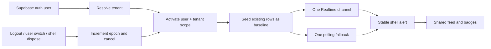
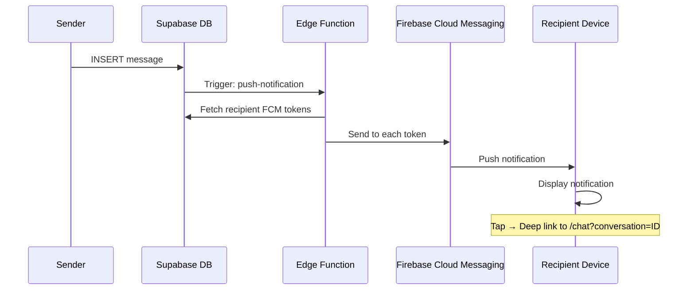

# Push Notification System - Implementation Guide

> **Purpose**: Comprehensive documentation for AI agents and developers to understand, maintain, and extend the push notification system.
> 
> **Last Updated**: 2026-07-19
> **Repository**: `/Users/Claudio/Dev/bikeshop-erp`

---

## Table of Contents

1. [Architecture Overview](#architecture-overview)
2. [Completed Implementation](#completed-implementation)
3. [Problems Encountered & Solutions](#problems-encountered--solutions)
4. [Remaining Work](#remaining-work)
5. [Key Files Reference](#key-files-reference)
6. [Troubleshooting Guide](#troubleshooting-guide)

---

## Architecture Overview

### Stable owner and identity scope (current contract)

`_WorkspaceDeepLinkBridge` in `lib/main.dart` is the only foreground owner for
chat, mail and `erp_notifications` presentation. A routed `MainLayout` is only
a visual consumer of the shared counters/feed; it must not create Realtime
channels, polling timers or top-alert overlays. This matters because GoRouter
and the workspace `IndexedStack` legitimately retain several routed layouts.

The stable owner performs this sequence on every authenticated session:

1. resolve the exact Supabase user and tenant;
2. activate `ChatNotificationGate`, `MailNotificationGate` and
   `ErpNotificationGate` with that `user + tenant` scope;
3. clear the previous `NotificationService` projection before loading data;
4. load existing rows as a baseline without presenting them;
5. start exactly one tenant-filtered Realtime channel and one bounded polling
   fallback;
6. discard every late async result whose lifecycle epoch or scope no longer
   matches.

On logout, user switch or disposal of the authenticated shell, the epoch is
invalidated before asynchronous teardown. Timers and channels are cancelled,
all gates fail closed, shared badges/feed are cleared, and
`MailAccountManager` resets its user-scoped providers/cache without closing
its process-wide `newEmailStream`. A new shell can therefore subscribe to the
same singleton without inheriting a zombie listener or a previous user's mail.
During a user transition the manager first publishes a closed, unready scope;
the next user is committed only after best-effort channel teardown and
mandatory cache initialization/invalidation succeed. A cache failure therefore
cannot expose or relabel the previous user's stored inbox.



### Idempotency rules

- FCM history notifications for mail are wake-up signals only. The provider
  message ID discovered by `MailAccountManager` is the evidence for a new-mail
  alert.
- Chat presentation uses the immutable message ID. Opening a module or
  rebuilding a route never resets that memory.
- On Android/iOS, a background message has exactly one presentation owner: the
  native FCM/APNs alert included by `push-notification`. The Dart background
  isolate never creates a second local notification; foreground presentation
  continues through the stable workspace owner and its scoped gate.
- ERP rows use their immutable `erp_notifications.id`. Rows present at initial
  load remain visible but are never re-announced; only a first discovery in the
  active identity scope is eligible.
- All three gates reject claims before a valid scope is active.
- `NotificationService.loadNotifications` and
  `loadOnlineOrderAlerts` read back their generation after I/O before changing
  a notifier, preventing a late response from the previous tenant from
  replacing the current feed.

### Technology Stack

| Component | Technology | Purpose |
|-----------|------------|---------|
| Backend Trigger | Supabase Database Triggers | Detects new messages |
| Push Delivery | Supabase Edge Function → Firebase Cloud Messaging | Sends push to devices |
| Mobile Handling | Flutter `firebase_messaging` + `flutter_local_notifications` | Receives and displays on Android/iOS |
| Web Handling | Firebase Messaging Service Worker | Background push on Chrome |
| Token Storage | Supabase `user_fcm_tokens` table | Stores FCM tokens per user |

### Message Flow



---

## Completed Implementation

### Phase 1: Mobile Push Notifications ✅

#### 1.1 Deep Linking (Tap Notification → Specific Chat)

**Files Modified:**
- [`lib/shared/services/notification_service.dart`](file:///Users/Claudio/Dev/bikeshop-erp/lib/shared/services/notification_service.dart)
- [`lib/main.dart`](file:///Users/Claudio/Dev/bikeshop-erp/lib/main.dart)
- [`lib/shared/routes/app_router.dart`](file:///Users/Claudio/Dev/bikeshop-erp/lib/shared/routes/app_router.dart)
- [`lib/modules/messaging/pages/employee_chat_page.dart`](file:///Users/Claudio/Dev/bikeshop-erp/lib/modules/messaging/pages/employee_chat_page.dart)

**Implementation Details:**

1. **NotificationService** emits navigation routes via `onNotificationTap` stream:
   ```dart
   final _navigationStreamController = StreamController<String>.broadcast();
   Stream<String> get onNotificationTap => _navigationStreamController.stream;
   ```

2. **Handlers for different app states:**
   - `FirebaseMessaging.onMessageOpenedApp` - App in background
   - `FirebaseMessaging.instance.getInitialMessage()` - App terminated (cold start)

3. **Route handling** in `_handleNotificationTap()`:
   ```dart
   void _handleNotificationTap(RemoteMessage message) {
     final conversationId = message.data['conversation_id'];
     if (conversationId != null) {
       _navigationStreamController.add('/chat?conversation=$conversationId');
     }
   }
   ```

4. **WorkspaceRouterView** listens and navigates:
   ```dart
   NotificationService().onNotificationTap.listen((route) {
     if (workspaceManager.activeIndex == _workspaceIndex) {
       _router.go(route);
     }
   });
   ```

5. **EmployeeChatPage** handles the `initialConversationId`:
   - Switches to correct tab (Clientes/Internos) based on conversation type
   - On mobile, navigates directly to ChatWindow
   - Uses time-based deduplication (2 seconds) to prevent repeated navigation

#### 1.2 Notification Grouping (WhatsApp-style)

**Edge Function** [`supabase/functions/push-notification/index.ts`](file:///Users/Claudio/Dev/bikeshop-erp/supabase/functions/push-notification/index.ts):

The database conversation is the authoritative tenant boundary for every
message push. Recipient selection follows one shared contract:

- inbound support/WhatsApp messages notify every active `user_profiles` staff
  member in that conversation's tenant, even when the worker was not added as
  an individual conversation participant;
- internal chat messages notify only active staff who are explicit participants
  of that same-tenant conversation;
- staff replies in support conversations remain participant-only so customer
  devices can receive their reply without broadcasting it to unrelated users;
- the sender, foreign-tenant memberships, inactive users, system messages and
  unsupported WhatsApp companion rows are always excluded;
- FCM `id` and `message_id` both carry the immutable database message UUID and
  `conversation_id` carries the canonical thread UUID for client deduplication
  and deep linking.

```typescript
android: {
  priority: 'high',
  notification: {
    title: senderName,
    body: messageBody,
    channel_id: 'chat_messages',
    tag: record.conversation_id,  // Groups by conversation
  },
},
```

**NotificationService** creates Android channel:
```dart
const chatChannel = AndroidNotificationChannel(
  'chat_messages',
  'Chat Messages',
  importance: Importance.high,
);
```

#### 1.3 FCM Token Registration with Auth

**Problem**: Token registration failed if called before user login.

**Solution**: Auth state listener in `NotificationService.init()`:
```dart
_supabase.auth.onAuthStateChange.listen((data) {
  if (data.event == AuthChangeEvent.signedIn && _fcmToken != null) {
    _saveTokenToDatabase(_fcmToken!);
  }
});
```

#### 1.4 Non-Blocking Initialization

**Problem**: `await NotificationService().init()` caused infinite loading on first launch.

**Solution**: Call without await in `main.dart`:
```dart
NotificationService().init();  // No await - runs in background
```

---

## Problems Encountered & Solutions

### Problem 1: Duplicate Navigation on Notification Tap

**Symptom**: App navigated to chat twice or re-navigated when user went back.

**Root Causes**:
1. Multiple `WorkspaceRouterView` instances (from `IndexedStack`) all listened to notification stream
2. `initialConversationId` persisted in URL query parameter

**Solutions**:
1. Only navigate if current workspace is active:
   ```dart
   if (workspaceManager.activeIndex == _workspaceIndex) {
     _router.go(route);
   }
   ```
2. Time-based deduplication in EmployeeChatPage:
   ```dart
   final isDuplicate = widget.initialConversationId == _lastHandledConversationId &&
       _lastHandledTime != null &&
       now.difference(_lastHandledTime!).inSeconds < 2;
   ```
3. Strip query param after handling: `context.go('/chat');`

---

### Problem 2: Web Push Caused 4-Second Timeout

**Symptom**: `prepareServiceWorker took more than 4000ms` error on web.

**Root Cause**: FCM service worker (`firebase-messaging-sw.js`) conflicted with Flutter's service worker.

**Solution**: Removed explicit FCM service worker registration from `index.html`. The `firebase_messaging` package handles it internally:
```html
<!-- NOTE: FCM Service Worker registration DISABLED for now -->
<script src="flutter_bootstrap.js" async></script>
```

---

### Problem 3: Chrome Policy Violation on Permission Request

**Symptom**: `[Violation] Only request notification permission in response to a user gesture`

**Root Cause**: `firebase_messaging` package auto-requests permission during initialization, violating Chrome's requirement for user gesture.

**Current Status**: ⚠️ **Not fully resolved**. The violation is a warning, not a blocking error. App continues to work.

**Future Fix Options**:
1. Use conditional imports to exclude `firebase_messaging` from web build
2. Implement user-initiated permission request via settings button
3. Wait for `firebase_messaging` package update with proper web handling

---

### Problem 4: Duplicate Notifications on Web

**Symptom**: Two notifications appeared for each message.

**Root Cause**: Both:
1. FCM's `webpush.notification` config displayed notification
2. Service worker's `onBackgroundMessage` also displayed

**Solution Applied**:
1. Removed `showNotification()` from service worker's `onBackgroundMessage`
2. Keep `webpush.notification` config in Edge Function for FCM to handle display

**Service Worker** [`web/firebase-messaging-sw.js`](file:///Users/Claudio/Dev/bikeshop-erp/web/firebase-messaging-sw.js):
```javascript
messaging.onBackgroundMessage((payload) => {
  console.log('[FCM SW] Background message received:', payload);
  // FCM handles display via webpush.notification config
  // Do NOT call showNotification here
});
```

---

### Problem 4b: Duplicate Notifications on Mobile Background

**Symptom**: Android/iOS could show the provider alert and a second local alert
for the same message.

**Root Cause**: The Edge payload already includes an Android/APNs notification,
while the Dart background handler passed the same event to the local
notification presenter.

**Solution Applied**: Native FCM/APNs owns background presentation. The Dart
handler initializes Firebase but does not call `handleIncomingMessage`; the
authoritative conversation is refreshed when the app resumes. Foreground
messages still use the single scoped in-app owner.

---

### Problem 5: iPad/Safari Not Loading

**Symptom**: App hangs on iPad Safari.

**Root Cause**: Safari doesn't fully support Web Push API. `firebase_messaging` package may hang during initialization.

**Current Mitigation**: Safari/iOS detection in `index.html`:
```javascript
var isSafari = /^((?!chrome|android).)*safari/i.test(navigator.userAgent);
var isIOS = /iPad|iPhone|iPod/.test(navigator.userAgent);
window.skipFCM = isSafari || isIOS;
```

**Status**: ⚠️ **Partial fix**. The detection flag is set but `firebase_messaging` package still auto-initializes.

**Future Fix Options**:
1. **Option A**: Skip `Firebase.initializeApp()` on Safari entirely
2. **Option B**: Conditional imports to exclude `firebase_messaging` from web
3. **Option C**: Check `window.skipFCM` in Dart via `dart:js` before FCM operations

---

## Remaining Work

### High Priority

#### 1. Fix Safari/iOS Web Support
**Goal**: App loads properly on iPad Safari.

**Recommended Approach**:
```dart
// In main.dart, before Firebase.initializeApp()
import 'dart:js' as js;

bool get shouldSkipFCM => kIsWeb && (js.context['skipFCM'] == true);

if (!shouldSkipFCM) {
  await Firebase.initializeApp(...);
}
```

**Alternative**: Conditional package imports:
```yaml
# pubspec.yaml - use firebase_messaging only on mobile
dependencies:
  firebase_messaging:
    platforms:
      android:
      ios:
```

---

#### 2. User-Initiated Web Permission Request
**Goal**: Comply with Chrome's permission policy.

**Implementation**:
1. Add "Enable Notifications" button in Settings page
2. Button calls `NotificationService().requestWebNotificationPermission()`
3. This method already exists but is unused

**UI Location**: Settings → Notifications → "Enable Web Push" toggle

---

#### 3. Clean Up Unused Code
- Remove unused `_initWeb()` method in NotificationService (currently has lint warning)
- Remove `firebase-messaging-sw.js` if not using web push

---

### Low Priority

#### 4. Customer PWA Notifications (Phase 3)
**Goal**: Push notifications for customers on public store PWA.

**Required Work**:
- Create separate `StoreNotificationService`
- Different FCM token storage (by customer, not employee)
- Store-specific notification preferences

---

## Key Files Reference

| File | Purpose |
|------|---------|
| [`lib/shared/services/notification_service.dart`](file:///Users/Claudio/Dev/bikeshop-erp/lib/shared/services/notification_service.dart) | Main notification logic - FCM init, token management, message handling |
| [`supabase/functions/push-notification/index.ts`](file:///Users/Claudio/Dev/bikeshop-erp/supabase/functions/push-notification/index.ts) | Edge Function that sends FCM messages |
| [`lib/modules/messaging/pages/employee_chat_page.dart`](file:///Users/Claudio/Dev/bikeshop-erp/lib/modules/messaging/pages/employee_chat_page.dart) | Handles deep link navigation to specific chat |
| [`lib/main.dart`](file:///Users/Claudio/Dev/bikeshop-erp/lib/main.dart) | WorkspaceRouterView listens for notification taps |
| [`web/index.html`](file:///Users/Claudio/Dev/bikeshop-erp/web/index.html) | Safari/iOS detection, service worker comments |
| [`web/firebase-messaging-sw.js`](file:///Users/Claudio/Dev/bikeshop-erp/web/firebase-messaging-sw.js) | FCM service worker for web background push |

---

## Troubleshooting Guide

### Notification Not Received (Mobile)

1. **Check FCM Token**:
   ```bash
   bash scripts/db/query.sh production \
     --sql "select user_id, platform, updated_at from user_fcm_tokens where user_id = 'UUID'" \
     --format table
   ```

2. **Check Edge Function Deployment**:
   ```bash
   scripts/supabase_cli.sh functions list \
     --project-ref xzdvtzdqjeyqxnkqprtf
   ```

   Then invoke the affected notification path and verify the durable database
   outcome. The current CLI has no `functions logs` command; use the provider
   Logs Explorer only when runtime-log evidence is required.

3. **Check Android Channel**: Ensure `chat_messages` channel exists in device settings.

### Deep Link Not Working

1. **Check URL Query Parameter**: Should be `/chat?conversation=UUID`
2. **Check Console Logs**: Look for `🔔 Deep link: selecting conversation`
3. **Check Time Deduplication**: Same conversation within 2 seconds is ignored

### Web Notifications Not Showing

1. **Check Browser Permission**: Click tune icon next to URL → Reset permissions
2. **Check Console**: Look for `[FCM] Service Worker registered`
3. **Safari**: Web Push is not supported on Safari/iOS

### App Hangs on Load

1. **Check for Service Worker Timeout**: Look for `prepareServiceWorker took more than 4000ms`
2. **Check for Permission Violation**: Look for `Only request notification permission`
3. **Try Incognito Mode**: Clears cached service workers

---

## Environment Variables

| Variable | Location | Purpose |
|----------|----------|---------|
| `VAPID_KEY` | NotificationService | Web push authentication |
| `FIREBASE_PROJECT_ID` | Edge Function secrets | FCM API endpoint |
| `FIREBASE_SERVICE_ACCOUNT` | Edge Function secrets | FCM authentication |
| Supabase `xzdvtzdqjeyqxnkqprtf` | Edge Function | Project reference |

---

## Testing Checklist

- [ ] Android: Send message → notification appears grouped by conversation
- [ ] Android: Tap notification → opens specific chat (not dashboard)
- [ ] iOS: Same as Android tests
- [ ] Web (Chrome): Permission prompt on user action works
- [ ] Web (Chrome): Background notification appears
- [ ] Web (Safari): App loads without hanging
- [ ] Cold start: Notification deep link works after app kill

---

*Document prepared for AI agent handoff. All file paths are absolute for easy reference.*
