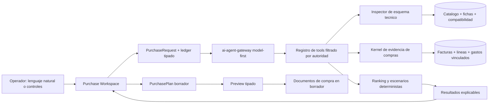

# Plan de implementación — Workspace inteligente de compras

- **Estado:** propuesta de producto y arquitectura; no autoriza implementación.
- **Fecha:** 2026-08-16.
- **Alcance de este documento:** idea, lógica, datos, IA, UI, UX, seguridad,
  validación y secuencia de entrega.
- **Nombre de trabajo:** `Asistente inteligente de compras` / `Purchase
  Workspace`.

## 1. Propósito y límite de esta propuesta

El objetivo es transformar una decisión de compra que hoy depende de la memoria
de las personas con más experiencia en un proceso asistido, explicable y
accionable. Una persona debe poder pedir en lenguaje natural uno o varios tipos
de producto y recibir alternativas técnicamente pertinentes, comercialmente
razonables y sustentadas por evidencia real del ERP.

Este documento no congela las pantallas de los bosquejos, no aprueba cada
control dibujado y no convierte la propuesta en un wizard rígido. Las imágenes
creadas durante la conversación son hipótesis visuales para explorar jerarquía,
densidad y flujo. Antes y durante cada fase se puede conservar, cambiar, agregar
o eliminar cualquier detalle si la evidencia demuestra una solución más clara.

La implementación sólo debe comenzar cuando el dueño lo autorice explícitamente.
Hasta entonces no se crean tablas, migraciones, rutas, componentes ni cambios de
producción.

## 2. Resultado de producto

El workspace debe ayudar a responder, con distintos grados de precisión:

- qué productos podrían satisfacer la necesidad expresada;
- en qué proveedores se han comprado productos iguales, equivalentes o de la
  misma familia;
- cuánto costaron realmente, incluido el flete atribuible cuando existe
  evidencia suficiente;
- qué rentabilidad produciría cada alternativa usando precios y bases
  tributarias comparables;
- qué tan reciente, completa y confiable es la evidencia;
- qué restricciones técnicas cumple, cuáles contradice y cuáles siguen sin
  confirmar;
- si conviene consolidar una canasta en un proveedor o dividirla;
- qué alternativa local o urgente existe cuando su mayor precio igualmente
  deja una venta razonable; y
- qué acción segura puede ejecutar la persona a continuación.

El sistema recomienda y explica. La persona decide. No compra, envía pedidos,
paga ni presume disponibilidad de un proveedor automáticamente.

## 3. Principios rectores

1. **Lenguaje natural de entrada, estado tipado por debajo.** La IA interpreta
   frases casuales, pero la búsqueda, los cálculos y las acciones usan contratos
   cerrados y verificables.
2. **Flexible donde ayuda; rígido donde protege.** El sistema admite caminos
   distintos, correcciones y resultados parciales. Sólo bloquea ante una
   contradicción técnica material, una ambigüedad que cambiaría sustancialmente
   la decisión o una acción con efecto real.
3. **No hay workflows técnicos codificados por ejemplo.** “Rayos 27.5” es un
   caso de evaluación, no una rama especial en Dart ni una herramienta dedicada.
   Las preguntas emergen del esquema técnico, la evidencia disponible y el
   objetivo del usuario.
4. **Primero se eliminan contradicciones; luego se ordena.** Un margen alto no
   compensa una incompatibilidad demostrada.
5. **La historia informa, no inventa el presente.** Haber comprado antes a un
   proveedor no demuestra precio, stock ni plazo actuales.
6. **La rentabilidad se calcula, no se adjetiva.** Costo, flete, precio de venta,
   utilidad y margen muestran base, fecha, fuente y faltantes.
7. **La categoría organiza; no suplanta la identidad.** Categorías, familias
   técnicas, marcas, gamas y productos son dimensiones distintas.
8. **Una sola arquitectura de IA.** El feature extiende el runtime model-first y
   el registro tipado de herramientas existente; no crea un segundo agente.
9. **Una sola verdad de dominio.** UI, chat y automatizaciones futuras consumen
   los mismos read models, reglas y comandos.
10. **Cada resultado importante es explicable.** La persona puede ver por qué
    una alternativa aparece, qué la debilita y qué dato permitiría mejorarla.
11. **Ausencia de evidencia no significa cero.** Una fuente parcial, sin
    cobertura o temporalmente indisponible conserva su estado honesto.
12. **Los bosquejos son insumo, no especificación.** La composición final se
    valida contra el trabajo real del operador y el sistema visual canónico.

## 4. Decisiones ya acordadas

### 4.1 Forma general del producto

El producto será un workspace continuo con tres superficies que se pueden
recorrer en ambos sentidos:

```text
Conversación  <->  Comparar  <->  Plan borrador
```

No son pasos numerados ni una secuencia obligatoria. Una aclaración puede
ocurrir desde cualquier superficie y una edición en el plan puede volver a
calcular la comparación sin perder contexto.

### 4.2 Producto único y canasta

El mismo workspace admite:

- una búsqueda de un producto o familia;
- varias líneas independientes;
- una canasta con objetivo transversal, por ejemplo máximo de proveedores,
  urgencia o presupuesto; y
- una necesidad expresada sin SKU conocido.

La comparación cambia de composición según el problema: candidatos para una
línea en producto único; escenarios y cobertura por línea para una canasta.
No se obliga a ambos casos a compartir una tabla idéntica.

### 4.3 `smart_purchase_list` no es la base

La tabla, trigger, servicio y página actuales de `smart_purchase_list` se
consideran legado. Contienen señales recuperables —mínimos de stock, rotación,
última compra y snapshots operativos—, pero también concentran problemas que no
deben heredarse:

- prioridad opaca de 0 a 100;
- proveedor elegido automáticamente por una regla débil;
- alternativas técnicas derivadas con regex y palabras del nombre;
- lógica de interfaz, consulta y ranking mezclada en una página extensa;
- navegación que pierde el contexto de retorno;
- flujo de compra local que termina como gasto sin identidad de producto; y
- acoplamiento entre estado de factura, stock y recomendación.

El nuevo workspace podrá leer señales históricas válidas durante una transición,
pero no copiará el score, el trigger ni la página como arquitectura. La retirada
del legado se hará sólo después de demostrar paridad funcional y preservar su
evidencia histórica útil.

### 4.4 Costo más reciente y flete

El “costo actual” de un candidato será la observación elegible más reciente que
exista, no un promedio arbitrario ni un valor sin fecha. Debe indicar si es una
compra realizada, una orden confirmada todavía no recibida, una cotización o el
campo mutable de costo del catálogo.

El flete histórico atribuible a una línea se distribuye por la participación de
su costo neto en el subtotal neto de mercadería de la factura. IVA y el propio
flete quedan fuera del denominador. La distribución debe reconciliar al peso
total exacto del flete mediante redondeo determinístico.

### 4.5 Compras locales

Una compra real de repuestos a un taller local no se registrará como un gasto
con el producto escondido en notas. La solución objetivo es un ingreso rápido de
compra local/emergencia que preserve proveedor, documento verdadero, producto o
línea pendiente de resolución, cantidad, costo, tratamiento tributario, pago y
recepción. Luego alimenta el mismo historial de compras y puede ser sugerida por
el asistente.

### 4.6 Disponibilidad

La disponibilidad del proveedor sólo puede mostrarse como vigente si proviene
de una cotización, API, portal o confirmación manual con fecha y fuente. En los
demás casos se muestra `No verificada`, junto con la edad de la evidencia de
precio o compra. El stock interno de Viñabike y el stock del proveedor son hechos
distintos.

## 5. Realidad arquitectónica que se debe reutilizar

### 5.1 Facturas y líneas normalizadas

`purchase_invoices` conserva encabezado, ítems JSON históricos y costos
adicionales. `purchase_invoice_lines` ya proyecta líneas normalizadas con:

- producto opcional y snapshots de nombre/SKU;
- cantidad, costo unitario, descuento, neto, impuesto y total;
- moneda;
- naturaleza de línea;
- clasificación revisada o pendiente; y
- procedencia nativa, JSON legado o migración.

Ésta debe ser la fuente primaria del análisis histórico. Los ítems JSON quedan
como compatibilidad/auditoría, no como nueva API analítica. Las líneas no
resueltas pueden aportar evidencia agregada y revisable, pero no convertirse en
un SKU exacto por inferencia silenciosa.

`expense_links` ya liga gastos a facturas y puede contener un monto asignado,
pero hoy `link_kind` y la naturaleza económica no bastan por sí solos para
afirmar que todo vínculo es flete. La fase inicial debe medir y clasificar esta
cobertura antes de calcular costos aterrizados.

### 5.2 Catálogo, fichas y compatibilidad

El motor de fichas técnicas ya posee:

- `spec_definitions`;
- `spec_templates`;
- `spec_template_fields`;
- `category_tech_mappings`; y
- `product_spec_values`.

El asistente existente ya puede inspeccionar el esquema técnico efectivo del
tenant y buscar inventario mediante predicados tipados. Las fichas estructuradas
son autoridad; el texto de identidad sólo puede cubrir casos estrechos de
igualdad cuando una ficha está vacía y nunca demuestra rangos o desigualdades.

El motor de compatibilidad del taller ya expresa `compatible`, `caution` e
`incompatible`. El workspace debe consumir ese conocimiento cuando exista un
objeto de compatibilidad real —bicicleta, rueda, componente instalado u otra
referencia— y no crear un segundo vocabulario.

Se distinguirán dos conceptos en la UI y el dominio:

- **cumplimiento de la petición:** el candidato satisface las restricciones
  expresadas por el usuario;
- **compatibilidad de montaje:** el candidato funciona con una bicicleta o
  conjunto técnico concreto.

No se llamará “compatible” a una mera coincidencia de búsqueda.

### 5.3 Runtime de IA

El runtime actual es model-first, neutral al proveedor y gobernado por un
registro de herramientas tipadas. Ya incluye, entre otras capacidades,
`inspect_inventory_schema`, `search_inventory`, `search_suppliers` y
`search_purchase_invoices`, además de las tablas efectivas
`assistant_threads`, `assistant_runs`, `assistant_tool_receipts` y
`assistant_approvals` definidas por las migraciones del runtime.

Las nuevas primitivas se incorporarán a ese catálogo con la misma autoridad,
límites, auditoría y política. El modelo interpreta y compone; el servidor
calcula, filtra, autoriza y verifica.

El diseño debe respetar los límites actuales, no asumir que se ampliarán para
este feature: máximo de cinco rondas de tools y 96 KiB de output acumulado por
run. El camino normal de lectura debe consumir idealmente dos o tres rondas y
dejar margen para recuperación. Una aclaración material termina ese turno y el
análisis continúa en el siguiente; preparar el plan ocurre en otra acción
explícita, no al final obligatorio del mismo run de búsqueda.

### 5.4 Proveedores, portales y secretos

Los metadatos públicos del proveedor, sus relaciones comerciales y sus
criterios contables pertenecen al dominio de proveedores. Las credenciales son
otra autoridad y nunca entran en búsquedas generales, logs o contexto del
modelo.

Abrir un portal público o una pestaña ya autorizada es navegación. Verificar
precio/stock dentro de un portal autenticado es una capacidad futura aislada.
Comprar, enviar, pagar, subir o transmitir información siempre se detiene antes
de la acción y exige confirmación específica.

## 6. Alcance funcional

### 6.1 Incluido

- entrada casual en español, tolerante a abreviaciones, errores y orden libre;
- solicitudes de una o varias líneas;
- identificación de categoría, familia técnica, marca, gama, rango de precio,
  cantidad, urgencia y restricciones técnicas;
- aclaraciones dinámicas sólo cuando aportan valor;
- búsqueda histórica por proveedor y producto/categoría;
- ranking explicable de candidatos;
- costo aterrizado histórico y rentabilidad proyectada;
- comparación de escenarios para canastas;
- alternativas locales cuando estén registradas como compras estructuradas;
- plan de compra borrador agrupado por proveedor;
- navegación a producto, proveedor, factura y portal permitido;
- refinamiento y edición sin perder contexto; y
- degradación funcional cuando IA o una fuente no estén disponibles.

### 6.2 Fuera del primer alcance

- compra automática;
- envío automático de una orden o mensaje;
- pago o asiento contable automático;
- disponibilidad actual inferida desde compras históricas;
- scraping autenticado dentro del proceso principal del agente;
- forecast de demanda presentado como verdad sin un modelo evaluado;
- reemplazo inmediato de todos los flujos de reposición;
- clasificación masiva de líneas históricas sin revisión y trazabilidad; y
- compatibilidad universal de bicicletas basada en texto libre.

## 7. Casos de uso canónicos

### 7.1 Producto único con restricciones técnicas

> “Necesito neumáticos 27.5, de ancho mayor a 2.0, económicos pero con buen
> margen.”

El sistema identifica la familia, inspecciona las claves técnicas disponibles,
normaliza el rodado y ancho, interpreta “económico” como preferencia comercial
y “buen margen” como objetivo. Devuelve alternativas que cumplen, deja en
revisión las que carecen de datos decisivos y excluye contradicciones
estructuradas. Cada fila muestra proveedor, costo aterrizado, utilidad/margen,
historia y edad/calidad de evidencia.

### 7.2 Ambigüedad técnica dinámica

> “Necesito rayos 27.5.”

El sistema detecta que `27.5` puede describir la medida del rayo que la persona
ya confirmó o el rodado de una rueda para la cual aún hay que calcular el rayo.
Pregunta cuál intención corresponde.

- Si es la medida ya confirmada, la normaliza a la unidad canónica y busca esa
  especificación.
- Si es para una rueda 27.5, consulta el esquema y la compatibilidad disponible
  para solicitar sólo los datos materiales todavía ausentes, como ERD,
  geometría de maza, cantidad de agujeros y patrón de cruces.

La implementación no contiene un `if rayos`. Este caso se conserva como prueba
de regresión de desambiguación genérica basada en esquema.

### 7.3 Canasta de varias familias

> “Necesito piñones, rayos, neumáticos y llantas.”

El sistema crea cuatro líneas, muestra qué proveedores han cubierto histórica o
actualmente todas, varias o sólo una, y construye escenarios útiles. Para cada
proveedor muestra los productos principales observados por categoría, marca,
gama, costo y fecha. Una línea sin candidato no desaparece: queda visible como
faltante del escenario.

### 7.4 Compra local de rescate

> “Necesito hoy un piñón Shimano; revisa también talleres locales.”

Una alternativa local puede aparecer con precio mayor si está documentada,
tiene disponibilidad confirmada o evidencia reciente y todavía deja utilidad
aceptable. El ranking explica el intercambio entre costo, urgencia y margen; no
oculta la alternativa por no ser la más barata.

### 7.5 Reposición sugerida

Una señal de stock bajo puede abrir un request prellenado. El usuario revisa la
necesidad y el nuevo motor busca alternativas. El trigger legado no decide por
sí solo el proveedor ni la prioridad final.

## 8. Modelo de interacción

### 8.1 Superficie `Conversación`

Responsabilidades:

- recibir la necesidad en lenguaje natural;
- mostrar la interpretación como restricciones editables;
- formular aclaraciones bloqueantes o recomendadas;
- narrar brevemente qué fuente falta o falló;
- permitir agregar, quitar o reformular líneas; y
- ofrecer el salto a resultados parciales tan pronto como sean útiles.

La conversación no es una animación que esconde el dominio. Junto a ella existe
un **ledger de restricciones** persistente y tipado. Cada restricción indica
origen (`usuario`, `derivada`, `confirmada por ficha`, `sugerida`), alcance
(línea o canasta) y estado. La persona puede editarla sin reescribir todo el
prompt.

### 8.2 Superficie `Comparar`

Para producto único, la composición inicial candidata es:

- tabla/lista de candidatos como centro estable;
- inspector contextual del candidato seleccionado;
- orden y filtros explícitos;
- disclosure de descartados y razón; y
- acceso a evidencia, ficha y registros relacionados.

Las columnas exactas se validan con datos reales. El conjunto mínimo a evaluar
es: producto, proveedor, cumplimiento técnico, disponibilidad, costo aterrizado,
utilidad/margen, historia y edad/calidad de evidencia.

Para canasta, el centro cambia a escenarios:

- proveedor único/consolidado;
- división balanceada;
- menor costo aterrizado estimado;
- opción urgente/local; y
- escenario histórico, sólo si agrega una alternativa distinta.

No se muestran cinco escenarios por obligación. Se eliminan duplicados y
escenarios dominados; se presenta sólo lo que cambia una decisión.

### 8.3 Superficie `Plan borrador`

El plan agrupa líneas por proveedor y permite:

- cambiar producto o alternativa;
- editar cantidad;
- mover o retirar una línea;
- ver mínimos, packs, faltantes y observaciones;
- recalcular totales y flete estimado;
- volver a comparar sin perder el borrador; y
- preparar uno o varios documentos de compra en borrador.

Agregar al plan no compra. Convertir el plan crea únicamente artefactos
revisables mediante el comando canónico que se defina; ordenar, enviar o pagar
queda fuera y requiere su propio límite de riesgo.

### 8.4 Navegación y continuidad

- El workspace se abre con `push` y cierra con `ReturnNavigation.close`.
- La selección, consulta, restricciones, filtros, orden, ancho del inspector,
  scroll y plan sobreviven al recorrido interno y a la recomposición responsive.
- Abrir producto, proveedor o factura conserva un retorno exacto al workspace.
- `Atrás` visible, Back del sistema y navegador respetan el mismo contrato.
- Una edición pendiente no puede desmontarse al cruzar `899/900`; se conserva o
  exige descarte explícito.

## 9. Modelo de intención y restricciones

El modelo lógico provisional es independiente de la frase original:

```text
PurchaseRequest
  requestId
  objectiveProfile
  currencyContext
  urgency / neededBy
  budget
  maximumSuppliers
  supplierPreferences / exclusions
  lines[]

PurchaseRequestLine
  lineId
  originalUtterance
  quantity + unit
  categoryCandidates[]
  selectedCategoryLeaf?
  technicalFamily?
  productIdentity?
  brandPreferences[]
  rangeOrGamaPreference?
  priceBounds?
  targetMargin?
  technicalPredicates[]
  fitmentContext?
  clarificationState

Constraint
  canonicalKey
  operator
  typedValue
  unit
  strength: required | preferred | informational
  provenance: user | inferred | schema | record
  confirmation: confirmed | proposed | unresolved
  revision
```

Reglas:

- una inferencia de la IA comienza como `proposed` si cambia materialmente la
  búsqueda;
- una preferencia blanda nunca elimina un candidato;
- un requisito estructurado sí puede eliminar una contradicción demostrada;
- un valor desconocido queda desconocido, no falso;
- todas las unidades se normalizan y se conserva la expresión original;
- categoría candidata y categoría confirmada no son equivalentes; y
- las revisiones son monotónicas para impedir que una respuesta asíncrona vieja
  sobrescriba la intención nueva.

## 10. Política de aclaraciones dinámicas

Una aclaración es **bloqueante** sólo si:

- dos interpretaciones plausibles conducen a familias o unidades
  sustancialmente distintas;
- ejecutar la búsqueda sin ella puede sugerir un producto físicamente
  incompatible;
- falta un dato obligatorio para una acción, no sólo para una recomendación; o
- la persona marcó explícitamente esa condición como requerida.

Es **recomendada pero no bloqueante** cuando mejora el orden, la gama, el margen
o la cobertura. En ese caso el sistema muestra resultados parciales y permite
responder después.

La pregunta se construye desde:

1. la interpretación del modelo;
2. las categorías/familias reales encontradas;
3. las definiciones y operadores del esquema técnico;
4. el contexto de compatibilidad disponible;
5. la sensibilidad estimada del conjunto de candidatos al dato faltante; y
6. las alternativas de respuesta que el backend puede representar.

La IA puede redactar la pregunta en lenguaje natural. No puede inventar claves,
unidades ni opciones que el runtime no haya validado.

## 11. Responsabilidad de IA y responsabilidad determinística

| Tarea | IA | Servicio determinístico |
| --- | --- | --- |
| Entender lenguaje casual | Sí | Valida salida tipada |
| Separar una canasta en líneas | Propone | Valida identidad y límites |
| Detectar ambigüedad | Propone y explica | Mide impacto y ofrece esquema válido |
| Descubrir claves técnicas | Decide cuándo consultar | Inspector es la autoridad |
| Buscar productos/proveedores | Compone herramientas | Filtra por tenant y ejecuta |
| Calcular costo/flete/margen | No | Sí, fórmula versionada |
| Determinar contradicción técnica | No por prosa | Sí, ficha/compatibilidad |
| Ordenar candidatos | Elige objetivo autorizado | Calcula componentes y orden |
| Crear escenarios de canasta | Explica y puede elegir perfil | Optimiza de forma acotada |
| Afirmar stock del proveedor | No | Sólo fuente vigente verificable |
| Preparar plan | Puede proponer | Comando tipado e idempotente |
| Comprar/enviar/pagar | No | Capacidad separada y confirmada |

La respuesta útil no depende de que el modelo conozca un workflow particular.
Depende de que pueda componer primitivas generales y de que el runtime ofrezca
un camino manual tipado cuando el modelo falle.

## 12. Primitivas nuevas propuestas

Los nombres son provisionales y deben validarse contra el registro existente.
No representan una herramienta por pantalla ni por frase.

1. `inspect_purchase_search_schema`
   - amplía la inspección de inventario con dimensiones comerciales y fuentes
     de evidencia disponibles para compras;
   - devuelve claves, tipos, unidades, operadores y cobertura, no SQL.
2. `search_purchase_candidates`
   - recibe líneas y restricciones tipadas;
   - aplica el perfil de objetivo, elimina contradicciones y devuelve un
     shortlist ya ordenado con componentes explicables y referencias cerradas
     a evidencia;
   - no necesita una segunda tool de comparación que consuma otra ronda.
3. `build_purchase_scenarios`
   - para canastas, subsume búsqueda, ranking y combinación de shortlists bajo
     máximo de proveedores, urgencia, presupuesto y demás restricciones
     representables.
4. `prepare_purchase_plan`
   - congela un borrador revisable con la selección y evidencia usada;
   - se ejecuta en una acción/run posterior al análisis;
   - no crea compra, orden, pago ni recepción.
5. `convert_purchase_plan_to_drafts`
   - fase posterior;
   - crea los documentos canónicos en estado borrador, agrupados por proveedor,
     con idempotencia y read-back.

Puede resultar correcto fusionar o dividir primitivas después de medir payloads
y límites. Lo no negociable es conservar schemas cerrados, outputs acotados,
autoridad server-side, receipts y ausencia de SQL/model-driven writes.
La Fase 0 debe fijar un presupuesto por tool y una regresión que demuestre que
producto único y canasta con una aclaración caben dentro de los límites actuales
sin elevar el radio de impacto del runtime completo.

## 13. Construcción de evidencia histórica

### 13.1 Observación de costo

Cada observación debe conservar como mínimo:

- tenant;
- factura y línea fuente;
- proveedor;
- producto enlazado o clasificación pendiente;
- categoría/familia en la fecha de lectura y su procedencia;
- fecha económica del documento;
- estado del documento;
- naturaleza de línea y tratamiento de compra;
- cantidad y unidad;
- costo neto base por unidad;
- descuentos aplicados;
- componentes aterrizados asignados;
- costo aterrizado unitario;
- moneda y, si corresponde, tipo de cambio con fuente/fecha;
- tratamiento tributario;
- calidad de resolución de producto/categoría; y
- clasificación de evidencia.

La primera implementación debe derivar estas observaciones desde fuentes
canónicas mediante una view/RPC o proyección reproducible. No se crea de entrada
otra tabla mutable de costos que pueda divergir de la factura.

### 13.2 Elegibilidad temporal

Política inicial a validar con semántica real:

- `confirmed`, `received` y `paid`: evidencia de compromiso/compra, mostrando
  si aún no existe recepción;
- `draft` y `sent`: dato indicativo, nunca “último costo comprado”;
- `cancelled`: excluido del costo histórico;
- cotización o portal: evidencia actual separada de compra realizada; y
- `products.cost`: fallback visible con su propia fecha de actualización, no
  sustituto silencioso del historial.

Además del estado temporal, la línea debe ser económicamente elegible:

- `inventory` y `workshop_consumable` pueden aportar costo de producto; la
  segunda se etiqueta como consumo directo y no implica entrada a stock;
- `service`, `operating_expense` y `capital_asset` no entran al historial de
  costo de un repuesto ordinario;
- `freight`, `discount` y `tax` son componentes del documento, nunca producto
  base ni denominador de mercadería; y
- `other` o `needs_review` quedan fuera de cálculos definitivos hasta ser
  clasificados.

La fecha económica de la factura manda sobre `created_at`. Si existe corrección
o reversa, el read model debe usar la versión efectiva y no contar dos veces.

### 13.3 Resolución de identidad

El orden es:

1. vínculo exacto `product_id` tenant-scoped;
2. alias/listing de proveedor confirmado mediante
   `supplier_product_aliases` o el grafo vigente de resolución de variantes;
3. candidato de identidad según el contrato canónico de matching;
4. clasificación de categoría/familia revisada; y
5. línea no resuelta visible.

Una coincidencia probable puede ayudar a revisar datos, pero no debe fusionar
historiales ni recomendar un SKU exacto sin adjudicación.

Estas entidades de alias y resolución ya existen en migraciones del repositorio;
no son tablas nuevas del workspace. La Fase 0 verifica su despliegue, cobertura
y estado efectivo antes de depender de ellas.

### 13.4 Sets, packs y componentes

Una factura puede representar una unidad comercial que luego se descompone en
varios productos de catálogo. Hay dos caminos distintos que deben conservar su
procedencia:

- el grafo de resolución de variantes de proveedor puede expandir una línea
  fuente y ya conservar `allocated_line_total_minor` y `allocation_ratio`; esa
  asignación validada es la autoridad para sus componentes; y
- un producto `set` puede entrar como padre y explotar stock mediante
  `product_set_components.cost_ratio`.

El kernel siempre conserva la observación del set/purchase unit. Sólo crea
observaciones derivadas por componente cuando todas las razones requeridas son
válidas, positivas y reconcilian exactamente el costo fuente. Si faltan o no
reconcilian, el costo por componente queda desconocido y la UI explica que sólo
existe costo del set. Ningún componente hereda el costo completo de la línea.

### 13.5 Métricas históricas

Las métricas candidatas son:

- compras y unidades por producto/proveedor;
- recencia y frecuencia;
- proporción del historial de esa familia cubierta por el proveedor;
- estabilidad o dispersión del costo;
- historial de marcas y gamas;
- amplitud de cobertura para canastas;
- recepción completa/parcial y discrepancias, cuando su uso comercial haya sido
  validado; y
- evidencia local/urgente.

Estas métricas describen comportamiento observado. No deben llamarse
“confiabilidad del proveedor” ni atribuir causalidad sin un contrato específico.

## 14. Costo aterrizado y flete

### 14.1 Definiciones

Para una factura elegible:

```text
neto_mercadería_línea_i = net_amount efectivo de la línea i

subtotal_neto_mercadería =
  suma(neto_mercadería_línea elegible)

peso_i =
  neto_mercadería_línea_i / subtotal_neto_mercadería

flete_asignado_línea_i =
  flete_asignable_factura * peso_i

costo_aterrizado_unitario_i =
  (neto_mercadería_línea_i + flete_asignado_línea_i
   + otros_costos_aterrizables_asignados_i) / cantidad_i
```

El denominador incluye sólo líneas elegibles `inventory` y
`workshop_consumable`; excluye IVA, flete, servicios, gastos operacionales,
activos, impuestos recuperables y demás ajustes. Si un costo aplica sólo a un
subconjunto de líneas, se distribuye dentro de ese subconjunto.

### 14.2 Fuentes de flete

El kernel debe reconciliar, sin duplicar:

- líneas normalizadas clasificadas como `freight`;
- `additional_costs` cuya clasificación revisada sea flete;
- gastos vinculados mediante `expense_links` y clasificados como transporte de
  esa compra; y
- costo landed ya distribuido por una fuente como AliExpress.

Una etiqueta de texto parecida a “envío” no autoriza doble conteo. Cada
componente declara fuente, monto reconocido y motivo de inclusión/exclusión.
Si un componente está en otra moneda y no existe un tipo de cambio autoritativo
con fecha/fuente, queda separado y el landed se declara parcial.

### 14.3 Redondeo

1. calcular proporciones con precisión decimal;
2. asignar pesos enteros de moneda usando método de mayores restos;
3. resolver empates por identidad estable de línea;
4. demostrar que la suma asignada coincide exactamente con el flete; y
5. conservar mayor precisión en el costo unitario sin alterar el total del
   documento.

### 14.4 Estimación prospectiva

Un costo histórico aterrizado es exacto para esa compra, no para una compra
futura. Mientras no exista cotización vigente:

- el costo base usa la observación elegible más reciente;
- el flete futuro usa una estimación separada, idealmente un rango histórico
  por proveedor y tipo/tamaño de canasta;
- la UI lo etiqueta `Estimado`, muestra fecha/cobertura y no mezcla un rango con
  un monto verificado; y
- al consolidar una canasta se estima un flete de pedido y luego se distribuye;
  no se suman cuatro fletes unitarios históricos como si fueran independientes.

## 15. Rentabilidad

La comparación económica se hace en una misma base tributaria y moneda:

```text
utilidad_bruta_unitaria = precio_venta_neto - costo_aterrizado_unitario

margen_bruto =
  utilidad_bruta_unitaria / precio_venta_neto
```

Se deben mostrar al menos:

- precio de venta usado y su procedencia;
- costo base;
- flete y otros componentes;
- utilidad por unidad;
- margen porcentual;
- antigüedad de precio y costo; y
- dato faltante que vuelve parcial el cálculo.

No se compara un precio de venta con IVA contra un costo neto sin normalizar.
No se llama “rentable” a una fila cuyo precio o costo carece de base confiable.
La persona puede solicitar margen mínimo o priorizar utilidad absoluta.

Default de moneda hasta que exista un contrato FX:

- no se inventa ni consulta implícitamente un tipo de cambio;
- los subtotales de una canasta se muestran separados por moneda;
- candidatos de monedas distintas no se ordenan como si el costo fuera
  directamente comparable;
- un flete en moneda distinta mantiene el costo aterrizado como parcial; y
- incorporar FX más adelante exige fuente, instante, par, tasa y snapshot
  auditable.

## 16. Cumplimiento técnico y compatibilidad

Pipeline obligatorio:

1. resolver categoría/familia mediante el árbol real;
2. inspeccionar claves, tipos, unidades, operadores y cobertura;
3. evaluar predicados contra `product_spec_values`;
4. eliminar contradicciones estructuradas;
5. usar fallback de identidad sólo donde el contrato lo permite;
6. si hay contexto de montaje, consultar el motor de compatibilidad canónico;
7. conservar `caution` cuando falte una unión material; y
8. explicar exactamente qué dato falta.

Estados técnicos visibles:

- `Cumple`: evidencia estructurada suficiente para los requisitos expresados;
- `Revisar`: no existe contradicción, pero falta una confirmación material; y
- `No cumple`: una contradicción autoritativa elimina al candidato.

Los excluidos no compiten en el ranking, pero quedan inspeccionables en un
disclosure con su razón. Marca comercial y categoría textual nunca se convierten
solas en familia de compatibilidad.

## 17. Ranking explicable

El ranking es un pipeline, no un número mágico:

### 17.1 Etapa 1 — elegibilidad

- tenant y permisos correctos;
- producto/proveedor activo cuando corresponde;
- moneda y costo representables;
- restricciones requeridas; y
- ausencia de contradicción técnica.

### 17.2 Etapa 2 — calidad de evidencia

Clasifica la fila como completa, parcial o débil según vínculo de producto,
fecha, costo, flete, precio de venta, ficha y disponibilidad. Esta calidad no
reemplaza el valor comercial: evita falsa precisión y puede penalizar, pero se
muestra como dimensión propia.

### 17.3 Etapa 3 — componentes comerciales

- economía: costo aterrizado, utilidad y margen;
- historia: frecuencia, recencia, unidades y estabilidad;
- ajuste a preferencias: gama, marca, precio y proveedor;
- operación: urgencia, cobertura de canasta, mínimos, packs y plazo cuando
  exista evidencia; y
- frescura de precio/disponibilidad.

### 17.4 Etapa 4 — objetivo elegido

Perfiles iniciales de V1:

- `Equilibrado`;
- `Mayor rentabilidad`; y
- `Urgente/local`.

Los perfiles no son prompts. Son fórmulas server-owned, versionadas y
calibradas con datos reales. Sus pesos y reglas aparecen en “Por qué aparece
aquí”. La IA puede seleccionar un perfil desde la petición; la persona puede
cambiarlo.

`Menor costo`, margen, utilidad, historia y cobertura por proveedor siguen
disponibles como columnas, ordenamientos o restricciones explícitas. No se
convierten todos en perfiles de V1: “historial más sólido” podría reforzar por
accidente el conocimiento tribal que el sistema debe contrastar, y “menos
proveedores” pertenece al solver de canasta, no al orden de un producto único.

No se fijan porcentajes definitivos en este plan. La fase de datos debe medir
distribuciones y evaluar sensibilidad antes de congelarlos. En todo perfil:

- una incompatibilidad no recibe peso compensatorio;
- una evidencia desconocida no se vuelve cero;
- un candidato dominado por otro en todas las dimensiones relevantes puede
  ocultarse como alternativa secundaria; y
- la UI muestra los componentes principales, no sólo el orden final.

## 18. Optimización de canastas

El problema se representa como líneas, candidatos por línea, proveedores y
restricciones transversales. El servidor:

1. construye un shortlist seguro por línea;
2. elimina candidatos incompatibles y dominados;
3. agrupa por proveedor y cobertura;
4. genera combinaciones acotadas;
5. calcula costo/flete a nivel de pedido;
6. aplica restricciones de máximo de proveedores, urgencia, presupuesto,
   mínimos y packs conocidos;
7. conserva faltantes explícitos; y
8. devuelve pocos escenarios materialmente distintos.

La primera versión no necesita resolver un optimizador combinatorio ilimitado.
Puede usar top-K por línea, poda de dominancia y búsqueda acotada con límites de
tiempo. Si no alcanza una solución completa, devuelve la mejor cobertura
parcial y explica qué línea quedó abierta.

La IA elige o explica el objetivo. El solver calcula. Un timeout no debe dejar
la interfaz trabada: se muestran candidatos individuales y escenarios parciales
ya válidos.

## 19. Registro correcto de compras locales/emergencia

Antes de hacerlas recomendables se necesita un camino de captura veraz:

1. seleccionar o crear el proveedor local con su relación real;
2. registrar tipo de documento (`factura`, `boleta`, `ticket`, `sin documento
   tributario` u otro vocabulario validado);
3. enlazar cada línea a producto o dejarla explícitamente pendiente de
   resolución;
4. registrar cantidad, unidad, costo, impuesto y moneda;
5. adjuntar evidencia si existe;
6. registrar pago y recepción mediante sus dueños canónicos, sin fusionarlos;
7. actualizar stock sólo con recepción válida; y
8. incorporar la observación al historial de compras.

Esta ruta puede ser rápida, pero no una escritura directa a `expenses`. Los
gastos siguen siendo correctos para servicios y consumos operacionales que no
representan mercadería/repuesto comprado.

La dirección por defecto es un adaptador sobre el kernel canónico de compras,
con `source_document_kind` y un comando orquestador que preserven la naturaleza
real de boleta/ticket/sin documento sin convertir la operación en `expense`.
La auditoría contable de Fase 0 valida esa dirección y sólo la reemplaza si
demuestra que el agregado vigente no puede representar el hecho sin falsearlo.
No se resuelve agregando una etiqueta sólo en Flutter.

El bootstrap también contiene `purchase_orders` / `purchase_order_items`, pero
su mera existencia no los vuelve canónicos: el modelo Flutter actual difiere en
tipos/nombres del esquema y el formulario sigue siendo un placeholder. Fase 0
debe comprobar presencia y datos en producción, consumidores reales, RLS,
efectos de stock y compatibilidad con facturas/recepciones antes de decidir si
se moderniza, se migra o se retira ese kernel.

## 20. Modelo durable provisional

La conversación y el artefacto de compra tienen dueños distintos:

- `assistant_threads`, `assistant_runs`, `assistant_tool_receipts` y
  `assistant_approvals` conservan interacción, ejecución y aprobaciones de IA;
- `purchase_requests` conserva la necesidad vigente;
- `purchase_request_lines` conserva líneas y cantidades;
- revisiones tipadas conservan el ledger de restricciones y su procedencia;
- `purchase_plans` conserva el borrador de decisión; y
- `purchase_plan_lines` conserva selecciones, cantidades y snapshot de la
  evidencia usada.

Los nombres y la normalización son provisionales. La implementación debe
preferir el modelo mínimo que cumpla:

- `tenant_id` obligatorio, índices y RLS;
- versión optimista;
- actor y timestamps;
- idempotencia de comandos;
- vínculo opcional al thread de IA;
- revisión/auditoría sin guardar razonamiento privado; y
- separación entre plan y documento de compra real.

Estados candidatos:

```text
PurchaseRequest: draft -> comparable -> planned | cancelled
PurchasePlan:    draft -> ready -> converted | cancelled
```

`ordered`, `received` y `paid` pertenecen al documento/orden/recepción, no al
plan. No se persistirá cada candidato efímero como verdad. Al elegir una línea,
el plan congela IDs, métricas, fórmula/versiones, fecha y referencias de
evidencia suficientes para reconstruir la decisión.

## 21. Arquitectura técnica objetivo



Capas:

1. **Flutter / presentación:** shell, navegación, controles, estados parciales y
   controller con latest-eligible-wins.
2. **Dominio de aplicación:** request, ledger, plan, selección y comandos.
3. **Gateway IA:** interpretación, planificación de tools, explicación y
   receipts.
4. **Servicios determinísticos:** evidencia, cálculo, ranking, compatibilidad y
   solver de canasta.
5. **PostgreSQL/Supabase:** autoridad, RLS, proyecciones, datos canónicos,
   idempotencia y read-back.

Si una regla necesita existir en Flutter y en el gateway, se define un contrato
compartido con fixtures dorados y un solo dueño conceptual. No se mantienen dos
scores parecidos que puedan divergir.

## 22. UI y UX adaptable

### 22.1 Escritorio (`>=900px`)

- shell global y superficie de comando canónicos;
- comparación estable en el centro;
- inspector contextual colapsable/redimensionable sólo si acelera comparación
  repetida;
- ledger visible sin competir con la decisión principal;
- teclado, hover, foco y atajos para alta frecuencia; y
- plan agrupado por proveedor con edición inline acotada.

### 22.2 Tablet (`600-899px`)

- shell compacto, sin workspace strip ni rail derecho persistente;
- tabla reducida o lista enriquecida según ancho útil real;
- inspector simultáneo sólo si ambos paneles conservan ancho táctil útil;
- en caso contrario, detalle inline, sheet o superficie completa preservando
  selección; y
- objetivos táctiles de al menos 48 px.

### 22.3 Teléfono (`<600px`)

- candidatos como lista vertical escaneable, no tabla horizontal encogida;
- identidad, proveedor, cumplimiento y economía principal en primera lectura;
- evidencia secundaria bajo disclosure;
- inspector y ledger mediante composición inline/full workspace o bottom sheet
  según la decisión, sin duplicar lógica;
- una acción primaria alcanzable sobre teclado y SafeArea; y
- retorno exacto a filtros, selección y scroll.

### 22.4 Reglas de jerarquía

- un solo primary action por decisión;
- status técnico no se mezcla con badges de precio, gama o evidencia;
- avisos persistentes sólo para hechos que cambian la decisión;
- paneles y overlays se eligen por duración/alcance, no por parecerse al
  bosquejo;
- select corto, selector buscable, popover, sheet, notice, tabla y split pane
  reutilizan dueños canónicos;
- ningún valor visual se estima desde las imágenes; al implementar se lee con
  DesignSync desde `GUÍA GENERAL Viñabike - Componentes`; y
- claro, oscuro, presets, densidad y escalas 0.8/1.0 comparten roles semánticos.

## 23. Estados de experiencia y degradación

El workspace no puede depender de un único “cargando” global.

Estados mínimos:

- interpretando intención;
- esperando aclaración bloqueante;
- resultados parciales;
- comparación lista;
- refinando/recalculando;
- fuente histórica parcial;
- ficha técnica sin cobertura;
- disponibilidad no verificada;
- evidencia desactualizada;
- sin coincidencias bajo filtros;
- error recuperable de una fuente;
- IA no disponible; y
- presupuesto de ejecución agotado con análisis parcial reanudable; y
- resultado de escritura desconocido.

Comportamiento:

- se conserva el último resultado válido mientras llega una revisión;
- una respuesta vieja nunca reemplaza una intención nueva;
- los errores de una fuente no vacían otras fuentes válidas;
- la UI nombra qué falló y ofrece retry acotado;
- si falla la IA, el ledger y los controles tipados permiten continuar
  manualmente;
- si falla el solver, se conservan candidatos por línea;
- si se alcanza el límite de rondas/bytes, el ledger guarda lo resuelto y una
  acción `Continuar análisis` abre un nuevo run sin repetir evidencia válida;
- si falta ficha, se muestra `Revisar`, no una coincidencia inventada; y
- al reconectar se reconcilia autoridad, request key y versión antes de
  publicar.

## 24. Seguridad, permisos y privacidad

- Cada entidad nueva incluye `tenant_id`; índices, unique constraints, RLS y
  consultas se acotan por tenant.
- El servidor deriva tenant, usuario, rol y permisos; el cliente no los declara
  como autoridad.
- Las herramientas no anunciadas al usuario tampoco pueden ejecutarse por
  nombre.
- El modelo recibe sólo evidencia acotada y saneada, no facturas completas ni
  secretos.
- No se guarda razonamiento privado; se guardan inputs/outputs saneados, hashes,
  versión de fórmula, decisiones y read-back.
- Credenciales de proveedores permanecen fuera del modelo y de los read models
  generales.
- URLs externas se limitan a orígenes HTTPS autorizados.
- Crear un plan es `draft`; crear documentos borrador es una escritura
  reversible y auditable; enviar/comprar/pagar es `sensitiveWrite` separado.
- Cualquier mutación usa operación idempotente, preview cuando corresponda,
  protección de concurrencia y read-back.

## 25. Observabilidad y explicación

Cada análisis registra, sin secretos:

- request y revisión de intención;
- tools y versiones invocadas;
- fuentes consultadas y cobertura;
- candidatos evaluados/descartados;
- motivo estructurado de descarte;
- perfil y versión de ranking;
- componentes de costo y rentabilidad;
- tiempos, límites, fallback y errores; y
- referencias exactas de evidencia mostrada.

“Por qué aparece aquí” debe poder responder con hechos breves, por ejemplo:

- cumple las tres restricciones técnicas confirmadas;
- fue comprado 12 veces a este proveedor;
- usa costo aterrizado de una factura de hace 18 días;
- proyecta 54,1% de margen con el precio de venta indicado; y
- disponibilidad actual no verificada.

La explicación no expone chain-of-thought ni sustituye la tabla de componentes.

## 26. Estrategia de implementación por fases

### Fase 0 — Contratos y auditoría de datos, sin feature visible

Objetivo: saber qué puede afirmarse con datos reales antes de diseñar fórmulas y
columnas definitivas.

Trabajo:

- verificar esquema y migraciones efectivas de producción;
- medir 12–24 meses de líneas de compra por estado, proveedor y moneda;
- medir cobertura de `product_id`, categoría, familia y fichas;
- medir sets, packs, líneas expandidas por el grafo de proveedor y cobertura de
  razones de asignación;
- auditar costos adicionales, fletes y `expense_links` para duplicados;
- identificar semántica real de estados de factura y fecha económica;
- medir confiabilidad/actualización de `products.cost` y precio de venta;
- localizar compras locales hoy escondidas en gastos/notas;
- auditar el estado real de `purchase_orders` / `purchase_order_items`, sus
  consumidores y su incompatibilidad actual entre modelo Flutter y esquema;
- verificar despliegue/cobertura de aliases y grafo de variantes de proveedor;
- fijar presupuestos por tool dentro de cinco rondas y 96 KiB por run;
- fijar el comportamiento multi-moneda sin FX y el contrato futuro de una
  fuente de cambio autoritativa;
- elegir el harness de evals sobre los tests Deno/provider simulado y fixtures
  existentes;
- construir corpus anonimizables de consultas y decisiones reales; y
- acordar presupuesto de latencia y tamaño de resultados desde una línea base.

Salida/puerta:

- informe de cobertura y calidad;
- diccionario de fuentes elegibles;
- fórmula económica validada con facturas reales;
- decisión de qué datos necesitan backfill revisado; y
- decisión fundada sobre modernizar, migrar o retirar el kernel antiguo de
  órdenes de compra; y
- ningún dato de producción modificado en esta fase salvo autorización aparte.

### Fase 1 — Kernel determinístico de evidencia y economía

Trabajo:

- read model/RPC tenant-scoped de observaciones de compra;
- filtro explícito por `line_nature` y tratamiento de compra;
- manejo de sets/componentes y asignaciones del grafo de variantes sin heredar
  costos completos;
- clasificador revisable de líneas adicionales y flete;
- costo aterrizado, redondeo y reconciliación;
- normalización tributaria/moneda;
- métricas históricas y calidad de evidencia;
- tests de RLS, correcciones, reversas y no duplicación; y
- fixtures dorados con facturas reales saneadas.

Puerta:

- toda cifra se reconstruye desde una fuente;
- sumas de flete y documento reconcilian;
- una factura mixta excluye servicios/gastos/activos del denominador;
- un componente de set nunca adopta el costo completo del padre;
- cancelled/draft no contaminan el último costo comprado; y
- ninguna consulta cruza tenant.

### Fase 2A — Corte vertical read-only de producto único

Trabajo:

- `PurchaseRequest` y ledger tipado;
- integración con inspector de fichas y búsquedas actuales;
- aclaración dinámica;
- ranking inicial explicable;
- `Conversación` y `Comparar` para una línea;
- inspector contextual y navegación exacta;
- composición desktop/tablet/phone; y
- fallback manual sin IA.

Puerta:

- conjunto de evals reales y adversariales aprobado;
- cálculo económico contrastado manualmente;
- ninguna disponibilidad histórica se presenta como actual;
- continuidad en `599/600` y `899/900`; y
- sin escrituras de compra.

### Fase 2B — Captura local mínima temprana

Esta línea puede avanzar en paralelo a 2A tan pronto como cierre la puerta
contable de Fase 0 y exista un adaptador seguro al kernel canónico de compras.
No depende conceptualmente del kernel de evidencia de Fase 1: si éste se
demora, la captura puede activarse primero y conectarse al análisis después,
siempre que conserve identificadores, procedencia y revisión suficientes. Su
propósito es empezar a acumular evidencia desde temprano; no espera al solver
de canastas.

Trabajo:

- adaptador y comando canónico con `source_document_kind`;
- captura rápida de proveedor, producto/línea pendiente, cantidad, costo,
  moneda, impuesto y evidencia;
- pago y recepción separados; y
- punto ciego histórico declarado desde la fecha de activación.

Puerta:

- la captura nunca escribe un repuesto como gasto genérico;
- una línea no resuelta permanece revisable, no se enlaza por texto libre;
- stock cambia sólo mediante recepción; y
- el corpus local empieza a crecer aunque su ranking todavía no esté activo.

### Fase 3 — Plan borrador y acciones seguras

Trabajo:

- persistencia mínima de request/plan;
- selección, cantidad, alternativas y grupos por proveedor;
- preview congelado;
- comando idempotente para plan; y
- más tarde, conversión explícita a documentos de compra en borrador.

Puerta:

- volver/avanzar no pierde el plan;
- concurrencia no sobrescribe una revisión nueva;
- doble clic/retry no duplica documentos; y
- no existe camino implícito a ordenar, pagar o recibir.

### Fase 4 — Canastas y escenarios

Trabajo:

- restricciones transversales;
- cobertura por proveedor;
- solver acotado y flete a nivel de pedido;
- escenarios distintos y explicación por línea; y
- edición del plan con recálculo incremental.

Puerta:

- cada línea queda cubierta o marcada faltante;
- escenarios dominados/duplicados no abruman;
- timeout degrada a resultados parciales;
- consolidación nunca promete menor flete sin evidencia; y
- `Urgente/local` sólo aparece si existe un corpus mínimo definido en Fase 0;
  de lo contrario la UI declara que aún no hay cobertura suficiente.

### Fase 5 — Madurez local, recomendación y backfill revisado

Trabajo:

- endurecer la captura temprana desde uso real;
- resolución posterior de líneas no enlazadas;
- pase opcional y revisado para rescatar compras locales históricas desde
  gastos/notas, siempre con procedencia `backfill`; y
- activación de la alternativa local en ranking/canastas con cobertura visible.

Puerta:

- un repuesto comprado localmente deja trazabilidad económica y de stock;
- ya no necesita registrarse como gasto genérico; y
- el asistente puede compararlo sin leer notas libres como verdad.

### Fase 6 — Integración de reposición y retiro del legado

Trabajo:

- convertir mínimos/rotación en señales de entrada al request;
- comparar resultados contra `smart_purchase_list` en sombra;
- migrar entry points y estados útiles;
- desactivar trigger/score legado sólo después del corte; y
- conservar snapshots históricos para auditoría.

Puerta:

- paridad y mejora demostradas;
- no hay doble escritor ni recomendaciones contradictorias; y
- rollback de entrada disponible durante el despliegue.

### Fase 7 — Evidencia comercial vigente y portales

Trabajo posible:

- cotizaciones manuales con vencimiento;
- APIs de proveedor;
- portal autenticado aislado, allowlisted y sin secretos para el modelo;
- verificación de precio/stock; y
- apertura del proveedor o carrito preparado sin submit.

Esta fase no se usa para bloquear el valor de las fases anteriores.

## 27. Estrategia de migración y convivencia

- El nuevo workspace nace detrás de un feature flag/permiso controlado.
- `smart_purchase_list` permanece operativo durante la comparación en sombra.
- No se dual-writea estado de plan a la lista legada.
- Señales de reposición pueden leerse mediante un adaptador de sólo lectura.
- Las diferencias de recomendación se registran para evaluación, no se corrigen
  copiando el score anterior.
- El corte de entry point se hace después de pruebas reales con usuarios de
  distinta experiencia.
- El trigger legado se retira mediante migración forward-only, nunca editando
  una migración aplicada.
- `core_schema.sql` se actualiza como mirror sólo cuando exista una migración
  autorizada y verificada.

## 28. Plan de pruebas y evaluación

### 28.1 Dominio y economía

- asignación proporcional de flete;
- mayores restos, empates y cantidades fraccionarias;
- descuento por línea y global;
- IVA incluido/sin impuesto;
- costos ya landed sin doble flete;
- expense link duplicado o parcial;
- factura mixta con inventario, consumo directo, servicio, activo y flete;
- set con razones completas, incompletas y no reconciliadas;
- línea expandida por grafo de proveedor sin doble conteo;
- moneda distinta sin tipo de cambio;
- última observación por fecha económica;
- cancelación/corrección/reversa;
- margen y utilidad con base comparable; y
- degradación por dato faltante.

### 28.2 Identidad y técnica

- producto exacto y alias de proveedor;
- líneas sin `product_id`;
- categoría padre con múltiples hojas;
- ficha que cumple, contradice o falta;
- rango que no puede resolverse desde el nombre;
- identidad y fitment separados;
- contexto de bicicleta parcial; y
- marca comercial que no prueba plataforma técnica.

### 28.3 Ranking

- incompatibles siempre excluidos;
- preferencia blanda no elimina;
- mejorar costo sin empeorar otra dimensión no baja el orden;
- cambio de perfil produce explicación coherente;
- evidencia antigua/partial no aparenta certeza;
- empate determinístico; y
- candidata local urgente visible aunque no sea la más barata.

### 28.4 Canastas

- un proveedor cubre todo;
- varios proveedores cubren subconjuntos;
- línea sin candidato;
- máximo de proveedores;
- mínimos/packs;
- flete de pedido versus fletes unitarios;
- escenario dominado;
- timeout y resultado parcial; y
- recálculo después de editar una cantidad.

### 28.5 Evals de IA

El dataset usa lenguaje real y sus prompts nunca se convierten en reglas:

- “neumáticos 27.5 de ancho mayor a 2.0”;
- “rayos 27.5” y sus dos interpretaciones;
- “algo barato pero que deje margen”;
- canasta con cuatro familias;
- abreviaciones, errores ortográficos y referencias previas;
- contradicciones entre frase y ledger;
- intento de inventar una clave técnica;
- cero cobertura de ficha;
- proveedor histórico sin stock verificado;
- petición de comprar/enviar/pagar; y
- caída de una herramienta con otras fuentes disponibles.

Se evalúa selección/composición de tools, restricciones tipadas, candidatos,
explicación, límites y acciones, no coincidencia literal de la respuesta.

El harness inicial extiende los tests Deno del runtime con proveedor simulado y
el fixture conversacional existente. Debe validar rondas, bytes, tools, receipts,
estado terminal y continuidad del ledger. Los canaries contra un proveedor real
son una puerta separada: no sustituyen las regresiones determinísticas ni se
ejecutan como suite masiva durante cada iteración.

### 28.6 UI, navegación y accesibilidad

- desktop aproximado `1440x900`;
- teléfono `384x824` y bordes `599/600`;
- tablet y borde `899/900`;
- escala desktop 0.8 y 1.0;
- claro/oscuro y presets representativos;
- teclado, foco, hover, touch y lector de pantalla;
- texto aumentado;
- SafeArea y teclado virtual;
- loading, vacío, error, offline y evidencia parcial;
- back/forward, ruta relacionada y retorno exacto;
- selección/scroll/filtros/plan preservados; y
- inspector/pane sin perder estado al recomponer.

### 28.7 Prueba real antes de cierre

- corpus de facturas históricas reales revisado fila a fila;
- al menos una solicitud de producto único y una canasta comparadas contra la
  decisión de una persona experimentada;
- una persona con menor conocimiento técnico completa la tarea sin ayuda;
- discrepancias de ranking documentadas con causa;
- logs/receipts sin secretos;
- analyzer y suites focalizadas verdes; y
- interacción en la app real mediante el workflow visual canónico.

## 29. Criterios de aceptación del producto

El feature está listo para adopción cuando:

1. una petición casual se convierte en restricciones visibles y corregibles;
2. puede resolver familias no incluidas en los ejemplos sin agregar código por
   producto;
3. no mezcla identidad, categoría, especificación y fitment;
4. ningún incompatible demostrado encabeza un ranking;
5. costo, flete y margen reconcilian con evidencia auditable;
6. precio o disponibilidad histórica nunca se presentan como vigentes;
7. producto único y canasta terminan en un plan accionable;
8. una fuente o la IA pueden fallar sin bloquear todo el trabajo;
9. la explicación permite a una persona cuestionar y cambiar la decisión;
10. la persona controla toda escritura y ninguna acción externa es automática;
11. desktop, tablet y teléfono preservan el mismo estado/efecto canónico; y
12. usuarios con distinta experiencia pueden completar tareas reales con menos
    dependencia de conocimiento tribal.

## 30. Métricas de éxito

Las metas numéricas se fijan después de la línea base, pero se medirán:

- tiempo desde petición hasta primer resultado útil;
- tiempo hasta plan aceptable;
- cantidad de aclaraciones bloqueantes;
- porcentaje de búsquedas con resultados parciales útiles;
- porcentaje de recomendaciones mostradas con evidencia completa, parcial y
  débil;
- cobertura de factura -> producto -> categoría -> ficha;
- porcentaje de costos con flete completo/parcial/desconocido;
- diferencias entre costo estimado y compra real posterior;
- tasa de alternativas cambiadas por el usuario y motivo;
- reducción de compras registradas como gasto genérico;
- concentración versus división de proveedores;
- margen proyectado versus observado; y
- tasa de afirmaciones corregidas por evidencia insuficiente.

No se optimiza sólo el click-through del primer candidato: aceptar ciegamente
una recomendación opaca sería una señal de riesgo, no necesariamente de éxito.

## 31. Decisiones abiertas que deben resolverse con evidencia

1. semántica exacta de `confirmed` versus compra efectivamente realizada;
2. fuente canónica del precio de venta neto y su vigencia;
3. tratamiento de descuentos globales antes de repartir flete;
4. vocabulario final de `source_document_kind` para compra local sin factura;
5. clasificación revisable de `additional_costs` y `expense_links`;
6. si/cuándo se incorpora FX y qué fuente autoritativa lo respalda; hasta
   entonces no hay conversión;
7. pesos iniciales de los tres perfiles de ranking de V1;
8. si el kernel antiguo `purchase_orders` se moderniza como destino del plan o
   se retira y el plan crea `purchase_invoices` draft mediante el dueño vigente;
9. qué métricas de recepción/discrepancia son justas para comparar proveedores;
10. qué disponibilidad puede verificarse manualmente y por cuánto tiempo vale;
11. qué partes del motor de compatibilidad necesitan dueño server-side;
12. qué entry point reemplaza al legado durante el corte; y
13. qué política se aplica a sets cuyos ratios de costo no están completos.

Estas decisiones no se resolverán por estética ni por una frase de ejemplo.
Cada una tiene una fase, evidencia y puerta de aceptación arriba.

## 32. Mapa probable de ownership y archivos

La ubicación exacta se confirma al implementar. Dirección inicial:

- arquitectura y contratos: este documento, runtime de IA, identidad de
  producto, fichas, proveedores y registro de superficies;
- migraciones forward-only: `supabase/migrations/` y mirror posterior en
  `supabase/sql/core_schema.sql`;
- tools/orquestación: `supabase/functions/ai-agent-gateway/`;
- dominio Flutter: nuevo submódulo dentro de `lib/modules/purchases/`;
- UI: workspace, controller y composiciones responsive, reutilizando
  componentes compartidos;
- lógica técnica: adaptadores a los dueños canónicos, no regex locales;
- tests: unitarios de dominio, DB/RLS, fixtures de IA, widgets, navegación y
  visuales focalizados; y
- registro de superficies: `docs/architecture/canonical-ui-surfaces.md` cuando
  una superficie real exista.

No se edita `BIKE_WORKSHOP_MASTER_SCHEMA.md` durante esta planificación porque
no cambió comportamiento, esquema ni data flow. Si la implementación modifica
el significado de fichas o compatibilidad, se actualizará en la misma tarea.

## 33. Revisión independiente con Claude y conciliación

El 2026-08-16 Claude revisó este plan en el chat `Asistente de compras
inteligente`, con preflight visible `Code` + repo `bikeshop-erp` + `Fable 5` +
`Effort: Ultracode`, y permaneció read-only.

Aportes incorporados después de verificarlos contra el repositorio:

- fusionar búsqueda/ranking y presupuestar el flujo contra cinco rondas y 96
  KiB, sin ampliar por comodidad los límites globales del agente;
- cubrir sets, componentes y asignaciones de variantes sin duplicar costos;
- fijar elegibilidad económica por `line_nature`, no sólo por status;
- auditar el kernel existente pero aparentemente obsoleto de
  `purchase_orders` antes de elegir el destino del plan;
- adelantar una captura local mínima para no seguir perdiendo evidencia;
- reducir V1 a tres perfiles de ranking;
- fijar el default multi-moneda sin FX inventado;
- incorporar continuación tras agotar presupuesto, harness de evals y métrica
  de honestidad de evidencia; y
- tratar `source_document_kind` sobre el kernel de compras como dirección por
  defecto sujeta a validación contable, no como una opción estética abierta.

Observaciones de Claude que se corrigieron al conciliar:

- los aliases/listings no requieren una entidad nueva: ya existen
  `supplier_product_aliases` y el grafo revisionado de variantes en migraciones;
- `assistant_threads`, `assistant_runs`, `assistant_tool_receipts` y
  `assistant_approvals` también existen en migraciones, aunque no aparezcan en
  el fragmento antiguo de bootstrap que se inspeccione; y
- que `purchase_orders` exista en `core_schema.sql` no demuestra que sea el
  owner usable: el modelo Flutter usa tipos/nombres incompatibles y el form es
  placeholder. Por eso se aceptó la auditoría, no su adopción automática.

En una segunda lectura de conciliación, Claude verificó que los doce hallazgos
quedaron resueltos, corregidos o convertidos en decisiones con fase y puerta,
y reportó **cero bloqueos restantes para este documento de planificación**.
También observó que la captura local temprana no necesita esperar al kernel de
evidencia si la puerta contable y el adaptador canónico ya están cerrados; esa
flexibilidad quedó incorporada en Fase 2B.

La revisión concluyó que no queda una preferencia humana bloqueante para una
futura Fase 0 read-only. Eso no autoriza iniciarla: sigue siendo necesario que
el dueño indique cuándo pasar de este plan a ejecución.

## 34. Regla final de implementación

Cada fase puede cambiar la forma de las pantallas y simplificar el modelo si
mantiene los invariantes. Ningún componente del bosquejo se implementa sólo
porque aparece dibujado. Toda decisión debe justificar cómo ayuda a la persona a
encontrar el producto correcto, en el lugar correcto, a un precio justo, con
características precisas o alternativas conscientemente parecidas, y convertir
esa conclusión en una acción segura.
