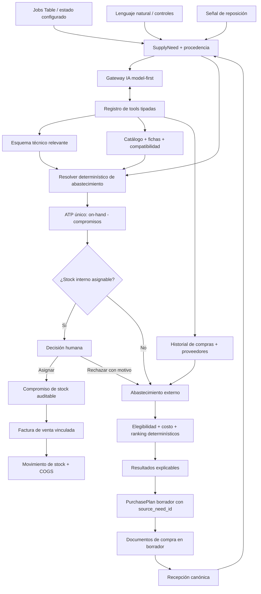

# Plan de implementación — Motor inteligente de abastecimiento y compras

- **Estado:** primer corte vertical, captura formal de compra local, motor de
  interpretación stock-first y workspace T23 implementados, desplegados y
  verificados en producción. La adopción operativa, el backfill revisado y la
  evidencia comercial vigente siguen abiertos.
- **Fecha:** 2026-08-17.
- **Alcance de este documento:** idea, lógica, datos, IA, UI, UX, seguridad,
  validación y secuencia de entrega.
- **Nombre de trabajo:** `Asistente inteligente de abastecimiento` / `Supply
  Workspace`. La etiqueta visible final puede seguir siendo `Asistente de
  compras` si las pruebas de comprensión demuestran que es más clara.

## 1. Propósito y límite de esta propuesta

El objetivo es transformar una decisión de abastecimiento que hoy depende de la
memoria de las personas con más experiencia en un proceso asistido, explicable
y accionable. Una persona debe poder expresar en lenguaje natural uno o varios
repuestos o productos necesarios y recibir primero las alternativas internas
realmente asignables y, sólo para el faltante o para una alternativa interna
rechazada conscientemente, opciones de compra técnicamente pertinentes,
comercialmente razonables y sustentadas por evidencia real del ERP.

El problema raíz no comienza en el proveedor. Comienza en una **necesidad de
abastecimiento** originada, por ejemplo, desde un trabajo de taller, una búsqueda
ad hoc o una señal de reposición. Esa necesidad puede resolverse con stock
interno comprometido, compra externa, compra local de emergencia, recepción
pendiente o una decisión explícita de no continuar. El plan de compra es sólo
uno de esos resultados.

Este documento no congela las pantallas de los bosquejos, no aprueba cada
control dibujado y no convierte la propuesta en un wizard rígido. Las imágenes
creadas durante la conversación son hipótesis visuales para explorar jerarquía,
densidad y flujo. Antes y durante cada fase se puede conservar, cambiar, agregar
o eliminar cualquier detalle si la evidencia demuestra una solución más clara.

El dueño autorizó la implementación explícitamente el 2026-08-16. Este
documento conserva la arquitectura acordada y registra el alcance real de cada
corte; no convierte los bosquejos en requisitos literales ni permite saltar las
puertas de datos, seguridad, navegación y validación.

### 1.1 Corte implementado y desplegado al 2026-08-16

El primer corte vertical ya incluye, en código y runtime de producción:

- kernel durable y tenant-scoped de necesidades, revisiones, procedencia y
  capacidad semántica de estado;
- ATP común con compromisos de taller y protección frente a reservas online;
- observaciones históricas, costo aterrizado con flete atribuible, margen y
  ranking explicable;
- herramientas gobernadas del agente para ATP, candidatos y escenarios de
  canasta, usando referencias opacas en el modelo y UUID sólo dentro del
  servidor;
- descomposición gobernada de una petición natural en una a ocho líneas
  tipadas, con producto exacto o identidad pendiente, cantidad, unidad,
  preferencias, predicados reales del Master Schema y aclaraciones dinámicas;
  la tarjeta cerrada se revisa y edita antes de que un único comando atómico y
  replay-safe cree las necesidades, nunca una compra;
- plan de compra versionado y review-only, con adopción atómica de alternativas
  externas sin crear pedido, factura, pago, recepción ni movimiento de stock;
- workspace Flutter responsive para producto único y canastas de dos a ocho
  necesidades, con máximo tres escenarios, comparación stock-first y
  divulgación progresiva;
- captura contextual desde el estado de Jobs, enlazable al workspace sin
  hardcodear el nombre `REPUESTOS`;
- captura de compra local/emergencia sobre el documento canónico de compras,
  con tipo de comprobante server-owned, procedencia durable desde la necesidad,
  producto o descripción pendiente y pago/recepción separados; y
- clasificación explícita del proveedor local desde `Bienes y repuestos` con
  un único select de tres valores, sin exponer tags técnicos ni inferir
  cercanía. `Proveedor local` deriva `local_workshop` y `Rescate urgente`
  deriva el par `local_workshop` + `emergency_local`.

El corte quedó instalado mediante las migraciones `20260816150000` a
`20260816162400`; la aclaración progresiva, el terminal server-owned y la
frontera de herramientas por etapa quedaron desplegados en
`ai-agent-gateway` v83, hash
`fa835d606967b02e65802eabafc85a876064993f6f2304a4bbd2db861f823bea`. La
lectura exacta de funciones, ACL, contrato de receipts e historial de
migraciones cerró. La app real verificó stock-first, ranking externo,
navegación por referencia exacta, Jobs desktop y compacto, el formulario
contextual y la descomposición de una petición de tres familias sin escribir
compras, necesidades, planes ni movimientos durante la prueba.

La etapa visible `Necesidad` tiene una frontera deliberada: el modelo puede
inspeccionar ficha, buscar inventario, declarar una brecha de capacidad y cerrar
con `prepare_supply_request`; no recibe las tools de ranking de proveedores ni
de escenarios de canasta en esa etapa. Gama, marca, margen, urgencia y demás
objetivos comerciales se preservan tipados para `Proveedores` y `Plan`, donde
recién corresponden esas decisiones. Así se evita que una frase compleja salte
stock interno o mezcle captura con una compra todavía no revisada.

Siguen fuera del alcance entregado el backfill revisado de gastos antiguos, el
retiro de `smart_purchase_list`, la evidencia comercial actual desde
portales/APIs y la conversión atómica del plan completo a documentos de compra.
La captura local ya crea el borrador correcto, pero no cambia implícitamente el
estado de la necesidad ni inventa disponibilidad del proveedor. Tampoco se
declara completa la preparación técnica de
todas las familias: la primera medición productiva del template de neumáticos
encontró `0/113` productos con ficha estructurada suficiente. Ese cero se
conserva como readiness gap visible; no se infirió un backfill desde nombres.

### 1.2 Evidencia de certificación del primer corte

- **Base de datos:** reconstrucción local desechable completa, preflight limpio,
  353 aserciones pgTAP relacionadas del primer corte y `72/72` aserciones
  focalizadas actuales sobre una copia derivada de producción para el batch IA,
  su tarjeta durable y el kernel de necesidades. Todas las migraciones quedaron
  desplegadas y registradas; el contrato durable acepta el borrador cerrado,
  conserva las tarjetas anteriores y rechaza identidades o predicados
  contradictorios.
- **Runtime IA:** `237/237` pruebas Deno del runtime/gateway actual. El gateway
  v83 completó canaries reales y variados de cámara 700x28 Presta 60 mm,
  movimiento central BSA 73/125 y una canasta de cadena, pastillas y cámaras.
  Los tres cerraron con `prepare_supply_request`, conservaron cantidades,
  predicados y preferencias, consultaron stock primero y no ejecutaron ninguna
  mutación. Un `missing_structured_data` y un `schema_discovery_required`
  quedaron como receipts recuperables dentro de runs exitosos, no como
  coincidencias inventadas ni errores opacos para el operador.
- **Frontera JSONB:** la respuesta de `prepare_supply_request` compara cada
  predicado por `field`, `operator` y valores tipados; ignora únicamente el
  orden de las claves del objeto. PostgreSQL canonicaliza ese orden al guardar
  `jsonb`, por lo que `JSON.stringify` no es una prueba válida de igualdad
  semántica y queda cubierto por una regresión deliberadamente reordenada.
- **Flutter:** `129/129` pruebas focalizadas combinadas del workspace, handoff
  T23, contratos visuales, modelos, gateway, evals, acciones y responsive. La
  integración con la ficha del proveedor suma `38/38` pruebas widget del editor
  y `8/8` contratos de arquitectura, incluyendo hidratación, retiro explícito y
  preservación de tags ajenos. El análisis focalizado de los once archivos del
  corte cierra sin errores ni warnings.
- **Producto interno:** una petición exacta encontró dos unidades disponibles y
  abrió Inventario con el único ID resuelto por el servidor.
- **Petición natural multi-línea:** la app macOS real separó cadena de 9
  velocidades, pastillas Shimano B05S y cámaras 29 Schrader en tres necesidades
  editables, con sus cantidades independientes. La ausencia de cobertura o ATP
  produjo líneas `unresolved`, no coincidencias por nombre ni un falso fallo de
  fuente. En otra prueba, la medida ambigua conservó literalmente el contexto
  de rayos para rueda y pidió sólo la magnitud decisiva; al responder 274 mm
  encontró el producto exacto y reportó una unidad en stock. Ninguna de estas
  pruebas pulsó Guardar.
- **Compra externa:** un producto exacto con ATP cero devolvió evidencia de
  cuatro compras, costo aterrizado histórico, margen proyectado y advertencias
  explícitas de precio, flete y disponibilidad no verificados actualmente.
- **Jobs:** el estado configurado para solicitar repuestos abrió la captura sin
  cambiar el status existente, no mostró un catálogo vacío de 200 filas,
  conservó el borrador al ir atrás y adelante y cerró con cero necesidades
  activas en el read-back de producción.
- **Responsive:** la app real se verificó en `1672x896` y `834x728`; las
  regresiones widget cubren 390, 834, 1116 y 1440 px. Todas mantuvieron acciones,
  desplazamiento, retorno semántico y CTA final sin barra de filtros/chips,
  isla modal centrada, hit-test warning ni overflow visible.
- **Proveedor local:** la app macOS real abrió Bicicletas Garozzo, mostró un
  solo `Disponibilidad local` bajo `Bienes y repuestos`, desplegó tres opciones
  cortas sin chips ni panel adicional y volvió sin guardar. El read-back
  productivo permaneció en cero asignaciones locales globales y para ese
  proveedor.

### 1.3 Rediseño del 2026-08-17: qué cambió y por qué

El dueño rechazó el primer corte por dos motivos que conviene separar, porque
tienen dueños distintos.

**El aspecto no se había copiado.** Las tablas de medidas del `spec.json`
estaban implementadas al milímetro —imágenes 38/46/64/76, split pane
420/330/600— y aun así la pantalla no se parecía al diseño: el bloque de
captura no era un panel sino título, subtítulo, campo y botones sueltos sobre
el fondo; la columna de 780 estaba fijada arriba a la izquierda en vez de
centrada; y la tipografía iba en 15-16 px donde el prototipo dice 12,5 / 11 /
10. La corrección de fondo quedó en `.github/copilot-instructions.md`:
**«composición» son dos cosas** —la de producto es nuestra, la visual es de
Design y no se negocia— y **coincidir en los números no es fidelidad visual**.

**El encargo original no se había cumplido.** El prompt pedía que el asistente
*asignara prioridad de compra* y priorizara *por gama*. Ninguna de las dos
existía: el módulo sólo rankeaba después de que alguien escribía qué
necesitaba, y la marca se devolvía como dato sin puntuar.

Lo que entrega este rediseño, todo desplegado y verificado:

- **`purchase_priority_feed_v1`** — la prioridad la levanta el sistema desde
  trabajos de taller esperando repuesto, quiebres y mínimos. La medición decidió
  el diseño: hay 907 agotados y 216 bajo mínimo de 1.613 productos, pero
  cruzándolos con lo que realmente salió por venta en 120 días quedan 70 y 32.
  Una lista de 1.123 filas no es una prioridad. Cada fila viaja con su razón en
  palabras, que es lo que transfiere la experiencia.
- **Gama como dato** — `product_gama_bands_v1` deriva la banda de la posición
  relativa del costo de cada marca dentro de su categoría, `product_gama_v1`
  resuelve la corrección explícita del dueño por encima de lo derivado, y
  `rank_purchase_candidates_v1` acepta `p_gama`. La gama **ordena, nunca
  elimina**: el contrato de elegibilidad reserva la exclusión para la
  contradicción técnica demostrada.
- **Cierre del plan** — totales por moneda que nunca se suman entre sí, margen
  «sin base» cuando no hay precio vigente, y el paso final inline
  `Preparar documentos de compra` con sus filas PROVEEDORES / LÍNEAS / QUEDA
  FUERA. Estaban definidos en `frames[plan].with_lines` del spec y ausentes en
  `lib/`.
- **Ronda de corrección server-side** — el gateway reconoce el payload de
  respuestas del cliente, lo entrega al modelo en prosa en vez de JSON crudo, y
  rechaza que vuelva a preguntar un `promptId` ya respondido. Sin eso, una
  necesidad con dos datos encadenados nunca llegaba a la segunda pregunta.
- **Portal del proveedor dentro del ERP**, con la sesión que sobrevive entre
  visitas, en vez de expulsar al navegador del sistema.
- **Recorrido con historial propio** (`PurchaseJourneyController`), que es el
  `navigation_contract` del spec: salir dejaba de borrar lo trabajado.

**Defecto de rendimiento: CERRADO (2026-08-17).** El ranking por texto libre
tardaba ~32 s porque `tenant_business_date` escaneaba `pg_timezone_names` en
cada llamada y la vista la invoca tres veces por fila.
`20260817130000_tenant_business_date_cheap_validation.sql` dejó que `at time
zone` valide la zona (~67 ms → ~6 ms por llamada); la migración está APPLIED y
el read-back de producción pasa completo. La reproducción histórica sigue en
`supabase/manual_checks/diagnostics/ranking_free_text_slow_repro.sql`, marcada
como cerrada: se conserva porque documenta cómo se midió, no porque el defecto
siga vivo.

**Lo que sí sigue abierto es otra cosa, y no es presupuesto.** Sondas variadas
sobre producción el 2026-08-17: `camara` responde en 522 ms con 5 resultados,
pero `cadena 10 velocidades` (104 ms), `pastillas shimano` (80 ms) y `cassette
9 velocidades` (61 ms) devuelven `verifiedEmpty`. La causa es la semántica del
filtro: `p_query` exige que **todos** los tokens aparezcan como subcadena de un
blob de nombre/SKU/marca/categoría/proveedor, así que «velocidades» —que ningún
nombre del catálogo contiene— vacía el resultado, y el plural de «pastillas» no
casa con «pastilla». Es un problema de recuperación, no de tiempo, y su arreglo
es el contrato tipado de la Fase A y siguientes, no ampliar `p_query`.

## 2. Resultado de producto

El sistema debe ayudar a responder, con distintos grados de precisión:

- qué necesita realmente la persona y qué partes de esa interpretación siguen
  propuestas o ambiguas;
- si Viñabike ya posee unidades físicamente disponibles **y asignables**, luego
  de descontar compromisos vigentes de cualquier canal;
- si conviene asignar explícitamente una unidad interna, buscar otra gama o
  continuar hacia compra externa;
- qué productos podrían satisfacer la necesidad expresada;
- en qué proveedores se han comprado productos iguales, equivalentes o de la
  misma familia;
- cuánto costaron realmente, incluido el flete atribuible cuando existe
  evidencia suficiente;
- qué rentabilidad produciría cada alternativa usando precios y bases
  tributarias comparables;
- qué tan reciente, completa y confiable es la evidencia;
- qué restricciones técnicas cumple, cuáles contradice y cuáles siguen sin
  confirmar;
- si conviene consolidar una canasta en un proveedor o dividirla;
- qué alternativa local o urgente existe cuando su mayor precio igualmente
  deja una venta razonable; y
- qué acción segura puede ejecutar la persona a continuación, conservando el
  vínculo con el trabajo o señal que originó la necesidad.

El sistema interpreta, consulta, recomienda y explica. La persona decide. No
asigna stock, compra, envía pedidos, paga, recibe ni presume disponibilidad de
un proveedor automáticamente. Cada escritura tiene un comando explícito,
idempotente y auditable.

## 3. Principios rectores

1. **La necesidad precede a la compra.** Una solicitud no se convierte en línea
   de compra hasta demostrar un faltante externo o registrar el rechazo
   consciente de una alternativa interna realmente asignable.
2. **Lenguaje natural de entrada, estado tipado por debajo.** La IA interpreta
   frases casuales, pero la búsqueda, los cálculos y las acciones usan contratos
   cerrados y verificables.
3. **IA para interpretación y composición; servicios para autoridad.** El
   modelo decide qué información necesita y qué herramientas combinar. El
   servidor valida esquema, identidad, compatibilidad, stock, economía,
   permisos y escrituras.
4. **Esquema relevante bajo demanda.** El modelo no memoriza ni recibe completo
   `BIKE_WORKSHOP_MASTER_SCHEMA.md`. Inspecciona sólo el fragmento técnico y de
   negocio necesario mediante herramientas gobernadas.
5. **Stock disponible no es stock asignado.** Un snapshot positivo no cubre una
   necesidad. Sólo un compromiso/reserva vigente, creado atómicamente, permite
   afirmar que una unidad quedó destinada a ella.
6. **Flexible donde ayuda; rígido donde protege.** El sistema admite caminos
   distintos, correcciones y resultados parciales. Sólo bloquea ante una
   contradicción material, una ambigüedad que cambia sustancialmente la decisión
   o una acción con efecto real.
7. **No hay workflows técnicos codificados por ejemplo.** “Rayos 27.5” es un
   caso de evaluación, no una rama especial en Dart ni una herramienta dedicada.
   Las preguntas emergen del esquema técnico, la evidencia disponible y el
   objetivo del usuario.
8. **Primero se eliminan contradicciones; luego se ordena.** Un margen alto no
   compensa una incompatibilidad demostrada.
9. **Identidad, categoría, especificación, fitment y gama no se mezclan.** Una
   medida no demuestra un modelo; una categoría no identifica un producto; una
   coincidencia de búsqueda no prueba compatibilidad de montaje.
10. **La historia informa, no inventa el presente.** Haber comprado antes a un
    proveedor no demuestra precio, stock ni plazo actuales.
11. **La rentabilidad se calcula, no se adjetiva.** Costo, flete, precio de
    venta, utilidad y margen muestran base, fecha, fuente y faltantes.
12. **La procedencia nunca se pierde.** Texto original, interpretación,
    revisiones, trabajo/bicicleta de origen y decisiones humanas permanecen
    trazables durante stock, compra, recepción e instalación.
13. **Una sola arquitectura de IA.** El feature extiende el runtime model-first
    y el registro tipado de herramientas existente; no crea un segundo agente.
14. **Una sola verdad de dominio.** Jobs Table, workspace, chat y
    automatizaciones futuras consumen los mismos read models, reglas y comandos.
15. **Los estados de trabajo disparan experiencia, no almacenan necesidades.**
    La conducta se configura mediante capacidad semántica del estado, nunca por
    comparar su nombre con `REPUESTOS`.
16. **Minimalismo por divulgación progresiva.** La persona ve primero la próxima
    decisión; evidencia, diagnósticos y controles infrecuentes siguen cerca,
    pero bajo el recurso UI adecuado y sin ensaladas de chips o cards.
17. **Cada resultado importante es explicable.** La persona puede ver por qué
    una alternativa aparece, qué la debilita y qué dato permitiría mejorarla.
18. **Ausencia de evidencia no significa cero.** Una fuente parcial, sin
    cobertura o temporalmente indisponible conserva su estado honesto.
19. **Los bosquejos son insumo, no especificación.** La composición final se
    valida contra el trabajo real del operador y el sistema visual canónico.

## 4. Decisiones ya acordadas

### 4.1 Forma general del producto

El producto será un motor compartido con varios puntos de entrada y un workspace
continuo. El workspace conserva tres superficies que se pueden recorrer en ambos
sentidos:

```text
Necesidad / Conversación  <->  Resolver / Comparar  <->  Plan borrador
```

No son pasos numerados ni una secuencia obligatoria. Una aclaración puede
ocurrir desde cualquier superficie y una edición en el plan puede volver a
calcular la comparación sin perder contexto.

El flujo no obliga a comprar. Entre `Necesidad` y `Comparar` aparece primero la
resolución interna cuando existe stock asignable. `Plan borrador` se habilita
sólo para líneas que requieren abastecimiento externo.

### 4.2 Fuentes de necesidad

El mismo contrato acepta necesidades originadas desde:

- lenguaje natural o controles en el workspace;
- un trabajo o una bicicleta concreta desde Jobs Table;
- el alcance intencional `General` de un trabajo;
- una señal revisable de reposición;
- una importación o línea pendiente de compra local; y
- futuros entry points autorizados que mantengan la misma procedencia.

La fuente no cambia la lógica de interpretación, inventario, técnica o ranking.
Sólo agrega contexto, permisos y una navegación de retorno exacta.

### 4.3 Producto único y canasta

El mismo workspace admite:

- una búsqueda de un producto o familia;
- varias líneas independientes;
- una canasta con objetivo transversal, por ejemplo máximo de proveedores,
  urgencia o presupuesto; y
- una necesidad expresada sin SKU conocido.

La comparación cambia de composición según el problema: alternativas internas
y externas para una línea; escenarios y cobertura por línea para una canasta.
No se obliga a ambos casos a compartir una tabla idéntica.

### 4.4 Captura desde Jobs Table

Un estado configurable puede declarar la capacidad semántica
`prompts_supply_need_capture` —nombre provisional—, visible en administración
como `Solicitar captura de repuestos`. Al seleccionarlo para un trabajo:

1. se ejecuta primero la transición de estado mediante su comando canónico;
2. sólo si esa transición confirma éxito, la superficie anclada se transforma
   en una captura breve dentro del mismo contexto;
3. la persona puede agregar una o varias necesidades con un único campo que
   busca productos mientras escribe y ofrece explícitamente guardar el texto
   como descripción;
4. cada línea conserva cantidad, alcance, origen y estado de guardado; y
5. cerrar la captura no revierte el estado ya confirmado.

La conducta no depende del código, nombre, color o fase de `REPUESTOS`. Renombrar
el estado conserva el comportamiento; desactivar la capacidad detiene la
invitación futura, sin borrar necesidades existentes.

Si el estado tiene esa capacidad y el trabajo no conserva ninguna necesidad
activa, Jobs Table deriva `Repuestos sin definir`. No se crea una fila vacía para
representarlo. El indicador es un cue de atención compacto y filtrable que abre
la misma captura.

Los cambios masivos de estado no copian una necesidad a múltiples trabajos. En
bulk sólo cambia el estado; cada fila afectada puede quedar en el filtro de
atención para captura individual.

### 4.5 Producto de catálogo y descripción libre

La captura no presenta dos modos técnicos al usuario. Un solo autocomplete:

- confirma un producto canónico cuando la persona elige un resultado; o
- conserva exactamente el texto introducido mediante `Guardar como
  descripción` cuando el producto aún no está definido.

Seleccionar un producto confirma su identidad de catálogo, SKU y ficha, pero no
confirma un proveedor único: un mismo producto puede tener múltiples fuentes
históricas o vigentes.

El texto libre permanece verbatim. La IA puede proponer categoría, identidad y
restricciones revisionadas, pero no vincula silenciosamente un producto exacto.
La adjudicación humana sigue el contrato `eliminar -> rankear`, separa identidad
de fitment y registra la evidencia usada.

### 4.6 Alcance de trabajo y bicicleta

- Desde el estado de una bicicleta específica, la necesidad conserva ese
  `mechanic_job_bikes.id` exacto.
- En un trabajo de una bicicleta, la captura puede preseleccionar ese alcance.
- En trabajos con varias bicicletas, la persona elige una bicicleta concreta o
  `General` antes de guardar si el origen no lo determina.
- `job_bike_id = NULL` puede representar el alcance intencional `General`; no se
  rellena automáticamente.
- Una recepción de componente sin bicicleta usa el sujeto/procedencia canónica
  de ese intake; no inventa una fila de bicicleta.

Existe una asimetría actual que la implementación debe resolver: el comando
`transition_mechanic_job_status` y su receipt cubren el trabajo, pero el status
de `mechanic_job_bikes` hoy se persiste por otra ruta sin `operation_key`. La
captura disparada desde un status de bicicleta no se activa hasta que esa
transición tenga comando canónico auditable —dirección preferida— o Fase 0
limite explícitamente el primer corte al status del trabajo.

La necesidad no se guarda en `mechanic_job_items`: esas líneas representan
trabajo ejecutado/facturable. Tampoco se duplica verdad técnica en
`diagnosis_sheet_data`; los hechos técnicos durables se promueven por las rutas
canónicas de ficha o perfil de bicicleta.

### 4.7 Stock interno, compromiso y consumo

Antes de buscar proveedores, el motor consulta disponibilidad interna
reservation-aware:

```text
available_to_promise = existencia física - compromisos internos vigentes
```

La proyección debe incluir todos los orígenes de reserva, incluido online. La
tabla actual `online_order_inventory_reservations` ya posee un ciclo robusto y
no se reemplaza a ciegas. Fase 0 decidirá entre generalizarla de forma compatible
o agregar un ledger de compromisos de taller que alimente la misma autoridad de
ATP. No son negociables una sola proyección de ATP, comandos atómicos y ausencia
de doble contabilidad de disponibilidad.

`Asignar del stock` es una acción humana explícita, reversible, tenant-scoped,
idempotente, versionada y con read-back. Reduce ATP, pero no existencia
contable. Dos trabajos que compiten por la última unidad se resuelven en el
servidor: uno obtiene el compromiso y el otro recibe el ATP actualizado y un
camino a compra.

La factura de venta vinculada sigue siendo dueña de stock físico, COGS, ingreso
y cuentas por cobrar. Cambiar estado, crear necesidad, asignar o instalar nunca
crea un movimiento de stock por sí mismo. Si una pieza queda físicamente
instalada antes de facturar, el sistema debe representar el riesgo operacional
`installed_pending_invoice` y exigir conciliación posterior con la factura, sin
simular consumo contable.

### 4.8 Necesidad cubierta versus pieza instalada

La identidad, el abastecimiento y el uso son dimensiones ortogonales:

- una necesidad puede estar interpretada o aún sin resolver;
- puede estar disponible, reservada internamente, en compra, recibida o
  cancelada; y
- la pieza puede seguir pendiente, estar instalada pendiente de factura o
  consumida por la factura.

“Recibida”, “cubierta” e “instalada” no son sinónimos. Cambiar el estado del
trabajo no elimina necesidades. Cancelar o archivar un trabajo libera/cancela
compromisos mediante un comando con motivo y evento auditable, nunca mediante
hard delete.

### 4.9 `smart_purchase_list` no es la base

La tabla, trigger, servicio y página actuales de `smart_purchase_list` se
consideran legado. Contienen señales recuperables —mínimos de stock, rotación,
última compra y snapshots operativos—, pero también concentran problemas que no
deben heredarse:

- prioridad opaca de 0 a 100;
- proveedor elegido automáticamente por una regla débil;
- alternativas técnicas derivadas con regex y palabras del nombre;
- lógica de interfaz, consulta y ranking mezclada en una página extensa;
- navegación que pierde el contexto de retorno;
- flujo de compra local que termina como gasto sin identidad de producto; y
- acoplamiento entre estado de factura, stock y recomendación.

El nuevo workspace podrá leer señales históricas válidas durante una transición,
pero no copiará el score, el trigger ni la página como arquitectura. La retirada
del legado se hará sólo después de demostrar paridad funcional y preservar su
evidencia histórica útil.

### 4.10 Costo más reciente y flete

El “costo actual” de un candidato será la observación elegible más reciente que
exista, no un promedio arbitrario ni un valor sin fecha. Debe indicar si es una
compra realizada, una orden confirmada todavía no recibida, una cotización o el
campo mutable de costo del catálogo.

El flete histórico atribuible a una línea se distribuye por la participación de
su costo neto en el subtotal neto de mercadería de la factura. IVA y el propio
flete quedan fuera del denominador. La distribución debe reconciliar al peso
total exacto del flete mediante redondeo determinístico.

### 4.11 Compras locales

Una compra real de repuestos a un taller local no se registrará como un gasto
con el producto escondido en notas. Desde `20260816162000`, el ingreso rápido
usa `purchase_invoices` y un catálogo server-owned para factura, boleta, ticket,
sin documento tributario u otro comprobante. Desde `20260816162200`, cada línea
abierta desde una necesidad conserva además su `source_need_id` tenant-scoped e
inmutable después de la normalización. Producto confirmado o descripción
pendiente, cantidad, costo y tratamiento tributario siguen siendo editables;
pago y recepción permanecen en sus dueños separados. Así la compra alimenta el
mismo historial sin convertirse en `expense`.

### 4.12 Disponibilidad

La disponibilidad del proveedor sólo puede mostrarse como vigente si proviene
de una cotización, API, portal o confirmación manual con fecha y fuente. En los
demás casos se muestra `No verificada`, junto con la edad de la evidencia de
precio o compra. El stock interno de Viñabike, su ATP, una unidad comprometida y
el stock del proveedor son hechos distintos y se presentan con vocabulario
distinto.

## 5. Realidad arquitectónica que se debe reutilizar

### 5.1 Facturas y líneas normalizadas

`purchase_invoices` conserva encabezado, ítems JSON históricos y costos
adicionales. `purchase_invoice_lines` ya proyecta líneas normalizadas con:

- producto opcional y snapshots de nombre/SKU;
- cantidad, costo unitario, descuento, neto, impuesto y total;
- moneda;
- naturaleza de línea;
- clasificación revisada o pendiente; y
- procedencia nativa, JSON legado o migración.

Ésta debe ser la fuente primaria del análisis histórico. Los ítems JSON quedan
como compatibilidad/auditoría, no como nueva API analítica. Las líneas no
resueltas pueden aportar evidencia agregada y revisable, pero no convertirse en
un SKU exacto por inferencia silenciosa.

`expense_links` ya liga gastos a facturas y puede contener un monto asignado,
pero hoy `link_kind` y la naturaleza económica no bastan por sí solos para
afirmar que todo vínculo es flete. La fase inicial debe medir y clasificar esta
cobertura antes de calcular costos aterrizados.

### 5.2 Catálogo, fichas y compatibilidad

El motor de fichas técnicas ya posee:

- `spec_definitions`;
- `spec_templates`;
- `spec_template_fields`;
- `category_tech_mappings`; y
- `product_spec_values`.

El asistente existente ya puede inspeccionar el esquema técnico efectivo del
tenant y buscar inventario mediante predicados tipados. Las fichas estructuradas
son autoridad; el texto de identidad sólo puede cubrir casos estrechos de
igualdad cuando una ficha está vacía y nunca demuestra rangos o desigualdades.

El motor de compatibilidad del taller ya expresa `compatible`, `caution` e
`incompatible`. El workspace debe consumir ese conocimiento cuando exista un
objeto de compatibilidad real —bicicleta, rueda, componente instalado u otra
referencia— y no crear un segundo vocabulario.

Se distinguirán dos conceptos en la UI y el dominio:

- **cumplimiento de la petición:** el candidato satisface las restricciones
  expresadas por el usuario;
- **compatibilidad de montaje:** el candidato funciona con una bicicleta o
  conjunto técnico concreto.

No se llamará “compatible” a una mera coincidencia de búsqueda.

### 5.3 Runtime de IA

El runtime actual es model-first, neutral al proveedor y gobernado por un
registro de herramientas tipadas. Ya incluye, entre otras capacidades,
`inspect_inventory_schema`, `search_inventory`, `search_suppliers` y
`search_purchase_invoices`, además de las tablas efectivas
`assistant_threads`, `assistant_runs`, `assistant_tool_receipts` y
`assistant_approvals` definidas por las migraciones del runtime.

Las nuevas primitivas se incorporarán a ese catálogo con la misma autoridad,
límites, auditoría y política. El modelo interpreta y compone; el servidor
calcula, filtra, autoriza y verifica.

El diseño debe respetar los límites actuales, no asumir que se ampliarán para
este feature: máximo de cinco rondas exploratorias, ocho llamadas y 96 KiB de
output acumulado por run. Una ronda puede contener llamadas de lectura
acotadas en paralelo, por eso el ordinal de receipts no equivale al número de
rondas. En captura de necesidades se permite una sexta ronda sólo cuando
contiene exactamente un `prepare_supply_request` validado; al consumir las
cinco rondas exploratorias el servidor exige ese terminal. Su resultado se
persiste y devuelve directamente, sin pagar otro turno de prosa del modelo. El
camino normal de lectura debe consumir idealmente dos o tres rondas y dejar
margen para recuperación. Una aclaración material termina ese turno y el
análisis continúa en el siguiente; preparar el plan ocurre en otra acción
explícita, no al final obligatorio del mismo run de búsqueda.

Las tools visibles también dependen de la etapa. `Necesidad` anuncia sólo
`inspect_inventory_schema`, `search_inventory`, `report_capability_gap` y
`prepare_supply_request`; cualquier tool registrada pero no anunciada se
rechaza antes del ejecutor. `rank_purchase_candidates` y
`build_purchase_scenarios` pertenecen a las etapas posteriores. La tarjeta
durable nunca conserva `clarificationPrompts`: esa metadata es transitoria y
sólo viaja en la respuesta inmediata compatible con la capacidad del cliente.

El runtime no se alimentará con todo el master schema como un prompt estático.
El modelo recibe propósito, contratos de herramientas y contexto acotado; cuando
necesita conocer atributos, categorías, bike context o reglas disponibles,
inspecciona el esquema efectivo y llama las herramientas pertinentes. Así puede
resolver familias nuevas sin añadir un workflow por producto.

La calidad no queda a elección de Flutter ni a un nombre de modelo hardcodeado.
El routing server-side existente selecciona proveedor/modelo por rol lógico. Las
tareas con descomposición técnica, ambigüedad, canasta o replanning usan el rol
`deep`; `fast` se reserva para trabajo liviano que haya superado evals, como
normalización simple o síntesis de resultados ya calculados. Un fallo del rol
profundo no se oculta degradando a una recomendación heurística: el sistema
continúa manualmente o declara análisis parcial. Los modelos concretos pueden
mejorar por configuración/allowlist sin cambiar contratos ni UI.

### 5.4 Taller, estados y autoridad de stock

El taller ya posee estados configurables por tenant, transiciones canónicas,
trabajos con una o varias bicicletas y alcance `General`. La implementación debe
extender ese modelo con una capacidad semántica explícita en el estado, no con
comparaciones de texto ni un segundo selector de estados.

`mechanic_jobs` es un documento operacional y de reserva. La factura de venta
vinculada conserva la autoridad económica y de consumo de inventario. Las
reservas online existentes prueban el patrón `active -> consuming -> consumed |
released | expired`, con eventos append-only y consumo dentro de la transacción
de factura. El taller puede requerir expiración más larga o revisión humana,
pero debe respetar la misma frontera económica.

### 5.5 Proveedores, portales y secretos

Los metadatos públicos del proveedor, sus relaciones comerciales y sus
criterios contables pertenecen al dominio de proveedores. Las credenciales son
otra autoridad y nunca entran en búsquedas generales, logs o contexto del
modelo.

Abrir un portal público o una pestaña ya autorizada es navegación. Verificar
precio/stock dentro de un portal autenticado es una capacidad futura aislada.
Comprar, enviar, pagar, subir o transmitir información siempre se detiene antes
de la acción y exige confirmación específica.

## 6. Alcance funcional

### 6.1 Incluido

- entrada casual en español, tolerante a abreviaciones, errores y orden libre;
- solicitudes de una o varias líneas;
- captura contextual de necesidades desde Jobs Table;
- necesidades enlazadas a trabajo, bicicleta concreta o alcance `General`;
- producto formal o descripción libre preservada y revisable;
- identificación de categoría, familia técnica, marca, gama, rango de precio,
  cantidad, urgencia y restricciones técnicas;
- aclaraciones dinámicas sólo cuando aportan valor;
- búsqueda interna reservation-aware antes de proveedores;
- asignación y liberación explícitas de stock mediante comandos seguros;
- búsqueda histórica por proveedor y producto/categoría;
- ranking explicable de candidatos;
- costo aterrizado histórico y rentabilidad proyectada;
- comparación de escenarios para canastas;
- alternativas locales cuando estén registradas como compras estructuradas;
- plan de compra borrador agrupado por proveedor;
- navegación a producto, proveedor, factura y portal permitido;
- refinamiento y edición sin perder contexto; y
- degradación funcional cuando IA o una fuente no estén disponibles.

### 6.2 Fuera del primer alcance

- compra automática;
- reserva automática de stock sólo por interpretar una frase o cambiar estado;
- movimiento de stock provocado por estado, necesidad o instalación operacional;
- envío automático de una orden o mensaje;
- pago o asiento contable automático;
- disponibilidad actual inferida desde compras históricas;
- scraping autenticado dentro del proceso principal del agente;
- forecast de demanda presentado como verdad sin un modelo evaluado;
- reemplazo inmediato de todos los flujos de reposición;
- clasificación masiva de líneas históricas sin revisión y trazabilidad; y
- compatibilidad universal de bicicletas basada en texto libre.

## 7. Casos de uso canónicos

### 7.1 Trabajo con producto exacto disponible

Una persona cambia el trabajo a un estado configurado para solicitar repuestos,
busca un producto formal y guarda cantidad 1. El motor muestra dos unidades
físicas, una ya comprometida y una asignable. La persona elige `Asignar del
stock`; el servidor crea el compromiso para ese trabajo y la fila queda como
`1 repuesto asignado`. No se abre una búsqueda de proveedores ni se mueve stock
contable.

### 7.2 Trabajo con descripción libre

> “motor sellado BSA, caja 73, eje 125; gama media o mejor”

El texto queda guardado exactamente como fue escrito. La IA inspecciona el
esquema relevante, propone familia y restricciones, consulta stock y muestra la
interpretación para corregirla. Si no hay unidad interna asignable, abre la
comparación externa conservando el retorno al mismo trabajo. Ningún ejemplo
específico de motor queda codificado.

### 7.3 Producto único con restricciones técnicas

> “Necesito neumáticos 27.5, de ancho mayor a 2.0, económicos pero con buen
> margen.”

El sistema identifica la familia, inspecciona las claves técnicas disponibles,
normaliza el rodado y ancho, interpreta “económico” como preferencia comercial
y “buen margen” como objetivo. Devuelve alternativas que cumplen, deja en
revisión las que carecen de datos decisivos y excluye contradicciones
estructuradas. Cada fila muestra proveedor, costo aterrizado, utilidad/margen,
historia y edad/calidad de evidencia.

Antes de presentar proveedores, se muestran productos internos que cumplen y su
estado de compromiso. La persona puede asignar uno, pedir una gama distinta o
continuar a compra externa con un motivo cuando rechaza stock realmente
asignable.

### 7.4 Ambigüedad técnica dinámica

> “Necesito rayos 27.5.”

El sistema detecta que `27.5` puede describir la medida del rayo que la persona
ya confirmó o el rodado de una rueda para la cual aún hay que calcular el rayo.
Pregunta cuál intención corresponde.

- Si es la medida ya confirmada, la normaliza a la unidad canónica y busca esa
  especificación.
- Si es para una rueda 27.5, consulta el esquema y la compatibilidad disponible
  para solicitar sólo los datos materiales todavía ausentes, como ERD,
  geometría de maza, cantidad de agujeros y patrón de cruces.

La implementación no contiene un `if rayos`. Este caso se conserva como prueba
de regresión de desambiguación genérica basada en esquema.

### 7.5 Canasta de varias familias

> “Necesito piñones, rayos, neumáticos y llantas.”

El sistema crea cuatro necesidades, descuenta primero las que pueden cubrirse
con stock interno y construye escenarios sólo para el faltante externo. Muestra
qué proveedores han cubierto histórica o actualmente todas, varias o sólo una,
y para cada proveedor los productos principales observados por categoría,
marca, gama, costo y fecha. Una línea sin candidato no desaparece: queda visible
como faltante del escenario.

### 7.6 Compra local de rescate

> “Necesito hoy un piñón Shimano; revisa también talleres locales.”

Una alternativa local puede aparecer con precio mayor si está documentada,
tiene disponibilidad confirmada o evidencia reciente y todavía deja utilidad
aceptable. El ranking explica el intercambio entre costo, urgencia y margen; no
oculta la alternativa por no ser la más barata.

### 7.7 Reposición sugerida

Una señal de stock bajo puede abrir una necesidad prellenada. El usuario revisa
la demanda, el ATP y las alternativas. El trigger legado no decide por sí solo
el proveedor ni la prioridad final.

## 8. Modelo de interacción

### 8.1 Entry point contextual de Jobs Table

La selección de estado y la captura forman una microtarea continua:

1. la lista de estados muestra su composición normal;
2. al confirmar un estado con `prompts_supply_need_capture`, el encabezado
   conserva el estado elegido y ofrece `Cambiar`;
3. el cuerpo se reemplaza por `¿Qué repuestos necesita?`, un autocomplete con
   opción de descripción, cantidad y la lista breve de líneas;
4. cada línea confirmada muestra claramente `Guardando`, `Guardada` o `Error —
   reintentar`, sin perder el texto local; y
5. `Cerrar` devuelve a la misma fila, scroll y filtros. `Resolver
   abastecimiento` abre el workspace filtrado a esas necesidades sólo por acción
   explícita.

En desktop no se conserva por inercia el diálogo actual de 320 px. Al mutar, la
superficie anclada adopta el ancho canónico necesario para el campo y una lista
corta. Si la cantidad de líneas supera esa tarea breve, `Ver todas` continúa en
un sheet lateral/workspace preservando el ancla, en vez de comprimir o producir
scroll anidado. En teléfono y otros anchos táctiles se recompone como bottom
sheet o workspace compacto. Los valores y umbrales finales vienen de
DesignSync/pruebas reales; el dominio y el estado local son los mismos.

La transición de estado y la captura son operaciones separadas. Si falla el
estado, no se abre la captura. Si falla una línea, el estado confirmado no se
finge revertido y la línea conserva retry.

### 8.2 Superficie `Necesidad / Conversación`

Responsabilidades:

- recibir la necesidad en lenguaje natural o desde una fuente existente;
- mostrar la interpretación como restricciones editables;
- formular aclaraciones bloqueantes o recomendadas;
- narrar brevemente qué fuente falta o falló;
- permitir agregar, quitar o reformular líneas; y
- ofrecer resultados parciales tan pronto como sean útiles.

La conversación no es una animación que esconde el dominio. Junto a ella existe
un **ledger de restricciones** persistente y tipado. Cada restricción indica
origen (`usuario`, `derivada`, `confirmada por ficha`, `sugerida`), alcance
(línea o canasta) y estado. La persona puede editarla sin reescribir todo el
prompt.

La primera respuesta útil es stock interno, no proveedor. La UI diferencia:

- disponible físicamente;
- comprometido para otras necesidades;
- asignable ahora;
- asignado a esta necesidad; y
- no suficiente o no aplicable.

Sólo cuando existe stock realmente asignable y la persona decide no usarlo se
solicita un motivo breve tipado —gama/condición inadecuada, cantidad
insuficiente, reservado para otro propósito u otro con nota— antes de continuar
a compra. Si el sistema nunca pudo asignarlo, no exige justificar su ausencia.

### 8.3 Superficie `Resolver / Comparar`

Para producto único, la composición inicial candidata es:

- stock interno elegible como bloque de decisión previo;
- tabla/lista de candidatos externos como centro estable;
- inspector contextual del candidato seleccionado;
- orden y filtros explícitos;
- disclosure de descartados y razón; y
- acceso a evidencia, ficha y registros relacionados.

Las columnas exactas se validan con datos reales. El conjunto mínimo a evaluar
es: producto, proveedor, cumplimiento técnico, disponibilidad, costo aterrizado,
utilidad/margen, historia y edad/calidad de evidencia.

Para canasta, el centro cambia a escenarios:

- cobertura interna confirmada;
- proveedor único/consolidado;
- división balanceada;
- menor costo aterrizado estimado;
- opción urgente/local; y
- escenario histórico, sólo si agrega una alternativa distinta.

No se muestran cinco escenarios por obligación. Se eliminan duplicados y
escenarios dominados; se presenta sólo lo que cambia una decisión.

### 8.4 Superficie `Plan borrador`

El plan agrupa por proveedor sólo las necesidades externas y permite:

- cambiar producto o alternativa;
- editar cantidad;
- mover o retirar una línea;
- ver mínimos, packs, faltantes y observaciones;
- recalcular totales y flete estimado;
- volver a comparar sin perder el borrador; y
- preparar uno o varios documentos de compra en borrador.

Agregar al plan no compra. Convertir el plan crea únicamente artefactos
revisables mediante el comando canónico que se defina; ordenar, enviar o pagar
queda fuera y requiere su propio límite de riesgo.

Cada línea conserva `source_need_id`; recibir o convertir un documento no borra
su procedencia de trabajo. Agregar al plan no compra ni marca una pieza como
instalada.

### 8.5 Navegación y continuidad

- El workspace se abre con `push` y cierra con `ReturnNavigation.close`.
- La selección, consulta, restricciones, filtros, orden, ancho del inspector,
  scroll y plan sobreviven al recorrido interno y a la recomposición responsive.
- Abrir producto, proveedor o factura conserva un retorno exacto al workspace.
- `Atrás` visible, Back del sistema y navegador respetan el mismo contrato.
- Una edición pendiente no puede desmontarse al cruzar `899/900`; se conserva o
  exige descarte explícito.
- Volver desde el workspace a Jobs Table restaura el trabajo, alcance de
  bicicleta, fila, scroll, filtros y selección que originaron la navegación.
- Guardar una necesidad no navega por sorpresa; asignar o agregar al plan
  actualiza la proyección y deja visible la siguiente decisión lógica.

## 9. Modelo de intención y restricciones

El modelo lógico provisional es independiente de la frase original y separa
demanda, interpretación, abastecimiento y compra:

```text
WorkspaceConstraintLedger     # revisión de sesión/thread; no tabla V1
  objectiveProfile
  currencyContext
  urgency / neededBy
  budget
  maximumSuppliers
  supplierPreferences / exclusions
  needRefs[]

SupplyNeed                     # demanda durable y source-neutral
  needId / tenantId / version
  originKind / createdBy
  mechanicJobId?
  jobBikeId?                   # NULL puede ser General intencional
  replenishmentSignalId?
  localPurchaseLineId?
  assistantThreadId?
  originalText                 # verbatim
  quantity + unit
  catalogProductId?
  identityState
  sourcingState
  useState
  externalDisposition / rejectionReason?
  activeInterpretationRevision?
  createdAt / updatedAt

NeedInterpretationRevision
  revision
  categoryCandidates[]
  selectedCategoryLeaf?
  technicalFamily?
  productIdentity?
  brandPreferences[]
  rangeOrGamaPreference?
  priceBounds?
  targetMargin?
  technicalPredicates[]
  fitmentContext?
  clarificationState

Constraint
  canonicalKey
  operator
  typedValue
  unit
  strength: required | preferred | informational
  provenance: user | inferred | schema | record
  confirmation: confirmed | proposed | unresolved
  revision

PurchasePlanLine
  sourceNeedId
  selectedProductId / supplierId
  quantity
  evidenceSnapshot / formulaVersions
```

Reglas:

- una inferencia de la IA comienza como `proposed` si cambia materialmente la
  búsqueda;
- una preferencia blanda nunca elimina un candidato;
- un requisito estructurado sí puede eliminar una contradicción demostrada;
- un valor desconocido queda desconocido, no falso;
- todas las unidades se normalizan y se conserva la expresión original;
- categoría candidata y categoría confirmada no son equivalentes; y
- las revisiones son monotónicas para impedir que una respuesta asíncrona vieja
  sobrescriba la intención nueva;
- el texto original nunca se reemplaza con la interpretación;
- `catalogProductId` sólo se fija por selección humana o autoridad equivalente
  confirmada;
- el estado de identidad no se deduce del estado de abastecimiento;
- reservar, recibir, instalar y consumir son eventos/estados diferentes;
- `originKind` exige mediante `CHECK` la FK tipada correspondiente; no existe un
  `originRef` polimórfico libre; y
- una línea entra a `PurchasePlan` sólo si necesita compra externa.

Los enums exactos se cierran en Fase 0. No se diseñará un único status lineal ni
se persistirán estados de cálculo. Como mínimo se separan estas dimensiones:

```text
identidad:      unresolved_text | proposed_match | catalog_confirmed
abastecimiento: open | committed | in_purchase | received | covered | cancelled
uso:            pending | installed_pending_invoice | reconciled | cancelled
```

`evaluating`, `internal_assignable` y `external_required` son resultados del read
model sobre ATP, evidencia y decisiones; no estados durables. La necesidad puede
conservar un disposition/motivo externo mientras sigue `open`. Los nombres son
ilustrativos; los invariantes son obligatorios. Compromiso, plan, recepción y
factura conservan sus lifecycles autoritativos; Fase 0 debe preferir derivar el
estado visible desde esos enlaces antes que duplicarlo en `SupplyNeed`.

Glosario obligatorio para Fase 0: `consumed` se reserva al lifecycle del
compromiso/movimiento producido por factura; `reconciled` describe que la
necesidad quedó conciliada con ese hecho. La UI puede usar lenguaje natural, pero
los contratos no llaman “consumida” a la necesidad y al ledger indistintamente.

## 10. Política de aclaraciones dinámicas

Una aclaración es **bloqueante** sólo si:

- dos interpretaciones plausibles conducen a familias o unidades
  sustancialmente distintas;
- ejecutar la búsqueda sin ella puede sugerir un producto físicamente
  incompatible;
- falta un dato obligatorio para una acción, no sólo para una recomendación; o
- la persona marcó explícitamente esa condición como requerida.

Es **recomendada pero no bloqueante** cuando mejora el orden, la gama, el margen
o la cobertura. En ese caso el sistema muestra resultados parciales y permite
responder después.

Una carencia de fichas, cobertura o evidencia del ERP **nunca** se transforma
por sí sola en una pregunta al operador. Si la persona ya expresó un requisito
sin ambigüedad, la línea conserva ese texto, queda `unresolved` cuando la
identidad no puede demostrarse y publica una advertencia no bloqueante. Sólo se
usa `clarificationRequired=true` cuando falta un hecho o una decisión humana
material; ese estado lleva entre una y tres `clarificationPrompts` tipadas. Una
línea no bloqueante siempre lleva la lista de prompts vacía.

La pregunta se construye desde:

1. la interpretación del modelo;
2. las categorías/familias reales encontradas;
3. las definiciones y operadores del esquema técnico;
4. el contexto de compatibilidad disponible;
5. la sensibilidad estimada del conjunto de candidatos al dato faltante; y
6. las alternativas de respuesta que el backend puede representar.

La IA puede redactar la pregunta en lenguaje natural. No puede inventar claves,
unidades ni opciones que el runtime no haya validado.

El contrato de interacción es general, no una colección de subwizards por
producto:

- cada prompt tiene un `id` local a la línea, una pregunta, `inputKind`
  (`single_choice`, `number` o `text`), opciones cerradas cuando corresponda,
  unidad visible opcional y `allowUnknown`;
- la UI presenta una sola pregunta activa, mantiene la petición original
  visible/editable y resume las respuestas anteriores con una acción para
  cambiarlas; una elección cerrada usa radios, una magnitud usa un campo con
  sufijo y el texto libre queda acotado a la excepción que lo necesita;
- `No lo sé` es una respuesta explícita, nunca un valor por defecto ni una
  inferencia silenciosa;
- una tarjeta publica normalmente sólo la próxima pregunta decisiva y como
  máximo tres prompts para líneas independientes. El cliente admite como
  máximo tres rondas confirmadas en el mismo hilo; un fallo de transporte no
  consume una ronda, y al alcanzar el límite ofrece corregir o guardar la
  necesidad pendiente en vez de abrir un cuarto interrogatorio;
- `Continuar` no guarda una necesidad ni ejecuta una compra. Envía en el mismo
  `threadId` un mensaje ordinario del operador, JSON y autocontenido, con la
  petición original y sólo `lineRef`, `promptId`, pregunta y respuesta o
  `unknown`. Ese sobre sigue siendo entrada no confiable del modelo: no se
  convierte en autoridad de servidor ni se concatena como instrucción; y
- `clarificationPrompts` es metadata transitoria del turno. Se negocia mediante
  capability header, se elimina antes del RPC SQL durable y también se omite
  para clientes v1 estrictos. Las tarjetas v1 que bloquean sin prompts conservan
  una salida manual compatible.

La prosa extensa del modelo queda plegada bajo `Ver explicación del análisis`.
La línea, su estado y la próxima decisión permanecen visibles; advertencias de
evidencia viven junto a la línea y no compiten con la pregunta mediante otra
CTA.

## 11. Responsabilidad de IA y responsabilidad determinística

| Tarea | IA | Servicio determinístico |
| --- | --- | --- |
| Entender lenguaje casual | Sí | Valida salida tipada |
| Separar una canasta en líneas | Propone | Valida identidad y límites |
| Detectar ambigüedad | Propone y explica | Mide impacto y ofrece esquema válido |
| Descubrir claves técnicas | Decide cuándo consultar | Inspector es la autoridad |
| Buscar productos/proveedores | Compone herramientas | Filtra por tenant y ejecuta |
| Consultar ATP y compromisos | Decide cuándo consultar | Proyección server-side autoritativa |
| Elegir si usar stock interno | Propone tradeoffs | La persona decide |
| Asignar/liberar stock | No implícitamente | Comando atómico, idempotente y auditable |
| Calcular costo/flete/margen | No | Sí, fórmula versionada |
| Determinar contradicción técnica | No por prosa | Sí, ficha/compatibilidad |
| Ordenar candidatos | Elige objetivo autorizado | Calcula componentes y orden |
| Crear escenarios de canasta | Explica y puede elegir perfil | Optimiza de forma acotada |
| Afirmar stock del proveedor | No | Sólo fuente vigente verificable |
| Preparar plan | Puede proponer | Comando tipado e idempotente |
| Mover stock/COGS | No | Factura/recepción canónica dentro de transacción |
| Comprar/enviar/pagar | No | Capacidad separada y confirmada |

La respuesta útil no depende de que el modelo conozca un workflow particular.
Depende de que pueda componer primitivas generales y de que el runtime ofrezca
un camino manual tipado cuando el modelo falle.

## 12. Herramientas y comandos propuestos

### 12.1 Tools de lectura/orquestación para IA

Los nombres finales se deciden contra el registro actual; se prefiere extender
una primitiva general antes de duplicarla por pantalla. No se crea una
herramienta por familia de bicicleta, ejemplo o vista.

1. `inspect_inventory_schema`
   - amplía el inspector actual con dimensiones técnicas,
     comerciales, de ATP y fuentes de evidencia disponibles;
   - devuelve claves, tipos, unidades, operadores y cobertura, no SQL ni el
     master schema completo.
2. `search_inventory`
   - conserva el dueño existente, pero su proyección para abastecimiento debe
     distinguir on-hand, comprometido y ATP;
   - acepta un `needRef` opaco y resuelve server-side su contexto autorizado para
     evitar gastar otra ronda en una tool de lectura previa;
   - nunca presenta un snapshot como reserva ya realizada.
3. `search_purchase_candidates`
   - recibe necesidades y restricciones tipadas que requieren salida externa;
   - aplica el perfil de objetivo, elimina contradicciones y devuelve un
     shortlist ya ordenado con componentes explicables y referencias cerradas
     a evidencia;
   - no necesita una segunda tool de comparación que consuma otra ronda.
4. `build_purchase_scenarios`
   - para canastas, subsume búsqueda, ranking y combinación de shortlists bajo
     máximo de proveedores, urgencia, presupuesto y demás restricciones
     representables.
Las necesidades que la persona seleccionó se entregan al run como referencias
opacas y resumen mínimo autorizado; no necesitan una tool `list_*` adicional en
el camino normal. Si una automatización futura debe descubrir necesidades, usa
un read model/tool de atención separado, no infla el flujo interactivo.

### 12.2 Comandos de aplicación

Las escrituras no son herramientas autónomas que el modelo pueda disparar por
redacción. UI o flujo aprobado invocan comandos server-side con permisos,
`operation_key`, versión esperada, receipt y read-back:

- crear/editar/cancelar `SupplyNeed`;
- confirmar o desvincular una identidad propuesta;
- asignar, liberar o reasignar un compromiso de stock;
- registrar el motivo de continuar a compra pese a stock asignable;
- `prepare_purchase_plan`, que congela selección y evidencia en un borrador
  revisable; y
- `convert_purchase_plan_to_drafts`, que crea documentos canónicos en borrador,
  agrupados por proveedor, con preview, idempotencia y read-back.

Una futura exposición de alguno de estos comandos a la IA debe usar la política
de riesgo y aprobación del runtime; no se obtiene por existir el endpoint.

Puede resultar correcto fusionar o dividir primitivas después de medir payloads
y límites. Lo no negociable es conservar schemas cerrados, outputs acotados,
autoridad server-side, receipts y ausencia de SQL/model-driven writes.
La Fase 0 debe fijar un presupuesto por tool y regresiones que demuestren que
producto único, canasta y el camino `needRef -> ATP -> aclaración -> candidatos`
caben o continúan honestamente dentro de los límites actuales, sin elevar el
radio de impacto del runtime completo.

## 13. Construcción de evidencia histórica

### 13.1 Observación de costo

Cada observación debe conservar como mínimo:

- tenant;
- factura y línea fuente;
- proveedor;
- producto enlazado o clasificación pendiente;
- categoría/familia en la fecha de lectura y su procedencia;
- fecha económica del documento;
- estado del documento;
- naturaleza de línea y tratamiento de compra;
- cantidad y unidad;
- costo neto base por unidad;
- descuentos aplicados;
- componentes aterrizados asignados;
- costo aterrizado unitario;
- moneda y, si corresponde, tipo de cambio con fuente/fecha;
- tratamiento tributario;
- calidad de resolución de producto/categoría; y
- clasificación de evidencia.

La primera implementación debe derivar estas observaciones desde fuentes
canónicas mediante una view/RPC o proyección reproducible. No se crea de entrada
otra tabla mutable de costos que pueda divergir de la factura.

### 13.2 Elegibilidad temporal

Política inicial a validar con semántica real:

- `confirmed`, `received` y `paid`: evidencia de compromiso/compra, mostrando
  si aún no existe recepción;
- `draft` y `sent`: dato indicativo, nunca “último costo comprado”;
- `cancelled`: excluido del costo histórico;
- cotización o portal: evidencia actual separada de compra realizada; y
- `products.cost`: fallback visible con su propia fecha de actualización, no
  sustituto silencioso del historial.

Además del estado temporal, la línea debe ser económicamente elegible:

- `inventory` y `workshop_consumable` pueden aportar costo de producto; la
  segunda se etiqueta como consumo directo y no implica entrada a stock;
- `service`, `operating_expense` y `capital_asset` no entran al historial de
  costo de un repuesto ordinario;
- `freight`, `discount` y `tax` son componentes del documento, nunca producto
  base ni denominador de mercadería; y
- `other` o `needs_review` quedan fuera de cálculos definitivos hasta ser
  clasificados.

La fecha económica de la factura manda sobre `created_at`. Si existe corrección
o reversa, el read model debe usar la versión efectiva y no contar dos veces.

### 13.3 Resolución de identidad

El orden es:

1. vínculo exacto `product_id` tenant-scoped;
2. alias/listing de proveedor confirmado mediante
   `supplier_product_aliases` o el grafo vigente de resolución de variantes;
3. candidato de identidad según el contrato canónico de matching;
4. clasificación de categoría/familia revisada; y
5. línea no resuelta visible.

Una coincidencia probable puede ayudar a revisar datos, pero no debe fusionar
historiales ni recomendar un SKU exacto sin adjudicación.

Estas entidades de alias y resolución ya existen en migraciones del repositorio;
no son tablas nuevas del workspace. La Fase 0 verifica su despliegue, cobertura
y estado efectivo antes de depender de ellas.

### 13.4 Sets, packs y componentes

Una factura puede representar una unidad comercial que luego se descompone en
varios productos de catálogo. Hay dos caminos distintos que deben conservar su
procedencia:

- el grafo de resolución de variantes de proveedor puede expandir una línea
  fuente y ya conservar `allocated_line_total_minor` y `allocation_ratio`; esa
  asignación validada es la autoridad para sus componentes; y
- un producto `set` puede entrar como padre y explotar stock mediante
  `product_set_components.cost_ratio`.

El kernel siempre conserva la observación del set/purchase unit. Sólo crea
observaciones derivadas por componente cuando todas las razones requeridas son
válidas, positivas y reconcilian exactamente el costo fuente. Si faltan o no
reconcilian, el costo por componente queda desconocido y la UI explica que sólo
existe costo del set. Ningún componente hereda el costo completo de la línea.

### 13.5 Métricas históricas

Las métricas candidatas son:

- compras y unidades por producto/proveedor;
- recencia y frecuencia;
- proporción del historial de esa familia cubierta por el proveedor;
- estabilidad o dispersión del costo;
- historial de marcas y gamas;
- amplitud de cobertura para canastas;
- recepción completa/parcial y discrepancias, cuando su uso comercial haya sido
  validado; y
- evidencia local/urgente.

Estas métricas describen comportamiento observado. No deben llamarse
“confiabilidad del proveedor” ni atribuir causalidad sin un contrato específico.

## 14. Costo aterrizado y flete

### 14.1 Definiciones

Para una factura elegible:

```text
neto_mercadería_línea_i = net_amount efectivo de la línea i

subtotal_neto_mercadería =
  suma(neto_mercadería_línea elegible)

peso_i =
  neto_mercadería_línea_i / subtotal_neto_mercadería

flete_asignado_línea_i =
  flete_asignable_factura * peso_i

costo_aterrizado_unitario_i =
  (neto_mercadería_línea_i + flete_asignado_línea_i
   + otros_costos_aterrizables_asignados_i) / cantidad_i
```

El denominador incluye sólo líneas elegibles `inventory` y
`workshop_consumable`; excluye IVA, flete, servicios, gastos operacionales,
activos, impuestos recuperables y demás ajustes. Si un costo aplica sólo a un
subconjunto de líneas, se distribuye dentro de ese subconjunto.

### 14.2 Fuentes de flete

El kernel debe reconciliar, sin duplicar:

- líneas normalizadas clasificadas como `freight`;
- `additional_costs` cuya clasificación revisada sea flete;
- gastos vinculados mediante `expense_links` y clasificados como transporte de
  esa compra; y
- costo landed ya distribuido por una fuente como AliExpress.

Una etiqueta de texto parecida a “envío” no autoriza doble conteo. Cada
componente declara fuente, monto reconocido y motivo de inclusión/exclusión.
Si un componente está en otra moneda y no existe un tipo de cambio autoritativo
con fecha/fuente, queda separado y el landed se declara parcial.

### 14.3 Redondeo

1. calcular proporciones con precisión decimal;
2. asignar pesos enteros de moneda usando método de mayores restos;
3. resolver empates por identidad estable de línea;
4. demostrar que la suma asignada coincide exactamente con el flete; y
5. conservar mayor precisión en el costo unitario sin alterar el total del
   documento.

### 14.4 Estimación prospectiva

Un costo histórico aterrizado es exacto para esa compra, no para una compra
futura. Mientras no exista cotización vigente:

- el costo base usa la observación elegible más reciente;
- el flete futuro usa una estimación separada, idealmente un rango histórico
  por proveedor y tipo/tamaño de canasta;
- la UI lo etiqueta `Estimado`, muestra fecha/cobertura y no mezcla un rango con
  un monto verificado; y
- al consolidar una canasta se estima un flete de pedido y luego se distribuye;
  no se suman cuatro fletes unitarios históricos como si fueran independientes.

## 15. Rentabilidad

La comparación económica se hace en una misma base tributaria y moneda:

```text
utilidad_bruta_unitaria = precio_venta_neto - costo_aterrizado_unitario

margen_bruto =
  utilidad_bruta_unitaria / precio_venta_neto
```

Se deben mostrar al menos:

- precio de venta usado y su procedencia;
- costo base;
- flete y otros componentes;
- utilidad por unidad;
- margen porcentual;
- antigüedad de precio y costo; y
- dato faltante que vuelve parcial el cálculo.

No se compara un precio de venta con IVA contra un costo neto sin normalizar.
No se llama “rentable” a una fila cuyo precio o costo carece de base confiable.
La persona puede solicitar margen mínimo o priorizar utilidad absoluta.

Default de moneda hasta que exista un contrato FX:

- no se inventa ni consulta implícitamente un tipo de cambio;
- los subtotales de una canasta se muestran separados por moneda;
- candidatos de monedas distintas no se ordenan como si el costo fuera
  directamente comparable;
- un flete en moneda distinta mantiene el costo aterrizado como parcial; y
- incorporar FX más adelante exige fuente, instante, par, tasa y snapshot
  auditable.

## 16. Cumplimiento técnico y compatibilidad

Pipeline obligatorio:

1. resolver categoría/familia mediante el árbol real;
2. inspeccionar claves, tipos, unidades, operadores y cobertura;
3. evaluar predicados contra `product_spec_values`;
4. eliminar contradicciones estructuradas;
5. usar fallback de identidad sólo donde el contrato lo permite;
6. si hay contexto de montaje, consultar el motor de compatibilidad canónico;
7. conservar `caution` cuando falte una unión material; y
8. explicar exactamente qué dato falta.

Estados técnicos visibles:

- `Cumple`: evidencia estructurada suficiente para los requisitos expresados;
- `Revisar`: no existe contradicción, pero falta una confirmación material; y
- `No cumple`: una contradicción autoritativa elimina al candidato.

Los excluidos no compiten en el ranking, pero quedan inspeccionables en un
disclosure con su razón. Marca comercial y categoría textual nunca se convierten
solas en familia de compatibilidad.

## 17. Ranking explicable

El ranking es un pipeline, no un número mágico:

### 17.1 Etapa 1 — elegibilidad

- tenant y permisos correctos;
- producto/proveedor activo cuando corresponde;
- moneda y costo representables;
- restricciones requeridas; y
- ausencia de contradicción técnica.

### 17.2 Etapa 2 — calidad de evidencia

Clasifica la fila como completa, parcial o débil según vínculo de producto,
fecha, costo, flete, precio de venta, ficha y disponibilidad. Esta calidad no
reemplaza el valor comercial: evita falsa precisión y puede penalizar, pero se
muestra como dimensión propia.

### 17.3 Etapa 3 — componentes comerciales

- economía: costo aterrizado, utilidad y margen;
- historia: frecuencia, recencia, unidades y estabilidad;
- ajuste a preferencias: gama, marca, precio y proveedor;
- operación: urgencia, cobertura de canasta, mínimos, packs y plazo cuando
  exista evidencia; y
- frescura de precio/disponibilidad.

### 17.4 Etapa 4 — objetivo elegido

Perfiles iniciales de V1:

- `Equilibrado`;
- `Mayor rentabilidad`; y
- `Urgente/local`.

Los perfiles no son prompts. Son fórmulas server-owned, versionadas y
calibradas con datos reales. Sus pesos y reglas aparecen en “Por qué aparece
aquí”. La IA puede seleccionar un perfil desde la petición; la persona puede
cambiarlo.

`Menor costo`, margen, utilidad, historia y cobertura por proveedor siguen
disponibles como columnas, ordenamientos o restricciones explícitas. No se
convierten todos en perfiles de V1: “historial más sólido” podría reforzar por
accidente el conocimiento tribal que el sistema debe contrastar, y “menos
proveedores” pertenece al solver de canasta, no al orden de un producto único.

No se fijan porcentajes definitivos en este plan. La fase de datos debe medir
distribuciones y evaluar sensibilidad antes de congelarlos. En todo perfil:

- una incompatibilidad no recibe peso compensatorio;
- una evidencia desconocida no se vuelve cero;
- un candidato dominado por otro en todas las dimensiones relevantes puede
  ocultarse como alternativa secundaria; y
- la UI muestra los componentes principales, no sólo el orden final.

## 18. Optimización de canastas

El problema se representa como líneas, candidatos por línea, proveedores y
restricciones transversales. El servidor:

1. construye un shortlist seguro por línea;
2. elimina candidatos incompatibles y dominados;
3. agrupa por proveedor y cobertura;
4. genera combinaciones acotadas;
5. calcula costo/flete a nivel de pedido;
6. aplica restricciones de máximo de proveedores, urgencia, presupuesto,
   mínimos y packs conocidos;
7. conserva faltantes explícitos; y
8. devuelve pocos escenarios materialmente distintos.

La primera versión no necesita resolver un optimizador combinatorio ilimitado.
Puede usar top-K por línea, poda de dominancia y búsqueda acotada con límites de
tiempo. Si no alcanza una solución completa, devuelve la mejor cobertura
parcial y explica qué línea quedó abierta.

La IA elige o explica el objetivo. El solver calcula. Un timeout no debe dejar
la interfaz trabada: se muestran candidatos individuales y escenarios parciales
ya válidos.

## 19. Registro correcto de compras locales/emergencia

Antes de hacerlas recomendables se necesita un camino de captura veraz:

1. seleccionar o crear el proveedor local con su relación real;
2. registrar tipo de documento (`factura`, `boleta`, `ticket`, `sin documento
   tributario` u otro vocabulario validado);
3. enlazar cada línea a producto o dejarla explícitamente pendiente de
   resolución;
4. registrar cantidad, unidad, costo, impuesto y moneda;
5. adjuntar evidencia si existe;
6. registrar pago y recepción mediante sus dueños canónicos, sin fusionarlos;
7. actualizar stock sólo con recepción válida; y
8. incorporar la observación al historial de compras.

Esta ruta puede ser rápida, pero no una escritura directa a `expenses`. Los
gastos siguen siendo correctos para servicios y consumos operacionales que no
representan mercadería/repuesto comprado.

La dirección validada es un adaptador sobre el kernel canónico de compras.
`purchase_source_document_kinds` gobierna el vocabulario y el comportamiento;
`purchase_invoices.source_document_kind` conserva el comprobante real; y
`purchase_invoice_lines.source_need_id` preserva la procedencia durable. La
boleta/ticket/sin documento usa un workflow directo que confirma la compra sin
simular un envío al proveedor. No fusiona pago, recepción, stock ni contabilidad
y no cambia el estado de la necesidad implícitamente. La clasificación local
del proveedor también exige una asignación explícita `local_workshop` o
`emergency_local`: el sistema no la deduce del documento, nombre ni campo
legacy.

Esa evidencia ya tiene un escritor operativo en la ficha del proveedor. Sólo
la relación `Bienes y repuestos` muestra `Disponibilidad local`, mediante el
select canónico corto: `Sin confirmar`, `Proveedor local` o `Rescate urgente`.
El primer valor no asigna nada; el segundo asigna `local_workshop`; el tercero
asigna además `emergency_local`. La adaptación preserva tags no representados,
hidrata relaciones existentes y oculta el control si el catálogo no publica
ambas definiciones. La UI no muestra códigos, chips ni otra taxonomía, y
declara que el dato orienta sugerencias pero no genera compras.

El bootstrap también contiene `purchase_orders` / `purchase_order_items`, pero
su mera existencia no los vuelve canónicos: el modelo Flutter actual difiere en
tipos/nombres del esquema y el formulario sigue siendo un placeholder. Fase 0
debe comprobar presencia y datos en producción, consumidores reales, RLS,
efectos de stock y compatibilidad con facturas/recepciones antes de decidir si
se moderniza, se migra o se retira ese kernel.

## 20. Modelo durable provisional

La conversación, la necesidad, el compromiso de stock y el artefacto de compra
tienen dueños distintos:

- `assistant_threads`, `assistant_runs`, `assistant_tool_receipts` y
  `assistant_approvals` conservan interacción, ejecución y aprobaciones de IA;
- `supply_needs` —nombre provisional— conserva la demanda durable,
  source-neutral y su procedencia;
- una revisión tipada conserva cada interpretación y ledger de restricciones
  sin sobrescribir el texto original;
- una proyección/ledger de compromisos conserva reservas de inventario y sus
  eventos, separada del estado de la necesidad;
- `purchase_plans` conserva el borrador de decisión externa; y
- `purchase_plan_lines` conserva `source_need_id`, selección, cantidad y
  snapshot de la evidencia usada.

### 20.1 Contrato mínimo de `SupplyNeed`

La normalización final se decide en Fase 0, pero debe representar sin pérdida:

- `tenant_id`, ID, versión, actor y timestamps;
- `origin_kind` y FKs específicas nullable a los dueños V1, como
  `mechanic_job_id`, `replenishment_signal_id` o línea importada/local;
- vínculo opcional al trabajo y alcance exacto de bicicleta/`General`;
- descripción original verbatim;
- producto canónico opcional, cantidad y unidad;
- estado/revisión de identidad;
- estado de resolución de abastecimiento;
- estado operacional de uso/instalación cuando aplique;
- motivo tipado y nota cuando se rechaza stock asignable;
- vínculo opcional al thread/run de IA; y
- cancelación lógica con motivo, nunca hard delete como operación normal.

Un `CHECK` exige exactamente la FK compatible con `origin_kind`; para origen ad
hoc no exige un documento y puede conservar `assistant_thread_id`. `job_bike_id`
es alcance opcional dentro del origen de taller, no un origen alternativo. Fase
0 confirma nombres y dueños reales, pero no reabre una pareja polimórfica libre
que permita referencias inexistentes. Agregar una nueva clase de origen requiere
una migración consciente.

### 20.2 Capacidad de estado y atención derivada

El estado configurable del taller requiere una capacidad equivalente a
`prompts_supply_need_capture`. Su nombre, columna y edición administrativa son
provisionales; su semántica no lo es. Debe formar parte del mismo agregado y
comando que actualiza la definición de `job_statuses`, con RLS y auditoría.

`Repuestos sin definir` es una proyección derivada cuando se cumplen ambas
condiciones:

1. el estado vigente solicita captura; y
2. no existe una necesidad activa/no cancelada para el alcance consultado.

No se persiste como estado adicional, necesidad vacía ni texto en la fila. La
proyección alimenta Jobs Table, filtros y herramientas de atención. Cambiar el
estado no borra necesidades previas; la UI debe distinguirlas si ya no son
coherentes con el estado vigente.

### 20.3 Compromisos de inventario

La solución final debe preservar:

- una única autoridad de ATP que incluya reservas online, taller y futuras
  fuentes;
- cantidad, producto, tenant, fuente/necesidad, estado y versión;
- `operation_key` idempotente;
- creación/adjudicación atómica bajo concurrencia;
- transición explícita entre activo, liberado, consumiendo y consumido;
- expiración/política de revisión apropiada al taller, no copiada ciegamente de
  un checkout de 30 minutos;
- invoice/movement IDs cuando la factura consuma la unidad; y
- eventos append-only con actor, razón y timestamps.

La factura vinculada del trabajo consume por identidad los compromisos de ese
trabajo/necesidad. Si factura una línea sin compromiso, consume on-hand libre y
no modifica reservas ajenas. No puede publicar el movimiento y dejar su propio
compromiso `active`: la transición `consuming -> consumed` y los movimientos
ocurren en la misma transacción.

La compatibilidad con `online_order_inventory_reservations` se conserva. La
fase de diseño de datos puede generalizar el ledger, agregar una tabla de taller
que contribuya a una proyección ATP común o proponer otra migración segura. No
puede mantener dos fórmulas de disponibilidad que diverjan. Antes de sumar
taller, la nueva proyección debe reproducir exactamente
`online_product_available_quantity` para el subconjunto online mediante fixture
dorado y datos de producción saneados.

### 20.4 Planes y documentos

Estados candidatos del artefacto de compra:

```text
PurchasePlan: draft -> ready -> converted | cancelled
```

`ordered`, `received` y `paid` pertenecen al documento/orden/recepción, no al
plan. No se persistirá cada candidato efímero como verdad. Al elegir una línea,
el plan congela IDs, métricas, versiones de fórmula, fecha y referencias de
evidencia suficientes para reconstruir la decisión. Una necesidad puede
participar en revisiones de plan, pero la cantidad cubierta total no puede
superar su cantidad pendiente sin una decisión explícita.

### 20.5 Invariantes de escritura

- `tenant_id` obligatorio, índices y RLS en toda entidad nueva.
- Versión optimista y latest-eligible-wins en read models asíncronos.
- Comandos idempotentes y read-back autoritativo.
- Estado de trabajo y necesidad no se actualizan como una falsa transacción
  única desde Flutter.
- Ninguna reserva se crea sólo por seleccionar un status o por una inferencia de
  IA.
- Ningún cambio de status publica stock.
- Ninguna instalación operacional sustituye el consumo por factura.
- Retry/doble clic no duplica necesidad, compromiso, plan ni documento.
- No se guarda razonamiento privado; sí entradas/outputs saneados, decisiones y
  evidencia reproducible.

## 21. Arquitectura técnica objetivo



Capas:

1. **Flutter / presentación:** Jobs Table, workspace, navegación, controles,
   estados parciales y controller con latest-eligible-wins.
2. **Dominio de aplicación:** necesidad, interpretación, compromiso, selección,
   plan y comandos.
3. **Gateway IA:** interpretación, planificación de tools, replanning,
   explicación y receipts.
4. **Servicios determinísticos:** identidad, esquema, ATP, evidencia, cálculo,
   ranking, compatibilidad y solver de canasta.
5. **PostgreSQL/Supabase:** autoridad, RLS, proyecciones, eventos, datos
   canónicos, idempotencia y read-back.

El modelo puede decidir que necesita inspeccionar esquema, buscar inventario,
leer contexto de necesidad y consultar proveedores; también puede replantear el
camino si una tool devuelve cobertura parcial. No puede saltarse las etapas de
elegibilidad ni transformar una explicación en escritura.

Si una regla necesita existir en Flutter y en el gateway, se define un contrato
compartido con fixtures dorados y un solo dueño conceptual. No se mantienen dos
scores parecidos que puedan divergir.

## 22. UI y UX adaptable

### 22.1 Captura contextual en Jobs Table

- La lista de estados conserva su lectura normal hasta confirmar la transición.
- La captura ocupa el mismo contexto en lugar de abrir una segunda ventana
  desconectada.
- Un campo principal busca catálogo y ofrece guardar descripción; no hay dos
  formularios ni un selector de “modo”.
- Cantidad, alcance y agregar son controles compactos y explícitos.
- Las necesidades guardadas forman una lista de texto estable con edición y
  eliminación secundaria; no una nube de chips multicolor.
- La fila resume `2 repuestos pendientes`, `1 asignado · 1 por comprar` o
  `Repuestos sin definir`. El detalle aparece al abrir, no permanentemente en la
  tabla.
- Un error de guardado permanece junto a la línea afectada con retry; no se
  mezcla con el resultado de la transición de estado.
- `Resolver abastecimiento` es secundaria mientras se captura y primaria sólo
  cuando ya existen líneas válidas y la intención es continuar.

### 22.2 Escritorio (`>=900px`)

- shell global y superficie de comando canónicos;
- comparación estable en el centro;
- inspector contextual colapsable/redimensionable sólo si acelera comparación
  repetida;
- ledger visible sin competir con la decisión principal;
- teclado, hover, foco y atajos para alta frecuencia; y
- plan agrupado por proveedor con edición inline acotada.

### 22.3 Tablet (`600-899px`)

- shell compacto, sin workspace strip ni rail derecho persistente;
- tabla reducida o lista enriquecida según ancho útil real;
- inspector simultáneo sólo si ambos paneles conservan ancho táctil útil;
- en caso contrario, detalle inline, sheet o superficie completa preservando
  selección; y
- objetivos táctiles de al menos 48 px.

### 22.4 Teléfono (`<600px`)

- candidatos como lista vertical escaneable, no tabla horizontal encogida;
- identidad, proveedor, cumplimiento y economía principal en primera lectura;
- evidencia secundaria bajo disclosure;
- inspector y ledger mediante composición inline/full workspace o bottom sheet
  según la decisión, sin duplicar lógica;
- una acción primaria alcanzable sobre teclado y SafeArea; y
- retorno exacto a filtros, selección y scroll.

### 22.5 Reglas de jerarquía y densidad

- un solo primary action por decisión;
- texto normal para hechos normales; chips/badges sólo para estado o acción
  compacta que realmente lo requiera;
- máximo una familia visual de status por zona; no mezclar chips, pills,
  etiquetas y texto coloreado para representar el mismo tipo de información;
- status técnico no se mezcla con badges de precio, gama o evidencia;
- los cuatro o cinco hechos que cambian la decisión quedan visibles; metadata,
  telemetría, fuentes y diagnósticos se agrupan bajo disclosure/inspector;
- avisos persistentes sólo para hechos que cambian la decisión;
- paneles y overlays se eligen por duración/alcance, no por parecerse al
  bosquejo;
- select corto, selector buscable, popover, sheet, notice, tabla y split pane
  reutilizan dueños canónicos;
- ningún valor visual se estima desde las imágenes; al implementar se lee con
  DesignSync desde `GUÍA GENERAL Viñabike - Componentes`; y
- claro, oscuro, presets, densidad y escalas 0.8/1.0 comparten roles semánticos.

La implementación usa el autocomplete y los servicios de dominio canónicos,
pero no trasplanta automáticamente todo overlay/filtro de un buscador grande al
popover estrecho. El componente compartido debe permitir una composición breve
sin crear un segundo contrato de identidad.

### 22.6 Navegación guiada

- Estado confirmado -> captura contextual, sólo si la capacidad está activa.
- Necesidad guardada -> la persona permanece en la fila con confirmación clara.
- `Asignar del stock` -> actualiza el estado de esa necesidad y enfoca la
  siguiente pendiente.
- `Continuar a compra` -> abre comparación externa preservando la necesidad.
- `Agregar al plan` -> mantiene contexto y ofrece revisar el plan, sin navegar
  obligatoriamente.
- `Convertir a borradores` -> muestra read-back y destino explícito.
- Cerrar/Back -> siempre vuelve al dueño anterior mediante el contrato de
  retorno, no a una ruta hardcodeada.

### 22.7 Composición validada del workspace

La primera composición funcional montaba simultáneamente el composer, el texto
extenso del modelo, el borrador, un índice vacío y un panel de decisión vacío.
Aunque el motor y las acciones existían, esa suma no expresaba un flujo y
convertía el espacio disponible en infraestructura visible. La corrección no
es cosmética: el workspace se divide por la decisión que la persona está
tomando.

- `Buscar` contiene la petición natural y su borrador revisable. No monta la
  lista de necesidades ni el resolver debajo.
- `Resolver` contiene necesidades ya guardadas, ATP, alternativas y escenarios.
  Sin necesidades muestra un aviso compacto con salida hacia una nueva
  búsqueda; no dibuja un split pane vacío.
- `Plan borrador` nace sólo cuando existe un plan real y vuelve a `Resolver`
  conservando canasta, selección y evidencia.
- Cambiar de sección no destruye el borrador sin guardar. La ida y vuelta
  `Buscar -> Resolver -> Buscar` conserva contenido, cantidades y ediciones.
- El razonamiento largo del modelo permanece bajo disclosure. La revisión
  visible usa filas ordenadas con descripción, cantidad, un solo estado
  semántico y la aclaración material; `Editar` queda directo y criterios o
  eliminación son secundarios.
- Una aclaración tipada aparece en el mismo flujo, no en un modal: una pregunta
  activa, progreso textual, respuestas previas resumidas y corregibles, y
  `Continuar` sólo después de contestar o marcar explícitamente `No lo sé`. Una
  limitación del ERP se presenta en secundario junto a la línea y jamás usa el
  encabezado de precisión ni bloquea el guardado pendiente.
- En compacto el app bar global es el único dueño del título del módulo. Las
  secciones usan `T-04`, las acciones mantienen objetivos táctiles canónicos y
  el guardado sigue alcanzable mediante scroll sin quedar fijo sobre contenido.
- En escritorio el índice + decisión aparece sólo cuando hay necesidades
  reales que comparar repetidamente. El ancho extra no justifica paneles,
  tarjetas, KPIs ni diagnósticos permanentes.

La regresión mínima cubre `599/600/899/900`, ausencia del split vacío durante
la revisión, conservación del borrador al cambiar de sección, edición directa y
alcance del CTA en compacto. La aceptación visual requiere además un frame real
de macOS en ancho escritorio y teléfono; una prueba widget verde no sustituye
esa lectura.

## 23. Estados de experiencia y degradación

La captura y el workspace no pueden depender de un único “cargando” global.

Estados mínimos:

- transición de estado en curso/confirmada/fallida;
- necesidad local sin guardar/guardando/guardada/fallida;
- interpretando intención;
- esperando aclaración bloqueante;
- respondiendo una aclaración en el mismo hilo;
- reintentando una respuesta sin perder petición, borrador ni respuestas;
- límite de tres rondas de aclaración confirmado;
- buscando stock interno;
- stock asignable, comprometido, insuficiente o cambiado por concurrencia;
- compromiso en curso/confirmado/liberado/fallido;
- resultados parciales;
- comparación lista;
- refinando/recalculando;
- fuente histórica parcial;
- ficha técnica sin cobertura;
- disponibilidad no verificada;
- evidencia desactualizada;
- sin coincidencias bajo filtros;
- error recuperable de una fuente;
- IA no disponible; y
- presupuesto de ejecución agotado con análisis parcial reanudable; y
- resultado de escritura desconocido.

Comportamiento:

- se conserva el último resultado válido mientras llega una revisión;
- una respuesta vieja nunca reemplaza una intención nueva;
- un fallo de transporte no consume una ronda de aclaración, y un reintento
  confirmado sí la consume exactamente una vez;
- cada ronda nueva limpia sólo las respuestas ya enviadas; la petición original
  y el borrador anterior sobreviven hasta recibir un reemplazo válido;
- si otro trabajo toma la última unidad, la UI conserva la necesidad, explica
  el cambio y ofrece actualizar o continuar a compra;
- los errores de una fuente no vacían otras fuentes válidas;
- la UI nombra qué falló y ofrece retry acotado;
- si falla la IA, el ledger y los controles tipados permiten continuar
  manualmente;
- si falla el solver, se conservan candidatos por línea;
- si se alcanza el límite de rondas/bytes, el ledger guarda lo resuelto y una
  acción `Continuar análisis` abre un nuevo run sin repetir evidencia válida;
- si falta ficha, se muestra `Revisar`, no una coincidencia inventada; y
- al reconectar se reconcilia autoridad, request key y versión antes de
  publicar.

Si el estado se confirmó pero guardar la necesidad falló, la fila puede quedar
en `Repuestos sin definir`; no se comunica que el estado falló. Si el cliente
desconoce el resultado de una reserva o plan por timeout, primero consulta el
`operation_key` antes de permitir retry.

## 24. Seguridad, permisos y privacidad

- Cada entidad nueva incluye `tenant_id`; índices, unique constraints, RLS y
  consultas se acotan por tenant.
- El servidor deriva tenant, usuario, rol y permisos; el cliente no los declara
  como autoridad.
- La transición de estado del trabajo usa `transition_mechanic_job_status`; la
  de bicicleta requiere un comando equivalente con `operation_key` y receipt
  antes de activar su captura. La nueva UI no escribe status directamente.
- No se diseña un workflow distinto por rol. Cualquier usuario con acceso al
  taller usa la misma experiencia; el backend agrupa el riesgo en capacidades
  simples, por ejemplo `write.supply` para necesidad/compromiso y el permiso de
  compras vigente para plan/documentos, sin un permiso ceremonial por botón.
- ATP, adjudicación de la última unidad y liberación se calculan en servidor
  dentro de comandos atómicos.
- Las herramientas no anunciadas al usuario tampoco pueden ejecutarse por
  nombre.
- El modelo recibe sólo evidencia acotada y saneada, no facturas completas ni
  secretos.
- No se guarda razonamiento privado; se guardan inputs/outputs saneados, hashes,
  versión de fórmula, decisiones y read-back.
- Credenciales de proveedores permanecen fuera del modelo y de los read models
  generales.
- URLs externas se limitan a orígenes HTTPS autorizados.
- Crear un plan es `draft`; crear documentos borrador es una escritura
  reversible y auditable; enviar/comprar/pagar es `sensitiveWrite` separado.
- Cualquier mutación usa operación idempotente, preview cuando corresponda,
  protección de concurrencia y read-back.
- Ninguna herramienta obtiene credenciales de portal ni acceso a notas completas
  del trabajo por conveniencia.

## 25. Observabilidad y explicación

Cada análisis registra, sin secretos:

- necesidad, procedencia y revisión de intención;
- tools y versiones invocadas;
- lecturas de ATP y versión usada;
- receipts de asignación/liberación y motivo;
- fuentes consultadas y cobertura;
- candidatos evaluados/descartados;
- motivo estructurado de descarte;
- perfil y versión de ranking;
- componentes de costo y rentabilidad;
- tiempos, límites, fallback y errores; y
- referencias exactas de evidencia mostrada.

“Por qué aparece aquí” debe poder responder con hechos breves, por ejemplo:

- cumple las tres restricciones técnicas confirmadas;
- fue comprado 12 veces a este proveedor;
- usa costo aterrizado de una factura de hace 18 días;
- proyecta 54,1% de margen con el precio de venta indicado; y
- disponibilidad actual no verificada.

Para stock interno la explicación debe distinguir, por ejemplo:

- 2 unidades físicas, 1 comprometida, 1 asignable al momento de consultar;
- 1 unidad asignada a este trabajo mediante el receipt indicado; o
- la última unidad fue adjudicada a otra operación antes de confirmar.

La explicación no expone chain-of-thought ni sustituye la tabla de componentes.

## 26. Estrategia de implementación por fases

### Fase 0 — Contratos y auditoría de datos, sin feature visible

Objetivo: cerrar los invariantes y saber qué puede afirmarse con datos reales
antes de crear entidades, fórmulas o superficies.

Trabajo:

- verificar esquema y migraciones efectivas de producción;
- enumerar todas las superficies actuales que cambian estado de trabajo:
  desktop, compacta, bicicleta específica, bulk y accesos relacionados;
- verificar el comando canónico de transición, receipts, error/read-back y
  comportamiento de estados configurables;
- registrar que la transición per-bike carece hoy de comando/receipt y decidir
  si se crea su equivalente o se excluye del primer corte visible;
- definir semántica exacta de `SupplyNeed`, sus tres dimensiones de estado,
  procedencia, alcance de bicicleta/`General`, cancelación y retención;
- decidir el nombre/contrato de la capacidad semántica del estado sin heurística
  por texto;
- auditar on-hand, reservas online, consumidores POS/online/taller, facturación
  vinculada y cálculo actual de disponibilidad;
- elegir la estrategia compatible de ATP/compromisos y su modelo de
  concurrencia, expiración, liberación y consumo;
- fijar `online_product_available_quantity` como referencia inicial del subconjunto
  online para la prueba de paridad ATP;
- medir 12–24 meses de líneas de compra por estado, proveedor y moneda;
- medir cobertura de `product_id`, categoría, familia y fichas;
- medir sets, packs, líneas expandidas por el grafo de proveedor y cobertura de
  razones de asignación;
- auditar costos adicionales, fletes y `expense_links` para duplicados;
- identificar semántica real de estados de factura y fecha económica;
- medir confiabilidad/actualización de `products.cost` y precio de venta;
- localizar compras locales hoy escondidas en gastos/notas;
- auditar el estado real de `purchase_orders` / `purchase_order_items`, sus
  consumidores y su incompatibilidad actual entre modelo Flutter y esquema;
- verificar despliegue/cobertura de aliases y grafo de variantes de proveedor;
- inventariar tools reales del runtime y decidir cuáles se extienden, reutilizan
  o agregan sin duplicar responsabilidades;
- fijar presupuestos por tool dentro de cinco rondas y 96 KiB por run;
- simular dentro de ese presupuesto el camino
  `needRef -> ATP -> aclaración -> candidatos externos`, además de producto
  único y canasta;
- fijar el comportamiento multi-moneda sin FX y el contrato futuro de una
  fuente de cambio autoritativa;
- elegir el harness de evals sobre los tests Deno/provider simulado y fixtures
  existentes;
- construir corpus anonimizables de consultas y decisiones reales; y
- acordar presupuesto de latencia, densidad de UI y tamaño de resultados desde
  una línea base con usuarios expertos y novatos.

Salida/puerta:

- informe de cobertura y calidad;
- contrato de `SupplyNeed`, status capability, ATP y comandos aceptado;
- decisión explícita entre generalizar reservas o sumar un ledger compatible;
- decisión y contrato de transición per-bike o exclusión explícita del corte;
- matriz de superficies y contrato de navegación/retorno;
- diccionario de fuentes elegibles;
- fórmula económica validada con facturas reales;
- decisión de qué datos necesitan backfill revisado;
- decisión fundada sobre modernizar, migrar o retirar el kernel antiguo de
  órdenes de compra; y
- ningún dato de producción modificado en esta fase salvo autorización aparte.

### Fase 1A — Kernel de necesidades, procedencia y atención

Puede avanzar en paralelo a 1B después de cerrar Fase 0. No incorpora todavía
interpretación por IA ni compra automática.

Trabajo:

- migraciones forward-only para el modelo mínimo de necesidad y revisiones;
- estructura durable de `NeedInterpretationRevision` desde el primer corte,
  aunque al inicio sólo la alimenten controles/manual y Fase 3 incorpore IA;
- capacidad semántica del estado y edición administrativa canónica;
- comandos idempotentes de crear/editar/cancelar necesidad;
- read models de necesidades por trabajo, bicicleta, `General` y origen;
- proyección derivada `Repuestos sin definir` y filtro de atención;
- invariantes de multi-bike, component intake y bulk;
- RLS, índices, eventos, versionado y receipts; y
- actualización simultánea de `BIKE_WORKSHOP_MASTER_SCHEMA.md` y del registro de
  superficies al cambiar esquema/data flow real.

Puerta:

- renombrar un estado no rompe la conducta;
- seleccionar el estado no crea una necesidad vacía;
- bulk nunca duplica una descripción en varios trabajos;
- texto libre se conserva byte-for-byte y una propuesta no se vuelve identidad
  confirmada;
- `General` intencional sobrevive sin backfill automático;
- retries no duplican líneas ni cruzan tenant; y
- la transición per-bike pasa por comando con receipt o su captura permanece
  desactivada explícitamente.

### Fase 1B — Kernel determinístico de evidencia y economía

Trabajo:

- read model/RPC tenant-scoped de observaciones de compra;
- filtro explícito por `line_nature` y tratamiento de compra;
- manejo de sets/componentes y asignaciones del grafo de variantes sin heredar
  costos completos;
- clasificador revisable de líneas adicionales y flete;
- costo aterrizado, redondeo y reconciliación;
- normalización tributaria/moneda;
- métricas históricas y calidad de evidencia;
- tests de RLS, correcciones, reversas y no duplicación; y
- fixtures dorados con facturas reales saneadas.

Puerta:

- toda cifra se reconstruye desde una fuente;
- sumas de flete y documento reconcilian;
- una factura mixta excluye servicios/gastos/activos del denominador;
- un componente de set nunca adopta el costo completo del padre;
- cancelled/draft no contaminan el último costo comprado; y
- ninguna consulta cruza tenant.

### Fase 2A — ATP y compromisos internos

Trabajo:

- proyección autoritativa de ATP sobre todas las fuentes vigentes;
- comando atómico `Asignar del stock` con idempotencia y expected version;
- liberación, reasignación, cancelación y política de expiración/revisión;
- eventos append-only y read-back;
- integración transaccional con el dueño vigente de consumo por factura;
- vínculo por necesidad/identidad para consumir el compromiso propio del trabajo
  sin tocar reservas ajenas;
- protección del reserved floor en consumidores existentes; y
- pruebas de competencia por última unidad, retry y recuperación.

Puerta:

- `on_hand`, comprometido y ATP reconcilian en todos los canales;
- la proyección nueva reproduce el resultado online vigente antes de sumar
  taller;
- exactamente un competidor obtiene la última unidad;
- una asignación jamás crea movimiento contable;
- liberar devuelve ATP una sola vez;
- consumo y evento de factura permanecen atómicos;
- facturar un trabajo con compromiso activo lo lleva a `consumed`, nunca lo
  deja `active`; y
- online/POS no sufren regresión de disponibilidad.

### Fase 2B — Corte vertical Jobs Table -> stock interno

Trabajo:

- morph de la superficie de estado tras transición confirmada;
- autocomplete único de producto/descripción, cantidad y alcance;
- guardado línea por línea con receipts y retry local;
- resumen compacto y `Repuestos sin definir` en Jobs Table;
- `Resolver abastecimiento` con retorno exacto;
- consulta manual/tipada de stock y acción explícita de asignar;
- motivo para rechazar stock realmente asignable; y
- composición desktop/tablet/phone mediante los dueños UI canónicos.

Puerta:

- fallo de estado no abre captura;
- fallo de línea no finge rollback del estado ni pierde texto;
- cerrar vacío deja la atención derivada correcta;
- no aparece compra externa mientras exista una asignación aceptada suficiente;
- una persona novata completa captura y asignación sin ayuda;
- continuidad en `599/600` y `899/900`, teclado, lector y touch; y
- la pantalla no excede el presupuesto de información definido en Fase 0; y
- la variante per-bike sólo se habilita si su transición canónica con receipt
  cerró; de lo contrario el alcance inicial queda declarado en UI y tests.

### Fase 2C — Captura local mínima temprana

**Estado 2026-08-16:** entregada y activa. El adapter reutiliza
`/purchases/new`, el catálogo y workflow son server-owned, el borrador tipado
preserva cantidad decimal y procedencia `source_need_id`, y el read-back
productivo demostró cero escrituras colaterales en pagos, recepciones, stock o
asientos. La ficha del proveedor ya puede confirmar la cobertura local o de
rescate con el catálogo server-owned, pero ninguna asignación productiva fue
inferida ni creada durante la certificación. La evidencia adjunta especializada
y el rescate histórico siguen en Fase 6B; no se declaran parte de este corte.

Esta línea puede avanzar en paralelo a 2A/2B tan pronto como cierre la puerta
contable de Fase 0 y exista un adaptador seguro al kernel canónico de compras.
No depende conceptualmente del kernel de evidencia de 1B: si éste se
demora, la captura puede activarse primero y conectarse al análisis después,
siempre que conserve identificadores, procedencia y revisión suficientes. Su
propósito es empezar a acumular evidencia desde temprano; no espera al solver
de canastas.

Trabajo:

- adaptador y comando canónico con `source_document_kind`;
- captura rápida de proveedor, producto/línea pendiente, cantidad, costo,
  moneda, impuesto y evidencia;
- pago y recepción separados; y
- punto ciego histórico declarado desde la fecha de activación.

Puerta:

- la captura nunca escribe un repuesto como gasto genérico;
- una línea no resuelta permanece revisable, no se enlaza por texto libre;
- stock cambia sólo mediante recepción; y
- el corpus local empieza a crecer aunque su ranking todavía no esté activo.

### Fase 3 — IA y comparación externa de producto único

Depende de 1A, 1B y de la lectura ATP de 2A. La escritura de compromiso puede
seguir feature-flagged mientras se valida el corte read-only.

Trabajo:

- ledger tipado de sesión/thread sobre `SupplyNeed`, sin tabla `SupplyRequest`
  en V1;
- referencias opacas de necesidades seleccionadas y `search_inventory`
  reservation-aware con `needRef`;
- integración con inspector de fichas y búsquedas actuales;
- interpretación, descomposición, aclaración dinámica y replanning;
- ranking inicial explicable para una línea externa;
- `Necesidad` y `Resolver/Comparar`;
- inspector contextual y navegación exacta;
- composición desktop/tablet/phone; y
- fallback manual tipado sin IA.

Puerta:

- conjunto de evals reales y adversariales aprobado;
- familias no incluidas en ejemplos se resuelven sin código nuevo;
- producto interno se ofrece antes que proveedor;
- cálculo económico se contrasta manualmente;
- ninguna disponibilidad histórica se presenta como actual;
- una identidad propuesta requiere adjudicación cuando corresponde;
- respeta cinco rondas/96 KiB y continúa en un nuevo run si se agota; y
- sin escrituras de compra implícitas.

### Fase 4 — Plan borrador y acciones seguras

Trabajo:

- persistencia mínima de agregado/plan;
- selección, cantidad, alternativas y grupos por proveedor;
- `source_need_id` y reconciliación de cantidad pendiente/cubierta;
- preview congelado;
- comando idempotente para plan; y
- más tarde, conversión explícita a documentos de compra en borrador.

Puerta:

- volver/avanzar no pierde el plan;
- concurrencia no sobrescribe una revisión nueva;
- doble clic/retry no duplica documentos; y
- no existe camino implícito a ordenar, pagar o recibir.

### Fase 5 — Canastas y escenarios

Trabajo:

- restricciones transversales;
- cobertura por proveedor;
- solver acotado y flete a nivel de pedido;
- escenarios distintos y explicación por línea; y
- edición del plan con recálculo incremental.

Puerta:

- cada línea queda cubierta o marcada faltante;
- escenarios dominados/duplicados no abruman;
- timeout degrada a resultados parciales;
- consolidación nunca promete menor flete sin evidencia; y
- `Urgente/local` sólo aparece si existe un corpus mínimo definido en Fase 0;
  de lo contrario la UI declara que aún no hay cobertura suficiente.

### Fase 6A — Reposición y retiro del legado

Trabajo:

- convertir mínimos/rotación en señales de entrada a `SupplyNeed`;
- comparar resultados contra `smart_purchase_list` en sombra;
- migrar entry points y estados útiles;
- desactivar trigger/score legado sólo después del corte; y
- conservar snapshots históricos para auditoría.

Puerta:

- paridad y mejora demostradas;
- no hay doble escritor ni recomendaciones contradictorias; y
- rollback de entrada disponible durante el despliegue.

### Fase 6B — Madurez local y backfill revisado

Trabajo:

- endurecer la captura temprana desde uso real;
- resolución posterior de líneas no enlazadas;
- pase opcional y revisado para rescatar compras locales históricas desde
  gastos/notas, siempre con procedencia `backfill`; y
- activación de la alternativa local en ranking/canastas con cobertura visible.

Puerta:

- un repuesto comprado localmente deja trazabilidad económica y de stock;
- ya no necesita registrarse como gasto genérico; y
- el asistente puede compararlo sin leer notas libres como verdad.

### Fase 7 — Evidencia comercial vigente y portales

Trabajo posible:

- cotizaciones manuales con vencimiento;
- APIs de proveedor;
- portal autenticado aislado, allowlisted y sin secretos para el modelo;
- verificación de precio/stock; y
- apertura del proveedor o carrito preparado sin submit.

Esta fase no se usa para bloquear el valor de las fases anteriores.

## 27. Estrategia de migración y convivencia

- El nuevo dominio y workspace nacen detrás de feature flags/permisos
  controlados separados para lectura, captura, compromiso y planificación.
- La capacidad de status se agrega por migración forward-only con default
  seguro; no se activa buscando nombres existentes.
- Necesidades y atención pueden desplegarse antes que IA/ranking, siempre que el
  flujo manual permanezca completo.
- ATP se despliega en sombra y reconcilia con online/POS antes de permitir
  adjudicación desde taller.
- Para el subconjunto online, la sombra debe reproducir primero
  `online_product_available_quantity` mediante fixture dorado; sólo entonces se
  agregan compromisos de taller.
- La estrategia de reservas preserva IDs, estados y eventos online; cualquier
  generalización requiere compatibilidad y backfill verificable.
- `smart_purchase_list` permanece operativo durante la comparación en sombra.
- No se dual-writea estado de plan a la lista legada.
- Señales de reposición pueden leerse mediante un adaptador de sólo lectura.
- Las diferencias de recomendación se registran para evaluación, no se corrigen
  copiando el score anterior.
- El corte de entry point se hace después de pruebas reales con usuarios de
  distinta experiencia.
- El trigger legado se retira mediante migración forward-only, nunca editando
  una migración aplicada.
- `core_schema.sql` puede recibir una referencia histórica después de una
  migración autorizada y verificada, pero es incompleto, no reproducible y no
  participa del despliegue ni de su aceptación.
- `BIKE_WORKSHOP_MASTER_SCHEMA.md` y `canonical-ui-surfaces.md` se actualizan en
  la misma fase que cambie comportamiento/data flow y superficies reales.

## 28. Plan de pruebas y evaluación

### 28.1 Necesidades, estados y compromisos

- status con capacidad activa, inactiva y renombrada;
- transición fallida no abre captura;
- transición confirmada + captura fallida produce atención derivada correcta;
- cero, una y múltiples necesidades por trabajo;
- trabajo con una bicicleta, varias bicicletas y alcance `General` intencional;
- estado de bicicleta específica conserva `job_bike_id` exacto;
- status per-bike usa comando con `operation_key`/receipt o la captura está
  explícitamente desactivada;
- component intake sin bicicleta no inventa una;
- bulk status no replica necesidades;
- descripción verbatim y producto formal;
- propuesta de IA no confirma identidad;
- cambio/cancelación de status no borra necesidades;
- cancelación de trabajo libera compromisos con razón;
- retry/doble clic no duplica necesidad ni reserva;
- dos trabajos compiten por última unidad;
- ATP reconcilia on-hand menos todos los compromisos activos;
- la proyección nueva reproduce `online_product_available_quantity` antes de
  sumar taller;
- liberación, expiración/revisión, consumo y recovery de timeout;
- factura vinculada consume exactamente una vez;
- factura del trabajo consume su compromiso propio y nunca uno ajeno; y
- `installed_pending_invoice` no mueve stock y permanece visible hasta
  conciliación.

### 28.2 Dominio económico

- asignación proporcional de flete;
- mayores restos, empates y cantidades fraccionarias;
- descuento por línea y global;
- IVA incluido/sin impuesto;
- costos ya landed sin doble flete;
- expense link duplicado o parcial;
- factura mixta con inventario, consumo directo, servicio, activo y flete;
- set con razones completas, incompletas y no reconciliadas;
- línea expandida por grafo de proveedor sin doble conteo;
- moneda distinta sin tipo de cambio;
- última observación por fecha económica;
- cancelación/corrección/reversa;
- margen y utilidad con base comparable; y
- degradación por dato faltante.

### 28.3 Identidad y técnica

- producto exacto y alias de proveedor;
- líneas sin `product_id`;
- categoría padre con múltiples hojas;
- ficha que cumple, contradice o falta;
- rango que no puede resolverse desde el nombre;
- identidad y fitment separados;
- contexto de bicicleta parcial; y
- marca comercial que no prueba plataforma técnica.

### 28.4 Ranking

- incompatibles siempre excluidos;
- preferencia blanda no elimina;
- mejorar costo sin empeorar otra dimensión no baja el orden;
- cambio de perfil produce explicación coherente;
- evidencia antigua/parcial no aparenta certeza;
- empate determinístico; y
- candidata local urgente visible aunque no sea la más barata.

### 28.5 Canastas

- un proveedor cubre todo;
- varios proveedores cubren subconjuntos;
- línea sin candidato;
- máximo de proveedores;
- mínimos/packs;
- flete de pedido versus fletes unitarios;
- escenario dominado;
- timeout y resultado parcial; y
- recálculo después de editar una cantidad.

### 28.6 Evals de IA

El dataset usa lenguaje real y sus prompts nunca se convierten en reglas:

- “neumáticos 27.5 de ancho mayor a 2.0”;
- “rayos 27.5” y sus dos interpretaciones;
- “algo barato pero que deje margen”;
- canasta con cuatro familias;
- descripción libre originada desde un trabajo con contexto de bicicleta;
- producto formal ya disponible, parcialmente comprometido y sin ATP;
- rechazo consciente de gama interna y continuación a compra;
- abreviaciones, errores ortográficos y referencias previas;
- contradicciones entre frase y ledger;
- intento de inventar una clave técnica;
- cero cobertura de ficha;
- proveedor histórico sin stock verificado;
- petición de comprar/enviar/pagar;
- caída de una herramienta con otras fuentes disponibles; y
- camino `needRef -> ATP -> aclaración -> candidatos` dentro del presupuesto o
  con continuación honesta;
- routing `deep` para descomposición/replanning y `fast` sólo en tareas livianas
  evaluadas, sin downgrade heurístico silencioso.

Se evalúa selección/composición de tools, replanning, restricciones tipadas,
stock-first, candidatos, explicación, límites y acciones, no coincidencia
literal de la respuesta. El modelo debe resolver consultas fuera del corpus sin
pedir una tool o branch nueva por familia.

El harness inicial extiende los tests Deno del runtime con proveedor simulado y
el fixture conversacional existente. Debe validar rondas, bytes, tools, receipts,
estado terminal y continuidad del ledger. Los canaries contra un proveedor real
son una puerta separada: no sustituyen las regresiones determinísticas ni se
ejecutan como suite masiva durante cada iteración.

#### 28.6.1 Variación obligatoria en cada ronda manual

El ejemplo de neumáticos 27,5 sirve como regresión histórica, pero no puede ser
el canary repetido con el que se declare que el motor generaliza. Cada ronda de
app real usa solicitudes nuevas y cubre al menos cuatro clases distintas sin
añadir una rama por producto:

- especificación exacta con vocabulario técnico distinto, por ejemplo un
  movimiento central sellado BSA con caja/eje y preferencia de gama;
- medida directa que no necesita cálculo de fitment, por ejemplo rayos de largo
  explícito, versus una petición de rayos para una rueda que sí necesita
  contexto técnico progresivo;
- producto con especificaciones dimensionales y de interfaz, por ejemplo cámara
  700×28 con tipo/largo de válvula;
- canasta de familias relacionadas, por ejemplo cadena, cassette y pastillas,
  con consolidación sólo si no sacrifica restricciones duras ni rentabilidad;
- urgencia/localidad que cambia el perfil pero no inventa disponibilidad;
- frase vaga o contradictoria que debe aclararse en vez de fabricar identidad;
  y
- stock interno compatible pero de gama rechazada conscientemente, continuando
  a proveedores sin perder la decisión anterior.

No se reutiliza la misma frase en dos rondas consecutivas. Se registra para cada
caso: intención descompuesta, tools llamadas, aclaraciones, resultado stock-first,
ranking/explicación, acciones ofrecidas y navegación de retorno. Un caso conocido
que sigue pasando es una regresión útil; no es evidencia suficiente de
generalización.

### 28.7 UI, navegación y accesibilidad

- desktop aproximado `1440x900`;
- teléfono `384x824` y bordes `599/600`;
- tablet y borde `899/900`;
- escala desktop 0.8 y 1.0;
- claro/oscuro y presets representativos;
- teclado, foco, hover, touch y lector de pantalla;
- texto aumentado;
- SafeArea y teclado virtual;
- loading, vacío, error, offline y evidencia parcial;
- back/forward, ruta relacionada y retorno exacto;
- popover anclado de estado -> captura -> cierre a la misma fila;
- sheet/compact sin pérdida de borrador ni foco;
- autocomplete de producto/descripción con teclado y lector;
- estados guardando/guardado/error por línea;
- resumen `Repuestos sin definir` y filtros de atención;
- presupuesto visual: sin proliferación de chips/cards/status redundantes;
- selección/scroll/filtros/plan preservados; y
- inspector/pane sin perder estado al recomponer.

### 28.8 Prueba real antes de cierre

- corpus de facturas históricas reales revisado fila a fila;
- al menos un trabajo real recorre captura formal, descripción libre, asignación
  interna, liberación y compra externa;
- al menos una solicitud de producto único y una canasta comparadas contra la
  decisión de una persona experimentada;
- una persona con menor conocimiento técnico completa la tarea sin ayuda;
- discrepancias de ranking documentadas con causa;
- logs/receipts sin secretos;
- analyzer y suites focalizadas verdes; y
- interacción en la app real mediante el workflow visual canónico.

## 29. Criterios de aceptación del producto

El feature está listo para adopción cuando:

1. una petición casual o necesidad de trabajo se convierte en una
   `SupplyNeed` trazable con restricciones visibles y corregibles;
2. puede resolver familias no incluidas en los ejemplos sin agregar código por
   producto;
3. no mezcla identidad, categoría, especificación y fitment;
4. stock interno reservation-aware se evalúa antes de proveedores;
5. sólo un compromiso confirmado permite afirmar que stock cubrió una necesidad;
6. ningún cambio de estado/necesidad/instalación mueve inventario contable;
7. ningún incompatible demostrado encabeza un ranking;
8. costo, flete y margen reconcilian con evidencia auditable;
9. precio o disponibilidad histórica nunca se presentan como vigentes;
10. producto único y canasta pueden terminar en cobertura interna, faltante
    explícito o plan externo accionable;
11. una fuente o la IA pueden fallar sin bloquear todo el trabajo;
12. la explicación permite a una persona cuestionar y cambiar la decisión;
13. la persona controla toda escritura y ninguna acción externa es automática;
14. Jobs Table conserva estado, fila y retorno durante captura/resolución;
15. desktop, tablet y teléfono preservan el mismo estado/efecto canónico; y
16. usuarios con distinta experiencia pueden completar tareas reales con menos
    dependencia de conocimiento tribal y sin saturación visual.

## 30. Métricas de éxito

Las metas numéricas se fijan después de la línea base, pero se medirán:

- tiempo desde petición hasta primer resultado útil;
- porcentaje de estados configurados que terminan con necesidad definida;
- tiempo desde cambio de estado hasta primera necesidad válida;
- necesidades cubiertas con stock interno versus compra externa;
- conflictos de ATP y tasa de resolución/retry;
- tiempo en `installed_pending_invoice` y conciliaciones vencidas;
- tiempo hasta plan aceptable;
- cantidad de aclaraciones bloqueantes;
- porcentaje de búsquedas con resultados parciales útiles;
- porcentaje de recomendaciones mostradas con evidencia completa, parcial y
  débil;
- cobertura de factura -> producto -> categoría -> ficha;
- porcentaje de costos con flete completo/parcial/desconocido;
- diferencias entre costo estimado y compra real posterior;
- tasa de alternativas cambiadas por el usuario y motivo;
- reducción de compras registradas como gasto genérico;
- concentración versus división de proveedores;
- margen proyectado versus observado;
- tasa de afirmaciones corregidas por evidencia insuficiente;
- tasa de abandono/error por superficie y breakpoint;
- número de elementos de status/acciones simultáneos por pantalla; y
- éxito sin ayuda de usuarios nuevos versus experimentados.

No se optimiza sólo el click-through del primer candidato: aceptar ciegamente
una recomendación opaca sería una señal de riesgo, no necesariamente de éxito.

## 31. Decisiones abiertas que deben resolverse con evidencia

1. nombre final, ubicación y permisos de la capacidad semántica de status;
2. normalización mínima de `SupplyNeed` y sus revisiones;
3. estrategia de compatibilidad para ATP: ledger generalizado o ledger de taller
   con proyección única;
4. expiración/revisión y liberación terminal de compromisos de taller;
5. owner y SLA de `installed_pending_invoice` hasta la factura vinculada;
6. semántica exacta de `confirmed` versus compra efectivamente realizada;
7. fuente canónica del precio de venta neto y su vigencia;
8. tratamiento de descuentos globales antes de repartir flete;
9. clasificación revisable de `additional_costs` y `expense_links`;
10. si/cuándo se incorpora FX y qué fuente autoritativa lo respalda; hasta
   entonces no hay conversión;
11. pesos iniciales de los tres perfiles de ranking de V1;
12. si el kernel antiguo `purchase_orders` se moderniza como destino del plan o
   se retira y el plan crea `purchase_invoices` draft mediante el dueño vigente;
13. qué métricas de recepción/discrepancia son justas para comparar proveedores;
14. qué disponibilidad puede verificarse manualmente y por cuánto tiempo vale;
15. qué partes del motor de compatibilidad necesitan dueño server-side;
16. qué entry point reemplaza al legado durante el corte;
17. qué política se aplica a sets cuyos ratios de costo no están completos;
18. etiqueta visible final: `compras`, `abastecimiento` o combinación validada; y
19. firma/alcance del comando per-bike o exclusión explícita de esa variante en
    el primer corte.

Estas decisiones no se resolverán por estética ni por una frase de ejemplo.
Cada una tiene una fase, evidencia y puerta de aceptación arriba.

El guardado por línea sí queda cerrado como default: cada confirmación produce
su propio receipt y retry visible. La medición de errores puede justificar un
cambio posterior, pero no deja dos contratos contradictorios para V1.

## 32. Mapa probable de ownership y archivos

La ubicación exacta se confirma al implementar. Dirección inicial:

- arquitectura y contratos: este documento, runtime de IA, identidad de
  producto, fichas, proveedores y registro de superficies;
- migraciones forward-only: `supabase/migrations/`; cada versión se despliega,
  verifica y estampa mediante el workflow gobernado. El histórico
  `supabase/sql/core_schema.sql` es contexto opcional, no un segundo owner;
- tools/orquestación: `supabase/functions/ai-agent-gateway/`;
- dominio de demanda/ATP: owner server-side compartido por taller, inventario y
  compras; su carpeta exacta se decide por ownership, no por la primera pantalla;
- integración taller: modelo/servicio de estados y Jobs Table, sin convertir la
  página en dueña del dominio;
- dominio Flutter de comparación/plan: submódulo dentro de
  `lib/modules/purchases/` o sucesor que refleje el agregado acordado;
- UI: captura contextual, workspace, controller y composiciones responsive,
  reutilizando componentes compartidos;
- lógica técnica: adaptadores a los dueños canónicos, no regex locales;
- tests: unitarios de dominio, DB/RLS, fixtures de IA, widgets, navegación y
  visuales focalizados; y
- registro de superficies: `docs/architecture/canonical-ui-surfaces.md` cuando
  una superficie real exista.

No se edita `BIKE_WORKSHOP_MASTER_SCHEMA.md` durante esta planificación porque
no cambió comportamiento, esquema ni data flow real. La primera fase que cree
necesidades, capacidades de status, compromisos o nuevos enlaces de factura debe
actualizarlo en la misma tarea, incluso si no cambia fichas o compatibilidad.

## 33. Revisión independiente con Claude y conciliación

Las primeras revisiones ocurrieron el 2026-08-16 en el chat `Asistente de
compras inteligente`, con preflight visible `Code` + repo `bikeshop-erp` +
`Fable 5` + `Effort: Ultracode`, y permanecieron read-only. La auditoría visual
final del 2026-08-17 usó `Code` + `Opus 5` + `Effort: Ultracode` en el chat
`UI Asistente de compras con Design`; esa ronda tuvo permiso acotado para
corregir únicamente el workspace y sus regresiones de UI.

### 33.1 Revisión 1 — motor histórico/económico

Sobre la versión previa orientada sólo a compras se incorporaron, después de
contrastarlos con el repositorio:

- búsqueda/ranking dentro de cinco rondas y 96 KiB;
- sets/componentes sin duplicar costos;
- elegibilidad por `line_nature`;
- auditoría de `purchase_orders` antes de elegirlo como destino;
- captura local temprana, tres perfiles de ranking y default sin FX inventado;
- continuación honesta al agotar presupuesto y harness de evals; y
- `source_document_kind` sobre el kernel canónico como dirección sujeta a
  validación contable.

Se corrigieron tres supuestos de esa revisión: aliases y grafo de variantes ya
existen; las entidades del runtime también existen en migraciones; y la mera
presencia de `purchase_orders` en bootstrap no demuestra ownership usable.

### 33.2 Revisión 2 — taller, necesidad y ATP

Al incorporar Jobs Table, Claude aportó cuatro correcciones estructurales:

- el status invita la captura mediante capacidad semántica; no almacena la
  necesidad ni depende del texto `REPUESTOS`;
- un autocomplete unificado permite producto formal o descripción verbatim;
- `SupplyNeed` precede a cualquier artefacto de compra; y
- stock sólo cubre mediante compromiso activo, con ATP único y consumo por la
  factura vinculada.

La conciliación no copió literalmente sus nombres o supuestos. Se conservó
`General` como alcance válido en vez de exigir siempre `job_bike_id`; la capacidad
se expresa como `prompts_supply_need_capture`; y Fase 0 decide la migración de
reservas sin reemplazar a ciegas el ledger online.

### 33.3 Revisión 3 — auditoría del plan consolidado

Claude auditó las 2.000+ líneas contra Master Schema, contrato de identidad,
runtime, superficies reales de status y ATP online. Detectó y se conciliaron:

- ausencia actual de comando/receipt per-bike y su gate obligatorio;
- creación de `NeedInterpretationRevision` desde Fase 1A;
- procedencia mediante FKs tipadas + `CHECK`, sin `originRef` libre;
- retiro de `SupplyRequest` como agregado V1 innecesario;
- consumo del compromiso propio del trabajo y paridad dorada online;
- `search_inventory(needRef)` y regresión completa del presupuesto de tools;
- separación de Fases 6A/6B;
- fallback real del popover sin encoger la captura;
- eliminación de estados calculados persistidos;
- guardado por línea como default; y
- simplificación de permisos a capacidades de negocio, no por botón.

En la relectura final del diff, Claude reportó **cero P0/P1**, ninguna
contradicción material introducida y ningún P2 capaz de romper implementación.
La única nota terminológica —`consumed` para compromiso y `reconciled` para
necesidad— quedó fijada en el glosario de §9. También confirmó que no modificó
archivos, código, DB, Design ni la sesión Flutter.

Ese resultado cerró la coherencia de la propuesta previa a la ejecución. El
dueño autorizó después la implementación; los contratos conciliados siguen
siendo las puertas de aceptación del corte, no una promesa de que todos los
detalles visuales del bosquejo deban sobrevivir.

### 33.4 Revisión 4 — DesignSync T23 y recorrido interactivo completo

Claude leyó mediante DesignSync el proyecto `ERP Bikeshop UI Mockups`, handoff
`handoff-t23`, y conservó un mirror verificable de 28 frames y notas. El handoff
se trató como propuesta, no como autoridad de producto: se contrastó con datos,
navegación, componentes canónicos, claro/oscuro/compacto y acciones que el ERP
realmente puede ejecutar. Se conservaron el stepper
`Necesidad -> Stock interno -> Proveedores -> Plan`, la divulgación progresiva,
las imágenes en filas/inspector cuando existe media y los acentos de acción; se
descartaron paneles vacíos, diagnósticos permanentes, chips decorativos y
editores centrados sobre scrim.

La auditoría final recorrió composer, loading, aclaración, revisión de una y
varias líneas, stock, proveedor, inspector, escenarios, plan, vacíos, errores y
anchos compactos. Encontró y corrigió tres defectos concretos:

- dos indicadores de carga simultáneos al responder una aclaración;
- repetición de la petición original dentro del control de aclaración; y
- un vacío de proveedores centrado, sin salida directa al selector de
  necesidad.

La conciliación dejó un indicador de carga, una sola copia literal de la
petición y un vacío inline con `Elegir necesidad`. Claude modificó sólo
`intelligent_purchasing_workspace_page.dart` y sus dos contratos de prueba; no
tocó backend, SQL, rutas, servicios ni la sesión Flutter. Codex releyó el diff,
recargó la sesión canónica, verificó macOS real en escritorio/compacto y cerró
la suite combinada en `129/129`.

### 33.5 Refinación 2026-08-17 — inspector, tipografía y Plan borrador

**Estado: en working tree, probada localmente, NO publicada ni desplegada.**
Nada de esta sección está en `origin` ni en un entorno hospedado. Las secciones
33.1–33.4 describen cortes anteriores ya desplegados y no se tocan.

Lo que entró en esta refinación:

- **Inspector de candidato.** Métricas grandes con valor preformateado, unidad
  tomada del vocabulario real de la necesidad —no una «U.» fija—, gama como
  banda derivada y no como marca, conteo de compras dicho una sola vez, y un
  pie que conserva su fila horizontal desde 330 px sin apilarse.
- **Resolución tipográfica independiente del orden.** `PurchaseType` pasó de
  nombrar familias por cadena a pedirlas con las APIs específicas de
  `google_fonts`, igual que `PayrollTokens`. Esto elimina la dependencia del
  recorrido previo del operador —antes la familia sólo resolvía si otra
  pantalla la había cargado en esa sesión—, **pero no garantiza el aspecto sin
  conexión**: el proyecto no empaqueta Poppins ni IBM Plex en `assets/fonts`,
  así que `google_fonts` las descarga y cachea, y sin red y sin caché el
  sistema cae a su fuente por defecto. Si algún día hace falta paridad offline,
  el arreglo es empaquetar las familias.
- **Plan borrador por proveedor.** Cada proveedor es una tarjeta cerrada:
  cabecera con nombre y estado de evidencia, una fila por línea, pie hundido
  con el subtotal de su moneda y sus advertencias (flete y disponibilidad por
  confirmar). Evidencia y subtotal dejaron de compartir fila, que era el
  defecto reportado («evidencia completa$17.450»).
- **Imágenes en el plan por instrucción explícita del dueño.** Cada línea
  muestra la foto de su ficha con la geometría `table_row` (38 px) del contrato
  de imagen. Esto **contradice** `handoff-t23/spec.json`, que en
  `image_contract` dice «el plan no repite imágenes: ya no aportan a la
  decisión». La anulación es del dueño, del 2026-08-17, y queda registrada como
  tal —no como si el spec la hubiera pedido— en `PurchasePlanLine.media` y en
  `canonical-ui-surfaces.md`. La razón de producto: las líneas llegan desde
  candidato, canasta y compra local, y el nombre solo no distingue dos
  variantes. La ficha se resuelve ampliando la proyección de la consulta a
  `products` que `fetchPlan` ya hacía —mismo viaje, cinco columnas en vez de
  dos—, sin SQL ni migración.
- **Dinero multimoneda.** `PurchaseMoney` fija una sola forma: `$17.450` /
  `$3.490 c/u` en CLP, código y dos decimales en otra moneda, sin convertir y
  sin sumar entre monedas. Lo usan el inspector, el plan y el cierre. La
  canasta y los escenarios conservan su dueño anterior (`VbMoneyText` más una
  rama local); hoy coinciden en lo visible, pero son un segundo dueño y no se
  movieron porque ninguna razón de producto lo pidió.
- **Semántica y reflow.** Los cinco controles de cada línea —menos, más,
  escribir cantidad, quitar, disclosure de evidencia— llevan `key` con el id de
  la línea y rótulo accesible que nombra el producto. Antes todas las filas
  exponían el mismo rótulo genérico y ninguna era alcanzable por identidad. El
  reflow se verificó a 1200/900/700/560/430/360 px, claro y oscuro, exigiendo
  cero excepciones: ningún desbordamiento se declara esperado.

**Evidencia y su límite.** El plan de producción está en 0 líneas y el dueño
prohibió crear líneas reales para mirar la pantalla, así que la superficie se
verificó con datos fixture: 28 regresiones de widget sobre `PurchasePlanGroup`
y 5 conductuales sobre `fetchPlan` con transporte falso, que fallan tanto si se
recorta la proyección de `products` como si se pierde el enriquecimiento de
`ProductMedia`. La app real se abrió contra producción para confirmar que el
módulo monta sin excepciones; el paso `Plan` aparece deshabilitado, que es lo
correcto con cero líneas. Suites focalizadas del módulo en verde y analizador
sin errores en el momento de escribir esto.

### 33.6 Fase A del contrato tipado — procedencia de categoría

**Estado: en working tree, probada localmente, NO publicada ni desplegada.**
Nada de esto está en `origin` ni en ningún entorno hospedado. Sólo cubre la
Fase A: **no** toca ranking, `p_query`, el conjunto candidato interno ni la UI
visual.

**El hueco que cierra.** El inspector ya resolvía una categoría canónica desde
la frase del operador, y esa resolución se perdía: `prepare_supply_request` no
la aceptaba y `create_supply_need_batch_v1` no la escribía, aunque
`supply_need_interpretation_revisions.category_id` existía desde el kernel y
estaba vacío en todas las filas. Los predicados técnicos sí sobrevivían, en
`constraints`.

**Qué entró** (`20260817150000_supply_request_category_provenance.sql`,
forward-only, `*_v1` intactas):

- `assistant_inspect_inventory_schema_v3` publica `entityId` por fila de
  categoría; las filas operativas —«Inventario»— van con identidad nula porque
  no son categorías del catálogo.
- `supply_request_category_scope_internal_v1` resuelve identidad, ruta, familia
  derivada y plantilla activa dentro de un tenant, e `internal` de verdad: no
  tiene grant para `authenticated`.
- `normalize_supply_request_items_internal_v2` acepta `categoryId` y fija la
  autoridad: **con producto exacto la categoría la deriva el servidor de la
  ficha**, y una enviada que la contradiga es `23514`, no una preferencia. Sin
  producto, la categoría del modelo gobierna y **un criterio técnico exige
  fundamento completo**: categoría resuelta, plantilla activa para ella, y
  pertenencia de cada `field` a esa plantilla.
- `assistant_prepare_supply_request_v2` y `create_supply_need_batch_v2`, que
  por fin llenan `category_id` en la revisión.

**Cómo viaja la identidad sin que el modelo la vea.** El inspector expone
`entityId`; el proyector lo canjea por una `categoryRef` opaca del turno y lo
borra de la salida visible; el runtime la vuelve a canjear por el UUID real
antes de ejecutar. Es el mismo mecanismo que ya protegía `catalogItemRef`. La
ruta legible y la familia sí se muestran: son texto, no una identidad
reutilizable.

**Decisión registrada — `categoryRef` nace sólo en `inspect_inventory_schema`.**
Es el único paso que resuelve categoría desde la frase, y ocurre **antes** de
que existan productos, que es justo el caso a rescatar: «cadena 10 velocidades»
hoy devuelve cero productos y aun así tiene categoría. Tomarla de
`search_inventory` haría que la categoría de una necesidad dependiera de qué
producto casó por texto, que es un segundo dueño de identidad.

**Las etiquetas derivadas no entran a nada durable.** `technical_family` y
`categoryPath` se derivan de `category_tech_mappings` y `product_categories`, y
cambian cuando alguien reorganiza el árbol sin que la petición del operador
haya cambiado. Por eso el comando las descarta antes de construir cualquier
snapshot: no están en `evidence_snapshot`, ni en el evento, ni en
`supply_need_batch_receipts.request_snapshot`. **El snapshot de idempotencia
descansa sobre identidades estables**; guardar una glosa ahí rompería el replay
en cuanto alguien renombrara una categoría. Viajan sólo de forma transitoria en
la tarjeta cerrada, para poder rotular, y `toCommandJson` manda únicamente
`categoryId`.

**El corte duro, y por qué no hay repliegue.** Si la categoría no tiene mapeo
activo, o el mapeo no resuelve plantilla, la línea **sólo se admite con
`technicalPredicates` vacíos**. La necesidad y su categoría sobreviven —el
taller que aún no mapeó su árbol sigue pudiendo pedir—, pero ningún criterio
técnico entra sin fundamento. Se eliminó el repliegue a `is_filterable` global
que existía en la primera versión de esta fase: dejaba pasar cualquier
definición filtrable del catálogo, incluida la de otra familia, así que
`tire_width` podía acotar una cadena. Un criterio así habría gobernado después
un ranking y nadie recordaría de dónde salió.

**Editar la descripción limpia la procedencia.** Producto, categoría y
predicados salieron de interpretar la frase anterior; si el operador la
reescribe, arrastrarlos afirmaría algo que nadie dijo y el ranking posterior
heredaría una familia equivocada sin que nada lo delate. Cambiar sólo cantidad
o unidad no toca nada.

**Un defecto que sólo apareció al probar el runtime real.**
`registerToolEntityReferences` valida la especie de cada referencia contra una
lista cerrada, y esa lista no conocía `product_category`: **ninguna
`categoryRef` se habría podido canjear jamás**. Las pruebas del executor no
podían verlo porque entran con el `categoryId` ya resuelto. Lo destapó el
control positivo del runtime, y es la razón de que ese control exista.

**Verificación local.** 35 pgTAP (`supply_request_category_provenance`), con
una mutación que confirma que el corte duro es portante; 223 Deno del gateway,
con el control positivo del canje y dos negativos —referencia inventada y
especie equivocada— que entran por el runtime real; 10 pruebas Dart de
procedencia más las suites del módulo. Cero errores de analizador. Sin
producción, credenciales, commit, push, deploy ni release.

### 33.7 Fase B1 — del stock de la familia a un producto confirmado

**Estado: en working tree, probada localmente, NO publicada ni desplegada.**
Cubre stock y convergencia. **No** hay scoring externo, preferencia comercial
tipada ni UI; `rank_purchase_candidates_v1`, `p_query` y
`build_purchase_scenarios_v1` quedan intactos.

**El nudo que desatasca, dicho con su causa.**
`reject_supply_need_internal_stock_v1` exige `product_id is not null and
identity_state = 'confirmed'`. Una necesidad del carril familia es `unresolved`
por definición, así que no podía registrar el rechazo de stock interno —que es
justo la puerta que habilita mirar proveedores—. La necesidad quedaba encerrada:
ni stock ni compra. La Fase A resolvía la categoría y ahí se detenía todo.

**Qué entró** (`20260817160000_supply_need_family_resolution_b1.sql`,
forward-only, v1 sin tocar):

- `supply_need_resolution_context_internal_v1`: único dueño de qué revisión
  manda —el `revision_no` más alto, no el reloj más reciente—.
- `supply_need_eligible_products_internal_v1`: elegibilidad sobre productos
  activos de la categoría y descendientes **activos**, no sobre
  `purchase_candidate_metrics_v1`, que sólo conoce lo ya comprado. Evalúa el
  universo **entero antes de cortar**; si supera el techo explícito responde
  `needs_refinement` con conteos y los campos de la plantilla que sirven para
  acotar, nunca una lista parcial que parece completa.
- `get_supply_need_stock_resolution_v1`: ATP por producto, cobertura contra la
  cantidad, conteos completos junto a una página acotada, imágenes, y **una**
  regla de bloqueo.
- `reject_supply_need_internal_stock_v2` y
  `confirm_supply_need_family_choice_v1`, ambos replay-safe y atados a versión
  **y** revisión vigente.

**Las tres decisiones que valen más que el código.**

1. **`unverified` no bloquea.** «No lo sé» no es «no cumple». Exigir que el
   operador descarte algo que el sistema no pudo verificar sería cobrarle una
   carencia del ERP; se muestra rotulado y se sigue.
2. **El agregado de familia no prueba cobertura.** Dos unidades de dos variantes
   no cubren una necesidad de dos: mezclarlas es una decisión del taller. El
   número viaja como informativo y con un campo que lo dice.
3. **Confirmar copia la procedencia.** `update_supply_need_v1` escribe su
   revisión manual con `constraints '[]'` y **sin** `category_id`; converger por
   ahí habría borrado la Fase A y dejado ciego al siguiente cálculo de familia.
   Por eso la convergencia es un comando propio y no un parámetro del genérico.

**Una plantilla retirada no ofrece criterios.** `needs_refinement` resolvía la
plantilla con `coalesce(mapping.template_id, …)`, así que un mapeo que nombraba
explícitamente una plantilla **inactiva** publicaba sus campos: se le proponía
al operador refinar por criterios que el taller ya había descartado. La
resolución delega ahora en `supply_request_category_scope_internal_v1`, el dueño
de la Fase A, en vez de una variante local.

**Verificación local.** 60 pgTAP nuevos, con cinco mutaciones que confirman que
muerden: hacer que `unverified` bloquee rompe cuatro pruebas; dejar de copiar
`category_id` rompe la de procedencia; volver al `coalesce` publica la plantilla
inactiva; quitar la comparación de petición deja que una clave de operación
sirva para confirmar otro producto; y hacer que v2 registre siempre la acción de
familia rompe el carril exacto. Regresiones del kernel (`supply_need_kernel`,
`supply_need_inventory_commitments`) y de la Fase A en verde: **191 en total**.
Sin producción, credenciales, commit, push, deploy ni release.

**Lo que queda abierto y con nombre.** El scoring externo por familia (Fase B2)
necesita que `rank_purchase_candidates_v1` consuma el conjunto elegible, lo que
exige extraer su kernel de scoring a un único dueño y probar salida idéntica en
sus tres caminos. Y **la preferencia comercial sigue sin existir tipada**:
`commercial_preference` es texto libre que nadie lee, y `p_gama` sólo lo alimenta
un selector de la UI. Ninguna de las dos cosas se resolvió aquí.

### 33.8 Fase B2, cortes 0–6 — kernel, objetivo comercial y candidatos externos

**Estado: en working tree, probado localmente, NO publicado ni desplegado.**
Cubre la fontanería del ranking, la fundación durable de la preferencia
comercial, la primera lectura externa stock-first por necesidad y su consumo
tipado en Dart/UI. **No** hay todavía integración Deno/agente ni despliegue de
las migraciones B2 en producción.

**Corte 0 — identidad de marca en la vista de candidatos.**
`purchase_candidate_metrics_v1` publicaba `brand` como texto. Una preferencia
por marca tiene que casar por identidad: el nombre cambia y la preferencia
guardada quedaría apuntando a nada. Se agregó `brand_id` **al final** de la
proyección, único sitio que `create or replace view` admite, sobre el cuerpo de
`20260817129000` —la definición **vigente**, que es un revert—. Esa precisión
importa: la vista se redefine en cinco migraciones, y partir de una anterior
podría deshacer en silencio la corrección que el revert restauró.

**Corte 1 — un solo dueño del scoring.**
`purchase_candidate_scores_internal_v1` recibe **identidades de candidato**, no
productos. La razón es medible: `p_query` casa contra un blob que incluye
`supplier_name`, así que «zafiro» selecciona candidatos de ese proveedor;
colapsar a `product_ids` y reexpandir agregaría proveedores que la consulta
nunca trajo. `rank_purchase_candidates_v1` conserva firma, permisos y envelope,
y ahora resuelve su universo y delega. El kernel devuelve el **item JSON
canónico** ya armado, así que la proyección tiene un solo dueño y nadie
reescanea la vista cara para construir la respuesta.

**Corte 2 — la medición, que refutó la intuición.** Sobre producción, lecturas
gobernadas, 268 candidatos: barrido completo 35,0 ms; `= any(1)` 13,8;
`= any(50)` 17,2; `= any(268)` 35,7. Y lo que decidía el diseño: **baseline de
una pasada 97,7 ms contra 56,5 ms del wrapper de dos pasadas** — 42 % menos, el
1,3 % del presupuesto. Filtrar por `candidate_id` es selectivo; filtrar por
subárbol de categoría obliga a materializar la vista entera. La intuición decía
lo contrario y estaba equivocada.

La medición encontró además una trampa: derivar los ids **desde la misma vista
dentro de la misma sentencia** cuesta **6.494 ms**, porque el planificador
evalúa la vista una vez por fila. Queda prohibida y documentada en
`purchase_candidate_any_shape_probe.sql`.

**Corte 3 — bundle stock-first y envelope explícito.**
`supply_need_stock_bundle_internal_v1` es dueño único de ATP, cobertura y
bloqueo sobre **una** evaluación técnica **por invocación RPC** —no por sesión:
la RPC externa llamará al bundle una vez dentro de su propia invocación, no
reutiliza la lectura que la interfaz hizo antes—. La lectura pública se quedó
con paginar y proyectar, y su envelope se construye **clave por clave**: la
primera versión restaba del bundle y filtró tres claves que la rama no-ok nunca
había publicado.

**Corte 4 — objetivo comercial tipado, en su propio flujo.**
`supply_need_commercial_revisions` es append-only y separado de las revisiones
de interpretación. La razón está demostrada en este repositorio:
`update_supply_need_v1` escribe su revisión manual con `constraints '[]'` y sin
`category_id`. Un writer que ignora campos ya existe; colgar columnas anulables
de esa tabla obligaría a cada writer a copiarlas, y el primero que no lo haga
borra la preferencia en silencio. Un flujo con un solo escritor no tiene esa
superficie.

- Campos: `gama`, `preferredBrandId` (marca **activa y visible**: global o del
  tenant; ajena o retirada se **rechaza**, no se ignora), `maxLandedUnitCostNet`
  (0 exclusivo, techo 999.999.999) y `minGrossMarginRatio` (0..1). Los rangos
  también rechazan `NaN` e `Infinity`, que `numeric` acepta como válidos.
- **La moneda es server-owned** desde `tenants.currency` y **no es
  representable en la entrada**: una carga con `currencyCode` se rechaza. Sin
  FX, guardar la moneda del taller es lo único honesto; la evaluación futura
  declarará `unknown` ante un candidato en otra moneda.
- Semántica de la carga, sin ambigüedad: clave ausente **conserva**, clave en
  `null` **limpia ese campo**, `p_target` SQL null **limpia todo** y deja una
  revisión marcada `cleared` —que no es lo mismo que «nunca hubo target»—.
- Concurrencia optimista **doble**: versión de la necesidad y revisión
  comercial. Un cambio efectivo sube la versión para invalidar lecturas en
  curso; un no-op no escribe ni mueve nada.
- `commercial_preference` legado viaja como **nota** con `drivesRanking:false`.
  No se parsea y no rankea. La afirmación anterior de que «la gama estaba
  resuelta» era falsa y queda corregida.
- `create_supply_need_batch_v3` crea necesidades y su primer target de forma
  atómica, delegando todas las reglas en v2, que queda intacta. Una línea sin
  target accionable **no** escribe una revisión vacía, y su lectura igual
  devuelve la moneda del taller y `targetRevisionNo = 0`.

**Dos auditorías independientes rechazaron este corte antes de aceptarlo**, y
lo que encontraron está incorporado en la migración única
`20260817210000` —no en un parche encima: una migración nacida rota seguida de
su arreglo deja el defecto en la historia y obliga a leer dos archivos para
saber qué hace uno—.

1. **La clave de operación de v3 no cubría el objetivo.** Llamaba a v2 con
   `commercialTarget` removido, así que la misma clave con otro objetivo era un
   replay válido y el `on conflict do nothing` conservaba el viejo mientras la
   respuesta contaba el nuevo. v3 tiene recibo propio en el **mismo espacio de
   nombres** que v2 —una clave usada por cualquiera bloquea al otro— con el
   request **normalizado**: los ítems tal como v2 los deja, sin las glosas
   derivadas que envejecen, más sólo los objetivos accionables. Así un espacio
   de más o un `9000.0` replayan, y una diferencia real colisiona.
2. **El objetivo se mapeaba por posición.** v2 acepta `line-1..line-8` en
   cualquier orden, así que `[line-2, line-1]` lo ponía en la línea equivocada.
   Se indexa por el `lineRef` real y un objetivo que no encuentra su línea es
   un error.
3. **Un no-op no era replay-safe**: retornaba sin consumir la clave. Ahora deja
   recibo con `changed = false`, sin revisión ni cambio de versión, y las dos
   ramas devuelven la misma forma.
4. **La moneda se guardaba y se leía distinto.** La lectura devolvía la del
   tenant: con el taller pasando de CLP a USD, un tope de 12.000 se
   reinterpretaba como dólares. Ahora la lectura usa la moneda **de su
   revisión**, informa aparte la del taller, y un parche que no reemplace ni
   limpie el tope **falla**.
5. **La lectura no era autocontenida**: el comando exige la versión y la
   lectura no la traía. Ahora devuelve `needVersion` y `needSupplyState`, y el
   comando rechaza necesidades cubiertas o canceladas.

**Y un defecto que introdujo la primera corrección**, encontrado en la segunda
pasada: re-denominar con el **mismo número** quedaba como no-op. Con el tope en
CLP 12.000, el taller en USD y el operador reingresando 12.000 de forma
explícita, la guarda pasaba pero `v_changed` comparaba sólo los números: sin
revisión, y la lectura seguía diciendo CLP. El acto explícito es lo que cambia
el significado —deja de ser pesos y pasa a ser dólares—, así que ahora fuerza
revisión nueva y sube la versión aunque el número coincida. Ningún número se
convierte: no hay tipo de cambio.

**Y dos de integridad que una tercera pasada encontró.** El comando leía su
recibo **antes** de serializar: dos peticiones idénticas simultáneas pasaban las
dos, y la segunda terminaba en `40001` o en una violación de unicidad cruda en
vez de ver `replay = true`. El `pg_advisory_xact_lock` —con ámbito de tenant— se
toma ahora antes de leer. Y la clave interna de v3 se derivaba de la pública con
`md5(tenant:clave)`: **presembrable**. Cualquiera del mismo taller podía llamar
antes a v2 con esa clave exacta y una petición base; v3 habría encontrado ese
recibo, replayado necesidades ajenas y colgado los objetivos nuevos sobre ellas.
La semilla se genera ahora dentro de la transacción, después del lock externo, y
además es la identidad del recibo, así que las claves internas se rastrean hasta
él sin poder adivinarse. Hay una regresión que **siembra la fórmula vieja** y
demuestra que v3 crea su propio lote.

Además, el límite público de `operation_key` **se conserva en 160 bytes**: las
claves internas son de tamaño fijo (`v3-core:<md5>`, `v3-target:<md5>:<line>`)
en vez de sufijos que obligarían a recortar el contrato público.

**Corte 5 — candidatos externos gobernados por la necesidad.**
`get_supply_need_external_candidates_v1` ya no pide al cliente reconstruir la
familia, el stock ni el objetivo comercial. La función pública resuelve el
tenant desde la sesión y delega en un único orquestador interno, que llama al
bundle técnico/ATP exactamente una vez. Si existe una alternativa interna que
cubre la cantidad y nadie registró por qué no sirve, levanta
`P0001 stock_first_required` **antes de tocar el kernel**. Una lista vacía habría
sido peligrosa: una interfaz podría traducirla como «no hay proveedores» y
hacer comprar lo que ya está en bodega.

Los caminos sin ranking quedan separados por causa y próxima acción:
`supply_closed`, `identity_unresolved`, `needs_refinement`,
`technical_conflict`, `no_eligible_products`, `no_historical_candidates` y
`analysis_too_broad`. En particular, historial vacío no se llama
`verifiedEmpty`: aquí no se verificó disponibilidad externa. La disponibilidad
de cada proveedor también permanece `unverified`; es evidencia histórica, no
stock actual del portal.

El universo se forma con todos los productos técnicamente elegibles y sus
identidades `candidate_id` —producto + proveedor + moneda—. La vista histórica
se lee una vez para resolver ids y metadata; luego el kernel se llama una sola
vez con el conjunto completo. El techo server-owned de 600 candidatos impide
que una necesidad demasiado amplia consuma el presupuesto entero. Nunca se
derivan ids desde la vista dentro de la misma sentencia que invoca el kernel:
esa forma ya midió 6.494 ms y constituye una evaluación correlacionada cara.

El objetivo comercial reordena, no filtra. Marca, techo de costo aterrizado y
piso de margen entregan `met`, `missed` o `unknown`; sólo las señales conocidas
entran en el promedio. Gama se delega al kernel para no contarla dos veces. Sin
señales conocidas el puntaje heredado se conserva **exactamente**; con alguna,
el blend es 75 % kernel + 25 % promedio conocido. El orden usa precisión
completa y sólo la proyección se redondea, evitando que dos candidatos separados
por menos de seis decimales se inviertan por un desempate prematuro.

La economía tampoco inventa comparabilidad. Costo y techo requieren la moneda
de la revisión; margen requiere que costo y precio de catálogo compartan
moneda; y ambos requieren evidencia de flete `complete` o `none`. Sin FX o con
flete incompleto el componente económico queda neutral/`unknown`, el margen y
la utilidad proyectados son nulos y no se entrega el premio de evidencia de un
precio de venta que no puede compararse. Los candidatos con ficha fuerte,
débil o sin criterios son accionables; los técnicamente `unverified` viajan en
una lista y paginación separadas para que sigan disponibles sin mezclarse con
afirmaciones demostradas. El envelope se arma clave por clave y publica conteos,
alcance del score, fuente del perfil, páginas y señales explicables.

**Verificación local.** 252 casos de equivalencia idénticos, capturados
inmediatamente antes y después de la extracción del kernel; pgTAP nuevos: 15
del contrato kernel/wrapper, 111 del objetivo comercial y 110 de candidatos
externos. El conjunto focal de procedencia, B1, stock, kernel, objetivo y RPC
externa pasa **439/439**. Mutaciones que muerden: colapsar a
producto, cortar antes de puntuar, restar el envelope, reintroducir la segunda
evaluación técnica, aceptar la moneda del cliente, soltar la visibilidad de
marca, hacer que el parche reemplace, devolver siempre la moneda de hoy, quitar
el rebase explícito, omitir `needVersion`, tratar la re-denominación como no-op,
guardar el payload crudo en el recibo de v3 y recortar el límite público de la
clave; además, cruzar monedas, aceptar flete parcial como aterrizado y redondear
antes de ordenar rompen pruebas del corte 5. Una lectura directa y read-only de
producción confirma que las migraciones `20260817150000`–`20260817220000`
siguen pendientes. Sin producción escrita, commit, push, deploy ni release.

**Corte 6 — consumo Dart y una sola decisión visible.** Los modelos y el
servicio consumen las lecturas de stock, objetivo comercial y candidatos
externos sin volver a derivar familia, ATP, moneda ni score en el cliente. La
superficie sólo compromete el conjunto cuando sus envelopes coinciden en
necesidad, versión, estado, revisión técnica y revisión comercial. Si una
escritura ocurre entre lecturas se presenta un conflicto recuperable con
`Recargar`; nunca se arma un collage de momentos distintos.

La ausencia de una decisión coherente tiene un solo dueño de estado y un solo
dueño visual. Un fallo inicial genérico muestra una superficie de lectura
fallida; un conflicto inicial muestra su aviso de recarga; una recarga
incremental o un comando fallido conserva los resultados ya comprometidos y
agrega sólo el aviso correspondiente. Ninguno de esos casos cae a «no hay
compras históricas comparables», abre la confirmación de identidad ni duplica
bandas. `P0001 stock_first_required` sólo se acepta como paso del flujo cuando
la resolución ya leída corrobora que existe cobertura bloqueante; si no, es
otra lectura incoherente y se recarga.

La UI mantiene las dos autoridades separadas: `matchState` decide el veredicto
técnico y el filtro de compatibilidad; `evidenceQuality` describe la calidad de
la evidencia económica/histórica. Por eso una factura completa no convierte a
un candidato técnicamente no verificado en «Cumple». Los grupos accionable y
no verificado conservan paginación independiente, el objetivo comercial se
edita anclado y validado, y Stock y Proveedores exponen los mismos estados y
salidas sin esconder fallos de comando.

**Verificación del cliente.** Formato sin cambios pendientes, análisis focal
sin hallazgos, `git diff --check` limpio y **231/231** pruebas de modelos,
contrato, workspace y superficies adyacentes en verde. Es evidencia local del
contrato y de sus estados/mutaciones; no sustituye una prueba real contra las
RPC desplegadas.

**Lo que sigue abierto.** Contratos y herramientas del agente, `brandRef` opaca
para que la IA elija marca sin ver UUIDs, integración Deno, conexión de
`create_supply_need_batch_v3` al borrador generado por IA y el rendimiento del
kernel **sobre la función desplegada**: lo medido es la forma equivalente en
línea, no la función real. La app de producción no puede demostrar todavía el
flujo B2 completo porque esa cadena de migraciones continúa ausente allí.

## 34. Regla final de implementación

Cada fase puede cambiar la forma de las pantallas y simplificar el modelo si
mantiene los invariantes. Ningún componente del bosquejo se implementa sólo
porque aparece dibujado. Toda decisión debe justificar cómo ayuda a la persona a
definir la necesidad, aprovechar primero stock realmente asignable, encontrar el
producto correcto en el lugar correcto a un precio justo, comparar
características precisas o alternativas conscientemente parecidas y convertir
esa conclusión en una acción segura, trazable y reversible donde corresponda.

### 33.9 Despliegue B2 y la vía conversacional (2026-08-18)

**La cadena B2 está desplegada y verificada.** `20260817150000`–`20260817220000`
responden `APPLIED` con read-back ejecutable sobre producción. El recorrido
determinista se comprobó en la app real contra producción: necesidad →
stock interno (0 disponibles) → proveedores (1 candidato, Comercial Ciclo,
$3.490 con flete, 58,5 % de margen, evidencia de 141 días, gama económica) →
plan por proveedor. La RPC nueva gobierna la pantalla; no es una afirmación
sobre constantes.

**Un read-back que sólo puede pasar el día de su migración no es una guarda.**
El de `20260817180000` exigía que `brand_id` fuera la **última** columna de
`purchase_candidate_metrics_v1`. Era cierto ese día y dejó de serlo cuando
`20260817220000` agregó `price_currency` detrás. Se fijó a la **posición 41**,
que prueba exactamente lo mismo —la columna se agregó al final y nadie reordenó
la vista— y sigue siendo verdad después. La evidencia de «última columna» vive
ahora en el read-back de quien la agregó al final.

Y una invariante no se escribe de memoria: el read-back del kernel exigía que
`purchase_candidate_scores_internal_v1` nunca proyectara `metric.*`. El kernel
**sí** lo hace, dentro de su CTE, y es correcto: la regla del contrato era sobre
la respuesta del wrapper. Se reemplazó por lo que de verdad importa —que la
vista cara se lea una sola vez, acotada por `candidate_id`, sin resolver
subárbol de categoría—.

**El proveedor de la IA no es Anthropic, y ninguna hipótesis de modelo servía.**
`AI_AGENT_{FAST,DEEP,VISION}_PROVIDER` valen los tres `gemini`; no existe
`ANTHROPIC_API_KEY` ni ninguna variable `AI_AGENT_ANTHROPIC_*`. Los defaults
`claude-sonnet-5`/`claude-opus-5` del código son configuración muerta en este
proyecto. Buscar «una variable `AI_AGENT_*_MODEL` que pisa el default» no podía
encontrar nada porque la ruta a Anthropic nunca se toma. Los modelos vigentes
son `gemini-3.1-pro-preview` (deep) y `gemini-3.6-flash` (fast/vision).

**`provider_rejected` era determinista, no de entorno, y estaba en la sexta
llamada.** Con `MAX_TOOL_ROUNDS = 5`, la sexta es la única que fuerza
`prepare_supply_request` con `functionCallingConfig.mode = "ANY"`.
`gemini-3.1-pro-preview` rechaza esa restricción con 4xx y con ella se perdía la
corrida entera: los cinco turnos anteriores respondían `tool_calls` sin
problema. Los cuatro `provider_rejected` de todo el ledger histórico son
exactamente esa llamada. **Ningún borrador conversacional podía cerrarse nunca.**

Forzar la herramienta es una **pista de transporte**, no el contrato: quien
garantiza que el turno traiga esa herramienta y sólo esa es
`assertRequiredProviderToolTurn` en el runtime. Por eso, cuando el proveedor
rechaza la restricción con un status no reintentable, se reintenta una vez sin
`toolConfig` en vez de tirar la corrida. Un 5xx **no** degrada la pista: eso
enmascararía una caída del proveedor. Con el arreglo desplegado,
`prepare_supply_request` ejecutó con éxito por primera vez.

**Un rechazo sin status no se puede diagnosticar.** El gateway hacía
`discardProviderBody` y guardaba sólo `provider_rejected`, con lo que un 400,
un 401 y un 404 son el mismo hecho en el ledger. Costó una ronda entera. Ahora
`assistant_provider_attempts.error_code` lleva el status y el **enum de estado**
del proveedor (`provider_rejected_400_INVALID_ARGUMENT`); el texto libre se
sigue descartando porque puede contener eco del prompt, y el código del *run*
no cambia, porque hay consumidores que lo comparan por igualdad.

**Lo que sigue abierto en la vía conversacional.** Con la sexta llamada ya
resuelta, la corrida falla inmediatamente después con `assistant_unavailable`
(500), que es el mapeo genérico de un `Error` **plano** e inesperado. Las seis
herramientas —incluida `prepare_supply_request`— quedan `succeeded` en
`assistant_tool_receipts`, así que el fallo está entre construir la tarjeta del
borrador y cerrar la corrida. Los únicos que lanzan `Error` plano en ese tramo
son `preparedSupplyRequestCards` y `validateSupplyNeedDraft` en `cards.ts`;
`renderPreparedSupplyDraftAnswer` lanza `AgentRuntimeError` 502 y los RPC de
cierre no validan el interior de la tarjeta. Sospecha principal: el
round-trip de `clarificationPrompts`, que la RPC no devuelve —no está en las
claves admitidas de `normalize_supply_request_items_internal_v1`— y que la
tarjeta reconstruye como `[]`. **Para la próxima ronda: hacer que ese tramo
lance un error tipado en vez de `Error` plano; un 500 genérico ahí obliga a
adivinar, que es exactamente el costo que esta sección documenta dos veces.**

### 33.10 Lo que la vía conversacional todavía no hace (2026-08-18)

**El borrador de una petición ambigua se rechaza tres veces y la corrida se
queda sin presupuesto.** `necesito 2 cadenas` —sin velocidades, que es el dato
que decide el producto— termina en `agent_budget_exhausted` con los seis
intentos de proveedor en `succeeded`. El operador ve «No pude cerrar el análisis
con evidencia suficiente».

**La primera lectura de este síntoma fue equivocada y conviene decirlo**: no es
que el modelo no pregunte. `assistant_tool_receipts` muestra que llamó a
`prepare_supply_request` **tres veces** y que las tres quedaron `rejected`; sólo
después se agotó el presupuesto. El modelo hace su trabajo; su respuesta se
descarta. Sin mirar los recibos de herramienta, el `agent_budget_exhausted` de
la corrida invita a culpar al presupuesto o al prompt, que es donde no está el
defecto.

La consecuencia es que **la superficie de aclaración no se alcanza**: el
borrador que la abriría nunca sobrevive a la validación. Una petición bien
especificada (`4 cámaras 29 válvula Schrader`) cierra sin problema; la
ambigüedad, que es justo el caso para el que se diseñó la aclaración, no.

**Dónde ocurre, con precisión.** No es el ejecutor. `providerArgumentRejections`
(`runtime.ts`) llama a `registry.validateProviderCall` **antes** de ejecutar
nada, y cualquier `ToolRegistryError` con código `invalid_tool_arguments` mete
la llamada en `rejectedToolCallIds`; el recibo se escribe después con ese código
fijo, escrito como literal en dos sitios. Es decir: el borrador muere contra el
**esquema declarado** de la herramienta, no contra las reglas de negocio de
`validateSupplyRequestItems`, que ni siquiera llega a correr.

Eso descarta las reglas apareadas de negocio como causa —`clarificationRequired`
con su glosa, sin producto exacto y con prompts válidos— y deja el foco en el
esquema de `prepare_supply_request` frente a lo que el modelo emite para una
línea que pregunta. La corrección de observabilidad va, entonces, en
`providerArgumentRejections`: hoy devuelve un `Set<string>` de ids y tira el
motivo del `ToolRegistryError`; debe conservarlo por id y publicarlo en
`failure_code` en vez del literal. Instrumentar `tool_executor.ts` no sirve: se
midió y ese código no se alcanza en este camino.

**CERRADO el mismo día, y el arreglo no era observabilidad sino realimentación.**
Al modelo se le respondía «Corrige los argumentos usando exactamente el esquema
declarado», sin decirle qué estaba mal. Reintentaba a ciegas —tres veces— y la
corrida moría en el presupuesto. `providerArgumentRejections` tenía el mensaje
del `ToolRegistryError` en la mano y lo tiraba. Ahora lo conserva por id y lo
adjunta a la respuesta de rechazo que el modelo lee.

El resultado sobre producción, con la misma petición `necesito 2 cadenas`: la
corrida cierra en **dos** llamadas —`inspect_inventory_schema` y
`prepare_supply_request`, aceptada a la primera— y la interfaz muestra la
pregunta que faltaba: «¿De cuántas velocidades es la transmisión de tu
bicicleta?», con su campo, su confirmación y su «No lo sé». La superficie de
aclaración quedó vista en el frame real.

La lección general: **un rechazo sin motivo no es una guarda, es un bucle.**
Quien recibe el rechazo —modelo o persona— necesita saber qué corregir, o
gastará sus intentos repitiendo el mismo error. El `failure_code` del recibo no
se tocó, y esa distinción es la que hizo el arreglo posible.

**Y `failure_code` es contrato, no bitácora.** Se implementó el cambio
—`Map<id, motivo>` y un slug acotado al dominio del recibo,
`^[a-z][a-z0-9_]{0,63}$`— y compiló limpio, pero puso rojas dos pruebas que
fijan el literal `invalid_tool_arguments`, entre ellas la de la herramienta no
anunciada. Se revirtió: extender ese dominio es una decisión deliberada que
incluye actualizar esas expectativas, no un efecto colateral de instrumentar.
El cambio son ~20 líneas y su ubicación está probada; lo que falta es decidir
el dominio nuevo y migrar sus aserciones en la misma tarea.

Es la tercera vez en el día que un código de error resulta ser contrato
verificado: pasó también con `assistant_unavailable` en `runtimeErrorFrom`.
**Antes de decorar un código de error en este repositorio, busca quién lo
afirma.**

**Lo que hay que hacer primero, y es la misma lección que ya costó dos rondas
hoy: que el rechazo diga cuál comprobación falló.** Un validador que sólo
responde «argumentos inválidos» obliga a reproducir con instrumentación cada
vez, y aquí ya se pagó dos veces —primero con `assistant_unavailable`
genérico, después con esto—. Recién con el nombre de la regla en el recibo se
decide si el defecto es del prompt, del contrato o del presupuesto.

**Superficies vistas en el frame real: cuatro de cinco.** Inspector del
candidato, compra local, canasta y escenarios, todas con la tipografía por roles
ya aplicada. La canasta se alcanza con «Armar canasta» → tocar dos necesidades →
«Comparar canasta (2)»; el escenario «Mejor equilibrio» resolvió 2 de 2 con 2
proveedores y su pie dice lo que corresponde: el total suma costos aterrizados
históricos por línea y **no supone ahorro de flete por consolidar**.

La única que sigue sin verse es la **aclaración**, y no por falta de intentos:
hoy el producto no la alcanza, por lo documentado arriba. Verla exige antes
resolver la política de turnos; abrirla a la fuerza desde una ruta artificial
demostraría que el widget renderiza, no que el operador puede llegar a ella.
