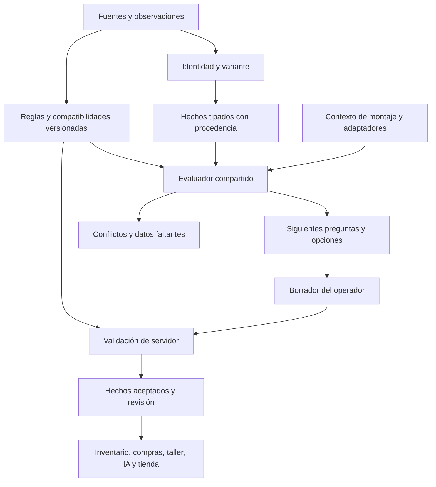

# Arquitectura de fichas técnicas ligadas a identidad y compatibilidad

Diseño: 2026-09-05 (America/Los_Angeles). Actualización: 2026-09-06.
Estado: **base transversal implementada; cobertura mecánica por familias en
desarrollo**. El servidor aplica el contrato versionado desde la migración
`20260906070000`; el editor y el consumidor de taller están integrados en código
y recargados en la sesión macOS existente. No se publicó una nueva distribución
de la app ni se guardó el producto de prueba.

La [evidencia de implementación](../development/product-specs-research-2026-09-05/implementation-result.md)
separa lo entregado de este diseño objetivo: identidad/variante explícita,
referencias con fuente, requisitos de tres estados, conservación del borrador,
validación en servidor y guardado atómico. Las 37 plantillas activas usan la base;
las tres referencias iniciales son cadenas KMC exactas. Esto no certifica todos
los modelos de las 36 familias ni implementa todavía cada relación/adaptador
descrito abajo. Los conteos y defectos de §3 son la auditoría previa al cambio.

La [segunda entrega de cadenas/conectores](../development/product-specs-research-2026-09-05/chain-connector-implementation-2026-09-06.md)
aplica `20260906103000`: anatomía del conector, modelos de cadena objetivo,
reutilización/sentido con fuente, conteos enteros positivos y ocho ediciones OEM
adicionales. Vincular una referencia conserva también la procedencia de hechos
manuales iguales y la evidencia independiente del operador; desvincular sólo
retira lo automático. El motor de conectores pide la identidad de la cadena
instalada y no compara su clase con el número de piñones de la bicicleta.
El [llenado completo por Codex y Claude](../development/product-specs-research-2026-09-05/catalog-fill-execution-plan-2026-09-06.md)
está preparado con auditoría/cola; todavía no se aplicaron lotes de productos.

La [auditoría global y saneamiento](../development/product-specs-research-2026-09-05/global-audit-and-sanitation-2026-09-06.md)
cubre los 1.664 registros, las 136 definiciones y 280 usos de campo.
`20260906150000` está desplegada: 35 dominios numéricos corregidos sin modificar
hechos de productos. El siguiente contrato, `20260906160000`, está en validación
local: `products.spec_template_id` posee la clase técnica y la categoría es su
respaldo. Todos los consumidores deben resolver esa asignación; los hechos
fuera de la nueva ficha siguen disponibles para revisión, excluidos de sus
filtros técnicos y compatibilidad. Ningún conteo de plantillas equivale a
aprobación mecánica de familias ni adelanta el llenado antes del saneamiento global.

Entrada: screenshots del editor de cadenas y petición del dueño de estudiar
bicicleta, conservar el aprendizaje y diseñar las fichas para todas las familias.
Fuentes base: [Sheldon Brown](https://www.sheldonbrown.com/) y
[Park Tool](https://www.parktool.com/en-us/blog/repair-help), desarrolladas en la
[base de conocimiento](bicycle-compatibility-knowledge.md). El screenshot de
otra conversación es contexto visual, no instrucciones ni autorización de
colaboración.

## 1. Decisión principal

La ficha describe **una referencia de producto**, sus interfaces físicas y las
combinaciones que esa referencia admite. No se construye combinando libremente
etiquetas de marcas, perfiles y medidas.

El orden de captura será **tipo de pieza → identidad/variante → construcción e
interfaces → propiedades dependientes → compatibilidades documentadas**.
Si el modelo no está identificado, se permite avanzar con observaciones
parciales. La ausencia de un catálogo del fabricante no impide dar de alta o
vender un producto; sí impide presentar compatibilidad no demostrada como cierta.

La arquitectura combina tres mecanismos:

1. Identidad y referencias con procedencia, para conocer qué producto es.
2. Prerrequisitos y restricciones compartidos, para impedir afirmaciones
   contradictorias y pedir las siguientes decisiones útiles.
3. Relaciones de compatibilidad contextualizadas, para evaluar un montaje
   completo y sus adaptadores sin inventar el cruce de listas independientes.

## 2. Qué está mal en el ejemplo de cadenas

Que la marca sea KMC no excluye compatibilidad Shimano/SRAM/Campagnolo. KMC
publica esa compatibilidad para X8; la X8 Silver/Grey europea declara 6/7/8 y
3/32″. Para esa referencia, 11/128″ sería un conflicto con su identidad técnica.
Los screenshots no muestran un modelo suficiente para adjudicarle esa ficha
específica. La verificación posterior en la app identificó HV408 en el nombre,
con el campo de modelo vacío: no se le asignaron las propiedades de X8.
[KMC X8 USA](https://kmcchain.us/products/x8),
[KMC X8 Europe](https://www.kmcchain.eu/products/x8-silver-grey).

Los defectos semánticos visibles son:

- «Ecosistema principal» obliga a escoger un dueño técnico singular donde
  puede existir compatibilidad entre sistemas sin dueño singular.
- «Perfil Campagnolo» mezcla marca y perfil físico sin generación ni evidencia.
- Los campos de velocidades y sistemas no conservan qué velocidades aplican
  a cada sistema. Su producto cartesiano introduce afirmaciones nuevas.
- Un ancho utilizado para sugerir velocidades termina pareciendo una
  certificación del fabricante. La medición y la declaración no son equivalentes.
- «Incluye eslabón rápido = falso» debe distinguirse de «no se ha confirmado».

No sustituir esto por la regla «KMC sólo admite KMC» ni por «toda cadena
estrecha sirve en 9/10/11». Una KMC eGlide admite esas velocidades **en
LINKGLIDE**. [KMC eGlide](https://kmcchain.us/products/eglide).

## 3. Lo que ya existe y se reutiliza

Auditoría de sólo lectura, 2026-09-05 (PDT); HEAD observado
`71926a11`, rama `smartpegas1.0`, checkout compartido con cambios ajenos.
Los conteos y archivos reproducibles están en
[evidencia de la auditoría](../development/product-specs-research-2026-09-05/README.md).

| Límite actual | Hallazgo verificado | Consecuencia para el diseño |
|---|---|---|
| Catálogo de plantillas | 37 plantillas activas, 36 familias, 241 campos | Ampliar el backbone existente; no crear formularios independientes |
| Reglas declarativas | 22 campos con `option_rules`, todos en cuatro plantillas de pedalier; 30 con visibilidad | Las reglas de otras familias no están centralizadas allí; cero reglas declarativas no significa cero lógica Flutter |
| Catálogo Viñabike | 137 categorías activas, 112 hojas; 72 hojas sin plantilla activa directa | Separar categorías contenedoras, servicios, productos simples y familias técnicas; no etiquetar las 72 como errores de catálogo |
| Persistencia | `spec_facts` + `spec_fact_values` + `spec_definition_values`; `product_spec_values` es espejo | Mantener hechos normalizados como autoridad y evitar otro almacén de ficha paralelo |
| Guardado | `save_product_spec_facts_v1(uuid,uuid[],jsonb)` usa tenant y bloqueo de producto | Conservar esos límites, agregar revisión y validación del agregado |
| Validación servidor inspeccionada | Forma, cardinalidad y rechazo de etiquetas amplias en dos campos; no evalúa el conjunto de reglas de plantilla | El servidor necesita resolver plantilla, identidad y restricciones, también para OCR/importaciones/API |
| Cliente | Inferencia y restricciones de transmisión en `drivetrain_canonical_data.dart`; reglas JSON en `SpecTemplateField` | Sustituir duplicación gradual por un contrato versionado común |

La sonda local del resolvedor reprodujo un estado internamente contradictorio:
con 11/128 y ancho externo 7,1, ofrece 6/7/8; conserva Campagnolo como única
opción de perfil y a la vez excluye 7,1 de los anchos ofrecidos. Es evidencia
del resolvedor, **no** una prueba de guardado ni una reproducción de toda la UI.

Otros límites que la migración debe resolver:

- `SpecTemplateField` trata un operador desconocido como verdadero y normaliza
  listas mediante texto; no tiene semántica declarativa suficiente para tuplas.
- El formulario continúa si `allowedOptions` es vacío, aunque un conjunto
  vacío debería representar conflicto; además elimina valores ocultos o no
  permitidos en una pasada, lo que puede dejar dependencias por reevaluar.
- Las opciones vuelven a serializarse por etiqueta aunque ya existen IDs de
  vocabulario. La RPC omite etiquetas que no encuentra mediante un join.
- Un error al cargar hechos devuelve `{}`; un error de plantilla devuelve
  `null`. No deben transformarse en ficha vacía editable.
- El producto se guarda antes de la ficha en dos operaciones. La transacción
  actual de specs no vuelve atómico el guardado completo del producto.

## 4. Modelo semántico

| Concepto | Contenido | Lo que no permite deducir |
|---|---|---|
| Identidad comercial | Fabricante/marca declarada, modelo, MPN, GTIN, variante, presentación | Compatibilidad por marca, autenticidad por coincidencia de texto |
| Familia técnica | Tipo y función de pieza: cadena, cassette, espaciador, etc. | Modelo exacto ni prestaciones por categoría comercial |
| Propiedad intrínseca | Material, ancho interior, longitud de pasador, diámetro, lado, montaje | Aprobación del conjunto donde se pretende instalar |
| Capacidad declarada | Una referencia admite determinado conjunto/rango según evidencia | Todas las combinaciones de varios conjuntos de opciones |
| Interfaz | Superficie o conexión: cassette–núcleo, cadena–dentado, cuadro–pedalier | Compatibilidad con una bicicleta entera |
| Contexto de montaje | Componente objetivo, posición, configuración, adaptadores y límites | Identidad de la pieza que se vende |
| Evidencia | Publicación, etiqueta, medición o confirmación, con alcance y revisión | Certeza más fuerte que la que expresa la fuente |
| Estado de taller | Desgaste, pieza instalada, longitud recortada, intervención | Especificación de todas las unidades nuevas del producto |

Un mismo modelo puede tener variantes incompatibles. Una variante técnica puede
ofrecer distintos packs: no confundir cantidad de artículos, cantidad de
eslabones suministrados y longitud instalada. No poner la cantidad de compra
en la identidad del producto. Se conserva el contrato
[identidad versus fitment](product-identity-matching-contract.md).

### 4.1 Enlace a la identidad

Reutilizar `products`, sus identificadores y el resolvedor de identidad. Añadir
una vinculación explícita a una **revisión de variante técnica** cuando exista
evidencia suficiente. No deducir ese enlace silenciosamente del nombre o marca.

El catálogo de referencias del fabricante se distingue del inventario del
tenant: puede contener piezas OEM/no vendibles. Sus afirmaciones son evidencia
de referencia; los `spec_facts` del producto siguen siendo la verdad aceptada
local. Cada hecho heredado conserva la revisión de referencia que lo respalda.
Una corrección del catálogo genera una propuesta de actualización; no cambia
los productos o bicicletas ya confirmados durante una lectura.

Estados de identidad: `unresolved`, `family_known`, `model_resolved`,
`variant_resolved`, `conflicting`. Una identidad sin modelo puede tener una
medida confirmada; una identidad exacta puede carecer de datos de compatibilidad.
No colapsar ambas cosas en un porcentaje de «ficha completa».

### 4.2 Valor, procedencia y estado son dimensiones distintas

Extender el backbone, sin reutilizar el booleano `confirmed` para todo:

- Valor tipado: escalar, conjunto discreto, intervalo con inclusividad, rango
  de aplicación o tupla. Los rangos aplicables no son tolerancias de medición.
- Estado epistemológico: `unknown`, `asserted`, `verified`, `conflicting`.
- Aplicabilidad: `applicable`, `not_applicable`, `undetermined`.
- Procedencia: fabricante, etiqueta, medición, mecánico, importación o lectura
  asistida; incluye autor, fecha y referencia. Manual no equivale a verificado.
- Medición: dimensión observada, unidad, nominal/medido y tolerancia/método.
- Versión: revisión de ficha, referencia y paquete de reglas utilizado.

Los booleanos nuevos admiten desconocido. `false`, `0`, vacío, desconocido y
no aplica tienen significados diferentes. Un `is_set` no acepta «desconocido»
como prerrequisito confirmado.

### 4.3 Compatibilidad como relaciones y recetas de conjunto

Una afirmación lleva `subject_variant`, `target_interface/model`, relación,
condiciones, exclusiones, evidencia y revisión. Las condiciones de una fila
se cumplen juntas (AND); las filas representan alternativas (OR).

Ejemplo conceptual para eGlide, derivado de K04:

```json
{
  "subject": {"manufacturer": "KMC", "model": "eGlide"},
  "relation": "supports_drivetrain",
  "alternatives": [
    {"system": "shimano_linkglide", "rear_sprocket_counts": [9, 10, 11]}
  ],
  "evidence": "K04",
  "scope": "manufacturer_declared"
}
```

Estos códigos ilustran el contrato, **no** son IDs/valores para insertar en
producción. «Shimano, SRAM, Campagnolo» como etiquetas de resumen se deriva
de relaciones concretas; nunca genera relaciones nuevas.

Un montaje puede requerir más de dos piezas: cambio, cassette, cadena, plato,
cuadro y control. Las compatibilidades por pares no garantizan el conjunto;
usar una receta con todos los participantes cuando la fuente lo exige.
La relación no es necesariamente simétrica ni transitiva. Los adaptadores son
participantes con identidad, dirección, condiciones y disponibilidad; no un
booleano «con adaptador».

## 5. Prerrequisitos y motor de restricciones

No existe una jerarquía universal «ecosistema → velocidad → ancho». Cada familia
define sus decisiones iniciales. [Matriz completa](product-spec-family-matrix.md).



### 5.1 Clases de regla

| Clase | Ejemplo | Efecto |
|---|---|---|
| Prerrequisito | Elegir lado antes de interfaces de maza | Espera una decisión; no infiere respuesta |
| Aplicabilidad | Un conector tiene ficha distinta del pack de cadena | Expone el subconjunto pertinente |
| Derivación cierta | Variante verificada fija una propiedad declarada | Deriva con enlace a sus premisas |
| Restricción física | BSD incompatibles para montaje directo | Descarta ese montaje bajo ese alcance |
| Declaración de fabricante | Cadena y sistema publicados juntos | Habilita la relación concreta |
| Incompatibilidad explícita | Road Flattop con Eagle convencional | Rechaza el conjunto concreto |
| Condición de montaje | XD en XDR necesita espaciador | Retorna requisito, no compatible directo |
| Requisito de evidencia | Manguera de modelo desconocido | Retorna falta de información |

Cada regla debe incluir ID/revisión, familias, participantes, campos leídos,
operador, consecuencia, ámbito, explicación, fuentes, ejemplos positivos,
negativos y desconocidos. Sin fuente suficiente no se activa como afirmación
de compatibilidad. Se permiten restricciones de coherencia del propio esquema
sin fuente externa, identificándolas como invariantes del sistema.

### 5.2 Semántica computacional

- IDs estables para familias, atributos, unidades y valores. Las etiquetas
  españolas son presentación; renombrarlas no cambia una regla.
- Operadores tipados: igualdad, conjuntos `contains_any/contains_all/subset`,
  intervalos, tuplas, condiciones AND/OR, negación explícita y estados de evidencia.
  Rechazar operadores desconocidos al publicar un paquete de reglas.
- Grafo acíclico para **derivaciones**. Las restricciones entre interfaces
  pueden ser bidireccionales: evaluar hasta un punto fijo monótono, con límite
  de iteraciones y diagnóstico si la configuración no converge.
- Intersecar restricciones aplicables; nunca sumar opciones incompatibles.
  `unconstrained`, `allowed(set)` y `contradiction(empty)` son tres resultados
  distintos. Falta de datos no es una intersección vacía.
- No inferir hechos desde un singleton producido por falta de catálogo.
  Sólo una regla de derivación respaldada autoriza rellenar un valor.
- Un conflicto de premisas se propaga como conflicto; no se toma una premisa
  conveniente para «reparar» automáticamente el resto.
- El resultado es determinista para los mismos hechos/contexto/versiones e
  independiente del orden en que se seleccionaron los campos.

La disponibilidad del catálogo no es una restricción física: si no tenemos una
variante cargada, el operador puede documentarla como desconocida/en revisión.
No presentar la lista actual como inventario de todo lo que existe en bicicleta.

### 5.3 Qué ocurre al cambiar un prerrequisito

Primero se calcula un delta sin guardar: derivaciones caducas, observaciones que
siguen válidas y campos en conflicto. Las derivaciones se invalidan con su
procedencia. Los valores manuales permanecen visibles en el borrador como
conflicto hasta que el operador los corrija, descarte o cambie el contexto.

No borrar silenciosamente. Un campo que dejó de aplicar pero tenía valor
reaparece en el resumen de cambios, con causa y opción de recuperar el borrador.
La cascada completa se valida antes de habilitar la confirmación. Cambiar modelo,
familia, lado, modo o variante ejecuta el mismo procedimiento.

## 6. Contrato de interacción

Dentro de `Ficha técnica`, conservar contexto del producto y organizar:

1. **Identidad técnica**: familia, modelo/referencia, variante y evidencia;
   acción «Identificar desde etiqueta o documento» con propuesta revisable.
2. **Construcción e interfaces**: siguientes decisiones necesarias, luego
   medidas dependientes. Una referencia identificada muestra lo que ya declara.
3. **Compatibilidades**: filas concretas por sistema/modelo y condiciones,
   con qué está confirmado y qué falta. Sin chips de marcas como certificado.
4. **Contenido y propiedades**: cantidad, terminación y prestaciones secundarias.
   El orden exacto responde a la familia, no a las columnas de base de datos.

Mostrar «Confirmado», «Declarado», «Por verificar» o «En conflicto» junto al
dato cuando ayude a decidir. Explicación breve local: «Confirma primero el
montaje»; «Esta referencia declara 3/32″»; «Falta el modelo del cáliper».
Los IDs y versiones viven en detalle técnico, no en el flujo ordinario.

Las opciones incompatibles conocidas se deshabilitan con razón cuando ayudan
a entender el conflicto. Las ajenas a la rama se ocultan si no contienen datos.
Las posibilidades sin evidencia se presentan como pendientes, nunca como
verdes ni como imposibles. Un fallo de carga mantiene el borrador y ofrece
reintentar; no habilita guardar un vacío ficticio.

Desktop puede usar filas compactas y contexto lateral. Tablet y teléfono
recomponen las mismas decisiones, sin perder datos, foco ni acceso a conflictos.
Aplican las [reglas de formulario](../../.github/GUI_DESIGN_PRINCIPLES.md) y
[guía móvil](../../.github/GUI_MOBILE_DESIGN_PRINCIPLES.md). No se especifican
colores, radios o medidas visuales aquí: una implementación debe leer sus
valores de DesignSync y verificar los hosts de `canonical-ui-surfaces.md`.

## 7. Persistencia y proyecciones

### 7.1 Un único contrato de escritura

Diseñar una revisión del comando de guardado que:

- Resuelva tenant, permisos, familia y plantilla del lado servidor; no confíe
  en la lista de definiciones enviada por el cliente.
- Reciba revisión esperada del producto/ficha, versión de reglas, identidad,
  delta tipado, procedencia y clave de idempotencia.
- Bajo el mismo bloqueo, componga el estado propuesto completo y ejecute las
  restricciones antes de escribir hechos. Versiones obsoletas devuelven un
  conflicto revisable. Serializar no basta para evitar actualización perdida.
- Rechace valores desconocidos y campos ajenos con errores por campo; nunca
  los omita por un join de etiquetas.
- Guarde identidad técnica y hechos como un agregado atómico; mantenga
  espejos, resumen JSON y eventos después de la validación, en la misma
  transacción cuando pertenezcan a la base.
- Audite qué cambió, premisas, evidencia y actor. Mantenga los límites de
  tenant para hechos, referencias privadas, claims y borradores.

Una declaración contradictoria puede conservarse como **borrador/evidencia
en disputa**, pero no ingresar a los hechos aceptados ni salir como compatible.
Los cambios comerciales independientes de un producto legado siguen posibles;
si una operación guarda sólo ese subconjunto, debe ser explícito y atómico,
conservando la última ficha aceptada. Nunca mostrar «todo guardado» tras un
fallo parcial de specs.

Guardar parcialmente una ficha sin contradicciones es válido: «incompleta» no
es «inválida». Confirmar compatibilidad de un montaje exige sus campos críticos.

### 7.2 Piezas lógicas a añadir, no esquema ya existente

| Pieza | Integración prevista |
|---|---|
| Referencias y variantes versionadas | Catálogo no comercial, enlazado a identidad ya existente; reutilizar entidades equivalentes si el inventario de esquema las demuestra |
| Fuentes y afirmaciones de referencia | Registro de evidencia del fabricante/observación con alcance y revisión; no espejo alternativo de hechos del tenant |
| Binding de producto a variante | Vínculo tenant–producto–referencia con procedencia y revisión |
| Paquetes de reglas | Extensión de plantillas/definiciones y relaciones de interfaces, con versiones inmutables publicadas |
| Claims y recetas | Relaciones n-arias para configuraciones admitidas, excluidas o condicionadas |
| Revisión/borrador de ficha | Mantiene observaciones y conflictos fuera de hechos aceptados |
| Resultado de evaluación | Hechos/revisiones/contexto usados, campos faltantes y causas; caché invalidable, no fuente de verdad |

Estos nombres describen responsabilidades, no autorización para crear siete
tablas automáticamente. La implementación inspeccionará constraints/RLS/owners
actuales antes de decidir la migración mínima. No ampliar `spec_facts.subject_type`
para referencias globales sin resolver primero su tenant y alcance.

### 7.3 Todos los consumidores

Inventario, alta masiva, OCR, importación, IA, compras, taller y publicación
consumen el mismo evaluador/revisión. Flutter ofrece respuesta inmediata, pero
no es el único guardián. Los endpoints viejos y escrituras directas necesitan
la misma validación o un retiro explícito de permisos después de migrarlos.

La IA extrae afirmaciones candidatas y busca fuentes; no inventa IDs, deduce
perfil por marca ni crea compatibilidades por similitud. Una lectura del nombre
conserva su recibo y menor autoridad. Identidad igual no implica montaje igual;
montaje compatible no implica producto duplicado.

`bike_profiles` conserva lo instalado y confirmado. Las fichas aportan evidencia
de la pieza; una edición posterior del producto no reescribe automáticamente
una bicicleta ni una visita. Mantener posiciones y scopes y el contrato de
[workshop](../../BIKE_WORKSHOP_MASTER_SCHEMA.md). PDF/tienda/feeds sólo publican
afirmaciones aceptadas y sus límites, con proyecciones que no filtren evidencia
privada del tenant.

## 8. Resultado de compatibilidad

| Resultado | Requisito |
|---|---|
| Compatible confirmado | Todas las interfaces críticas de esa consulta tienen soporte vigente y no hay conflicto |
| Compatible con condiciones | Existe una receta soportada, con requisitos adicionales explícitos aún por resolver o instalar |
| Incompatible | Hay una contradicción aplicable demostrada para ese montaje; indicar alcance directo/adaptado |
| Sin confirmar | Falta dato, cobertura o evidencia, sin contradicción demostrada |
| En conflicto | Hechos o fuentes aplicables se contradicen; necesita resolución |

Una consulta puede confirmar una **interfaz** y seguir sin confirmar el montaje
entero. No mostrar el primer resultado como aprobación global. Ausencia de regla
positiva no implica incompatibilidad; ausencia de regla negativa no la aprueba.

## 9. Migración por entregas verificables

1. **Inventario semántico**: mapear las hojas reales, sus campos y escritores;
   clasificar aliases, datos ambiguos y claims sin evidencia. Este documento y
   la matriz son el punto de partida, no un backfill autorizado.
2. **Núcleo común**: estados, IDs, versión de reglas, evaluador, errores y
   comando atómico. Cadenas y conectores como primera implementación completa,
   incluyendo KMC multicompatible y LINKGLIDE como controles positivos.
3. **Transmisión restante y pedalier**: integrar las reglas actuales útiles y
   retirar las bandas de ancho/perfiles universales sin soporte; no romper
   reglas de pedalier válidas al centralizarlas.
4. **Frenos y ruedas**: interfaces de seguridad, SHIS/rodamientos, cámaras y
   consumibles; completar plantillas superficiales y categorías sin mapeo.
5. **Contacto, suspensión, e-bike y resto del catálogo**: activar familias
   según cobertura de fuentes, manteniendo explícitos los huecos de evidencia.
6. **Datos legados**: previsualización con conteos, causas y procedencias;
   revisión y migración por ámbito. No limpiar ni «corregir» productos por
   nombre, marca o heurística. Los snapshots históricos permanecen auditables.

Una regla nueva entra primero en evaluación comparativa sin alterar los hechos;
se revisan falsos positivos/negativos antes de activarla. No hacer un periodo
de «sólo advertencias» equivalente a publicar compatibilidades no validadas.
Rollback de versión conserva datos, referencias y eventos; nunca restaura en
silencio afirmaciones que ya se sabe contradictorias.

## 10. Aceptación de una futura implementación

Las fixtures se derivan de las fuentes y casos reales, no de copiar el código.
Esta ronda sólo ejecutó una sonda local y lecturas; esta lista aún no está probada.

- X8 identificada: 6/7/8 y compatibilidad cruzada permitidas según fuente;
  11/128 contradice la referencia. Marca KMC no obliga a ecosistema KMC.
- X11 identificada no se transforma en universal 9/10/11 por su ancho.
- eGlide 9/10/11 LINKGLIDE es válida; esas velocidades no autorizan otros sistemas.
- Road Flattop, Eagle y T-Type preservan prohibiciones y excepciones documentadas.
- Cambiar modelo/prerrequisito invalida sólo derivados y conserva conflictos
  manuales. Revertir un cambio recupera el borrador sin valores fantasma.
- Reordenar las selecciones produce el mismo resultado final. Conjunto vacío,
  desconocido, no aplica, falso y operador inválido se distinguen.
- XD→XDR condicionado no habilita XDR→XD; dos interfaces compatibles no certifican
  una receta completa. Un adaptador existente no prueba que esté instalado.
- Casos positivos, negativos y desconocidos de **cada fila de la matriz**:
  incluyen ISO/BSD, tiro, SHIS, pedalier de dos interfaces y suspensión.
- Cliente/API/OCR/importación producen el mismo rechazo sobre el mismo estado.
  Escritura parcial, concurrencia, reintento y plantilla obsoleta son verificables.
- Cambio de etiqueta o idioma no rompe IDs; error de carga no borra hechos;
  producto guardado y ficha fallida nunca aparecen como éxito completo.
- RLS/tenant, espejos, proyección pública y lectores legados conservan contratos.
- Pruebas de dominio y servidor, read-back productivo al desplegar, y frames
  reales en hosts registrados, desktop/tablet/teléfono, claro/oscuro, antes de
  llamar a la implementación terminada.


### Frontera de datos retirados (2026-09-06, implementación local)

Un rol `legacy` pertenece al uso del campo en una plantilla, no al nombre global de la definición. Su valor permanece auditable con ID, fuente, confirmación, opciones, lecturas y timestamps; omitirlo al guardar o reenviarlo sin cambios no lo borra ni lo reatribuye. La validación sólo recibe hechos activos de la plantilla, también al evaluar prerequisitos y pares de medidas. Los lectores de búsqueda, compras, taller y tienda usan esa misma frontera. La escritura ordinaria rechaza cambiar un hecho retirado; una corrección histórica necesita un comando de reparación explícito y trazable.

Un kit de fabricante puede tener varios miembros técnicos sin ser un set comercial de inventario. Cada miembro necesita identidad/función/interfaz propia. Los flags comerciales, stock e hijos existentes no se modifican para describir esa composición técnica.


### Condiciones tipadas y transporte exacto (2026-09-06, borrador 180000)

Las relaciones v2 declaran `value_type` en cada condición: `decimal`, `token` o `boolean`. Los decimales viajan como cadenas desde PostgreSQL; el cliente compara su representación decimal exacta, sin `double` ni conversión a entero de ancho fijo. Un JSON number recibido como observación v2 queda desconocido, porque un cliente web podría haberlo redondeado antes de evaluar. La proyección productiva de configuraciones a este formato sigue siendo un gate: los contextos antiguos no satisfacen automáticamente ese contrato.

`eq`/`in` respetan el tipo declarado: el token de modelo `01` no equivale a `1`; los decimales `28.60` y `28.6` sí representan la misma magnitud; `false` booleano no equivale al texto `false`. `lt/lte/gt/gte` requieren magnitudes. Una fila junta requisitos; las alternativas preservan sus parejas de medidas y fuentes. Fuera de las filas declaradas no significa incompatibilidad física.

Cliente y servidor validan la misma gramática de URL de fuente: HTTP(S), host DNS, puerto numérico válido, ruta codificada; no credenciales, IP literal ni escapes incompletos. No se sustituye una URL malformada por una fuente supuesta. Las fixtures compartidas incluyen puertos inválidos y medidas que antes se confundían por redondeo. La igualdad estructural del motor no reemplaza la revisión de la afirmación OEM.

### Identidad de definición antes de etiqueta (2026-09-06)

Un tenant puede definir una clave igual a una definición global. El ID que pertenece a la plantilla efectiva se resuelve antes de producir la bolsa de etiquetas o evaluar criterios. Un hecho con la misma clave pero otro ID permanece fuera de la ficha, con su valor propio y procedencia en datos conservados. No puede satisfacer búsquedas, sobrescribir la observación vigente ni cambiar el resultado de una comparación de guardado sin cambios.

El lector automático de compras usa esa misma resolución, rechaza campos legacy/no asignados y valida las dependencias antes de devolver éxito. La proyección histórica verifica tipo y alcance del sujeto también en DELETE: borrar una observación de bicicleta no puede borrar la proyección de un producto aunque sus UUID coincidan.


### Observaciones que conservan su configuración (190000, 2026-09-06)

Los campos `json` con `validation_rules.rows_schema` usan `spec_facts.value_json`.
Cada fila conserva un ID, sus celdas tipadas y sus fuentes. Nunca se proyectan
listas de diámetros y anchos independientes: la pareja pertenece a la misma
fila. El esquema cierra claves/tipos, conserva decimales como texto exacto,
distingue booleano falso de ausente, comprueba la unicidad declarada cuando
corresponde al objeto y valida
mínimo/máximo dentro de la fila. Falta de dato es observación incompleta.

Las referencias y hechos fijan el significado del esquema: editarlo o borrarlo
requiere una migración explícita. Un guard toma `FOR SHARE` de la definición al
escribir una fila o referencia; la edición de metadata toma la fila de definición.
El escritor antiguo rechaza la ficha estructurada incluso si omite su campo.
La historia conserva definición y esquema; los consumidores públicos muestran
etiquetas/unidades. `get_product_spec_typed_configurations_v1` lleva revisión,
plantilla efectiva, IDs de definición, tipo explícito y números leídos como
`numeric::text`, sin inferir identidad ni elegir un miembro de un conjunto.
La adopción por los evaluadores de ensamblajes es una fase posterior; este
transporte por sí solo no aprueba un montaje ni llena productos.


### Requisitos de ficha por campo (2026-09-06, migración 20260906200000)

El contrato opt-in `rules_version:2` distingue aplicabilidad (`allowed_when`),
completitud (`required_when`), prerrequisitos y subconjuntos de opciones. La AST
cerrada admite constantes y alternativas de predicados tipados; no expresa
compatibilidad de un ensamblaje. Las guardas diferidas validan el contrato final
tras insertar sus campos y serializan cambios concurrentes de metadatos. Su grafo
incluye la visibilidad heredada, que se conjuga con la nueva en UI y SQL.
Una dependencia retirada/ajena, un ciclo o un token fuera del dominio invalida
la definición de la ficha. Una respuesta faltante produce pendiente; una
respuesta contraria a su aplicabilidad se conserva visible y bloquea guardar.
Cambiar una clave o unidad incrementa la revisión de sus plantillas.

La compilación global es propuesta mientras sus gates sean falsos. Ni el
flag `verified` del borrador de Claude ni un fixture sintético certifican una
regla mecánica. El [checkpoint global](../development/product-specs-research-2026-09-05/global-audit-and-sanitation-2026-09-06.md)
separa código aplicado, metadatos compilados, evidencia y productos aún sin llenar.

### Transporte exacto del editor (2026-09-07, migración 20260907010000)

El editor y su lector de plantillas por categoría usan
`get_product_spec_editor_context_v2`: observaciones, definición, opciones,
límites y versión salen de una única instantánea SQL. Los números escalares,
valores iniciales y límites viajan como texto decimal desde PostgreSQL; volver
a convertir un `double` a texto no recupera sus dígitos. Los identificadores,
versiones, booleanos, tokens y sobres de filas conservan sus tipos propios.
`get_product_spec_references_v2` aplica lo mismo a los hechos OEM.

El campo de entrada conserva texto, incluida la coma decimal, el signo y un
exponente incompleto mientras se escribe; sólo el validador exacto decide si
es guardable. El escritor agregado usa la cadena canónica y compara min/max,
positividad e integridad sin conversión binaria. Un número de máquina heredado
fuera de la magnitud segura se rechaza; el usuario debe recargar su fuente,
no se inventan los dígitos perdidos. El parser comprueba el exponente mínimo
antes de restar escala para evitar desbordamiento nativo.

Las funciones v1 mantienen su formato y hash; este cambio no altera los hechos
del catálogo, bicicletas o trabajos ni su procedencia. Las lecturas de otros
consumidores y los criterios propios de compras no quedan declarados exactos
por este cambio: requieren su adopción del transporte tipado y prueba efectiva.


### Coherencia entre configuraciones (2026-09-07, 0200 aplicado/verificado)

La plantilla puede declarar `row_coherence: {version: 1, links: [{id, field,
column, target_field, label_columns}]}` y `scalar_ordered_pairs: [[min, max]]`
con `rules_version: 2`. El enlace almacena `row.id`, nunca una etiqueta; no
infiere identidad por `unique_by`. El selector presenta rótulos derivados y
conserva valores huérfanos hasta su corrección. Unknown completo es pendiente;
ID ajeno conocido y formato inválido bloquean. La integridad alcanza la RPC y
los constraints diferidos existentes, y las parejas comparan números exactos
en la misma unidad. Ambos extremos de un rango contradictorio se omiten del
sitio público. No es una regla de ajuste mecánico ni de suma de potencias.

Insertar o modificar relaciones sobre definiciones con hechos/referencias
requiere migración de datos revisada; cambiar sólo rótulos no reasigna filas.
Los lectores tipados conservan IDs y ofrecen `row_labels` aparte. Todo aplicador
debe preservar IDs de filas no reemplazadas y el historial de evidencia.
Ver [implementación, diferencias y límites](../development/product-specs-research-2026-09-05/row-coherence-integration-2026-09-07.md).

### Citas numéricas del lector (2026-09-07, 2100)

El lector preserva ceros enteros, signos y precisión exacta al contrastar un
número con su cita; null/NaN/infinito se rechazan. Una cifra no demuestra por
sí sola el campo, unidad o identidad del producto. El lector mantiene su
procedencia `name_reading` sin convertirla en aprobación OEM. No hace conversión
de unidades ni aritmética sobre la cita. Verificador productivo:
`product-spec-number-quotes-verify.sql`, en la carpeta de investigación.

### Requisitos dentro de una configuración (2026-09-07, 2200 aplicado/verificado)

`form_contract.row_conditions` versión 1 declara por campo de filas los mapas
`allowed_when`, `required_when` y `allowed_options` de sus columnas. Requiere
`rules_version: 2`; cada predicado consume exclusivamente celdas de esa misma
fila con tipos y números exactos. No toma requisitos de otra fila ni del nivel
escalar. Se validan dominios, columnas, opciones y ciclos al publicar. Un
`required` estático del esquema no puede debilitarse mediante una condición.

Una respuesta desconocida deja un pendiente; una respuesta conocida que vuelve
inaplicable un dato conservado produce `row_field_applicability` bloqueante.
El editor sincroniza el retiro explícito de ese dato y restringe también los
selectores de tokens abiertos y referencias. Una fila parcial se conserva con
sus IDs y fuentes. Estas reglas no son una aprobación mecánica OEM.

La versión de plantilla se lee bajo SHARE antes de guardar el agregado. Al
publicar coherencia, las definiciones afectadas se bloquean en orden estable
contra los escritores de hechos/referencias y la población se consulta después
de esperar. La prueba en ambos órdenes reproduce y corrige la carrera del alta
y de referencias; un deadlock revierte la transacción y exige releer antes de
reintentar. No se relajan procedencias ni permisos de `bike`/`job_bike`.
Evidencia: [condiciones y concurrencia](../development/product-specs-research-2026-09-05/row-condition-integration-2026-09-07.md).

### Investigación autenticada y simulación (2026-09-07, 2300 aplicado/verificado)

`get_product_spec_research_snapshot_v1` lee en una instantánea la identidad
guardada, el editor exacto, todas las observaciones (también huérfanas y con
alcance), opciones y recibos. Sus huellas detectan cambios del producto,
contrato, referencias y evidencia. Una huella no autoriza una escritura.
Los lectores de referencias v1/v2 validan el ámbito global de definición y
opción antes de proyectar sus etiquetas; v1 conserva su transporte anterior.

`preview_product_spec_research_v1` exige esa preimagen actual, aplica un delta
de identidad limitado y simula hechos activos. Una tabla se actualiza por ID
de fila conservando las celdas, filas y fuentes omitidas; se valida el resultado
completo. La referencia debe pertenecer a la familia y sus IDs a la plantilla.
Nunca retorna autorización de aplicación ni aprobación mecánica.

El contrato de propuesta v2 archiva procedencia por campo y requiere revisión
independiente del contenido exacto. El escritor agregado existente no acepta
un delta de investigación como si fuera una ficha completa, pues omitiría
observaciones. El futuro aplicador de sólo ficha debe preservar todo lo ajeno
al delta, bloquear deriva, verificar el backup y producir recibo. El saneamiento
global continúa siendo una condición previa al llenado.

### Valores condicionados y alcance de contenido (2026-09-07)

La infraestructura 2400, aplicada/verificada, amplía `row_conditions` con
`value_when`: antecedentes tipados pueden exigir un valor concreto en la misma
fila. Una contradicción explícita bloquea; ausencia o antecedente desconocido
dejan pendiente. «Kit opcional» no implica accesorio ausente. No se agregan
observaciones automáticamente ni se infiere un SKU desde la aplicación.

El contenido de un producto y su configuración de montaje tienen dueños
distintos. `included_chainring_count` cuenta coronas dentadas suministradas:
un monobloque con dos coronas cuenta dos, aunque sea una unidad comercial.
Las filas de contenido no exigen posiciones de montaje distintas; repuestos
suministrados pueden compartir posición. Opciones no compradas, condiciones
de pesaje y lecturas duplicadas no crean piezas incluidas. La cantidad legacy
no se transforma automáticamente en este conteo.

El motor 2500, aplicado/verificado en producción el 2026-09-07, implementa `row_coherence.version: 2` con
`cardinalities: [{id, field, total_field}]`, además de sus `links` existentes.
Los clientes anteriores rechazan esa versión; no pueden ignorar el conteo.
Cada extremo pertenece a la plantilla activa, el total tiene dominio entero
no negativo y la relación participa del grafo de requisitos. Para filas
válidas con IDs distintos, más filas que el total es conflicto y menos filas
es información incompleta. Un total ausente no se deduce de las filas; una
tabla malformada no se cuenta descartando sus elementos inválidos. Dientes
desconocidos no borran una corona documentada. Igualar el conteo no aprueba un
montaje ni concilia automáticamente `kit_members.quantity` con coronas.

La activación local inicial es sólo para contenido de `crankset`, mediante
`compile_product_spec_cardinality_addendum.py`. La capacidad genérica y la
activación de metadatos son entregas distintas; los resultados y el estado
productivo de 2500 se registran en el
[checkpoint de integración](../development/product-specs-research-2026-09-05/cardinality-integration-2026-09-07.md).
Los conjuntos de
transmisión que no tienen tabla de coronas no reciben esa dependencia.

Una declaración de presión también conserva su alcance documental: cifras
impresas en unidades distintas no se convierten ni se funden, y un máximo
hookless no se promociona a todos los montajes. Repetir un perfil y método en
otra declaración no demuestra por sí solo duplicidad o incompatibilidad. Las
fuentes discrepantes permanecen sin aprobación automática hasta resolver su
alcance, identidad y revisión.

Una fuente que no declara aprobación de un uso no demuestra que ese uso esté
prohibido. Los campos de exclusión (`not_for` u otros) requieren una exclusión
respaldada; la carencia de evidencia queda pendiente. Un proveedor presente
en el título no se convierte en fabricante ni prueba que un registro suelto
sea una contraparte administrativa. Los servicios con materiales y los kits
conservan su unidad comercial durante el saneamiento, con atributos del
material y ejecución del trabajo en sus respectivos dueños. Inactivo cambia
la prioridad operativa, no la pertenencia al alcance de revisión del catálogo.
